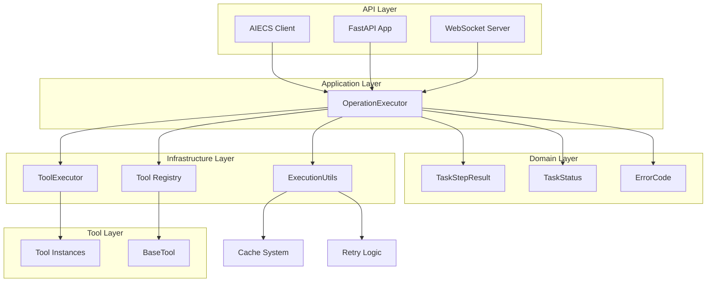
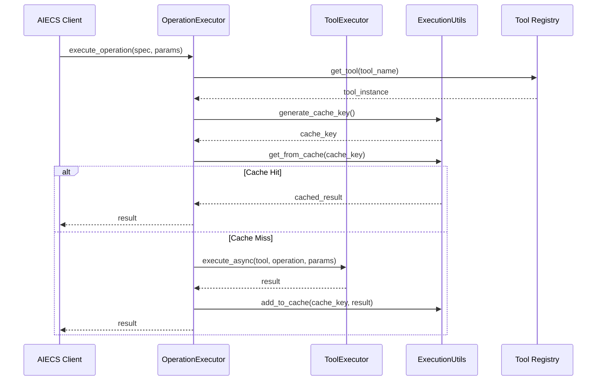
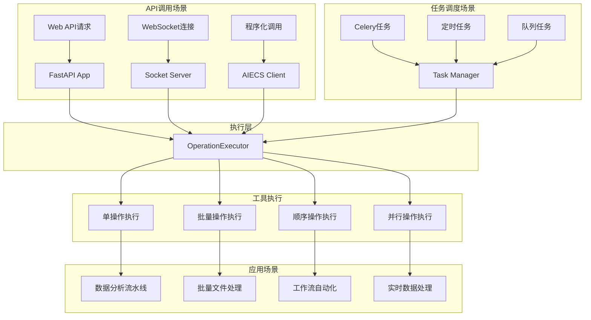
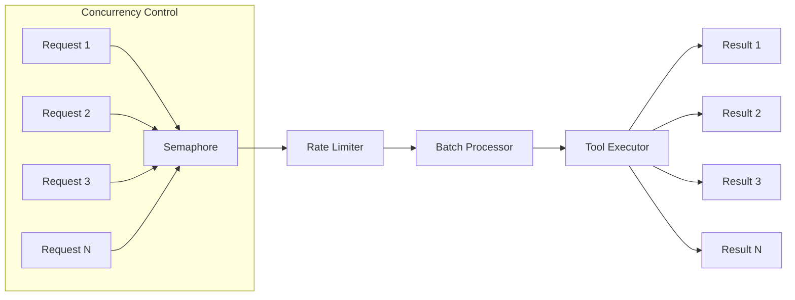

# OperationExecutor 组件技术文档

## 概述

### 设计动机与问题背景

在构建 AI 驱动的应用系统时，开发者面临以下核心挑战：

**1. 工具操作分散化问题**
- 不同工具（数据处理、文档分析、图像处理等）有各自的调用接口
- 缺乏统一的执行标准和错误处理机制
- 工具间的依赖关系难以管理和编排

**2. 复杂业务流程编排困难**
- 需要将多个工具操作串联成复杂的业务流水线
- 参数在操作间传递和引用缺乏标准化方式
- 失败恢复和错误处理策略不统一

**3. 性能和资源管理挑战**
- 大量工具操作需要并发执行以提高效率
- 缺乏统一的缓存、限流和资源管理机制
- 长时间运行的任务缺乏进度跟踪和状态管理

**4. 开发维护成本高**
- 每个工具都需要单独处理异步/同步执行
- 缺乏统一的监控、日志和调试机制
- 新工具集成需要重复编写相似的执行逻辑

**OperationExecutor 的解决方案**：
- **统一执行接口**：为所有工具操作提供一致的调用方式
- **智能编排能力**：支持顺序、并行、批处理等多种执行模式
- **参数引用系统**：通过 `$result[index]` 语法实现操作间数据传递
- **企业级特性**：内置缓存、限流、重试、监控等生产环境必需功能
- **开发友好**：简化工具集成，提供丰富的错误信息和调试支持

### 组件定位

`OperationExecutor` 是 AIECS (AI Execute Services) 系统中的核心应用组件，负责统一管理和执行各种工具操作。作为应用层的执行器，它提供了高级的操作编排、批处理、并发控制和错误处理能力。

## 组件类型与定位

### 组件类型
**应用组件** - 位于应用层 (Application Layer)，属于业务逻辑层

### 架构层次
```
┌─────────────────────────────────────────┐
│            API Layer                    │  ← 上游调用方
│  (FastAPI, WebSocket, AIECS Client)     │
└─────────────────┬───────────────────────┘
                  │
┌─────────────────▼───────────────────────┐
│         Application Layer               │  ← OperationExecutor 所在层
│     (OperationExecutor)                 │
└─────────────────┬───────────────────────┘
                  │
┌─────────────────▼───────────────────────┐
│          Domain Layer                   │
│  (TaskStepResult, TaskStatus, ErrorCode)│
└─────────────────┬───────────────────────┘
                  │
┌─────────────────▼───────────────────────┐
│       Infrastructure Layer              │  ← 下游依赖
│  (ToolExecutor, ExecutionUtils)         │
└─────────────────────────────────────────┘
```

## 上游组件（调用方）

### 1. AIECS Client (`aiecs_client.py`)
- **用途**: 程序化使用 AIECS 服务的主要入口
- **调用方式**: 在完整模式下初始化并使用 OperationExecutor
- **依赖关系**: 直接依赖，通过依赖注入获取实例
- **调用场景**: 
  - 程序化工具调用和批处理
  - 数据分析和处理流水线
  - 自动化脚本和任务编排

### 2. FastAPI 应用 (`main.py`)
- **用途**: Web API 服务，处理 HTTP 请求
- **调用方式**: 通过任务执行 API 间接调用
- **依赖关系**: 间接依赖，通过服务层调用
- **调用场景**:
  - RESTful API 接口调用
  - 任务提交和状态查询
  - 工具列表和元数据获取

### 3. WebSocket 服务 (`socket_server.py`)
- **用途**: 实时通信，处理 WebSocket 连接
- **调用方式**: 通过消息处理间接调用
- **依赖关系**: 间接依赖，通过消息路由调用
- **调用场景**:
  - 实时任务进度推送
  - 客户端实时交互
  - 任务状态实时更新

### 4. Celery 任务管理器 (`infrastructure/messaging/celery_task_manager.py`)
- **用途**: 分布式任务调度和执行
- **调用方式**: 通过任务队列间接调用
- **依赖关系**: 间接依赖，通过任务执行器调用
- **调用场景**:
  - 异步任务执行
  - 分布式计算任务
  - 长时间运行的任务处理

### 5. 任务执行器 (`tasks/worker.py`)
- **用途**: 具体的任务执行逻辑
- **调用方式**: 通过 Celery 任务间接调用
- **依赖关系**: 间接依赖，通过服务实例调用
- **调用场景**:
  - 快速任务执行（fast_tasks 队列）
  - 重型任务执行（heavy_tasks 队列）
  - 任务状态管理和进度推送

## 下游组件（被依赖方）

### 1. ToolExecutor (`tools/tool_executor/tool_executor.py`)
- **用途**: 底层工具执行引擎
- **功能**: 提供同步/异步工具执行、缓存、重试、安全验证
- **依赖类型**: 直接依赖，通过构造函数注入

### 2. ExecutionUtils (`utils/execution_utils.py`)
- **用途**: 执行工具类，提供缓存和重试机制
- **功能**: 缓存管理、重试策略、超时控制
- **依赖类型**: 直接依赖，通过构造函数注入

### 3. 工具注册表 (`tools/__init__.py`)
- **用途**: 工具发现和实例管理
- **功能**: 工具注册、获取工具实例
- **依赖类型**: 直接依赖，通过 `get_tool()` 函数调用

### 4. 领域模型 (`domain/execution/model.py`)
- **用途**: 数据模型定义
- **功能**: TaskStepResult、TaskStatus、ErrorCode 等模型
- **依赖类型**: 直接依赖，用于结果封装

## 关键领域模型

### TaskStepResult
表示单个操作步骤的执行结果，包含完整的执行状态和结果信息。

```python
@dataclass
class TaskStepResult:
    step: str                    # 操作步骤标识 (如 "pandas_tool.read_csv")
    result: Any                  # 操作执行结果
    completed: bool              # 是否成功完成
    message: str                 # 执行消息描述
    status: str                  # 状态码 (pending/running/completed/failed)
    error_code: Optional[str]    # 错误码 (如 "E003")
    error_message: Optional[str] # 详细错误信息
    
    def dict(self) -> Dict[str, Any]:
        """转换为字典格式，便于序列化"""
        return {
            "step": self.step,
            "result": self.result,
            "completed": self.completed,
            "message": self.message,
            "status": self.status,
            "error_code": self.error_code,
            "error_message": self.error_message
        }
```

**示例数据**:
```json
{
    "step": "pandas_tool.read_csv",
    "result": {"rows": 1000, "columns": 5, "data": [...]},
    "completed": true,
    "message": "Successfully loaded CSV file",
    "status": "completed",
    "error_code": null,
    "error_message": null
}
```

### TaskStatus
定义任务执行的各种状态。

```python
class TaskStatus(Enum):
    PENDING = "pending"      # 等待执行
    RUNNING = "running"      # 正在执行
    COMPLETED = "completed"  # 执行完成
    CANCELLED = "cancelled"  # 已取消
    TIMED_OUT = "timed_out"  # 执行超时
    FAILED = "failed"        # 执行失败
```

### ErrorCode
统一的错误码体系，便于错误分类和处理。

```python
class ErrorCode(Enum):
    VALIDATION_ERROR = "E001"    # 参数验证错误
    TIMEOUT_ERROR = "E002"       # 执行超时
    EXECUTION_ERROR = "E003"     # 执行错误
    CANCELLED_ERROR = "E004"     # 取消错误
    RETRY_EXHAUSTED = "E005"     # 重试耗尽
    DATABASE_ERROR = "E006"      # 数据库错误
    DSL_EVALUATION_ERROR = "E007" # DSL评估错误
```

## 核心功能

### 1. 单操作执行
```python
async def execute_operation(self, operation_spec: str, params: Dict[str, Any]) -> Any
```
- 执行单个工具操作
- 支持 `tool_name.operation_name` 格式的操作规范
- 自动处理同步/异步操作
- 参数过滤和验证

#### 参数字典契约 (params Dictionary Contract)

`params` 字典的键值对由具体的工具操作定义，每个工具操作都有其特定的参数要求：

**参数来源**：
- **工具定义**：每个工具类的方法签名定义了所需的参数
- **工具文档**：通过 `list_tools()` 或工具元数据获取参数信息
- **类型提示**：工具方法使用 Python 类型提示声明参数类型

**参数传递规则**：
```python
# 示例：pandas_tool.read_csv 操作
params = {
    "file_path": "data.csv",        # 必需参数
    "encoding": "utf-8",            # 可选参数
    "delimiter": ",",               # 可选参数
    "user_id": "user123",           # 系统参数（会被过滤）
    "task_id": "task456"            # 系统参数（会被过滤）
}

# 系统参数会被自动过滤，只传递工具需要的参数
# 实际传递给工具的参数：
# {
#     "file_path": "data.csv",
#     "encoding": "utf-8", 
#     "delimiter": ","
# }
```

**如何查找工具参数**：
1. 使用 `list_tools()` 获取工具列表和基本信息
2. 查看工具源码中的方法签名和文档字符串
3. 参考 [工具开发指南](./TOOL_DEVELOPMENT_GUIDE.md) 了解参数定义规范
4. 运行时错误会提示缺少的参数名称

### 2. 批量操作执行
```python
async def batch_execute_operations(self, operations: List[Dict[str, Any]]) -> List[Any]
```
- 批量执行多个操作
- 支持速率限制和批处理大小控制
- 并发执行提高性能

### 3. 顺序操作执行
```python
async def execute_operations_sequence(self, operations: List[Dict[str, Any]], 
                                    user_id: str, task_id: str,
                                    stop_on_failure: bool = False, 
                                    save_callback=None) -> List[TaskStepResult]
```
- 按顺序执行操作序列
- 支持失败时停止执行
- 支持步骤结果保存回调
- 参数引用处理（如 `$result[0].data.field`）

### 4. 并行操作执行
```python
async def execute_parallel_operations(self, operations: List[Dict[str, Any]]) -> List[TaskStepResult]
```
- 并行执行多个操作
- 异常处理和结果聚合
- 适合无依赖关系的操作

### 5. 工具调用批处理
```python
async def batch_tool_calls(self, tool_calls: List[Dict], tool_executor_func=None) -> List[Any]
```
- 批量执行工具调用
- 支持自定义执行器函数
- 速率限制和缓存支持

## 技术特性

### 1. 参数处理
- **系统参数过滤**: 自动过滤 `user_id`、`task_id` 等系统参数
- **参数引用解析**: 支持 `$result[index]` 格式的参数引用
- **嵌套属性访问**: 支持 `$result[0].data.field` 格式的属性访问

### 2. 缓存机制
- **上下文感知缓存**: 基于用户ID、任务ID和参数的缓存键
- **TTL支持**: 可配置的缓存生存时间
- **缓存失效**: 自动处理过期缓存

### 3. 并发控制
- **信号量限制**: 使用 `asyncio.Semaphore` 控制并发数
- **速率限制**: 可配置的每秒请求数限制
- **批处理大小**: 可配置的批处理大小

### 4. 错误处理
- **异常捕获**: 全面的异常捕获和处理
- **错误码映射**: 统一的错误码体系
- **失败恢复**: 支持失败时停止或继续执行

### 5. 工具管理
- **延迟加载**: 工具实例按需创建
- **实例缓存**: 缓存已创建的工具实例
- **工具发现**: 支持动态工具发现和注册

## API 接口

### 构造函数
```python
def __init__(self, tool_executor: ToolExecutor, execution_utils: ExecutionUtils, config: Dict[str, Any])
```

**参数**:
- `tool_executor`: 工具执行器实例
- `execution_utils`: 执行工具类实例
- `config`: 配置字典

**配置选项**:
- `rate_limit_requests_per_second`: 每秒请求数限制 (默认: 5)
- `batch_size`: 批处理大小 (默认: 10)
- `enable_cache`: 启用缓存 (默认: True)

### 主要方法

#### 1. execute_operation
```python
async def execute_operation(self, operation_spec: str, params: Dict[str, Any]) -> Any
```
执行单个操作

#### 2. batch_execute_operations
```python
async def batch_execute_operations(self, operations: List[Dict[str, Any]]) -> List[Any]
```
批量执行操作

#### 3. execute_operations_sequence
```python
async def execute_operations_sequence(self, operations: List[Dict[str, Any]], 
                                    user_id: str, task_id: str,
                                    stop_on_failure: bool = False, 
                                    save_callback=None) -> List[TaskStepResult]
```
顺序执行操作序列

#### 4. execute_parallel_operations
```python
async def execute_parallel_operations(self, operations: List[Dict[str, Any]]) -> List[TaskStepResult]
```
并行执行操作

#### 5. batch_tool_calls
```python
async def batch_tool_calls(self, tool_calls: List[Dict], tool_executor_func=None) -> List[Any]
```
批量工具调用

### 工具方法

#### 1. get_tool_instance
```python
def get_tool_instance(self, tool_name: str)
```
获取工具实例

#### 2. clear_tool_cache
```python
def clear_tool_cache(self)
```
清空工具缓存

#### 3. get_stats
```python
def get_stats(self) -> Dict[str, Any]
```
获取执行器统计信息

## 配置管理

### 默认配置
```python
{
    "rate_limit_requests_per_second": 5,
    "batch_size": 10,
    "enable_cache": True
}
```

### 环境变量支持
通过 `ExecutionUtils` 和 `ToolExecutor` 支持环境变量配置：
- `TOOL_EXECUTOR_CACHE_SIZE`: 缓存大小
- `TOOL_EXECUTOR_CACHE_TTL`: 缓存TTL
- `TOOL_EXECUTOR_MAX_WORKERS`: 最大工作线程数

## 错误处理

### 异常类型与示例

#### 1. ValueError - 参数验证错误
**触发条件**: 操作规范格式错误或参数验证失败

```python
# 示例1: 操作规范格式错误
try:
    result = await executor.execute_operation("invalid_format", {})
except ValueError as e:
    print(f"ValueError: {e}")
    # 输出: "Invalid operation spec: invalid_format, expected 'tool_name.operation_name'"

# 示例2: 操作规范包含多余部分
try:
    result = await executor.execute_operation("tool.op.extra", {})
except ValueError as e:
    print(f"ValueError: {e}")
    # 输出: "Invalid operation spec: tool.op.extra, expected 'tool_name.operation_name'"

# 示例3: 参数引用索引超出范围
operations = [{"operation": "pandas_tool.read_csv", "params": {"file_path": "data.csv"}}]
try:
    result = await executor.execute_operations_sequence(
        [{"operation": "pandas_tool.describe", "params": {"df": "$result[5]"}}],  # 索引5不存在
        "user123", "task456"
    )
except ValueError as e:
    print(f"ValueError: {e}")
    # 输出: "Referenced result index 5 out of range"
```

#### 2. AttributeError - 工具或操作不存在
**触发条件**: 工具未注册或操作不存在

```python
# 示例1: 工具不存在
try:
    result = await executor.execute_operation("nonexistent_tool.read_data", {})
except AttributeError as e:
    print(f"AttributeError: {e}")
    # 输出: "Tool 'nonexistent_tool' is not registered"

# 示例2: 工具存在但操作不存在
try:
    result = await executor.execute_operation("pandas_tool.nonexistent_method", {})
except AttributeError as e:
    print(f"AttributeError: {e}")
    # 输出: "Operation 'nonexistent_method' not found in tool 'pandas_tool'"
```

#### 3. Exception - 通用执行错误
**触发条件**: 工具执行过程中的各种错误

```python
# 示例1: 文件不存在
try:
    result = await executor.execute_operation(
        "pandas_tool.read_csv", 
        {"file_path": "nonexistent_file.csv"}
    )
except Exception as e:
    print(f"Execution Error: {e}")
    # 输出: "Error executing read_csv: [Errno 2] No such file or directory: 'nonexistent_file.csv'"

# 示例2: 参数类型错误
try:
    result = await executor.execute_operation(
        "pandas_tool.read_csv", 
        {"file_path": 123}  # 应该是字符串
    )
except Exception as e:
    print(f"Execution Error: {e}")
    # 输出: "Error executing read_csv: expected str, bytes or os.PathLike object, not int"
```

### 错误码映射

| 错误类型 | 错误码 | 描述 | 示例场景 |
|---------|--------|------|----------|
| ValueError | E001 | 参数验证错误 | 操作规范格式错误、参数引用无效 |
| TimeoutError | E002 | 执行超时 | 操作执行时间超过限制 |
| Exception | E003 | 执行错误 | 工具执行过程中的各种异常 |
| CancelledError | E004 | 取消错误 | 任务被主动取消 |
| RetryExhausted | E005 | 重试耗尽 | 重试次数用尽仍失败 |
| DatabaseError | E006 | 数据库错误 | 数据库操作失败 |
| DSLEvaluationError | E007 | DSL评估错误 | 参数引用解析失败 |

### 错误恢复策略

#### 1. 单操作错误处理
```python
# 单个操作失败，返回错误结果但不影响其他操作
try:
    result = await executor.execute_operation("risky_operation", params)
    print(f"Success: {result}")
except Exception as e:
    print(f"Operation failed: {e}")
    # 可以继续执行其他操作
```

#### 2. 序列操作错误处理
```python
# 配置失败时停止执行
results = await executor.execute_operations_sequence(
    operations, 
    user_id, 
    task_id,
    stop_on_failure=True  # 遇到错误立即停止
)

# 检查结果
for i, result in enumerate(results):
    if not result.completed:
        print(f"Step {i} failed: {result.error_message}")
        break  # 由于 stop_on_failure=True，后续步骤不会执行
```

#### 3. 并行操作错误处理
```python
# 并行操作中单个失败不影响其他操作
results = await executor.execute_parallel_operations(operations)

# 检查每个结果
for i, result in enumerate(results):
    if result.completed:
        print(f"Operation {i} succeeded: {result.result}")
    else:
        print(f"Operation {i} failed: {result.error_message}")
```

### 错误监控和调试

```python
# 获取执行器统计信息，包含错误统计
stats = executor.get_stats()
print(f"Total operations: {stats.get('total_operations', 0)}")
print(f"Failed operations: {stats.get('failed_operations', 0)}")
print(f"Success rate: {stats.get('success_rate', 0):.2%}")

# 详细的错误日志
import logging
logging.basicConfig(level=logging.DEBUG)
# 错误信息会记录到日志中，包含完整的堆栈跟踪
```

## 性能优化

### 1. 缓存策略
- LRU缓存算法
- 上下文感知的缓存键
- 可配置的TTL

### 2. 并发控制
- 信号量限制并发数
- 批处理减少开销
- 异步执行提高吞吐量

### 3. 资源管理
- 工具实例复用
- 内存使用优化
- 连接池管理

## 监控与日志

### 日志记录
- 操作执行日志
- 错误和异常日志
- 性能指标日志

### 统计信息
```python
{
    "cached_tools": 5,
    "tool_names": ["chart_tool", "pandas_tool", ...],
    "semaphore_value": 3,
    "config": {
        "batch_size": 10,
        "rate_limit": 5,
        "enable_cache": True
    }
}
```

## 维护指南

### 1. 日常维护
- **监控缓存命中率**: 通过 `get_stats()` 监控缓存性能
- **检查工具注册**: 确保所需工具已正确注册
- **性能调优**: 根据负载调整批处理大小和速率限制

### 2. 故障排查
- **工具执行失败**: 检查工具注册和参数传递
- **缓存问题**: 检查缓存配置和TTL设置
- **并发问题**: 检查信号量配置和资源限制

### 3. 扩展开发
- **添加新操作类型**: 扩展 `execute_operation` 方法
- **自定义工具执行器**: 通过 `tool_executor_func` 参数
- **新的批处理策略**: 扩展批处理方法

### 4. 配置调优
```python
# 高并发配置
config = {
    "rate_limit_requests_per_second": 20,
    "batch_size": 50,
    "enable_cache": True
}

# 低延迟配置
config = {
    "rate_limit_requests_per_second": 1,
    "batch_size": 1,
    "enable_cache": False
}
```

## 依赖关系图

### 组件架构图


### 数据流图


### 调用场景流程图


### 并发控制图


## 软件功能场景

### 1. 数据分析与处理流水线
**场景描述**: 通过 OperationExecutor 构建完整的数据分析流水线
**适用场景**: 数据科学、商业智能、报表生成
**实现方式**:
```python
# 数据读取 → 清洗 → 分析 → 可视化 → 报告生成
operations = [
    {"operation": "pandas_tool.read_csv", "params": {"file_path": "sales_data.csv"}},
    {"operation": "pandas_tool.clean_data", "params": {"df": "$result[0]", "drop_na": True}},
    {"operation": "pandas_tool.analyze_sales", "params": {"df": "$result[1]"}},
    {"operation": "chart_tool.create_dashboard", "params": {"data": "$result[2]"}},
    {"operation": "report_tool.generate_pdf", "params": {"charts": "$result[3]"}}
]
results = await executor.execute_operations_sequence(operations, user_id, task_id)
```

### 2. 文档处理与内容提取
**场景描述**: 批量处理各种格式的文档，提取关键信息
**适用场景**: 文档管理、内容分析、信息提取
**实现方式**:
```python
# 文档读取 → OCR识别 → 内容分析 → 关键词提取 → 分类
operations = [
    {"operation": "office_tool.read_document", "params": {"file_path": "document.pdf"}},
    {"operation": "image_tool.ocr_text", "params": {"image": "$result[0].images"}},
    {"operation": "classfire_tool.extract_keywords", "params": {"text": "$result[1]"}},
    {"operation": "classfire_tool.classify_text", "params": {"text": "$result[1]"}}
]
results = await executor.batch_execute_operations(operations)
```

### 3. 实时数据处理与监控
**场景描述**: 实时处理流式数据，进行监控和告警
**适用场景**: 系统监控、实时分析、异常检测
**实现方式**:
```python
# 数据收集 → 实时分析 → 异常检测 → 告警推送
operations = [
    {"operation": "scraper_tool.collect_metrics", "params": {"endpoint": "api/metrics"}},
    {"operation": "stats_tool.calculate_trends", "params": {"data": "$result[0]"}},
    {"operation": "stats_tool.detect_anomalies", "params": {"data": "$result[1]"}},
    {"operation": "search_api.send_alert", "params": {"anomalies": "$result[2]"}}
]
# 使用并行执行提高实时性
results = await executor.execute_parallel_operations(operations)
```

### 4. 智能内容生成与优化
**场景描述**: 基于AI的内容生成、优化和个性化推荐
**适用场景**: 内容创作、营销自动化、个性化推荐
**实现方式**:
```python
# 内容分析 → 生成建议 → 优化内容 → 个性化推荐
operations = [
    {"operation": "research_tool.analyze_topic", "params": {"topic": "AI trends"}},
    {"operation": "research_tool.generate_outline", "params": {"analysis": "$result[0]"}},
    {"operation": "classfire_tool.optimize_content", "params": {"content": "$result[1]"}},
    {"operation": "search_api.personalize_recommendation", "params": {"content": "$result[2]"}}
]
results = await executor.execute_operations_sequence(operations, user_id, task_id)
```

### 5. 批量文件处理与转换
**场景描述**: 批量处理大量文件，进行格式转换和内容提取
**适用场景**: 文件管理、格式转换、批量处理
**实现方式**:
```python
# 文件发现 → 批量转换 → 内容提取 → 结果汇总
file_operations = [
    {"operation": "office_tool.convert_to_pdf", "params": {"file_path": f"doc_{i}.docx"}} 
    for i in range(100)
]
results = await executor.batch_execute_operations(file_operations)
```

### 6. 多模态数据处理
**场景描述**: 处理文本、图像、音频等多种模态的数据
**适用场景**: 多媒体分析、内容理解、跨模态搜索
**实现方式**:
```python
# 多模态数据并行处理
operations = [
    {"operation": "image_tool.analyze_image", "params": {"image_path": "photo.jpg"}},
    {"operation": "classfire_tool.analyze_text", "params": {"text": "description.txt"}},
    {"operation": "research_tool.search_related", "params": {"query": "AI applications"}}
]
results = await executor.execute_parallel_operations(operations)
```

### 7. 工作流自动化与编排
**场景描述**: 自动化复杂的工作流程，减少人工干预
**适用场景**: 业务流程自动化、任务编排、工作流管理
**实现方式**:
```python
# 条件分支 → 并行处理 → 结果合并 → 后续处理
operations = [
    {"operation": "pandas_tool.check_data_quality", "params": {"df": "input_data"}},
    # 根据数据质量决定后续处理
    {"operation": "pandas_tool.clean_data", "params": {"df": "$result[0]", "if_quality_low": True}},
    {"operation": "stats_tool.generate_report", "params": {"df": "$result[1]"}}
]
results = await executor.execute_operations_sequence(
    operations, user_id, task_id, stop_on_failure=True
)
```

### 8. 实时协作与共享
**场景描述**: 支持多用户实时协作和资源共享
**适用场景**: 团队协作、共享工作空间、实时编辑
**实现方式**:
```python
# 通过WebSocket实时推送处理进度
async def process_with_progress(operations, user_id, task_id):
    def progress_callback(step, result):
        # 实时推送进度到客户端
        asyncio.create_task(push_progress(user_id, {
            "step": step,
            "result": result,
            "status": "processing"
        }))
    
    return await executor.execute_operations_sequence(
        operations, user_id, task_id, save_callback=progress_callback
    )
```

## 实际使用案例

### 案例1: 电商数据分析平台
**业务背景**: 某电商公司需要实时分析销售数据，生成每日报表
**技术实现**:
```python
# 每日销售数据分析流水线
daily_analysis_operations = [
    # 1. 数据收集
    {"operation": "pandas_tool.read_csv", "params": {"file_path": f"sales_{date}.csv"}},
    {"operation": "scraper_tool.collect_external_data", "params": {"api_endpoint": "market_api"}},
    
    # 2. 数据清洗和预处理
    {"operation": "pandas_tool.clean_data", "params": {"df": "$result[0]", "remove_duplicates": True}},
    {"operation": "pandas_tool.merge_data", "params": {"df1": "$result[2]", "df2": "$result[1]"}},
    
    # 3. 数据分析
    {"operation": "stats_tool.calculate_metrics", "params": {"df": "$result[3]"}},
    {"operation": "pandas_tool.group_analysis", "params": {"df": "$result[3]", "group_by": "category"}},
    
    # 4. 可视化生成
    {"operation": "chart_tool.create_sales_chart", "params": {"data": "$result[4]"}},
    {"operation": "chart_tool.create_trend_analysis", "params": {"data": "$result[5]"}},
    
    # 5. 报告生成
    {"operation": "report_tool.generate_daily_report", "params": {
        "charts": ["$result[6]", "$result[7]"],
        "metrics": "$result[4]",
        "template": "daily_sales_template"
    }}
]

# 使用顺序执行确保数据依赖关系
results = await executor.execute_operations_sequence(
    daily_analysis_operations, 
    user_id="analyst_001", 
    task_id=f"daily_analysis_{date}",
    stop_on_failure=True
)
```

### 案例2: 智能文档处理系统
**业务背景**: 法律事务所需要批量处理合同文档，提取关键条款
**技术实现**:
```python
# 合同文档智能分析
contract_analysis_operations = [
    # 1. 文档读取和OCR
    {"operation": "office_tool.read_document", "params": {"file_path": "contract.pdf"}},
    {"operation": "image_tool.ocr_text", "params": {"image": "$result[0].scanned_pages"}},
    
    # 2. 文本分析和关键信息提取
    {"operation": "classfire_tool.extract_entities", "params": {"text": "$result[1]"}},
    {"operation": "classfire_tool.find_contract_terms", "params": {"text": "$result[1]"}},
    {"operation": "research_tool.search_legal_precedents", "params": {"terms": "$result[3]"}},
    
    # 3. 风险评估和分类
    {"operation": "classfire_tool.assess_risk_level", "params": {
        "entities": "$result[2]",
        "terms": "$result[3]",
        "precedents": "$result[4]"
    }},
    {"operation": "classfire_tool.classify_contract_type", "params": {"text": "$result[1]"}},
    
    # 4. 生成分析报告
    {"operation": "report_tool.generate_legal_analysis", "params": {
        "contract_text": "$result[1]",
        "entities": "$result[2]",
        "terms": "$result[3]",
        "risk_assessment": "$result[5]",
        "contract_type": "$result[6]"
    }}
]

# 使用批处理处理多个合同
contract_files = ["contract_001.pdf", "contract_002.pdf", "contract_003.pdf"]
all_results = []

for contract_file in contract_files:
    # 为每个合同创建独立的任务
    contract_ops = [
        {**op, "params": {**op["params"], "file_path": contract_file}}
        for op in contract_analysis_operations
    ]
    
    result = await executor.execute_operations_sequence(
        contract_ops,
        user_id="lawyer_001",
        task_id=f"contract_analysis_{contract_file}",
        stop_on_failure=False  # 单个合同失败不影响其他合同
    )
    all_results.append(result)
```

### 案例3: 实时监控告警系统
**业务背景**: 云服务提供商需要实时监控系统性能，及时发现问题
**技术实现**:
```python
# 实时监控和告警处理
async def monitor_system_health():
    while True:
        # 并行收集各种监控数据
        monitoring_operations = [
            {"operation": "scraper_tool.collect_cpu_metrics", "params": {"endpoint": "metrics_api"}},
            {"operation": "scraper_tool.collect_memory_metrics", "params": {"endpoint": "metrics_api"}},
            {"operation": "scraper_tool.collect_network_metrics", "params": {"endpoint": "metrics_api"}},
            {"operation": "scraper_tool.collect_disk_metrics", "params": {"endpoint": "metrics_api"}}
        ]
        
        # 并行执行监控数据收集
        metrics_results = await executor.execute_parallel_operations(monitoring_operations)
        
        # 分析监控数据
        analysis_operations = [
            {"operation": "stats_tool.analyze_cpu_trends", "params": {"data": "$result[0]"}},
            {"operation": "stats_tool.analyze_memory_usage", "params": {"data": "$result[1]"}},
            {"operation": "stats_tool.detect_anomalies", "params": {"data": "$result[2]"}},
            {"operation": "stats_tool.predict_failures", "params": {"data": "$result[3]"}}
        ]
        
        analysis_results = await executor.execute_parallel_operations(analysis_operations)
        
        # 检查是否需要告警
        alert_operations = [
            {"operation": "search_api.check_alert_conditions", "params": {"analysis": analysis_results}},
            {"operation": "search_api.send_notifications", "params": {"alerts": "$result[0]"}},
            {"operation": "search_api.update_dashboard", "params": {"metrics": metrics_results}}
        ]
        
        await executor.execute_operations_sequence(
            alert_operations,
            user_id="system_monitor",
            task_id=f"monitoring_{int(time.time())}"
        )
        
        # 等待下次监控周期
        await asyncio.sleep(60)  # 每分钟监控一次
```

## 使用示例

### 基本使用
```python
from aiecs.application.executors.operation_executor import OperationExecutor
from aiecs.tools.tool_executor import ToolExecutor
from aiecs.utils.execution_utils import ExecutionUtils

# 初始化
tool_executor = ToolExecutor()
execution_utils = ExecutionUtils()
config = {"rate_limit_requests_per_second": 10}

executor = OperationExecutor(tool_executor, execution_utils, config)

# 执行单个操作
result = await executor.execute_operation(
    "pandas_tool.read_csv", 
    {"file_path": "data.csv"}
)

# 批量执行
operations = [
    {"operation": "pandas_tool.read_csv", "params": {"file_path": "data1.csv"}},
    {"operation": "pandas_tool.read_csv", "params": {"file_path": "data2.csv"}}
]
results = await executor.batch_execute_operations(operations)
```

### 高级使用
```python
# 顺序执行 with 参数引用
operations = [
    {"operation": "pandas_tool.read_csv", "params": {"file_path": "data.csv"}},
    {"operation": "pandas_tool.describe", "params": {"df": "$result[0]"}}
]
results = await executor.execute_operations_sequence(
    operations, 
    user_id="user123", 
    task_id="task456",
    stop_on_failure=True
)
```

## 版本历史

- **v1.0.0**: 初始版本，基本操作执行功能
- **v1.1.0**: 添加批处理和并发控制
- **v1.2.0**: 添加参数引用和缓存支持
- **v1.3.0**: 添加工具管理和统计功能

## 相关文档

- [AIECS 项目总览](../PROJECT_SUMMARY.md)
- [工具开发指南](./TOOL_DEVELOPMENT_GUIDE.md)
- [API 使用指南](./USAGE_GUIDE.md)
- [配置管理指南](./CONFIGURATION_GUIDE.md)
