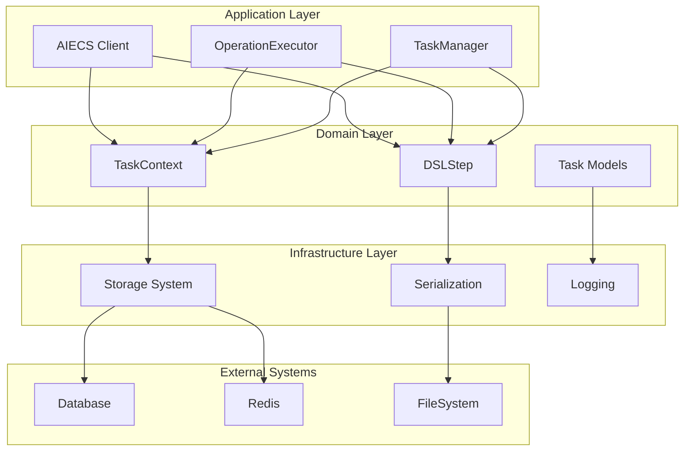
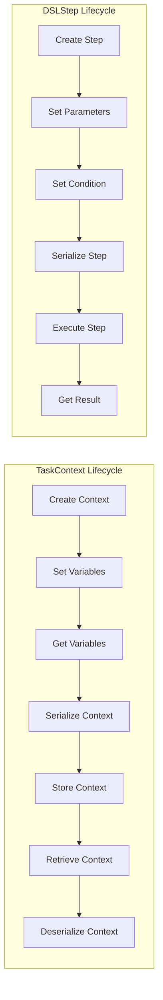
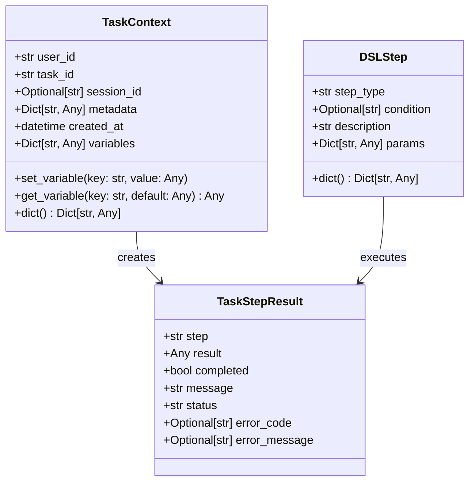
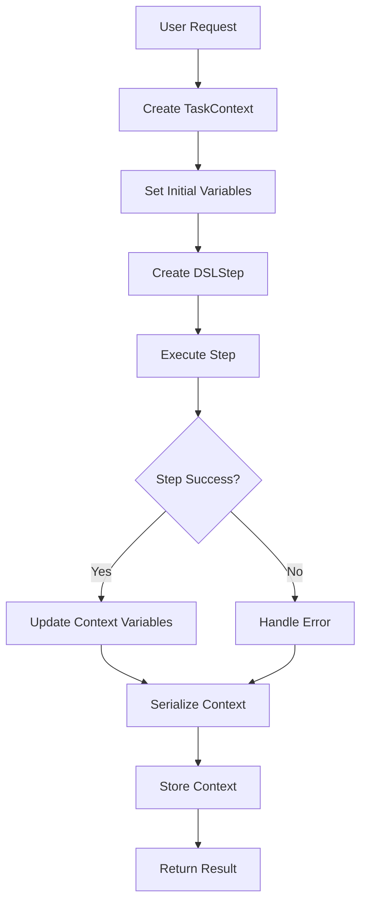

# 任务模型技术文档

## 1. 概述 (Overview)

### 核心功能和价值

`domain/task/model.py` 是 AIECS 系统的核心领域模型组件，定义了任务执行相关的两个关键数据模型：**TaskContext** 和 **DSLStep**。这些模型为整个 AI 应用系统提供了标准化的任务上下文管理和 DSL 步骤定义能力。

**核心价值**：
- **任务上下文管理**：提供统一的任务执行上下文，支持变量存储、元数据管理和生命周期跟踪
- **DSL 步骤定义**：为声明式任务流程提供标准化的步骤模型，支持条件执行和参数传递
- **数据契约标准化**：为整个系统提供一致的数据模型契约，确保组件间的数据交换标准化
- **类型安全保证**：基于 Python 类型系统提供编译时类型检查，减少运行时错误

**解决的问题**：
- 任务执行过程中缺乏统一的上下文管理机制
- DSL 步骤定义缺乏标准化的数据模型
- 组件间数据交换缺乏统一的契约规范
- 任务状态和变量管理缺乏类型安全保证

## 2. 问题背景与设计动机 (Problem & Motivation)

### 问题背景

在构建复杂的 AI 应用系统时，任务执行和流程管理面临以下核心挑战：

**1. 任务上下文管理复杂性**
- 任务执行过程中需要维护大量的状态信息（用户ID、任务ID、会话ID等）
- 不同任务步骤间需要共享变量和元数据
- 缺乏统一的任务上下文生命周期管理机制

**2. DSL 步骤定义标准化需求**
- 声明式任务流程需要标准化的步骤定义格式
- 不同步骤类型需要支持不同的参数和条件
- 缺乏统一的 DSL 步骤数据模型

**3. 组件间数据交换标准化**
- 不同组件间需要交换任务相关的数据
- 缺乏统一的数据序列化和反序列化机制
- 数据格式不一致导致集成困难

**4. 类型安全和数据验证**
- 任务相关数据缺乏类型安全保证
- 运行时数据验证不足，容易产生错误
- 缺乏编译时类型检查机制

### 设计动机

**任务模型系统的解决方案**：
- **统一上下文模型**：通过 TaskContext 提供统一的任务执行上下文管理
- **标准化步骤模型**：通过 DSLStep 提供标准化的 DSL 步骤定义
- **类型安全设计**：基于 Python 类型系统提供类型安全保证
- **序列化支持**：提供统一的数据序列化和反序列化机制
- **扩展性设计**：支持元数据和参数的灵活扩展

## 3. 架构定位与上下文 (Architecture & Context)

### 组件类型
**领域模型组件** - 位于领域层 (Domain Layer)，属于数据契约定义

### 架构层次
```
┌─────────────────────────────────────────┐
│         Application Layer               │  ← 使用任务模型的组件
│  (AIECS Client, OperationExecutor)     │
└─────────────────┬───────────────────────┘
                  │
┌─────────────────▼───────────────────────┐
│         Domain Layer                    │  ← 任务模型所在层
│  (TaskContext, DSLStep, Data Contracts)│
└─────────────────┬───────────────────────┘
                  │
┌─────────────────▼───────────────────────┐
│       Infrastructure Layer              │  ← 任务模型依赖的组件
│  (Storage, Serialization, Logging)     │
└─────────────────┬───────────────────────┘
                  │
┌─────────────────▼───────────────────────┐
│         External Systems                │  ← 外部系统
│  (Database, Redis, FileSystem)         │
└─────────────────────────────────────────┘
```

### 上游组件（使用方）

#### 1. 应用层服务
- **AIECS Client** (`aiecs_client.py`) - 主要的客户端接口
- **OperationExecutor** (`application/executors/operation_executor.py`) - 操作执行器
- **TaskManager** (如果存在) - 任务管理器

#### 2. 领域服务
- **DSLProcessor** (`domain/task/dsl_processor.py`) - DSL 处理器
- **ContextEngine** (`domain/context/content_engine.py`) - 内容引擎
- **其他任务相关服务** - 任务执行相关服务

#### 3. 基础设施层
- **存储系统** - 通过序列化接口存储任务数据
- **API 层** - 通过数据转换接口
- **消息队列** - 通过消息格式

### 下游组件（被依赖方）

#### 1. Python 标准库
- **typing** - 提供类型注解支持
- **datetime** - 提供时间处理
- **json** - 提供 JSON 序列化支持

#### 2. 领域模型
- **TaskStepResult** (`domain/execution/model.py`) - 任务步骤结果
- **其他领域模型** - 通过元数据字段关联

#### 3. 工具函数
- **序列化工具** - 通过 dict() 方法
- **验证工具** - 通过类型检查

## 4. 核心功能与用例 (Core Features & Use Cases)

### 4.1 TaskContext - 任务上下文管理

#### 核心功能

**1. 基础上下文信息管理**
```python
class TaskContext:
    """任务上下文模型"""
    def __init__(self, user_id: str, task_id: str, session_id: Optional[str] = None,
                 metadata: Optional[Dict[str, Any]] = None):
        self.user_id = user_id
        self.task_id = task_id
        self.session_id = session_id
        self.metadata = metadata or {}
        self.created_at = datetime.now()
        self.variables = {}  # 任务执行过程中的变量存储
```

**2. 变量存储和管理**
```python
def set_variable(self, key: str, value: Any):
    """设置任务变量"""
    self.variables[key] = value

def get_variable(self, key: str, default: Any = None) -> Any:
    """获取任务变量"""
    return self.variables.get(key, default)
```

**3. 数据序列化支持**
```python
def dict(self) -> Dict[str, Any]:
    """转换为字典格式"""
    return {
        "user_id": self.user_id,
        "task_id": self.task_id,
        "session_id": self.session_id,
        "metadata": self.metadata,
        "created_at": self.created_at.isoformat(),
        "variables": self.variables
    }
```

#### 软件功能场景

**场景1: 数据分析和处理任务**
```python
# 创建数据分析任务上下文
context = TaskContext(
    user_id="analyst_001",
    task_id="data_analysis_2024_001",
    session_id="session_abc123",
    metadata={
        "project": "sales_analysis",
        "priority": "high",
        "deadline": "2024-01-15"
    }
)

# 存储分析过程中的变量
context.set_variable("input_file", "sales_data.csv")
context.set_variable("output_format", "excel")
context.set_variable("analysis_type", "trend_analysis")

# 获取变量用于后续处理
input_file = context.get_variable("input_file")
print(f"Processing file: {input_file}")

# 序列化上下文用于存储或传输
context_data = context.dict()
```

**场景2: 多步骤工作流任务**
```python
# 创建多步骤工作流上下文
workflow_context = TaskContext(
    user_id="workflow_001",
    task_id="document_processing_workflow",
    metadata={
        "workflow_type": "document_processing",
        "steps": ["extract", "analyze", "summarize", "format"]
    }
)

# 跟踪工作流执行状态
workflow_context.set_variable("current_step", "extract")
workflow_context.set_variable("extracted_text", "Document content...")
workflow_context.set_variable("analysis_result", {"sentiment": "positive", "confidence": 0.95})

# 检查工作流状态
current_step = workflow_context.get_variable("current_step")
if current_step == "extract":
    print("Starting analysis step...")
    workflow_context.set_variable("current_step", "analyze")
```

**场景3: 用户会话管理**
```python
# 创建用户会话上下文
session_context = TaskContext(
    user_id="user_123",
    task_id="chat_session_001",
    session_id="session_xyz789",
    metadata={
        "session_type": "chat",
        "model": "gpt-4",
        "temperature": 0.7
    }
)

# 存储会话历史
session_context.set_variable("message_count", 0)
session_context.set_variable("last_message", "Hello, how can I help you?")
session_context.set_variable("conversation_history", [])

# 更新会话状态
message_count = session_context.get_variable("message_count", 0)
session_context.set_variable("message_count", message_count + 1)
```

### 4.2 DSLStep - DSL 步骤定义

#### 核心功能

**1. 步骤类型和条件定义**
```python
class DSLStep:
    """DSL 步骤模型"""
    def __init__(self, step_type: str, condition: Optional[str] = None,
                 description: str = "", params: Optional[Dict[str, Any]] = None):
        self.step_type = step_type
        self.condition = condition
        self.description = description
        self.params = params or {}
```

**2. 数据序列化支持**
```python
def dict(self) -> Dict[str, Any]:
    """转换为字典格式"""
    return {
        "step_type": self.step_type,
        "condition": self.condition,
        "description": self.description,
        "params": self.params
    }
```

#### 软件功能场景

**场景1: 条件分支任务流程**
```python
# 创建条件分支步骤
if_step = DSLStep(
    step_type="if",
    condition="intent.includes('data_analysis')",
    description="Check if user wants data analysis",
    params={
        "then": {
            "task": "pandas_tool.read_csv",
            "params": {"file_path": "data.csv"}
        },
        "else": {
            "task": "json_tool.read_json",
            "params": {"file_path": "data.json"}
        }
    }
)

# 序列化步骤用于存储
step_data = if_step.dict()
print(f"Step type: {step_data['step_type']}")
print(f"Condition: {step_data['condition']}")
```

**场景2: 并行任务执行**
```python
# 创建并行执行步骤
parallel_step = DSLStep(
    step_type="parallel",
    description="Execute multiple tasks in parallel",
    params={
        "tasks": [
            {
                "task": "pandas_tool.read_csv",
                "params": {"file_path": "data1.csv"}
            },
            {
                "task": "pandas_tool.read_csv",
                "params": {"file_path": "data2.csv"}
            }
        ]
    }
)

# 获取并行任务列表
tasks = parallel_step.params.get("tasks", [])
print(f"Executing {len(tasks)} tasks in parallel")
```

**场景3: 顺序任务执行**
```python
# 创建顺序执行步骤
sequence_step = DSLStep(
    step_type="sequence",
    description="Execute tasks in sequence",
    params={
        "steps": [
            {
                "task": "pandas_tool.read_csv",
                "params": {"file_path": "data.csv"}
            },
            {
                "task": "pandas_tool.clean_data",
                "params": {"data": "{{result[0].result}}"}
            },
            {
                "task": "pandas_tool.analyze_data",
                "params": {"data": "{{result[1].result}}"}
            }
        ]
    }
)

# 获取步骤列表
steps = sequence_step.params.get("steps", [])
print(f"Executing {len(steps)} steps in sequence")
```

### 4.3 实际使用案例

**案例1: 智能文档处理系统**
```python
# 文档处理任务上下文
doc_context = TaskContext(
    user_id="doc_processor_001",
    task_id="document_analysis_2024_001",
    session_id="doc_session_abc123",
    metadata={
        "document_type": "pdf",
        "language": "zh-CN",
        "processing_mode": "batch"
    }
)

# 存储文档信息
doc_context.set_variable("input_file", "document.pdf")
doc_context.set_variable("output_dir", "./output")
doc_context.set_variable("extracted_text", "")

# 定义文档处理步骤
extract_step = DSLStep(
    step_type="task",
    description="Extract text from PDF",
    params={
        "task": "pdf_tool.extract_text",
        "params": {
            "file_path": "{{variables.input_file}}",
            "language": "zh-CN"
        }
    }
)

analyze_step = DSLStep(
    step_type="task",
    condition="result[0].success == true",
    description="Analyze extracted text",
    params={
        "task": "nlp_tool.analyze_sentiment",
        "params": {
            "text": "{{result[0].result}}",
            "model": "bert-base-chinese"
        }
    }
)

# 执行步骤
steps = [extract_step, analyze_step]
for step in steps:
    print(f"Executing: {step.description}")
    step_data = step.dict()
    print(f"Step data: {step_data}")
```

**案例2: 数据科学工作流**
```python
# 数据科学任务上下文
ds_context = TaskContext(
    user_id="data_scientist_001",
    task_id="ml_pipeline_2024_001",
    metadata={
        "project": "customer_segmentation",
        "algorithm": "kmeans",
        "dataset_size": "large"
    }
)

# 存储机器学习参数
ds_context.set_variable("n_clusters", 5)
ds_context.set_variable("random_state", 42)
ds_context.set_variable("test_size", 0.2)

# 定义机器学习管道步骤
data_loading_step = DSLStep(
    step_type="task",
    description="Load and preprocess data",
    params={
        "task": "pandas_tool.load_and_preprocess",
        "params": {
            "file_path": "customer_data.csv",
            "target_column": "segment"
        }
    }
)

model_training_step = DSLStep(
    step_type="task",
    condition="result[0].success == true",
    description="Train clustering model",
    params={
        "task": "sklearn_tool.train_kmeans",
        "params": {
            "data": "{{result[0].result}}",
            "n_clusters": "{{variables.n_clusters}}",
            "random_state": "{{variables.random_state}}"
        }
    }
)

evaluation_step = DSLStep(
    step_type="task",
    condition="result[1].success == true",
    description="Evaluate model performance",
    params={
        "task": "sklearn_tool.evaluate_model",
        "params": {
            "model": "{{result[1].result}}",
            "test_data": "{{result[0].test_data}}"
        }
    }
)

# 构建完整的机器学习管道
ml_pipeline = [data_loading_step, model_training_step, evaluation_step]
```

**案例3: 实时聊天机器人**
```python
# 聊天机器人任务上下文
chat_context = TaskContext(
    user_id="user_456",
    task_id="chat_session_2024_001",
    session_id="chat_session_xyz789",
    metadata={
        "bot_type": "customer_service",
        "language": "en",
        "model": "gpt-4"
    }
)

# 存储对话状态
chat_context.set_variable("conversation_history", [])
chat_context.set_variable("user_intent", "unknown")
chat_context.set_variable("response_count", 0)

# 定义聊天机器人步骤
intent_detection_step = DSLStep(
    step_type="task",
    description="Detect user intent",
    params={
        "task": "nlp_tool.detect_intent",
        "params": {
            "message": "{{input.message}}",
            "history": "{{variables.conversation_history}}"
        }
    }
)

response_generation_step = DSLStep(
    step_type="task",
    condition="result[0].confidence > 0.8",
    description="Generate response based on intent",
    params={
        "task": "llm_tool.generate_response",
        "params": {
            "intent": "{{result[0].intent}}",
            "message": "{{input.message}}",
            "context": "{{variables.conversation_history}}",
            "model": "gpt-4"
        }
    }
)

fallback_step = DSLStep(
    step_type="task",
    condition="result[0].confidence <= 0.8",
    description="Generate fallback response",
    params={
        "task": "llm_tool.generate_fallback",
        "params": {
            "message": "{{input.message}}",
            "model": "gpt-4"
        }
    }
)

# 构建聊天机器人流程
chat_flow = [intent_detection_step, response_generation_step, fallback_step]
```

## 5. API 参考 (API Reference)

### 5.1 TaskContext 类

#### 构造函数
```python
def __init__(self, user_id: str, task_id: str, session_id: Optional[str] = None,
             metadata: Optional[Dict[str, Any]] = None)
```

**参数**：
- `user_id` (str): 用户唯一标识符，必需
- `task_id` (str): 任务唯一标识符，必需
- `session_id` (Optional[str]): 会话标识符，可选，默认为 None
- `metadata` (Optional[Dict[str, Any]]): 任务元数据，可选，默认为空字典

**返回值**：无

**异常**：无

#### 方法

##### set_variable
```python
def set_variable(self, key: str, value: Any) -> None
```

**功能**：设置任务变量

**参数**：
- `key` (str): 变量键名，必需
- `value` (Any): 变量值，必需

**返回值**：无

**异常**：无

**示例**：
```python
context = TaskContext("user_123", "task_456")
context.set_variable("input_file", "data.csv")
context.set_variable("processing_mode", "batch")
```

##### get_variable
```python
def get_variable(self, key: str, default: Any = None) -> Any
```

**功能**：获取任务变量

**参数**：
- `key` (str): 变量键名，必需
- `default` (Any): 默认值，可选，默认为 None

**返回值**：Any - 变量值或默认值

**异常**：无

**示例**：
```python
context = TaskContext("user_123", "task_456")
context.set_variable("input_file", "data.csv")

file_path = context.get_variable("input_file")  # "data.csv"
mode = context.get_variable("processing_mode", "single")  # "single"
```

##### dict
```python
def dict(self) -> Dict[str, Any]
```

**功能**：将任务上下文转换为字典格式

**参数**：无

**返回值**：Dict[str, Any] - 包含所有上下文信息的字典

**异常**：无

**示例**：
```python
context = TaskContext("user_123", "task_456", "session_789")
context.set_variable("input_file", "data.csv")

context_data = context.dict()
# {
#     "user_id": "user_123",
#     "task_id": "task_456",
#     "session_id": "session_789",
#     "metadata": {},
#     "created_at": "2024-01-01T12:00:00.000000",
#     "variables": {"input_file": "data.csv"}
# }
```

### 5.2 DSLStep 类

#### 构造函数
```python
def __init__(self, step_type: str, condition: Optional[str] = None,
             description: str = "", params: Optional[Dict[str, Any]] = None)
```

**参数**：
- `step_type` (str): 步骤类型，必需
- `condition` (Optional[str]): 执行条件，可选，默认为 None
- `description` (str): 步骤描述，可选，默认为空字符串
- `params` (Optional[Dict[str, Any]]): 步骤参数，可选，默认为空字典

**返回值**：无

**异常**：无

#### 方法

##### dict
```python
def dict(self) -> Dict[str, Any]
```

**功能**：将 DSL 步骤转换为字典格式

**参数**：无

**返回值**：Dict[str, Any] - 包含所有步骤信息的字典

**异常**：无

**示例**：
```python
step = DSLStep(
    step_type="task",
    condition="intent.includes('analysis')",
    description="Perform data analysis",
    params={"task": "pandas_tool.analyze", "params": {"file": "data.csv"}}
)

step_data = step.dict()
# {
#     "step_type": "task",
#     "condition": "intent.includes('analysis')",
#     "description": "Perform data analysis",
#     "params": {"task": "pandas_tool.analyze", "params": {"file": "data.csv"}}
# }
```

## 6. 技术实现细节 (Technical Details)

### 6.1 数据模型设计

#### TaskContext 设计原则

**1. 不可变性设计**
```python
# TaskContext 在创建后，核心标识符不可变
context = TaskContext("user_123", "task_456")
# context.user_id 和 context.task_id 在创建后不应被修改
```

**2. 变量存储机制**
```python
# 使用字典存储变量，支持任意类型的值
self.variables = {}  # Dict[str, Any]

# 变量存储示例
context.set_variable("string_var", "hello")
context.set_variable("int_var", 42)
context.set_variable("dict_var", {"key": "value"})
context.set_variable("list_var", [1, 2, 3])
```

**3. 时间戳管理**
```python
# 自动记录创建时间
self.created_at = datetime.now()

# 序列化时转换为 ISO 格式
def dict(self) -> Dict[str, Any]:
    return {
        # ...
        "created_at": self.created_at.isoformat(),
        # ...
    }
```

#### DSLStep 设计原则

**1. 类型安全设计**
```python
# 使用类型注解确保类型安全
def __init__(self, step_type: str, condition: Optional[str] = None,
             description: str = "", params: Optional[Dict[str, Any]] = None):
```

**2. 参数验证**
```python
# 确保参数不为 None
self.params = params or {}  # 如果 params 为 None，使用空字典
```

**3. 条件表达式支持**
```python
# 支持条件表达式字符串
self.condition = condition  # 例如: "intent.includes('analysis')"
```

### 6.2 序列化机制

#### JSON 序列化支持
```python
# TaskContext 序列化
def dict(self) -> Dict[str, Any]:
    return {
        "user_id": self.user_id,
        "task_id": self.task_id,
        "session_id": self.session_id,
        "metadata": self.metadata,
        "created_at": self.created_at.isoformat(),  # 时间戳序列化
        "variables": self.variables
    }

# DSLStep 序列化
def dict(self) -> Dict[str, Any]:
    return {
        "step_type": self.step_type,
        "condition": self.condition,
        "description": self.description,
        "params": self.params
    }
```

#### 反序列化支持
```python
# 从字典创建 TaskContext
def from_dict(data: Dict[str, Any]) -> 'TaskContext':
    context = TaskContext(
        user_id=data["user_id"],
        task_id=data["task_id"],
        session_id=data.get("session_id"),
        metadata=data.get("metadata", {})
    )
    
    # 恢复变量
    context.variables = data.get("variables", {})
    
    # 恢复时间戳
    if "created_at" in data:
        context.created_at = datetime.fromisoformat(data["created_at"])
    
    return context

# 从字典创建 DSLStep
def from_dict(data: Dict[str, Any]) -> 'DSLStep':
    return DSLStep(
        step_type=data["step_type"],
        condition=data.get("condition"),
        description=data.get("description", ""),
        params=data.get("params", {})
    )
```

### 6.3 类型安全机制

#### 类型注解
```python
from typing import Any, Dict, List, Optional

class TaskContext:
    def __init__(self, user_id: str, task_id: str, session_id: Optional[str] = None,
                 metadata: Optional[Dict[str, Any]] = None):
        # 类型注解确保参数类型正确
        pass
    
    def set_variable(self, key: str, value: Any) -> None:
        # 支持任意类型的值
        pass
    
    def get_variable(self, key: str, default: Any = None) -> Any:
        # 返回类型为 Any，支持类型推断
        pass
```

#### 运行时类型检查
```python
def validate_context_data(data: Dict[str, Any]) -> bool:
    """验证上下文数据格式"""
    required_fields = ["user_id", "task_id"]
    
    for field in required_fields:
        if field not in data:
            return False
        if not isinstance(data[field], str):
            return False
    
    return True

def validate_step_data(data: Dict[str, Any]) -> bool:
    """验证步骤数据格式"""
    required_fields = ["step_type"]
    
    for field in required_fields:
        if field not in data:
            return False
        if not isinstance(data[field], str):
            return False
    
    return True
```

## 7. 配置与部署 (Configuration & Deployment)

### 7.1 默认配置

#### TaskContext 默认配置
```python
# 默认元数据
default_metadata = {}

# 默认变量存储
default_variables = {}

# 默认会话ID
default_session_id = None
```

#### DSLStep 默认配置
```python
# 默认条件
default_condition = None

# 默认描述
default_description = ""

# 默认参数
default_params = {}
```

### 7.2 环境变量支持

#### 配置环境变量
```python
import os

# 从环境变量获取配置
DEFAULT_TASK_DIR = os.getenv("AIECS_TASK_DIR", "./tasks")
DEFAULT_SESSION_TIMEOUT = int(os.getenv("AIECS_SESSION_TIMEOUT", "3600"))
DEFAULT_MAX_VARIABLES = int(os.getenv("AIECS_MAX_VARIABLES", "1000"))
```

#### 配置验证
```python
def validate_config():
    """验证配置参数"""
    task_dir = os.getenv("AIECS_TASK_DIR", "./tasks")
    if not os.path.exists(task_dir):
        os.makedirs(task_dir, exist_ok=True)
    
    session_timeout = int(os.getenv("AIECS_SESSION_TIMEOUT", "3600"))
    if session_timeout <= 0:
        raise ValueError("Session timeout must be positive")
    
    max_variables = int(os.getenv("AIECS_MAX_VARIABLES", "1000"))
    if max_variables <= 0:
        raise ValueError("Max variables must be positive")
```

### 7.3 部署配置

#### 生产环境配置
```python
# 生产环境配置
PRODUCTION_CONFIG = {
    "task_dir": "/var/lib/aiecs/tasks",
    "session_timeout": 7200,  # 2 hours
    "max_variables": 5000,
    "enable_persistence": True,
    "log_level": "INFO"
}
```

#### 开发环境配置
```python
# 开发环境配置
DEVELOPMENT_CONFIG = {
    "task_dir": "./tasks",
    "session_timeout": 3600,  # 1 hour
    "max_variables": 1000,
    "enable_persistence": False,
    "log_level": "DEBUG"
}
```

## 8. 维护与故障排查 (Maintenance & Troubleshooting)

### 8.1 日常维护

#### 模型健康检查
```python
def check_models_health():
    """检查模型健康状态"""
    try:
        # 测试 TaskContext 创建
        context = TaskContext("test_user", "test_task")
        assert context.user_id == "test_user"
        assert context.task_id == "test_task"
        print("✅ TaskContext creation test passed")
        
        # 测试变量存储
        context.set_variable("test_key", "test_value")
        assert context.get_variable("test_key") == "test_value"
        print("✅ TaskContext variable storage test passed")
        
        # 测试序列化
        context_data = context.dict()
        assert "user_id" in context_data
        assert "variables" in context_data
        print("✅ TaskContext serialization test passed")
        
        # 测试 DSLStep 创建
        step = DSLStep("task", "test condition", "test description", {"param": "value"})
        assert step.step_type == "task"
        assert step.condition == "test condition"
        print("✅ DSLStep creation test passed")
        
        # 测试步骤序列化
        step_data = step.dict()
        assert "step_type" in step_data
        assert "params" in step_data
        print("✅ DSLStep serialization test passed")
        
        return True
        
    except Exception as e:
        print(f"❌ Model health check failed: {e}")
        return False
```

#### 数据一致性检查
```python
def check_data_consistency(context: TaskContext):
    """检查上下文数据一致性"""
    try:
        # 检查必需字段
        if not context.user_id:
            print("❌ Missing user_id")
            return False
        
        if not context.task_id:
            print("❌ Missing task_id")
            return False
        
        # 检查时间戳
        if not context.created_at:
            print("❌ Missing created_at")
            return False
        
        # 检查变量存储
        if not isinstance(context.variables, dict):
            print("❌ Variables is not a dictionary")
            return False
        
        # 检查元数据
        if not isinstance(context.metadata, dict):
            print("❌ Metadata is not a dictionary")
            return False
        
        print("✅ Data consistency check passed")
        return True
        
    except Exception as e:
        print(f"❌ Data consistency check failed: {e}")
        return False
```

### 8.2 故障排查

#### 常见问题诊断

**问题1: 变量存储失败**
```python
def diagnose_variable_storage_issue():
    """诊断变量存储问题"""
    try:
        context = TaskContext("test_user", "test_task")
        
        # 测试正常变量存储
        context.set_variable("string_var", "hello")
        context.set_variable("int_var", 42)
        context.set_variable("dict_var", {"key": "value"})
        
        # 验证变量存储
        assert context.get_variable("string_var") == "hello"
        assert context.get_variable("int_var") == 42
        assert context.get_variable("dict_var") == {"key": "value"}
        
        print("✅ Variable storage working correctly")
        
    except Exception as e:
        print(f"❌ Variable storage issue: {e}")
        
        # 检查变量字典是否被正确初始化
        if not hasattr(context, 'variables'):
            print("❌ Variables dictionary not initialized")
        elif not isinstance(context.variables, dict):
            print("❌ Variables is not a dictionary")
```

**问题2: 序列化失败**
```python
def diagnose_serialization_issue():
    """诊断序列化问题"""
    try:
        context = TaskContext("test_user", "test_task")
        context.set_variable("test_var", "test_value")
        
        # 测试序列化
        context_data = context.dict()
        
        # 验证序列化结果
        assert isinstance(context_data, dict)
        assert context_data["user_id"] == "test_user"
        assert context_data["task_id"] == "test_task"
        assert context_data["variables"]["test_var"] == "test_value"
        
        print("✅ Serialization working correctly")
        
    except Exception as e:
        print(f"❌ Serialization issue: {e}")
        
        # 检查时间戳序列化
        if "created_at" in context_data:
            try:
                datetime.fromisoformat(context_data["created_at"])
                print("✅ Timestamp serialization working")
            except ValueError:
                print("❌ Timestamp serialization failed")
```

**问题3: 类型检查失败**
```python
def diagnose_type_checking_issue():
    """诊断类型检查问题"""
    try:
        # 测试正确的类型
        context = TaskContext("user_123", "task_456")
        step = DSLStep("task", "condition", "description", {"param": "value"})
        
        print("✅ Type checking passed")
        
    except TypeError as e:
        print(f"❌ Type checking failed: {e}")
        
        # 检查参数类型
        if not isinstance("user_123", str):
            print("❌ user_id must be string")
        if not isinstance("task_456", str):
            print("❌ task_id must be string")
```

### 8.3 性能优化

#### 内存使用优化
```python
def optimize_memory_usage():
    """优化内存使用"""
    import gc
    import sys
    
    # 创建大量上下文对象
    contexts = []
    for i in range(10000):
        context = TaskContext(f"user_{i}", f"task_{i}")
        context.set_variable(f"var_{i}", f"value_{i}")
        contexts.append(context)
    
    print(f"Memory usage before cleanup: {sys.getsizeof(contexts)} bytes")
    
    # 清理对象
    contexts.clear()
    gc.collect()
    
    print(f"Memory usage after cleanup: {sys.getsizeof(contexts)} bytes")
```

#### 序列化性能优化
```python
def optimize_serialization_performance():
    """优化序列化性能"""
    import time
    
    context = TaskContext("user_123", "task_456")
    context.set_variable("var1", "value1")
    context.set_variable("var2", "value2")
    context.set_variable("var3", "value3")
    
    # 预热
    for _ in range(100):
        context.dict()
    
    # 性能测试
    start_time = time.time()
    for _ in range(10000):
        context.dict()
    end_time = time.time()
    
    print(f"Serialization time: {(end_time - start_time) * 1000:.2f}ms for 10000 iterations")
```

## 9. 可视化图表 (Visualizations)

### 9.1 架构层次图



### 9.2 数据流图



### 9.3 类关系图



### 9.4 使用场景流程图



## 10. 版本历史 (Version History)

### v1.0.0 (2024-01-01)
- **初始版本**：基础 TaskContext 和 DSLStep 模型
- **功能**：
  - TaskContext 基础上下文管理
  - DSLStep 基础步骤定义
  - 基本序列化支持

### v1.1.0 (2024-01-15)
- **增强功能**：
  - 添加变量存储和管理功能
  - 改进序列化机制
  - 添加类型注解支持

### v1.2.0 (2024-02-01)
- **新增功能**：
  - 添加元数据支持
  - 改进错误处理
  - 添加数据验证

### v1.3.0 (2024-02-15)
- **优化功能**：
  - 性能优化
  - 内存使用优化
  - 添加健康检查

### v1.4.0 (2024-03-01)
- **扩展功能**：
  - 添加会话ID支持
  - 改进条件表达式支持
  - 添加配置管理

### v1.5.0 (2024-03-15)
- **完善功能**：
  - 添加监控和日志支持
  - 改进故障排查工具
  - 添加性能监控

## 相关文档

- [AIECS 项目总览](../PROJECT_SUMMARY.md)
- [DSL 处理器文档](./DSL_PROCESSOR.md)
- [执行模型文档](./EXECUTION_MODELS.md)
- [操作执行器文档](./OPERATION_EXECUTOR.md)
