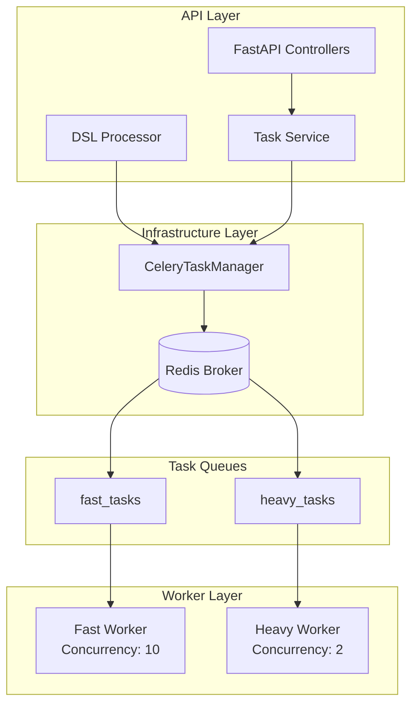
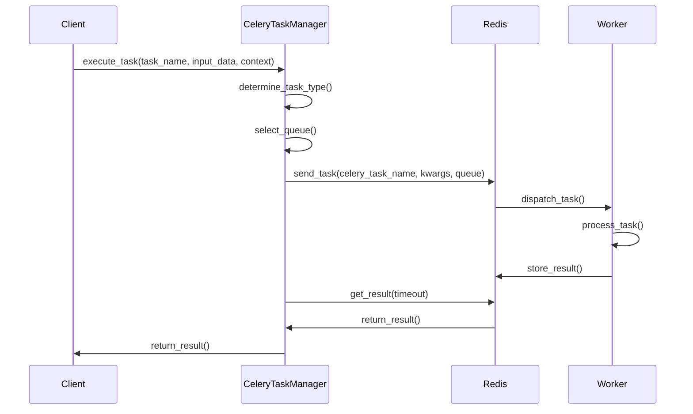
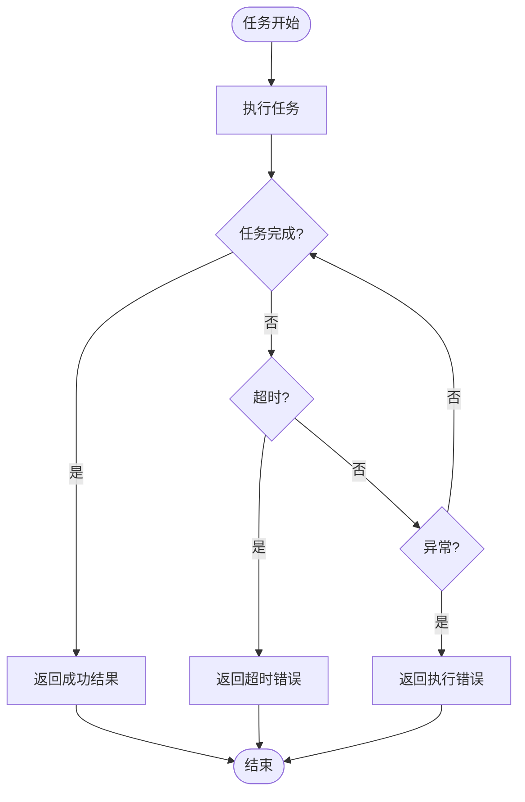
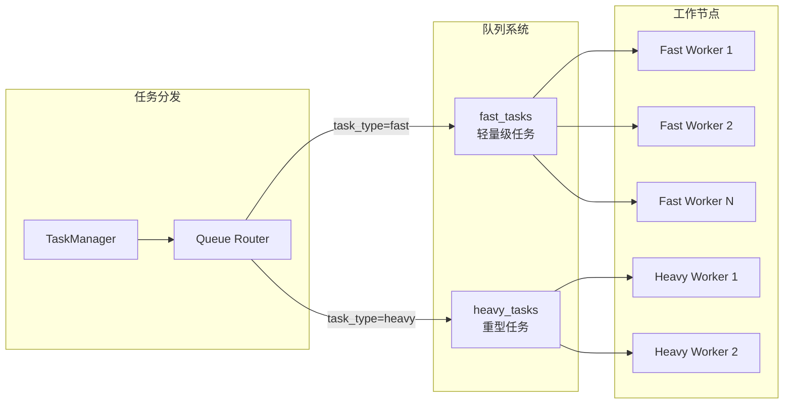

# CeleryTaskManager 技术文档

## 1. 概述 (Overview)

### 目的
`CeleryTaskManager` 是一个专门用于分布式任务调度和执行的组件，基于 Celery 框架构建。它提供了异步任务执行、队列管理、任务监控和批量处理等核心功能，是 AIECS 系统中任务执行层的核心基础设施。

### 核心价值
- **分布式任务执行**：支持跨多个工作节点的任务分发和执行
- **队列管理**：提供快速任务和重型任务的分离队列管理
- **异步处理**：基于 asyncio 的异步任务执行，提高系统吞吐量
- **任务监控**：提供任务状态跟踪、结果获取和取消功能
- **容错机制**：内置超时处理、错误重试和异常恢复机制

## 2. 问题背景与设计动机 (Problem & Motivation)

### 问题背景
在 AIECS 系统中，需要处理大量计算密集型任务，包括：
- **AI 模型推理**：需要大量计算资源且执行时间不确定
- **数据处理任务**：涉及大文件处理、数据转换等重型操作
- **批量任务处理**：需要同时处理多个相关任务
- **长时间运行任务**：某些任务可能需要几分钟到几小时

### 设计动机
1. **性能隔离**：将重型任务与快速任务分离，避免相互影响
2. **资源优化**：通过队列管理实现资源的合理分配
3. **可扩展性**：支持水平扩展，根据负载动态调整工作节点
4. **可靠性**：提供任务状态跟踪和错误恢复机制
5. **监控能力**：提供详细的任务执行统计和队列状态信息

## 3. 架构定位与上下文 (Architecture & Context)

### 系统架构位置
```
┌─────────────────────────────────────────────────────────────┐
│                    AIECS 系统架构                           │
├─────────────────────────────────────────────────────────────┤
│  API Layer (FastAPI)                                       │
├─────────────────────────────────────────────────────────────┤
│  Domain Layer (Task, Execution)                            │
├─────────────────────────────────────────────────────────────┤
│  Infrastructure Layer                                      │
│  ┌─────────────────┐  ┌─────────────────┐                  │
│  │ CeleryTaskManager│  │ 其他基础设施    │                  │
│  └─────────────────┘  └─────────────────┘                  │
├─────────────────────────────────────────────────────────────┤
│  Message Broker (Redis)                                    │
├─────────────────────────────────────────────────────────────┤
│  Worker Nodes (Celery Workers)                             │
└─────────────────────────────────────────────────────────────┘
```

### 上游调用者
- **TaskService**：任务管理服务，负责任务创建和调度
- **DSLProcessor**：DSL 处理器，执行复杂的任务流程
- **API Controllers**：REST API 控制器，处理用户请求

### 下游依赖
- **Redis**：作为消息代理和结果存储
- **Celery Workers**：实际执行任务的工作节点
- **TaskStatus/ErrorCode**：任务状态和错误码定义

## 4. 核心功能与用例 (Core Features & Use Cases)

### 4.1 任务执行功能

#### 基本任务执行
```python
# 创建任务管理器实例
config = {
    'broker_url': 'redis://localhost:6379/0',
    'backend_url': 'redis://localhost:6379/0',
    'task_timeout_seconds': 300
}
task_manager = CeleryTaskManager(config)

# 执行单个任务
result = await task_manager.execute_task(
    task_name="data_processing",
    input_data={
        "file_path": "/data/input.csv",
        "task_id": "task_123",
        "step": 1
    },
    context={
        "user_id": "user_456",
        "mode": "batch"
    }
)
```

#### 重型任务执行
```python
# 执行计算密集型任务
heavy_result = await task_manager.execute_heavy_task(
    task_name="ml_model_training",
    input_data={
        "dataset_path": "/data/training_data.parquet",
        "model_config": {"epochs": 100, "batch_size": 32}
    },
    context={"user_id": "user_789"}
)
```

### 4.2 DSL 任务步骤执行

#### 复杂工作流执行
```python
# 执行 DSL 定义的任务步骤
dsl_step = {
    "task": "data_validation",
    "parameters": {
        "validation_rules": ["not_null", "data_type_check"],
        "error_threshold": 0.05
    }
}

step_result = await task_manager.execute_dsl_task_step(
    step=dsl_step,
    input_data={"data_source": "database_table"},
    context={
        "user_id": "user_123",
        "task_id": "workflow_456",
        "step": 2
    }
)
```

### 4.3 批量任务处理

#### 批量执行多个任务
```python
# 准备批量任务
tasks = [
    {
        "task_name": "image_resize",
        "input_data": {"image_path": f"/images/img_{i}.jpg"},
        "context": {"user_id": "user_123"}
    }
    for i in range(100)
]

# 批量执行
batch_results = await task_manager.batch_execute_tasks(tasks)
```

### 4.4 任务监控和管理

#### 任务状态查询
```python
# 获取任务结果
task_result = task_manager.get_task_result("task_123")
print(f"任务状态: {task_result['status']}")
print(f"执行结果: {task_result['result']}")

# 取消任务
success = task_manager.cancel_task("task_123")
```

#### 队列状态监控
```python
# 获取队列信息
queue_info = task_manager.get_queue_info()
print(f"活跃任务: {queue_info['active_tasks']}")
print(f"计划任务: {queue_info['scheduled_tasks']}")

# 获取工作节点统计
worker_stats = task_manager.get_worker_stats()
print(f"工作节点统计: {worker_stats}")
```

## 5. API 参考 (API Reference)

### 5.1 类定义

#### `CeleryTaskManager`
```python
class CeleryTaskManager:
    """Celery 分布式任务调度和执行管理器"""
    
    def __init__(self, config: Dict[str, Any]) -> None
    """初始化任务管理器
    
    Args:
        config: 配置字典，包含 Celery 相关配置
    """
```

### 5.2 公共方法

#### `execute_task`
```python
async def execute_task(
    self, 
    task_name: str, 
    input_data: Dict[str, Any], 
    context: Dict[str, Any]
) -> Any
```
**功能**：执行单个异步任务

**参数**：
- `task_name` (str): 任务名称
- `input_data` (Dict[str, Any]): 任务输入数据
- `context` (Dict[str, Any]): 任务上下文信息

**返回值**：
- `Any`: 任务执行结果

**异常**：
- `CeleryTimeoutError`: 任务执行超时
- `Exception`: 其他执行异常

#### `execute_heavy_task`
```python
async def execute_heavy_task(
    self, 
    task_name: str, 
    input_data: Dict[str, Any], 
    context: Dict[str, Any]
) -> Any
```
**功能**：执行重型任务（自动分配到重型任务队列）

**参数**：同 `execute_task`

**返回值**：同 `execute_task`

#### `execute_dsl_task_step`
```python
async def execute_dsl_task_step(
    self, 
    step: Dict[str, Any], 
    input_data: Dict[str, Any], 
    context: Dict[str, Any]
) -> Dict[str, Any]
```
**功能**：执行 DSL 定义的任务步骤

**参数**：
- `step` (Dict[str, Any]): DSL 步骤定义
- `input_data` (Dict[str, Any]): 输入数据
- `context` (Dict[str, Any]): 上下文信息

**返回值**：
- `Dict[str, Any]`: 包含步骤执行结果的字典

#### `batch_execute_tasks`
```python
async def batch_execute_tasks(
    self, 
    tasks: List[Dict[str, Any]]
) -> List[Any]
```
**功能**：批量执行多个任务

**参数**：
- `tasks` (List[Dict[str, Any]]): 任务列表

**返回值**：
- `List[Any]`: 任务执行结果列表

#### `get_task_result`
```python
def get_task_result(self, task_id: str) -> Dict[str, Any]
```
**功能**：获取任务执行结果

**参数**：
- `task_id` (str): 任务 ID

**返回值**：
- `Dict[str, Any]`: 任务状态和结果信息

#### `cancel_task`
```python
def cancel_task(self, task_id: str) -> bool
```
**功能**：取消指定任务

**参数**：
- `task_id` (str): 任务 ID

**返回值**：
- `bool`: 取消操作是否成功

#### `get_queue_info`
```python
def get_queue_info(self) -> Dict[str, Any]
```
**功能**：获取队列状态信息

**返回值**：
- `Dict[str, Any]`: 队列状态统计

#### `get_worker_stats`
```python
def get_worker_stats(self) -> Dict[str, Any]
```
**功能**：获取工作节点统计信息

**返回值**：
- `Dict[str, Any]`: 工作节点统计

## 6. 技术实现细节 (Technical Details)

### 6.1 队列管理策略

#### 双队列架构
```python
task_queues = {
    'fast_tasks': {
        'exchange': 'fast_tasks', 
        'routing_key': 'fast_tasks'
    },
    'heavy_tasks': {
        'exchange': 'heavy_tasks', 
        'routing_key': 'heavy_tasks'
    }
}
```

- **fast_tasks**：处理轻量级任务，如数据验证、简单计算等
- **heavy_tasks**：处理计算密集型任务，如机器学习训练、大数据处理等

#### 工作节点配置
```python
worker_concurrency = {
    'fast_worker': 10,    # 快速任务工作节点并发数
    'heavy_worker': 2     # 重型任务工作节点并发数
}
```

### 6.2 任务类型自动检测

系统通过以下逻辑自动确定任务类型：

```python
# 1. 尝试获取任务类型
task_type_result = await self.execute_task(task_name, {"get_task_type": True}, context)

# 2. 根据返回结果确定队列
if isinstance(task_type_result, dict) and "task_type" in task_type_result:
    task_type = task_type_result["task_type"]
else:
    task_type = "fast"  # 默认类型

# 3. 选择对应队列
queue = "heavy_tasks" if task_type == "heavy" else "fast_tasks"
```

### 6.3 超时处理机制

#### 多层超时控制
```python
# 1. 配置级超时
timeout_seconds = self.config.get('task_timeout_seconds', 300)

# 2. 任务级超时检查
while not celery_task.ready():
    if time.time() - start_time > timeout_seconds:
        raise AsyncioTimeoutError(f"Task {task_name} timed out after {timeout_seconds} seconds")
    await asyncio.sleep(0.5)

# 3. Celery 原生超时
result = celery_task.get(timeout=timeout)
```

### 6.4 错误处理策略

#### 异常分类处理
```python
try:
    # 任务执行逻辑
    result = await self.execute_task(...)
except CeleryTimeoutError as e:
    # 超时错误
    return {
        "status": TaskStatus.TIMED_OUT,
        "error_code": ErrorCode.TIMEOUT_ERROR,
        "error_message": str(e)
    }
except Exception as e:
    # 其他执行错误
    return {
        "status": TaskStatus.FAILED,
        "error_code": ErrorCode.EXECUTION_ERROR,
        "error_message": str(e)
    }
```

### 6.5 批量处理优化

#### 批处理策略
```python
# 1. 分批处理
batch_size = self.config.get('batch_size', 10)
for i in range(0, len(tasks), batch_size):
    batch = tasks[i:i + batch_size]
    
# 2. 并发执行
batch_results = await asyncio.gather(
    *[self.execute_task(...) for task in batch],
    return_exceptions=True
)

# 3. 速率限制
rate_limit = self.config.get('rate_limit_requests_per_second', 5)
await asyncio.sleep(1.0 / rate_limit)
```

## 7. 配置与部署 (Configuration & Deployment)

### 7.1 配置参数

#### 必需配置
```python
config = {
    # 消息代理配置
    'broker_url': 'redis://localhost:6379/0',
    'backend_url': 'redis://localhost:6379/0',
    
    # 任务超时配置
    'task_timeout_seconds': 300,
    
    # 批处理配置
    'batch_size': 10,
    'rate_limit_requests_per_second': 5
}
```

#### 可选配置
```python
config = {
    # 序列化配置
    'task_serializer': 'json',
    'accept_content': ['json'],
    'result_serializer': 'json',
    
    # 时区配置
    'timezone': 'UTC',
    'enable_utc': True,
    
    # 队列配置
    'task_queues': {
        'fast_tasks': {'exchange': 'fast_tasks', 'routing_key': 'fast_tasks'},
        'heavy_tasks': {'exchange': 'heavy_tasks', 'routing_key': 'heavy_tasks'}
    },
    
    # 工作节点配置
    'worker_concurrency': {
        'fast_worker': 10,
        'heavy_worker': 2
    }
}
```

### 7.2 环境变量支持

```bash
# Redis 配置
export CELERY_BROKER_URL="redis://localhost:6379/0"
export CELERY_BACKEND_URL="redis://localhost:6379/0"

# 任务配置
export CELERY_TASK_TIMEOUT="300"
export CELERY_BATCH_SIZE="10"
export CELERY_RATE_LIMIT="5"

# 队列配置
export CELERY_FAST_WORKER_CONCURRENCY="10"
export CELERY_HEAVY_WORKER_CONCURRENCY="2"
```

### 7.3 Docker 部署

#### Docker Compose 配置
```yaml
version: '3.8'
services:
  redis:
    image: redis:7-alpine
    ports:
      - "6379:6379"
    
  celery-worker-fast:
    build: .
    command: celery -A aiecs.tasks.worker worker --loglevel=info --queues=fast_tasks --concurrency=10
    environment:
      - CELERY_BROKER_URL=redis://redis:6379/0
      - CELERY_BACKEND_URL=redis://redis:6379/0
    depends_on:
      - redis
    
  celery-worker-heavy:
    build: .
    command: celery -A aiecs.tasks.worker worker --loglevel=info --queues=heavy_tasks --concurrency=2
    environment:
      - CELERY_BROKER_URL=redis://redis:6379/0
      - CELERY_BACKEND_URL=redis://redis:6379/0
    depends_on:
      - redis
```

### 7.4 生产环境配置

#### 高可用配置
```python
# 生产环境配置示例
production_config = {
    'broker_url': 'redis://redis-cluster:6379/0',
    'backend_url': 'redis://redis-cluster:6379/0',
    'task_timeout_seconds': 1800,  # 30分钟
    'batch_size': 5,
    'rate_limit_requests_per_second': 2,
    'worker_concurrency': {
        'fast_worker': 20,
        'heavy_worker': 4
    },
    # 启用结果过期
    'result_expires': 3600,
    # 启用任务重试
    'task_acks_late': True,
    'worker_prefetch_multiplier': 1
}
```

## 8. 维护与故障排查 (Maintenance & Troubleshooting)

### 8.1 监控指标

#### 关键指标
- **任务执行成功率**：`(成功任务数 / 总任务数) * 100%`
- **平均任务执行时间**：各队列的平均处理时间
- **队列长度**：待处理任务数量
- **工作节点状态**：活跃工作节点数量和健康状态
- **错误率**：按错误类型分类的错误统计

#### 监控实现
```python
# 获取系统状态
def get_system_health(self) -> Dict[str, Any]:
    """获取系统健康状态"""
    try:
        inspect = self.celery_app.control.inspect()
        
        # 工作节点状态
        stats = inspect.stats()
        active_tasks = inspect.active()
        
        # 计算关键指标
        total_workers = len(stats) if stats else 0
        total_active_tasks = sum(len(tasks) for tasks in active_tasks.values()) if active_tasks else 0
        
        return {
            "status": "healthy" if total_workers > 0 else "unhealthy",
            "total_workers": total_workers,
            "active_tasks": total_active_tasks,
            "worker_stats": stats,
            "timestamp": time.time()
        }
    except Exception as e:
        return {
            "status": "error",
            "error": str(e),
            "timestamp": time.time()
        }
```

### 8.2 常见故障及解决方案

#### 故障 1：任务执行超时
**症状**：任务长时间处于 PENDING 状态，最终返回超时错误

**可能原因**：
- 工作节点负载过高
- 任务复杂度超出预期
- 网络延迟导致消息传递失败

**解决方案**：
```python
# 1. 检查工作节点状态
worker_stats = task_manager.get_worker_stats()
print(f"工作节点状态: {worker_stats}")

# 2. 调整超时配置
config['task_timeout_seconds'] = 600  # 增加到10分钟

# 3. 检查队列状态
queue_info = task_manager.get_queue_info()
print(f"队列状态: {queue_info}")

# 4. 重启工作节点
# celery -A aiecs.tasks.worker worker --loglevel=info --queues=fast_tasks
```

#### 故障 2：Redis 连接失败
**症状**：`Failed to initialize Celery` 错误

**可能原因**：
- Redis 服务未启动
- 网络连接问题
- 认证配置错误

**解决方案**：
```bash
# 1. 检查 Redis 服务状态
redis-cli ping

# 2. 检查网络连接
telnet redis-host 6379

# 3. 验证配置
python -c "
import redis
r = redis.Redis(host='localhost', port=6379, db=0)
print(r.ping())
"
```

#### 故障 3：任务结果丢失
**症状**：任务执行成功但无法获取结果

**可能原因**：
- Redis 内存不足导致结果被清理
- 结果过期时间设置过短
- 序列化/反序列化错误

**解决方案**：
```python
# 1. 检查 Redis 内存使用
redis-cli info memory

# 2. 调整结果过期时间
config['result_expires'] = 7200  # 2小时

# 3. 检查序列化配置
config['result_serializer'] = 'json'
config['task_serializer'] = 'json'
```

#### 故障 4：工作节点内存泄漏
**症状**：工作节点内存使用持续增长

**可能原因**：
- 任务处理过程中内存未正确释放
- 大量任务结果累积
- 第三方库内存泄漏

**解决方案**：
```python
# 1. 监控内存使用
import psutil
process = psutil.Process()
memory_info = process.memory_info()
print(f"内存使用: {memory_info.rss / 1024 / 1024:.2f} MB")

# 2. 定期清理结果
config['result_expires'] = 3600  # 1小时过期

# 3. 限制工作节点并发数
config['worker_concurrency'] = {
    'fast_worker': 5,  # 降低并发数
    'heavy_worker': 1
}
```

### 8.3 性能优化建议

#### 队列优化
```python
# 1. 根据任务特性调整队列配置
optimized_config = {
    'task_queues': {
        'fast_tasks': {
            'exchange': 'fast_tasks',
            'routing_key': 'fast_tasks',
            'queue_arguments': {
                'x-max-priority': 10,  # 支持优先级
                'x-message-ttl': 300000  # 消息TTL
            }
        }
    }
}
```

#### 批处理优化
```python
# 2. 动态调整批处理大小
def calculate_optimal_batch_size(queue_length: int, worker_count: int) -> int:
    """根据队列长度和工作节点数量计算最优批处理大小"""
    if queue_length < 10:
        return 1
    elif queue_length < 100:
        return min(5, queue_length // worker_count)
    else:
        return min(10, queue_length // worker_count)
```

## 9. 可视化图表 (Visualizations)

### 9.1 系统架构图



### 9.2 任务执行流程图



### 9.3 错误处理流程图



### 9.4 队列管理架构图



## 10. 版本历史 (Version History)

### v1.0.0 (2024-01-15)
**新增功能**：
- 基础 Celery 任务管理器实现
- 支持快速任务和重型任务双队列架构
- 实现异步任务执行接口
- 添加任务状态监控和结果获取功能

**技术特性**：
- 基于 Celery 4.x 构建
- 支持 Redis 作为消息代理
- 实现任务超时和错误处理机制
- 提供批量任务处理能力

### v1.1.0 (2024-02-01)
**功能增强**：
- 添加 DSL 任务步骤执行支持
- 实现任务类型自动检测机制
- 增强错误处理和异常分类
- 添加工作节点统计和队列监控

**性能优化**：
- 优化批处理算法
- 添加速率限制机制
- 改进内存使用效率

### v1.2.0 (2024-03-01)
**新增功能**：
- 支持任务优先级管理
- 添加任务取消和恢复功能
- 实现健康检查和监控指标
- 支持动态配置更新

**稳定性改进**：
- 增强超时处理机制
- 改进错误恢复策略
- 优化连接池管理

### v1.3.0 (2024-04-01)
**架构升级**：
- 升级到 Celery 5.x
- 支持异步任务执行
- 添加任务结果缓存机制
- 实现分布式锁支持

**监控增强**：
- 添加 Prometheus 指标导出
- 实现任务执行链路追踪
- 支持自定义监控指标

---

## 附录

### A. 相关文档
- [任务执行模型文档](../DOMAIN_EXECUTION/EXECUTION_MODELS.md)
- [DSL 处理器文档](../DOMAIN_TASK/DSL_PROCESSOR.md)
- [系统配置指南](../CONFIG/SYSTEM_CONFIG.md)

### B. 外部依赖
- [Celery 官方文档](https://docs.celeryproject.org/)
- [Redis 官方文档](https://redis.io/docs/)
- [Python asyncio 文档](https://docs.python.org/3/library/asyncio.html)

### C. 联系方式
- 技术负责人：AIECS 开发团队
- 问题反馈：通过项目 Issue 系统
- 文档更新：定期维护，版本同步
