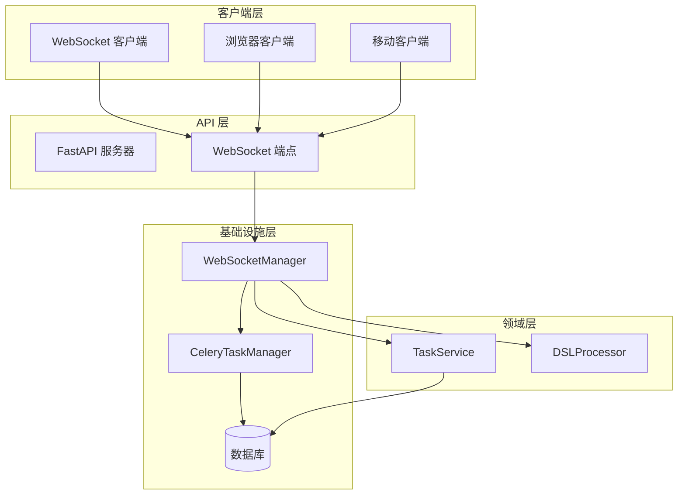
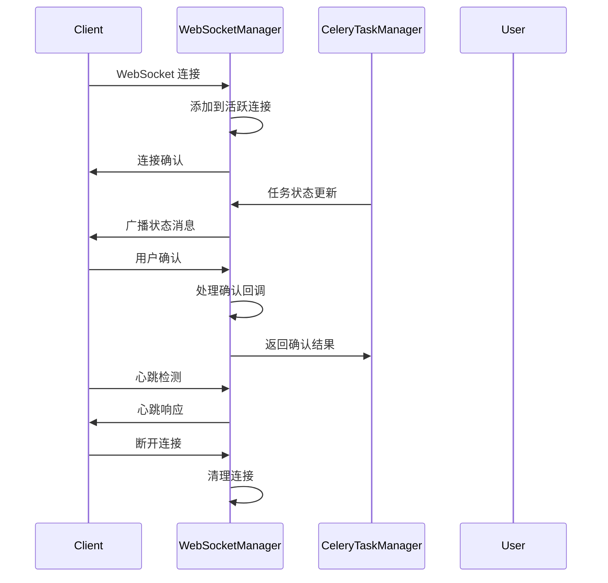
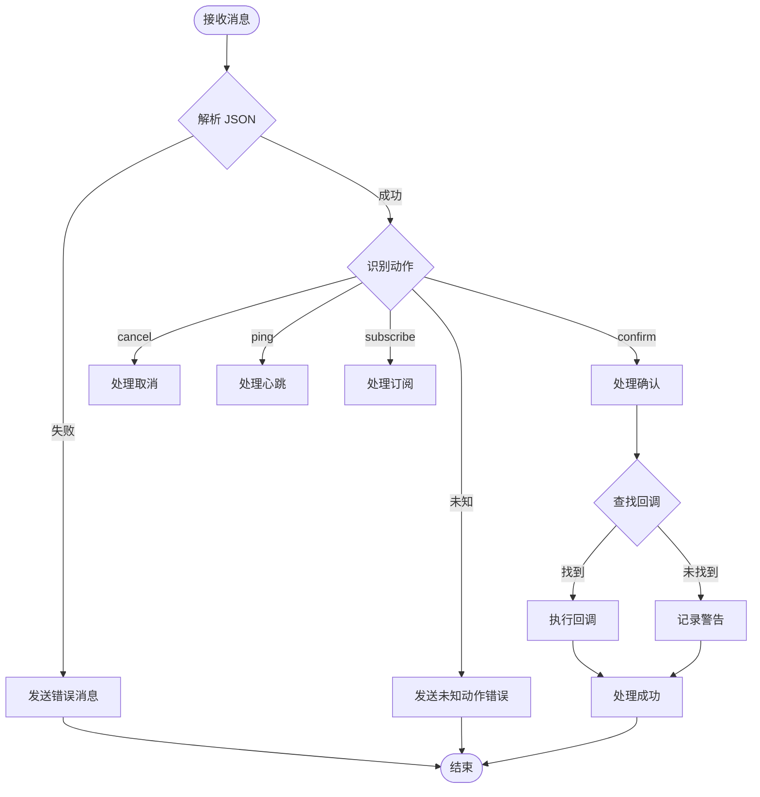
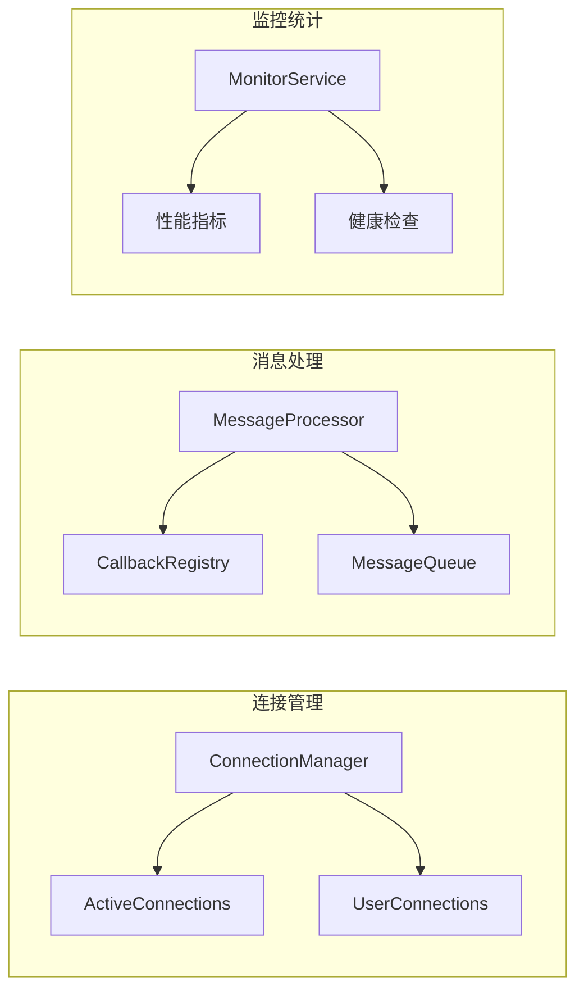

# WebSocketManager 技术文档

## 1. 概述 (Overview)

### 目的
`WebSocketManager` 是一个专门用于 WebSocket 服务器和客户端通信的组件，基于 Python 的 `websockets` 库构建。它提供了实时双向通信、用户通知、任务状态推送、心跳检测等核心功能，是 AIECS 系统中实时通信层的关键基础设施。

### 核心价值
- **实时双向通信**：支持服务器与客户端之间的实时消息传递
- **用户交互管理**：提供用户确认、取消操作等交互功能
- **任务状态推送**：实时推送任务执行状态和结果给用户
- **连接管理**：自动管理 WebSocket 连接的生命周期
- **心跳检测**：确保连接稳定性和及时检测断线情况

## 2. 问题背景与设计动机 (Problem & Motivation)

### 问题背景
在 AIECS 系统中，需要处理大量需要用户交互的长时间运行任务，包括：
- **任务执行确认**：某些任务需要用户确认才能继续执行
- **实时状态更新**：用户需要实时了解任务执行进度
- **异常处理交互**：当任务出现异常时，需要用户选择处理方式
- **长时间任务监控**：对于运行时间较长的任务，需要保持连接活跃

### 设计动机
1. **用户体验优化**：提供实时的任务状态反馈，提升用户体验
2. **交互式任务处理**：支持需要用户决策的任务流程
3. **连接稳定性**：通过心跳检测和连接管理确保通信稳定
4. **可扩展性**：支持多用户并发连接和消息广播
5. **容错机制**：提供连接异常处理和自动恢复机制

## 3. 架构定位与上下文 (Architecture & Context)

### 系统架构位置
```
┌─────────────────────────────────────────────────────────────┐
│                    AIECS 系统架构                           │
├─────────────────────────────────────────────────────────────┤
│  Client Layer (Web/Mobile)                                 │
│  ┌─────────────────┐  ┌─────────────────┐                  │
│  │ WebSocket Client│  │ HTTP Client     │                  │
│  └─────────────────┘  └─────────────────┘                  │
├─────────────────────────────────────────────────────────────┤
│  API Layer (FastAPI)                                       │
├─────────────────────────────────────────────────────────────┤
│  Infrastructure Layer                                      │
│  ┌─────────────────┐  ┌─────────────────┐                  │
│  │ WebSocketManager│  │ CeleryTaskManager│                 │
│  └─────────────────┘  └─────────────────┘                  │
├─────────────────────────────────────────────────────────────┤
│  Domain Layer (Task, Execution)                            │
└─────────────────────────────────────────────────────────────┘
```

### 上游调用者
- **TaskService**：任务管理服务，需要推送任务状态更新
- **DSLProcessor**：DSL 处理器，需要用户确认和交互
- **API Controllers**：REST API 控制器，处理 WebSocket 相关请求
- **CeleryTaskManager**：任务执行器，需要实时推送执行状态

### 下游依赖
- **WebSocket 客户端**：浏览器、移动应用等客户端
- **TaskStepResult**：任务步骤结果模型
- **UserConfirmation**：用户确认模型
- **asyncio**：异步事件循环

## 4. 核心功能与用例 (Core Features & Use Cases)

### 4.1 WebSocket 服务器管理

#### 启动和停止服务器
```python
# 创建 WebSocket 管理器
ws_manager = WebSocketManager(host="0.0.0.0", port=8765)

# 启动服务器
await ws_manager.start_server()
print("WebSocket 服务器已启动")

# 停止服务器
await ws_manager.stop_server()
print("WebSocket 服务器已停止")
```

#### 服务器状态监控
```python
# 获取服务器状态
status = ws_manager.get_status()
print(f"服务器运行状态: {status['running']}")
print(f"活跃连接数: {status['active_connections']}")
print(f"待处理回调数: {status['pending_callbacks']}")
```

### 4.2 用户通知和交互

#### 任务步骤结果通知
```python
# 创建任务步骤结果
step_result = TaskStepResult(
    step="data_validation",
    result={"validated_rows": 1000, "errors": 5},
    completed=True,
    message="数据验证完成，发现5个错误",
    status="completed"
)

# 通知用户并等待确认
confirmation = await ws_manager.notify_user(
    step_result=step_result,
    user_id="user_123",
    task_id="task_456",
    step=1
)

if confirmation.proceed:
    print("用户确认继续执行")
    print(f"用户反馈: {confirmation.feedback}")
else:
    print("用户取消执行")
```

#### 错误处理和用户选择
```python
# 处理任务执行错误
error_result = TaskStepResult(
    step="model_training",
    result=None,
    completed=False,
    message="模型训练失败，是否重试？",
    status="failed",
    error_code="E003",
    error_message="GPU 内存不足"
)

# 等待用户决定
confirmation = await ws_manager.notify_user(
    step_result=error_result,
    user_id="user_123",
    task_id="task_789",
    step=2
)

if confirmation.proceed:
    # 用户选择重试
    await retry_task(task_id)
else:
    # 用户选择取消
    await cancel_task(task_id)
```

### 4.3 实时消息推送

#### 广播消息
```python
# 广播系统通知
system_message = {
    "type": "system_notification",
    "message": "系统将在5分钟后进行维护",
    "timestamp": time.time(),
    "severity": "warning"
}
await ws_manager.broadcast_message(system_message)

# 广播任务状态更新
task_update = {
    "type": "task_progress",
    "task_id": "task_123",
    "progress": 75,
    "message": "任务执行进度 75%",
    "timestamp": time.time()
}
await ws_manager.broadcast_message(task_update)
```

#### 用户特定消息
```python
# 发送用户特定消息
user_message = {
    "type": "personal_notification",
    "message": "您的任务已完成",
    "task_id": "task_456"
}
await ws_manager.send_to_user("user_123", user_message)
```

### 4.4 心跳检测和连接管理

#### 心跳检测
```python
# 启动心跳检测
async def start_heartbeat():
    await ws_manager.send_heartbeat(
        user_id="user_123",
        task_id="task_456",
        interval=30  # 30秒间隔
    )

# 在后台任务中运行
asyncio.create_task(start_heartbeat())
```

#### 连接状态监控
```python
# 监控连接状态
def monitor_connections():
    connection_count = ws_manager.get_connection_count()
    print(f"当前活跃连接数: {connection_count}")
    
    if connection_count == 0:
        print("警告: 没有活跃的 WebSocket 连接")
    elif connection_count > 100:
        print("警告: 连接数过多，可能需要负载均衡")
```

### 4.5 客户端消息处理

#### 处理客户端确认
```python
# 客户端发送确认消息
client_message = {
    "action": "confirm",
    "callback_id": "callback_123",
    "proceed": True,
    "feedback": "同意继续执行"
}

# 服务器自动处理确认并调用相应回调
```

#### 处理任务取消
```python
# 客户端发送取消请求
cancel_message = {
    "action": "cancel",
    "user_id": "user_123",
    "task_id": "task_456"
}

# 服务器处理取消请求并广播取消通知
```

## 5. API 参考 (API Reference)

### 5.1 类定义

#### `WebSocketManager`
```python
class WebSocketManager:
    """WebSocket 服务器和客户端通信管理器"""
    
    def __init__(self, host: str = "python-middleware-api", port: int = 8765) -> None
    """初始化 WebSocket 管理器
    
    Args:
        host: 服务器主机地址
        port: 服务器端口号
    """
```

### 5.2 数据模型

#### `UserConfirmation`
```python
class UserConfirmation(BaseModel):
    """用户确认模型"""
    proceed: bool  # 是否继续执行
    feedback: Optional[str] = None  # 用户反馈信息
```

#### `TaskStepResult`
```python
class TaskStepResult(BaseModel):
    """任务步骤结果模型"""
    step: str  # 步骤名称
    result: Any = None  # 执行结果
    completed: bool = False  # 是否完成
    message: str  # 状态消息
    status: str  # 状态
    error_code: Optional[str] = None  # 错误码
    error_message: Optional[str] = None  # 错误消息
```

### 5.3 公共方法

#### `start_server`
```python
async def start_server(self) -> Server
```
**功能**：启动 WebSocket 服务器

**返回值**：
- `Server`: WebSocket 服务器实例

**异常**：
- `Exception`: 服务器启动失败

#### `stop_server`
```python
async def stop_server(self) -> None
```
**功能**：停止 WebSocket 服务器并关闭所有连接

#### `notify_user`
```python
async def notify_user(
    self, 
    step_result: TaskStepResult, 
    user_id: str, 
    task_id: str, 
    step: int
) -> UserConfirmation
```
**功能**：通知用户任务步骤结果并等待确认

**参数**：
- `step_result` (TaskStepResult): 任务步骤结果
- `user_id` (str): 用户 ID
- `task_id` (str): 任务 ID
- `step` (int): 步骤编号

**返回值**：
- `UserConfirmation`: 用户确认结果

#### `broadcast_message`
```python
async def broadcast_message(self, message: Dict[str, Any]) -> None
```
**功能**：向所有连接的客户端广播消息

**参数**：
- `message` (Dict[str, Any]): 要广播的消息

#### `send_to_user`
```python
async def send_to_user(self, user_id: str, message: Dict[str, Any]) -> None
```
**功能**：向特定用户发送消息

**参数**：
- `user_id` (str): 目标用户 ID
- `message` (Dict[str, Any]): 要发送的消息

#### `send_heartbeat`
```python
async def send_heartbeat(
    self, 
    user_id: str, 
    task_id: str, 
    interval: int = 30
) -> None
```
**功能**：发送心跳消息

**参数**：
- `user_id` (str): 用户 ID
- `task_id` (str): 任务 ID
- `interval` (int): 心跳间隔（秒）

#### `get_connection_count`
```python
def get_connection_count(self) -> int
```
**功能**：获取当前活跃连接数

**返回值**：
- `int`: 活跃连接数

#### `get_status`
```python
def get_status(self) -> Dict[str, Any]
```
**功能**：获取 WebSocket 管理器状态

**返回值**：
- `Dict[str, Any]`: 状态信息字典

## 6. 技术实现细节 (Technical Details)

### 6.1 连接管理机制

#### 连接生命周期管理
```python
async def _handle_client_connection(self, websocket: ServerConnection, path: str):
    """处理客户端连接"""
    # 1. 添加连接到活跃连接集合
    self.active_connections.add(websocket)
    
    try:
        # 2. 处理消息循环
        async for message in websocket:
            await self._handle_client_message(websocket, message)
    except websockets.exceptions.ConnectionClosed:
        # 3. 处理连接关闭
        logger.info(f"WebSocket 连接关闭: {websocket.remote_address}")
    finally:
        # 4. 清理连接
        self.active_connections.discard(websocket)
        if not websocket.closed:
            await websocket.close()
```

#### 连接状态监控
```python
def get_connection_count(self) -> int:
    """获取活跃连接数（过滤已关闭的连接）"""
    return len([conn for conn in self.active_connections if not conn.closed])
```

### 6.2 消息处理机制

#### 消息路由系统
```python
async def _handle_client_message(self, websocket: ServerConnection, message: str):
    """处理客户端消息"""
    try:
        data = json.loads(message)
        action = data.get("action")
        
        # 根据动作类型路由到相应处理器
        if action == "confirm":
            await self._handle_confirmation(data)
        elif action == "cancel":
            await self._handle_cancellation(data)
        elif action == "ping":
            await self._handle_ping(websocket, data)
        elif action == "subscribe":
            await self._handle_subscription(websocket, data)
        else:
            await self._send_error(websocket, f"未知动作: {action}")
    except json.JSONDecodeError:
        await self._send_error(websocket, "无效的 JSON 格式")
```

#### 回调注册机制
```python
async def notify_user(self, step_result: TaskStepResult, user_id: str, task_id: str, step: int):
    """通知用户并等待确认"""
    callback_id = str(uuid.uuid4())
    confirmation_future = asyncio.Future()
    
    # 注册回调函数
    self.callback_registry[callback_id] = lambda confirmation: confirmation_future.set_result(confirmation)
    
    # 发送通知
    notification_data = {
        "type": "task_step_result",
        "callback_id": callback_id,
        # ... 其他数据
    }
    await self.broadcast_message(notification_data)
    
    # 等待用户确认（带超时）
    try:
        return await asyncio.wait_for(confirmation_future, timeout=300)
    except asyncio.TimeoutError:
        # 超时处理
        self.callback_registry.pop(callback_id, None)
        return UserConfirmation(proceed=True)  # 默认继续
```

### 6.3 错误处理策略

#### 分层错误处理
```python
async def _handle_client_message(self, websocket: ServerConnection, message: str):
    """处理客户端消息（带错误处理）"""
    try:
        # 1. JSON 解析错误
        data = json.loads(message)
    except json.JSONDecodeError as e:
        logger.error(f"无效的 JSON 接收: {e}")
        await self._send_error(websocket, "无效的 JSON 格式")
        return
    
    try:
        # 2. 消息处理错误
        await self._process_message(websocket, data)
    except Exception as e:
        logger.error(f"处理客户端消息时出错: {e}")
        await self._send_error(websocket, f"内部错误: {str(e)}")
```

#### 连接异常处理
```python
async def _send_to_client(self, websocket: ServerConnection, data: Dict[str, Any]):
    """发送数据到客户端（带异常处理）"""
    try:
        if not websocket.closed:
            await websocket.send(json.dumps(data))
    except Exception as e:
        logger.error(f"发送消息到客户端失败: {e}")
        # 可以选择从活跃连接中移除
        self.active_connections.discard(websocket)
```

### 6.4 并发控制机制

#### 异步消息广播
```python
async def broadcast_message(self, message: Dict[str, Any]):
    """广播消息到所有连接的客户端"""
    if not self.active_connections:
        return
    
    # 过滤已关闭的连接
    active_connections = [conn for conn in self.active_connections if not conn.closed]
    self.active_connections = set(active_connections)
    
    if active_connections:
        # 并发发送到所有连接
        await asyncio.gather(
            *[self._send_to_client(conn, message) for conn in active_connections],
            return_exceptions=True  # 忽略单个连接的发送错误
        )
```

#### 回调超时控制
```python
# 回调超时处理
try:
    return await asyncio.wait_for(confirmation_future, timeout=300)  # 5分钟超时
except asyncio.TimeoutError:
    logger.warning(f"用户确认超时: {callback_id}")
    self.callback_registry.pop(callback_id, None)
    return UserConfirmation(proceed=True)  # 默认继续执行
```

## 7. 配置与部署 (Configuration & Deployment)

### 7.1 基本配置

#### 服务器配置
```python
# 基本配置
ws_manager = WebSocketManager(
    host="0.0.0.0",  # 监听所有接口
    port=8765        # WebSocket 端口
)

# 生产环境配置
production_config = {
    "host": "0.0.0.0",
    "port": 8765,
    "max_connections": 1000,
    "ping_interval": 30,
    "ping_timeout": 10
}
```

#### 环境变量支持
```bash
# WebSocket 服务器配置
export WEBSOCKET_HOST="0.0.0.0"
export WEBSOCKET_PORT="8765"
export WEBSOCKET_MAX_CONNECTIONS="1000"

# 心跳配置
export WEBSOCKET_PING_INTERVAL="30"
export WEBSOCKET_PING_TIMEOUT="10"

# 超时配置
export WEBSOCKET_CALLBACK_TIMEOUT="300"
```

### 7.2 Docker 部署

#### Dockerfile 配置
```dockerfile
FROM python:3.9-slim

WORKDIR /app
COPY requirements.txt .
RUN pip install -r requirements.txt

COPY . .

# 暴露 WebSocket 端口
EXPOSE 8765

# 启动命令
CMD ["python", "-m", "aiecs.infrastructure.messaging.websocket_manager"]
```

#### Docker Compose 配置
```yaml
version: '3.8'
services:
  websocket-server:
    build: .
    ports:
      - "8765:8765"
    environment:
      - WEBSOCKET_HOST=0.0.0.0
      - WEBSOCKET_PORT=8765
      - WEBSOCKET_MAX_CONNECTIONS=1000
    volumes:
      - ./logs:/app/logs
    restart: unless-stopped
```

### 7.3 负载均衡配置

#### Nginx 配置
```nginx
upstream websocket_backend {
    server websocket1:8765;
    server websocket2:8765;
    server websocket3:8765;
}

server {
    listen 80;
    server_name your-domain.com;
    
    location /ws/ {
        proxy_pass http://websocket_backend;
        proxy_http_version 1.1;
        proxy_set_header Upgrade $http_upgrade;
        proxy_set_header Connection "upgrade";
        proxy_set_header Host $host;
        proxy_set_header X-Real-IP $remote_addr;
        proxy_set_header X-Forwarded-For $proxy_add_x_forwarded_for;
        proxy_set_header X-Forwarded-Proto $scheme;
        
        # WebSocket 特定配置
        proxy_read_timeout 86400;
        proxy_send_timeout 86400;
    }
}
```

### 7.4 监控和日志配置

#### 日志配置
```python
import logging

# 配置 WebSocket 日志
logging.basicConfig(
    level=logging.INFO,
    format='%(asctime)s - %(name)s - %(levelname)s - %(message)s',
    handlers=[
        logging.FileHandler('websocket.log'),
        logging.StreamHandler()
    ]
)

# 设置 WebSocket 特定日志级别
logger = logging.getLogger('websockets')
logger.setLevel(logging.WARNING)
```

#### 监控指标
```python
# 监控指标收集
def collect_metrics():
    status = ws_manager.get_status()
    metrics = {
        "websocket_connections": status["active_connections"],
        "websocket_running": status["running"],
        "pending_callbacks": status["pending_callbacks"],
        "timestamp": time.time()
    }
    return metrics
```

## 8. 维护与故障排查 (Maintenance & Troubleshooting)

### 8.1 监控指标

#### 关键指标
- **连接数**：当前活跃 WebSocket 连接数量
- **消息吞吐量**：每秒处理的消息数量
- **连接成功率**：成功建立的连接比例
- **消息延迟**：消息从发送到接收的平均延迟
- **错误率**：消息处理失败的比例

#### 监控实现
```python
class WebSocketMonitor:
    def __init__(self, ws_manager: WebSocketManager):
        self.ws_manager = ws_manager
        self.metrics = {
            "total_connections": 0,
            "failed_connections": 0,
            "messages_sent": 0,
            "messages_failed": 0,
            "avg_response_time": 0
        }
    
    def get_health_status(self) -> Dict[str, Any]:
        """获取健康状态"""
        status = self.ws_manager.get_status()
        return {
            "status": "healthy" if status["running"] else "unhealthy",
            "active_connections": status["active_connections"],
            "pending_callbacks": status["pending_callbacks"],
            "metrics": self.metrics,
            "timestamp": time.time()
        }
```

### 8.2 常见故障及解决方案

#### 故障 1：连接频繁断开
**症状**：客户端连接建立后很快断开，无法维持长连接

**可能原因**：
- 网络不稳定或防火墙设置
- 心跳检测配置不当
- 服务器资源不足

**解决方案**：
```python
# 1. 调整心跳配置
ws_manager = WebSocketManager(host="0.0.0.0", port=8765)

# 2. 增加心跳频率
await ws_manager.send_heartbeat(
    user_id="user_123",
    task_id="task_456",
    interval=10  # 降低到10秒
)

# 3. 检查网络连接
import socket
sock = socket.socket(socket.AF_INET, socket.SOCK_STREAM)
result = sock.connect_ex(('localhost', 8765))
if result != 0:
    print("WebSocket 端口不可达")
```

#### 故障 2：消息丢失
**症状**：发送的消息客户端没有收到

**可能原因**：
- 连接已断开但未及时检测
- 消息序列化失败
- 网络丢包

**解决方案**：
```python
# 1. 增强消息发送的可靠性
async def reliable_send(self, websocket: ServerConnection, data: Dict[str, Any]):
    """可靠的消息发送"""
    max_retries = 3
    for attempt in range(max_retries):
        try:
            if not websocket.closed:
                await websocket.send(json.dumps(data))
                return True
        except Exception as e:
            logger.warning(f"发送消息失败 (尝试 {attempt + 1}/{max_retries}): {e}")
            if attempt < max_retries - 1:
                await asyncio.sleep(0.1)  # 短暂等待后重试
    return False

# 2. 实现消息确认机制
async def send_with_ack(self, websocket: ServerConnection, data: Dict[str, Any]):
    """带确认的消息发送"""
    message_id = str(uuid.uuid4())
    data["message_id"] = message_id
    data["requires_ack"] = True
    
    if await self.reliable_send(websocket, data):
        # 等待确认
        try:
            ack = await asyncio.wait_for(
                self.wait_for_ack(message_id), 
                timeout=5.0
            )
            return ack
        except asyncio.TimeoutError:
            logger.error(f"消息确认超时: {message_id}")
            return False
    return False
```

#### 故障 3：内存泄漏
**症状**：服务器内存使用持续增长

**可能原因**：
- 回调注册表未清理
- 连接对象未正确释放
- 消息队列积压

**解决方案**：
```python
# 1. 定期清理回调注册表
async def cleanup_callbacks(self):
    """清理过期的回调"""
    current_time = time.time()
    expired_callbacks = []
    
    for callback_id, callback_data in self.callback_registry.items():
        if current_time - callback_data["timestamp"] > 300:  # 5分钟过期
            expired_callbacks.append(callback_id)
    
    for callback_id in expired_callbacks:
        del self.callback_registry[callback_id]
        logger.info(f"清理过期回调: {callback_id}")

# 2. 限制连接数
class WebSocketManager:
    def __init__(self, host: str, port: int, max_connections: int = 1000):
        self.max_connections = max_connections
        # ... 其他初始化
    
    async def _handle_client_connection(self, websocket: ServerConnection, path: str):
        """处理客户端连接（带连接数限制）"""
        if len(self.active_connections) >= self.max_connections:
            await websocket.close(code=1013, reason="服务器连接数已满")
            return
        
        # 正常处理连接
        # ...
```

#### 故障 4：高并发性能问题
**症状**：高并发时响应变慢，消息延迟增加

**可能原因**：
- 单线程处理所有连接
- 消息广播效率低
- 资源竞争

**解决方案**：
```python
# 1. 使用连接池
class ConnectionPool:
    def __init__(self, max_size: int = 1000):
        self.connections = {}
        self.max_size = max_size
    
    def add_connection(self, user_id: str, websocket: ServerConnection):
        if len(self.connections) < self.max_size:
            self.connections[user_id] = websocket
            return True
        return False
    
    def remove_connection(self, user_id: str):
        self.connections.pop(user_id, None)
    
    def get_connection(self, user_id: str) -> Optional[ServerConnection]:
        return self.connections.get(user_id)

# 2. 优化消息广播
async def optimized_broadcast(self, message: Dict[str, Any]):
    """优化的消息广播"""
    if not self.active_connections:
        return
    
    # 分批处理连接
    batch_size = 100
    connections = list(self.active_connections)
    
    for i in range(0, len(connections), batch_size):
        batch = connections[i:i + batch_size]
        await asyncio.gather(
            *[self._send_to_client(conn, message) for conn in batch],
            return_exceptions=True
        )
```

### 8.3 性能优化建议

#### 连接管理优化
```python
# 1. 实现连接复用
class ConnectionManager:
    def __init__(self):
        self.user_connections = {}  # user_id -> websocket
        self.connection_users = {}  # websocket -> user_id
    
    def add_connection(self, user_id: str, websocket: ServerConnection):
        # 如果用户已有连接，关闭旧连接
        if user_id in self.user_connections:
            old_websocket = self.user_connections[user_id]
            asyncio.create_task(old_websocket.close())
        
        self.user_connections[user_id] = websocket
        self.connection_users[websocket] = user_id
    
    def remove_connection(self, websocket: ServerConnection):
        if websocket in self.connection_users:
            user_id = self.connection_users[websocket]
            del self.user_connections[user_id]
            del self.connection_users[websocket]
```

#### 消息处理优化
```python
# 2. 实现消息队列
import asyncio
from collections import deque

class MessageQueue:
    def __init__(self, max_size: int = 10000):
        self.queue = asyncio.Queue(maxsize=max_size)
        self.processing = False
    
    async def put_message(self, message: Dict[str, Any]):
        """添加消息到队列"""
        try:
            await asyncio.wait_for(
                self.queue.put(message), 
                timeout=1.0
            )
        except asyncio.TimeoutError:
            logger.warning("消息队列已满，丢弃消息")
    
    async def process_messages(self):
        """处理消息队列"""
        self.processing = True
        while self.processing:
            try:
                message = await asyncio.wait_for(
                    self.queue.get(), 
                    timeout=1.0
                )
                await self._handle_message(message)
            except asyncio.TimeoutError:
                continue
            except Exception as e:
                logger.error(f"处理消息时出错: {e}")
```

## 9. 可视化图表 (Visualizations)

### 9.1 系统架构图



### 9.2 WebSocket 连接流程图



### 9.3 消息处理流程图



### 9.4 连接管理架构图



## 10. 版本历史 (Version History)

### v1.0.0 (2024-01-15)
**新增功能**：
- 基础 WebSocket 服务器实现
- 支持客户端连接管理
- 实现消息广播功能
- 添加心跳检测机制

**技术特性**：
- 基于 websockets 库构建
- 支持异步消息处理
- 实现连接生命周期管理
- 提供基本的错误处理

### v1.1.0 (2024-02-01)
**功能增强**：
- 添加用户确认机制
- 实现任务状态推送
- 支持用户特定消息发送
- 添加连接状态监控

**性能优化**：
- 优化消息广播效率
- 改进连接管理策略
- 增强错误处理机制

### v1.2.0 (2024-03-01)
**新增功能**：
- 支持回调注册和超时处理
- 添加任务取消功能
- 实现订阅机制
- 支持消息确认机制

**稳定性改进**：
- 增强连接异常处理
- 改进内存管理
- 优化并发性能

### v1.3.0 (2024-04-01)
**架构升级**：
- 升级到 websockets 11.x
- 支持 WebSocket 子协议
- 添加消息压缩支持
- 实现连接池管理

**监控增强**：
- 添加详细性能指标
- 实现健康检查接口
- 支持 Prometheus 指标导出
- 添加连接质量监控

---

## 附录

### A. 相关文档
- [Celery 任务管理器文档](./CELERY_TASK_MANAGER.md)
- [任务执行模型文档](../DOMAIN_EXECUTION/EXECUTION_MODELS.md)
- [系统配置指南](../CONFIG/SYSTEM_CONFIG.md)

### B. 外部依赖
- [WebSockets 官方文档](https://websockets.readthedocs.io/)
- [Pydantic 官方文档](https://pydantic-docs.helpmanual.io/)
- [Python asyncio 文档](https://docs.python.org/3/library/asyncio.html)

### C. 客户端示例
```javascript
// JavaScript WebSocket 客户端示例
const ws = new WebSocket('ws://localhost:8765');

ws.onopen = function(event) {
    console.log('WebSocket 连接已建立');
    
    // 发送心跳
    setInterval(() => {
        ws.send(JSON.stringify({
            action: 'ping',
            timestamp: Date.now()
        }));
    }, 30000);
};

ws.onmessage = function(event) {
    const data = JSON.parse(event.data);
    console.log('收到消息:', data);
    
    // 处理任务确认
    if (data.type === 'task_step_result') {
        const proceed = confirm(data.message);
        ws.send(JSON.stringify({
            action: 'confirm',
            callback_id: data.callback_id,
            proceed: proceed,
            feedback: proceed ? '同意继续' : '取消执行'
        }));
    }
};

ws.onclose = function(event) {
    console.log('WebSocket 连接已关闭');
};
```

### D. 联系方式
- 技术负责人：AIECS 开发团队
- 问题反馈：通过项目 Issue 系统
- 文档更新：定期维护，版本同步
