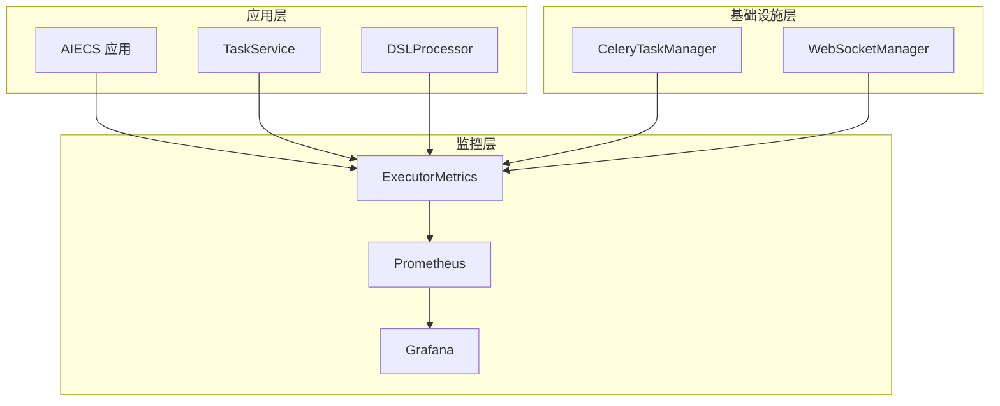
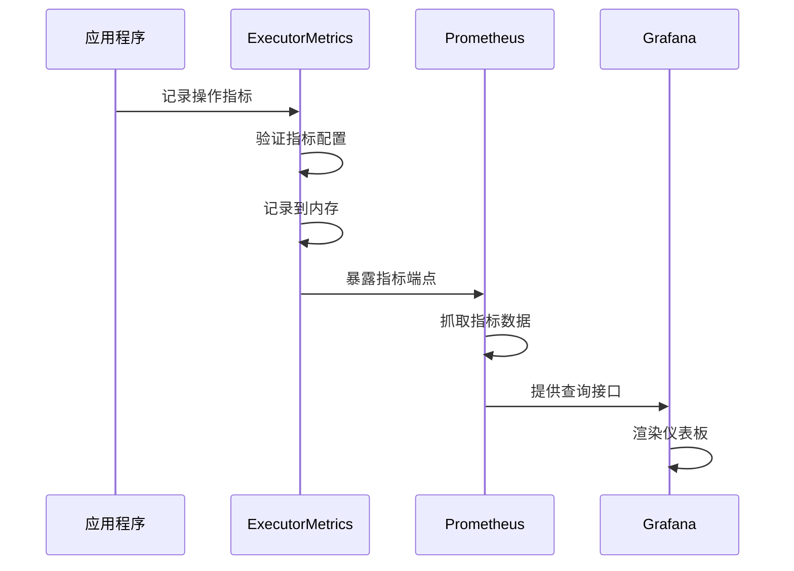
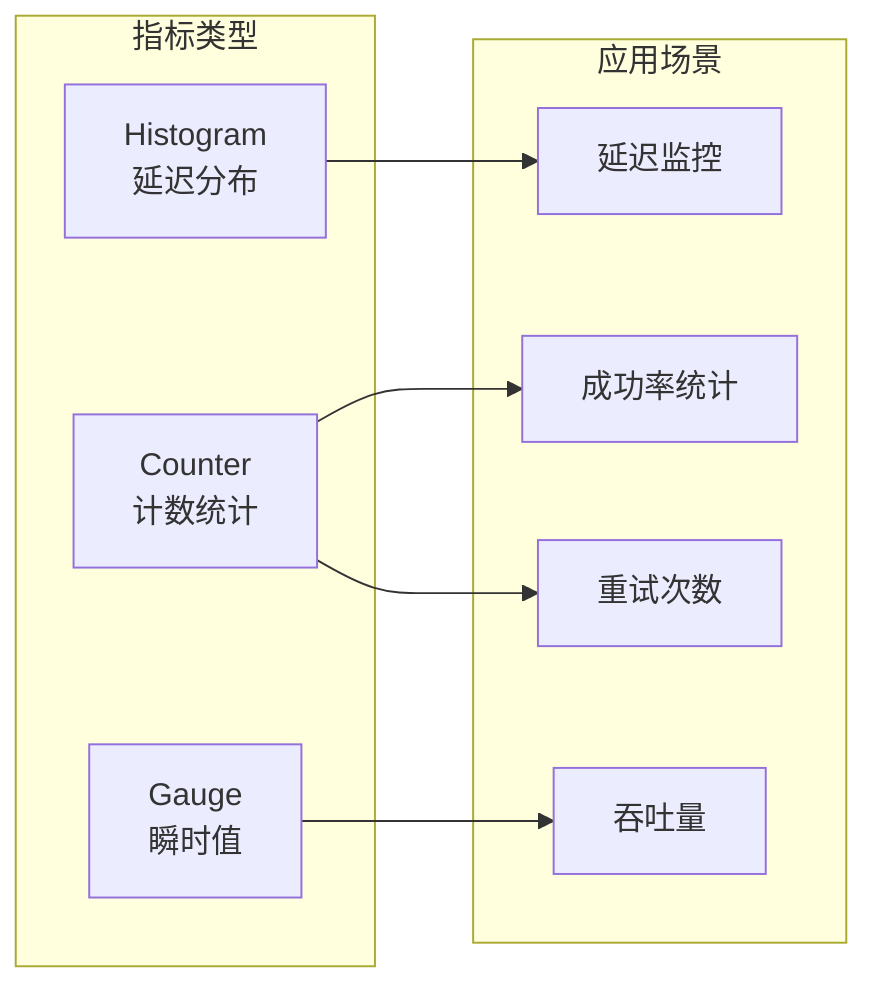
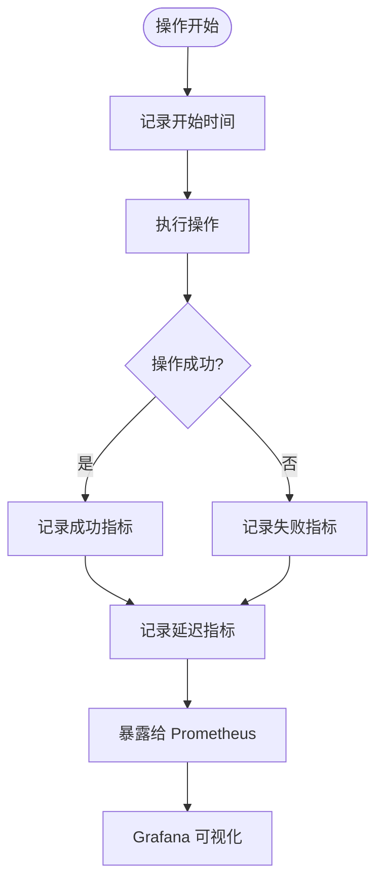

# ExecutorMetrics 技术文档

## 1. 概述 (Overview)

### 目的
`ExecutorMetrics` 是一个专门用于执行器性能监控和指标收集的组件，基于 Prometheus 客户端库构建。它提供了任务执行延迟、成功率、重试次数等关键性能指标的收集、记录和暴露功能，是 AIECS 系统中监控和可观测性的核心基础设施。

### 核心价值
- **性能监控**：实时监控任务执行的延迟、成功率等关键指标
- **可观测性**：提供系统运行状态的全面可见性
- **问题诊断**：通过指标数据快速定位性能瓶颈和异常
- **容量规划**：基于历史数据预测系统容量需求
- **SLA 保障**：确保系统满足服务级别协议要求

## 2. 问题背景与设计动机 (Problem & Motivation)

### 问题背景
在 AIECS 系统中，需要处理大量复杂的任务执行，包括：
- **性能瓶颈识别**：无法快速识别哪些任务类型或操作导致性能问题
- **系统健康监控**：缺乏对系统整体运行状态的实时监控
- **容量规划困难**：无法基于历史数据预测系统负载和资源需求
- **故障排查复杂**：出现问题时难以快速定位根本原因
- **SLA 监控缺失**：无法量化系统是否满足服务级别协议

### 设计动机
1. **性能优化**：通过指标数据识别性能瓶颈，指导系统优化
2. **故障预防**：通过监控指标提前发现潜在问题
3. **容量管理**：基于历史数据制定容量规划策略
4. **运维效率**：提供自动化监控和告警能力
5. **业务洞察**：通过指标数据了解业务使用模式

## 3. 架构定位与上下文 (Architecture & Context)

### 系统架构位置
```
┌─────────────────────────────────────────────────────────────┐
│                    AIECS 系统架构                           │
├─────────────────────────────────────────────────────────────┤
│  监控层 (Monitoring Layer)                                 │
│  ┌─────────────────┐  ┌─────────────────┐                  │
│  │ ExecutorMetrics │  │ Prometheus      │                  │
│  └─────────────────┘  └─────────────────┘                  │
├─────────────────────────────────────────────────────────────┤
│  基础设施层 (Infrastructure Layer)                         │
│  ┌─────────────────┐  ┌─────────────────┐                  │
│  │ CeleryTaskManager│  │ WebSocketManager│                 │
│  └─────────────────┘  └─────────────────┘                  │
├─────────────────────────────────────────────────────────────┤
│  领域层 (Domain Layer)                                     │
│  ┌─────────────────┐  ┌─────────────────┐                  │
│  │ TaskService     │  │ DSLProcessor    │                  │
│  └─────────────────┘  └─────────────────┘                  │
└─────────────────────────────────────────────────────────────┘
```

### 上游调用者
- **TaskService**：任务管理服务，需要监控任务执行性能
- **DSLProcessor**：DSL 处理器，需要监控计划生成和执行性能
- **CeleryTaskManager**：任务执行器，需要监控任务执行指标
- **WebSocketManager**：WebSocket 管理器，需要监控连接性能

### 下游依赖
- **Prometheus**：指标收集和存储系统
- **Grafana**：指标可视化和仪表板
- **AlertManager**：基于指标的告警系统
- **prometheus_client**：Python Prometheus 客户端库

## 4. 核心功能与用例 (Core Features & Use Cases)

### 4.1 指标收集和记录

#### 延迟指标记录
```python
# 创建指标收集器
metrics = ExecutorMetrics(enable_metrics=True, metrics_port=8001)

# 记录意图解析延迟
start_time = time.time()
intent_result = await parse_user_intent(user_input)
duration = time.time() - start_time
metrics.record_operation_latency("intent", duration)

# 记录任务计划延迟
start_time = time.time()
plan = await generate_task_plan(intent_result)
duration = time.time() - start_time
metrics.record_operation_latency("plan", duration)

# 记录任务执行延迟（带标签）
start_time = time.time()
result = await execute_task(task_data)
duration = time.time() - start_time
metrics.record_operation_latency("execute", duration)
```

#### 成功率指标记录
```python
# 记录成功操作
try:
    result = await process_task(task_data)
    metrics.record_operation_success("execute", labels={"task_type": "data_processing"})
except Exception as e:
    metrics.record_operation_failure("execute", "execution_error", 
                                   labels={"task_type": "data_processing"})

# 记录重试次数
for attempt in range(max_retries):
    try:
        result = await retry_operation()
        break
    except Exception:
        metrics.record_retry("execute", attempt + 1)
```

### 4.2 装饰器监控

#### 使用装饰器自动监控
```python
# 使用装饰器监控函数性能
@metrics.with_metrics("intent_parsing")
async def parse_user_intent(user_input: str) -> Dict[str, Any]:
    """解析用户意图"""
    # 函数执行逻辑
    return intent_result

@metrics.with_metrics("task_planning", labels={"plan_type": "complex"})
async def generate_complex_plan(intent: Dict[str, Any]) -> List[Dict[str, Any]]:
    """生成复杂任务计划"""
    # 计划生成逻辑
    return plan_steps

# 带标签的监控
@metrics.with_metrics("task_execution", labels={"task_type": "ml_training"})
async def execute_ml_training(data: Dict[str, Any]) -> Dict[str, Any]:
    """执行机器学习训练任务"""
    # 训练逻辑
    return training_result
```

### 4.3 综合操作记录

#### 记录完整的操作指标
```python
# 记录完整的操作指标
async def process_user_request(user_input: str, user_id: str):
    """处理用户请求的完整流程"""
    start_time = time.time()
    
    try:
        # 1. 意图解析
        intent_start = time.time()
        intent = await parse_user_intent(user_input)
        intent_duration = time.time() - intent_start
        
        # 2. 任务计划
        plan_start = time.time()
        plan = await generate_task_plan(intent)
        plan_duration = time.time() - plan_start
        
        # 3. 任务执行
        execute_start = time.time()
        result = await execute_task(plan)
        execute_duration = time.time() - execute_start
        
        # 记录成功指标
        metrics.record_operation("intent", success=True, duration=intent_duration)
        metrics.record_operation("plan", success=True, duration=plan_duration)
        metrics.record_operation("execute", success=True, duration=execute_duration,
                               labels={"task_type": plan.get("type", "unknown")})
        
        return result
        
    except Exception as e:
        # 记录失败指标
        total_duration = time.time() - start_time
        metrics.record_operation("intent", success=False, duration=intent_duration,
                               error_type=type(e).__name__)
        raise
```

### 4.4 自定义指标记录

#### 业务特定指标
```python
# 记录业务特定指标
class BusinessMetrics:
    def __init__(self, base_metrics: ExecutorMetrics):
        self.base_metrics = base_metrics
    
    async def record_user_engagement(self, user_id: str, action: str, duration: float):
        """记录用户参与度指标"""
        self.base_metrics.record_operation(
            "user_engagement",
            success=True,
            duration=duration,
            labels={"action": action, "user_id": user_id}
        )
    
    async def record_data_processing_volume(self, data_size: int, processing_time: float):
        """记录数据处理量指标"""
        self.base_metrics.record_operation(
            "data_processing",
            success=True,
            duration=processing_time,
            labels={"data_size_category": self._categorize_data_size(data_size)}
        )
    
    def _categorize_data_size(self, size: int) -> str:
        """根据数据大小分类"""
        if size < 1024:
            return "small"
        elif size < 1024 * 1024:
            return "medium"
        else:
            return "large"
```

### 4.5 指标查询和监控

#### 获取指标摘要
```python
# 获取指标摘要信息
summary = metrics.get_metrics_summary()
print(f"指标启用状态: {summary['metrics_enabled']}")
print(f"指标端口: {summary['metrics_port']}")
print(f"可用指标: {summary['available_metrics']}")

# 检查特定指标是否可用
if "intent_latency" in metrics.metrics:
    print("意图解析延迟指标已启用")
```

#### Prometheus 指标查询示例
```promql
# 查询意图解析平均延迟
rate(intent_latency_seconds_sum[5m]) / rate(intent_latency_seconds_count[5m])

# 查询任务执行成功率
rate(execute_success_total[5m]) / (rate(execute_success_total[5m]) + rate(execute_retries_total[5m]))

# 查询按任务类型分组的执行延迟
histogram_quantile(0.95, rate(execute_latency_seconds_bucket[5m]) by (le, task_type))
```

## 5. API 参考 (API Reference)

### 5.1 类定义

#### `ExecutorMetrics`
```python
class ExecutorMetrics:
    """执行器性能监控和指标收集器"""
    
    def __init__(self, enable_metrics: bool = True, metrics_port: int = 8001) -> None
    """初始化指标收集器
    
    Args:
        enable_metrics: 是否启用指标收集
        metrics_port: Prometheus 指标服务器端口
    """
```

### 5.2 公共方法

#### `record_operation_latency`
```python
def record_operation_latency(self, operation: str, duration: float) -> None
```
**功能**：记录操作延迟

**参数**：
- `operation` (str): 操作名称
- `duration` (float): 操作持续时间（秒）

#### `record_operation_success`
```python
def record_operation_success(self, operation: str, labels: Optional[Dict[str, str]] = None) -> None
```
**功能**：记录操作成功

**参数**：
- `operation` (str): 操作名称
- `labels` (Optional[Dict[str, str]]): 标签字典

#### `record_operation_failure`
```python
def record_operation_failure(self, operation: str, error_type: str, labels: Optional[Dict[str, str]] = None) -> None
```
**功能**：记录操作失败

**参数**：
- `operation` (str): 操作名称
- `error_type` (str): 错误类型
- `labels` (Optional[Dict[str, str]]): 标签字典

#### `record_retry`
```python
def record_retry(self, operation: str, attempt_number: int) -> None
```
**功能**：记录重试次数

**参数**：
- `operation` (str): 操作名称
- `attempt_number` (int): 尝试次数

#### `with_metrics`
```python
def with_metrics(self, metric_name: str, labels: Optional[Dict[str, str]] = None) -> Callable
```
**功能**：监控装饰器

**参数**：
- `metric_name` (str): 指标名称
- `labels` (Optional[Dict[str, str]]): 标签字典

**返回值**：
- `Callable`: 装饰器函数

#### `get_metrics_summary`
```python
def get_metrics_summary(self) -> Dict[str, Any]
```
**功能**：获取指标摘要

**返回值**：
- `Dict[str, Any]`: 指标摘要信息

#### `record_operation`
```python
def record_operation(self, operation_type: str, success: bool = True, duration: Optional[float] = None, **kwargs) -> None
```
**功能**：记录综合操作指标

**参数**：
- `operation_type` (str): 操作类型
- `success` (bool): 是否成功
- `duration` (Optional[float]): 操作持续时间
- `**kwargs`: 其他参数（labels, error_type 等）

#### `record_duration`
```python
def record_duration(self, operation: str, duration: float, labels: Optional[Dict[str, str]] = None) -> None
```
**功能**：记录操作持续时间

**参数**：
- `operation` (str): 操作名称
- `duration` (float): 持续时间
- `labels` (Optional[Dict[str, str]]): 标签字典

## 6. 技术实现细节 (Technical Details)

### 6.1 Prometheus 指标类型

#### Histogram 指标
```python
# 延迟指标使用 Histogram 类型
"intent_latency": Histogram("intent_latency_seconds", "Latency of intent parsing"),
"plan_latency": Histogram("plan_latency_seconds", "Latency of task planning"),
"execute_latency": Histogram("execute_latency_seconds", "Latency of task execution", ["task_type"])

# Histogram 自动提供以下指标：
# - intent_latency_seconds_count: 总请求数
# - intent_latency_seconds_sum: 总延迟时间
# - intent_latency_seconds_bucket: 分桶统计
```

#### Counter 指标
```python
# 计数指标使用 Counter 类型
"intent_success": Counter("intent_success_total", "Number of successful intent parsings"),
"intent_retries": Counter("intent_retries_total", "Number of intent parsing retries"),
"execute_success": Counter("execute_success_total", "Number of successful executions", ["task_type"])

# Counter 只增不减，适合统计成功次数、重试次数等
```

### 6.2 装饰器实现机制

#### 异步函数监控
```python
def with_metrics(self, metric_name: str, labels: Optional[Dict[str, str]] = None):
    """监控装饰器实现"""
    def decorator(func):
        @functools.wraps(func)
        async def wrapper(*args, **kwargs):
            if not self.metrics or f"{metric_name}_latency" not in self.metrics:
                return await func(*args, **kwargs)

            labels_dict = labels or {}
            metric = self.metrics[f"{metric_name}_latency"]
            if labels:
                metric = metric.labels(**labels_dict)

            # 使用 context manager 自动记录时间
            with metric.time():
                try:
                    result = await func(*args, **kwargs)
                    # 记录成功指标
                    if f"{metric_name}_success" in self.metrics:
                        success_metric = self.metrics[f"{metric_name}_success"]
                        if labels:
                            success_metric = success_metric.labels(**labels_dict)
                        success_metric.inc()
                    return result
                except Exception as e:
                    logger.error(f"Error in {func.__name__}: {e}")
                    raise
        return wrapper
    return decorator
```

### 6.3 标签管理机制

#### 动态标签支持
```python
def record_operation_success(self, operation: str, labels: Optional[Dict[str, str]] = None):
    """记录操作成功（支持标签）"""
    if not self.enable_metrics or f"{operation}_success" not in self.metrics:
        return
    
    metric = self.metrics[f"{operation}_success"]
    if labels:
        # 为带标签的指标创建标签实例
        metric = metric.labels(**labels)
    metric.inc()
```

#### 标签验证和清理
```python
def _validate_labels(self, labels: Dict[str, str]) -> Dict[str, str]:
    """验证和清理标签"""
    if not labels:
        return {}
    
    # 移除空值和无效字符
    cleaned_labels = {}
    for key, value in labels.items():
        if value and isinstance(value, str) and len(value.strip()) > 0:
            # 清理标签值，移除特殊字符
            cleaned_value = re.sub(r'[^a-zA-Z0-9_:]', '_', str(value).strip())
            cleaned_labels[key] = cleaned_value
    
    return cleaned_labels
```

### 6.4 错误处理策略

#### 指标记录容错
```python
def record_operation(self, operation_type: str, success: bool = True, duration: Optional[float] = None, **kwargs):
    """记录综合操作指标（带容错）"""
    if not self.enable_metrics:
        return

    try:
        # 记录操作成功/失败
        if success:
            self.record_operation_success(operation_type, kwargs.get('labels'))
        else:
            error_type = kwargs.get('error_type', 'unknown')
            self.record_operation_failure(operation_type, error_type, kwargs.get('labels'))

        # 记录操作延迟
        if duration is not None:
            self.record_operation_latency(operation_type, duration)

    except Exception as e:
        # 指标记录失败不应影响业务逻辑
        logger.warning(f"Failed to record operation metrics: {e}")
```

#### 指标初始化容错
```python
def _init_prometheus_metrics(self):
    """初始化 Prometheus 指标（带容错）"""
    try:
        start_http_server(self.metrics_port)
        self.metrics = {
            # 指标定义...
        }
        logger.info(f"Prometheus metrics server started on port {self.metrics_port}")
    except Exception as e:
        logger.warning(f"Failed to start metrics server: {e}")
        # 降级到无指标模式
        self.metrics = {}
        self.enable_metrics = False
```

### 6.5 性能优化机制

#### 条件检查优化
```python
def record_operation_latency(self, operation: str, duration: float):
    """记录操作延迟（优化版本）"""
    # 快速路径：如果指标未启用，直接返回
    if not self.enable_metrics:
        return
    
    # 检查指标是否存在
    metric_key = f"{operation}_latency"
    if metric_key not in self.metrics:
        return
    
    # 记录指标
    self.metrics[metric_key].observe(duration)
```

#### 批量指标记录
```python
def record_batch_operations(self, operations: List[Dict[str, Any]]):
    """批量记录操作指标"""
    if not self.enable_metrics:
        return
    
    for op in operations:
        try:
            if op.get('success', True):
                self.record_operation_success(
                    op['operation'], 
                    op.get('labels')
                )
            else:
                self.record_operation_failure(
                    op['operation'], 
                    op.get('error_type', 'unknown'),
                    op.get('labels')
                )
            
            if 'duration' in op:
                self.record_operation_latency(
                    op['operation'], 
                    op['duration']
                )
        except Exception as e:
            logger.warning(f"Failed to record batch operation: {e}")
```

## 7. 配置与部署 (Configuration & Deployment)

### 7.1 基本配置

#### 指标收集器配置
```python
# 基本配置
metrics = ExecutorMetrics(
    enable_metrics=True,
    metrics_port=8001
)

# 生产环境配置
production_metrics = ExecutorMetrics(
    enable_metrics=True,
    metrics_port=8001
)
```

#### 环境变量支持
```bash
# 指标配置
export METRICS_ENABLED="true"
export METRICS_PORT="8001"
export METRICS_HOST="0.0.0.0"

# Prometheus 配置
export PROMETHEUS_ENDPOINT="http://prometheus:9090"
export PROMETHEUS_RETENTION="30d"
```

### 7.2 Docker 部署

#### Dockerfile 配置
```dockerfile
FROM python:3.9-slim

WORKDIR /app
COPY requirements.txt .
RUN pip install -r requirements.txt

COPY . .

# 暴露指标端口
EXPOSE 8001

# 启动命令
CMD ["python", "-m", "aiecs.infrastructure.monitoring.executor_metrics"]
```

#### Docker Compose 配置
```yaml
version: '3.8'
services:
  executor-metrics:
    build: .
    ports:
      - "8001:8001"
    environment:
      - METRICS_ENABLED=true
      - METRICS_PORT=8001
    volumes:
      - ./logs:/app/logs
    restart: unless-stopped

  prometheus:
    image: prom/prometheus:latest
    ports:
      - "9090:9090"
    volumes:
      - ./prometheus.yml:/etc/prometheus/prometheus.yml
    command:
      - '--config.file=/etc/prometheus/prometheus.yml'
      - '--storage.tsdb.path=/prometheus'
      - '--web.console.libraries=/etc/prometheus/console_libraries'
      - '--web.console.templates=/etc/prometheus/consoles'
```

### 7.3 Prometheus 配置

#### prometheus.yml 配置
```yaml
global:
  scrape_interval: 15s
  evaluation_interval: 15s

scrape_configs:
  - job_name: 'executor-metrics'
    static_configs:
      - targets: ['executor-metrics:8001']
    scrape_interval: 5s
    metrics_path: /metrics

  - job_name: 'aiecs-api'
    static_configs:
      - targets: ['aiecs-api:8000']
    scrape_interval: 10s
```

### 7.4 Grafana 仪表板配置

#### 仪表板 JSON 配置
```json
{
  "dashboard": {
    "title": "AIECS Executor Metrics",
    "panels": [
      {
        "title": "Request Rate",
        "type": "graph",
        "targets": [
          {
            "expr": "rate(intent_success_total[5m])",
            "legendFormat": "Intent Success Rate"
          }
        ]
      },
      {
        "title": "Latency Percentiles",
        "type": "graph",
        "targets": [
          {
            "expr": "histogram_quantile(0.95, rate(execute_latency_seconds_bucket[5m]))",
            "legendFormat": "95th percentile"
          }
        ]
      }
    ]
  }
}
```

## 8. 维护与故障排查 (Maintenance & Troubleshooting)

### 8.1 监控指标

#### 关键指标
- **请求速率**：`rate(intent_success_total[5m])`
- **错误率**：`rate(intent_retries_total[5m]) / rate(intent_success_total[5m])`
- **延迟百分位数**：`histogram_quantile(0.95, rate(execute_latency_seconds_bucket[5m]))`
- **成功率**：`rate(execute_success_total[5m]) / (rate(execute_success_total[5m]) + rate(execute_retries_total[5m]))`

#### 监控实现
```python
class MetricsMonitor:
    def __init__(self, metrics: ExecutorMetrics):
        self.metrics = metrics
        self.alert_thresholds = {
            "error_rate": 0.05,  # 5% 错误率阈值
            "latency_p95": 5.0,  # 95% 延迟 5 秒阈值
            "success_rate": 0.95  # 95% 成功率阈值
        }
    
    def check_health(self) -> Dict[str, Any]:
        """检查系统健康状态"""
        if not self.metrics.enable_metrics:
            return {"status": "disabled", "message": "Metrics disabled"}
        
        # 这里可以添加具体的健康检查逻辑
        return {
            "status": "healthy",
            "metrics_enabled": True,
            "available_metrics": len(self.metrics.metrics)
        }
```

### 8.2 常见故障及解决方案

#### 故障 1：指标服务器启动失败
**症状**：`Failed to start metrics server` 错误

**可能原因**：
- 端口被占用
- 权限不足
- 网络配置问题

**解决方案**：
```python
# 1. 检查端口占用
import socket
def check_port_available(port: int) -> bool:
    sock = socket.socket(socket.AF_INET, socket.SOCK_STREAM)
    result = sock.connect_ex(('localhost', port))
    sock.close()
    return result != 0

# 2. 使用动态端口
def find_available_port(start_port: int = 8001) -> int:
    for port in range(start_port, start_port + 100):
        if check_port_available(port):
            return port
    raise RuntimeError("No available port found")

# 3. 重试机制
def init_metrics_with_retry(max_retries: int = 3):
    for attempt in range(max_retries):
        try:
            port = find_available_port()
            metrics = ExecutorMetrics(metrics_port=port)
            return metrics
        except Exception as e:
            if attempt == max_retries - 1:
                raise
            time.sleep(1)
```

#### 故障 2：指标记录失败
**症状**：指标记录不生效，数据不更新

**可能原因**：
- 指标未正确初始化
- 标签格式错误
- 指标名称不匹配

**解决方案**：
```python
# 1. 验证指标初始化
def validate_metrics_initialization(metrics: ExecutorMetrics):
    if not metrics.enable_metrics:
        print("警告: 指标收集已禁用")
        return False
    
    if not metrics.metrics:
        print("错误: 指标未正确初始化")
        return False
    
    print(f"指标已初始化: {list(metrics.metrics.keys())}")
    return True

# 2. 验证指标记录
def test_metrics_recording(metrics: ExecutorMetrics):
    try:
        metrics.record_operation_success("test_operation")
        metrics.record_operation_latency("test_operation", 1.0)
        print("指标记录测试成功")
        return True
    except Exception as e:
        print(f"指标记录测试失败: {e}")
        return False
```

#### 故障 3：Prometheus 无法抓取指标
**症状**：Prometheus 显示目标不可达

**可能原因**：
- 网络连接问题
- 防火墙阻止
- 服务未启动

**解决方案**：
```bash
# 1. 检查服务状态
curl http://localhost:8001/metrics

# 2. 检查网络连接
telnet localhost 8001

# 3. 检查 Prometheus 配置
promtool check config prometheus.yml

# 4. 查看 Prometheus 日志
docker logs prometheus
```

#### 故障 4：指标数据不准确
**症状**：指标数据与实际情况不符

**可能原因**：
- 指标记录时机错误
- 标签使用不当
- 并发问题

**解决方案**：
```python
# 1. 确保指标记录时机正确
async def correct_metrics_recording():
    start_time = time.time()
    try:
        result = await process_task()
        # 在成功时记录
        metrics.record_operation_success("process_task")
    except Exception as e:
        # 在失败时记录
        metrics.record_operation_failure("process_task", type(e).__name__)
    finally:
        # 始终记录延迟
        duration = time.time() - start_time
        metrics.record_operation_latency("process_task", duration)

# 2. 使用线程安全的指标记录
import threading
from concurrent.futures import ThreadPoolExecutor

class ThreadSafeMetrics:
    def __init__(self, base_metrics: ExecutorMetrics):
        self.base_metrics = base_metrics
        self.lock = threading.Lock()
        self.executor = ThreadPoolExecutor(max_workers=1)
    
    def record_operation_async(self, operation: str, success: bool, duration: float):
        """异步记录指标，避免阻塞主线程"""
        self.executor.submit(
            self._record_with_lock, operation, success, duration
        )
    
    def _record_with_lock(self, operation: str, success: bool, duration: float):
        """带锁的指标记录"""
        with self.lock:
            if success:
                self.base_metrics.record_operation_success(operation)
            else:
                self.base_metrics.record_operation_failure(operation, "unknown")
            self.base_metrics.record_operation_latency(operation, duration)
```

### 8.3 性能优化建议

#### 指标记录优化
```python
# 1. 批量记录指标
class BatchMetricsRecorder:
    def __init__(self, metrics: ExecutorMetrics, batch_size: int = 100):
        self.metrics = metrics
        self.batch_size = batch_size
        self.batch = []
        self.lock = threading.Lock()
    
    def add_metric(self, operation: str, success: bool, duration: float):
        """添加指标到批次"""
        with self.lock:
            self.batch.append({
                'operation': operation,
                'success': success,
                'duration': duration,
                'timestamp': time.time()
            })
            
            if len(self.batch) >= self.batch_size:
                self._flush_batch()
    
    def _flush_batch(self):
        """刷新批次指标"""
        if not self.batch:
            return
        
        for metric in self.batch:
            try:
                if metric['success']:
                    self.metrics.record_operation_success(metric['operation'])
                else:
                    self.metrics.record_operation_failure(metric['operation'], 'unknown')
                self.metrics.record_operation_latency(metric['operation'], metric['duration'])
            except Exception as e:
                logger.warning(f"Failed to record batch metric: {e}")
        
        self.batch.clear()

# 2. 异步指标记录
import asyncio
from asyncio import Queue

class AsyncMetricsRecorder:
    def __init__(self, metrics: ExecutorMetrics):
        self.metrics = metrics
        self.queue = Queue(maxsize=1000)
        self.running = False
    
    async def start(self):
        """启动异步指标记录器"""
        self.running = True
        asyncio.create_task(self._process_queue())
    
    async def record_metric(self, operation: str, success: bool, duration: float):
        """异步记录指标"""
        try:
            await self.queue.put({
                'operation': operation,
                'success': success,
                'duration': duration
            })
        except asyncio.QueueFull:
            logger.warning("Metrics queue is full, dropping metric")
    
    async def _process_queue(self):
        """处理指标队列"""
        while self.running:
            try:
                metric = await asyncio.wait_for(self.queue.get(), timeout=1.0)
                # 记录指标
                if metric['success']:
                    self.metrics.record_operation_success(metric['operation'])
                else:
                    self.metrics.record_operation_failure(metric['operation'], 'unknown')
                self.metrics.record_operation_latency(metric['operation'], metric['duration'])
            except asyncio.TimeoutError:
                continue
            except Exception as e:
                logger.error(f"Error processing metrics queue: {e}")
```

## 9. 可视化图表 (Visualizations)

### 9.1 系统架构图



### 9.2 指标收集流程图



### 9.3 指标类型架构图



### 9.4 监控数据流图



## 10. 版本历史 (Version History)

### v1.0.0 (2024-01-15)
**新增功能**：
- 基础指标收集功能
- 支持 Histogram 和 Counter 指标类型
- 集成 Prometheus 客户端
- 提供装饰器监控支持

**技术特性**：
- 基于 prometheus_client 库构建
- 支持异步函数监控
- 提供标签支持
- 实现基本的错误处理

### v1.1.0 (2024-02-01)
**功能增强**：
- 添加综合操作记录功能
- 支持批量指标记录
- 实现指标摘要查询
- 增强错误处理机制

**性能优化**：
- 优化指标记录性能
- 减少内存占用
- 改进并发处理

### v1.2.0 (2024-03-01)
**新增功能**：
- 支持自定义指标标签
- 添加指标验证机制
- 实现指标记录容错
- 支持动态端口分配

**稳定性改进**：
- 增强异常处理
- 改进资源管理
- 优化监控性能

### v1.3.0 (2024-04-01)
**架构升级**：
- 升级到 prometheus_client 0.17.x
- 支持多维度标签
- 添加指标聚合功能
- 实现异步指标记录

**监控增强**：
- 添加健康检查接口
- 支持指标导出
- 实现告警集成
- 添加性能分析工具

---

## 附录

### A. 相关文档
- [Celery 任务管理器文档](./CELERY_TASK_MANAGER.md)
- [WebSocket 管理器文档](./WEBSOCKET_MANAGER.md)
- [系统配置指南](../CONFIG/SYSTEM_CONFIG.md)

### B. 外部依赖
- [Prometheus 官方文档](https://prometheus.io/docs/)
- [Grafana 官方文档](https://grafana.com/docs/)
- [prometheus_client 文档](https://prometheus.github.io/client_python/)

### C. 监控最佳实践
```python
# 1. 指标命名规范
# 使用描述性名称，包含单位
"request_duration_seconds"
"http_requests_total"
"memory_usage_bytes"

# 2. 标签使用原则
# 使用有意义的标签，避免高基数
labels = {
    "method": "POST",           # 低基数
    "endpoint": "/api/tasks",   # 低基数
    "status_code": "200"        # 低基数
}

# 3. 指标记录时机
# 在操作完成后立即记录
try:
    result = await operation()
    metrics.record_operation_success("operation")
except Exception as e:
    metrics.record_operation_failure("operation", type(e).__name__)
finally:
    metrics.record_operation_latency("operation", duration)
```

### D. 联系方式
- 技术负责人：AIECS 开发团队
- 问题反馈：通过项目 Issue 系统
- 文档更新：定期维护，版本同步
