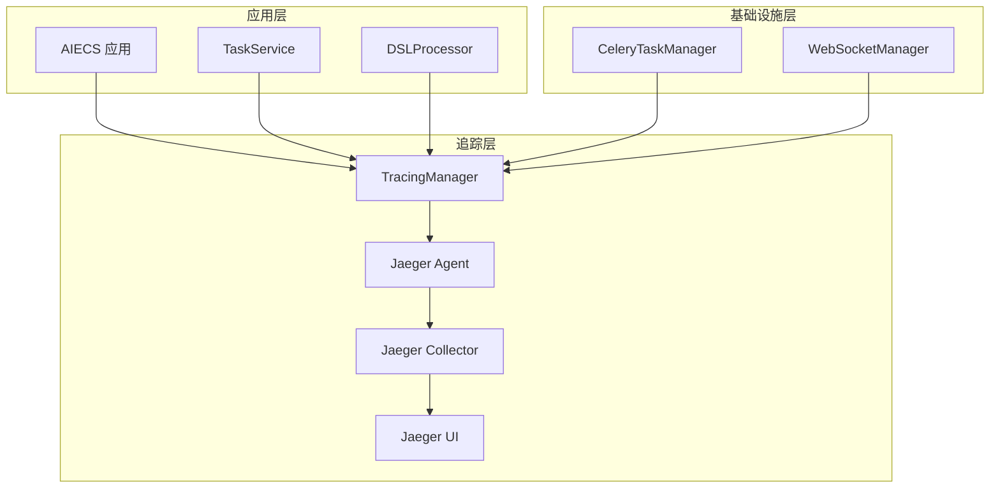
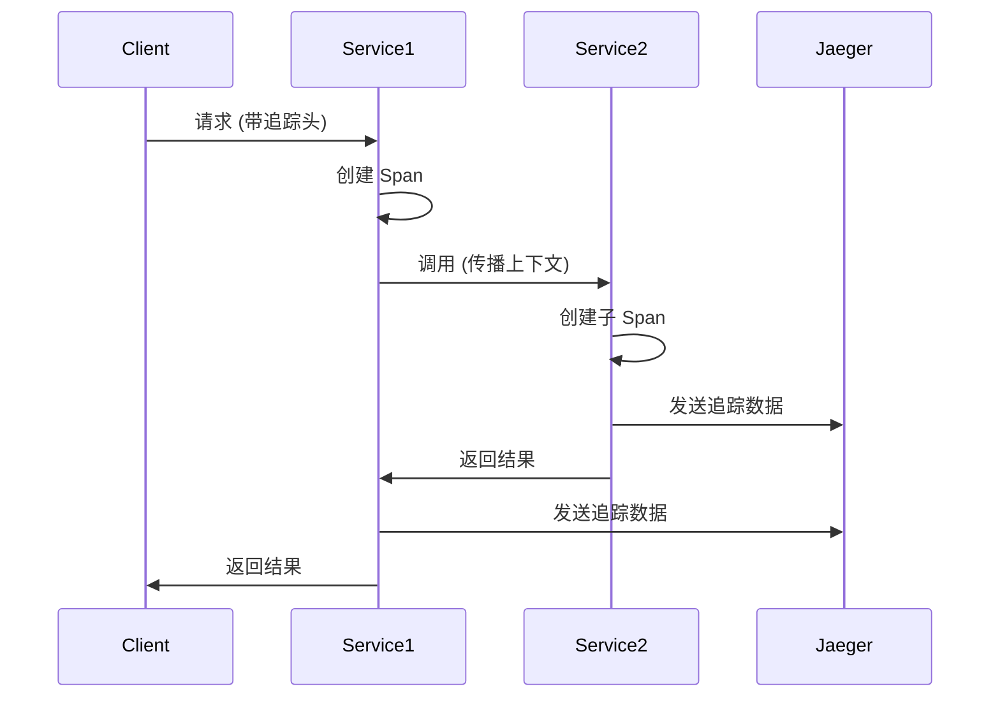

# TracingManager 技术文档

## 1. 概述 (Overview)

### 目的
`TracingManager` 是一个专门用于分布式链路追踪和调用链跟踪的组件，基于 Jaeger 和 OpenTracing 标准构建。它提供了跨服务的请求追踪、性能分析、错误定位等核心功能，是 AIECS 系统中可观测性的重要基础设施。

### 核心价值
- **分布式追踪**：跟踪请求在多个服务间的完整调用链
- **性能分析**：识别系统瓶颈和性能热点
- **错误定位**：快速定位分布式系统中的错误源头
- **依赖分析**：了解服务间的依赖关系
- **SLA 监控**：监控端到端的服务响应时间

## 2. 问题背景与设计动机 (Problem & Motivation)

### 问题背景
在 AIECS 分布式系统中，面临以下挑战：
- **调用链复杂**：请求经过多个服务，难以追踪完整路径
- **性能瓶颈难定位**：无法快速识别哪个服务或操作导致延迟
- **错误传播复杂**：错误在服务间传播，难以定位根本原因
- **依赖关系不清晰**：缺乏对服务间依赖关系的可视化
- **调试困难**：分布式环境下的问题排查效率低下

### 设计动机
1. **可观测性提升**：提供系统运行状态的全面可见性
2. **性能优化**：通过追踪数据识别性能瓶颈
3. **故障快速定位**：缩短问题排查和解决时间
4. **系统理解**：帮助团队理解系统架构和依赖关系
5. **SLA 保障**：确保系统满足服务级别协议

## 3. 架构定位与上下文 (Architecture & Context)

### 系统架构位置
```
┌─────────────────────────────────────────────────────────────┐
│                    AIECS 系统架构                           │
├─────────────────────────────────────────────────────────────┤
│  监控层 (Monitoring Layer)                                 │
│  ┌─────────────────┐  ┌─────────────────┐                  │
│  │ TracingManager  │  │ Jaeger Agent    │                  │
│  └─────────────────┘  └─────────────────┘                  │
├─────────────────────────────────────────────────────────────┤
│  基础设施层 (Infrastructure Layer)                         │
│  ┌─────────────────┐  ┌─────────────────┐                  │
│  │ CeleryTaskManager│  │ WebSocketManager│                 │
│  └─────────────────┘  └─────────────────┘                  │
├─────────────────────────────────────────────────────────────┤
│  领域层 (Domain Layer)                                     │
│  ┌─────────────────┐  ┌─────────────────┐                  │
│  │ TaskService     │  │ DSLProcessor    │                  │
│  └─────────────────┘  └─────────────────┘                  │
└─────────────────────────────────────────────────────────────┘
```

### 上游调用者
- **TaskService**：任务管理服务，需要追踪任务执行流程
- **DSLProcessor**：DSL 处理器，需要追踪计划生成和执行
- **CeleryTaskManager**：任务执行器，需要追踪任务调度
- **WebSocketManager**：WebSocket 管理器，需要追踪连接处理

### 下游依赖
- **Jaeger Agent**：链路追踪数据收集代理
- **Jaeger Collector**：链路追踪数据收集器
- **Jaeger UI**：链路追踪数据可视化界面
- **OpenTracing**：分布式追踪标准库

## 4. 核心功能与用例 (Core Features & Use Cases)

### 4.1 基础链路追踪

#### 手动创建 Span
```python
# 创建追踪管理器
tracing = TracingManager(service_name="task_executor")

# 手动创建和完成 Span
span = tracing.start_span("process_user_request", tags={"user_id": "123"})
try:
    result = await process_request()
    tracing.finish_span(span, tags={"success": True})
except Exception as e:
    tracing.finish_span(span, error=e)
    raise
```

#### 使用装饰器自动追踪
```python
# 使用装饰器自动追踪函数
@tracing.with_tracing("parse_user_intent", tags={"component": "nlp"})
async def parse_user_intent(user_input: str) -> Dict[str, Any]:
    """解析用户意图"""
    return intent_result

@tracing.with_tracing("generate_task_plan", tags={"component": "planner"})
async def generate_task_plan(intent: Dict[str, Any]) -> List[Dict[str, Any]]:
    """生成任务计划"""
    return plan_steps
```

### 4.2 数据库操作追踪

#### 数据库查询追踪
```python
# 追踪数据库操作
@tracing.trace_database_operation("SELECT", table="tasks", query="SELECT * FROM tasks WHERE status = 'pending'")
async def get_pending_tasks() -> List[Dict[str, Any]]:
    """获取待处理任务"""
    return await db.fetch_all("SELECT * FROM tasks WHERE status = 'pending'")

@tracing.trace_database_operation("INSERT", table="task_results")
async def save_task_result(result: Dict[str, Any]) -> int:
    """保存任务结果"""
    return await db.execute("INSERT INTO task_results ...")
```

### 4.3 外部服务调用追踪

#### HTTP 服务调用追踪
```python
# 追踪外部服务调用
@tracing.trace_external_call("ml_service", endpoint="/api/predict")
async def call_ml_service(data: Dict[str, Any]) -> Dict[str, Any]:
    """调用机器学习服务"""
    async with httpx.AsyncClient() as client:
        response = await client.post("http://ml-service/api/predict", json=data)
        return response.json()

@tracing.trace_external_call("notification_service", endpoint="/api/send")
async def send_notification(user_id: str, message: str) -> bool:
    """发送通知"""
    async with httpx.AsyncClient() as client:
        response = await client.post("http://notification-service/api/send", 
                                   json={"user_id": user_id, "message": message})
        return response.status_code == 200
```

### 4.4 工具执行追踪

#### 工具调用追踪
```python
# 追踪工具执行
@tracing.trace_tool_execution("data_processor", "clean_data")
async def clean_data(raw_data: List[Dict[str, Any]]) -> List[Dict[str, Any]]:
    """清理数据"""
    return cleaned_data

@tracing.trace_tool_execution("ml_model", "train")
async def train_model(training_data: List[Dict[str, Any]]) -> Dict[str, Any]:
    """训练模型"""
    return model_info
```

### 4.5 跨服务追踪

#### 上下文传播
```python
# 服务间上下文传播
async def process_request_with_context(request_data: Dict[str, Any], headers: Dict[str, str]):
    """处理带上下文的请求"""
    # 提取上游服务的追踪上下文
    span_context = tracing.extract_span_context(headers)
    
    # 创建子 Span
    span = tracing.start_span("process_request", parent_span=span_context)
    
    try:
        # 处理请求
        result = await handle_request(request_data)
        
        # 向下游服务传播上下文
        downstream_headers = {}
        tracing.inject_span_context(span, downstream_headers)
        
        # 调用下游服务
        await call_downstream_service(result, downstream_headers)
        
        tracing.finish_span(span, tags={"success": True})
        return result
    except Exception as e:
        tracing.finish_span(span, error=e)
        raise
```

## 5. API 参考 (API Reference)

### 5.1 类定义

#### `TracingManager`
```python
class TracingManager:
    """分布式链路追踪管理器"""
    
    def __init__(self, service_name: str = "service_executor",
                 jaeger_host: Optional[str] = None,
                 jaeger_port: Optional[int] = None,
                 enable_tracing: Optional[bool] = None) -> None
    """初始化追踪管理器
    
    Args:
        service_name: 服务名称
        jaeger_host: Jaeger Agent 主机地址
        jaeger_port: Jaeger Agent 端口
        enable_tracing: 是否启用追踪
    """
```

### 5.2 公共方法

#### `start_span`
```python
def start_span(self, operation_name: str, parent_span: Optional[Span] = None,
               tags: Optional[Dict[str, Any]] = None) -> Optional[Span]
```
**功能**：开始一个新的追踪 Span

**参数**：
- `operation_name` (str): 操作名称
- `parent_span` (Optional[Span]): 父 Span
- `tags` (Optional[Dict[str, Any]]): 初始标签

**返回值**：
- `Optional[Span]`: Span 对象或 None

#### `finish_span`
```python
def finish_span(self, span: Optional[Span], tags: Optional[Dict[str, Any]] = None,
                logs: Optional[Dict[str, Any]] = None, error: Optional[Exception] = None) -> None
```
**功能**：完成追踪 Span

**参数**：
- `span` (Optional[Span]): 要完成的 Span
- `tags` (Optional[Dict[str, Any]]): 额外标签
- `logs` (Optional[Dict[str, Any]]): 日志信息
- `error` (Optional[Exception]): 错误信息

#### `with_tracing`
```python
def with_tracing(self, operation_name: str, tags: Optional[Dict[str, Any]] = None) -> Callable
```
**功能**：追踪装饰器

**参数**：
- `operation_name` (str): 操作名称
- `tags` (Optional[Dict[str, Any]]): 初始标签

**返回值**：
- `Callable`: 装饰器函数

#### `trace_database_operation`
```python
def trace_database_operation(self, operation: str, table: str = None, query: str = None) -> Callable
```
**功能**：数据库操作追踪装饰器

**参数**：
- `operation` (str): 数据库操作类型
- `table` (str): 表名
- `query` (str): SQL 查询

**返回值**：
- `Callable`: 装饰器函数

#### `trace_external_call`
```python
def trace_external_call(self, service_name: str, endpoint: str = None) -> Callable
```
**功能**：外部服务调用追踪装饰器

**参数**：
- `service_name` (str): 服务名称
- `endpoint` (str): 端点路径

**返回值**：
- `Callable`: 装饰器函数

#### `trace_tool_execution`
```python
def trace_tool_execution(self, tool_name: str, operation: str) -> Callable
```
**功能**：工具执行追踪装饰器

**参数**：
- `tool_name` (str): 工具名称
- `operation` (str): 操作名称

**返回值**：
- `Callable`: 装饰器函数

## 6. 技术实现细节 (Technical Details)

### 6.1 Jaeger 集成

#### 配置初始化
```python
def _init_tracer(self):
    """初始化 Jaeger 追踪器"""
    config = jaeger_client.config.Config(
        config={
            'sampler': {
                'type': 'const',  # 常量采样
                'param': 1,       # 100% 采样
            },
            'local_agent': {
                'reporting_host': self.jaeger_host,
                'reporting_port': self.jaeger_port,
            },
            'logging': True,
        },
        service_name=self.service_name,
        validate=True
    )
    self.tracer = config.initialize_tracer()
```

### 6.2 装饰器实现

#### 异步函数支持
```python
def with_tracing(self, operation_name: str, tags: Optional[Dict[str, Any]] = None):
    """追踪装饰器实现"""
    def decorator(func):
        @functools.wraps(func)
        async def async_wrapper(*args, **kwargs):
            if not self.enable_tracing or not self.tracer:
                return await func(*args, **kwargs)

            span = self.start_span(operation_name, tags=tags)
            try:
                # 添加函数参数到 Span
                self._add_function_args_to_span(span, args, kwargs)
                result = await func(*args, **kwargs)
                if span:
                    span.set_tag("success", True)
                return result
            except Exception as e:
                self.finish_span(span, error=e)
                raise
            finally:
                if span and not span.finished:
                    self.finish_span(span)
        return async_wrapper
    return decorator
```

### 6.3 上下文传播

#### 跨服务上下文传播
```python
def inject_span_context(self, span: Optional[Span], carrier: Dict[str, str]):
    """注入 Span 上下文到载体"""
    if not self.enable_tracing or not span or not self.tracer:
        return
    
    try:
        from opentracing.propagation import Format
        self.tracer.inject(span.context, Format.TEXT_MAP, carrier)
    except Exception as e:
        logger.error(f"Error injecting span context: {e}")

def extract_span_context(self, carrier: Dict[str, str]) -> Optional[Any]:
    """从载体提取 Span 上下文"""
    if not self.enable_tracing or not self.tracer:
        return None
    
    try:
        from opentracing.propagation import Format
        return self.tracer.extract(Format.TEXT_MAP, carrier)
    except Exception as e:
        logger.error(f"Error extracting span context: {e}")
        return None
```

## 7. 配置与部署 (Configuration & Deployment)

### 7.1 基本配置

#### 环境变量配置
```bash
# Jaeger 配置
export JAEGER_AGENT_HOST="jaeger"
export JAEGER_AGENT_PORT="6831"
export JAEGER_ENABLE_TRACING="true"

# 服务配置
export SERVICE_NAME="task_executor"
```

#### 代码配置
```python
# 基本配置
tracing = TracingManager(
    service_name="task_executor",
    jaeger_host="jaeger",
    jaeger_port=6831,
    enable_tracing=True
)
```

### 7.2 Docker 部署

#### Docker Compose 配置
```yaml
version: '3.8'
services:
  jaeger:
    image: jaegertracing/all-in-one:latest
    ports:
      - "16686:16686"  # Jaeger UI
      - "14268:14268"  # HTTP collector
      - "6831:6831/udp"  # UDP agent
    environment:
      - COLLECTOR_OTLP_ENABLED=true

  task-executor:
    build: .
    environment:
      - JAEGER_AGENT_HOST=jaeger
      - JAEGER_AGENT_PORT=6831
      - JAEGER_ENABLE_TRACING=true
    depends_on:
      - jaeger
```

## 8. 维护与故障排查 (Maintenance & Troubleshooting)

### 8.1 常见故障及解决方案

#### 故障 1：Jaeger 连接失败
**症状**：`Failed to initialize Jaeger tracer` 错误

**解决方案**：
```python
# 检查 Jaeger 服务状态
import socket
def check_jaeger_connection(host: str, port: int) -> bool:
    try:
        sock = socket.socket(socket.AF_INET, socket.SOCK_DGRAM)
        sock.settimeout(1)
        sock.connect((host, port))
        sock.close()
        return True
    except:
        return False

# 重试机制
def init_tracer_with_retry(max_retries: int = 3):
    for attempt in range(max_retries):
        try:
            tracing = TracingManager()
            if tracing.tracer:
                return tracing
        except Exception as e:
            if attempt == max_retries - 1:
                raise
            time.sleep(1)
```

#### 故障 2：Span 创建失败
**症状**：Span 创建返回 None

**解决方案**：
```python
# 检查追踪状态
def validate_tracing_status(tracing: TracingManager):
    info = tracing.get_tracer_info()
    if not info["enabled"]:
        print("追踪已禁用")
        return False
    if not info["tracer_initialized"]:
        print("追踪器未初始化")
        return False
    return True
```

## 9. 可视化图表 (Visualizations)

### 9.1 系统架构图



### 9.2 追踪流程图



## 10. 版本历史 (Version History)

### v1.0.0 (2024-01-15)
**新增功能**：
- 基础 Jaeger 集成
- 支持手动和装饰器追踪
- 实现上下文传播
- 提供多种追踪装饰器

### v1.1.0 (2024-02-01)
**功能增强**：
- 添加数据库操作追踪
- 支持外部服务调用追踪
- 实现工具执行追踪
- 增强错误处理

### v1.2.0 (2024-03-01)
**新增功能**：
- 支持异步函数追踪
- 添加函数参数自动记录
- 实现 Span 上下文管理
- 提供追踪信息查询

---

## 附录

### A. 相关文档
- [执行器指标文档](./EXECUTOR_METRICS.md)
- [WebSocket 管理器文档](./WEBSOCKET_MANAGER.md)
- [系统配置指南](../CONFIG/SYSTEM_CONFIG.md)

### B. 外部依赖
- [Jaeger 官方文档](https://www.jaegertracing.io/docs/)
- [OpenTracing 文档](https://opentracing.io/docs/)
- [Jaeger Python 客户端](https://github.com/jaegertracing/jaeger-client-python)

### C. 联系方式
- 技术负责人：AIECS 开发团队
- 问题反馈：通过项目 Issue 系统
- 文档更新：定期维护，版本同步
