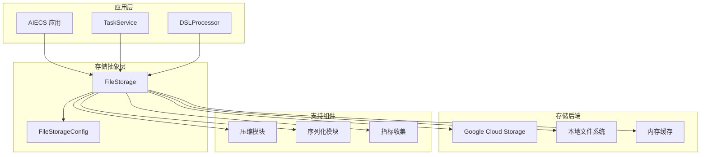
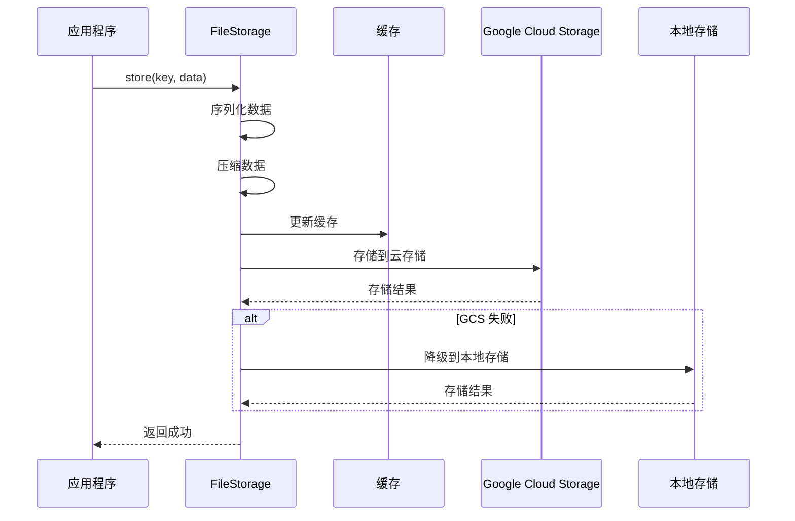
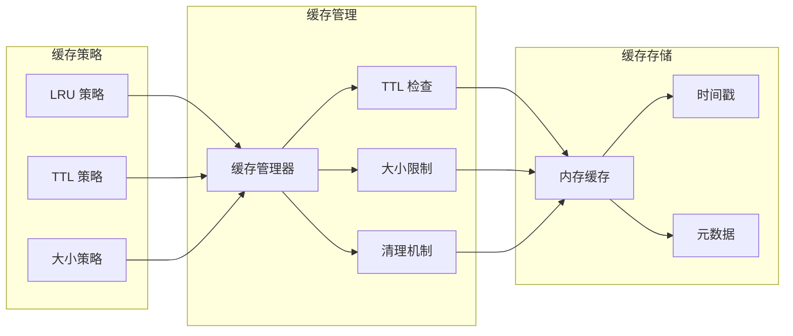

# FileStorage 技术文档

## 1. 概述 (Overview)

### 目的
`FileStorage` 是一个专门用于文件存储和管理的组件，基于 Google Cloud Storage 作为主要后端，支持本地文件系统作为降级方案。它提供了统一的文件存储接口、自动压缩、缓存管理、指标收集等核心功能，是 AIECS 系统中文件持久化层的关键基础设施。

### 核心价值
- **多云存储支持**：支持 Google Cloud Storage 和本地文件系统
- **自动降级机制**：当云存储不可用时自动切换到本地存储
- **智能缓存管理**：基于 TTL 的内存缓存，提升访问性能
- **自动压缩**：对大型文件自动进行 gzip 压缩，节省存储空间
- **统一接口**：提供一致的存储接口，屏蔽底层存储差异

## 2. 问题背景与设计动机 (Problem & Motivation)

### 问题背景
在 AIECS 系统中，需要处理大量文件存储需求，包括：
- **任务结果存储**：需要保存任务执行产生的文件和结果
- **模型文件管理**：需要存储和版本管理机器学习模型文件
- **数据文件缓存**：需要缓存中间处理结果和临时文件
- **跨服务文件共享**：多个服务需要访问相同的文件资源
- **存储可靠性**：需要确保文件存储的可靠性和可用性

### 设计动机
1. **存储抽象**：提供统一的文件存储接口，屏蔽底层存储实现
2. **高可用性**：通过多级存储确保文件访问的可用性
3. **性能优化**：通过缓存和压缩提升文件访问性能
4. **成本控制**：通过智能压缩和缓存减少存储成本
5. **运维简化**：提供统一的监控和管理接口

## 3. 架构定位与上下文 (Architecture & Context)

### 系统架构位置
```
┌─────────────────────────────────────────────────────────────┐
│                    AIECS 系统架构                           │
├─────────────────────────────────────────────────────────────┤
│  应用层 (Application Layer)                                │
│  ┌─────────────────┐  ┌─────────────────┐                  │
│  │ TaskService     │  │ DSLProcessor    │                  │
│  └─────────────────┘  └─────────────────┘                  │
├─────────────────────────────────────────────────────────────┤
│  基础设施层 (Infrastructure Layer)                         │
│  ┌─────────────────┐  ┌─────────────────┐                  │
│  │ FileStorage     │  │ DatabaseManager │                  │
│  └─────────────────┘  └─────────────────┘                  │
├─────────────────────────────────────────────────────────────┤
│  存储层 (Storage Layer)                                    │
│  ┌─────────────────┐  ┌─────────────────┐                  │
│  │ Google Cloud    │  │ 本地文件系统    │                  │
│  │ Storage         │  │                 │                  │
│  └─────────────────┘  └─────────────────┘                  │
└─────────────────────────────────────────────────────────────┘
```

### 上游调用者
- **TaskService**：任务管理服务，需要存储任务结果文件
- **DSLProcessor**：DSL 处理器，需要存储处理中间文件
- **CeleryTaskManager**：任务执行器，需要存储执行结果
- **WebSocketManager**：WebSocket 管理器，需要存储用户上传文件

### 下游依赖
- **Google Cloud Storage**：主要云存储后端
- **本地文件系统**：降级存储后端
- **aiofiles**：异步文件操作库
- **gzip**：文件压缩库
- **pickle/json**：数据序列化库

## 4. 核心功能与用例 (Core Features & Use Cases)

### 4.1 基础文件存储

#### 存储各种类型的数据
```python
# 创建文件存储实例
storage = FileStorage({
    'gcs_bucket_name': 'aiecs-storage',
    'gcs_project_id': 'my-project',
    'enable_local_fallback': True,
    'local_storage_path': './storage'
})

# 初始化存储
await storage.initialize()

# 存储字符串数据
await storage.store('user_123/profile.txt', '用户配置文件内容')

# 存储二进制数据
image_data = b'\x89PNG\r\n\x1a\n...'  # 图片二进制数据
await storage.store('images/avatar.png', image_data)

# 存储结构化数据
task_result = {
    'task_id': 'task_456',
    'status': 'completed',
    'result': {'accuracy': 0.95, 'processing_time': 120}
}
await storage.store('results/task_456.json', task_result)
```

#### 存储带元数据的文件
```python
# 存储带元数据的文件
metadata = {
    'content_type': 'application/json',
    'created_by': 'user_123',
    'version': '1.0',
    'tags': ['task_result', 'ml_model']
}

await storage.store(
    'models/model_v1.pkl',
    model_data,
    metadata=metadata
)
```

### 4.2 文件检索和管理

#### 检索存储的文件
```python
# 检索文件
profile_data = await storage.retrieve('user_123/profile.txt')
if profile_data:
    print(f"用户配置: {profile_data}")

# 检索二进制文件
image_data = await storage.retrieve('images/avatar.png')
if image_data:
    with open('downloaded_avatar.png', 'wb') as f:
        f.write(image_data)

# 检索结构化数据
task_result = await storage.retrieve('results/task_456.json')
if task_result:
    print(f"任务结果: {task_result['result']['accuracy']}")
```

#### 检查文件存在性
```python
# 检查文件是否存在
if await storage.exists('user_123/profile.txt'):
    print("用户配置文件存在")
else:
    print("用户配置文件不存在")

# 批量检查文件
files_to_check = ['file1.txt', 'file2.txt', 'file3.txt']
existing_files = []
for file_path in files_to_check:
    if await storage.exists(file_path):
        existing_files.append(file_path)
```

### 4.3 文件列表和搜索

#### 列出存储的文件
```python
# 列出所有文件
all_files = await storage.list_keys()
print(f"存储的文件数量: {len(all_files)}")

# 按前缀过滤文件
user_files = await storage.list_keys(prefix='user_123/')
print(f"用户文件: {user_files}")

# 限制返回数量
recent_files = await storage.list_keys(limit=10)
print(f"最近的文件: {recent_files}")

# 按类型过滤文件
image_files = await storage.list_keys(prefix='images/')
print(f"图片文件: {image_files}")
```

### 4.4 文件删除和清理

#### 删除文件
```python
# 删除单个文件
success = await storage.delete('user_123/profile.txt')
if success:
    print("文件删除成功")
else:
    print("文件删除失败")

# 批量删除文件
files_to_delete = ['temp1.txt', 'temp2.txt', 'temp3.txt']
for file_path in files_to_delete:
    await storage.delete(file_path)
    print(f"已删除: {file_path}")
```

#### 清理过期文件
```python
# 清理临时文件
temp_files = await storage.list_keys(prefix='temp/')
for file_path in temp_files:
    await storage.delete(file_path)
    print(f"已清理临时文件: {file_path}")
```

### 4.5 任务结果存储

#### 存储任务执行结果
```python
# 存储机器学习模型训练结果
async def save_model_training_result(model_id: str, training_data: Dict[str, Any]):
    """保存模型训练结果"""
    result_data = {
        'model_id': model_id,
        'training_accuracy': training_data['accuracy'],
        'validation_accuracy': training_data['val_accuracy'],
        'training_time': training_data['training_time'],
        'model_parameters': training_data['parameters']
    }
    
    # 存储结果元数据
    await storage.store(
        f'models/{model_id}/training_result.json',
        result_data,
        metadata={
            'content_type': 'application/json',
            'model_type': 'neural_network',
            'created_at': datetime.now().isoformat()
        }
    )
    
    # 存储模型文件
    if 'model_file' in training_data:
        await storage.store(
            f'models/{model_id}/model.pkl',
            training_data['model_file']
        )

# 存储数据处理结果
async def save_data_processing_result(task_id: str, processed_data: List[Dict[str, Any]]):
    """保存数据处理结果"""
    # 存储处理后的数据
    await storage.store(
        f'processed_data/{task_id}/result.json',
        processed_data,
        metadata={
            'content_type': 'application/json',
            'record_count': len(processed_data),
            'task_id': task_id
        }
    )
    
    # 存储处理统计信息
    stats = {
        'total_records': len(processed_data),
        'processing_time': time.time() - start_time,
        'memory_usage': get_memory_usage()
    }
    
    await storage.store(
        f'processed_data/{task_id}/stats.json',
        stats
    )
```

### 4.6 缓存和性能优化

#### 利用缓存提升性能
```python
# 配置缓存
storage = FileStorage({
    'enable_cache': True,
    'cache_ttl_seconds': 3600,  # 1小时缓存
    'max_cache_size_mb': 100    # 最大100MB缓存
})

# 频繁访问的文件会被自动缓存
for i in range(10):
    # 第一次访问会从存储加载，后续访问从缓存获取
    data = await storage.retrieve('frequently_accessed_file.txt')
    print(f"访问 {i+1}: 数据长度 {len(data)}")
```

## 5. API 参考 (API Reference)

### 5.1 类定义

#### `FileStorage`
```python
class FileStorage:
    """文件存储实现，支持 Google Cloud Storage 和本地文件系统"""
    
    def __init__(self, config: Dict[str, Any]) -> None
    """初始化文件存储
    
    Args:
        config: 存储配置字典
    """
```

#### `FileStorageConfig`
```python
class FileStorageConfig:
    """文件存储配置类"""
    
    def __init__(self, config: Dict[str, Any]) -> None
    """初始化存储配置
    
    Args:
        config: 配置字典
    """
```

### 5.2 公共方法

#### `initialize`
```python
async def initialize(self) -> bool
```
**功能**：初始化文件存储系统

**返回值**：
- `bool`: 初始化是否成功

#### `store`
```python
async def store(self, key: str, data: Union[str, bytes, Dict[str, Any]], 
                metadata: Optional[Dict[str, Any]] = None) -> bool
```
**功能**：存储数据

**参数**：
- `key` (str): 存储键
- `data` (Union[str, bytes, Dict[str, Any]]): 要存储的数据
- `metadata` (Optional[Dict[str, Any]]): 可选的元数据

**返回值**：
- `bool`: 存储是否成功

#### `retrieve`
```python
async def retrieve(self, key: str) -> Optional[Union[str, bytes, Dict[str, Any]]]
```
**功能**：检索数据

**参数**：
- `key` (str): 存储键

**返回值**：
- `Optional[Union[str, bytes, Dict[str, Any]]]`: 存储的数据，如果不存在则返回 None

#### `delete`
```python
async def delete(self, key: str) -> bool
```
**功能**：删除数据

**参数**：
- `key` (str): 存储键

**返回值**：
- `bool`: 删除是否成功

#### `exists`
```python
async def exists(self, key: str) -> bool
```
**功能**：检查数据是否存在

**参数**：
- `key` (str): 存储键

**返回值**：
- `bool`: 数据是否存在

#### `list_keys`
```python
async def list_keys(self, prefix: Optional[str] = None, 
                   limit: Optional[int] = None) -> List[str]
```
**功能**：列出存储键

**参数**：
- `prefix` (Optional[str]): 键前缀过滤器
- `limit` (Optional[int]): 返回数量限制

**返回值**：
- `List[str]`: 存储键列表

#### `get_stats`
```python
def get_stats(self) -> Dict[str, Any]
```
**功能**：获取存储统计信息

**返回值**：
- `Dict[str, Any]`: 统计信息字典

### 5.3 全局函数

#### `get_file_storage`
```python
def get_file_storage(config: Optional[Dict[str, Any]] = None) -> FileStorage
```
**功能**：获取全局文件存储实例

**参数**：
- `config` (Optional[Dict[str, Any]]): 配置字典

**返回值**：
- `FileStorage`: 文件存储实例

#### `initialize_file_storage`
```python
async def initialize_file_storage(config: Optional[Dict[str, Any]] = None) -> FileStorage
```
**功能**：初始化并返回文件存储实例

**参数**：
- `config` (Optional[Dict[str, Any]]): 配置字典

**返回值**：
- `FileStorage`: 初始化的文件存储实例

## 6. 技术实现细节 (Technical Details)

### 6.1 存储后端管理

#### Google Cloud Storage 集成
```python
async def _init_gcs(self):
    """初始化 Google Cloud Storage 客户端"""
    try:
        # 设置认证凭据
        if self.config.gcs_credentials_path:
            os.environ['GOOGLE_APPLICATION_CREDENTIALS'] = self.config.gcs_credentials_path
        
        # 创建客户端
        self._gcs_client = storage.Client(project=self.config.gcs_project_id)
        
        # 获取或创建存储桶
        try:
            self._gcs_bucket = self._gcs_client.bucket(self.config.gcs_bucket_name)
            self._gcs_bucket.reload()  # 测试访问
        except NotFound:
            # 创建存储桶
            self._gcs_bucket = self._gcs_client.create_bucket(
                self.config.gcs_bucket_name,
                location=self.config.gcs_location
            )
    except DefaultCredentialsError:
        logger.warning("GCS 凭据未找到，仅使用本地存储")
        self._gcs_client = None
        self._gcs_bucket = None
```

#### 本地存储降级
```python
async def _store_local(self, key: str, data: bytes, metadata: Optional[Dict[str, Any]], compressed: bool) -> bool:
    """在本地文件系统中存储数据"""
    try:
        file_path = Path(self.config.local_storage_path) / key
        file_path.parent.mkdir(parents=True, exist_ok=True)
        
        # 写入数据文件
        async with aiofiles.open(file_path, 'wb') as f:
            await f.write(data)
        
        # 存储元数据
        if metadata:
            metadata_path = file_path.with_suffix('.metadata')
            metadata_with_compression = {**metadata, 'compressed': compressed}
            async with aiofiles.open(metadata_path, 'w') as f:
                await f.write(json.dumps(metadata_with_compression))
        
        return True
    except Exception as e:
        logger.error(f"本地存储失败 {key}: {e}")
        return False
```

### 6.2 缓存管理机制

#### TTL 缓存实现
```python
async def _cleanup_cache(self):
    """清理过期的缓存条目"""
    if not self.config.enable_cache:
        return
    
    current_time = datetime.utcnow()
    expired_keys = []
    
    # 查找过期键
    for key, timestamp in self._cache_timestamps.items():
        if (current_time - timestamp).total_seconds() > self.config.cache_ttl_seconds:
            expired_keys.append(key)
    
    # 清理过期条目
    for key in expired_keys:
        self._cache.pop(key, None)
        self._cache_timestamps.pop(key, None)
```

#### 缓存大小管理
```python
def _calculate_cache_size(self) -> int:
    """计算当前缓存大小（字节）"""
    total_size = 0
    for key, cache_data in self._cache.items():
        data = cache_data['data']
        if isinstance(data, str):
            total_size += len(data.encode('utf-8'))
        elif isinstance(data, bytes):
            total_size += len(data)
        elif isinstance(data, dict):
            total_size += len(json.dumps(data).encode('utf-8'))
    return total_size

async def _enforce_cache_limit(self):
    """强制执行缓存大小限制"""
    if not self.config.enable_cache:
        return
    
    max_size_bytes = self.config.max_cache_size_mb * 1024 * 1024
    current_size = self._calculate_cache_size()
    
    if current_size > max_size_bytes:
        # 按时间排序，删除最旧的条目
        sorted_keys = sorted(self._cache_timestamps.items(), key=lambda x: x[1])
        
        for key, _ in sorted_keys:
            self._cache.pop(key, None)
            self._cache_timestamps.pop(key, None)
            current_size = self._calculate_cache_size()
            
            if current_size <= max_size_bytes:
                break
```

### 6.3 数据序列化和压缩

#### 智能序列化
```python
async def _serialize_data(self, data: Union[str, bytes, Dict[str, Any]]) -> bytes:
    """序列化数据用于存储"""
    if isinstance(data, bytes):
        return data
    elif isinstance(data, str):
        return data.encode('utf-8')
    else:
        # 使用 pickle 处理复杂对象
        return pickle.dumps(data)

async def _deserialize_data(self, data: bytes) -> Any:
    """从存储中反序列化数据"""
    try:
        # 首先尝试 pickle 反序列化
        return pickle.loads(data)
    except:
        try:
            # 尝试 JSON 反序列化
            return json.loads(data.decode('utf-8'))
        except:
            # 返回字符串
            return data.decode('utf-8')
```

#### 自动压缩
```python
async def _should_compress(self, data: bytes) -> bool:
    """判断是否应该压缩数据"""
    return (self.config.enable_compression and 
            len(data) > self.config.compression_threshold_bytes)

async def _compress_data(self, data: bytes) -> bytes:
    """压缩数据"""
    return gzip.compress(data)

async def _decompress_data(self, data: bytes) -> bytes:
    """解压数据"""
    return gzip.decompress(data)
```

### 6.4 错误处理和重试机制

#### 重试装饰器
```python
import asyncio
from functools import wraps

def retry_storage_operation(max_retries: int = 3, delay: float = 1.0):
    """存储操作重试装饰器"""
    def decorator(func):
        @wraps(func)
        async def wrapper(*args, **kwargs):
            for attempt in range(max_retries):
                try:
                    return await func(*args, **kwargs)
                except Exception as e:
                    if attempt == max_retries - 1:
                        raise
                    logger.warning(f"存储操作失败 (尝试 {attempt + 1}/{max_retries}): {e}")
                    await asyncio.sleep(delay * (2 ** attempt))  # 指数退避
            return None
        return wrapper
    return decorator

# 使用重试装饰器
@retry_storage_operation(max_retries=3, delay=1.0)
async def robust_store(self, key: str, data: Union[str, bytes, Dict[str, Any]], 
                      metadata: Optional[Dict[str, Any]] = None) -> bool:
    """带重试的存储操作"""
    return await self.store(key, data, metadata)
```

## 7. 配置与部署 (Configuration & Deployment)

### 7.1 基本配置

#### 完整配置示例
```python
# 文件存储配置
file_storage_config = {
    # Google Cloud Storage 设置
    'gcs_bucket_name': 'aiecs-storage',
    'gcs_project_id': 'my-project-123',
    'gcs_credentials_path': '/path/to/service-account.json',
    'gcs_location': 'US',
    
    # 本地存储降级
    'local_storage_path': './storage',
    'enable_local_fallback': True,
    
    # 缓存设置
    'enable_cache': True,
    'cache_ttl_seconds': 3600,  # 1小时
    'max_cache_size_mb': 100,   # 100MB
    
    # 性能设置
    'chunk_size': 8192,         # 8KB 块大小
    'max_retries': 3,           # 最大重试次数
    'timeout_seconds': 30,      # 超时时间
    
    # 压缩设置
    'enable_compression': True,
    'compression_threshold_bytes': 1024,  # 1KB 以上压缩
    
    # 安全设置
    'enable_encryption': False,
    'encryption_key': None
}
```

#### 环境变量配置
```bash
# Google Cloud Storage 配置
export GCS_BUCKET_NAME="aiecs-storage"
export GCS_PROJECT_ID="my-project-123"
export GOOGLE_APPLICATION_CREDENTIALS="/path/to/service-account.json"
export GCS_LOCATION="US"

# 本地存储配置
export LOCAL_STORAGE_PATH="./storage"
export ENABLE_LOCAL_FALLBACK="true"

# 缓存配置
export ENABLE_CACHE="true"
export CACHE_TTL_SECONDS="3600"
export MAX_CACHE_SIZE_MB="100"

# 性能配置
export CHUNK_SIZE="8192"
export MAX_RETRIES="3"
export TIMEOUT_SECONDS="30"

# 压缩配置
export ENABLE_COMPRESSION="true"
export COMPRESSION_THRESHOLD_BYTES="1024"
```

### 7.2 Docker 部署

#### Dockerfile 配置
```dockerfile
FROM python:3.9-slim

WORKDIR /app

# 安装依赖
COPY requirements.txt .
RUN pip install -r requirements.txt

# 安装 Google Cloud SDK（可选）
RUN apt-get update && apt-get install -y curl
RUN curl https://sdk.cloud.google.com | bash
ENV PATH $PATH:/root/google-cloud-sdk/bin

# 复制应用代码
COPY . .

# 创建存储目录
RUN mkdir -p /app/storage

# 设置环境变量
ENV LOCAL_STORAGE_PATH="/app/storage"
ENV ENABLE_LOCAL_FALLBACK="true"

# 启动命令
CMD ["python", "-m", "aiecs.infrastructure.persistence.file_storage"]
```

#### Docker Compose 配置
```yaml
version: '3.8'
services:
  file-storage:
    build: .
    environment:
      - GCS_BUCKET_NAME=aiecs-storage
      - GCS_PROJECT_ID=my-project-123
      - GOOGLE_APPLICATION_CREDENTIALS=/app/credentials/service-account.json
      - LOCAL_STORAGE_PATH=/app/storage
      - ENABLE_LOCAL_FALLBACK=true
      - ENABLE_CACHE=true
      - CACHE_TTL_SECONDS=3600
    volumes:
      - ./storage:/app/storage
      - ./credentials:/app/credentials
    restart: unless-stopped

  # 可选：本地 MinIO 作为 S3 兼容存储
  minio:
    image: minio/minio:latest
    ports:
      - "9000:9000"
      - "9001:9001"
    environment:
      - MINIO_ROOT_USER=admin
      - MINIO_ROOT_PASSWORD=password123
    command: server /data --console-address ":9001"
    volumes:
      - minio_data:/data

volumes:
  minio_data:
```

### 7.3 生产环境配置

#### 高可用配置
```python
# 生产环境配置
production_config = {
    'gcs_bucket_name': 'aiecs-prod-storage',
    'gcs_project_id': 'production-project',
    'gcs_location': 'US-CENTRAL1',
    'local_storage_path': '/var/lib/aiecs/storage',
    'enable_local_fallback': True,
    'enable_cache': True,
    'cache_ttl_seconds': 7200,  # 2小时
    'max_cache_size_mb': 500,   # 500MB
    'chunk_size': 16384,        # 16KB
    'max_retries': 5,
    'timeout_seconds': 60,
    'enable_compression': True,
    'compression_threshold_bytes': 512,  # 512B 以上压缩
    'enable_encryption': True,
    'encryption_key': 'your-encryption-key'
}
```

#### 监控配置
```python
# 监控配置
monitoring_config = {
    'enable_metrics': True,
    'metrics_port': 8002,
    'log_level': 'INFO',
    'enable_tracing': True,
    'tracing_endpoint': 'jaeger:14268'
}
```

## 8. 维护与故障排查 (Maintenance & Troubleshooting)

### 8.1 监控指标

#### 关键指标
- **存储操作成功率**：`(成功操作数 / 总操作数) * 100%`
- **缓存命中率**：`(缓存命中数 / 总请求数) * 100%`
- **压缩率**：`(压缩后大小 / 原始大小) * 100%`
- **平均响应时间**：存储操作的平均响应时间
- **存储使用量**：当前存储空间使用情况

#### 监控实现
```python
class FileStorageMonitor:
    def __init__(self, storage: FileStorage):
        self.storage = storage
        self.metrics = {
            'total_operations': 0,
            'successful_operations': 0,
            'cache_hits': 0,
            'cache_misses': 0,
            'compression_savings': 0,
            'total_data_size': 0
        }
    
    def get_health_status(self) -> Dict[str, Any]:
        """获取存储健康状态"""
        stats = self.storage.get_stats()
        
        return {
            'status': 'healthy' if stats['initialized'] else 'unhealthy',
            'gcs_available': stats['gcs_available'],
            'local_fallback_enabled': stats['local_fallback_enabled'],
            'cache_enabled': stats['cache_enabled'],
            'cache_size': stats['cache_size'],
            'metrics': self.metrics
        }
    
    async def get_storage_usage(self) -> Dict[str, Any]:
        """获取存储使用情况"""
        try:
            # 获取所有文件列表
            all_files = await self.storage.list_keys()
            
            total_size = 0
            file_count = len(all_files)
            
            # 计算总大小（简化版本）
            for file_key in all_files[:100]:  # 限制检查文件数量
                try:
                    data = await self.storage.retrieve(file_key)
                    if isinstance(data, str):
                        total_size += len(data.encode('utf-8'))
                    elif isinstance(data, bytes):
                        total_size += len(data)
                except:
                    continue
            
            return {
                'file_count': file_count,
                'total_size_bytes': total_size,
                'total_size_mb': total_size / (1024 * 1024)
            }
        except Exception as e:
            return {'error': str(e)}
```

### 8.2 常见故障及解决方案

#### 故障 1：Google Cloud Storage 连接失败
**症状**：`DefaultCredentialsError` 或 `GoogleCloudError` 错误

**可能原因**：
- 认证凭据无效或过期
- 网络连接问题
- 项目 ID 错误
- 存储桶不存在或权限不足

**解决方案**：
```python
# 1. 检查认证凭据
def check_gcs_credentials():
    """检查 GCS 认证凭据"""
    try:
        from google.auth import default
        credentials, project = default()
        print(f"认证成功，项目: {project}")
        return True
    except Exception as e:
        print(f"认证失败: {e}")
        return False

# 2. 验证存储桶访问权限
async def verify_bucket_access(bucket_name: str):
    """验证存储桶访问权限"""
    try:
        from google.cloud import storage
        client = storage.Client()
        bucket = client.bucket(bucket_name)
        bucket.reload()
        print(f"存储桶 {bucket_name} 访问正常")
        return True
    except Exception as e:
        print(f"存储桶访问失败: {e}")
        return False

# 3. 使用本地存储降级
storage_config = {
    'gcs_bucket_name': 'aiecs-storage',
    'enable_local_fallback': True,  # 启用本地降级
    'local_storage_path': './backup_storage'
}
```

#### 故障 2：本地存储空间不足
**症状**：`OSError: [Errno 28] No space left on device` 错误

**可能原因**：
- 磁盘空间不足
- 文件过多导致 inode 耗尽
- 存储路径权限问题

**解决方案**：
```python
# 1. 检查磁盘空间
import shutil

def check_disk_space(path: str) -> Dict[str, Any]:
    """检查磁盘空间"""
    total, used, free = shutil.disk_usage(path)
    return {
        'total_gb': total // (1024**3),
        'used_gb': used // (1024**3),
        'free_gb': free // (1024**3),
        'usage_percent': (used / total) * 100
    }

# 2. 清理旧文件
async def cleanup_old_files(storage: FileStorage, days_old: int = 30):
    """清理旧文件"""
    from datetime import datetime, timedelta
    cutoff_date = datetime.now() - timedelta(days=days_old)
    
    all_files = await storage.list_keys()
    cleaned_count = 0
    
    for file_key in all_files:
        # 这里需要根据文件命名规则判断文件年龄
        # 简化示例：删除临时文件
        if file_key.startswith('temp/') or file_key.startswith('cache/'):
            await storage.delete(file_key)
            cleaned_count += 1
    
    print(f"清理了 {cleaned_count} 个文件")
    return cleaned_count

# 3. 设置存储配额
storage_config = {
    'max_cache_size_mb': 50,  # 限制缓存大小
    'enable_compression': True,  # 启用压缩
    'compression_threshold_bytes': 100  # 降低压缩阈值
}
```

#### 故障 3：缓存内存泄漏
**症状**：内存使用持续增长，系统变慢

**可能原因**：
- 缓存清理机制失效
- 缓存大小限制未生效
- 大文件占用过多内存

**解决方案**：
```python
# 1. 监控缓存大小
def monitor_cache_size(storage: FileStorage):
    """监控缓存大小"""
    stats = storage.get_stats()
    cache_size = stats.get('cache_size', 0)
    print(f"当前缓存条目数: {cache_size}")
    
    # 计算实际内存使用
    total_size = 0
    for key, cache_data in storage._cache.items():
        data = cache_data['data']
        if isinstance(data, str):
            total_size += len(data.encode('utf-8'))
        elif isinstance(data, bytes):
            total_size += len(data)
    
    print(f"缓存内存使用: {total_size / (1024*1024):.2f} MB")
    return total_size

# 2. 强制清理缓存
async def force_cleanup_cache(storage: FileStorage):
    """强制清理缓存"""
    storage._cache.clear()
    storage._cache_timestamps.clear()
    print("缓存已强制清理")

# 3. 调整缓存配置
storage_config = {
    'enable_cache': True,
    'cache_ttl_seconds': 1800,  # 30分钟，减少缓存时间
    'max_cache_size_mb': 50,    # 限制缓存大小
}
```

#### 故障 4：文件损坏或数据不一致
**症状**：读取文件时出现反序列化错误或数据不完整

**可能原因**：
- 写入过程中断导致文件不完整
- 压缩/解压缩错误
- 并发写入冲突

**解决方案**：
```python
# 1. 添加数据完整性检查
async def verify_file_integrity(storage: FileStorage, key: str) -> bool:
    """验证文件完整性"""
    try:
        data = await storage.retrieve(key)
        if data is None:
            return False
        
        # 尝试反序列化验证
        if isinstance(data, dict):
            json.dumps(data)  # 验证 JSON 可序列化
        elif isinstance(data, str):
            data.encode('utf-8')  # 验证字符串编码
        
        return True
    except Exception as e:
        print(f"文件 {key} 完整性检查失败: {e}")
        return False

# 2. 实现原子写入
async def atomic_store(storage: FileStorage, key: str, data: Any, 
                      metadata: Optional[Dict[str, Any]] = None) -> bool:
    """原子写入操作"""
    temp_key = f"{key}.tmp"
    
    try:
        # 先写入临时文件
        success = await storage.store(temp_key, data, metadata)
        if not success:
            return False
        
        # 验证临时文件
        if not await verify_file_integrity(storage, temp_key):
            await storage.delete(temp_key)
            return False
        
        # 原子重命名
        temp_data = await storage.retrieve(temp_key)
        success = await storage.store(key, temp_data, metadata)
        
        # 清理临时文件
        await storage.delete(temp_key)
        
        return success
    except Exception as e:
        # 清理临时文件
        await storage.delete(temp_key)
        raise e

# 3. 添加重试机制
@retry_storage_operation(max_retries=3, delay=1.0)
async def robust_retrieve(storage: FileStorage, key: str):
    """带重试的检索操作"""
    return await storage.retrieve(key)
```

## 9. 可视化图表 (Visualizations)

### 9.1 系统架构图



### 9.2 存储流程图



### 9.3 缓存管理图



## 10. 版本历史 (Version History)

### v1.0.0 (2024-01-15)
**新增功能**：
- 基础文件存储功能
- 支持 Google Cloud Storage 后端
- 实现本地文件系统降级
- 提供基本的序列化和反序列化

**技术特性**：
- 基于 asyncpg 和 aiofiles 构建
- 支持多种数据类型存储
- 实现基本的错误处理

### v1.1.0 (2024-02-01)
**功能增强**：
- 添加内存缓存支持
- 实现自动压缩功能
- 支持元数据存储
- 添加文件列表和搜索功能

**性能优化**：
- 优化缓存管理策略
- 改进压缩算法
- 增强错误处理机制

### v1.2.0 (2024-03-01)
**新增功能**：
- 支持批量操作
- 添加重试机制
- 实现指标收集
- 提供健康检查接口

**稳定性改进**：
- 增强并发控制
- 改进缓存清理
- 优化内存使用

### v1.3.0 (2024-04-01)
**架构升级**：
- 升级到 Google Cloud Storage 2.x
- 支持更多存储后端
- 添加数据加密支持
- 实现存储配额管理

**监控增强**：
- 添加详细性能指标
- 实现存储使用监控
- 支持告警集成
- 提供运维管理工具

---

## 附录

### A. 相关文档
- [数据库管理器文档](./DATABASE_MANAGER.md)
- [Celery 任务管理器文档](./CELERY_TASK_MANAGER.md)
- [系统配置指南](../CONFIG/SYSTEM_CONFIG.md)

### B. 外部依赖
- [Google Cloud Storage 文档](https://cloud.google.com/storage/docs)
- [aiofiles 文档](https://aiofiles.readthedocs.io/)
- [gzip 文档](https://docs.python.org/3/library/gzip.html)

### C. 最佳实践
```python
# 1. 文件命名规范
# 使用有意义的路径结构
file_paths = [
    'users/{user_id}/profile.json',
    'tasks/{task_id}/results/data.json',
    'models/{model_id}/weights.pkl',
    'temp/{session_id}/upload.tmp'
]

# 2. 元数据使用最佳实践
metadata = {
    'content_type': 'application/json',
    'created_at': datetime.now().isoformat(),
    'created_by': 'user_123',
    'version': '1.0',
    'tags': ['task_result', 'ml_model'],
    'expires_at': (datetime.now() + timedelta(days=30)).isoformat()
}

# 3. 错误处理最佳实践
async def robust_file_operation():
    """健壮的文件操作"""
    try:
        # 检查文件是否存在
        if not await storage.exists(file_key):
            logger.warning(f"文件不存在: {file_key}")
            return None
        
        # 检索文件
        data = await storage.retrieve(file_key)
        if data is None:
            logger.error(f"文件检索失败: {file_key}")
            return None
        
        # 验证数据完整性
        if not validate_data_integrity(data):
            logger.error(f"数据完整性验证失败: {file_key}")
            return None
        
        return data
    except Exception as e:
        logger.error(f"文件操作失败: {e}")
        return None
```

### D. 联系方式
- 技术负责人：AIECS 开发团队
- 问题反馈：通过项目 Issue 系统
- 文档更新：定期维护，版本同步
