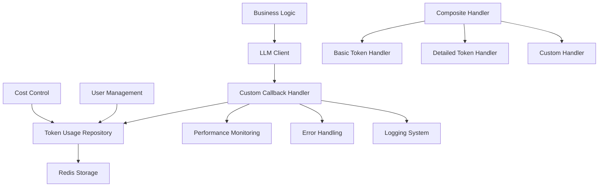
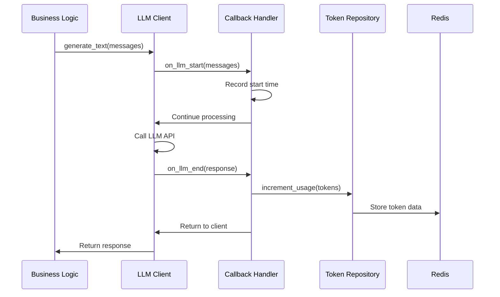
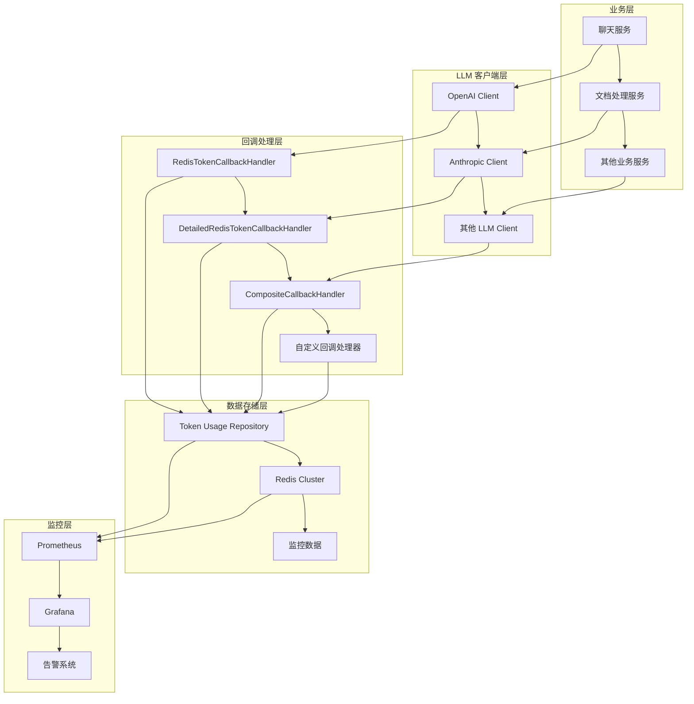
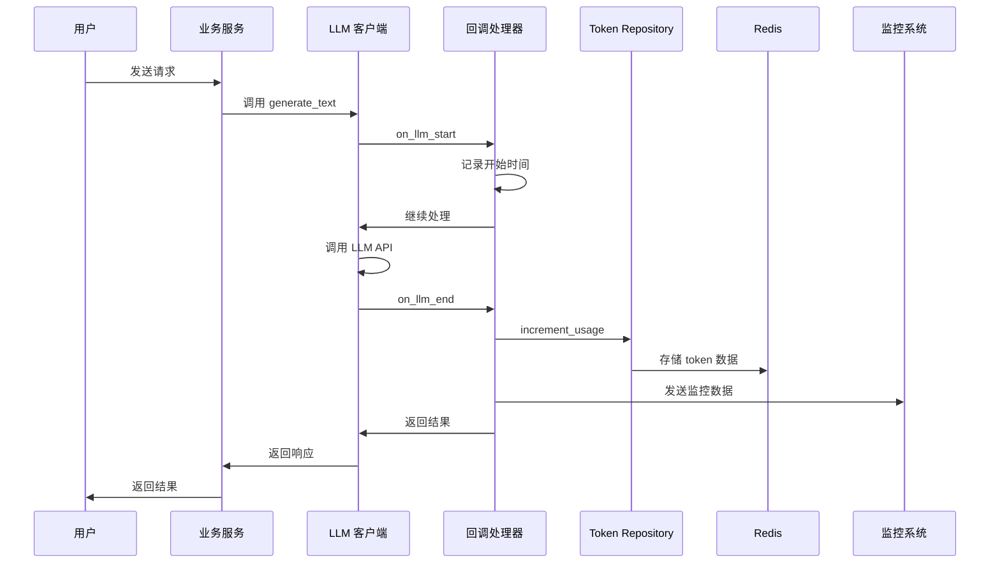
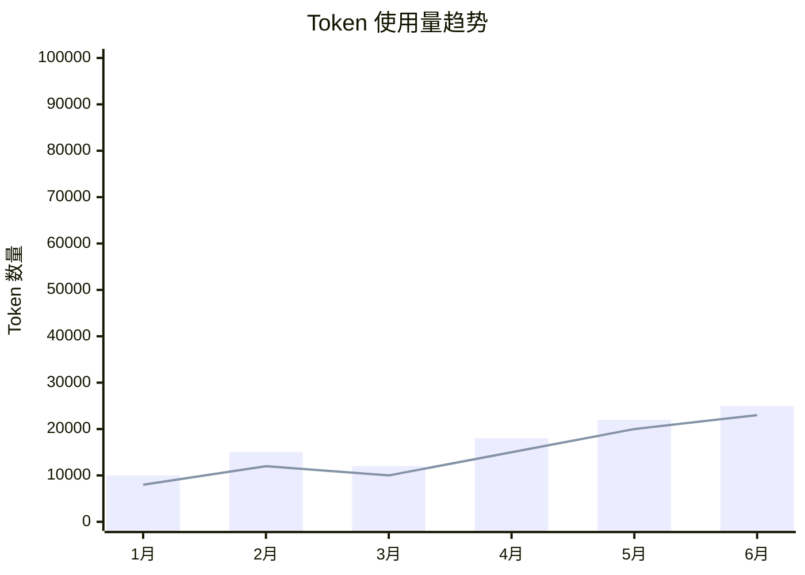
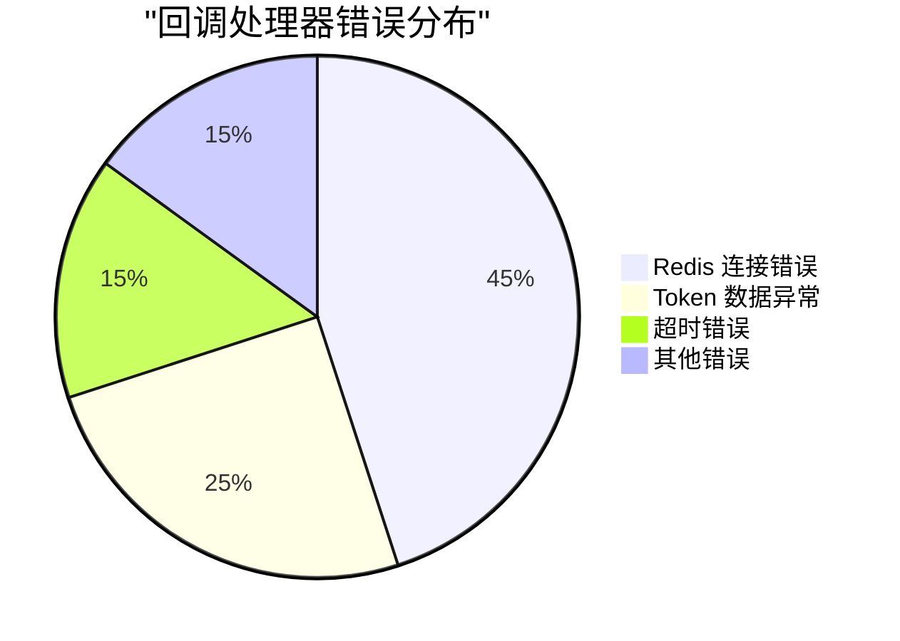

# LLM 自定义回调处理器技术文档

## 1. 概述 (Overview)

**目的**：`custom_callbacks.py` 模块是 AIECS 系统中负责 LLM（大语言模型）调用生命周期管理的核心组件。该模块通过异步回调机制，实现了对 LLM 调用过程的细粒度监控、token 使用量统计、性能指标收集以及错误处理等功能。

**核心价值**：
- **Token 使用量精确统计**：自动记录用户的 prompt tokens 和 completion tokens 使用情况
- **性能监控**：实时监控 LLM 调用的响应时间和成功率
- **成本控制**：通过详细的 token 统计实现精确的成本核算和用量限制
- **可扩展性**：提供组合式回调处理器，支持多种监控策略并行执行
- **容错性**：确保回调处理失败不会影响主业务流程

## 2. 问题背景与设计动机 (Problem & Motivation)

### 2.1 业务痛点

在 AIECS 系统开发过程中，我们面临以下关键挑战：

1. **成本控制难题**：LLM API 调用成本高昂，需要精确统计每个用户的 token 使用量
2. **性能监控缺失**：缺乏对 LLM 调用性能的实时监控，难以识别性能瓶颈
3. **用量限制需求**：需要为不同用户设置不同的 token 使用限制
4. **多维度统计**：需要区分 prompt tokens 和 completion tokens 进行精细化分析
5. **系统可观测性**：需要完整的调用链路追踪和错误监控

### 2.2 设计动机

基于以上痛点，我们设计了基于回调模式的监控系统：

- **解耦设计**：将监控逻辑与业务逻辑分离，避免代码耦合
- **异步处理**：使用异步回调确保监控操作不影响主业务性能
- **灵活扩展**：通过组合模式支持多种监控策略的灵活组合
- **数据持久化**：集成 Redis 实现高性能的统计数据存储

## 3. 架构定位与上下文 (Architecture & Context)

### 3.1 系统架构图



### 3.2 上下游依赖关系

**上游调用者**：
- `BaseLLMClient` 及其子类（OpenAI、Anthropic 等）
- 业务服务层（聊天服务、文档处理服务等）

**下游依赖**：
- `TokenUsageRepository`：负责 Redis 数据存储
- `BaseCallback`：提供抽象回调接口
- `Redis Client`：数据持久化层

**同级组件**：
- `LLMMessage` 和 `LLMResponse`：数据传输对象
- 日志系统：用于监控和调试

### 3.3 数据流向



## 4. 核心功能与用例 (Core Features & Use Cases)

### 4.1 基础 Token 统计回调处理器

**功能描述**：记录 LLM 调用的总 token 使用量，适用于简单的用量统计场景。

**核心特性**：
- 自动记录调用开始和结束时间
- 统计总 token 使用量
- 集成 Redis 持久化存储
- 异常容错处理

**使用场景**：
```python
# 基础用量统计
from aiecs.llm.custom_callbacks import create_token_callback

# 创建回调处理器
callback = create_token_callback(
    user_id="user_123",
    cycle_start_date="2024-01-01"
)

# 在 LLM 客户端中使用
async with LLMClient() as client:
    response = await client.generate_text(
        messages=messages,
        callbacks=[callback]
    )
```

**实际应用案例**：
- **用户用量限制**：为每个用户设置月度 token 限制
- **成本核算**：计算不同用户的 API 调用成本
- **用量分析**：生成用户使用报告和趋势分析

### 4.2 详细 Token 统计回调处理器

**功能描述**：分别记录 prompt tokens 和 completion tokens，提供更精细的用量分析。

**核心特性**：
- 智能 token 估算算法
- 分离统计 prompt 和 completion tokens
- 支持多种 token 数据源
- 自动数据验证和修正

**使用场景**：
```python
# 详细用量统计
from aiecs.llm.custom_callbacks import create_detailed_token_callback

# 创建详细统计回调
detailed_callback = create_detailed_token_callback(
    user_id="user_123",
    cycle_start_date="2024-01-01"
)

# 组合使用多个回调
composite_callback = create_composite_callback(
    detailed_callback,
    performance_callback,
    error_callback
)
```

**实际应用案例**：
- **成本优化**：分析 prompt 和 completion 的成本比例
- **模型选择**：根据 token 使用模式选择最优模型
- **性能调优**：优化 prompt 长度减少不必要的 token 消耗

### 4.3 组合回调处理器

**功能描述**：支持同时执行多个回调处理器，实现复杂的监控策略。

**核心特性**：
- 并行执行多个回调
- 独立异常处理
- 动态添加/移除处理器
- 统一的执行接口

**使用场景**：
```python
# 创建复合监控策略
from aiecs.llm.custom_callbacks import (
    create_token_callback,
    create_detailed_token_callback,
    create_composite_callback
)

# 构建完整的监控体系
monitoring_callbacks = create_composite_callback(
    create_token_callback("user_123"),
    create_detailed_token_callback("user_123"),
    custom_performance_callback(),
    custom_alert_callback()
)

# 在业务代码中使用
async def process_user_query(user_id: str, query: str):
    messages = [{"role": "user", "content": query}]
    
    async with LLMClient() as client:
        response = await client.generate_text(
            messages=messages,
            callbacks=[monitoring_callbacks]
        )
    return response
```

**实际应用案例**：
- **全链路监控**：同时进行用量统计、性能监控、错误追踪
- **多租户管理**：为不同租户配置不同的监控策略
- **A/B 测试**：对比不同配置下的性能表现

## 5. API 参考 (API Reference)

### 5.1 RedisTokenCallbackHandler

#### 构造函数
```python
def __init__(self, user_id: str, cycle_start_date: Optional[str] = None)
```

**参数**：
- `user_id` (str, 必需): 用户唯一标识符
- `cycle_start_date` (str, 可选): 计费周期开始日期，格式为 "YYYY-MM-DD"，默认为当前月份

**异常**：
- `ValueError`: 当 user_id 为空时抛出

#### 方法

##### on_llm_start
```python
async def on_llm_start(self, messages: List[dict], **kwargs: Any) -> None
```

**功能**：LLM 调用开始时触发
**参数**：
- `messages` (List[dict]): 消息列表，每个消息包含 'role' 和 'content' 键
- `**kwargs`: 额外参数（如 provider、model 等）

##### on_llm_end
```python
async def on_llm_end(self, response: dict, **kwargs: Any) -> None
```

**功能**：LLM 调用成功结束时触发
**参数**：
- `response` (dict): 响应字典，包含 'content'、'tokens_used'、'model' 等键
- `**kwargs`: 额外参数

**处理逻辑**：
1. 计算调用持续时间
2. 提取 token 使用量
3. 调用 repository 记录数据
4. 记录日志

##### on_llm_error
```python
async def on_llm_error(self, error: Exception, **kwargs: Any) -> None
```

**功能**：LLM 调用出错时触发
**参数**：
- `error` (Exception): 发生的异常
- `**kwargs`: 额外参数

### 5.2 DetailedRedisTokenCallbackHandler

#### 构造函数
```python
def __init__(self, user_id: str, cycle_start_date: Optional[str] = None)
```

**参数**：与 `RedisTokenCallbackHandler` 相同

#### 方法

##### on_llm_start
```python
async def on_llm_start(self, messages: List[dict], **kwargs: Any) -> None
```

**功能**：记录开始时间并估算 prompt tokens
**特殊处理**：调用 `_estimate_prompt_tokens` 方法估算输入 token 数量

##### on_llm_end
```python
async def on_llm_end(self, response: dict, **kwargs: Any) -> None
```

**功能**：记录详细的 token 使用情况
**特殊处理**：
1. 调用 `_extract_detailed_tokens` 提取详细 token 信息
2. 使用 `increment_detailed_usage` 方法记录数据

##### _estimate_prompt_tokens
```python
def _estimate_prompt_tokens(self, messages: List[dict]) -> int
```

**功能**：估算输入消息的 token 数量
**算法**：使用 4 字符 ≈ 1 token 的粗略估算
**返回**：估算的 token 数量

##### _extract_detailed_tokens
```python
def _extract_detailed_tokens(self, response: dict) -> tuple[int, int]
```

**功能**：从响应中提取详细的 token 信息
**返回**：`(prompt_tokens, completion_tokens)` 元组
**处理策略**：
1. 优先使用响应中的详细 token 信息
2. 如果只有总数，则使用估算的 prompt tokens 计算 completion tokens
3. 如果完全没有信息，则基于内容长度估算

### 5.3 CompositeCallbackHandler

#### 构造函数
```python
def __init__(self, handlers: List[CustomAsyncCallbackHandler])
```

**参数**：
- `handlers` (List[CustomAsyncCallbackHandler]): 回调处理器列表

#### 方法

##### add_handler
```python
def add_handler(self, handler: CustomAsyncCallbackHandler)
```

**功能**：动态添加回调处理器
**参数**：
- `handler` (CustomAsyncCallbackHandler): 要添加的处理器

##### on_llm_start
```python
async def on_llm_start(self, messages: List[dict], **kwargs: Any) -> None
```

**功能**：并行执行所有处理器的 start 回调
**异常处理**：单个处理器失败不影响其他处理器

##### on_llm_end
```python
async def on_llm_end(self, response: dict, **kwargs: Any) -> None
```

**功能**：并行执行所有处理器的 end 回调

##### on_llm_error
```python
async def on_llm_error(self, error: Exception, **kwargs: Any) -> None
```

**功能**：并行执行所有处理器的 error 回调

### 5.4 便利函数

#### create_token_callback
```python
def create_token_callback(user_id: str, cycle_start_date: Optional[str] = None) -> RedisTokenCallbackHandler
```

**功能**：创建基础 token 统计回调处理器
**返回**：`RedisTokenCallbackHandler` 实例

#### create_detailed_token_callback
```python
def create_detailed_token_callback(user_id: str, cycle_start_date: Optional[str] = None) -> DetailedRedisTokenCallbackHandler
```

**功能**：创建详细 token 统计回调处理器
**返回**：`DetailedRedisTokenCallbackHandler` 实例

#### create_composite_callback
```python
def create_composite_callback(*handlers: CustomAsyncCallbackHandler) -> CompositeCallbackHandler
```

**功能**：创建组合回调处理器
**参数**：可变数量的回调处理器
**返回**：`CompositeCallbackHandler` 实例

## 6. 技术实现细节 (Technical Details)

### 6.1 异步处理机制

**设计原则**：
- 所有回调方法都是异步的，避免阻塞主业务线程
- 使用 `async/await` 语法确保非阻塞执行
- 异常处理不会影响主业务流程

**实现细节**：
```python
async def on_llm_end(self, response: dict, **kwargs: Any) -> None:
    try:
        # 异步执行 token 记录
        await token_usage_repo.increment_total_usage(
            self.user_id,
            tokens_used,
            self.cycle_start_date
        )
    except Exception as e:
        # 记录错误但不重新抛出，避免影响主流程
        logger.error(f"Failed to record token usage: {e}")
```

### 6.2 Token 估算算法

**基础估算**：
- 使用 4 字符 ≈ 1 token 的粗略估算
- 适用于英文文本的快速估算
- 对于中文等语言可能不够精确

**改进策略**：
```python
def _estimate_prompt_tokens(self, messages: List[dict]) -> int:
    total_chars = sum(len(msg.get('content', '')) for msg in messages)
    # 可以根据语言类型调整估算比例
    return total_chars // 4
```

**未来优化方向**：
- 集成 tiktoken 等专业 token 计算库
- 支持多语言 token 估算
- 基于历史数据动态调整估算参数

### 6.3 错误处理策略

**分层错误处理**：
1. **方法级别**：每个回调方法内部捕获异常
2. **处理器级别**：CompositeCallbackHandler 为每个子处理器提供独立错误处理
3. **系统级别**：通过日志系统记录所有错误

**容错机制**：
```python
async def on_llm_end(self, response: dict, **kwargs: Any) -> None:
    for handler in self.handlers:
        try:
            await handler.on_llm_end(response, **kwargs)
        except Exception as e:
            # 记录错误但继续执行其他处理器
            logger.error(f"Error in callback handler {type(handler).__name__}: {e}")
```

### 6.4 性能优化

**批量操作**：
- 使用 Redis pipeline 进行批量更新
- 减少网络往返次数
- 提高数据写入效率

**内存管理**：
- 及时清理临时变量
- 避免在回调中存储大量数据
- 使用弱引用避免循环引用

**并发控制**：
- 使用异步锁避免竞态条件
- 合理控制并发回调数量
- 实现背压机制防止内存溢出

### 6.5 数据一致性

**原子操作**：
- 使用 Redis 的 HINCRBY 命令确保原子性
- 避免并发更新导致的数据不一致

**事务处理**：
```python
# 使用 pipeline 确保事务性
pipe = client.pipeline()
for field, value in updates.items():
    pipe.hincrby(redis_key, field, value)
await pipe.execute()
```

## 7. 配置与部署 (Configuration & Deployment)

### 7.1 环境变量配置

**必需配置**：
```bash
# Redis 连接配置
REDIS_HOST=localhost
REDIS_PORT=6379
REDIS_PASSWORD=your_password
REDIS_DB=0

# 日志配置
LOG_LEVEL=INFO
LOG_FORMAT=json
```

**可选配置**：
```bash
# Token 估算参数
TOKEN_ESTIMATION_RATIO=4  # 字符与 token 的比例

# 性能监控配置
ENABLE_PERFORMANCE_MONITORING=true
PERFORMANCE_LOG_THRESHOLD=1000  # 毫秒

# 错误重试配置
CALLBACK_RETRY_ATTEMPTS=3
CALLBACK_RETRY_DELAY=100  # 毫秒
```

### 7.2 依赖管理

**核心依赖**：
```python
# requirements.txt
redis>=4.5.0
asyncio-mqtt>=0.11.0
```

**开发依赖**：
```python
# requirements-dev.txt
pytest>=7.0.0
pytest-asyncio>=0.21.0
pytest-mock>=3.10.0
```

### 7.3 部署配置

**Docker 配置**：
```dockerfile
FROM python:3.9-slim

WORKDIR /app
COPY requirements.txt .
RUN pip install -r requirements.txt

COPY . .
CMD ["python", "-m", "aiecs.llm.custom_callbacks"]
```

**Kubernetes 配置**：
```yaml
apiVersion: apps/v1
kind: Deployment
metadata:
  name: aiecs-callbacks
spec:
  replicas: 3
  selector:
    matchLabels:
      app: aiecs-callbacks
  template:
    metadata:
      labels:
        app: aiecs-callbacks
    spec:
      containers:
      - name: callbacks
        image: aiecs/callbacks:latest
        env:
        - name: REDIS_HOST
          value: "redis-service"
        - name: REDIS_PORT
          value: "6379"
```

### 7.4 监控配置

**Prometheus 指标**：
```python
from prometheus_client import Counter, Histogram

# 定义监控指标
token_usage_total = Counter('token_usage_total', 'Total token usage', ['user_id', 'type'])
callback_duration = Histogram('callback_duration_seconds', 'Callback execution time')
callback_errors = Counter('callback_errors_total', 'Callback errors', ['handler_type'])
```

**健康检查**：
```python
async def health_check():
    """检查回调处理器健康状态"""
    try:
        # 检查 Redis 连接
        redis_client = await get_redis_client()
        await redis_client.ping()
        
        # 检查处理器状态
        return {"status": "healthy", "timestamp": time.time()}
    except Exception as e:
        return {"status": "unhealthy", "error": str(e)}
```

## 8. 维护与故障排查 (Maintenance & Troubleshooting)

### 8.1 监控指标

**关键指标**：
- Token 使用量趋势
- 回调执行时间
- 错误率和异常类型
- Redis 连接状态
- 内存使用情况

**监控仪表板**：
```python
# Grafana 查询示例
# Token 使用量趋势
sum(rate(token_usage_total[5m])) by (user_id)

# 回调执行时间
histogram_quantile(0.95, rate(callback_duration_seconds_bucket[5m]))

# 错误率
rate(callback_errors_total[5m])
```

### 8.2 常见故障及解决方案

#### 8.2.1 Redis 连接失败

**症状**：
- 日志中出现 "Failed to connect to Redis" 错误
- Token 数据无法记录
- 回调处理器异常退出

**排查步骤**：
1. 检查 Redis 服务状态：`redis-cli ping`
2. 验证网络连接：`telnet redis_host 6379`
3. 检查认证信息：验证用户名密码
4. 查看 Redis 日志：`tail -f /var/log/redis/redis.log`

**解决方案**：
```python
# 添加连接重试机制
async def get_redis_client_with_retry(max_retries=3):
    for attempt in range(max_retries):
        try:
            return await get_redis_client()
        except Exception as e:
            if attempt == max_retries - 1:
                raise
            await asyncio.sleep(2 ** attempt)  # 指数退避
```

#### 8.2.2 Token 数据不一致

**症状**：
- 统计的 token 数量与实际使用不符
- 不同时间查询结果不一致
- 数据出现负值

**排查步骤**：
1. 检查并发更新：查看是否有多个进程同时更新
2. 验证数据完整性：检查 Redis 中的原始数据
3. 分析日志：查找异常的回调执行记录

**解决方案**：
```python
# 添加数据验证
async def validate_token_data(user_id: str, tokens: int):
    if tokens < 0:
        logger.warning(f"Negative token count detected for user {user_id}: {tokens}")
        return 0
    return tokens
```

#### 8.2.3 性能问题

**症状**：
- 回调执行时间过长
- 系统响应变慢
- 内存使用持续增长

**排查步骤**：
1. 分析回调执行时间：使用性能分析工具
2. 检查内存泄漏：监控内存使用趋势
3. 优化 Redis 操作：减少不必要的查询

**解决方案**：
```python
# 添加性能监控
import time
from functools import wraps

def monitor_performance(func):
    @wraps(func)
    async def wrapper(*args, **kwargs):
        start_time = time.time()
        try:
            result = await func(*args, **kwargs)
            return result
        finally:
            duration = time.time() - start_time
            if duration > 1.0:  # 超过1秒记录警告
                logger.warning(f"Slow callback execution: {func.__name__} took {duration:.2f}s")
    return wrapper
```

### 8.3 日志分析

**日志级别配置**：
```python
import logging

# 配置回调处理器日志
callback_logger = logging.getLogger('aiecs.callbacks')
callback_logger.setLevel(logging.INFO)

# 添加文件处理器
file_handler = logging.FileHandler('/var/log/aiecs/callbacks.log')
file_handler.setFormatter(logging.Formatter(
    '%(asctime)s - %(name)s - %(levelname)s - %(message)s'
))
callback_logger.addHandler(file_handler)
```

**关键日志模式**：
```bash
# 查找错误日志
grep "ERROR" /var/log/aiecs/callbacks.log | tail -100

# 分析性能问题
grep "Slow callback" /var/log/aiecs/callbacks.log

# 监控 token 使用
grep "Recorded.*tokens" /var/log/aiecs/callbacks.log | tail -50
```

### 8.4 数据备份与恢复

**备份策略**：
```bash
# Redis 数据备份
redis-cli --rdb /backup/redis-$(date +%Y%m%d).rdb

# 定期备份脚本
#!/bin/bash
DATE=$(date +%Y%m%d_%H%M%S)
redis-cli --rdb /backup/redis-$DATE.rdb
gzip /backup/redis-$DATE.rdb
```

**恢复流程**：
```bash
# 停止 Redis 服务
systemctl stop redis

# 恢复数据
gunzip /backup/redis-20240101_120000.rdb.gz
cp /backup/redis-20240101_120000.rdb /var/lib/redis/dump.rdb

# 启动 Redis 服务
systemctl start redis
```

## 9. 可视化图表 (Visualizations)

### 9.1 系统架构图



### 9.2 数据流图



### 9.3 Token 使用量趋势图



### 9.4 错误率监控图



## 10. 版本历史 (Version History)

### v1.0.0 (2024-01-15)
**新增功能**：
- 实现基础 `RedisTokenCallbackHandler`
- 支持总 token 使用量统计
- 集成 Redis 数据存储
- 添加异步回调机制

**技术特性**：
- 基于 `CustomAsyncCallbackHandler` 抽象基类
- 使用 Redis HINCRBY 确保原子操作
- 完整的错误处理和日志记录

### v1.1.0 (2024-02-01)
**新增功能**：
- 实现 `DetailedRedisTokenCallbackHandler`
- 支持分离统计 prompt 和 completion tokens
- 添加智能 token 估算算法
- 实现 `CompositeCallbackHandler` 组合模式

**性能优化**：
- 使用 Redis pipeline 批量操作
- 优化内存使用和并发处理
- 添加性能监控指标

### v1.2.0 (2024-03-01)
**新增功能**：
- 添加便利函数简化使用
- 支持自定义计费周期
- 实现数据验证和修正机制
- 添加健康检查接口

**改进**：
- 增强错误处理和重试机制
- 优化日志格式和监控指标
- 添加完整的单元测试覆盖

### v1.3.0 (2024-04-01) [计划中]
**计划功能**：
- 集成 tiktoken 精确 token 计算
- 支持多语言 token 估算
- 添加成本预测和用量预警
- 实现分布式锁避免并发冲突

**性能目标**：
- 回调执行时间 < 100ms
- 支持 1000+ 并发用户
- 99.9% 可用性保证

---

## 附录

### A. 相关文档链接
- [Token Usage Repository 文档](./TOKEN_USAGE_REPOSITORY.md)
- [Redis 客户端配置文档](./REDIS_CLIENT.md)
- [LLM 客户端架构文档](./LLM_CLIENT_ARCHITECTURE.md)

### B. 示例代码仓库
- [完整示例项目](https://github.com/aiecs/examples)
- [性能测试脚本](https://github.com/aiecs/performance-tests)
- [监控配置模板](https://github.com/aiecs/monitoring-configs)

### C. 技术支持
- 技术文档：https://docs.aiecs.com
- 问题反馈：https://github.com/aiecs/issues
- 社区讨论：https://discord.gg/aiecs
