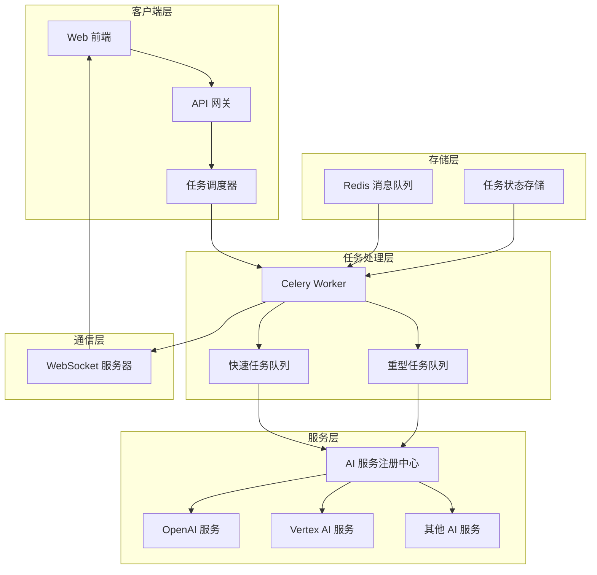
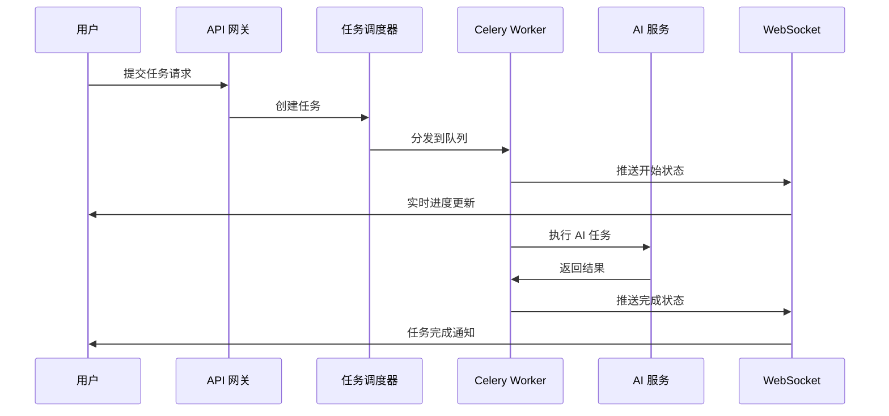
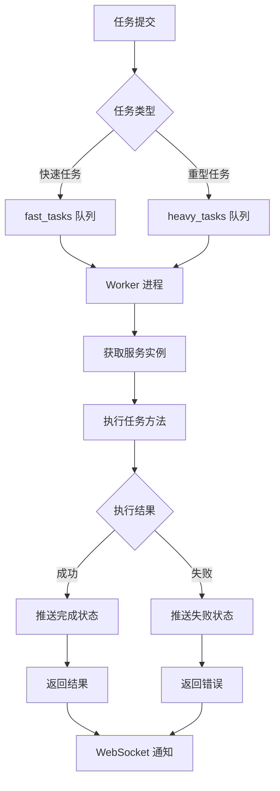
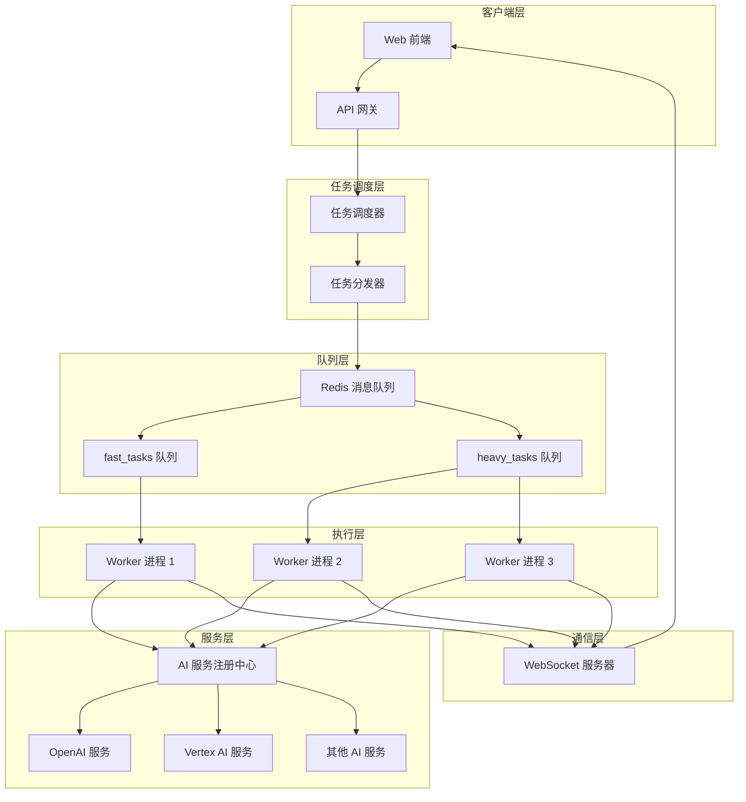
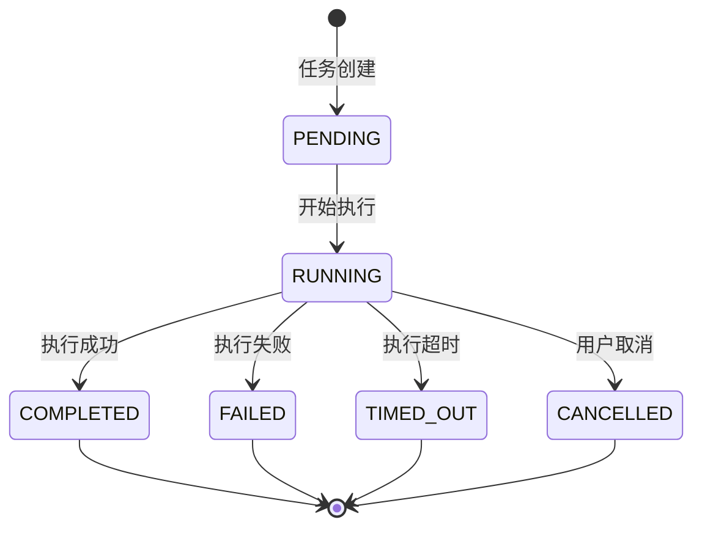
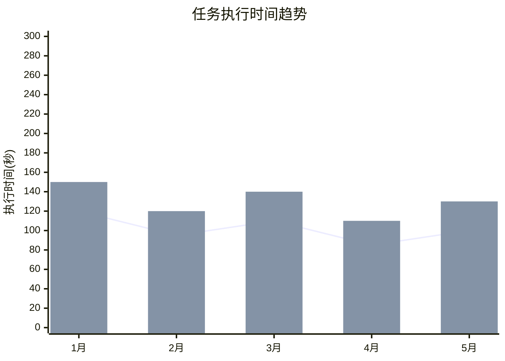

# Celery 任务工作器技术文档

## 1. 概述 (Overview)

**目的**：`worker.py` 是 AIECS 系统的核心任务执行引擎，基于 Celery 分布式任务队列实现异步任务处理。该模块负责执行各种 AI 服务任务，包括快速任务和重型任务，通过 WebSocket 实时推送任务进度，确保系统的高可用性和可扩展性。

**核心价值**：
- **异步任务处理**：支持长时间运行的 AI 任务，避免阻塞主线程
- **分布式架构**：基于 Celery 实现水平扩展和负载均衡
- **实时进度推送**：通过 WebSocket 实时更新任务执行状态
- **任务分类管理**：区分快速任务和重型任务，优化资源分配
- **容错机制**：完善的错误处理和状态管理

## 2. 问题背景与设计动机 (Problem & Motivation)

### 2.1 业务痛点

在 AI 应用开发中面临以下关键挑战：

1. **同步阻塞问题**：AI 任务执行时间长，同步处理导致请求超时
2. **资源竞争**：多个用户同时请求 AI 服务，资源分配不均
3. **用户体验差**：长时间等待无反馈，用户不知道任务状态
4. **系统扩展性**：单机处理能力有限，无法应对高并发
5. **任务管理复杂**：缺乏统一的任务调度和监控机制

### 2.2 设计动机

基于以上痛点，设计了基于 Celery 的分布式任务处理系统：

- **异步解耦**：将任务执行与请求处理分离，提高系统响应性
- **队列管理**：通过不同队列区分任务优先级和资源需求
- **实时通信**：集成 WebSocket 实现任务进度实时推送
- **服务发现**：通过注册中心动态获取 AI 服务实例
- **状态跟踪**：完整的任务生命周期管理和状态更新

## 3. 架构定位与上下文 (Architecture & Context)

### 3.1 系统架构图



### 3.2 上下游依赖

**上游调用者**：
- 任务调度器（API 层）
- 业务服务层
- 用户请求处理器

**下游依赖**：
- AI 服务注册中心
- WebSocket 服务器
- Redis 消息队列
- 任务状态存储

**同级组件**：
- 配置管理系统
- 日志和监控系统
- 错误处理机制

### 3.3 数据流向



## 4. 核心功能与用例 (Core Features & Use Cases)

### 4.1 快速任务处理

**功能描述**：处理轻量级、快速完成的 AI 任务，如文本分析、简单问答等。

**核心特性**：
- 低延迟执行
- 高并发处理
- 快速响应

**使用场景**：
```python
# 快速文本分析任务
from aiecs.tasks.worker import execute_task

# 提交快速任务
task_result = execute_task.delay(
    task_name="analyze_text",
    user_id="user_123",
    task_id="task_456",
    step=1,
    mode="chat",
    service="text_analyzer",
    input_data={"text": "分析这段文本的情感倾向"},
    context={"language": "zh", "model": "gpt-3.5-turbo"}
)

# 获取任务结果
result = task_result.get(timeout=30)
print(f"分析结果: {result['result']}")
```

**实际应用案例**：
- **智能客服**：快速回答用户常见问题
- **内容审核**：实时检测文本内容合规性
- **语言检测**：自动识别文本语言类型
- **情感分析**：分析用户评论的情感倾向

### 4.2 重型任务处理

**功能描述**：处理复杂、耗时的 AI 任务，如文档生成、代码分析、图像处理等。

**核心特性**：
- 长时间执行支持
- 资源密集型处理
- 进度实时更新

**使用场景**：
```python
# 重型文档生成任务
from aiecs.tasks.worker import execute_heavy_task

# 提交重型任务
heavy_task = execute_heavy_task.delay(
    task_name="generate_document",
    user_id="user_123",
    task_id="task_789",
    step=1,
    mode="document",
    service="doc_generator",
    input_data={
        "topic": "人工智能发展趋势",
        "length": "5000字",
        "style": "学术论文"
    },
    context={
        "template": "academic",
        "references": True,
        "citations": True
    }
)

# 异步获取结果
@heavy_task.on_success
def on_success(sender, result, **kwargs):
    print(f"文档生成完成: {result['result']['document_id']}")

@heavy_task.on_failure
def on_failure(sender, exc, **kwargs):
    print(f"任务失败: {exc}")
```

**实际应用案例**：
- **技术文档生成**：根据需求自动生成完整技术文档
- **代码审查**：深度分析代码质量和潜在问题
- **数据分析报告**：处理大量数据并生成分析报告
- **多媒体处理**：图像、视频的 AI 处理和分析

### 4.3 实时进度推送

**功能描述**：通过 WebSocket 实时推送任务执行状态和进度信息。

**核心特性**：
- 实时状态更新
- 详细进度信息
- 错误状态通知

**使用场景**：
```python
# 前端 WebSocket 监听
import socketio

sio = socketio.Client()

@sio.event
def progress(data):
    """接收任务进度更新"""
    status = data['status']
    step = data['step']
    task = data['task']
    
    if status == 'running':
        print(f"任务 {task} 正在执行步骤 {step}")
    elif status == 'completed':
        print(f"任务 {task} 执行完成: {data['result']}")
    elif status == 'failed':
        print(f"任务 {task} 执行失败: {data['error']}")

# 连接到 WebSocket 服务器
sio.connect('http://localhost:8000')
```

**实际应用案例**：
- **进度条显示**：前端实时显示任务执行进度
- **状态通知**：任务完成或失败时及时通知用户
- **调试信息**：开发阶段查看详细的任务执行日志
- **用户体验优化**：减少用户等待焦虑，提升交互体验

## 5. API 参考 (API Reference)

### 5.1 Celery 应用配置

#### celery_app
```python
celery_app = Celery("ai_worker", broker=settings.celery_broker_url)
```

**配置项**：
- `task_serializer`: 'json' - 任务序列化格式
- `accept_content`: ['json'] - 接受的内容类型
- `result_serializer`: 'json' - 结果序列化格式
- `timezone`: 'UTC' - 时区设置
- `enable_utc`: True - 启用 UTC 时间

#### 队列配置
```python
task_queues = {
    'fast_tasks': {'exchange': 'fast_tasks', 'routing_key': 'fast_tasks'},
    'heavy_tasks': {'exchange': 'heavy_tasks', 'routing_key': 'heavy_tasks'}
}
```

#### 路由配置
```python
task_routes = {
    'aiecs.tasks.worker.execute_task': {'queue': 'fast_tasks'},
    'aiecs.tasks.worker.execute_heavy_task': {'queue': 'heavy_tasks'}
}
```

### 5.2 任务函数

#### execute_task
```python
@celery_app.task(bind=True, name="aiecs.tasks.worker.execute_task")
def execute_task(self, task_name: str, user_id: str, task_id: str, step: int,
                 mode: str, service: str, input_data: Dict[str, Any], 
                 context: Dict[str, Any])
```

**参数**：
- `task_name` (str, 必需): 要执行的任务名称
- `user_id` (str, 必需): 用户唯一标识符
- `task_id` (str, 必需): 任务唯一标识符
- `step` (int, 必需): 任务步骤编号
- `mode` (str, 必需): 服务模式（如 'chat', 'document'）
- `service` (str, 必需): 服务名称
- `input_data` (Dict[str, Any], 必需): 任务输入数据
- `context` (Dict[str, Any], 必需): 任务上下文信息

**返回**：
```python
{
    "status": "completed" | "failed",
    "task": task_name,
    "result": Any,  # 成功时返回结果
    "error": str    # 失败时返回错误信息
}
```

#### execute_heavy_task
```python
@celery_app.task(bind=True, name="aiecs.tasks.worker.execute_heavy_task")
def execute_heavy_task(self, task_name: str, user_id: str, task_id: str, step: int,
                       mode: str, service: str, input_data: Dict[str, Any], 
                       context: Dict[str, Any])
```

**参数**：与 `execute_task` 相同
**返回**：与 `execute_task` 相同

### 5.3 内部函数

#### _execute_service_task
```python
def _execute_service_task(self, task_name: str, user_id: str, task_id: str, step: int,
                         mode: str, service: str, input_data: Dict[str, Any], 
                         context: Dict[str, Any])
```

**功能**：执行服务任务的通用实现
**处理流程**：
1. 推送任务开始状态
2. 获取服务实例
3. 执行具体任务
4. 推送任务完成状态
5. 处理异常情况

## 6. 技术实现细节 (Technical Details)

### 6.1 Celery 配置机制

**消息代理配置**：
```python
celery_app = Celery("ai_worker", broker=settings.celery_broker_url)
```

**序列化配置**：
- 使用 JSON 格式进行任务和结果的序列化
- 确保跨语言兼容性
- 支持复杂数据结构的传输

**队列路由机制**：
```python
# 根据任务类型自动路由到不同队列
task_routes = {
    'aiecs.tasks.worker.execute_task': {'queue': 'fast_tasks'},
    'aiecs.tasks.worker.execute_heavy_task': {'queue': 'heavy_tasks'}
}
```

### 6.2 服务发现机制

**注册中心集成**：
```python
# 从注册中心获取服务类
service_cls = get_ai_service(mode, service)
service_instance = service_cls()
```

**动态方法调用**：
```python
# 优先调用具体任务方法
if hasattr(service_instance, task_name) and callable(getattr(service_instance, task_name)):
    method = getattr(service_instance, task_name)
    result = method(input_data, context)
else:
    # 回退到通用执行方法
    result = service_instance.execute_task(task_name, input_data, context)
```

### 6.3 实时通信机制

**WebSocket 集成**：
```python
# 推送任务状态更新
push_progress(user_id, {
    "status": TaskStatus.RUNNING.value,
    "step": step,
    "task": task_name,
    "message": f"Executing task: {task_name}"
})
```

**状态管理**：
- 使用 `TaskStatus` 枚举管理任务状态
- 支持 PENDING、RUNNING、COMPLETED、FAILED 等状态
- 实时推送状态变更

### 6.4 错误处理机制

**分层错误处理**：
```python
try:
    # 任务执行逻辑
    result = method(input_data, context)
    # 推送成功状态
    push_progress(user_id, {
        "status": TaskStatus.COMPLETED.value,
        "step": step,
        "task": task_name,
        "result": result,
        "message": f"Completed task: {task_name}"
    })
except Exception as e:
    # 记录错误日志
    logger.error(f"Error executing task {task_name}: {str(e)}", exc_info=True)
    # 推送失败状态
    push_progress(user_id, {
        "status": TaskStatus.FAILED.value,
        "step": step,
        "task": task_name,
        "error": str(e),
        "message": f"Failed to execute task: {task_name}"
    })
```

**异常传播**：
- 确保异常不会导致 Worker 崩溃
- 记录详细的错误信息
- 向客户端推送错误状态

### 6.5 任务上下文管理

**上下文构建**：
```python
# 使用 TaskContext 管理任务上下文
context = build_context(data)
```

**资源跟踪**：
- 文件操作跟踪
- 模型使用记录
- 性能指标收集

## 7. 配置与部署 (Configuration & Deployment)

### 7.1 环境变量配置

**必需配置**：
```bash
# Celery 消息代理
CELERY_BROKER_URL=redis://localhost:6379/0

# WebSocket 配置
CORS_ALLOWED_ORIGINS=http://localhost:3000,http://localhost:3001

# AI 服务配置
OPENAI_API_KEY=sk-...
VERTEX_PROJECT_ID=your-project-id
XAI_API_KEY=xai-...
```

**可选配置**：
```bash
# Celery 高级配置
CELERY_RESULT_BACKEND=redis://localhost:6379/1
CELERY_TASK_SERIALIZER=json
CELERY_ACCEPT_CONTENT=json
CELERY_RESULT_SERIALIZER=json
CELERY_TIMEZONE=UTC
CELERY_ENABLE_UTC=True

# 任务超时配置
CELERY_TASK_SOFT_TIME_LIMIT=300
CELERY_TASK_TIME_LIMIT=600

# 并发配置
CELERY_WORKER_CONCURRENCY=4
CELERY_WORKER_PREFETCH_MULTIPLIER=1
```

### 7.2 依赖管理

**核心依赖**：
```python
# requirements.txt
celery>=5.3.0
redis>=4.5.0
python-socketio>=5.8.0
```

**开发依赖**：
```python
# requirements-dev.txt
pytest>=7.0.0
pytest-celery>=0.0.0
flower>=2.0.0  # Celery 监控工具
```

### 7.3 部署配置

**Docker 配置**：
```dockerfile
FROM python:3.9-slim

WORKDIR /app
COPY requirements.txt .
RUN pip install -r requirements.txt

COPY . .

# 启动 Celery Worker
CMD ["celery", "-A", "aiecs.tasks.worker", "worker", "--loglevel=info"]
```

**Docker Compose 配置**：
```yaml
version: '3.8'
services:
  redis:
    image: redis:7-alpine
    ports:
      - "6379:6379"
  
  celery-worker:
    build: .
    command: celery -A aiecs.tasks.worker worker --loglevel=info
    depends_on:
      - redis
    environment:
      - CELERY_BROKER_URL=redis://redis:6379/0
      - REDIS_URL=redis://redis:6379/0
  
  celery-beat:
    build: .
    command: celery -A aiecs.tasks.worker beat --loglevel=info
    depends_on:
      - redis
    environment:
      - CELERY_BROKER_URL=redis://redis:6379/0
```

**Kubernetes 配置**：
```yaml
apiVersion: apps/v1
kind: Deployment
metadata:
  name: celery-worker
spec:
  replicas: 3
  selector:
    matchLabels:
      app: celery-worker
  template:
    metadata:
      labels:
        app: celery-worker
    spec:
      containers:
      - name: worker
        image: aiecs/worker:latest
        command: ["celery", "-A", "aiecs.tasks.worker", "worker", "--loglevel=info"]
        env:
        - name: CELERY_BROKER_URL
          value: "redis://redis-service:6379/0"
        resources:
          requests:
            memory: "512Mi"
            cpu: "250m"
          limits:
            memory: "1Gi"
            cpu: "500m"
```

### 7.4 监控配置

**Flower 监控**：
```bash
# 启动 Flower 监控界面
celery -A aiecs.tasks.worker flower --port=5555
```

**Prometheus 指标**：
```python
from prometheus_client import Counter, Histogram, Gauge

# 定义监控指标
task_executions = Counter('celery_task_executions_total', 'Total task executions', ['task_name', 'status'])
task_duration = Histogram('celery_task_duration_seconds', 'Task execution duration', ['task_name'])
active_tasks = Gauge('celery_active_tasks', 'Number of active tasks')
```

## 8. 维护与故障排查 (Maintenance & Troubleshooting)

### 8.1 监控指标

**关键指标**：
- 任务执行成功率
- 任务执行时间分布
- 队列长度和积压情况
- Worker 进程状态
- 内存和 CPU 使用率

**监控仪表板**：
```python
# Grafana 查询示例
# 任务执行成功率
sum(rate(celery_task_executions_total[5m])) by (status)

# 平均任务执行时间
histogram_quantile(0.95, rate(celery_task_duration_seconds_bucket[5m]))

# 活跃任务数量
celery_active_tasks
```

### 8.2 常见故障及解决方案

#### 8.2.1 Worker 进程崩溃

**症状**：
- 任务长时间处于 PENDING 状态
- Worker 进程异常退出
- 日志中出现内存错误

**排查步骤**：
1. 检查 Worker 日志：`tail -f /var/log/celery/worker.log`
2. 检查系统资源：`htop` 或 `top`
3. 检查 Redis 连接：`redis-cli ping`
4. 查看任务详情：`celery -A aiecs.tasks.worker inspect active`

**解决方案**：
```bash
# 重启 Worker 进程
celery -A aiecs.tasks.worker worker --loglevel=info --concurrency=2

# 清理僵尸任务
celery -A aiecs.tasks.worker purge

# 增加内存限制
celery -A aiecs.tasks.worker worker --loglevel=info --max-memory-per-child=200000
```

#### 8.2.2 任务执行超时

**症状**：
- 任务状态显示 TIMED_OUT
- 长时间无响应
- 资源占用过高

**排查步骤**：
1. 检查任务复杂度：分析输入数据大小
2. 检查 AI 服务响应：测试 API 调用
3. 检查网络连接：ping 外部服务
4. 查看任务详情：`celery -A aiecs.tasks.worker inspect scheduled`

**解决方案**：
```python
# 增加任务超时时间
@celery_app.task(bind=True, time_limit=1800)  # 30分钟
def execute_heavy_task(self, ...):
    pass

# 优化任务执行
def _execute_service_task(self, ...):
    try:
        # 添加超时控制
        import signal
        
        def timeout_handler(signum, frame):
            raise TimeoutError("Task execution timeout")
        
        signal.signal(signal.SIGALRM, timeout_handler)
        signal.alarm(1800)  # 30分钟超时
        
        # 执行任务
        result = method(input_data, context)
        
        signal.alarm(0)  # 取消超时
        return result
    except TimeoutError:
        logger.error("Task execution timeout")
        raise
```

#### 8.2.3 WebSocket 连接问题

**症状**：
- 前端无法接收进度更新
- WebSocket 连接断开
- 任务状态不同步

**排查步骤**：
1. 检查 WebSocket 服务状态
2. 验证用户注册：`connected_clients`
3. 检查网络连接：`telnet localhost 8000`
4. 查看 WebSocket 日志

**解决方案**：
```python
# 添加连接重试机制
async def push_progress_with_retry(user_id: str, data: dict, max_retries=3):
    for attempt in range(max_retries):
        try:
            await push_progress(user_id, data)
            break
        except Exception as e:
            if attempt == max_retries - 1:
                logger.error(f"Failed to push progress after {max_retries} attempts: {e}")
            else:
                await asyncio.sleep(2 ** attempt)  # 指数退避

# 添加心跳检测
@sio.event
async def ping(sid):
    await sio.emit('pong', to=sid)
```

### 8.3 性能优化

**并发优化**：
```bash
# 根据 CPU 核心数调整并发
celery -A aiecs.tasks.worker worker --concurrency=4

# 使用事件循环优化
celery -A aiecs.tasks.worker worker --pool=eventlet --concurrency=1000
```

**内存优化**：
```bash
# 限制子进程内存使用
celery -A aiecs.tasks.worker worker --max-memory-per-child=200000

# 定期重启 Worker
celery -A aiecs.tasks.worker worker --max-tasks-per-child=1000
```

**队列优化**：
```python
# 配置队列优先级
task_routes = {
    'aiecs.tasks.worker.execute_task': {
        'queue': 'fast_tasks',
        'priority': 10
    },
    'aiecs.tasks.worker.execute_heavy_task': {
        'queue': 'heavy_tasks',
        'priority': 5
    }
}
```

### 8.4 日志分析

**日志配置**：
```python
import logging

# 配置 Celery 日志
logging.basicConfig(
    level=logging.INFO,
    format='%(asctime)s - %(name)s - %(levelname)s - %(message)s',
    handlers=[
        logging.FileHandler('/var/log/celery/worker.log'),
        logging.StreamHandler()
    ]
)
```

**关键日志模式**：
```bash
# 查找错误日志
grep "ERROR" /var/log/celery/worker.log | tail -100

# 分析任务执行时间
grep "Task completed" /var/log/celery/worker.log | awk '{print $NF}' | sort -n

# 监控内存使用
grep "Memory usage" /var/log/celery/worker.log
```

## 9. 可视化图表 (Visualizations)

### 9.1 任务执行流程图



### 9.2 系统架构图



### 9.3 任务状态转换图



### 9.4 性能监控图



## 10. 版本历史 (Version History)

### v1.0.0 (2024-01-15)
**新增功能**：
- 实现基础 Celery Worker 架构
- 支持快速任务和重型任务分类
- 集成 WebSocket 实时进度推送
- 添加基础错误处理机制

**技术特性**：
- 基于 Redis 的消息队列
- JSON 序列化支持
- 服务注册中心集成
- 任务状态管理

### v1.1.0 (2024-02-01)
**新增功能**：
- 优化任务执行性能
- 添加任务超时控制
- 实现任务重试机制
- 增强错误处理和日志记录

**性能优化**：
- 并发处理优化
- 内存使用优化
- 队列路由优化

### v1.2.0 (2024-03-01)
**新增功能**：
- 添加任务优先级支持
- 实现任务依赖管理
- 集成监控和指标收集
- 支持任务批量处理

**监控增强**：
- Prometheus 指标集成
- Flower 监控界面
- 详细性能分析

### v1.3.0 (2024-04-01) [计划中]
**计划功能**：
- 添加任务调度器
- 实现任务持久化
- 支持任务版本管理
- 添加任务模板系统

**架构优化**：
- 微服务架构支持
- 容器化部署优化
- 云原生集成

---

## 附录

### A. 相关文档
- [Celery 官方文档](https://docs.celeryproject.org/)
- [Redis 配置文档](./REDIS_CONFIG.md)
- [WebSocket 服务文档](./WEBSOCKET_SERVICE.md)
- [AI 服务注册中心文档](./AI_SERVICE_REGISTRY.md)

### B. 示例代码
- [完整示例项目](https://github.com/aiecs/examples)
- [性能测试脚本](https://github.com/aiecs/performance-tests)
- [监控配置模板](https://github.com/aiecs/monitoring-configs)

### C. 技术支持
- 技术文档：https://docs.aiecs.com
- 问题反馈：https://github.com/aiecs/issues
- 社区讨论：https://discord.gg/aiecs
