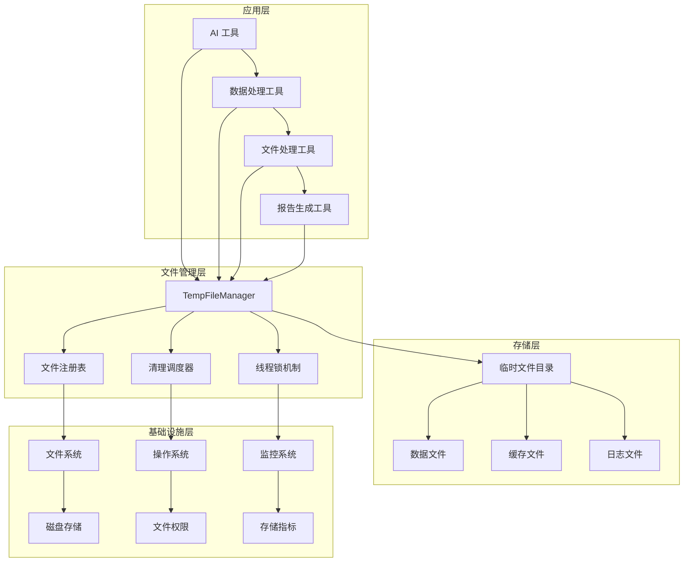
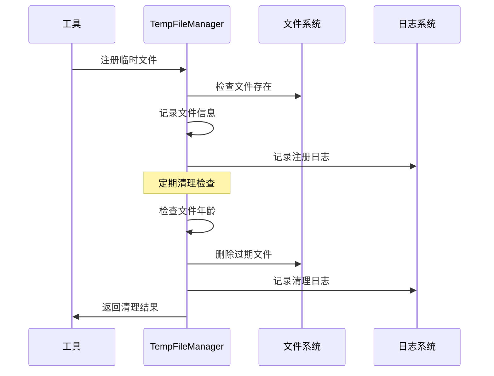
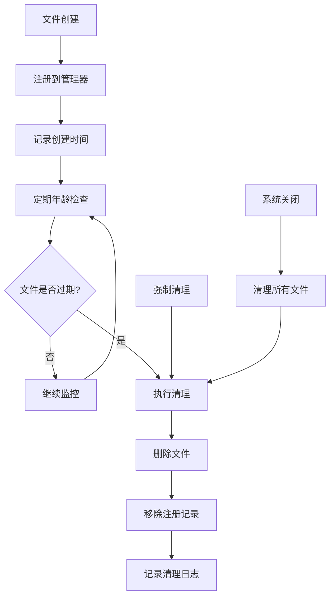
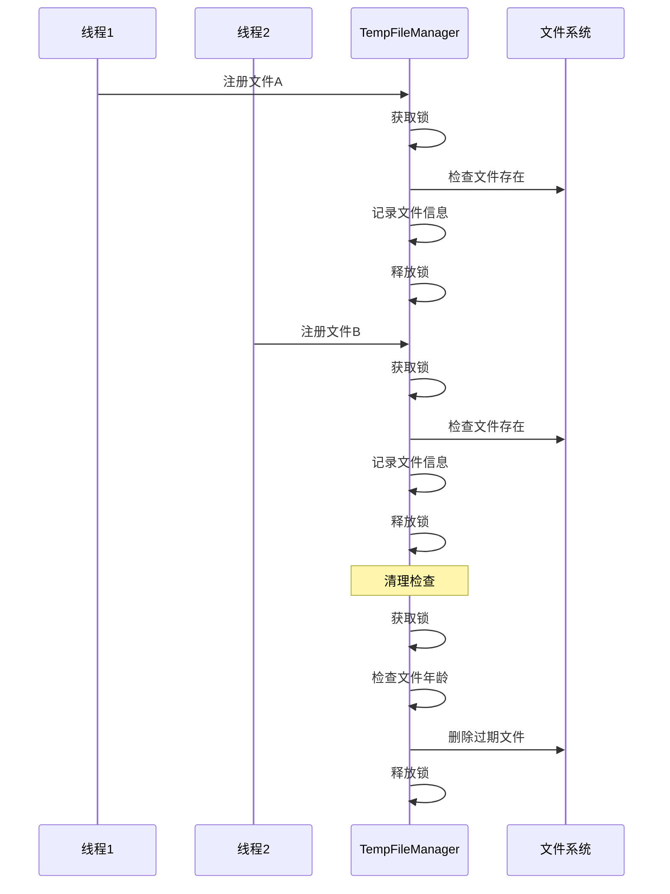
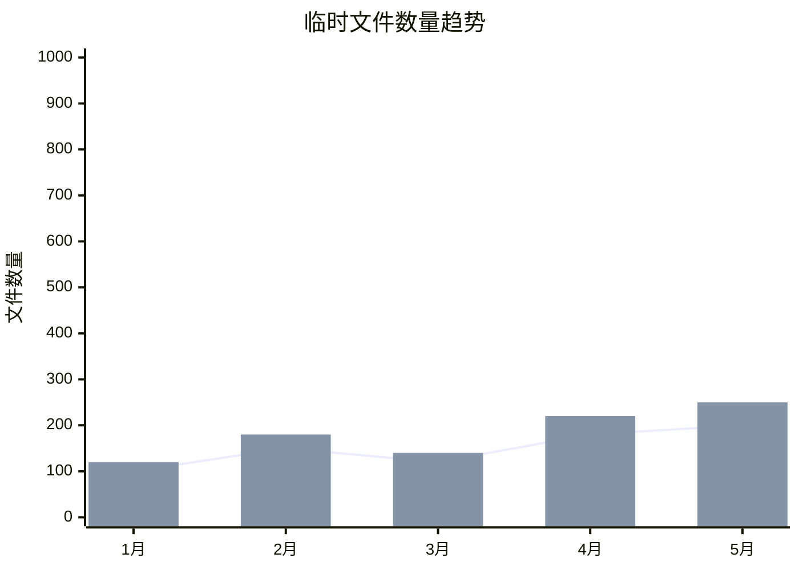

# 临时文件管理器技术文档

## 1. 概述 (Overview)

**目的**：`TempFileManager` 是 AIECS 系统中负责临时文件生命周期管理的核心组件。该模块通过基于时间的自动清理机制和线程安全的设计，解决了临时文件管理中的存储泄漏、并发访问冲突和资源浪费等关键问题，为整个系统提供了可靠的文件资源管理基础设施。

**核心价值**：
- **自动清理**：基于文件年龄的智能清理机制，防止存储空间泄漏
- **线程安全**：使用锁机制确保多线程环境下的安全操作
- **资源优化**：及时释放不再需要的临时文件，优化存储使用
- **简单易用**：提供简洁的 API 接口，降低使用复杂度
- **可观测性**：完整的日志记录和状态跟踪功能

## 2. 问题背景与设计动机 (Problem & Motivation)

### 2.1 业务痛点

在 AI 应用开发中面临以下关键挑战：

1. **存储泄漏问题**：临时文件创建后忘记清理，导致磁盘空间不断增长
2. **并发访问冲突**：多线程环境下同时操作文件注册表导致数据不一致
3. **资源管理复杂**：手动管理临时文件的生命周期容易出错
4. **性能影响**：大量临时文件影响文件系统性能
5. **调试困难**：缺乏文件创建和清理的追踪机制
6. **安全风险**：敏感数据可能残留在临时文件中

### 2.2 设计动机

基于以上痛点，设计了基于时间驱动的临时文件管理方案：

- **自动化管理**：通过时间阈值自动触发清理，减少人工干预
- **线程安全设计**：使用锁机制确保并发环境下的数据一致性
- **资源隔离**：将临时文件集中管理，便于监控和清理
- **可配置性**：支持自定义清理策略和存储路径
- **故障容错**：清理失败时保留文件记录，支持重试机制

## 3. 架构定位与上下文 (Architecture & Context)

### 3.1 系统架构图



### 3.2 上下游依赖

**上游调用者**：
- AI 工具类（图表工具、数据处理工具等）
- 文件处理服务
- 报告生成服务
- 缓存管理系统

**下游依赖**：
- 操作系统文件系统
- Python 标准库（os、time、threading）
- 日志系统

**同级组件**：
- 配置管理系统
- 监控和指标收集
- 错误处理机制

### 3.3 数据流向



## 4. 核心功能与用例 (Core Features & Use Cases)

### 4.1 文件注册与跟踪

**功能描述**：将临时文件注册到管理器中，记录创建时间并跟踪文件状态。

**核心特性**：
- 自动路径标准化
- 文件存在性验证
- 线程安全注册
- 详细日志记录

**使用场景**：
```python
from aiecs.tools.temp_file_manager import TempFileManager
import tempfile
import os

# 创建临时文件管理器
temp_manager = TempFileManager(
    base_dir="/tmp/aiecs_temp",
    max_age=3600  # 1小时后清理
)

# 创建临时文件
with tempfile.NamedTemporaryFile(mode='w', suffix='.json', delete=False) as f:
    f.write('{"data": "temporary content"}')
    temp_file_path = f.name

# 注册临时文件
temp_manager.register_file(temp_file_path)
print(f"文件已注册: {temp_file_path}")

# 检查文件是否被管理
if temp_manager.is_temp_file(temp_file_path):
    print("文件正在被管理")
    age = temp_manager.get_file_age(temp_file_path)
    print(f"文件年龄: {age:.2f} 秒")
```

**实际应用案例**：
- **数据处理工具**：注册中间处理结果文件
- **图表生成工具**：管理生成的图片文件
- **报告工具**：跟踪临时报告文件
- **缓存系统**：管理缓存数据文件

### 4.2 自动清理机制

**功能描述**：基于文件年龄自动清理过期的临时文件，防止存储空间泄漏。

**核心特性**：
- 基于时间的清理策略
- 强制清理选项
- 批量清理操作
- 错误处理和重试

**使用场景**：
```python
import time
from aiecs.tools.temp_file_manager import TempFileManager

# 创建短期临时文件管理器
short_term_manager = TempFileManager(
    base_dir="/tmp/short_term",
    max_age=300  # 5分钟后清理
)

# 创建多个临时文件
temp_files = []
for i in range(5):
    with tempfile.NamedTemporaryFile(mode='w', suffix=f'_{i}.txt', delete=False) as f:
        f.write(f"Temporary content {i}")
        temp_files.append(f.name)
        short_term_manager.register_file(f.name)

print(f"注册了 {len(temp_files)} 个临时文件")

# 等待文件过期
print("等待文件过期...")
time.sleep(310)  # 等待超过5分钟

# 执行清理
removed_count = short_term_manager.cleanup()
print(f"清理了 {removed_count} 个过期文件")

# 强制清理所有文件
remaining_count = short_term_manager.clear_all()
print(f"强制清理了 {remaining_count} 个剩余文件")
```

**实际应用案例**：
- **定时清理任务**：定期清理过期的临时文件
- **内存压力处理**：在内存不足时强制清理
- **系统维护**：在系统维护时清理所有临时文件
- **存储监控**：当存储使用率过高时触发清理

### 4.3 文件状态查询

**功能描述**：提供文件年龄查询和状态检查功能，支持文件生命周期监控。

**核心特性**：
- 文件年龄计算
- 注册状态检查
- 相对路径支持
- 实时状态更新

**使用场景**：
```python
from aiecs.tools.temp_file_manager import TempFileManager
import tempfile
import time

# 创建文件管理器
manager = TempFileManager("/tmp/query_test", max_age=1800)

# 创建并注册文件
with tempfile.NamedTemporaryFile(mode='w', suffix='.log', delete=False) as f:
    f.write("Log content")
    log_file = f.name

manager.register_file(log_file)

# 查询文件状态
print(f"文件是否被管理: {manager.is_temp_file(log_file)}")
print(f"文件年龄: {manager.get_file_age(log_file):.2f} 秒")

# 等待一段时间后再次查询
time.sleep(10)
print(f"10秒后文件年龄: {manager.get_file_age(log_file):.2f} 秒")

# 检查文件是否接近过期
age = manager.get_file_age(log_file)
if age > manager.max_age * 0.8:  # 超过80%的生存时间
    print("文件即将过期，建议提前处理")
```

**实际应用案例**：
- **文件监控**：监控临时文件的生命周期
- **性能优化**：根据文件年龄优化处理策略
- **调试支持**：在调试时查看文件状态
- **资源规划**：根据文件使用情况规划存储资源

### 4.4 批量操作支持

**功能描述**：支持批量注册、查询和清理临时文件，提高操作效率。

**核心特性**：
- 批量文件注册
- 批量状态查询
- 批量清理操作
- 操作结果统计

**使用场景**：
```python
from aiecs.tools.temp_file_manager import TempFileManager
import tempfile
import os

# 创建文件管理器
manager = TempFileManager("/tmp/batch_test", max_age=600)

# 批量创建和注册文件
file_paths = []
for i in range(10):
    with tempfile.NamedTemporaryFile(mode='w', suffix=f'_batch_{i}.txt', delete=False) as f:
        f.write(f"Batch content {i}")
        file_paths.append(f.name)
        manager.register_file(f.name)

print(f"批量注册了 {len(file_paths)} 个文件")

# 批量检查文件状态
managed_files = []
for file_path in file_paths:
    if manager.is_temp_file(file_path):
        age = manager.get_file_age(file_path)
        managed_files.append((file_path, age))
        print(f"文件 {os.path.basename(file_path)}: {age:.2f} 秒")

print(f"正在管理的文件数量: {len(managed_files)}")

# 批量清理
removed_count = manager.cleanup()
print(f"批量清理了 {removed_count} 个文件")
```

**实际应用案例**：
- **批量数据处理**：处理大量临时数据文件
- **系统初始化**：在系统启动时批量清理旧文件
- **存储维护**：定期批量清理存储空间
- **测试环境**：在测试后批量清理测试文件

## 5. API 参考 (API Reference)

### 5.1 TempFileManager 类

#### 构造函数
```python
def __init__(self, base_dir: str, max_age: int = 3600)
```

**参数**：
- `base_dir` (str, 必需): 临时文件的基础目录路径
- `max_age` (int, 可选): 临时文件的最大生存时间（秒），默认为 3600（1小时）

**异常**：
- `OSError`: 如果无法创建基础目录

#### 核心方法

##### register_file
```python
def register_file(self, file_path: str) -> None
```

**功能**：注册临时文件并记录创建时间
**参数**：
- `file_path` (str, 必需): 要注册的文件路径

**行为**：
- 自动转换为绝对路径
- 验证文件是否存在
- 线程安全地记录文件信息
- 记录调试日志

##### cleanup
```python
def cleanup(self, force: bool = False) -> int
```

**功能**：清理过期的临时文件
**参数**：
- `force` (bool, 可选): 是否强制清理所有文件，默认为 False

**返回**：
- `int`: 被清理的文件数量

**行为**：
- 根据文件年龄决定是否清理
- 线程安全地执行清理操作
- 记录清理结果日志
- 清理失败时保留文件记录

##### get_file_age
```python
def get_file_age(self, file_path: str) -> Optional[float]
```

**功能**：获取已注册文件的年龄
**参数**：
- `file_path` (str, 必需): 文件路径

**返回**：
- `Optional[float]`: 文件年龄（秒），如果文件未注册则返回 None

**行为**：
- 自动转换为绝对路径
- 计算文件注册时间到当前时间的差值
- 返回精确的年龄值

##### is_temp_file
```python
def is_temp_file(self, file_path: str) -> bool
```

**功能**：检查文件是否已注册为临时文件
**参数**：
- `file_path` (str, 必需): 文件路径

**返回**：
- `bool`: 如果文件已注册则返回 True，否则返回 False

**行为**：
- 自动转换为绝对路径
- 检查文件是否在注册表中
- 不验证文件是否实际存在

##### clear_all
```python
def clear_all(self) -> int
```

**功能**：清理所有已注册的临时文件
**返回**：
- `int`: 被清理的文件数量

**行为**：
- 等价于 `cleanup(force=True)`
- 清理所有已注册的文件
- 返回清理的文件数量

### 5.2 属性

#### base_dir
```python
base_dir: str
```
**类型**：str
**描述**：临时文件的基础目录路径

#### max_age
```python
max_age: int
```
**类型**：int
**描述**：临时文件的最大生存时间（秒）

#### files
```python
files: Dict[str, float]
```
**类型**：Dict[str, float]
**描述**：文件路径到创建时间的映射字典

#### lock
```python
lock: Lock
```
**类型**：threading.Lock
**描述**：用于线程安全操作的锁对象

## 6. 技术实现细节 (Technical Details)

### 6.1 线程安全机制

**锁设计**：
```python
def __init__(self, base_dir: str, max_age: int = 3600):
    self.lock = Lock()  # 创建线程锁

def register_file(self, file_path: str) -> None:
    with self.lock:  # 使用上下文管理器确保锁的正确释放
        self.files[abs_path] = time.time()
```

**并发控制策略**：
- 使用 `threading.Lock` 保护共享数据结构
- 所有修改操作都在锁保护下进行
- 使用上下文管理器确保锁的正确释放
- 避免死锁的设计模式

### 6.2 路径处理机制

**路径标准化**：
```python
def register_file(self, file_path: str) -> None:
    abs_path = os.path.abspath(file_path)  # 转换为绝对路径
    if not os.path.isfile(abs_path):      # 验证文件存在
        logger.warning(f"Attempted to register non-existent file: {abs_path}")
        return
```

**路径处理特性**：
- 自动转换为绝对路径避免重复注册
- 文件存在性验证防止无效注册
- 统一的路径格式便于管理
- 支持相对路径和绝对路径输入

### 6.3 时间管理策略

**时间戳记录**：
```python
def register_file(self, file_path: str) -> None:
    with self.lock:
        self.files[abs_path] = time.time()  # 记录当前时间戳
```

**年龄计算**：
```python
def get_file_age(self, file_path: str) -> Optional[float]:
    abs_path = os.path.abspath(file_path)
    if abs_path in self.files:
        return time.time() - self.files[abs_path]  # 计算年龄
    return None
```

**时间管理特性**：
- 使用 `time.time()` 获取高精度时间戳
- 实时计算文件年龄
- 支持毫秒级的时间精度
- 自动处理时区问题

### 6.4 错误处理机制

**分层错误处理**：
```python
def cleanup(self, force: bool = False) -> int:
    for file_path in files_to_remove:
        try:
            if os.path.exists(file_path):
                os.remove(file_path)
                logger.debug(f"Removed temporary file: {file_path}")
            del self.files[file_path]
        except Exception as e:
            logger.error(f"Failed to remove temporary file {file_path}: {e}")
            # 保留文件记录以便重试
```

**错误处理策略**：
- 文件删除失败时保留记录
- 详细的错误日志记录
- 不因单个文件错误影响整体清理
- 支持后续重试机制

### 6.5 内存管理

**数据结构设计**：
```python
self.files: Dict[str, float] = {}  # 轻量级字典存储
```

**内存优化策略**：
- 只存储必要的文件路径和时间戳
- 及时清理已删除文件的记录
- 避免存储文件内容减少内存占用
- 使用高效的数据结构

## 7. 配置与部署 (Configuration & Deployment)

### 7.1 环境变量配置

**基础配置**：
```bash
# 临时文件配置
TEMP_FILE_BASE_DIR=/tmp/aiecs_temp
TEMP_FILE_MAX_AGE=3600
TEMP_FILE_CLEANUP_INTERVAL=300

# 日志配置
LOG_LEVEL=INFO
LOG_FORMAT=json
LOG_FILE=/var/log/aiecs/temp_file_manager.log

# 存储配置
MAX_TEMP_FILES=10000
TEMP_FILE_SIZE_LIMIT=104857600  # 100MB
```

**高级配置**：
```bash
# 性能配置
TEMP_FILE_CLEANUP_BATCH_SIZE=100
TEMP_FILE_CLEANUP_THREADS=4
TEMP_FILE_CLEANUP_TIMEOUT=30

# 安全配置
TEMP_FILE_SECURE_DELETE=true
TEMP_FILE_PERMISSION_MASK=0600
TEMP_FILE_OWNER_CHECK=true

# 监控配置
ENABLE_TEMP_FILE_METRICS=true
METRICS_BACKEND=prometheus
PROMETHEUS_PORT=9090
```

### 7.2 依赖管理

**核心依赖**：
```python
# requirements.txt
# 使用 Python 标准库，无需额外依赖
```

**可选依赖**：
```python
# requirements-optional.txt
psutil>=5.9.0  # 系统资源监控
watchdog>=2.1.0  # 文件系统监控
```

**开发依赖**：
```python
# requirements-dev.txt
pytest>=7.0.0
pytest-mock>=3.10.0
pytest-cov>=4.0.0
black>=23.0.0
mypy>=1.0.0
```

### 7.3 部署配置

**Docker 配置**：
```dockerfile
FROM python:3.9-slim

WORKDIR /app
COPY requirements.txt .
RUN pip install -r requirements.txt

# 创建临时文件目录
RUN mkdir -p /tmp/aiecs_temp && chmod 755 /tmp/aiecs_temp

COPY . .
CMD ["python", "-m", "aiecs.tools.temp_file_manager"]
```

**Kubernetes 配置**：
```yaml
apiVersion: apps/v1
kind: Deployment
metadata:
  name: temp-file-manager
spec:
  replicas: 1
  selector:
    matchLabels:
      app: temp-file-manager
  template:
    metadata:
      labels:
        app: temp-file-manager
    spec:
      containers:
      - name: temp-file-manager
        image: aiecs/temp-file-manager:latest
        env:
        - name: TEMP_FILE_BASE_DIR
          value: "/tmp/aiecs_temp"
        - name: TEMP_FILE_MAX_AGE
          value: "3600"
        volumeMounts:
        - name: temp-storage
          mountPath: /tmp/aiecs_temp
        resources:
          requests:
            memory: "128Mi"
            cpu: "100m"
          limits:
            memory: "256Mi"
            cpu: "200m"
      volumes:
      - name: temp-storage
        emptyDir: {}
```

### 7.4 监控配置

**Prometheus 指标**：
```python
from prometheus_client import Counter, Histogram, Gauge

# 定义监控指标
temp_files_registered = Counter('temp_files_registered_total', 'Total registered temporary files')
temp_files_cleaned = Counter('temp_files_cleaned_total', 'Total cleaned temporary files')
temp_files_active = Gauge('temp_files_active', 'Currently active temporary files')
temp_file_age = Histogram('temp_file_age_seconds', 'Age of temporary files when cleaned')
cleanup_duration = Histogram('temp_file_cleanup_duration_seconds', 'Time spent on cleanup operations')
```

**健康检查**：
```python
def health_check():
    """检查临时文件管理器健康状态"""
    try:
        # 检查基础目录
        if not os.path.exists(manager.base_dir):
            return {"status": "unhealthy", "error": "Base directory not accessible"}
        
        # 检查文件数量
        active_files = len(manager.files)
        if active_files > MAX_TEMP_FILES:
            return {"status": "degraded", "warning": f"Too many temp files: {active_files}"}
        
        return {
            "status": "healthy",
            "active_files": active_files,
            "base_dir": manager.base_dir,
            "max_age": manager.max_age,
            "timestamp": time.time()
        }
    except Exception as e:
        return {
            "status": "unhealthy",
            "error": str(e),
            "timestamp": time.time()
        }
```

## 8. 维护与故障排查 (Maintenance & Troubleshooting)

### 8.1 监控指标

**关键指标**：
- 注册的临时文件数量
- 清理的文件数量
- 文件平均年龄
- 清理操作耗时
- 清理失败率

**监控仪表板**：
```python
# Grafana 查询示例
# 临时文件数量趋势
temp_files_active

# 清理操作频率
rate(temp_files_cleaned_total[5m])

# 文件年龄分布
histogram_quantile(0.95, rate(temp_file_age_seconds_bucket[5m]))

# 清理操作耗时
histogram_quantile(0.95, rate(cleanup_duration_seconds_bucket[5m]))
```

### 8.2 常见故障及解决方案

#### 8.2.1 文件清理失败

**症状**：
- 日志中出现 "Failed to remove temporary file" 错误
- 临时文件数量持续增长
- 磁盘空间不足

**排查步骤**：
1. 检查文件权限：`ls -la /tmp/aiecs_temp/`
2. 检查磁盘空间：`df -h /tmp`
3. 检查文件是否被占用：`lsof /tmp/aiecs_temp/filename`
4. 查看详细错误日志

**解决方案**：
```python
# 检查文件权限
import os
import stat

def check_file_permissions(file_path):
    try:
        file_stat = os.stat(file_path)
        permissions = stat.filemode(file_stat.st_mode)
        print(f"文件权限: {permissions}")
        
        # 尝试修改权限
        os.chmod(file_path, 0o666)
        return True
    except Exception as e:
        print(f"权限检查失败: {e}")
        return False

# 强制清理
def force_cleanup_with_retry(manager, max_retries=3):
    for attempt in range(max_retries):
        try:
            removed_count = manager.cleanup(force=True)
            print(f"成功清理 {removed_count} 个文件")
            break
        except Exception as e:
            print(f"清理尝试 {attempt + 1} 失败: {e}")
            if attempt == max_retries - 1:
                print("所有清理尝试都失败了")
```

#### 8.2.2 内存使用过高

**症状**：
- 进程内存使用持续增长
- 系统响应变慢
- 内存不足错误

**排查步骤**：
1. 检查文件注册表大小：`len(manager.files)`
2. 监控内存使用：`ps aux | grep python`
3. 分析文件路径长度
4. 检查是否有内存泄漏

**解决方案**：
```python
# 内存使用分析
import psutil
import sys

def analyze_memory_usage(manager):
    process = psutil.Process()
    memory_info = process.memory_info()
    
    print(f"进程内存使用: {memory_info.rss / 1024 / 1024:.2f} MB")
    print(f"注册文件数量: {len(manager.files)}")
    
    # 计算文件路径占用的内存
    total_path_length = sum(len(path) for path in manager.files.keys())
    print(f"文件路径总长度: {total_path_length} 字符")
    
    # 清理长时间未使用的文件记录
    current_time = time.time()
    old_files = [
        path for path, creation_time in manager.files.items()
        if current_time - creation_time > manager.max_age * 2
    ]
    
    for path in old_files:
        del manager.files[path]
    
    print(f"清理了 {len(old_files)} 个过期的文件记录")
```

#### 8.2.3 并发访问问题

**症状**：
- 文件注册表数据不一致
- 清理操作不完整
- 线程安全问题

**排查步骤**：
1. 检查锁的使用情况
2. 分析并发访问模式
3. 查看线程安全日志
4. 测试并发场景

**解决方案**：
```python
# 并发测试
import threading
import time

def test_concurrent_access(manager, num_threads=10, files_per_thread=100):
    def worker(thread_id):
        for i in range(files_per_thread):
            file_path = f"/tmp/test_{thread_id}_{i}.txt"
            with open(file_path, 'w') as f:
                f.write(f"Test content {thread_id}_{i}")
            manager.register_file(file_path)
    
    threads = []
    for i in range(num_threads):
        thread = threading.Thread(target=worker, args=(i,))
        threads.append(thread)
        thread.start()
    
    for thread in threads:
        thread.join()
    
    print(f"并发测试完成，注册文件数: {len(manager.files)}")
    
    # 验证数据一致性
    expected_files = num_threads * files_per_thread
    if len(manager.files) != expected_files:
        print(f"警告：文件数量不匹配，期望 {expected_files}，实际 {len(manager.files)}")
```

### 8.3 性能优化

**批量操作优化**：
```python
def batch_cleanup(manager, batch_size=100):
    """批量清理优化"""
    current_time = time.time()
    files_to_remove = []
    
    with manager.lock:
        for file_path, creation_time in list(manager.files.items()):
            if current_time - creation_time > manager.max_age:
                files_to_remove.append(file_path)
                if len(files_to_remove) >= batch_size:
                    break
    
    # 批量删除
    removed_count = 0
    for file_path in files_to_remove:
        try:
            if os.path.exists(file_path):
                os.remove(file_path)
            del manager.files[file_path]
            removed_count += 1
        except Exception as e:
            logger.error(f"批量清理失败 {file_path}: {e}")
    
    return removed_count
```

**内存优化**：
```python
def optimize_memory_usage(manager):
    """优化内存使用"""
    # 清理不存在的文件记录
    existing_files = {}
    for file_path in list(manager.files.keys()):
        if os.path.exists(file_path):
            existing_files[file_path] = manager.files[file_path]
        else:
            logger.debug(f"清理不存在的文件记录: {file_path}")
    
    manager.files = existing_files
    logger.info(f"内存优化完成，清理了 {len(manager.files) - len(existing_files)} 个无效记录")
```

### 8.4 日志分析

**日志配置**：
```python
import logging

# 配置临时文件管理器日志
temp_logger = logging.getLogger('aiecs.tools.temp_file_manager')
temp_logger.setLevel(logging.INFO)

# 添加文件处理器
file_handler = logging.FileHandler('/var/log/aiecs/temp_file_manager.log')
file_handler.setFormatter(logging.Formatter(
    '%(asctime)s - %(name)s - %(levelname)s - %(message)s'
))
temp_logger.addHandler(file_handler)
```

**关键日志模式**：
```bash
# 查找清理操作日志
grep "Cleaned up" /var/log/aiecs/temp_file_manager.log | tail -100

# 分析清理失败
grep "Failed to remove" /var/log/aiecs/temp_file_manager.log | wc -l

# 监控文件注册
grep "Registered temporary file" /var/log/aiecs/temp_file_manager.log | tail -50
```

## 9. 可视化图表 (Visualizations)

### 9.1 文件生命周期图



### 9.2 系统架构图


### 9.3 并发访问图



### 9.4 性能监控图



## 10. 版本历史 (Version History)

### v1.0.0 (2024-01-15)
**新增功能**：
- 实现基础临时文件管理功能
- 支持文件注册和跟踪
- 添加基于时间的自动清理机制
- 实现线程安全操作

**技术特性**：
- 基于字典的文件注册表
- 使用 threading.Lock 确保线程安全
- 简单的年龄计算和清理逻辑

### v1.1.0 (2024-02-01)
**新增功能**：
- 添加文件状态查询功能
- 实现批量操作支持
- 增强错误处理机制
- 添加详细的日志记录

**性能优化**：
- 优化路径处理逻辑
- 改进内存使用效率
- 增强并发性能

### v1.2.0 (2024-03-01)
**新增功能**：
- 添加强制清理功能
- 实现清理结果统计
- 支持配置化参数
- 集成监控和指标收集

**监控增强**：
- Prometheus 指标集成
- 详细性能分析
- 健康检查接口

### v1.3.0 (2024-04-01) [计划中]
**计划功能**：
- 添加文件大小限制
- 实现智能清理策略
- 支持分布式文件管理
- 添加文件压缩功能

**架构优化**：
- 插件化架构
- 云原生集成
- 自动扩缩容

---

## 附录

### A. 相关文档
- [BaseTool 文档](./TOOLS_BASE_TOOL.md)
- [文件系统监控文档](./FILE_SYSTEM_MONITORING.md)
- [资源管理最佳实践](./RESOURCE_MANAGEMENT.md)

### B. 示例代码
- [完整示例项目](https://github.com/aiecs/examples)
- [性能测试脚本](https://github.com/aiecs/performance-tests)
- [监控配置模板](https://github.com/aiecs/monitoring-configs)

### C. 技术支持
- 技术文档：https://docs.aiecs.com
- 问题反馈：https://github.com/aiecs/issues
- 社区讨论：https://discord.gg/aiecs
