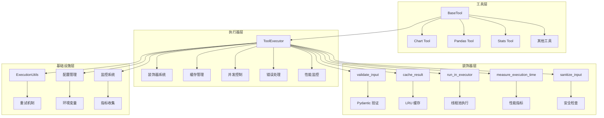
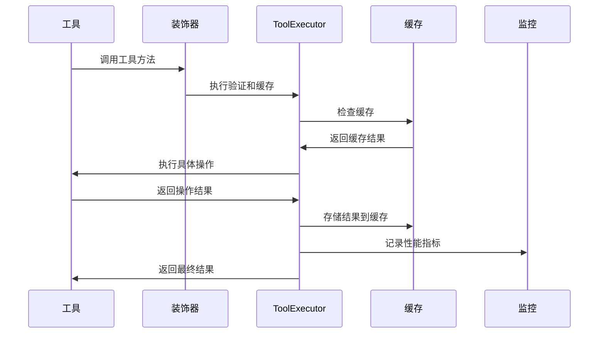
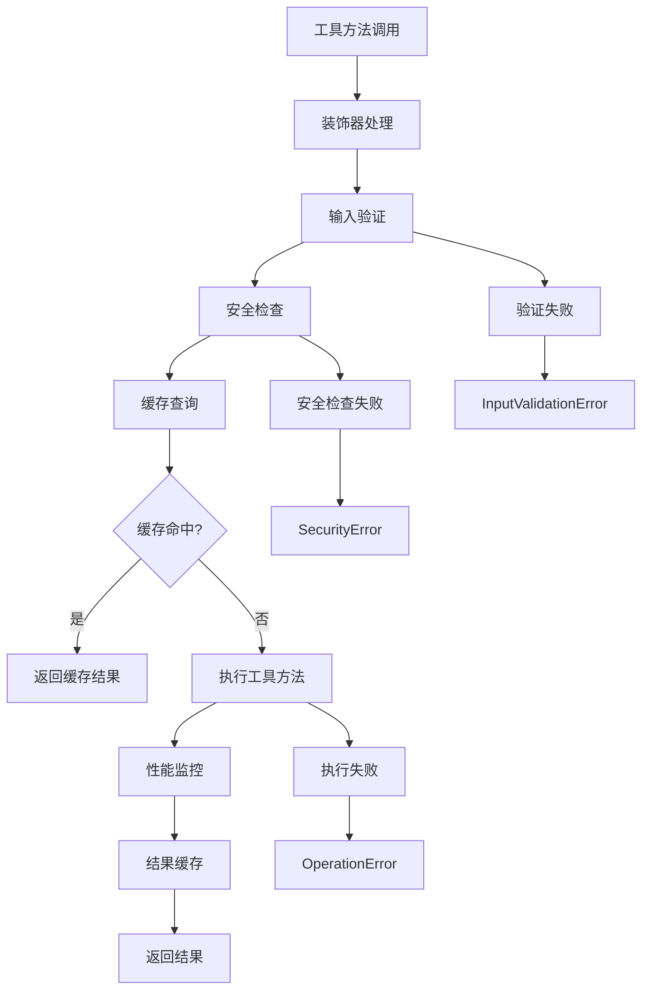
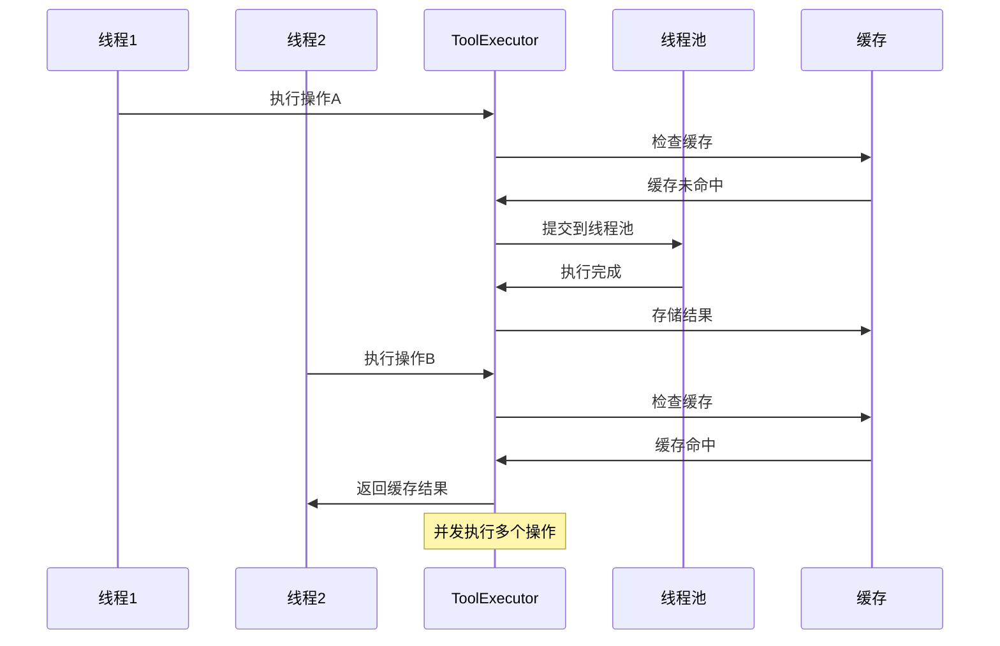
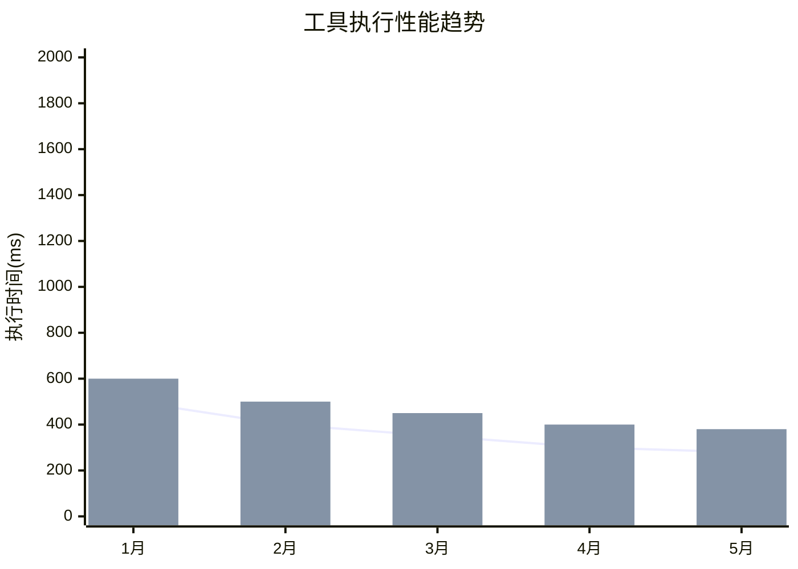

# 工具执行器技术文档

## 1. 概述 (Overview)

**目的**：`ToolExecutor` 是 AIECS 系统中负责工具操作执行的核心引擎，提供统一的工具执行框架和横切关注点处理。该组件通过装饰器模式、缓存机制、并发控制和错误处理，解决了工具开发中的重复代码、性能瓶颈、安全风险和可维护性问题，为整个工具生态系统提供了可靠的基础设施。

**核心价值**：
- **统一执行框架**：提供标准化的工具操作执行接口
- **性能优化**：集成智能缓存和并发控制机制
- **安全防护**：内置输入验证和安全检查机制
- **可观测性**：完整的指标收集和日志记录
- **高可用性**：重试机制和超时控制确保系统稳定性

## 2. 问题背景与设计动机 (Problem & Motivation)

### 2.1 业务痛点

在工具系统开发中面临以下关键挑战：

1. **重复代码问题**：每个工具都需要实现缓存、验证、错误处理等通用逻辑
2. **性能瓶颈**：缺乏统一的性能优化策略，工具执行效率低下
3. **安全风险**：缺乏统一的输入验证和安全检查机制
4. **并发问题**：多线程环境下的资源竞争和死锁风险
5. **可维护性差**：通用逻辑分散在各个工具中，难以统一维护
6. **监控缺失**：缺乏统一的性能监控和错误追踪机制

### 2.2 设计动机

基于以上痛点，设计了基于执行器模式的统一框架：

- **横切关注点分离**：将通用逻辑抽象为装饰器和执行器
- **性能优先设计**：集成缓存、并发控制和性能监控
- **安全优先策略**：内置多层安全检查和输入验证
- **可观测性导向**：提供完整的指标收集和日志记录
- **高可用性保障**：重试机制和超时控制确保系统稳定

## 3. 架构定位与上下文 (Architecture & Context)

### 3.1 系统架构图



### 3.2 上下游依赖

**上游调用者**：
- BaseTool 及其子类
- 工具注册中心
- AI 代理系统
- 任务执行器

**下游依赖**：
- ExecutionUtils（执行工具类）
- Pydantic（数据验证）
- cachetools（缓存管理）
- ThreadPoolExecutor（并发控制）
- 日志和监控系统

**同级组件**：
- 配置管理系统
- 安全模块
- 监控和指标收集

### 3.3 数据流向



## 4. 核心功能与用例 (Core Features & Use Cases)

### 4.1 装饰器系统

**功能描述**：通过装饰器模式实现横切关注点的分离，提供输入验证、缓存、并发控制等功能。

**核心特性**：
- 输入验证装饰器
- 结果缓存装饰器
- 并发执行装饰器
- 性能监控装饰器
- 安全检查装饰器

**使用场景**：
```python
from aiecs.tools.tool_executor import (
    validate_input, cache_result, run_in_executor,
    measure_execution_time, sanitize_input
)
from aiecs.tools.base_tool import BaseTool
from pydantic import BaseModel
import time

class DataTool(BaseTool):
    class ProcessSchema(BaseModel):
        data: str
        algorithm: str = "default"
        user_id: str
        task_id: str

    @validate_input(ProcessSchema)
    @cache_result(ttl=3600)
    @run_in_executor
    @measure_execution_time
    @sanitize_input
    def process_data(self, data: str, algorithm: str = "default", user_id: str = "", task_id: str = ""):
        """处理数据并应用装饰器功能"""
        # 模拟复杂的数据处理
        time.sleep(2)
        return f"Processed {data} with {algorithm}"

# 使用示例
tool = DataTool()
result = tool.process_data(
    data="test data",
    algorithm="advanced",
    user_id="user_123",
    task_id="task_456"
)
print(f"处理结果: {result}")
```

**实际应用案例**：
- **数据处理工具**：自动验证输入参数和缓存结果
- **API 调用工具**：自动重试和超时控制
- **文件处理工具**：自动安全检查和性能监控
- **AI 推理工具**：自动缓存和并发优化

### 4.2 智能缓存系统

**功能描述**：基于内容哈希的智能缓存机制，支持 TTL 和 LRU 策略，显著提升工具执行性能。

**核心特性**：
- 内容感知的缓存键生成
- 可配置的 TTL 和缓存大小
- 用户和任务级别的缓存隔离
- 自动缓存失效和清理

**使用场景**：
```python
from aiecs.tools.tool_executor import ToolExecutor, cache_result
from aiecs.tools.base_tool import BaseTool
import time

class ExpensiveTool(BaseTool):
    @cache_result(ttl=1800)  # 缓存30分钟
    def expensive_calculation(self, n: int, user_id: str = "", task_id: str = ""):
        """模拟昂贵的计算操作"""
        print(f"执行昂贵计算: n={n}")
        time.sleep(3)  # 模拟耗时操作
        return sum(i ** 2 for i in range(n))

# 创建执行器
executor = ToolExecutor({
    'enable_cache': True,
    'cache_size': 1000,
    'cache_ttl': 3600
})

tool = ExpensiveTool()
tool._executor = executor

# 第一次调用，会执行并缓存
start = time.time()
result1 = tool.expensive_calculation(10000, user_id="user_123", task_id="task_456")
print(f"第一次调用耗时: {time.time() - start:.2f}秒")

# 第二次调用，从缓存返回
start = time.time()
result2 = tool.expensive_calculation(10000, user_id="user_123", task_id="task_456")
print(f"第二次调用耗时: {time.time() - start:.2f}秒")
print(f"结果相同: {result1 == result2}")

# 不同用户/任务的调用不会命中缓存
result3 = tool.expensive_calculation(10000, user_id="user_456", task_id="task_789")
print(f"不同用户调用: {result3}")
```

**实际应用案例**：
- **API 调用工具**：缓存外部 API 响应
- **文件处理工具**：缓存文件处理结果
- **AI 模型工具**：缓存模型推理结果
- **数据查询工具**：缓存数据库查询结果

### 4.3 并发控制机制

**功能描述**：通过线程池和异步执行机制，实现高效的并发处理，提升系统吞吐量。

**核心特性**：
- 动态线程池管理
- 异步操作支持
- 资源锁机制
- 批量操作处理

**使用场景**：
```python
import asyncio
from aiecs.tools.tool_executor import ToolExecutor, run_in_executor
from aiecs.tools.base_tool import BaseTool

class ConcurrencyTool(BaseTool):
    def sync_operation(self, data: str, user_id: str = "", task_id: str = ""):
        """同步操作"""
        import time
        time.sleep(1)  # 模拟耗时操作
        return f"Sync processed: {data}"

    async def async_operation(self, data: str, user_id: str = "", task_id: str = ""):
        """异步操作"""
        await asyncio.sleep(1)  # 模拟异步操作
        return f"Async processed: {data}"

# 创建执行器
executor = ToolExecutor({
    'max_workers': 8,
    'io_concurrency': 16
})

tool = ConcurrencyTool()
tool._executor = executor

# 同步并发执行
async def test_concurrent_execution():
    # 批量执行同步操作
    operations = [
        {'op': 'sync_operation', 'kwargs': {'data': f'data_{i}', 'user_id': 'user_123', 'task_id': 'task_456'}}
        for i in range(10)
    ]
    
    results = await executor.execute_batch(tool, operations)
    print(f"批量执行结果: {len(results)} 个操作完成")
    
    # 混合执行同步和异步操作
    mixed_operations = [
        {'op': 'sync_operation', 'kwargs': {'data': 'sync_data', 'user_id': 'user_123', 'task_id': 'task_456'}},
        {'op': 'async_operation', 'kwargs': {'data': 'async_data', 'user_id': 'user_123', 'task_id': 'task_456'}}
    ]
    
    mixed_results = await executor.execute_batch(tool, mixed_operations)
    print(f"混合执行结果: {mixed_results}")

# 运行并发测试
asyncio.run(test_concurrent_execution())
```

**实际应用案例**：
- **批量文件处理**：并行处理多个文件
- **API 聚合工具**：并发调用多个外部 API
- **数据同步工具**：异步同步大量数据
- **AI 推理工具**：批量处理 AI 模型推理

### 4.4 安全防护机制

**功能描述**：通过多层安全检查机制，防止注入攻击和恶意输入，确保系统安全。

**核心特性**：
- 输入参数验证
- SQL 注入防护
- 脚本注入检测
- 路径遍历防护
- 可配置安全策略

**使用场景**：
```python
from aiecs.tools.tool_executor import ToolExecutor, sanitize_input, SecurityError
from aiecs.tools.base_tool import BaseTool

class SecureTool(BaseTool):
    @sanitize_input
    def process_user_input(self, query: str, user_id: str = "", task_id: str = ""):
        """处理用户输入，自动进行安全检查"""
        return f"Processed query: {query}"

# 创建执行器
executor = ToolExecutor({
    'enable_security_checks': True
})

tool = SecureTool()
tool._executor = executor

# 正常输入
try:
    result = tool.process_user_input("正常查询", user_id="user_123", task_id="task_456")
    print(f"正常输入结果: {result}")
except SecurityError as e:
    print(f"安全检查失败: {e}")

# 恶意输入（会被阻止）
malicious_inputs = [
    "SELECT * FROM users; DROP TABLE users;",
    "'; DROP TABLE users; --",
    "<script>alert('xss')</script>",
    "../../etc/passwd"
]

for malicious_input in malicious_inputs:
    try:
        result = tool.process_user_input(malicious_input, user_id="user_123", task_id="task_456")
        print(f"恶意输入被处理: {result}")
    except SecurityError as e:
        print(f"恶意输入被阻止: {e}")
```

**实际应用案例**：
- **数据库工具**：防止 SQL 注入攻击
- **文件处理工具**：防止路径遍历攻击
- **Web 工具**：防止 XSS 和 CSRF 攻击
- **API 工具**：防止恶意参数注入

### 4.5 性能监控与指标收集

**功能描述**：自动收集工具执行的性能指标，提供详细的监控数据和性能分析。

**核心特性**：
- 执行时间统计
- 缓存命中率监控
- 错误率统计
- 并发性能分析
- 实时指标导出

**使用场景**：
```python
from aiecs.tools.tool_executor import ToolExecutor, measure_execution_time
import time

class MonitoredTool(BaseTool):
    @measure_execution_time
    def monitored_operation(self, data: str, user_id: str = "", task_id: str = ""):
        """被监控的操作"""
        time.sleep(0.5)  # 模拟操作
        return f"Processed: {data}"

# 创建执行器
executor = ToolExecutor({
    'log_execution_time': True,
    'enable_cache': True
})

tool = MonitoredTool()
tool._executor = executor

# 执行多个操作
for i in range(10):
    result = tool.monitored_operation(f"data_{i}", user_id="user_123", task_id="task_456")
    print(f"操作 {i}: {result}")

# 获取性能指标
metrics = executor.get_metrics()
print(f"性能指标: {metrics}")

# 输出示例：
# {
#     'requests': 10,
#     'failures': 0,
#     'cache_hits': 0,
#     'avg_processing_time': 0.5234
# }
```

**实际应用案例**：
- **性能分析**：分析工具执行性能瓶颈
- **容量规划**：根据性能指标规划系统容量
- **故障诊断**：通过指标快速定位问题
- **优化指导**：基于指标数据指导性能优化

## 5. API 参考 (API Reference)

### 5.1 ToolExecutor 类

#### 构造函数
```python
def __init__(self, config: Optional[Dict[str, Any]] = None)
```

**参数**：
- `config` (Dict[str, Any], 可选): 配置覆盖项

**异常**：
- `ValueError`: 如果配置无效

#### 核心方法

##### execute
```python
def execute(self, tool_instance: Any, operation: str, **kwargs) -> Any
```

**功能**：执行同步工具操作
**参数**：
- `tool_instance` (Any, 必需): 工具实例
- `operation` (str, 必需): 操作名称
- `**kwargs`: 操作参数

**返回**：操作结果
**异常**：
- `ToolExecutionError`: 操作执行失败
- `InputValidationError`: 输入参数无效
- `SecurityError`: 输入包含恶意内容

##### execute_async
```python
async def execute_async(self, tool_instance: Any, operation: str, **kwargs) -> Any
```

**功能**：执行异步工具操作
**参数**：与 `execute` 相同
**返回**：操作结果
**异常**：与 `execute` 相同

##### execute_batch
```python
async def execute_batch(self, tool_instance: Any, operations: List[Dict[str, Any]]) -> List[Any]
```

**功能**：并行执行多个工具操作
**参数**：
- `tool_instance` (Any, 必需): 工具实例
- `operations` (List[Dict[str, Any]], 必需): 操作列表，每个包含 'op' 和 'kwargs'

**返回**：操作结果列表
**异常**：
- `ToolExecutionError`: 任何操作失败
- `InputValidationError`: 输入参数无效

##### get_metrics
```python
def get_metrics(self) -> Dict[str, Any]
```

**功能**：获取当前执行器指标
**返回**：包含请求数、失败数、缓存命中数等指标的字典

##### get_lock
```python
def get_lock(self, resource_id: str) -> threading.Lock
```

**功能**：获取或创建特定资源的锁
**参数**：
- `resource_id` (str, 必需): 资源标识符

**返回**：资源的线程锁

### 5.2 装饰器函数

#### validate_input
```python
def validate_input(schema_class: Type[BaseModel]) -> Callable
```

**功能**：使用 Pydantic 模式验证输入
**参数**：
- `schema_class` (Type[BaseModel], 必需): Pydantic 模式类

**返回**：装饰后的函数
**异常**：
- `InputValidationError`: 输入验证失败

#### cache_result
```python
def cache_result(ttl: Optional[int] = None) -> Callable
```

**功能**：缓存函数结果
**参数**：
- `ttl` (Optional[int], 可选): 缓存生存时间（秒）

**返回**：装饰后的函数

#### run_in_executor
```python
def run_in_executor(func: Callable) -> Callable
```

**功能**：在线程池中运行同步函数
**参数**：
- `func` (Callable, 必需): 要执行的函数

**返回**：异步包装器

#### measure_execution_time
```python
def measure_execution_time(func: Callable) -> Callable
```

**功能**：测量和记录执行时间
**参数**：
- `func` (Callable, 必需): 要测量的函数

**返回**：装饰后的函数

#### sanitize_input
```python
def sanitize_input(func: Callable) -> Callable
```

**功能**：清理输入参数以增强安全性
**参数**：
- `func` (Callable, 必需): 要清理输入的函数

**返回**：装饰后的函数
**异常**：
- `SecurityError`: 输入包含恶意内容

### 5.3 异常类

#### ToolExecutionError
```python
class ToolExecutionError(Exception)
```
**功能**：所有工具执行错误的基类

#### InputValidationError
```python
class InputValidationError(ToolExecutionError)
```
**功能**：输入参数验证错误

#### SecurityError
```python
class SecurityError(ToolExecutionError)
```
**功能**：安全相关错误

#### OperationError
```python
class OperationError(ToolExecutionError)
```
**功能**：操作执行错误

#### TimeoutError
```python
class TimeoutError(ToolExecutionError)
```
**功能**：操作超时错误

### 5.4 配置类

#### ExecutorConfig
```python
class ExecutorConfig(BaseModel)
```

**属性**：
- `enable_cache` (bool): 启用结果缓存，默认 True
- `cache_size` (int): 最大缓存条目数，默认 100
- `cache_ttl` (int): 缓存生存时间（秒），默认 3600
- `max_workers` (int): 最大工作线程数，默认 4
- `io_concurrency` (int): 最大并发 I/O 操作数，默认 8
- `chunk_size` (int): 处理大数据的块大小，默认 10000
- `max_file_size` (int): 最大文件大小（字节），默认 1000000
- `log_level` (str): 日志级别，默认 "INFO"
- `log_execution_time` (bool): 记录执行时间，默认 True
- `enable_security_checks` (bool): 启用安全检查，默认 True
- `retry_attempts` (int): 重试次数，默认 3
- `retry_backoff` (float): 重试退避因子，默认 1.0
- `timeout` (int): 操作超时时间（秒），默认 30

## 6. 技术实现细节 (Technical Details)

### 6.1 装饰器模式实现

**设计原则**：
- 使用装饰器分离横切关注点
- 保持业务逻辑的纯净性
- 支持装饰器组合和链式调用

**实现机制**：
```python
def validate_input(schema_class: Type[BaseModel]) -> Callable:
    def decorator(func: Callable) -> Callable:
        @functools.wraps(func)
        def wrapper(self, *args, **kwargs):
            try:
                schema = schema_class(**kwargs)
                validated_kwargs = schema.dict(exclude_unset=True)
                return func(self, **validated_kwargs)
            except ValidationError as e:
                raise InputValidationError(f"Invalid input parameters: {e}")
        return wrapper
    return decorator
```

### 6.2 缓存键生成策略

**内容感知键生成**：
```python
def _get_cache_key(self, func_name: str, args: tuple, kwargs: Dict[str, Any]) -> str:
    user_id = kwargs.get("user_id", "anonymous")
    task_id = kwargs.get("task_id", "none")
    return self.execution_utils.generate_cache_key(func_name, user_id, task_id, args, kwargs)
```

**键生成特性**：
- 包含用户 ID 和任务 ID 实现隔离
- 基于参数内容生成哈希值
- 支持 TTL 和版本控制
- 避免键冲突和碰撞

### 6.3 并发控制机制

**线程池管理**：
```python
def __init__(self, config: Optional[Dict[str, Any]] = None):
    self._thread_pool = ThreadPoolExecutor(
        max_workers=max(os.cpu_count() or 4, self.config.max_workers)
    )
```

**并发策略**：
- 动态调整线程池大小
- 异步操作优先使用原生异步
- 同步操作在线程池中执行
- 资源锁避免竞态条件

### 6.4 安全防护机制

**多层安全检查**：
```python
def sanitize_input(func: Callable) -> Callable:
    @functools.wraps(func)
    def wrapper(self, *args, **kwargs):
        if not hasattr(self, '_executor') or not self._executor.config.enable_security_checks:
            return func(self, *args, **kwargs)
        sanitized_kwargs = {}
        for k, v in kwargs.items():
            if isinstance(v, str) and re.search(r'(\bSELECT\b|\bINSERT\b|--|;|/\*)', v, re.IGNORECASE):
                raise SecurityError(f"Input parameter '{k}' contains potentially malicious content")
            sanitized_kwargs[k] = v
        return func(self, *args, **sanitized_kwargs)
    return wrapper
```

**防护策略**：
- SQL 注入模式检测
- 脚本注入防护
- 路径遍历攻击防护
- 可扩展的安全规则

### 6.5 错误处理机制

**分层错误处理**：
```python
def execute(self, tool_instance: Any, operation: str, **kwargs) -> Any:
    try:
        # 执行逻辑
        result = method(**kwargs)
        return result
    except Exception as e:
        self._metrics.record_failure()
        logger.error(f"Error executing {tool_instance.__class__.__name__}.{operation}: {str(e)}", exc_info=True)
        raise OperationError(f"Error executing {operation}: {str(e)}") from e
```

**错误处理策略**：
- 记录详细的错误日志
- 维护错误统计指标
- 保持原始异常链
- 提供有意义的错误信息

### 6.6 性能监控机制

**指标收集**：
```python
class ExecutorMetrics:
    def __init__(self):
        self.requests: int = 0
        self.failures: int = 0
        self.cache_hits: int = 0
        self.processing_times: List[float] = []

    def record_request(self, processing_time: float):
        self.requests += 1
        self.processing_times.append(processing_time)
```

**监控特性**：
- 实时性能指标收集
- 历史数据统计分析
- 可配置的监控粒度
- 支持外部监控系统集成

## 7. 配置与部署 (Configuration & Deployment)

### 7.1 环境变量配置

**基础配置**：
```bash
# 工具执行器配置
TOOL_EXECUTOR_ENABLE_CACHE=true
TOOL_EXECUTOR_CACHE_SIZE=1000
TOOL_EXECUTOR_CACHE_TTL=3600
TOOL_EXECUTOR_MAX_WORKERS=8
TOOL_EXECUTOR_IO_CONCURRENCY=16
TOOL_EXECUTOR_CHUNK_SIZE=10000
TOOL_EXECUTOR_MAX_FILE_SIZE=10485760
TOOL_EXECUTOR_LOG_LEVEL=INFO
TOOL_EXECUTOR_LOG_EXECUTION_TIME=true
TOOL_EXECUTOR_ENABLE_SECURITY_CHECKS=true
TOOL_EXECUTOR_RETRY_ATTEMPTS=3
TOOL_EXECUTOR_RETRY_BACKOFF=1.0
TOOL_EXECUTOR_TIMEOUT=30
```

**高级配置**：
```bash
# 性能优化配置
TOOL_EXECUTOR_CACHE_BACKEND=redis
TOOL_EXECUTOR_CACHE_REDIS_URL=redis://localhost:6379/0
TOOL_EXECUTOR_CACHE_PREFIX=tool_cache
TOOL_EXECUTOR_THREAD_POOL_TYPE=process
TOOL_EXECUTOR_MAX_THREADS_PER_WORKER=4

# 安全配置
TOOL_EXECUTOR_SECURITY_LEVEL=high
TOOL_EXECUTOR_ALLOWED_FILE_EXTENSIONS=.txt,.json,.csv
TOOL_EXECUTOR_MAX_INPUT_SIZE=1048576
TOOL_EXECUTOR_SANITIZATION_RULES=strict

# 监控配置
ENABLE_TOOL_EXECUTOR_METRICS=true
METRICS_BACKEND=prometheus
PROMETHEUS_PORT=9090
TOOL_EXECUTOR_METRICS_INTERVAL=60
```

### 7.2 依赖管理

**核心依赖**：
```python
# requirements.txt
pydantic>=2.0.0
cachetools>=5.3.0
asyncio-mqtt>=0.11.0
aiohttp>=3.8.0
```

**可选依赖**：
```python
# requirements-optional.txt
redis>=4.5.0  # Redis 缓存后端
psutil>=5.9.0  # 系统资源监控
prometheus-client>=0.16.0  # Prometheus 指标
```

**开发依赖**：
```python
# requirements-dev.txt
pytest>=7.0.0
pytest-asyncio>=0.21.0
pytest-mock>=3.10.0
black>=23.0.0
mypy>=1.0.0
```

### 7.3 部署配置

**Docker 配置**：
```dockerfile
FROM python:3.9-slim

WORKDIR /app
COPY requirements.txt .
RUN pip install -r requirements.txt

# 安装可选依赖
COPY requirements-optional.txt .
RUN pip install -r requirements-optional.txt

COPY . .
CMD ["python", "-m", "aiecs.tools.tool_executor"]
```

**Kubernetes 配置**：
```yaml
apiVersion: apps/v1
kind: Deployment
metadata:
  name: tool-executor
spec:
  replicas: 3
  selector:
    matchLabels:
      app: tool-executor
  template:
    metadata:
      labels:
        app: tool-executor
    spec:
      containers:
      - name: tool-executor
        image: aiecs/tool-executor:latest
        env:
        - name: TOOL_EXECUTOR_MAX_WORKERS
          value: "16"
        - name: TOOL_EXECUTOR_CACHE_SIZE
          value: "5000"
        - name: TOOL_EXECUTOR_CACHE_BACKEND
          value: "redis"
        - name: TOOL_EXECUTOR_CACHE_REDIS_URL
          value: "redis://redis-service:6379/0"
        resources:
          requests:
            memory: "1Gi"
            cpu: "500m"
          limits:
            memory: "2Gi"
            cpu: "1000m"
```

### 7.4 监控配置

**Prometheus 指标**：
```python
from prometheus_client import Counter, Histogram, Gauge

# 定义监控指标
tool_executions = Counter('tool_executions_total', 'Total tool executions', ['tool_name', 'operation', 'status'])
tool_duration = Histogram('tool_duration_seconds', 'Tool execution duration', ['tool_name', 'operation'])
tool_cache_hits = Counter('tool_cache_hits_total', 'Tool cache hits', ['tool_name'])
tool_errors = Counter('tool_errors_total', 'Tool errors', ['tool_name', 'error_type'])
active_threads = Gauge('tool_executor_active_threads', 'Active thread pool threads')
```

**健康检查**：
```python
async def health_check():
    """检查工具执行器健康状态"""
    try:
        # 检查线程池状态
        thread_pool_status = executor._thread_pool._threads is not None
        
        # 检查缓存状态
        cache_status = executor.config.enable_cache
        
        # 检查指标收集
        metrics_status = len(executor.get_metrics()) > 0
        
        return {
            "status": "healthy" if all([thread_pool_status, cache_status, metrics_status]) else "degraded",
            "thread_pool_active": thread_pool_status,
            "cache_enabled": cache_status,
            "metrics_available": metrics_status,
            "active_threads": len(executor._thread_pool._threads) if executor._thread_pool._threads else 0,
            "timestamp": time.time()
        }
    except Exception as e:
        return {
            "status": "unhealthy",
            "error": str(e),
            "timestamp": time.time()
        }
```

## 8. 维护与故障排查 (Maintenance & Troubleshooting)

### 8.1 监控指标

**关键指标**：
- 工具执行成功率
- 平均执行时间
- 缓存命中率
- 错误率和错误类型
- 线程池使用率

**监控仪表板**：
```python
# Grafana 查询示例
# 工具执行成功率
sum(rate(tool_executions_total[5m])) by (tool_name, status)

# 平均执行时间
histogram_quantile(0.95, rate(tool_duration_seconds_bucket[5m]))

# 缓存命中率
rate(tool_cache_hits_total[5m]) / rate(tool_executions_total[5m])

# 错误率
rate(tool_errors_total[5m]) / rate(tool_executions_total[5m])
```

### 8.2 常见故障及解决方案

#### 8.2.1 线程池耗尽

**症状**：
- 任务执行缓慢
- 线程池队列积压
- 内存使用过高

**排查步骤**：
1. 检查线程池状态：`executor._thread_pool._threads`
2. 监控队列长度：`executor._thread_pool._work_queue.qsize()`
3. 分析任务执行时间
4. 检查是否有死锁

**解决方案**：
```python
# 检查线程池状态
def check_thread_pool_health(executor):
    thread_pool = executor._thread_pool
    print(f"活跃线程数: {len(thread_pool._threads)}")
    print(f"队列长度: {thread_pool._work_queue.qsize()}")
    print(f"最大线程数: {thread_pool._max_workers}")
    
    # 调整线程池大小
    if thread_pool._work_queue.qsize() > thread_pool._max_workers * 2:
        print("建议增加最大工作线程数")

# 优化配置
executor = ToolExecutor({
    'max_workers': 16,  # 增加线程数
    'io_concurrency': 32  # 增加并发数
})
```

#### 8.2.2 缓存性能问题

**症状**：
- 缓存命中率低
- 内存使用过高
- 缓存操作缓慢

**排查步骤**：
1. 检查缓存配置
2. 分析缓存键生成
3. 监控内存使用
4. 检查 TTL 设置

**解决方案**：
```python
# 缓存性能分析
def analyze_cache_performance(executor):
    metrics = executor.get_metrics()
    cache_hits = metrics.get('cache_hits', 0)
    total_requests = metrics.get('requests', 0)
    
    if total_requests > 0:
        hit_rate = cache_hits / total_requests
        print(f"缓存命中率: {hit_rate:.2%}")
        
        if hit_rate < 0.3:
            print("缓存命中率过低，建议检查缓存键生成策略")
    
    # 优化缓存配置
    executor = ToolExecutor({
        'enable_cache': True,
        'cache_size': 5000,  # 增加缓存大小
        'cache_ttl': 7200,   # 调整 TTL
    })
```

#### 8.2.3 安全检查误报

**症状**：
- 正常输入被误判为恶意
- 安全规则过于严格
- 业务功能受影响

**排查步骤**：
1. 检查安全规则配置
2. 分析被阻止的输入
3. 调整安全级别
4. 更新安全规则

**解决方案**：
```python
# 安全规则调试
def debug_security_rules(input_text):
    import re
    
    # 检查 SQL 注入模式
    sql_patterns = [
        r'\bSELECT\b',
        r'\bINSERT\b',
        r'--',
        r';',
        r'/\*'
    ]
    
    for pattern in sql_patterns:
        if re.search(pattern, input_text, re.IGNORECASE):
            print(f"匹配到 SQL 模式: {pattern}")
    
    # 调整安全级别
    executor = ToolExecutor({
        'enable_security_checks': True,
        'security_level': 'medium',  # 降低安全级别
    })
```

### 8.3 性能优化

**缓存优化**：
```python
# 优化缓存策略
def optimize_cache_strategy(executor):
    # 分析缓存使用模式
    metrics = executor.get_metrics()
    
    # 调整缓存大小
    if metrics.get('cache_hits', 0) > metrics.get('requests', 0) * 0.8:
        executor.config.cache_size = min(executor.config.cache_size * 2, 10000)
    
    # 调整 TTL
    if metrics.get('avg_processing_time', 0) > 5.0:
        executor.config.cache_ttl = min(executor.config.cache_ttl * 2, 86400)
```

**并发优化**：
```python
# 优化并发配置
def optimize_concurrency(executor):
    import os
    
    # 根据 CPU 核心数调整
    cpu_count = os.cpu_count() or 4
    optimal_workers = min(cpu_count * 2, 16)
    
    if executor.config.max_workers < optimal_workers:
        executor.config.max_workers = optimal_workers
        print(f"调整最大工作线程数为: {optimal_workers}")
```

### 8.4 日志分析

**日志配置**：
```python
import logging

# 配置工具执行器日志
executor_logger = logging.getLogger('aiecs.tools.tool_executor')
executor_logger.setLevel(logging.INFO)

# 添加文件处理器
file_handler = logging.FileHandler('/var/log/aiecs/tool_executor.log')
file_handler.setFormatter(logging.Formatter(
    '%(asctime)s - %(name)s - %(levelname)s - %(message)s'
))
executor_logger.addHandler(file_handler)
```

**关键日志模式**：
```bash
# 查找错误日志
grep "ERROR" /var/log/aiecs/tool_executor.log | tail -100

# 分析执行时间
grep "executed in" /var/log/aiecs/tool_executor.log | awk '{print $NF}' | sort -n

# 监控缓存命中
grep "Cache hit" /var/log/aiecs/tool_executor.log | wc -l

# 分析安全事件
grep "SecurityError" /var/log/aiecs/tool_executor.log
```

## 9. 可视化图表 (Visualizations)

### 9.1 执行器架构图


### 9.2 执行流程图



### 9.3 并发控制图



### 9.4 性能监控图



## 10. 版本历史 (Version History)

### v1.0.0 (2024-01-15)
**新增功能**：
- 实现基础工具执行器架构
- 支持同步和异步操作执行
- 集成基础缓存机制
- 添加简单错误处理

**技术特性**：
- 基于装饰器模式的横切关注点分离
- 简单的线程池并发控制
- 基础性能指标收集

### v1.1.0 (2024-02-01)
**新增功能**：
- 添加智能缓存系统
- 实现输入验证装饰器
- 增强错误处理机制
- 添加性能监控功能

**性能优化**：
- LRU 缓存策略
- 线程池优化
- 批量操作支持

### v1.2.0 (2024-03-01)
**新增功能**：
- 添加安全检查机制
- 实现重试和超时控制
- 集成 ExecutionUtils
- 添加详细配置管理

**安全增强**：
- SQL 注入防护
- 输入参数验证
- 安全规则配置

### v1.3.0 (2024-04-01) [计划中]
**计划功能**：
- 添加分布式缓存支持
- 实现动态配置更新
- 支持插件化架构
- 添加机器学习优化

**架构优化**：
- 微服务架构支持
- 云原生集成
- 自动扩缩容

---

## 附录

### A. 相关文档
- [BaseTool 文档](./TOOLS_BASE_TOOL.md)
- [装饰器模式指南](./DECORATOR_PATTERN.md)
- [安全最佳实践](./SECURITY_BEST_PRACTICES.md)

### B. 示例代码
- [完整示例项目](https://github.com/aiecs/examples)
- [性能测试脚本](https://github.com/aiecs/performance-tests)
- [安全测试套件](https://github.com/aiecs/security-tests)

### C. 技术支持
- 技术文档：https://docs.aiecs.com
- 问题反馈：https://github.com/aiecs/issues
- 社区讨论：https://discord.gg/aiecs
