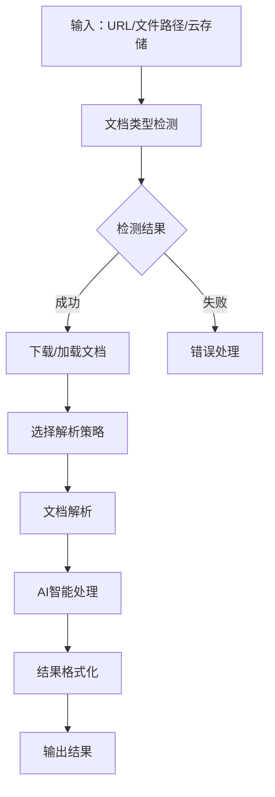

# Document Parser Tool - 现代化高性能文档解析组件

## 概述

文档解析工具（Document Parser Tool）是一个现代化的标准高性能文档解析组件，能够通过AI发出指令对指定文档（URL、本地文件或云存储）进行解析。该组件先判断文档类型，再根据类型选择合适的解析策略，最后将解析结果传给AI进行智能分析。

## 🏗️ 新的目录结构

文档处理工具已移至专用的`docs`目录，结构更加清晰：

```
aiecs/tools/
├── docs/                              # 📁 文档处理工具专用目录
│   ├── __init__.py                    # 文档工具模块初始化
│   ├── document_parser_tool.py        # 🔧 核心文档解析工具
│   └── ai_document_orchestrator.py    # 🤖 AI智能编排器
├── task_tools/                        # 📁 其他任务工具
│   ├── chart_tool.py
│   ├── scraper_tool.py
│   └── ...
└── __init__.py                        # 主工具注册
```

## 核心特性

### 1. 智能文档类型检测
- **多重检测机制**：文件扩展名、MIME类型、内容特征检测
- **高准确率**：结合多种检测方法，提供置信度评分
- **支持格式**：PDF、DOCX、XLSX、PPTX、TXT、HTML、RTF、CSV、JSON、XML、Markdown、图片等

### 2. 多源文档获取
- **云存储支持**：Google Cloud Storage、AWS S3、Azure Blob Storage
- **URL下载**：支持HTTP/HTTPS链接直接下载
- **本地文件**：处理本地文件系统中的文档
- **存储ID**：支持UUID或自定义存储标识符

### 3. 多样化解析策略
- **TEXT_ONLY**：纯文本提取
- **STRUCTURED**：结构化内容解析
- **FULL_CONTENT**：完整内容提取（默认）
- **METADATA_ONLY**：仅提取元数据

### 4. AI智能编排
- **多AI提供商支持**：OpenAI、Google Vertex AI、xAI
- **智能处理模式**：总结、信息提取、分析、翻译、分类、问答
- **批量处理**：支持并发处理多个文档
- **自定义工作流**：可创建自定义处理流程

### 5. 高性能架构
- **异步处理**：支持异步操作和并发处理
- **缓存机制**：智能缓存解析结果
- **错误处理**：完善的错误处理和重试机制
- **资源管理**：自动清理临时文件

## 架构设计

### 组件架构

```
文档解析组件 (aiecs/tools/docs/)
├── DocumentParserTool           # 核心解析工具
│   ├── 文档类型检测器
│   ├── 内容解析器
│   ├── 元数据提取器
│   └── 输出格式化器
│
├── AIDocumentOrchestrator       # AI智能编排器
│   ├── AI提供商管理
│   ├── 处理模板系统
│   ├── 批量处理引擎
│   └── 结果后处理器
│
└── 依赖工具集成
    ├── ScraperTool             # URL下载
    ├── OfficeTool              # Office文档处理
    └── ImageTool               # 图片OCR
```

### 工作流程



## 使用方法

### 1. 基础文档解析（新导入路径）

```python
# 使用新的导入路径
from aiecs.tools.docs.document_parser_tool import DocumentParserTool

# 初始化解析器
parser = DocumentParserTool()

# 解析文档（支持多种源）
result = parser.parse_document(
    source="https://example.com/document.pdf",  # URL
    strategy="full_content",
    output_format="json",
    extract_metadata=True
)

print(f"文档类型: {result['document_type']}")
print(f"内容预览: {result['content'][:200]}...")
```

### 1.1 云存储文档解析

```python
# 配置云存储支持
config = {
    "enable_cloud_storage": True,
    "gcs_bucket_name": "my-documents",
    "gcs_project_id": "my-project"
}

parser = DocumentParserTool(config)

# 支持多种云存储格式
cloud_sources = [
    "gs://my-bucket/documents/report.pdf",        # Google Cloud Storage
    "s3://my-bucket/files/presentation.pptx",     # AWS S3  
    "azure://my-container/data/contract.docx",    # Azure Blob
    "cloud://shared/documents/analysis.xlsx",     # 通用云存储
    "doc_123456789abcdef",                        # 存储ID
    "a1b2c3d4-e5f6-7890-abcd-ef1234567890"      # UUID存储ID
]

for source in cloud_sources:
    try:
        result = parser.parse_document(source=source)
        print(f"✓ 成功解析: {source}")
    except Exception as e:
        print(f"✗ 解析失败: {source} - {e}")
```

### 2. 文档类型检测

```python
# 检测文档类型
detection_result = parser.detect_document_type(
    source="https://example.com/unknown_document",
    download_sample=True
)

print(f"检测类型: {detection_result['detected_type']}")
print(f"置信度: {detection_result['confidence']}")
print(f"检测方法: {detection_result['detection_methods']}")
```

### 3. AI智能分析（新导入路径）

```python
from aiecs.tools.docs.ai_document_orchestrator import AIDocumentOrchestrator

# 初始化AI编排器
orchestrator = AIDocumentOrchestrator()

# AI文档分析
result = orchestrator.process_document(
    source="document.pdf",
    processing_mode="summarize",
    ai_provider="openai"
)

print(f"AI摘要: {result['ai_result']['ai_response']}")
```

### 4. 批量处理

```python
# 批量处理多个文档
batch_result = orchestrator.batch_process_documents(
    sources=[
        "doc1.pdf",
        "https://example.com/doc2.docx",
        "gs://bucket/doc3.txt"  # 云存储支持
    ],
    processing_mode="analyze",
    max_concurrent=3
)

print(f"处理成功: {batch_result['successful_documents']}")
print(f"处理失败: {batch_result['failed_documents']}")
```

### 5. 自定义处理流程

```python
# 创建自定义处理器
custom_analyzer = orchestrator.create_custom_processor(
    system_prompt="你是一个专业的法律文档分析师",
    user_prompt_template="分析以下法律文档并提取关键信息：{content}"
)

# 使用自定义处理器
result = custom_analyzer("legal_document.pdf")
```

## 配置选项

### DocumentParserTool 配置

```python
config = {
    "max_file_size": 50 * 1024 * 1024,  # 50MB
    "timeout": 30,
    "default_encoding": "utf-8",
    "max_pages": 1000,
    # 云存储配置
    "enable_cloud_storage": True,
    "gcs_bucket_name": "aiecs-documents",
    "gcs_project_id": "my-project"
}

parser = DocumentParserTool(config)
```

### AIDocumentOrchestrator 配置

```python
config = {
    "default_ai_provider": "openai",
    "max_chunk_size": 4000,
    "max_concurrent_requests": 5,
    "default_temperature": 0.1,
    "max_tokens": 2000
}

orchestrator = AIDocumentOrchestrator(config)
```

## 支持的文档格式

| 格式 | 扩展名 | 解析器 | 特性 |
|------|--------|--------|------|
| PDF | .pdf | OfficeTool + 自定义 | 文本提取、页面分割 |
| Word | .docx, .doc | OfficeTool | 段落、样式、表格 |
| Excel | .xlsx, .xls | OfficeTool | 工作表、单元格数据 |
| PowerPoint | .pptx, .ppt | OfficeTool | 幻灯片、文本、图片 |
| 纯文本 | .txt | 内置 | 编码检测、行分割 |
| HTML | .html, .htm | BeautifulSoup | 结构化解析、标签提取 |
| Markdown | .md, .markdown | 内置 | 标题提取、结构化 |
| CSV | .csv | Pandas | 表格数据、列分析 |
| JSON | .json | 内置 | 结构化数据解析 |
| XML | .xml | 内置 | 层次结构解析 |
| 图片 | .jpg, .png, .gif | ImageTool | OCR文字识别 |

## 云存储支持

### 支持的云存储格式

1. **Google Cloud Storage**: `gs://bucket/path/file.pdf`
2. **AWS S3**: `s3://bucket/path/file.pdf`
3. **Azure Blob Storage**: `azure://container/path/file.pdf`
4. **通用云存储**: `cloud://path/file.pdf`
5. **存储ID**: `doc_123456789abcdef`
6. **UUID标识**: `a1b2c3d4-e5f6-7890-abcd-ef1234567890`

### 云存储配置示例

```python
# Google Cloud Storage
gcs_config = {
    "enable_cloud_storage": True,
    "gcs_bucket_name": "my-gcs-bucket",
    "gcs_project_id": "my-gcp-project",
    "gcs_location": "US"
}

# AWS S3 (通过兼容接口)
s3_config = {
    "enable_cloud_storage": True,
    "gcs_bucket_name": "my-s3-bucket",
    "gcs_project_id": "aws-compat-project"
}

parser = DocumentParserTool(gcs_config)
```

## AI处理模式

### 1. 文档摘要 (SUMMARIZE)
- 生成简洁、信息丰富的摘要
- 突出关键要点和主题
- 支持多种长度设置

### 2. 信息提取 (EXTRACT_INFO)
- 根据指定条件提取特定信息
- 结构化数据输出
- 支持自定义提取规则

### 3. 内容分析 (ANALYZE)
- 深度内容分析
- 主题识别、情感分析
- 结构和组织分析

### 4. 文档翻译 (TRANSLATE)
- 多语言翻译支持
- 保持原始格式
- 上下文感知翻译

### 5. 文档分类 (CLASSIFY)
- 自动文档分类
- 置信度评分
- 自定义分类体系

### 6. 问答系统 (ANSWER_QUESTIONS)
- 基于文档内容回答问题
- 引用相关段落
- 支持复杂推理

## 性能优化

### 1. 缓存策略
- 文档解析结果缓存
- AI响应缓存
- 类型检测结果缓存

### 2. 并发处理
- 异步I/O操作
- 多文档并行处理
- 资源池管理

### 3. 内存管理
- 大文档分块处理
- 临时文件自动清理
- 内存使用监控

### 4. 错误处理
- 智能重试机制
- 降级处理策略
- 详细错误日志

## 错误处理

### 常见错误类型

1. **DocumentParserError**：基础解析错误
2. **UnsupportedDocumentError**：不支持的文档类型
3. **DownloadError**：文档下载失败
4. **ParseError**：解析过程错误
5. **AIProviderError**：AI服务错误
6. **ProcessingError**：处理流程错误

### 错误处理示例

```python
try:
    result = parser.parse_document(source="problematic_doc.pdf")
except UnsupportedDocumentError as e:
    print(f"不支持的文档类型: {e}")
except DownloadError as e:
    print(f"下载失败: {e}")
except ParseError as e:
    print(f"解析失败: {e}")
except Exception as e:
    print(f"未知错误: {e}")
```

## 迁移指南

### 从旧版本迁移

如果您之前使用的是旧的导入路径，请按以下方式更新：

```python
# 旧的导入路径（已废弃）
# from aiecs.tools.task_tools.document_parser_tool import DocumentParserTool
# from aiecs.tools.task_tools.ai_document_orchestrator import AIDocumentOrchestrator

# 新的导入路径
from aiecs.tools.docs.document_parser_tool import DocumentParserTool
from aiecs.tools.docs.ai_document_orchestrator import AIDocumentOrchestrator

# 或使用懒加载方式
from aiecs.tools.docs import document_parser_tool, ai_document_orchestrator
```

### 批量更新脚本

```bash
# 批量更新导入路径的脚本
find . -name "*.py" -exec sed -i 's/from aiecs\.tools\.task_tools\.document_parser_tool/from aiecs.tools.docs.document_parser_tool/g' {} \;
find . -name "*.py" -exec sed -i 's/from aiecs\.tools\.task_tools\.ai_document_orchestrator/from aiecs.tools.docs.ai_document_orchestrator/g' {} \;
```

## 扩展开发

### 1. 添加新的文档格式支持

```python
# 在 DocumentParserTool 中添加新的解析方法
def _parse_new_format(self, file_path: str, strategy: ParsingStrategy):
    # 实现新格式的解析逻辑
    pass
```

### 2. 自定义AI处理模板

```python
# 添加新的处理模板
orchestrator.processing_templates["custom_mode"] = {
    "system_prompt": "自定义系统提示",
    "user_prompt_template": "自定义用户提示模板: {content}"
}
```

### 3. 集成新的AI提供商

```python
# 扩展AI提供商支持
def _call_custom_ai_provider(self, prompt: str, params: Dict):
    # 实现自定义AI提供商调用
    pass
```

## 最佳实践

### 1. 文档处理
- 先检测文档类型再选择处理策略
- 对大文档使用分块处理
- 设置合理的超时时间

### 2. AI处理
- 根据文档内容选择合适的AI模型
- 使用缓存避免重复处理
- 设置合理的并发限制

### 3. 错误处理
- 实现完善的错误处理逻辑
- 记录详细的处理日志
- 提供用户友好的错误信息

### 4. 性能优化
- 使用异步处理提高并发性能
- 合理配置缓存策略
- 监控资源使用情况

## 开箱即用检查

运行以下代码验证系统是否可以开箱即用：

```python
def system_readiness_check():
    """系统就绪性检查"""
    
    print("🔍 AIECS文档处理系统就绪性检查")
    print("=" * 50)
    
    try:
        # 1. 导入测试
        from aiecs.tools.docs.document_parser_tool import DocumentParserTool
        from aiecs.tools.docs.ai_document_orchestrator import AIDocumentOrchestrator
        print("✓ 模块导入成功")
        
        # 2. 初始化测试
        parser = DocumentParserTool()
        orchestrator = AIDocumentOrchestrator()
        print("✓ 工具初始化成功")
        
        # 3. 功能检查
        print(f"✓ 云存储支持: {parser.settings.enable_cloud_storage}")
        print(f"✓ AI提供商: {orchestrator.settings.default_ai_provider}")
        print(f"✓ 并发限制: {orchestrator.settings.max_concurrent_requests}")
        
        # 4. 路径检查
        source_types = [
            ("本地文件", "/tmp/test.txt"),
            ("HTTP URL", "https://example.com/file.pdf"),
            ("云存储GCS", "gs://bucket/file.pdf"),
            ("云存储S3", "s3://bucket/file.pdf"),
            ("存储ID", "doc_123456")
        ]
        
        for name, source in source_types:
            can_handle = (
                os.path.exists(source) or
                parser._is_url(source) or
                parser._is_cloud_storage_path(source) or
                parser._is_storage_id(source)
            )
            print(f"✓ {name}支持: {source}")
        
        print("\n🎉 系统完全就绪，可以开箱即用！")
        return True
        
    except Exception as e:
        print(f"✗ 系统检查失败: {e}")
        return False

# 运行就绪性检查
if __name__ == "__main__":
    system_readiness_check()
```

## 快速开始

查看完整的快速开始指南：`docs/TOOLS_USED_INSTRUCTION/DOCUMENT_PARSER_QUICK_START.md`

## 示例代码

- 基础使用示例: `examples/document_processing_example.py`
- 云存储示例: `examples/cloud_storage_document_example.py`

## 未来规划

1. **增强文档格式支持**
   - 更多Office格式支持
   - 图表和表格智能识别
   - 复杂布局文档处理

2. **AI能力扩展**
   - 多模态文档理解
   - 文档结构化重建
   - 智能文档生成

3. **性能优化**
   - 分布式处理支持
   - 流式处理能力
   - 边缘计算支持

4. **企业级功能**
   - 权限控制和安全审计
   - 大规模批量处理
   - 集成监控和告警