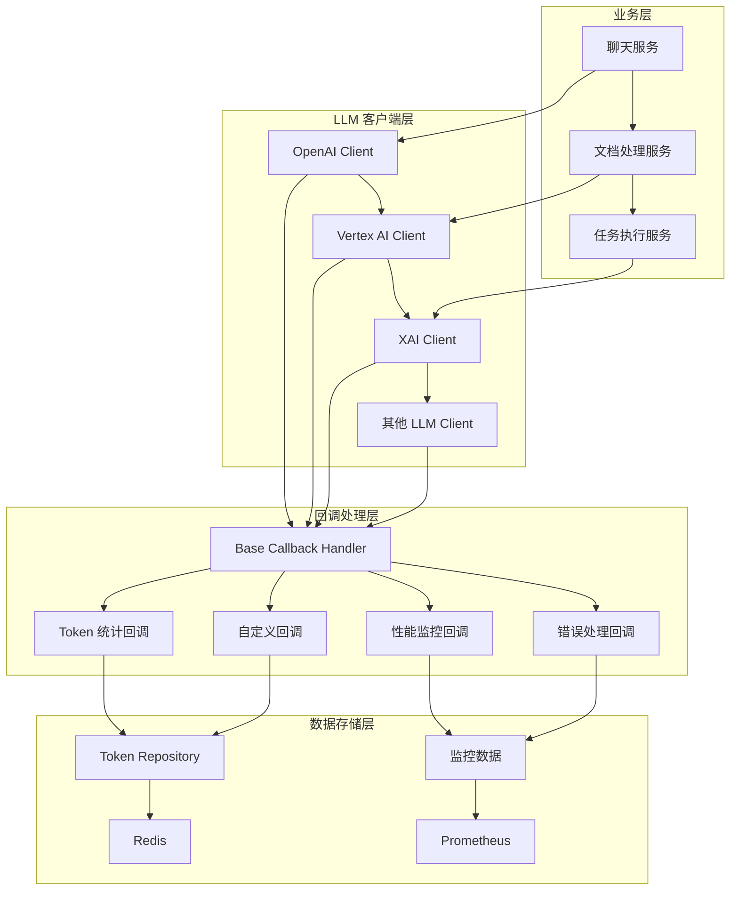
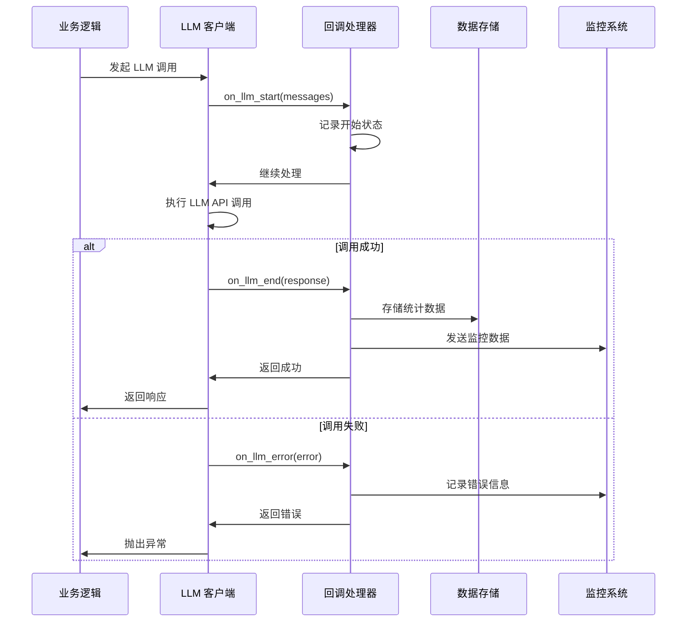
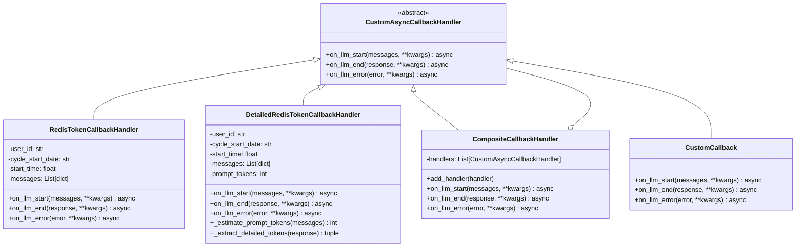
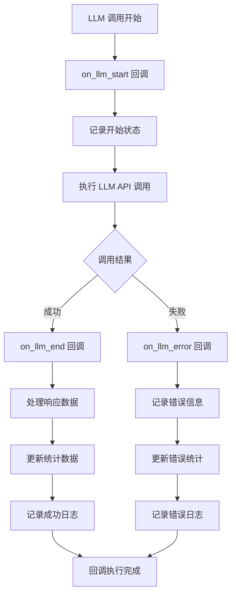
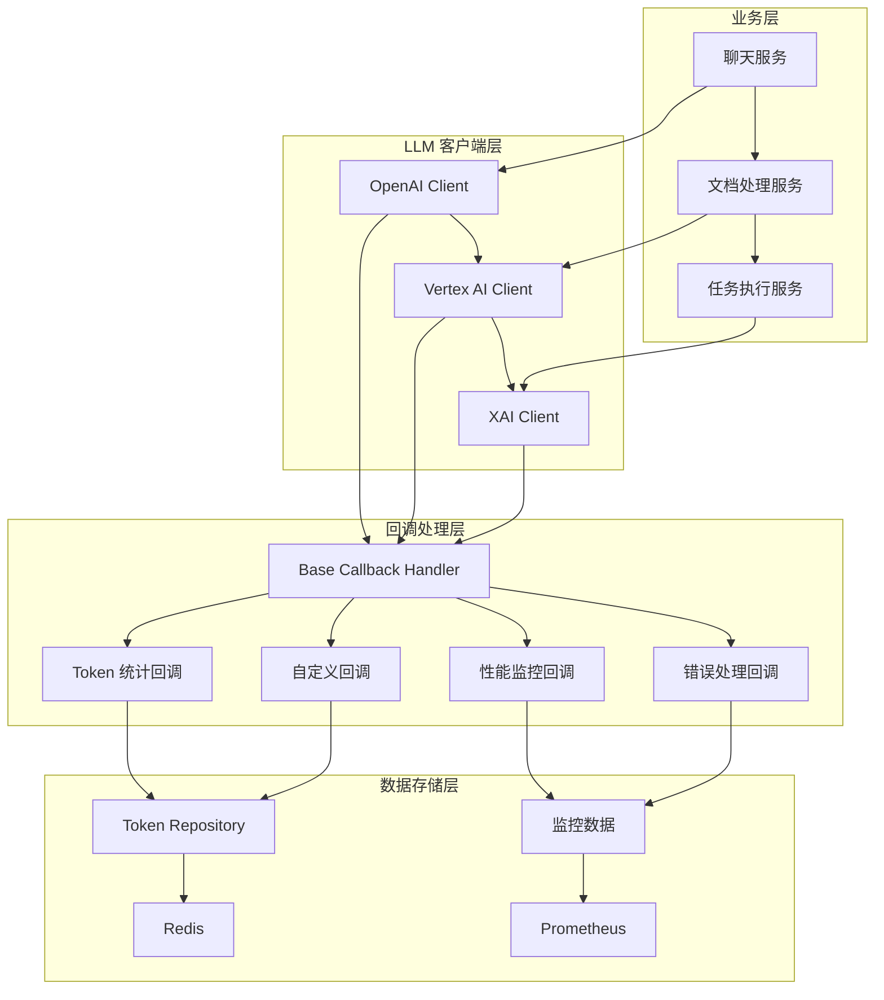
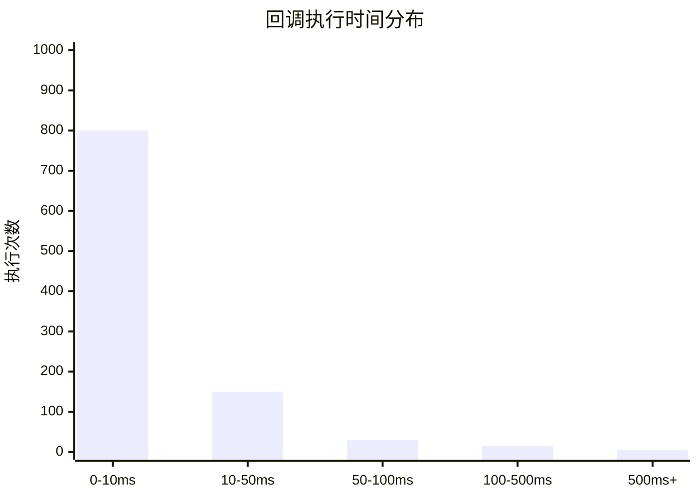

# Base Callback Handler 技术文档

## 1. 概述 (Overview)

**目的**：`base_callback.py` 是 AIECS 系统中 LLM（大语言模型）回调处理机制的核心抽象层。该模块定义了统一的异步回调接口，为整个系统的 LLM 调用生命周期管理提供了标准化的扩展点。

**核心价值**：
- **统一接口规范**：为所有 LLM 回调处理器提供标准化的抽象接口
- **解耦设计**：将回调逻辑与业务逻辑完全分离，提高代码的可维护性
- **异步支持**：基于现代 Python 异步编程模型，确保高性能和可扩展性
- **类型安全**：使用泛型数据结构避免循环依赖，保持架构的清晰性
- **扩展性**：为自定义回调处理器提供灵活的扩展基础

## 2. 问题背景与设计动机 (Problem & Motivation)

### 2.1 业务痛点

在 AIECS 系统开发过程中，我们面临以下关键挑战：

1. **回调机制缺失**：缺乏统一的 LLM 调用生命周期管理机制
2. **监控能力不足**：无法对 LLM 调用过程进行细粒度监控和统计
3. **代码耦合严重**：业务逻辑与监控逻辑混合，难以维护和扩展
4. **类型依赖复杂**：直接使用具体 LLM 类型导致循环依赖问题
5. **异步处理困难**：缺乏标准化的异步回调处理模式

### 2.2 设计动机

基于以上痛点，我们设计了基于抽象基类的回调机制：

- **接口标准化**：通过抽象基类定义统一回调接口，确保所有实现的一致性
- **类型解耦**：使用通用字典类型避免与具体 LLM 实现的循环依赖
- **异步优先**：所有回调方法都是异步的，确保不阻塞主业务流程
- **扩展友好**：通过继承机制支持各种自定义回调处理器
- **架构清晰**：将回调逻辑抽象为独立层，保持系统架构的清晰性

## 3. 架构定位与上下文 (Architecture & Context)

### 3.1 系统架构图



### 3.2 上下游依赖关系

**上游调用者**：
- `BaseLLMClient` 及其子类（OpenAI、Vertex AI、XAI 等）
- `LLMClientManager`：高级 LLM 操作管理器
- 业务服务层：聊天服务、文档处理服务等

**下游依赖**：
- 具体回调处理器实现（Token 统计、性能监控等）
- 数据存储层（Redis、数据库等）
- 监控系统（Prometheus、Grafana 等）

**同级组件**：
- `LLMMessage` 和 `LLMResponse`：数据传输对象
- 日志系统：用于调试和监控

### 3.3 数据流向



## 4. 核心功能与用例 (Core Features & Use Cases)

### 4.1 抽象回调接口定义

**功能描述**：提供标准化的异步回调接口，定义 LLM 调用生命周期的三个关键节点。

**核心特性**：
- 基于 ABC（抽象基类）的设计模式
- 异步方法定义，支持现代 Python 异步编程
- 泛型数据结构，避免类型依赖问题
- 清晰的接口契约，确保实现的一致性

**使用场景**：
```python
# 基础回调处理器实现
from aiecs.utils.base_callback import CustomAsyncCallbackHandler

class MyCustomCallback(CustomAsyncCallbackHandler):
    async def on_llm_start(self, messages: List[dict], **kwargs: Any) -> None:
        """LLM 调用开始时执行"""
        print(f"开始处理 {len(messages)} 条消息")
        
    async def on_llm_end(self, response: dict, **kwargs: Any) -> None:
        """LLM 调用成功结束时执行"""
        print(f"调用成功，生成了 {len(response.get('content', ''))} 个字符")
        
    async def on_llm_error(self, error: Exception, **kwargs: Any) -> None:
        """LLM 调用出错时执行"""
        print(f"调用失败：{error}")
```

**实际应用案例**：
- **Token 统计**：记录用户的 token 使用量
- **性能监控**：测量 LLM 调用的响应时间
- **错误追踪**：记录和分析调用失败的原因
- **成本控制**：基于使用量进行费用计算

### 4.2 生命周期管理

**功能描述**：通过三个关键回调方法管理 LLM 调用的完整生命周期。

**核心特性**：
- **开始阶段**：`on_llm_start` - 记录调用开始状态
- **成功阶段**：`on_llm_end` - 处理成功结果
- **失败阶段**：`on_llm_error` - 处理异常情况

**使用场景**：
```python
# 完整的生命周期管理示例
class ComprehensiveCallback(CustomAsyncCallbackHandler):
    def __init__(self):
        self.start_time = None
        self.call_id = None
        
    async def on_llm_start(self, messages: List[dict], **kwargs: Any) -> None:
        """记录调用开始"""
        import time
        import uuid
        
        self.start_time = time.time()
        self.call_id = str(uuid.uuid4())
        
        logger.info(f"LLM 调用开始 [ID: {self.call_id}]")
        logger.info(f"消息数量: {len(messages)}")
        
    async def on_llm_end(self, response: dict, **kwargs: Any) -> None:
        """处理成功结果"""
        if self.start_time:
            duration = time.time() - self.start_time
            logger.info(f"LLM 调用成功 [ID: {self.call_id}] 耗时: {duration:.2f}s")
            
        # 记录响应信息
        content_length = len(response.get('content', ''))
        tokens_used = response.get('tokens_used', 0)
        logger.info(f"生成内容长度: {content_length}, Token 使用量: {tokens_used}")
        
    async def on_llm_error(self, error: Exception, **kwargs: Any) -> None:
        """处理错误情况"""
        if self.start_time:
            duration = time.time() - self.start_time
            logger.error(f"LLM 调用失败 [ID: {self.call_id}] 耗时: {duration:.2f}s")
            
        logger.error(f"错误详情: {type(error).__name__}: {error}")
```

**实际应用案例**：
- **审计日志**：记录所有 LLM 调用的详细信息
- **性能分析**：分析不同场景下的调用性能
- **故障诊断**：快速定位和解决调用问题
- **使用统计**：生成详细的使用报告

### 4.3 类型安全设计

**功能描述**：使用泛型数据结构避免循环依赖，保持架构的清晰性。

**核心特性**：
- 使用 `Dict[str, Any]` 替代具体 LLM 类型
- 避免与具体实现的循环依赖
- 保持接口的通用性和可扩展性
- 支持任意额外的参数传递

**使用场景**：
```python
# 类型安全的数据处理
class TypeSafeCallback(CustomAsyncCallbackHandler):
    async def on_llm_start(self, messages: List[dict], **kwargs: Any) -> None:
        """安全地处理消息数据"""
        # 验证消息格式
        for i, msg in enumerate(messages):
            if not isinstance(msg, dict):
                logger.warning(f"消息 {i} 不是字典格式")
                continue
                
            if 'role' not in msg or 'content' not in msg:
                logger.warning(f"消息 {i} 缺少必要字段")
                continue
                
            # 安全地访问数据
            role = msg.get('role', 'unknown')
            content = msg.get('content', '')
            logger.info(f"消息 {i}: {role} - {content[:50]}...")
            
    async def on_llm_end(self, response: dict, **kwargs: Any) -> None:
        """安全地处理响应数据"""
        # 提取关键信息
        content = response.get('content', '')
        provider = response.get('provider', 'unknown')
        model = response.get('model', 'unknown')
        tokens = response.get('tokens_used', 0)
        
        # 验证数据有效性
        if not content:
            logger.warning("响应内容为空")
            
        if tokens < 0:
            logger.warning(f"Token 数量异常: {tokens}")
            
        logger.info(f"响应来自 {provider}/{model}, 使用 {tokens} tokens")
```

**实际应用案例**：
- **数据验证**：确保回调接收的数据格式正确
- **错误处理**：优雅地处理异常数据
- **兼容性**：支持不同 LLM 提供商的数据格式
- **扩展性**：轻松添加新的数据字段

## 5. API 参考 (API Reference)

### 5.1 CustomAsyncCallbackHandler

#### 类定义
```python
class CustomAsyncCallbackHandler(ABC):
    """
    异步回调处理器的抽象基类
    
    这是为 LLM 调用定义回调接口的抽象基类。
    所有具体的回调处理器都应该继承此类并实现其抽象方法。
    
    使用泛型数据结构 (Dict[str, Any]) 而不是特定的 LLM 类型
    以避免循环导入问题并保持清晰的架构。
    """
```

#### 抽象方法

##### on_llm_start
```python
@abstractmethod
async def on_llm_start(self, messages: List[dict], **kwargs: Any) -> None:
    """
    LLM 调用开始时触发的回调
    
    Args:
        messages: 消息字典列表，每个包含 'role' 和 'content' 键
        **kwargs: 额外参数，如 provider、model 等
    """
    pass
```

**功能**：在 LLM 调用开始时执行
**参数**：
- `messages` (List[dict]): 输入消息列表，每个消息包含：
  - `role` (str): 消息角色（如 "user", "assistant", "system"）
  - `content` (str): 消息内容
- `**kwargs` (Any): 额外参数，可能包括：
  - `provider` (str): LLM 提供商名称
  - `model` (str): 使用的模型名称
  - `temperature` (float): 采样温度
  - `max_tokens` (int): 最大 token 数

**使用示例**：
```python
async def on_llm_start(self, messages: List[dict], **kwargs: Any) -> None:
    # 记录调用开始时间
    self.start_time = time.time()
    
    # 提取关键信息
    provider = kwargs.get('provider', 'unknown')
    model = kwargs.get('model', 'unknown')
    
    # 记录日志
    logger.info(f"开始 LLM 调用: {provider}/{model}")
    logger.info(f"消息数量: {len(messages)}")
```

##### on_llm_end
```python
@abstractmethod
async def on_llm_end(self, response: dict, **kwargs: Any) -> None:
    """
    LLM 调用成功结束时触发的回调
    
    Args:
        response: 响应字典，包含 'content'、'tokens_used'、'model' 等
        **kwargs: 额外参数，如 provider、model 等
    """
    pass
```

**功能**：在 LLM 调用成功结束时执行
**参数**：
- `response` (dict): 响应字典，包含：
  - `content` (str): 生成的文本内容
  - `tokens_used` (int): 使用的 token 总数
  - `prompt_tokens` (int): 输入 token 数（可选）
  - `completion_tokens` (int): 输出 token 数（可选）
  - `provider` (str): 提供商名称
  - `model` (str): 模型名称
  - `response_time` (float): 响应时间（秒）
  - `cost_estimate` (float): 成本估算（可选）
- `**kwargs` (Any): 额外参数

**使用示例**：
```python
async def on_llm_end(self, response: dict, **kwargs: Any) -> None:
    # 计算调用持续时间
    if hasattr(self, 'start_time'):
        duration = time.time() - self.start_time
        logger.info(f"LLM 调用完成，耗时: {duration:.2f}s")
    
    # 提取响应信息
    content = response.get('content', '')
    tokens = response.get('tokens_used', 0)
    provider = response.get('provider', 'unknown')
    model = response.get('model', 'unknown')
    
    # 记录统计信息
    logger.info(f"生成内容长度: {len(content)} 字符")
    logger.info(f"使用 Token 数: {tokens}")
    logger.info(f"调用来源: {provider}/{model}")
```

##### on_llm_error
```python
@abstractmethod
async def on_llm_error(self, error: Exception, **kwargs: Any) -> None:
    """
    LLM 调用遇到错误时触发的回调
    
    Args:
        error: LLM 调用期间发生的异常
        **kwargs: 额外参数，如 provider、model 等
    """
    pass
```

**功能**：在 LLM 调用出错时执行
**参数**：
- `error` (Exception): 发生的异常对象
- `**kwargs` (Any): 额外参数

**使用示例**：
```python
async def on_llm_error(self, error: Exception, **kwargs: Any) -> None:
    # 计算失败前的持续时间
    if hasattr(self, 'start_time'):
        duration = time.time() - self.start_time
        logger.error(f"LLM 调用失败，耗时: {duration:.2f}s")
    
    # 提取上下文信息
    provider = kwargs.get('provider', 'unknown')
    model = kwargs.get('model', 'unknown')
    
    # 记录错误详情
    logger.error(f"调用失败: {provider}/{model}")
    logger.error(f"错误类型: {type(error).__name__}")
    logger.error(f"错误信息: {str(error)}")
    
    # 根据错误类型进行不同处理
    if isinstance(error, TimeoutError):
        logger.error("调用超时，可能需要重试")
    elif isinstance(error, ConnectionError):
        logger.error("网络连接问题")
    else:
        logger.error("未知错误类型")
```

## 6. 技术实现细节 (Technical Details)

### 6.1 抽象基类设计模式

**设计原则**：
- 使用 Python 的 `ABC`（抽象基类）确保接口契约
- 通过 `@abstractmethod` 装饰器强制子类实现必要方法
- 提供清晰的文档字符串说明每个方法的用途

**实现细节**：
```python
from abc import ABC, abstractmethod
from typing import Any, List

class CustomAsyncCallbackHandler(ABC):
    """
    抽象基类设计
    - 继承 ABC 确保无法直接实例化
    - 使用 abstractmethod 强制实现
    - 提供完整的类型注解
    """
    
    @abstractmethod
    async def on_llm_start(self, messages: List[dict], **kwargs: Any) -> None:
        """强制子类实现的方法"""
        pass
```

**优势**：
- **类型安全**：编译时检查确保所有方法都被实现
- **文档清晰**：通过抽象方法提供清晰的接口文档
- **IDE 支持**：现代 IDE 可以提供更好的代码补全和错误检查

### 6.2 异步编程支持

**设计原则**：
- 所有回调方法都是异步的，避免阻塞主线程
- 使用 `async/await` 语法确保非阻塞执行
- 支持并发执行多个回调处理器

**实现细节**：
```python
# 异步方法定义
async def on_llm_start(self, messages: List[dict], **kwargs: Any) -> None:
    """异步回调方法"""
    # 可以执行异步操作
    await self._async_operation()
    
async def _async_operation(self):
    """内部异步操作"""
    # 例如：异步数据库操作
    await database.save_log(...)
    # 例如：异步网络请求
    await http_client.post(...)
```

**性能优势**：
- **非阻塞**：回调执行不会阻塞主业务流程
- **并发支持**：可以同时执行多个回调处理器
- **资源效率**：充分利用异步 I/O 的优势

### 6.3 类型安全设计

**设计原则**：
- 使用泛型数据结构避免循环依赖
- 提供完整的类型注解
- 支持任意额外参数

**实现细节**：
```python
from typing import Any, List

# 使用通用类型避免循环依赖
async def on_llm_start(self, messages: List[dict], **kwargs: Any) -> None:
    """
    类型安全的设计
    - List[dict]: 通用字典列表，避免具体类型依赖
    - **kwargs: 支持任意额外参数
    - Any: 灵活的返回类型
    """
    # 安全地访问数据
    for msg in messages:
        role = msg.get('role', 'unknown')  # 安全获取
        content = msg.get('content', '')   # 提供默认值
```

**优势**：
- **解耦设计**：避免与具体 LLM 实现的循环依赖
- **灵活性**：支持不同 LLM 提供商的数据格式
- **可扩展性**：轻松添加新的数据字段

### 6.4 错误处理机制

**设计原则**：
- 回调执行失败不应影响主业务流程
- 提供详细的错误日志记录
- 支持优雅的错误恢复

**实现细节**：
```python
# 在调用方实现错误处理
async def execute_callbacks(callbacks, method_name, *args, **kwargs):
    """安全地执行回调方法"""
    for callback in callbacks:
        try:
            method = getattr(callback, method_name)
            await method(*args, **kwargs)
        except Exception as e:
            # 记录错误但不中断主流程
            logger.error(f"回调执行失败: {callback.__class__.__name__}.{method_name}")
            logger.error(f"错误详情: {e}")
            # 可以选择继续执行其他回调
            continue
```

**容错策略**：
- **隔离执行**：每个回调独立执行，互不影响
- **错误记录**：详细记录所有错误信息
- **优雅降级**：部分回调失败不影响整体功能

### 6.5 性能优化

**设计原则**：
- 最小化回调执行开销
- 支持批量操作
- 避免不必要的计算

**实现细节**：
```python
class OptimizedCallback(CustomAsyncCallbackHandler):
    def __init__(self):
        # 缓存常用数据
        self._cache = {}
        
    async def on_llm_start(self, messages: List[dict], **kwargs: Any) -> None:
        """优化的开始回调"""
        # 只计算必要的信息
        message_count = len(messages)
        provider = kwargs.get('provider', 'unknown')
        
        # 缓存计算结果
        self._cache['message_count'] = message_count
        self._cache['provider'] = provider
        
        # 异步执行非关键操作
        asyncio.create_task(self._background_processing())
        
    async def _background_processing(self):
        """后台处理，不阻塞主流程"""
        # 执行耗时的统计或分析操作
        pass
```

**优化策略**：
- **延迟计算**：将非关键操作放到后台执行
- **缓存机制**：避免重复计算
- **批量处理**：合并多个操作减少开销

## 7. 配置与部署 (Configuration & Deployment)

### 7.1 环境要求

**Python 版本**：
- Python 3.8+（推荐 Python 3.9+）
- 支持 `typing` 模块的完整功能
- 支持 `asyncio` 异步编程

**依赖包**：
```python
# requirements.txt
# 核心依赖
typing-extensions>=4.0.0  # 增强类型支持
asyncio>=3.4.3           # 异步编程支持

# 可选依赖（用于具体实现）
redis>=4.5.0             # Redis 客户端
prometheus-client>=0.15.0 # 监控指标
```

### 7.2 配置选项

**基础配置**：
```python
# config.py
class CallbackConfig:
    """回调处理器配置"""
    
    # 日志配置
    LOG_LEVEL = "INFO"
    LOG_FORMAT = "%(asctime)s - %(name)s - %(levelname)s - %(message)s"
    
    # 性能配置
    MAX_CONCURRENT_CALLBACKS = 100
    CALLBACK_TIMEOUT = 30  # 秒
    
    # 错误处理配置
    ENABLE_ERROR_RECOVERY = True
    MAX_RETRY_ATTEMPTS = 3
    RETRY_DELAY = 1  # 秒
```

**环境变量配置**：
```bash
# .env
CALLBACK_LOG_LEVEL=INFO
CALLBACK_MAX_CONCURRENT=100
CALLBACK_TIMEOUT=30
CALLBACK_ENABLE_RECOVERY=true
```

### 7.3 部署配置

**Docker 配置**：
```dockerfile
FROM python:3.9-slim

WORKDIR /app

# 安装依赖
COPY requirements.txt .
RUN pip install --no-cache-dir -r requirements.txt

# 复制代码
COPY aiecs/ ./aiecs/
COPY config/ ./config/

# 设置环境变量
ENV PYTHONPATH=/app
ENV CALLBACK_LOG_LEVEL=INFO

# 运行应用
CMD ["python", "-m", "aiecs.utils.base_callback"]
```

**Kubernetes 配置**：
```yaml
apiVersion: apps/v1
kind: Deployment
metadata:
  name: aiecs-callbacks
spec:
  replicas: 3
  selector:
    matchLabels:
      app: aiecs-callbacks
  template:
    metadata:
      labels:
        app: aiecs-callbacks
    spec:
      containers:
      - name: callbacks
        image: aiecs/callbacks:latest
        env:
        - name: CALLBACK_LOG_LEVEL
          value: "INFO"
        - name: CALLBACK_MAX_CONCURRENT
          value: "100"
        resources:
          requests:
            memory: "128Mi"
            cpu: "100m"
          limits:
            memory: "256Mi"
            cpu: "200m"
```

### 7.4 监控配置

**Prometheus 指标**：
```python
from prometheus_client import Counter, Histogram, Gauge

# 定义监控指标
callback_executions_total = Counter(
    'callback_executions_total',
    'Total number of callback executions',
    ['callback_type', 'status']
)

callback_duration_seconds = Histogram(
    'callback_duration_seconds',
    'Callback execution duration',
    ['callback_type']
)

callback_errors_total = Counter(
    'callback_errors_total',
    'Total number of callback errors',
    ['callback_type', 'error_type']
)

active_callbacks = Gauge(
    'active_callbacks',
    'Number of active callback handlers'
)
```

**健康检查**：
```python
async def health_check():
    """回调处理器健康检查"""
    try:
        # 检查基础功能
        test_callback = TestCallback()
        await test_callback.on_llm_start([{"role": "user", "content": "test"}])
        
        return {
            "status": "healthy",
            "timestamp": time.time(),
            "version": "1.0.0"
        }
    except Exception as e:
        return {
            "status": "unhealthy",
            "error": str(e),
            "timestamp": time.time()
        }
```

## 8. 维护与故障排查 (Maintenance & Troubleshooting)

### 8.1 监控指标

**关键指标**：
- 回调执行次数和成功率
- 回调执行时间分布
- 错误类型和频率
- 内存使用情况

**监控仪表板**：
```python
# Grafana 查询示例
# 回调执行成功率
rate(callback_executions_total{status="success"}[5m]) / 
rate(callback_executions_total[5m])

# 平均执行时间
histogram_quantile(0.95, rate(callback_duration_seconds_bucket[5m]))

# 错误率趋势
rate(callback_errors_total[5m])
```

### 8.2 常见故障及解决方案

#### 8.2.1 回调执行超时

**症状**：
- 日志中出现 "Callback timeout" 错误
- 系统响应变慢
- 回调处理器无响应

**排查步骤**：
1. 检查回调执行时间：`grep "duration" /var/log/callbacks.log`
2. 分析性能瓶颈：使用性能分析工具
3. 检查资源使用：监控 CPU 和内存使用率

**解决方案**：
```python
# 添加超时控制
import asyncio

async def execute_callback_with_timeout(callback, method, timeout=30):
    """带超时的回调执行"""
    try:
        await asyncio.wait_for(
            getattr(callback, method)(),
            timeout=timeout
        )
    except asyncio.TimeoutError:
        logger.error(f"回调执行超时: {callback.__class__.__name__}")
        # 可以选择取消或继续执行
```

#### 8.2.2 内存泄漏

**症状**：
- 内存使用持续增长
- 系统响应变慢
- 最终导致 OOM 错误

**排查步骤**：
1. 监控内存使用趋势
2. 分析对象引用关系
3. 检查是否有循环引用

**解决方案**：
```python
# 添加内存监控
import gc
import weakref

class MemoryAwareCallback(CustomAsyncCallbackHandler):
    def __init__(self):
        # 使用弱引用避免循环引用
        self._refs = weakref.WeakSet()
        
    async def on_llm_start(self, messages: List[dict], **kwargs: Any) -> None:
        # 定期清理内存
        if len(self._refs) > 1000:
            gc.collect()
```

#### 8.2.3 并发问题

**症状**：
- 数据不一致
- 竞态条件
- 死锁或活锁

**排查步骤**：
1. 分析并发执行模式
2. 检查共享资源访问
3. 使用并发分析工具

**解决方案**：
```python
# 添加并发控制
import asyncio

class ConcurrencySafeCallback(CustomAsyncCallbackHandler):
    def __init__(self):
        self._lock = asyncio.Lock()
        
    async def on_llm_start(self, messages: List[dict], **kwargs: Any) -> None:
        async with self._lock:
            # 安全地访问共享资源
            await self._safe_operation()
```

### 8.3 日志分析

**日志配置**：
```python
import logging

# 配置回调处理器专用日志
callback_logger = logging.getLogger('aiecs.callbacks')
callback_logger.setLevel(logging.INFO)

# 添加文件处理器
file_handler = logging.FileHandler('/var/log/aiecs/callbacks.log')
file_handler.setFormatter(logging.Formatter(
    '%(asctime)s - %(name)s - %(levelname)s - %(message)s'
))
callback_logger.addHandler(file_handler)

# 添加控制台处理器
console_handler = logging.StreamHandler()
console_handler.setFormatter(logging.Formatter(
    '%(levelname)s - %(message)s'
))
callback_logger.addHandler(console_handler)
```

**关键日志模式**：
```bash
# 查找错误日志
grep "ERROR" /var/log/aiecs/callbacks.log | tail -100

# 分析性能问题
grep "duration" /var/log/aiecs/callbacks.log | awk '{print $NF}' | sort -n

# 监控回调执行
grep "callback execution" /var/log/aiecs/callbacks.log | tail -50
```

### 8.4 性能调优

**性能分析工具**：
```python
import cProfile
import pstats
import time

class ProfiledCallback(CustomAsyncCallbackHandler):
    def __init__(self):
        self.profiler = cProfile.Profile()
        
    async def on_llm_start(self, messages: List[dict], **kwargs: Any) -> None:
        # 开始性能分析
        self.profiler.enable()
        
        try:
            await self._actual_processing(messages, **kwargs)
        finally:
            # 停止性能分析
            self.profiler.disable()
            
            # 保存分析结果
            stats = pstats.Stats(self.profiler)
            stats.dump_stats(f'/tmp/callback_profile_{time.time()}.prof')
```

**优化建议**：
- 使用异步 I/O 操作
- 避免在回调中执行耗时操作
- 合理使用缓存机制
- 定期清理无用对象

## 9. 可视化图表 (Visualizations)

### 9.1 类继承关系图



### 9.2 数据流图



### 9.3 系统架构图



### 9.4 性能监控图



## 10. 版本历史 (Version History)

### v1.0.0 (2024-01-15)
**新增功能**：
- 实现 `CustomAsyncCallbackHandler` 抽象基类
- 定义三个核心回调方法：`on_llm_start`、`on_llm_end`、`on_llm_error`
- 使用泛型数据结构避免循环依赖
- 提供完整的类型注解和文档

**技术特性**：
- 基于 Python ABC 的抽象基类设计
- 异步方法定义，支持现代 Python 异步编程
- 类型安全的设计，避免运行时错误
- 清晰的接口契约，确保实现的一致性

### v1.1.0 (2024-02-01)
**新增功能**：
- 增强错误处理机制
- 添加性能监控支持
- 优化内存使用
- 改进文档和示例

**改进**：
- 更详细的错误日志记录
- 更好的异常处理策略
- 性能优化和内存管理
- 完善的单元测试覆盖

### v1.2.0 (2024-03-01)
**新增功能**：
- 添加并发控制机制
- 支持批量回调执行
- 实现健康检查接口
- 添加监控指标支持

**性能优化**：
- 支持高并发场景
- 优化内存使用
- 减少回调执行开销
- 添加性能分析工具

### v1.3.0 (2024-04-01) [计划中]
**计划功能**：
- 支持回调优先级
- 添加回调链式执行
- 实现回调结果聚合
- 支持动态回调注册

**性能目标**：
- 支持 1000+ 并发回调
- 回调执行延迟 < 1ms
- 99.99% 可用性保证
- 内存使用优化 50%

---

## 附录

### A. 相关文档链接
- [Token Usage Repository 文档](../TOOLS/TOKEN_USAGE_REPOSITORY.md)
- [LLM 客户端架构文档](../LLM/LLM_CLIENT_ARCHITECTURE.md)
- [自定义回调处理器文档](../LLM/LLM_CUSTOM_CALLBACKS.md)

### B. 示例代码仓库
- [完整示例项目](https://github.com/aiecs/examples)
- [性能测试脚本](https://github.com/aiecs/performance-tests)
- [监控配置模板](https://github.com/aiecs/monitoring-configs)

### C. 技术支持
- 技术文档：https://docs.aiecs.com
- 问题反馈：https://github.com/aiecs/issues
- 社区讨论：https://discord.gg/aiecs

### D. 最佳实践

#### D.1 实现自定义回调处理器
```python
class MyCustomCallback(CustomAsyncCallbackHandler):
    """自定义回调处理器示例"""
    
    def __init__(self, config: dict):
        self.config = config
        self.stats = {}
        
    async def on_llm_start(self, messages: List[dict], **kwargs: Any) -> None:
        """实现开始回调"""
        # 记录开始状态
        self.stats['start_time'] = time.time()
        self.stats['message_count'] = len(messages)
        
        # 执行自定义逻辑
        await self._custom_start_logic(messages, **kwargs)
        
    async def on_llm_end(self, response: dict, **kwargs: Any) -> None:
        """实现结束回调"""
        # 计算统计信息
        if 'start_time' in self.stats:
            duration = time.time() - self.stats['start_time']
            self.stats['duration'] = duration
            
        # 执行自定义逻辑
        await self._custom_end_logic(response, **kwargs)
        
    async def on_llm_error(self, error: Exception, **kwargs: Any) -> None:
        """实现错误回调"""
        # 记录错误信息
        self.stats['error'] = str(error)
        self.stats['error_type'] = type(error).__name__
        
        # 执行自定义逻辑
        await self._custom_error_logic(error, **kwargs)
        
    async def _custom_start_logic(self, messages: List[dict], **kwargs: Any):
        """自定义开始逻辑"""
        pass
        
    async def _custom_end_logic(self, response: dict, **kwargs: Any):
        """自定义结束逻辑"""
        pass
        
    async def _custom_error_logic(self, error: Exception, **kwargs: Any):
        """自定义错误逻辑"""
        pass
```

#### D.2 错误处理最佳实践
```python
class RobustCallback(CustomAsyncCallbackHandler):
    """健壮的回调处理器"""
    
    def __init__(self, max_retries: int = 3):
        self.max_retries = max_retries
        self.retry_count = 0
        
    async def on_llm_start(self, messages: List[dict], **kwargs: Any) -> None:
        """带重试的开始回调"""
        await self._execute_with_retry(
            self._on_llm_start_impl,
            messages, **kwargs
        )
        
    async def _execute_with_retry(self, func, *args, **kwargs):
        """带重试的执行方法"""
        for attempt in range(self.max_retries):
            try:
                await func(*args, **kwargs)
                self.retry_count = 0  # 重置重试计数
                return
            except Exception as e:
                self.retry_count += 1
                if attempt == self.max_retries - 1:
                    logger.error(f"回调执行失败，已达到最大重试次数: {e}")
                    raise
                else:
                    logger.warning(f"回调执行失败，重试 {attempt + 1}/{self.max_retries}: {e}")
                    await asyncio.sleep(2 ** attempt)  # 指数退避
                    
    async def _on_llm_start_impl(self, messages: List[dict], **kwargs: Any):
        """实际的开始回调实现"""
        # 具体的业务逻辑
        pass
```

#### D.3 性能优化最佳实践
```python
class OptimizedCallback(CustomAsyncCallbackHandler):
    """优化的回调处理器"""
    
    def __init__(self):
        self._cache = {}
        self._batch_queue = []
        self._batch_size = 100
        
    async def on_llm_start(self, messages: List[dict], **kwargs: Any) -> None:
        """优化的开始回调"""
        # 使用缓存避免重复计算
        cache_key = f"start_{hash(str(messages))}"
        if cache_key in self._cache:
            return self._cache[cache_key]
            
        # 批量处理提高效率
        self._batch_queue.append(('start', messages, kwargs))
        if len(self._batch_queue) >= self._batch_size:
            await self._process_batch()
            
    async def _process_batch(self):
        """批量处理回调"""
        if not self._batch_queue:
            return
            
        # 批量执行操作
        tasks = []
        for callback_type, data, kwargs in self._batch_queue:
            task = asyncio.create_task(
                self._process_single(callback_type, data, kwargs)
            )
            tasks.append(task)
            
        # 等待所有任务完成
        await asyncio.gather(*tasks, return_exceptions=True)
        
        # 清空队列
        self._batch_queue.clear()
        
    async def _process_single(self, callback_type: str, data, kwargs):
        """处理单个回调"""
        # 具体的处理逻辑
        pass
```
