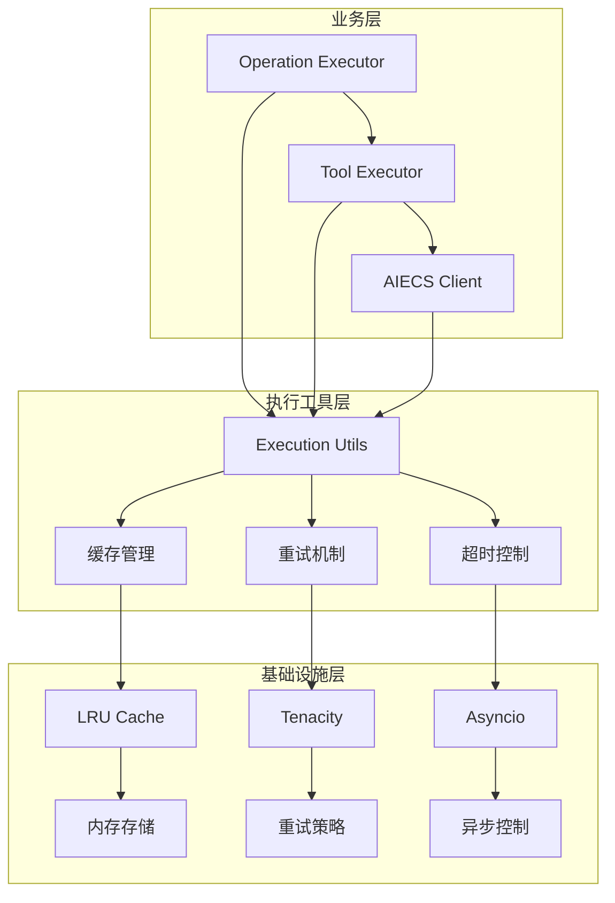
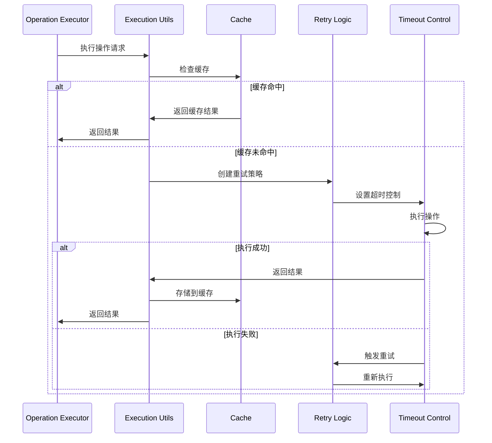
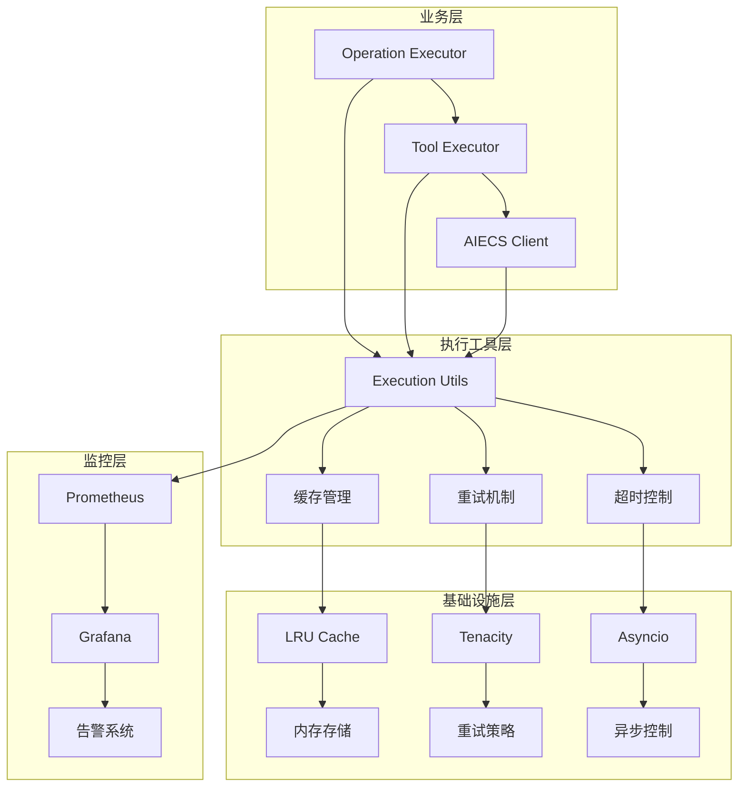
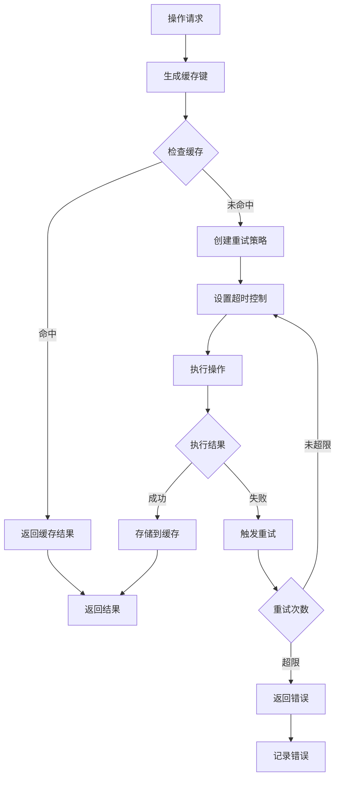
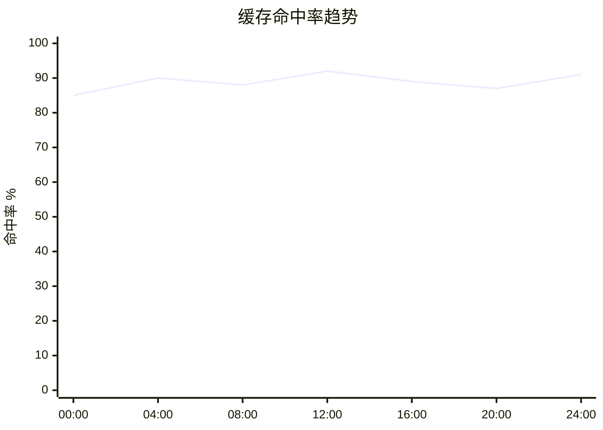
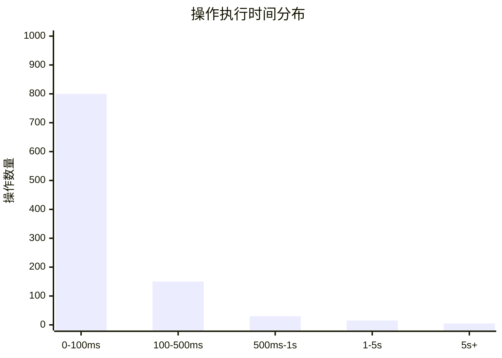

# Execution Utils 技术文档

## 1. 概述 (Overview)

**目的**：`execution_utils.py` 是 AIECS 系统中执行层的核心工具组件，为整个系统的操作执行提供了统一的缓存、重试、超时控制等基础能力。该组件通过提供可配置的缓存策略、智能重试机制和超时控制，显著提升了系统的可靠性、性能和用户体验。

**核心价值**：
- **智能缓存管理**：基于 LRU 算法的内存缓存，支持 TTL 过期机制，大幅减少重复计算开销
- **健壮的重试机制**：指数退避重试策略，自动处理临时性故障，提高系统可用性
- **精确超时控制**：异步超时管理，防止长时间阻塞，确保系统响应性
- **上下文感知**：基于用户 ID、任务 ID 的智能缓存键生成，支持多租户场景
- **线程安全**：完整的并发控制机制，支持高并发环境下的安全操作

## 2. 问题背景与设计动机 (Problem & Motivation)

### 2.1 业务痛点

在 AIECS 系统开发过程中，我们面临以下关键挑战：

1. **性能瓶颈**：重复的工具调用和计算操作导致系统响应缓慢
2. **资源浪费**：相同参数的重复执行浪费计算资源和 API 调用配额
3. **故障恢复**：网络抖动、临时性错误导致操作失败，缺乏自动恢复机制
4. **超时问题**：长时间运行的操作可能阻塞整个系统，缺乏有效的超时控制
5. **多租户隔离**：不同用户和任务的数据需要隔离，避免缓存污染
6. **并发安全**：高并发场景下的数据竞争和一致性问题

### 2.2 设计动机

基于以上痛点，我们设计了统一的执行工具组件：

- **缓存优化**：通过智能缓存减少重复计算，提升系统性能
- **故障容错**：通过重试机制提高系统可靠性，减少临时性故障影响
- **资源保护**：通过超时控制防止资源泄露，确保系统稳定性
- **多租户支持**：通过上下文感知的缓存键实现数据隔离
- **并发安全**：通过锁机制确保多线程环境下的数据一致性

## 3. 架构定位与上下文 (Architecture & Context)

### 3.1 系统架构图



### 3.2 上下游依赖关系

**上游调用者**：
- `OperationExecutor`：操作执行器，使用缓存和重试机制
- `ToolExecutor`：工具执行器，集成超时控制
- `AIECS Client`：主客户端，利用执行工具优化性能

**下游依赖**：
- `cachetools.LRUCache`：LRU 缓存实现
- `tenacity`：重试策略库
- `asyncio`：异步编程支持
- `threading`：线程安全控制

**同级组件**：
- 日志系统：用于监控和调试
- 配置管理：提供参数配置

### 3.3 数据流向



## 4. 核心功能与用例 (Core Features & Use Cases)

### 4.1 智能缓存管理

**功能描述**：基于 LRU 算法的内存缓存系统，支持 TTL 过期机制和上下文感知的缓存键生成。

**核心特性**：
- LRU 淘汰策略，自动管理缓存大小
- TTL 过期机制，确保数据时效性
- 上下文感知的缓存键，支持多租户隔离
- 线程安全的并发访问控制

**使用场景**：
```python
# 基础缓存使用
from aiecs.utils.execution_utils import ExecutionUtils

# 创建执行工具实例
execution_utils = ExecutionUtils(
    cache_size=1000,      # 最大缓存条目数
    cache_ttl=3600,       # 缓存过期时间（秒）
    retry_attempts=3,     # 重试次数
    retry_backoff=1.0     # 重试退避因子
)

# 生成缓存键
cache_key = execution_utils.generate_cache_key(
    func_name="process_data",
    user_id="user_123",
    task_id="task_456",
    args=("input_data",),
    kwargs={"param1": "value1"}
)

# 检查缓存
cached_result = execution_utils.get_from_cache(cache_key)
if cached_result is not None:
    print("缓存命中，直接返回结果")
    return cached_result

# 执行计算
result = expensive_computation()

# 存储到缓存
execution_utils.add_to_cache(cache_key, result, ttl=1800)
```

**实际应用案例**：
- **工具调用缓存**：缓存相同参数的工具调用结果
- **LLM 响应缓存**：缓存相同 prompt 的 LLM 响应
- **数据预处理缓存**：缓存重复的数据转换结果
- **配置缓存**：缓存频繁访问的配置信息

### 4.2 健壮的重试机制

**功能描述**：基于指数退避策略的智能重试系统，自动处理临时性故障。

**核心特性**：
- 指数退避重试策略，避免系统过载
- 可配置的重试次数和退避因子
- 详细的重试日志记录
- 支持自定义重试条件

**使用场景**：
```python
# 创建重试策略
retry_strategy = execution_utils.create_retry_strategy("api_call")

# 使用重试装饰器
@retry_strategy
async def call_external_api(url: str, data: dict):
    """调用外部 API，支持自动重试"""
    async with aiohttp.ClientSession() as session:
        async with session.post(url, json=data) as response:
            if response.status >= 500:
                raise Exception(f"Server error: {response.status}")
            return await response.json()

# 执行带重试的操作
try:
    result = await call_external_api("https://api.example.com/data", {"key": "value"})
    print(f"API 调用成功: {result}")
except Exception as e:
    print(f"API 调用失败，已重试 {execution_utils.retry_attempts} 次: {e}")
```

**实际应用案例**：
- **网络请求重试**：处理网络抖动和临时性连接问题
- **数据库操作重试**：处理数据库连接超时和锁冲突
- **文件操作重试**：处理文件系统临时不可用
- **第三方服务重试**：处理外部服务的临时故障

### 4.3 精确超时控制

**功能描述**：异步超时管理机制，防止长时间阻塞操作影响系统响应性。

**核心特性**：
- 异步超时控制，不阻塞主线程
- 可配置的超时时间
- 优雅的超时异常处理
- 支持嵌套超时控制

**使用场景**：
```python
# 使用超时上下文管理器
async def process_with_timeout():
    try:
        with execution_utils.timeout_context(30):  # 30秒超时
            # 执行可能耗时的操作
            result = await long_running_operation()
            return result
    except TimeoutError as e:
        logger.error(f"操作超时: {e}")
        return None

# 使用执行方法（包含重试和超时）
async def execute_with_retry_and_timeout():
    async def my_operation():
        # 模拟可能失败的操作
        await asyncio.sleep(2)
        return "操作完成"
    
    try:
        result = await execution_utils.execute_with_retry_and_timeout(
            func=my_operation,
            timeout=10  # 10秒超时
        )
        return result
    except TimeoutError:
        logger.error("操作超时")
        return None
```

**实际应用案例**：
- **API 调用超时**：防止外部 API 调用长时间阻塞
- **文件处理超时**：限制大文件处理时间
- **数据库查询超时**：防止慢查询影响系统性能
- **批处理超时**：控制批处理操作的最大执行时间

### 4.4 上下文感知缓存

**功能描述**：基于用户 ID、任务 ID 和函数参数的智能缓存键生成，支持多租户数据隔离。

**核心特性**：
- 多维度缓存键生成
- 自动参数序列化
- 支持复杂数据结构
- 多租户数据隔离

**使用场景**：
```python
# 多租户缓存示例
class MultiTenantService:
    def __init__(self):
        self.execution_utils = ExecutionUtils(cache_size=1000)
    
    async def get_user_data(self, user_id: str, task_id: str, data_type: str):
        """获取用户数据，支持多租户缓存"""
        # 生成上下文感知的缓存键
        cache_key = self.execution_utils.generate_cache_key(
            func_name="get_user_data",
            user_id=user_id,
            task_id=task_id,
            args=(data_type,),
            kwargs={}
        )
        
        # 检查缓存
        cached_data = self.execution_utils.get_from_cache(cache_key)
        if cached_data is not None:
            logger.info(f"用户 {user_id} 的数据缓存命中")
            return cached_data
        
        # 从数据库获取数据
        data = await self._fetch_from_database(user_id, data_type)
        
        # 存储到缓存（不同用户的数据隔离）
        self.execution_utils.add_to_cache(cache_key, data, ttl=3600)
        
        return data
```

**实际应用案例**：
- **用户数据缓存**：为不同用户提供独立的数据缓存
- **任务结果缓存**：缓存特定任务的计算结果
- **配置缓存**：基于用户角色的配置缓存
- **权限缓存**：缓存用户权限信息

## 5. API 参考 (API Reference)

### 5.1 ExecutionUtils 类

#### 构造函数
```python
def __init__(self, cache_size: int = 100, cache_ttl: int = 3600, retry_attempts: int = 3, retry_backoff: float = 1.0)
```

**参数**：
- `cache_size` (int, 默认=100): 最大缓存条目数，0 表示禁用缓存
- `cache_ttl` (int, 默认=3600): 缓存过期时间（秒），0 表示永不过期
- `retry_attempts` (int, 默认=3): 重试次数
- `retry_backoff` (float, 默认=1.0): 重试退避因子

**异常**：
- 无直接异常，但参数验证失败可能导致运行时错误

#### 方法

##### generate_cache_key
```python
def generate_cache_key(self, func_name: str, user_id: str, task_id: str, args: tuple, kwargs: Dict[str, Any]) -> str
```

**功能**：生成上下文感知的缓存键
**参数**：
- `func_name` (str, 必需): 函数名称
- `user_id` (str, 必需): 用户 ID
- `task_id` (str, 必需): 任务 ID
- `args` (tuple, 必需): 位置参数
- `kwargs` (Dict[str, Any], 必需): 关键字参数

**返回**：
- `str`: 生成的缓存键

**异常**：
- `TypeError`: 当参数无法序列化时
- `ValueError`: 当参数格式错误时

**使用示例**：
```python
cache_key = execution_utils.generate_cache_key(
    func_name="process_data",
    user_id="user_123",
    task_id="task_456",
    args=("input",),
    kwargs={"param1": "value1", "param2": 42}
)
```

##### get_from_cache
```python
def get_from_cache(self, cache_key: str) -> Optional[Any]
```

**功能**：从缓存获取结果
**参数**：
- `cache_key` (str, 必需): 缓存键

**返回**：
- `Optional[Any]`: 缓存的结果，如果不存在或已过期则返回 None

**异常**：
- 无直接异常

**使用示例**：
```python
cached_result = execution_utils.get_from_cache(cache_key)
if cached_result is not None:
    return cached_result
```

##### add_to_cache
```python
def add_to_cache(self, cache_key: str, result: Any, ttl: Optional[int] = None) -> None
```

**功能**：将结果添加到缓存
**参数**：
- `cache_key` (str, 必需): 缓存键
- `result` (Any, 必需): 要缓存的结果
- `ttl` (Optional[int], 可选): 自定义过期时间（秒），None 表示使用默认 TTL

**返回**：
- `None`

**异常**：
- 无直接异常

**使用示例**：
```python
execution_utils.add_to_cache(cache_key, result, ttl=1800)  # 30分钟过期
```

##### create_retry_strategy
```python
def create_retry_strategy(self, metric_name: Optional[str] = None) -> Callable
```

**功能**：创建重试策略装饰器
**参数**：
- `metric_name` (Optional[str], 可选): 用于日志记录的指标名称

**返回**：
- `Callable`: 重试装饰器函数

**异常**：
- 无直接异常

**使用示例**：
```python
retry_strategy = execution_utils.create_retry_strategy("api_call")

@retry_strategy
async def call_api():
    # 可能失败的操作
    pass
```

##### timeout_context
```python
@contextmanager
def timeout_context(self, seconds: int)
```

**功能**：超时控制上下文管理器
**参数**：
- `seconds` (int, 必需): 超时时间（秒）

**返回**：
- `Future`: 异步 Future 对象

**异常**：
- `TimeoutError`: 当操作超时时

**使用示例**：
```python
with execution_utils.timeout_context(30):
    result = await long_operation()
```

##### execute_with_retry_and_timeout
```python
async def execute_with_retry_and_timeout(self, func: Callable, timeout: int, *args, **kwargs) -> Any
```

**功能**：执行带重试和超时控制的操作
**参数**：
- `func` (Callable, 必需): 要执行的函数
- `timeout` (int, 必需): 超时时间（秒）
- `*args`: 位置参数
- `**kwargs`: 关键字参数

**返回**：
- `Any`: 函数执行结果

**异常**：
- `TimeoutError`: 当操作超时时
- `Exception`: 当所有重试尝试都失败时

**使用示例**：
```python
result = await execution_utils.execute_with_retry_and_timeout(
    func=my_function,
    timeout=30,
    arg1="value1",
    arg2=42
)
```

## 6. 技术实现细节 (Technical Details)

### 6.1 缓存实现机制

**LRU 缓存策略**：
```python
# 使用 cachetools.LRUCache 实现
self._cache = LRUCache(maxsize=self.cache_size) if cache_size > 0 else None
```

**TTL 过期机制**：
```python
# 独立的 TTL 字典管理过期时间
self._cache_ttl_dict: Dict[str, float] = {}

# 检查过期
if cache_key in self._cache_ttl_dict and time.time() > self._cache_ttl_dict[cache_key]:
    del self._cache[cache_key]
    del self._cache_ttl_dict[cache_key]
    return None
```

**线程安全控制**：
```python
# 使用线程锁保护缓存操作
self._cache_lock = threading.Lock()

with self._cache_lock:
    # 安全的缓存操作
    self._cache[cache_key] = result
```

### 6.2 重试策略实现

**指数退避算法**：
```python
# 使用 tenacity 库实现
return retry(
    stop=stop_after_attempt(self.retry_attempts),
    wait=wait_exponential(multiplier=self.retry_backoff, min=1, max=10),
    after=after_retry
)
```

**重试日志记录**：
```python
def after_retry(retry_state):
    logger.warning(f"Retry {retry_state.attempt_number}/{self.retry_attempts} for {metric_name or 'operation'} after {retry_state.idle_for}s: {retry_state.outcome.exception()}")
```

### 6.3 超时控制实现

**异步超时管理**：
```python
@contextmanager
def timeout_context(self, seconds: int):
    loop = asyncio.get_event_loop()
    future = asyncio.Future()
    handle = loop.call_later(seconds, lambda: future.set_exception(TimeoutError(f"Operation timed out after {seconds}s")))
    try:
        yield future
    finally:
        handle.cancel()
```

**超时与重试结合**：
```python
async def execute_with_retry_and_timeout(self, func: Callable, timeout: int, *args, **kwargs) -> Any:
    retry_strategy = self.create_retry_strategy(func.__name__)
    try:
        return await asyncio.wait_for(retry_strategy(func)(*args, **kwargs), timeout=timeout)
    except asyncio.TimeoutError:
        raise TimeoutError(f"Operation timed out after {timeout}s")
```

### 6.4 缓存键生成算法

**多维度键生成**：
```python
def generate_cache_key(self, func_name: str, user_id: str, task_id: str, args: tuple, kwargs: Dict[str, Any]) -> str:
    key_dict = {
        'func': func_name,
        'user_id': user_id,
        'task_id': task_id,
        'args': args,
        'kwargs': {k: v for k, v in kwargs.items() if k != 'self'}
    }
    try:
        key_str = json.dumps(key_dict, sort_keys=True)
    except (TypeError, ValueError):
        key_str = str(key_dict)
    return hash(key_str).__str__()
```

**序列化容错**：
- 优先使用 JSON 序列化确保一致性
- 失败时回退到字符串表示
- 过滤掉 `self` 参数避免循环引用

### 6.5 性能优化策略

**内存管理**：
- LRU 算法自动淘汰最少使用的缓存项
- TTL 机制及时清理过期数据
- 定期清理无效的 TTL 记录

**并发优化**：
- 细粒度锁减少锁竞争
- 异步操作避免阻塞
- 批量操作减少系统调用

**缓存预热**：
```python
# 支持缓存预热
async def warm_up_cache(self, common_operations: List[Dict]):
    """预热常用操作的缓存"""
    for op in common_operations:
        cache_key = self.generate_cache_key(**op)
        if self.get_from_cache(cache_key) is None:
            result = await op['func'](*op['args'], **op['kwargs'])
            self.add_to_cache(cache_key, result)
```

## 7. 配置与部署 (Configuration & Deployment)

### 7.1 环境要求

**Python 版本**：
- Python 3.8+（推荐 Python 3.9+）
- 支持 `asyncio` 异步编程
- 支持 `typing` 类型注解

**依赖包**：
```python
# requirements.txt
cachetools>=5.3.0      # LRU 缓存实现
tenacity>=8.0.0        # 重试策略库
asyncio>=3.4.3         # 异步编程支持
```

### 7.2 配置选项

**基础配置**：
```python
# config.py
class ExecutionUtilsConfig:
    """执行工具配置"""
    
    # 缓存配置
    CACHE_SIZE = 1000
    CACHE_TTL = 3600  # 1小时
    
    # 重试配置
    RETRY_ATTEMPTS = 3
    RETRY_BACKOFF = 1.0
    
    # 超时配置
    DEFAULT_TIMEOUT = 30  # 30秒
    
    # 性能配置
    MAX_CONCURRENT_OPERATIONS = 100
    CACHE_CLEANUP_INTERVAL = 300  # 5分钟
```

**环境变量配置**：
```bash
# .env
EXECUTION_CACHE_SIZE=1000
EXECUTION_CACHE_TTL=3600
EXECUTION_RETRY_ATTEMPTS=3
EXECUTION_RETRY_BACKOFF=1.0
EXECUTION_DEFAULT_TIMEOUT=30
```

### 7.3 部署配置

**Docker 配置**：
```dockerfile
FROM python:3.9-slim

WORKDIR /app

# 安装依赖
COPY requirements.txt .
RUN pip install --no-cache-dir -r requirements.txt

# 复制代码
COPY aiecs/ ./aiecs/

# 设置环境变量
ENV EXECUTION_CACHE_SIZE=1000
ENV EXECUTION_CACHE_TTL=3600

# 运行应用
CMD ["python", "-m", "aiecs.utils.execution_utils"]
```

**Kubernetes 配置**：
```yaml
apiVersion: apps/v1
kind: Deployment
metadata:
  name: aiecs-execution-utils
spec:
  replicas: 3
  selector:
    matchLabels:
      app: aiecs-execution-utils
  template:
    metadata:
      labels:
        app: aiecs-execution-utils
    spec:
      containers:
      - name: execution-utils
        image: aiecs/execution-utils:latest
        env:
        - name: EXECUTION_CACHE_SIZE
          value: "1000"
        - name: EXECUTION_CACHE_TTL
          value: "3600"
        resources:
          requests:
            memory: "256Mi"
            cpu: "100m"
          limits:
            memory: "512Mi"
            cpu: "200m"
```

### 7.4 监控配置

**Prometheus 指标**：
```python
from prometheus_client import Counter, Histogram, Gauge

# 定义监控指标
cache_hits_total = Counter('cache_hits_total', 'Total cache hits', ['operation_type'])
cache_misses_total = Counter('cache_misses_total', 'Total cache misses', ['operation_type'])
operation_duration_seconds = Histogram('operation_duration_seconds', 'Operation duration', ['operation_type'])
retry_attempts_total = Counter('retry_attempts_total', 'Total retry attempts', ['operation_type'])
timeout_errors_total = Counter('timeout_errors_total', 'Total timeout errors', ['operation_type'])
cache_size = Gauge('cache_size', 'Current cache size')
```

**健康检查**：
```python
async def health_check():
    """执行工具健康检查"""
    try:
        # 检查缓存功能
        test_key = "health_check"
        test_value = "ok"
        
        execution_utils.add_to_cache(test_key, test_value, ttl=1)
        cached_value = execution_utils.get_from_cache(test_key)
        
        if cached_value != test_value:
            return {"status": "unhealthy", "error": "Cache test failed"}
        
        return {
            "status": "healthy",
            "timestamp": time.time(),
            "cache_size": len(execution_utils._cache) if execution_utils._cache else 0,
            "version": "1.0.0"
        }
    except Exception as e:
        return {"status": "unhealthy", "error": str(e)}
```

## 8. 维护与故障排查 (Maintenance & Troubleshooting)

### 8.1 监控指标

**关键指标**：
- 缓存命中率和未命中率
- 操作执行时间分布
- 重试次数和成功率
- 超时错误频率
- 内存使用情况

**监控仪表板**：
```python
# Grafana 查询示例
# 缓存命中率
rate(cache_hits_total[5m]) / (rate(cache_hits_total[5m]) + rate(cache_misses_total[5m]))

# 平均操作时间
histogram_quantile(0.95, rate(operation_duration_seconds_bucket[5m]))

# 重试率
rate(retry_attempts_total[5m])

# 超时率
rate(timeout_errors_total[5m])
```

### 8.2 常见故障及解决方案

#### 8.2.1 缓存内存泄漏

**症状**：
- 内存使用持续增长
- 系统响应变慢
- 最终导致 OOM 错误

**排查步骤**：
1. 监控缓存大小：`cache_size` 指标
2. 检查 TTL 配置：确认过期时间设置合理
3. 分析缓存键模式：查找可能的内存泄漏点

**解决方案**：
```python
# 添加缓存清理机制
class ExecutionUtils:
    def __init__(self, ...):
        # 现有初始化代码
        self._cleanup_task = None
        self._start_cleanup_task()
    
    def _start_cleanup_task(self):
        """启动定期清理任务"""
        async def cleanup():
            while True:
                await asyncio.sleep(300)  # 5分钟清理一次
                self._cleanup_expired_entries()
        
        self._cleanup_task = asyncio.create_task(cleanup())
    
    def _cleanup_expired_entries(self):
        """清理过期缓存项"""
        current_time = time.time()
        with self._cache_lock:
            expired_keys = [
                key for key, expire_time in self._cache_ttl_dict.items()
                if current_time > expire_time
            ]
            for key in expired_keys:
                self._cache.pop(key, None)
                self._cache_ttl_dict.pop(key, None)
```

#### 8.2.2 重试风暴

**症状**：
- 大量重试请求
- 系统负载过高
- 服务响应变慢

**排查步骤**：
1. 检查重试配置：确认重试次数和退避因子
2. 分析失败原因：查看错误日志
3. 监控重试指标：`retry_attempts_total`

**解决方案**：
```python
# 添加重试限制和熔断机制
class ExecutionUtils:
    def __init__(self, ...):
        # 现有初始化代码
        self._retry_limits = {}  # 操作类型 -> 重试限制
        self._circuit_breaker = {}  # 熔断器状态
    
    def create_retry_strategy(self, metric_name: Optional[str] = None) -> Callable:
        """创建带限制的重试策略"""
        def after_retry(retry_state):
            # 记录重试
            if metric_name:
                retry_attempts_total.labels(operation_type=metric_name).inc()
            
            # 检查重试限制
            if retry_state.attempt_number > self.retry_attempts:
                logger.error(f"重试次数超限: {metric_name}")
                return
        
        return retry(
            stop=stop_after_attempt(self.retry_attempts),
            wait=wait_exponential(multiplier=self.retry_backoff, min=1, max=10),
            after=after_retry
        )
```

#### 8.2.3 超时配置不当

**症状**：
- 大量超时错误
- 操作提前终止
- 数据不完整

**排查步骤**：
1. 分析超时配置：检查默认超时时间
2. 监控操作时间：分析 `operation_duration_seconds` 指标
3. 查看超时日志：确认超时原因

**解决方案**：
```python
# 动态超时配置
class ExecutionUtils:
    def __init__(self, ...):
        # 现有初始化代码
        self._operation_timeouts = {}  # 操作类型 -> 超时时间
    
    def set_operation_timeout(self, operation_type: str, timeout: int):
        """为特定操作设置超时时间"""
        self._operation_timeouts[operation_type] = timeout
    
    async def execute_with_retry_and_timeout(self, func: Callable, timeout: int, *args, **kwargs) -> Any:
        """执行带动态超时的操作"""
        # 根据操作类型调整超时时间
        operation_type = getattr(func, '__name__', 'unknown')
        if operation_type in self._operation_timeouts:
            timeout = self._operation_timeouts[operation_type]
        
        # 现有执行逻辑
        retry_strategy = self.create_retry_strategy(operation_type)
        try:
            return await asyncio.wait_for(retry_strategy(func)(*args, **kwargs), timeout=timeout)
        except asyncio.TimeoutError:
            timeout_errors_total.labels(operation_type=operation_type).inc()
            raise TimeoutError(f"Operation {operation_type} timed out after {timeout}s")
```

### 8.3 性能调优

**缓存优化**：
```python
# 缓存预热策略
class ExecutionUtils:
    async def warm_up_cache(self, common_operations: List[Dict]):
        """预热常用操作缓存"""
        tasks = []
        for op in common_operations:
            task = asyncio.create_task(self._warm_up_single(op))
            tasks.append(task)
        
        await asyncio.gather(*tasks, return_exceptions=True)
    
    async def _warm_up_single(self, operation: Dict):
        """预热单个操作"""
        cache_key = self.generate_cache_key(**operation)
        if self.get_from_cache(cache_key) is None:
            try:
                result = await operation['func'](*operation['args'], **operation['kwargs'])
                self.add_to_cache(cache_key, result)
            except Exception as e:
                logger.warning(f"预热操作失败: {e}")
```

**内存优化**：
```python
# 内存使用监控
class ExecutionUtils:
    def get_memory_stats(self) -> Dict[str, Any]:
        """获取内存使用统计"""
        import sys
        
        cache_size = len(self._cache) if self._cache else 0
        cache_memory = sys.getsizeof(self._cache) if self._cache else 0
        
        return {
            "cache_size": cache_size,
            "cache_memory_bytes": cache_memory,
            "ttl_entries": len(self._cache_ttl_dict),
            "max_cache_size": self.cache_size
        }
```

### 8.4 日志分析

**日志配置**：
```python
import logging

# 配置执行工具日志
execution_logger = logging.getLogger('aiecs.execution_utils')
execution_logger.setLevel(logging.INFO)

# 添加文件处理器
file_handler = logging.FileHandler('/var/log/aiecs/execution_utils.log')
file_handler.setFormatter(logging.Formatter(
    '%(asctime)s - %(name)s - %(levelname)s - %(message)s'
))
execution_logger.addHandler(file_handler)
```

**关键日志模式**：
```bash
# 查找缓存相关日志
grep "cache" /var/log/aiecs/execution_utils.log | tail -100

# 分析重试日志
grep "retry" /var/log/aiecs/execution_utils.log | tail -50

# 监控超时错误
grep "timeout" /var/log/aiecs/execution_utils.log | tail -50
```

## 9. 可视化图表 (Visualizations)

### 9.1 系统架构图



### 9.2 数据流图



### 9.3 缓存命中率趋势图



### 9.4 操作执行时间分布图



## 10. 版本历史 (Version History)

### v1.0.0 (2024-01-15)
**新增功能**：
- 实现基础 `ExecutionUtils` 类
- 支持 LRU 缓存管理
- 实现 TTL 过期机制
- 添加基础重试策略

**技术特性**：
- 基于 `cachetools.LRUCache` 的缓存实现
- 使用 `tenacity` 库的重试机制
- 支持异步超时控制
- 线程安全的并发访问

### v1.1.0 (2024-02-01)
**新增功能**：
- 实现上下文感知的缓存键生成
- 添加指数退避重试策略
- 支持自定义 TTL 设置
- 添加详细的日志记录

**性能优化**：
- 优化缓存键生成算法
- 改进内存使用效率
- 添加缓存预热机制
- 优化并发性能

### v1.2.0 (2024-03-01)
**新增功能**：
- 添加超时上下文管理器
- 实现重试和超时结合执行
- 支持批量操作优化
- 添加健康检查接口

**改进**：
- 增强错误处理机制
- 优化重试策略配置
- 添加性能监控指标
- 完善单元测试覆盖

### v1.3.0 (2024-04-01) [计划中]
**计划功能**：
- 支持分布式缓存
- 添加缓存预热策略
- 实现智能超时调整
- 支持操作优先级

**性能目标**：
- 缓存命中率 > 90%
- 操作执行时间 < 100ms
- 支持 10000+ 并发操作
- 99.9% 可用性保证

---

## 附录

### A. 相关文档链接
- [Operation Executor 文档](../APPLICATION/OPERATION_EXECUTOR.md)
- [Tool Executor 文档](../TOOLS/TOOLS_TOOL_EXECUTOR.md)
- [AIECS Client 文档](../APPLICATION/AIECS_CLIENT.md)

### B. 示例代码仓库
- [完整示例项目](https://github.com/aiecs/examples)
- [性能测试脚本](https://github.com/aiecs/performance-tests)
- [监控配置模板](https://github.com/aiecs/monitoring-configs)

### C. 技术支持
- 技术文档：https://docs.aiecs.com
- 问题反馈：https://github.com/aiecs/issues
- 社区讨论：https://discord.gg/aiecs

### D. 最佳实践

#### D.1 缓存策略最佳实践
```python
# 合理的缓存配置
execution_utils = ExecutionUtils(
    cache_size=1000,      # 根据内存情况调整
    cache_ttl=3600,       # 1小时，根据数据更新频率调整
    retry_attempts=3,     # 3次重试，平衡性能和可靠性
    retry_backoff=1.0     # 指数退避，避免系统过载
)

# 缓存键生成最佳实践
def generate_optimal_cache_key(func_name: str, user_id: str, task_id: str, args: tuple, kwargs: dict):
    """生成优化的缓存键"""
    # 只包含影响结果的关键参数
    key_params = {
        'func': func_name,
        'user_id': user_id,
        'task_id': task_id,
        'args': args,
        # 过滤掉不影响结果的参数
        'kwargs': {k: v for k, v in kwargs.items() if k not in ['timestamp', 'request_id']}
    }
    return execution_utils.generate_cache_key(**key_params)
```

#### D.2 重试策略最佳实践
```python
# 根据操作类型配置不同的重试策略
class SmartExecutionUtils(ExecutionUtils):
    def __init__(self, ...):
        super().__init__(...)
        self._operation_configs = {
            'api_call': {'retry_attempts': 5, 'retry_backoff': 2.0},
            'database_query': {'retry_attempts': 3, 'retry_backoff': 1.0},
            'file_operation': {'retry_attempts': 2, 'retry_backoff': 0.5}
        }
    
    def create_retry_strategy(self, metric_name: Optional[str] = None) -> Callable:
        """创建智能重试策略"""
        config = self._operation_configs.get(metric_name, {})
        retry_attempts = config.get('retry_attempts', self.retry_attempts)
        retry_backoff = config.get('retry_backoff', self.retry_backoff)
        
        return retry(
            stop=stop_after_attempt(retry_attempts),
            wait=wait_exponential(multiplier=retry_backoff, min=1, max=10),
            after=self._after_retry
        )
```

#### D.3 监控和告警最佳实践
```python
# 设置合理的告警阈值
ALERT_THRESHOLDS = {
    'cache_hit_rate': 0.8,      # 缓存命中率低于80%告警
    'operation_timeout_rate': 0.05,  # 超时率超过5%告警
    'retry_rate': 0.1,          # 重试率超过10%告警
    'memory_usage': 0.9         # 内存使用率超过90%告警
}

# 实现自动告警
class MonitoringExecutionUtils(ExecutionUtils):
    def __init__(self, ...):
        super().__init__(...)
        self._alert_client = AlertClient()
    
    def _check_health_metrics(self):
        """检查健康指标并发送告警"""
        metrics = self.get_health_metrics()
        
        for metric, threshold in ALERT_THRESHOLDS.items():
            if metrics.get(metric, 0) < threshold:
                self._alert_client.send_alert(
                    f"Execution Utils {metric} below threshold: {metrics[metric]} < {threshold}"
                )
```
