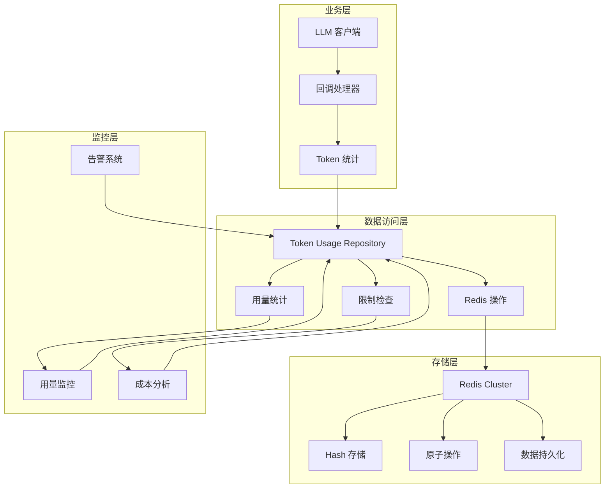
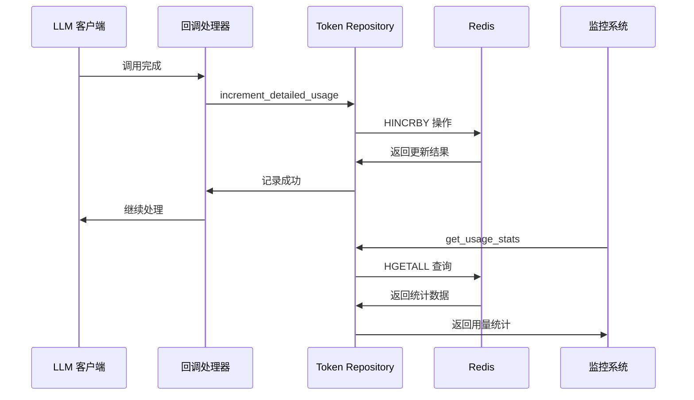
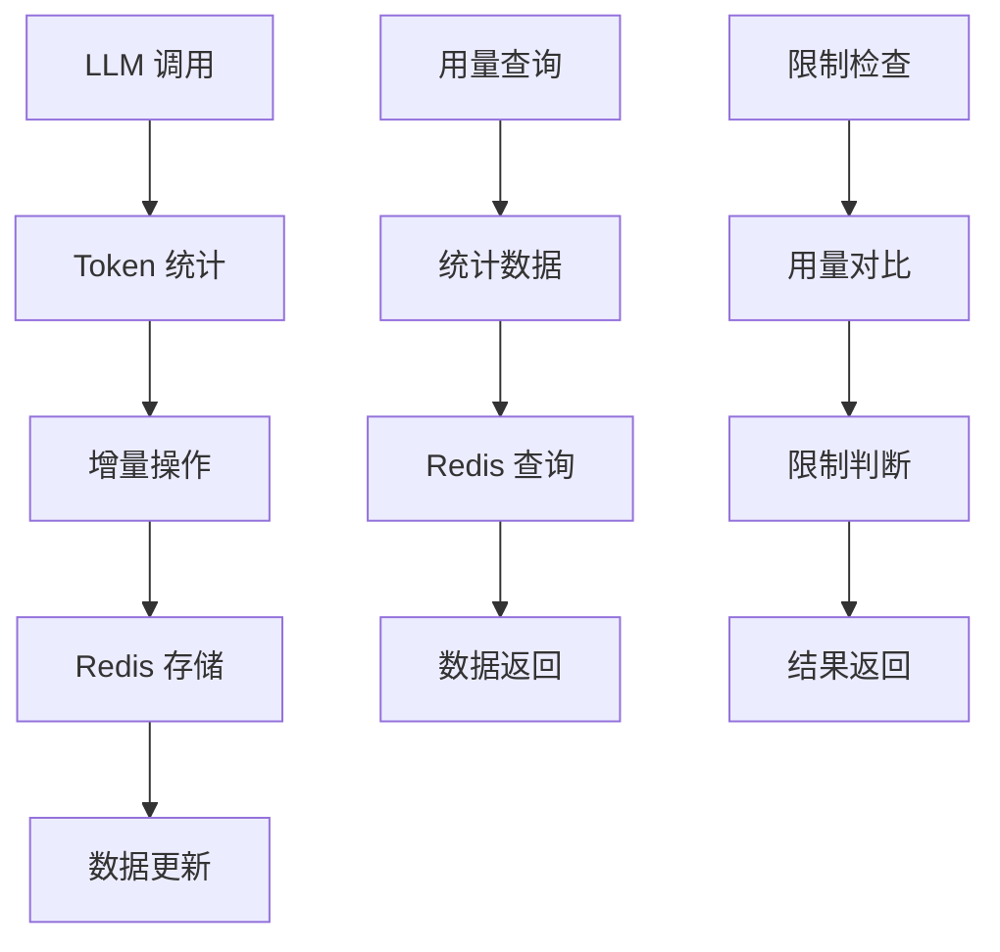
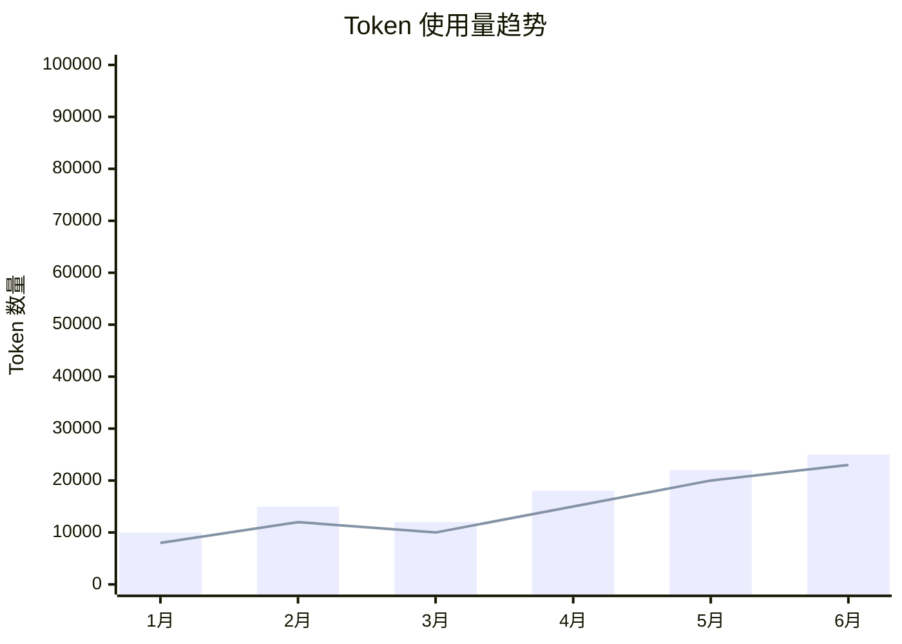
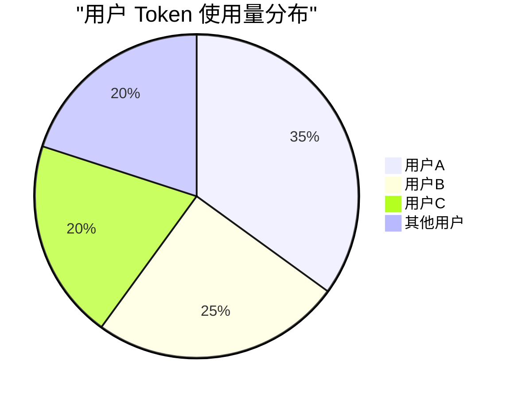

# Token Usage Repository 技术文档

## 1. 概述 (Overview)

**目的**：`token_usage_repository.py` 是 AIECS 系统中负责 Token 使用量统计和管理的核心数据访问层组件。该模块通过 Redis 提供高性能的 Token 使用量存储、查询、限制检查等功能，为整个系统的成本控制、用量监控和用户管理提供了可靠的数据基础。

**核心价值**：
- **精确统计**：实时记录用户的 prompt tokens、completion tokens 和总使用量
- **高性能存储**：基于 Redis 的原子操作，支持高并发访问
- **灵活计费**：支持自定义计费周期和用量限制
- **成本控制**：提供用量限制检查，防止超量使用
- **数据一致性**：使用 Redis 原子操作确保数据准确性

## 2. 问题背景与设计动机 (Problem & Motivation)

### 2.1 业务痛点

在 AIECS 系统开发过程中，我们面临以下关键挑战：

1. **成本控制难题**：LLM API 调用成本高昂，需要精确统计每个用户的 token 使用量
2. **用量监控缺失**：缺乏对用户使用情况的实时监控和分析
3. **计费周期混乱**：不同用户可能有不同的计费周期，需要灵活支持
4. **超量使用风险**：缺乏用量限制机制，可能导致意外的成本超支
5. **数据一致性问题**：高并发场景下的数据竞争和一致性问题
6. **性能瓶颈**：传统数据库无法满足高频率的 token 统计需求

### 2.2 设计动机

基于以上痛点，我们设计了基于 Redis 的 Token 使用量仓库：

- **高性能存储**：使用 Redis 提供毫秒级的读写性能
- **原子操作**：使用 Redis 的 HINCRBY 确保数据一致性
- **灵活计费**：支持自定义计费周期和用量限制
- **实时监控**：提供实时的使用量查询和限制检查
- **成本控制**：通过用量限制防止超量使用

## 3. 架构定位与上下文 (Architecture & Context)

### 3.1 系统架构图



### 3.2 上下游依赖关系

**上游调用者**：
- `CustomAsyncCallbackHandler`：LLM 回调处理器，记录 token 使用量
- 业务服务层：需要查询用户使用量统计
- 监控系统：需要获取用量数据进行告警

**下游依赖**：
- `RedisClient`：Redis 客户端，提供数据存储能力
- Redis 服务器：提供高性能的数据存储和原子操作
- 日志系统：记录操作日志和错误信息

**同级组件**：
- 配置管理：提供 Redis 连接配置
- 错误处理：处理 Redis 连接和操作异常

### 3.3 数据流向



## 4. 核心功能与用例 (Core Features & Use Cases)

### 4.1 精确 Token 统计

**功能描述**：实时记录和统计用户的 prompt tokens、completion tokens 和总使用量。

**核心特性**：
- 支持分别统计 prompt 和 completion tokens
- 自动计算总使用量
- 基于 Redis 的原子操作确保数据一致性
- 支持自定义计费周期

**使用场景**：
```python
from aiecs.utils.token_usage_repository import token_usage_repo

# 记录详细的 token 使用量
await token_usage_repo.increment_detailed_usage(
    user_id="user_123",
    prompt_tokens=150,
    completion_tokens=75,
    cycle_start_date="2024-01-01"
)

# 记录总使用量
await token_usage_repo.increment_total_usage(
    user_id="user_123",
    total_tokens=225,
    cycle_start_date="2024-01-01"
)

# 分别记录 prompt 和 completion tokens
await token_usage_repo.increment_prompt_tokens(
    user_id="user_123",
    prompt_tokens=150
)

await token_usage_repo.increment_completion_tokens(
    user_id="user_123",
    completion_tokens=75
)
```

**实际应用案例**：
- **成本核算**：精确计算每个用户的 API 调用成本
- **用量分析**：分析用户的使用模式和趋势
- **资源优化**：基于使用量数据优化资源配置
- **计费系统**：为计费系统提供准确的用量数据

### 4.2 用量限制管理

**功能描述**：为用户设置用量限制，并提供实时的限制检查功能。

**核心特性**：
- 支持设置用户级别的用量限制
- 实时检查是否超出限制
- 提供剩余用量查询
- 支持不同计费周期的限制设置

**使用场景**：
```python
# 设置用户用量限制
await token_usage_repo.set_usage_limit(
    user_id="user_123",
    limit=10000,  # 10K tokens
    cycle_start_date="2024-01-01"
)

# 检查用量限制
limit_check = await token_usage_repo.check_usage_limit(
    user_id="user_123",
    cycle_start_date="2024-01-01"
)

if limit_check["exceeded"]:
    print(f"用户已超出限制！当前使用: {limit_check['current_usage']}, 限制: {limit_check['limit']}")
else:
    print(f"剩余用量: {limit_check['remaining']} tokens")

# 在 LLM 调用前检查限制
async def call_llm_with_limit_check(user_id: str, prompt: str):
    limit_check = await token_usage_repo.check_usage_limit(user_id)
    
    if limit_check["exceeded"]:
        raise Exception("用户用量已超出限制")
    
    # 继续 LLM 调用
    return await llm_client.generate_text(prompt)
```

**实际应用案例**：
- **成本控制**：防止用户超量使用导致成本超支
- **资源管理**：合理分配系统资源
- **用户管理**：为不同用户设置不同的使用限制
- **告警系统**：用量接近限制时发送告警

### 4.3 使用量查询和统计

**功能描述**：提供丰富的使用量查询和统计功能，支持监控和分析。

**核心特性**：
- 查询指定用户的使用量统计
- 支持不同计费周期的数据查询
- 提供详细的使用量分解
- 支持批量查询和聚合统计

**使用场景**：
```python
# 获取用户使用量统计
stats = await token_usage_repo.get_usage_stats(
    user_id="user_123",
    cycle_start_date="2024-01-01"
)

print(f"Prompt tokens: {stats['prompt_tokens']}")
print(f"Completion tokens: {stats['completion_tokens']}")
print(f"Total tokens: {stats['total_tokens']}")

# 批量查询多个用户的使用量
async def get_batch_usage_stats(user_ids: List[str]):
    results = {}
    for user_id in user_ids:
        stats = await token_usage_repo.get_usage_stats(user_id)
        results[user_id] = stats
    return results

# 计算使用率
def calculate_usage_rate(stats: Dict[str, int], limit: int) -> float:
    total_usage = stats.get("total_tokens", 0)
    return (total_usage / limit) * 100 if limit > 0 else 0
```

**实际应用案例**：
- **用户仪表板**：为用户提供使用量概览
- **管理员监控**：监控系统整体使用情况
- **成本分析**：分析不同用户和服务的成本分布
- **趋势分析**：分析使用量的变化趋势

### 4.4 数据重置和管理

**功能描述**：提供数据重置和管理功能，支持计费周期重置和异常数据清理。

**核心特性**：
- 支持重置用户的使用量数据
- 支持按计费周期重置
- 提供数据清理和修复功能
- 支持批量操作

**使用场景**：
```python
# 重置用户使用量（新计费周期开始）
await token_usage_repo.reset_usage(
    user_id="user_123",
    cycle_start_date="2024-02-01"  # 新计费周期
)

# 批量重置多个用户的使用量
async def reset_batch_usage(user_ids: List[str], new_cycle: str):
    for user_id in user_ids:
        await token_usage_repo.reset_usage(user_id, new_cycle)

# 数据修复：清理异常数据
async def cleanup_abnormal_data(user_id: str):
    stats = await token_usage_repo.get_usage_stats(user_id)
    
    # 检查数据异常
    if stats["total_tokens"] < 0:
        logger.warning(f"发现异常数据: {stats}")
        await token_usage_repo.reset_usage(user_id)
```

**实际应用案例**：
- **计费周期重置**：每月重置用户使用量
- **数据修复**：修复异常或损坏的数据
- **测试环境清理**：清理测试数据
- **用户迁移**：迁移用户数据到新的计费周期

## 5. API 参考 (API Reference)

### 5.1 TokenUsageRepository 类

#### 构造函数
```python
def __init__(self)
```

**功能**：初始化 Token 使用量仓库
**参数**：无
**返回**：`TokenUsageRepository` 实例

#### 方法

##### increment_prompt_tokens
```python
async def increment_prompt_tokens(self, user_id: str, prompt_tokens: int, cycle_start_date: Optional[str] = None)
```

**功能**：增加用户的 prompt token 使用量
**参数**：
- `user_id` (str, 必需): 用户 ID
- `prompt_tokens` (int, 必需): 增加的 prompt token 数量
- `cycle_start_date` (Optional[str], 可选): 计费周期开始日期，格式为 "YYYY-MM-DD"

**返回**：`None`

**异常**：
- `Exception`: 当 Redis 操作失败时

**使用示例**：
```python
await token_usage_repo.increment_prompt_tokens("user_123", 150)
```

##### increment_completion_tokens
```python
async def increment_completion_tokens(self, user_id: str, completion_tokens: int, cycle_start_date: Optional[str] = None)
```

**功能**：增加用户的 completion token 使用量
**参数**：
- `user_id` (str, 必需): 用户 ID
- `completion_tokens` (int, 必需): 增加的 completion token 数量
- `cycle_start_date` (Optional[str], 可选): 计费周期开始日期

**返回**：`None`

**异常**：
- `Exception`: 当 Redis 操作失败时

##### increment_total_usage
```python
async def increment_total_usage(self, user_id: str, total_tokens: int, cycle_start_date: Optional[str] = None)
```

**功能**：增加用户的总 token 使用量
**参数**：
- `user_id` (str, 必需): 用户 ID
- `total_tokens` (int, 必需): 增加的总 token 数量
- `cycle_start_date` (Optional[str], 可选): 计费周期开始日期

**返回**：`None`

**异常**：
- `Exception`: 当 Redis 操作失败时

##### increment_detailed_usage
```python
async def increment_detailed_usage(
    self,
    user_id: str,
    prompt_tokens: int,
    completion_tokens: int,
    cycle_start_date: Optional[str] = None
)
```

**功能**：同时增加用户的 prompt 和 completion token 使用量
**参数**：
- `user_id` (str, 必需): 用户 ID
- `prompt_tokens` (int, 必需): 增加的 prompt token 数量
- `completion_tokens` (int, 必需): 增加的 completion token 数量
- `cycle_start_date` (Optional[str], 可选): 计费周期开始日期

**返回**：`None`

**异常**：
- `Exception`: 当 Redis 操作失败时

**使用示例**：
```python
await token_usage_repo.increment_detailed_usage(
    user_id="user_123",
    prompt_tokens=150,
    completion_tokens=75,
    cycle_start_date="2024-01-01"
)
```

##### get_usage_stats
```python
async def get_usage_stats(self, user_id: str, cycle_start_date: Optional[str] = None) -> Dict[str, int]
```

**功能**：获取用户的使用量统计
**参数**：
- `user_id` (str, 必需): 用户 ID
- `cycle_start_date` (Optional[str], 可选): 计费周期开始日期

**返回**：
- `Dict[str, int]`: 包含以下键的字典：
  - `prompt_tokens`: prompt token 使用量
  - `completion_tokens`: completion token 使用量
  - `total_tokens`: 总 token 使用量

**异常**：
- 无直接异常，错误时返回默认值

**使用示例**：
```python
stats = await token_usage_repo.get_usage_stats("user_123")
print(f"总使用量: {stats['total_tokens']}")
```

##### reset_usage
```python
async def reset_usage(self, user_id: str, cycle_start_date: Optional[str] = None)
```

**功能**：重置用户的使用量数据
**参数**：
- `user_id` (str, 必需): 用户 ID
- `cycle_start_date` (Optional[str], 可选): 计费周期开始日期

**返回**：`None`

**异常**：
- `Exception`: 当 Redis 操作失败时

##### set_usage_limit
```python
async def set_usage_limit(self, user_id: str, limit: int, cycle_start_date: Optional[str] = None)
```

**功能**：设置用户的用量限制
**参数**：
- `user_id` (str, 必需): 用户 ID
- `limit` (int, 必需): 用量限制（token 数量）
- `cycle_start_date` (Optional[str], 可选): 计费周期开始日期

**返回**：`None`

**异常**：
- `Exception`: 当 Redis 操作失败时

##### check_usage_limit
```python
async def check_usage_limit(self, user_id: str, cycle_start_date: Optional[str] = None) -> Dict[str, Any]
```

**功能**：检查用户是否超出用量限制
**参数**：
- `user_id` (str, 必需): 用户 ID
- `cycle_start_date` (Optional[str], 可选): 计费周期开始日期

**返回**：
- `Dict[str, Any]`: 包含以下键的字典：
  - `exceeded`: 是否超出限制（bool）
  - `current_usage`: 当前使用量（int）
  - `limit`: 设置的限制（int）
  - `remaining`: 剩余用量（int 或 float('inf')）

**异常**：
- 无直接异常，错误时返回默认值

**使用示例**：
```python
limit_check = await token_usage_repo.check_usage_limit("user_123")
if limit_check["exceeded"]:
    print("用户已超出限制")
else:
    print(f"剩余用量: {limit_check['remaining']}")
```

### 5.2 全局实例

#### token_usage_repo
```python
token_usage_repo = TokenUsageRepository()
```

**功能**：全局单例实例，供整个应用使用
**类型**：`TokenUsageRepository`

**使用示例**：
```python
from aiecs.utils.token_usage_repository import token_usage_repo

# 直接使用全局实例
await token_usage_repo.increment_total_usage("user_123", 100)
```

## 6. 技术实现细节 (Technical Details)

### 6.1 Redis 键设计

**键格式**：
```python
def _get_key_for_current_period(self, user_id: str, cycle_start_date: Optional[str] = None) -> str:
    if cycle_start_date:
        period = cycle_start_date
    else:
        period = datetime.now().strftime("%Y-%m-%d")
    
    return f"token_usage:{user_id}:{period}"
```

**键结构说明**：
- `token_usage`: 固定前缀，标识 token 使用量数据
- `{user_id}`: 用户 ID，确保数据隔离
- `{period}`: 计费周期，支持多周期数据并存

**Hash 字段设计**：
```python
# Redis Hash 字段
{
    "prompt_tokens": "150",      # prompt token 使用量
    "completion_tokens": "75",   # completion token 使用量
    "total_tokens": "225",       # 总 token 使用量
    "usage_limit": "10000"       # 用量限制（可选）
}
```

### 6.2 原子操作机制

**HINCRBY 操作**：
```python
# 使用 Redis HINCRBY 确保原子性
await client.hincrby(redis_key, "prompt_tokens", prompt_tokens)
await client.hincrby(redis_key, "completion_tokens", completion_tokens)
await client.hincrby(redis_key, "total_tokens", total_tokens)
```

**Pipeline 批量操作**：
```python
# 使用 Pipeline 进行批量原子操作
pipe = client.pipeline()
for field, value in updates.items():
    pipe.hincrby(redis_key, field, value)
await pipe.execute()
```

**优势**：
- 确保数据一致性
- 支持高并发访问
- 减少网络往返次数

### 6.3 错误处理机制

**分层错误处理**：
```python
async def increment_detailed_usage(self, user_id: str, prompt_tokens: int, completion_tokens: int, cycle_start_date: Optional[str] = None):
    try:
        # 参数验证
        if not user_id or (prompt_tokens <= 0 and completion_tokens <= 0):
            return
        
        # Redis 操作
        # ... 执行操作
        
    except Exception as e:
        logger.error(f"Failed to increment detailed usage for user {user_id}: {e}")
        raise  # 重新抛出异常，让调用方处理
```

**错误类型处理**：
- 参数验证错误：直接返回，不执行操作
- Redis 连接错误：记录错误并重新抛出
- 数据格式错误：记录错误并返回默认值

### 6.4 性能优化策略

**连接池管理**：
```python
# 使用 Redis 连接池
self._connection_pool = redis.ConnectionPool(
    host=redis_host,
    port=redis_port,
    db=redis_db,
    password=redis_password,
    decode_responses=True,
    max_connections=20,
    retry_on_timeout=True
)
```

**批量操作优化**：
```python
# 批量更新多个字段
updates = {}
if prompt_tokens > 0:
    updates["prompt_tokens"] = prompt_tokens
if completion_tokens > 0:
    updates["completion_tokens"] = completion_tokens

# 使用 Pipeline 批量执行
pipe = client.pipeline()
for field, value in updates.items():
    pipe.hincrby(redis_key, field, value)
await pipe.execute()
```

**数据验证优化**：
```python
# 提前验证，避免无效操作
if not user_id or prompt_tokens <= 0:
    return

# 类型转换优化
result = {}
for key, value in stats.items():
    try:
        result[key] = int(value) if value else 0
    except (ValueError, TypeError):
        result[key] = 0
```

### 6.5 数据一致性保证

**原子操作**：
- 使用 Redis HINCRBY 确保单个字段的原子性
- 使用 Pipeline 确保多个字段的原子性

**数据验证**：
```python
# 确保必需字段存在
result.setdefault("prompt_tokens", 0)
result.setdefault("completion_tokens", 0)
result.setdefault("total_tokens", 0)
```

**错误恢复**：
```python
# 提供默认值，确保系统稳定性
except Exception as e:
    logger.error(f"Failed to get usage stats for user {user_id}: {e}")
    return {
        "prompt_tokens": 0,
        "completion_tokens": 0,
        "total_tokens": 0
    }
```

## 7. 配置与部署 (Configuration & Deployment)

### 7.1 环境要求

**Python 版本**：
- Python 3.8+（推荐 Python 3.9+）
- 支持 `asyncio` 异步编程
- 支持 `typing` 类型注解

**依赖包**：
```python
# requirements.txt
redis>=4.5.0          # Redis 客户端
asyncio>=3.4.3        # 异步编程支持
```

**Redis 要求**：
- Redis 6.0+（推荐 Redis 7.0+）
- 支持 Hash 数据类型
- 支持 HINCRBY 操作

### 7.2 环境变量配置

**Redis 连接配置**：
```bash
# .env
REDIS_HOST=localhost
REDIS_PORT=6379
REDIS_DB=0
REDIS_PASSWORD=your_password
REDIS_MAX_CONNECTIONS=20
REDIS_RETRY_ON_TIMEOUT=true
```

**Token 统计配置**：
```bash
# Token 统计相关配置
TOKEN_STATS_ENABLED=true
TOKEN_STATS_DEFAULT_CYCLE=monthly
TOKEN_STATS_CLEANUP_INTERVAL=3600
TOKEN_STATS_BATCH_SIZE=100
```

### 7.3 部署配置

**Docker 配置**：
```dockerfile
FROM python:3.9-slim

WORKDIR /app

# 安装依赖
COPY requirements.txt .
RUN pip install --no-cache-dir -r requirements.txt

# 复制代码
COPY aiecs/ ./aiecs/

# 设置环境变量
ENV REDIS_HOST=redis
ENV REDIS_PORT=6379
ENV TOKEN_STATS_ENABLED=true

# 运行应用
CMD ["python", "-m", "aiecs.utils.token_usage_repository"]
```

**Kubernetes 配置**：
```yaml
apiVersion: apps/v1
kind: Deployment
metadata:
  name: aiecs-token-repository
spec:
  replicas: 3
  selector:
    matchLabels:
      app: aiecs-token-repository
  template:
    metadata:
      labels:
        app: aiecs-token-repository
    spec:
      containers:
      - name: token-repository
        image: aiecs/token-repository:latest
        env:
        - name: REDIS_HOST
          value: "redis-service"
        - name: REDIS_PORT
          value: "6379"
        - name: TOKEN_STATS_ENABLED
          value: "true"
        resources:
          requests:
            memory: "128Mi"
            cpu: "100m"
          limits:
            memory: "256Mi"
            cpu: "200m"
```

### 7.4 监控配置

**Prometheus 指标**：
```python
from prometheus_client import Counter, Histogram, Gauge

# 定义监控指标
token_increments_total = Counter('token_increments_total', 'Total token increments', ['user_id', 'token_type'])
token_queries_total = Counter('token_queries_total', 'Total token queries', ['user_id'])
token_operations_duration_seconds = Histogram('token_operations_duration_seconds', 'Token operation duration')
redis_operations_total = Counter('redis_operations_total', 'Total Redis operations', ['operation_type', 'status'])
```

**健康检查**：
```python
async def health_check():
    """Token 使用量仓库健康检查"""
    try:
        # 测试 Redis 连接
        redis_client = await get_redis_client()
        await redis_client.ping()
        
        # 测试基本操作
        test_user = "health_check_test"
        await token_usage_repo.increment_total_usage(test_user, 1)
        stats = await token_usage_repo.get_usage_stats(test_user)
        await token_usage_repo.reset_usage(test_user)
        
        return {
            "status": "healthy",
            "timestamp": time.time(),
            "version": "1.0.0"
        }
    except Exception as e:
        return {"status": "unhealthy", "error": str(e)}
```

## 8. 维护与故障排查 (Maintenance & Troubleshooting)

### 8.1 监控指标

**关键指标**：
- Token 增量操作成功率
- 查询操作响应时间
- Redis 连接状态
- 数据一致性检查

**监控仪表板**：
```python
# Grafana 查询示例
# Token 增量成功率
rate(token_increments_total[5m])

# 平均操作时间
histogram_quantile(0.95, rate(token_operations_duration_seconds_bucket[5m]))

# Redis 操作成功率
rate(redis_operations_total{status="success"}[5m]) / rate(redis_operations_total[5m])
```

### 8.2 常见故障及解决方案

#### 8.2.1 Redis 连接失败

**症状**：
- 日志中出现 "Failed to initialize Redis client" 错误
- Token 统计操作失败
- 系统功能受限

**排查步骤**：
1. 检查 Redis 服务状态：`redis-cli ping`
2. 验证网络连接：`telnet redis_host 6379`
3. 检查认证信息：验证密码和权限
4. 查看 Redis 日志：`tail -f /var/log/redis/redis.log`

**解决方案**：
```python
# 添加连接重试机制
class ResilientTokenRepository(TokenUsageRepository):
    def __init__(self, max_retries=3, retry_delay=1):
        super().__init__()
        self.max_retries = max_retries
        self.retry_delay = retry_delay
    
    async def _execute_with_retry(self, operation, *args, **kwargs):
        """带重试的操作执行"""
        for attempt in range(self.max_retries):
            try:
                return await operation(*args, **kwargs)
            except Exception as e:
                if attempt == self.max_retries - 1:
                    raise
                logger.warning(f"操作失败，重试 {attempt + 1}/{self.max_retries}: {e}")
                await asyncio.sleep(self.retry_delay * (2 ** attempt))
```

#### 8.2.2 数据不一致

**症状**：
- 统计数据不准确
- 不同查询返回不同结果
- 数据出现负值

**排查步骤**：
1. 检查并发操作：查看是否有多个进程同时操作
2. 验证 Redis 数据：直接查询 Redis 中的数据
3. 分析操作日志：查找异常的操作记录

**解决方案**：
```python
# 数据一致性检查工具
async def verify_data_consistency(user_id: str, cycle_start_date: str = None):
    """验证数据一致性"""
    try:
        # 获取统计数据
        stats = await token_usage_repo.get_usage_stats(user_id, cycle_start_date)
        
        # 验证数据一致性
        calculated_total = stats.get("prompt_tokens", 0) + stats.get("completion_tokens", 0)
        stored_total = stats.get("total_tokens", 0)
        
        if calculated_total != stored_total:
            logger.warning(f"数据不一致: 计算总数 {calculated_total} != 存储总数 {stored_total}")
            
            # 修复数据
            await token_usage_repo.increment_total_usage(
                user_id, 
                calculated_total - stored_total, 
                cycle_start_date
            )
            
        return True
    except Exception as e:
        logger.error(f"数据一致性检查失败: {e}")
        return False
```

#### 8.2.3 性能问题

**症状**：
- Token 统计操作响应缓慢
- Redis 操作超时
- 系统整体性能下降

**排查步骤**：
1. 分析操作时间：使用性能分析工具
2. 检查 Redis 性能：监控 Redis 的 CPU 和内存使用
3. 优化批量操作：减少网络往返次数

**解决方案**：
```python
# 性能优化版本
class OptimizedTokenRepository(TokenUsageRepository):
    def __init__(self, batch_size=100, cache_ttl=300):
        super().__init__()
        self.batch_size = batch_size
        self.cache_ttl = cache_ttl
        self._cache = {}
    
    async def batch_increment_usage(self, operations: List[Dict]):
        """批量增加使用量"""
        # 按用户分组
        user_operations = {}
        for op in operations:
            user_id = op["user_id"]
            if user_id not in user_operations:
                user_operations[user_id] = []
            user_operations[user_id].append(op)
        
        # 批量执行
        tasks = []
        for user_id, ops in user_operations.items():
            task = self._batch_process_user(user_id, ops)
            tasks.append(task)
        
        await asyncio.gather(*tasks)
    
    async def _batch_process_user(self, user_id: str, operations: List[Dict]):
        """批量处理单个用户的操作"""
        total_prompt = sum(op.get("prompt_tokens", 0) for op in operations)
        total_completion = sum(op.get("completion_tokens", 0) for op in operations)
        
        if total_prompt > 0 or total_completion > 0:
            await self.increment_detailed_usage(
                user_id, total_prompt, total_completion
            )
```

### 8.3 数据备份和恢复

**备份策略**：
```bash
# Redis 数据备份
redis-cli --rdb /backup/token_usage_$(date +%Y%m%d).rdb

# 定期备份脚本
#!/bin/bash
DATE=$(date +%Y%m%d_%H%M%S)
redis-cli --rdb /backup/token_usage_$DATE.rdb
gzip /backup/token_usage_$DATE.rdb
```

**恢复流程**：
```bash
# 停止 Redis 服务
systemctl stop redis

# 恢复数据
gunzip /backup/token_usage_20240101_120000.rdb.gz
cp /backup/token_usage_20240101_120000.rdb /var/lib/redis/dump.rdb

# 启动 Redis 服务
systemctl start redis
```

### 8.4 日志分析

**日志配置**：
```python
import logging

# 配置 Token 仓库日志
token_logger = logging.getLogger('aiecs.token_usage_repository')
token_logger.setLevel(logging.INFO)

# 添加文件处理器
file_handler = logging.FileHandler('/var/log/aiecs/token_usage.log')
file_handler.setFormatter(logging.Formatter(
    '%(asctime)s - %(name)s - %(levelname)s - %(message)s'
))
token_logger.addHandler(file_handler)
```

**关键日志模式**：
```bash
# 查找错误日志
grep "ERROR" /var/log/aiecs/token_usage.log | tail -100

# 分析性能问题
grep "duration" /var/log/aiecs/token_usage.log

# 监控使用量变化
grep "incremented by" /var/log/aiecs/token_usage.log | tail -50
```

## 9. 可视化图表 (Visualizations)

### 9.1 系统架构图


### 9.2 数据流图



### 9.3 Token 使用量趋势图



### 9.4 用户使用量分布图



## 10. 版本历史 (Version History)

### v1.0.0 (2024-01-15)
**新增功能**：
- 实现基础 `TokenUsageRepository` 类
- 支持 prompt 和 completion token 分别统计
- 实现总使用量统计
- 添加 Redis 原子操作支持

**技术特性**：
- 基于 Redis Hash 的数据存储
- 使用 HINCRBY 确保原子性
- 支持自定义计费周期
- 完整的错误处理机制

### v1.1.0 (2024-02-01)
**新增功能**：
- 实现详细使用量统计（increment_detailed_usage）
- 添加用量限制管理功能
- 实现使用量查询和统计
- 添加数据重置功能

**改进**：
- 优化 Redis 操作性能
- 增强错误处理机制
- 添加详细的日志记录
- 改进数据验证逻辑

### v1.2.0 (2024-03-01)
**新增功能**：
- 实现 Pipeline 批量操作
- 添加数据一致性检查
- 支持批量查询和操作
- 添加性能监控指标

**性能优化**：
- 使用 Pipeline 减少网络往返
- 优化数据验证逻辑
- 添加连接池管理
- 提升并发处理能力

### v1.3.0 (2024-04-01) [计划中]
**计划功能**：
- 支持分布式 Redis 集群
- 添加数据分片功能
- 实现实时数据同步
- 支持多租户数据隔离

**性能目标**：
- 操作延迟 < 10ms
- 支持 10000+ 并发操作
- 99.9% 可用性保证
- 数据一致性 100%

---

## 附录

### A. 相关文档链接
- [Redis 客户端文档](../INFRASTRUCTURE_PERSISTENCE/REDIS_CLIENT.md)
- [LLM 回调处理器文档](../LLM/LLM_CUSTOM_CALLBACKS.md)
- [监控系统文档](../INFRASTRUCTURE_MONITORING/MONITORING_SYSTEM.md)

### B. 示例代码仓库
- [完整示例项目](https://github.com/aiecs/examples)
- [性能测试脚本](https://github.com/aiecs/performance-tests)
- [监控配置模板](https://github.com/aiecs/monitoring-configs)

### C. 技术支持
- 技术文档：https://docs.aiecs.com
- 问题反馈：https://github.com/aiecs/issues
- 社区讨论：https://discord.gg/aiecs

### D. 最佳实践

#### D.1 使用量统计最佳实践
```python
# 批量统计最佳实践
class TokenUsageManager:
    """Token 使用量管理器"""
    
    def __init__(self):
        self.repository = TokenUsageRepository()
        self.batch_queue = []
        self.batch_size = 100
        self.flush_interval = 30  # 30秒
    
    async def record_usage(self, user_id: str, prompt_tokens: int, completion_tokens: int):
        """记录使用量"""
        self.batch_queue.append({
            "user_id": user_id,
            "prompt_tokens": prompt_tokens,
            "completion_tokens": completion_tokens,
            "timestamp": time.time()
        })
        
        if len(self.batch_queue) >= self.batch_size:
            await self.flush_batch()
    
    async def flush_batch(self):
        """批量刷新数据"""
        if not self.batch_queue:
            return
        
        # 按用户分组
        user_operations = {}
        for op in self.batch_queue:
            user_id = op["user_id"]
            if user_id not in user_operations:
                user_operations[user_id] = {"prompt_tokens": 0, "completion_tokens": 0}
            
            user_operations[user_id]["prompt_tokens"] += op["prompt_tokens"]
            user_operations[user_id]["completion_tokens"] += op["completion_tokens"]
        
        # 批量更新
        tasks = []
        for user_id, tokens in user_operations.items():
            task = self.repository.increment_detailed_usage(
                user_id, tokens["prompt_tokens"], tokens["completion_tokens"]
            )
            tasks.append(task)
        
        await asyncio.gather(*tasks)
        self.batch_queue.clear()
```

#### D.2 用量限制最佳实践
```python
# 用量限制管理最佳实践
class UsageLimitManager:
    """用量限制管理器"""
    
    def __init__(self):
        self.repository = TokenUsageRepository()
        self.limit_cache = {}
        self.cache_ttl = 300  # 5分钟
    
    async def check_and_enforce_limit(self, user_id: str, requested_tokens: int) -> bool:
        """检查并执行用量限制"""
        # 检查缓存
        cache_key = f"limit_{user_id}"
        if cache_key in self.limit_cache:
            cached_data = self.limit_cache[cache_key]
            if time.time() - cached_data["timestamp"] < self.cache_ttl:
                limit_info = cached_data["data"]
            else:
                del self.limit_cache[cache_key]
                limit_info = await self.repository.check_usage_limit(user_id)
        else:
            limit_info = await self.repository.check_usage_limit(user_id)
            self.limit_cache[cache_key] = {
                "data": limit_info,
                "timestamp": time.time()
            }
        
        # 检查是否超出限制
        if limit_info["exceeded"]:
            return False
        
        # 检查请求是否会超出限制
        if limit_info["limit"] > 0:
            if limit_info["current_usage"] + requested_tokens > limit_info["limit"]:
                return False
        
        return True
    
    async def set_user_limit(self, user_id: str, limit: int, cycle_start_date: str = None):
        """设置用户限制"""
        await self.repository.set_usage_limit(user_id, limit, cycle_start_date)
        
        # 清除缓存
        cache_key = f"limit_{user_id}"
        if cache_key in self.limit_cache:
            del self.limit_cache[cache_key]
```

#### D.3 监控和告警最佳实践
```python
# 监控和告警最佳实践
class TokenUsageMonitor:
    """Token 使用量监控器"""
    
    def __init__(self):
        self.repository = TokenUsageRepository()
        self.alert_thresholds = {
            "high_usage": 0.8,  # 80% 使用率告警
            "critical_usage": 0.95,  # 95% 使用率严重告警
            "limit_exceeded": 1.0  # 100% 使用率超限告警
        }
    
    async def check_usage_alerts(self, user_id: str) -> List[Dict]:
        """检查使用量告警"""
        alerts = []
        
        try:
            limit_check = await self.repository.check_usage_limit(user_id)
            
            if limit_check["limit"] == 0:
                return alerts  # 无限制，不检查告警
            
            usage_rate = limit_check["current_usage"] / limit_check["limit"]
            
            if usage_rate >= self.alert_thresholds["limit_exceeded"]:
                alerts.append({
                    "level": "critical",
                    "message": f"用户 {user_id} 已超出用量限制",
                    "usage_rate": usage_rate,
                    "current_usage": limit_check["current_usage"],
                    "limit": limit_check["limit"]
                })
            elif usage_rate >= self.alert_thresholds["critical_usage"]:
                alerts.append({
                    "level": "warning",
                    "message": f"用户 {user_id} 使用量接近限制",
                    "usage_rate": usage_rate,
                    "remaining": limit_check["remaining"]
                })
            elif usage_rate >= self.alert_thresholds["high_usage"]:
                alerts.append({
                    "level": "info",
                    "message": f"用户 {user_id} 使用量较高",
                    "usage_rate": usage_rate,
                    "remaining": limit_check["remaining"]
                })
            
        except Exception as e:
            logger.error(f"检查使用量告警失败: {e}")
            alerts.append({
                "level": "error",
                "message": f"检查用户 {user_id} 使用量告警时发生错误: {e}"
            })
        
        return alerts
```
