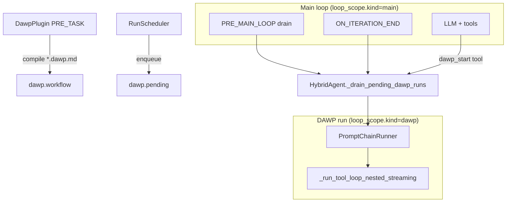

# DAWP (Dynamic Adaptive Work Process)

Developer guide for the `dawp@builtin` plugin — structured sub-workflows inside the HybridAgent tool loop.

**Status:** DAWP-0 … DAWP-3 complete (v2.5.1).

**Design references:**

- [CUSTOM_REASONING_PLUGIN_DESIGN.md](../../../issue_report/new_function_request/agent_system_design/CUSTOM_REASONING_PLUGIN_DESIGN.md) — authoritative spec (D1–D13)
- [workflows/README.md](../../../issue_report/new_function_request/agent_system_design/workflows/README.md) — author templates and `dawp_start` examples
- [baseworkflow.md](../../../issue_report/new_function_request/agent_system_design/workflows/baseworkflow.md) — runtime timeline (§1.1)
- [PLUGIN_SYSTEM.md](./PLUGIN_SYSTEM.md) — plugin framework lifecycle

---

## 1. Architecture

DAWP inserts a **Prompt Chain** (ordered steps from a `*.dawp.md` document) into the main HybridAgent tool loop. Each step runs a nested LLM+tool mini-loop that is **homomorphic** with the main loop: same event types (`iteration_start`, `token`, `tool_result`, …), distinguished by `loop_scope.kind="dawp"`.



### Runtime timeline

See [baseworkflow.md](../../../issue_report/new_function_request/agent_system_design/workflows/baseworkflow.md) for the canonical message/event order within one `execute_task` call:

1. **Main loop** produces responses and tool results.
2. **Trigger** fires (config or tool) → DAWP run drains.
3. **DAWP Prompt Chain** runs step-by-step (Marker completion between steps).
4. **Main loop continues** after DAWP ends (unless `abort_main=True` and run failed).

### Trigger types (only two)

| trigger | Who | Drain timing |
|---------|-----|--------------|
| **config** | Developer (`*.dawp.md` front matter) | `pre_main_loop` (before main loop) or `on_response_trigger` (after `ON_ITERATION_END`) |
| **tool** | Model via **`dawp_start`** | **Inline** — same main-loop iteration, after tool ack |

`workflow_source` (`static` \| `dynamic`) is a **`dawp_start` parameter**, not a trigger enum.

### Key modules

| Module | Role |
|--------|------|
| `aiecs/domain/agent/plugins/builtin/dawp_plugin.py` | Lifecycle hooks, workflow load, `dawp_start` injection |
| `aiecs/domain/agent/plugins/dawp/document_loader.py` | Compile `*.dawp.md` → `DAWPWorkflow` |
| `aiecs/domain/agent/plugins/dawp/prompt_chain_runner.py` | Prompt Chain + Marker state machine |
| `aiecs/domain/agent/plugins/dawp/run_scheduler.py` | Enqueue activations at checkpoints |
| `aiecs/domain/agent/hybrid_agent.py` | Dual drain (`inline` + `on_iteration_end`), nested runner |
| `aiecs/domain/agent/plugins/dawp/stream_consumer.py` | SDK/UI helper for `dawp_run_*` boundary events |
| `aiecs/domain/agent/plugins/dawp/metrics.py` | Prometheus metrics (D3-01) |
| `aiecs/domain/agent/plugins/dawp/step_handlers.py` | Step completion registry — default `marker`; legacy `no_tool_calls` (D3-03) |
| `aiecs/domain/agent/plugins/dawp/step_handoff.py` | Incomplete-run handoff message for main loop (§7) |

**Priority:** `dawp@builtin` = **45** (after `knowledge@40`, before `memory@80`). When Knowledge short-circuits at `PRE_MAIN_LOOP`, DAWP `pre_main_loop` does **not** run.

---

## 2. Authoring `*.dawp.md` workflows

Author source of truth: [dawp-template.dawp.md](../../../issue_report/new_function_request/agent_system_design/workflows/dawp-template.dawp.md).

### Document structure

```text
---
name: My Workflow
placement: pre_main_loop          # or on_response_trigger + dawp_trigger
max_iterations_per_prompt: 4
merge_back: append
---

## Instruction:
Background, purpose, timing, objective.

## Contract
### Action
Shared behavior for every step.
### Prompt Completion Marker: `<STEP_DONE>`
### DAWP Completion Marker: `<DAWP_HANDOFF>`

## Prompt
<Prompt 0>
### Step title
Step body…
</Prompt 0>

## Appendix
Non-executed reference tables.
```

### Front matter (activation)

| Field | Required | Description |
|-------|----------|-------------|
| `name` | yes | Workflow ID (`metadata.name`); used in `workflow_id` matching |
| `placement` | no (default `pre_main_loop`) | `pre_main_loop` or `on_response_trigger` |
| `dawp_trigger` | when `on_response_trigger` | Exact token line the main agent must output |
| `trigger_instruction` | recommended for `on_response_trigger` | System text injected via `BUILD_MESSAGES` |
| `trigger_once` | no (default false) | Prevent re-activation after first match |
| `max_iterations_per_prompt` | no | Per-step iteration cap (shared budget still applies) |
| `merge_back` | no (default `append`) | `append` or `inject_only` (see §4) |

Human-readable `trigger:` / `Trigger conditions:` fields are **documentation only** — they do not affect scheduling.

### Contract grammar

The loader requires this structure (compile errors → `DawpDocumentError`):

```text
### Action
<free text>
### Prompt Completion Marker: `<TOKEN>`    # ≤25 chars, <...> format
### DAWP Completion Marker: `<TOKEN>`      # must differ from prompt marker
```

Markers are detected in assistant output using scannable-line rules (code blocks and blockquotes excluded — §6.0.2.2).

### Example workflows

| File | Placement | Use case |
|------|-----------|----------|
| [dawp-example.dawp.md](../../../issue_report/new_function_request/agent_system_design/workflows/dawp-example.dawp.md) | `pre_main_loop` | First-principles intent analysis before main loop |
| [ooda.dawp.md](../../../issue_report/new_function_request/agent_system_design/workflows/ooda.dawp.md) | `on_response_trigger` | OODA strategic review mid-task |

Compile verification:

```bash
poetry run pytest test/unit/domain/agent/plugins/dawp/test_workflows_compile.py -v
```

---

## 3. PluginConfig options

Enable the plugin on `HybridAgent`:

```python
from aiecs.domain.agent.models import AgentConfiguration
from aiecs.domain.agent.plugins.models import PluginConfig

config = AgentConfiguration(
    llm_model="gpt-4o",
    plugins=[
        PluginConfig(
            name="dawp",
            enabled=True,
            options={
                "document_path": "issue_report/new_function_request/agent_system_design/workflows/dawp-example.dawp.md",
                "stream_boundary_events": True,
                "dynamic_workflow_limits": {
                    "max_prompts": 12,
                    "max_iterations_per_prompt": 6,
                    "max_contract_action_chars": 8000,
                    "max_document_bytes": 256_000,
                    "require_remaining_budget": 3,
                },
            },
        ),
        PluginConfig(name="tool", enabled=True),
        PluginConfig(name="memory", enabled=False),
    ],
)
```

`DawpPlugin` injects **`dawp_start`** into the agent tool registry at `PRE_TASK` (legacy aliases `dawp_run`, `dawp_publish_workflow` forward with deprecation warning).

### Options reference

| Option | Type | Default | Description |
|--------|------|---------|-------------|
| `document_path` | `str` | — | Path to static `*.dawp.md` compiled at `PRE_TASK` |
| `stream_boundary_events` | `bool` | `false` | Emit `dawp_run_started` / `dawp_run_completed` for SDK/UI panels |
| `retain_for_debug` | `bool` | `false` | Keep dynamic workflow temp files after `POST_TASK` |
| `dynamic_workflow_limits` | `dict` | `{}` | D11 hard limits for `workflow_source=dynamic` (see below) |
| `enqueue_guard` | `dict` | — | Guard for **config and tool** enqueue paths: `allowed_workflows`, `max_runs_per_task`, `require_remaining_budget` (§4.1.2) |
| `allowed_document_roots` | `list[str]` | — | Extra directories allowed for `dawp_start(static, document_path=...)`; plugin `document_path` is always allowed |
| `inject_mode` | `str` | — | Reserved / design (`messages`) |
| `fail_fast` | `bool` | — | Reserved (not implemented) |
| `abort_main` | `bool` | — | When true on a pending run, DAWP failure aborts entire task (D3) |

**Front matter options** (in `*.dawp.md`, not `PluginConfig`): `merge_back`, `max_iterations_per_prompt`, `placement`, `dawp_trigger`, `trigger_once`.

### `dynamic_workflow_limits` (D11)

Applied when the model calls `dawp_start(workflow_source="dynamic", document_content=...)`.

| Key | Description |
|-----|-------------|
| `max_prompts` | Max `<Prompt N>` blocks |
| `max_iterations_per_prompt` | Default per-step cap for dynamic docs |
| `max_contract_action_chars` | Max `Contract.action` length |
| `max_document_bytes` | Max raw document size |
| `require_remaining_budget` | Reject dynamic start if shared budget below threshold |

Violation → tool returns `{"status": "rejected", "reason": "..."}`; no pending run enqueued.

### Context / task overrides

**Deferred (2026-06-07):** per-task `dawp_document` / `dawp_document_content` / `dawp_disable` are **not** read at runtime. Use `PluginConfig.document_path` or `dawp_start` instead.

### Step failure handoff

When a step fails (iteration cap without marker, or shared budget exhausted), the DAWP run **stops** — later steps do **not** run. A standard **user** message is appended to the conversation (or merged on `inject_only` drain) listing completed and incomplete step titles; the **main loop continues** and the LLM decides next actions. Set `abort_main=True` on a pending run only when DAWP failure must fail the entire task.

---

## 4. `dawp_start` tool

Registered automatically when `dawp` plugin is enabled. Sole model-facing DAWP trigger.

### Parameters

| Parameter | Required | Description |
|-----------|----------|-------------|
| `workflow_source` | **yes** | `"static"` or `"dynamic"` |
| `workflow_id` | static | Match `metadata.name` of pre-loaded workflow |
| `document_path` | static | Alternative to `workflow_id` |
| `document_content` | dynamic | Full `*.dawp.md` text |

### static example

```json
{
  "name": "dawp_start",
  "arguments": {
    "workflow_source": "static",
    "workflow_id": "First Principles Intent Analysis"
  }
}
```

### dynamic example

```json
{
  "name": "dawp_start",
  "arguments": {
    "workflow_source": "dynamic",
    "document_content": "---\nname: Ad-hoc Review\nplacement: pre_main_loop\n---\n\n## Contract\n..."
  }
}
```

### D13 — sole tool call

`dawp_start` **must be the only tool call** in its iteration. If the model emits `dawp_start` alongside other tools:

```json
{"status": "rejected", "reason": "dawp_start must be the sole tool_call in this iteration"}
```

No pending run is enqueued; no inline drain. Complete other tools first, then call `dawp_start` alone in the next turn.

### D12 — `suppress_from_llm`

On success the handler returns:

```json
{
  "status": "accepted",
  "workflow_id": "...",
  "workflow_source": "static",
  "suppress_from_llm": true
}
```

HybridAgent **pair-removes** the assistant `tool_calls` message and matching `tool_result` from the next LLM `messages` list. Streaming events and audit `state.steps` retain the full tool pair.

### D10 — no nested DAWP

Inside an active DAWP run (`loop_scope.kind=dawp`), `dawp_start` is filtered from tool schemas and rejected if called.

---

## 5. Streaming and SDK consumption

### Homomorphic events (R3)

DAWP segments emit the same event types as the main loop, with `loop_scope`:

```python
async for event in agent.execute_task_streaming(task, context):
    scope = event.get("loop_scope") or {"kind": "main"}
    if event["type"] == "token":
        render_token(event["content"], kind=scope["kind"])
```

### Boundary events (production UI)

**Run-level** (`stream_boundary_events=True`):

| Event | Purpose |
|-------|---------|
| `dawp_run_started` | Open DAWP panel (`run_id`, `workflow_id`, `placement`, `trigger`) |
| `dawp_run_completed` | Close panel (`success`, `step_summaries`) |

**Step-level** (always emitted by `PromptChainRunner`):

| Event | Purpose |
|-------|---------|
| `dawp_step_started` | Step open (`step_id`, `step_index`) — UI highlight / fold |
| `dawp_step_completed` | Step close (`success`) |

Recommended SDK helper:

```python
from aiecs.domain.agent.plugins.dawp import DawpStreamConsumer, effective_loop_scope

consumer = DawpStreamConsumer(
    on_run_started=lambda p: ui.open_dawp_panel(p.run_id),
    on_run_completed=lambda p: ui.close_dawp_panel(p.run_id),
    on_step_started=lambda p, e: ui.highlight_step(p.run_id, e["step_id"]),
    on_step_completed=lambda p, e: ui.clear_step_highlight(p.run_id),
)
```

See [STREAMING.md](../../user/DOMAIN_AGENT/STREAMING.md) for general streaming patterns.

### merge_back

| Mode | Behavior |
|------|----------|
| `append` (default) | DAWP messages merged into main `messages` in-place |
| `inject_only` | DAWP runs on a copy; only `[DAWP {workflow_id}: run complete]` appended to main |

---

## 6. Observability (D3-01)

When `prometheus_client` is installed:

| Metric | Labels |
|--------|--------|
| `dawp_run_total` | `workflow_id`, `trigger`, `workflow_source` |
| `dawp_run_failed_total` | same (runs without DAWP Completion Marker) |
| `dawp_step_duration_seconds` | same (histogram per prompt step) |

```python
from aiecs.domain.agent.plugins.dawp.metrics import get_dawp_metrics
get_dawp_metrics().record_run(...)  # normally called by HybridAgent drain
```

---

## 7. Test commands

From DAWP-2 Definition of Done (D2-T):

```bash
# DAWP unit + integration
poetry run pytest test/unit/domain/agent/plugins/dawp/ test/integration/domain/agent/test_dawp_*.py -v --tb=short

# Hybrid agent regression
poetry run pytest test/unit/domain/agent/test_hybrid_agent*.py -q

# Plugin parity (hybrid)
poetry run pytest test/unit/domain/agent/plugins/test_plugin_parity.py -m plugin_parity -k hybrid -v --tb=short

# Workflow compile (author docs)
poetry run pytest test/unit/domain/agent/plugins/dawp/test_workflows_compile.py -v

# Safety-focused subsets
poetry run pytest test/unit/domain/agent/plugins/dawp/ -v -k "suppress or exclusive or dynamic_limits or metrics"
```

Key test files:

| Area | Test file |
|------|-----------|
| D12 suppress | `test_suppress_from_llm.py` |
| D13 exclusive | `test_dawp_start_exclusive.py` |
| D10 tools filter | `test_tools_filter.py` |
| D11 dynamic limits | `test_dynamic_limits.py` |
| Inline drain | `test_inline_drain.py` |
| Streaming E2E | `test/integration/domain/agent/test_dawp_streaming_e2e.py` |
| Failure / merge_back | `test/integration/domain/agent/test_dawp_failure_modes.py` |
| Non-streaming parity | `test/unit/domain/agent/test_hybrid_agent_dawp.py` |
| Knowledge priority | `test/unit/domain/agent/plugins/test_dawp_knowledge_priority.py` |
| SDK consumer | `test/unit/domain/agent/plugins/dawp/test_stream_consumer.py` |
| Metrics | `test/unit/domain/agent/plugins/dawp/test_metrics.py` |

---

## 8. Quick start

```python
from aiecs.domain.agent import HybridAgent, AgentConfiguration
from aiecs.domain.agent.plugins.models import PluginConfig

config = AgentConfiguration(
    llm_model="gpt-4o",
    plugins=[
        PluginConfig(
            name="dawp",
            enabled=True,
            options={
                "document_path": "issue_report/new_function_request/agent_system_design/workflows/dawp-example.dawp.md",
                "stream_boundary_events": True,
            },
        ),
        PluginConfig(name="tool", enabled=True),
    ],
)

agent = HybridAgent(
    agent_id="dev-1",
    name="Dev",
    llm_client=client,
    tools=["search"],  # dawp_start added by plugin at PRE_TASK
    config=config,
)
await agent.initialize()

result = await agent.execute_task(
    {"description": "Analyze the user request before heavy tool use"},
    {"session_id": "s1"},
)
```

For mid-task OODA-style workflows, use `ooda.dawp.md` (`on_response_trigger`) and ensure the main agent outputs the configured `dawp_trigger` token when ready.
