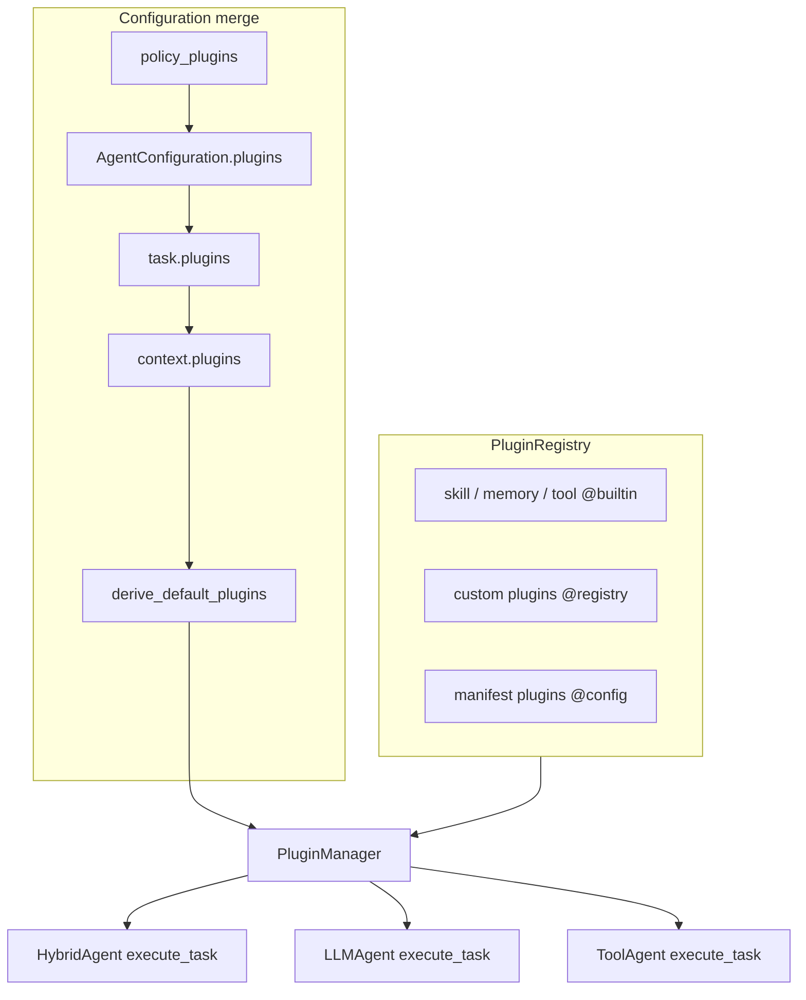

# Agent Plugin System

Developer guide for the AIECS agent plugin framework (`aiecs/domain/agent/plugins/`).

**Status:** Phase 1–3 implemented (HybridAgent, LLMAgent, ToolAgent, manifest loading, parity gate).

**Design references:**

- [PLUGIN_SYSTEM_DESIGN.md](../../../issue_report/new_function_request/PLUGIN_SYSTEM_DESIGN.md) — authoritative spec
- [PLUGIN_SYSTEM_PHASE3_TASKS.md](../../../issue_report/new_function_request/PLUGIN_SYSTEM_PHASE3_TASKS.md) — Phase 3 task breakdown

---

## 1. Architecture

The plugin system wraps agent lifecycle hooks in a small in-process framework. Three core components cooperate:

| Component | Role |
|-----------|------|
| **PluginRegistry** | Maps short plugin names to factory classes (`BaseAgentPlugin` subclasses). Registration does **not** enable a plugin. |
| **PluginManager** | Resolves enabled plugins from config, runs hooks by **PluginPhase**, and collects load results. |
| **AgentPluginContext** | Per-task context: `task`, `context`, `task_description`, `plugin_state`, optional `event_sink`. |



### PluginPhase lifecycle

Hooks run in a fixed phase order during agent startup and each task:

| Phase | Typical use |
|-------|-------------|
| `AGENT_INIT` | Attach skills, load tool schemas, create memory |
| `AGENT_SHUTDOWN` | Detach skills, release resources (reverse init order) |
| `PRE_TASK` | Load session history, augment task context |
| `BUILD_MESSAGES` | Inject skill/memory context into LLM messages |
| `PRE_MAIN_LOOP` | Filter tool schemas; short-circuit allowed |
| `ON_ITERATION_START` / `ON_ITERATION_END` | Tool-loop instrumentation (Hybrid / Tool FC) |
| `POST_TASK` | Persist memory, normalize execute_task shell |

**Builtin init order** (independent of `priority`): `tool` → `skill` → `memory`. Other plugins initialize afterward, sorted by effective priority ascending.

### Agent execute paths (Phase 3)

| Agent | Plugin phases per task |
|-------|------------------------|
| **HybridAgent** | PRE_TASK → PRE_MAIN_LOOP → BUILD_MESSAGES → tool loop (ON_ITERATION_*) → POST_TASK |
| **LLMAgent** | PRE_TASK → BUILD_MESSAGES → single LLM call → POST_TASK (no PRE_MAIN_LOOP) |
| **ToolAgent (LLM FC)** | PRE_TASK → PRE_MAIN_LOOP → BUILD_MESSAGES → FC iteration → POST_TASK |
| **ToolAgent (direct invoke)** | PRE_TASK → POST_TASK only (no BUILD_MESSAGES) |

---

## 2. AgentConfiguration.plugins and legacy fields

`AgentConfiguration.plugins` is a list of `PluginConfig` entries:

```python
from aiecs.domain.agent.plugins.models import PluginConfig

PluginConfig(
    name="memory",           # short name; full ID is name@origin
    enabled=True,
    priority=None,           # optional override; default from PluginMetadata
    options={},              # plugin-specific options
)
```

### Semantics

| `plugins` value | Behavior |
|-----------------|----------|
| **Omitted / `[]`** | Derive defaults from legacy fields (`memory_enabled`, `skills_enabled`, `tools`, …). Does **not** mean “disable all plugins”. |
| **Partial list** | Explicit entries win; missing builtin names (`memory`, `skill`, `tool`) are filled from `derive_default_plugins()`. |
| **Full explicit list** | Only listed plugins are configured; still merged with policy/task/context overlays. |

### Legacy → PluginConfig.options mapping (§6.4)

| Legacy field (`AgentConfiguration`) | Target plugin | `options` key |
|-------------------------------------|---------------|---------------|
| `memory_capacity` | memory | `capacity` |
| `memory_ttl_seconds` | memory | `ttl_seconds` |
| `memory_enabled` | memory | controls `enabled` only |
| `skill_names` | skill | `skill_names` |
| `skill_auto_register_tools` | skill | `auto_register_tools` |
| `skill_inject_script_paths` | skill | `inject_script_paths` |
| `skill_context_max_skills` | skill | `context_max_skills` |
| `skills_enabled` | skill | controls `enabled` only |
| `allowed_tools` | tool | `allowed_tools` |
| `tool_selection_strategy` | tool | `tool_selection_strategy` |
| Agent constructor `tools` | tool | controls `enabled` (non-empty tools required) |

Explicit `plugins[].options` override derived values for the same key.

### External manifests (Phase 3)

Optional config fields load `aiecs-plugin.yaml` / `plugin.json` at agent init:

```python
AgentConfiguration(
    plugin_manifest_paths=["/path/to/sample_aiecs-plugin.yaml"],
    extra_plugin_dirs=["/path/to/plugin-dir"],  # scans for aiecs-plugin.yaml
)
```

Manifest registration uses `PluginRegistry.register_from_manifest()` and defaults to **`enabled=False`**. Enable explicitly in `plugins` or task/context overlays.

---

## 3. Config merge priority and merge_log

`derive_plugin_configs(config, agent, task=..., context=...)` returns `(plugin_configs, merge_log)`.

**Priority (high → low):**

1. **`policy_plugins`** — applied last; wins on conflict. Supports `policy_locked` and `locked_options`.
2. **`AgentConfiguration.plugins`** (+ partial derive fill for missing builtins)
3. **`task["plugins"]`**, then **`context["plugins"]`** (context wins over task for the same name)
4. **`derive_default_plugins()`** from legacy fields

Each overlay fully replaces the prior entry for the same `name` unless policy rejects the change (rejection is recorded in `merge_log`).

### Example A — task disables skill for one request

```python
from aiecs.domain.agent.plugins.defaults import derive_plugin_configs
from aiecs.domain.agent.plugins.models import PluginConfig

config = agent._config.model_copy(update={
    "plugins": [
        PluginConfig(name="skill", enabled=True, options={"skill_names": ["python-testing"]}),
    ],
})
task = {"plugins": [PluginConfig(name="skill", enabled=False)]}

merged, merge_log = derive_plugin_configs(config, agent, task=task)
# merged["skill"].enabled is False
# merge_log contains an entry like: "task.plugins overlay replaced 'skill'"
```

### Example B — context overrides task for memory

```python
task = {"plugins": [PluginConfig(name="memory", enabled=False)]}
context = {"plugins": [PluginConfig(name="memory", enabled=True)]}

merged, merge_log = derive_plugin_configs(config, agent, task=task, context=context)
# merged["memory"].enabled is True
# merge_log records both task.plugins and context.plugins overlays
```

### Example C — policy locks memory off

```python
config = agent._config.model_copy(update={
    "plugins": [PluginConfig(name="memory", enabled=True)],
    "policy_plugins": [
        PluginConfig(name="memory", enabled=False, policy_locked=True),
    ],
})

merged, merge_log = derive_plugin_configs(config, agent)
# merged["memory"].enabled is False (policy wins)
```

During streaming, a summary may appear as `plugin_config_resolved` with `merge_log_summary`. Per-task state can also use `ctx.plugin_state["plugin.merge_log"]` when agents propagate it.

---

## 4. Minimal custom AuditPlugin

Register a custom plugin, enable it in config, and hook `ON_ITERATION_END` during HybridAgent tool loops:

```python
from typing import Any, ClassVar

from aiecs.domain.agent import HybridAgent, AgentConfiguration
from aiecs.domain.agent.plugins.base import BaseAgentPlugin
from aiecs.domain.agent.plugins.context import AgentPluginContext
from aiecs.domain.agent.plugins.models import PluginConfig, PluginMetadata
from aiecs.domain.agent.plugins.registry import PluginRegistry


class AuditPlugin(BaseAgentPlugin):
    metadata: ClassVar[PluginMetadata] = PluginMetadata(
        name="audit",
        version="1.0.0",
        description="Log tool-loop steps",
        priority=200,
    )

    async def on_iteration_end(
        self,
        ctx: AgentPluginContext,
        iteration: int,
        step: dict[str, Any],
    ) -> None:
        ctx.plugin_state.setdefault("audit.log", []).append(
            {"iteration": iteration, "kind": step.get("kind")}
        )


registry = PluginRegistry.default()
registry.register("audit", AuditPlugin, origin="registry")

config = AgentConfiguration(
    goal="Audit example",
    llm_model="gpt-4o",
    plugins=[
        PluginConfig(name="memory", enabled=False),
        PluginConfig(name="skill", enabled=False),
        PluginConfig(name="audit", enabled=True),
    ],
)

agent = HybridAgent(
    agent_id="audit-demo",
    name="Audit Demo",
    llm_client=client,
    tools=["search"],
    config=config,
    plugin_registry=registry,
)
await agent.initialize()
```

**Important:** `registry.register()` alone does **not** load the plugin. You must set `PluginConfig(name="audit", enabled=True)` in `AgentConfiguration.plugins`, task, or context. Logs and IDs use the full form **`audit@registry`**.

---

## 5. Parity golden tests and CI commands

Run these commands before opening or merging a PR that touches the agent plugin system. **Use the explicit parity file path** — repo-wide `pytest -m plugin_parity` can miss or deselect cases during collection.

### Standard plugin CI gate (copy-paste)

```bash
# All plugin unit tests
poetry run pytest test/unit/domain/agent/plugins/ -v --tb=short

# Golden snapshot parity (Hybrid + LLM + Tool fixtures)
poetry run pytest test/unit/domain/agent/plugins/test_plugin_parity.py -m plugin_parity -v --tb=short

# Agent integration tests (plugin-wired execute paths)
poetry run pytest test/unit/domain/agent/test_hybrid_agent*.py \
    test/unit/domain/agent/test_llm_agent*.py \
    test/unit/domain/agent/test_tool_agent*.py -v --tb=short

# Static typing for plugin and agent integration surfaces
poetry run mypy aiecs/domain/agent/plugins/ \
    aiecs/domain/agent/hybrid_agent.py \
    aiecs/domain/agent/llm_agent.py \
    aiecs/domain/agent/tool_agent.py \
    aiecs/domain/agent/base_agent.py
```

See also [CONTRIBUTING.md](../../../CONTRIBUTING.md#agent-plugin-system-ci) at the repository root.

### Parity fixtures

| Prefix | Agent | Coverage |
|--------|-------|----------|
| `hybrid_*` | HybridAgent | messages, schemas, shell, streaming phases |
| `llm_*` | LLMAgent | memory paths, execute_task shell |
| `tool_*` | ToolAgent | FC mode, direct invoke shell |

Regenerate baselines after intentional behavior changes:

```bash
# Hybrid fixtures
poetry run python -m aiecs.domain.agent.plugins.testing.capture

# LLM / Tool fixtures
poetry run python -m aiecs.domain.agent.plugins.testing.capture \
    --pattern 'llm_*.yaml' --pattern 'tool_*.yaml'
```

---

## 6. Memory paths by agent type (§7.2)

MemoryPlugin behavior differs by agent to preserve Hybrid parity:

| Agent | Primary history source | MemoryPlugin behavior |
|-------|------------------------|------------------------|
| **HybridAgent** | `context["history"]` passed by caller | `BUILD_MESSAGES` expands `context.history` first (matches legacy `_build_initial_messages`). `_conversation_history` is not used on the Hybrid path. |
| **LLMAgent** | `agent._conversation_history` | `PRE_TASK` loads session into agent history; `BUILD_MESSAGES` injects last N turns; `POST_TASK` appends user/assistant turns. |
| **ToolAgent** | Same as LLMAgent | Same as LLMAgent for LLM FC mode. Direct invoke uses PRE_TASK/POST_TASK only. |

**Hybrid callers:** continue passing multi-turn history via `context["history"]` — no code change required for existing integrations.

**LLM / Tool callers:** rely on `memory_enabled=True` and optional session keys; history is managed on the agent via MemoryPlugin when the plugin path is active.

---

## 7. Caller migration

### HybridAgent — no change required

Existing HybridAgent callers that:

- pass `context["history"]` for multi-turn chat,
- use legacy `memory_enabled` / `skills_enabled` / `tools` without `plugins`,

continue to behave as before. Plugin wiring is internal; golden `hybrid_*` parity fixtures enforce this.

### Opt-in explicit plugins

Adopt `AgentConfiguration.plugins` when you need per-plugin options, task-scoped enable/disable, or custom registry plugins:

```python
config = AgentConfiguration(
    memory_enabled=True,  # still honored when plugins=[]
    plugins=[
        PluginConfig(name="memory", enabled=True),
        PluginConfig(name="tool", enabled=True),
    ],
)
```

### Reload after config changes

Plugin config is resolved at agent init and per task. Mid-task config edits do not hot-reload. Call explicitly:

```python
await agent.reload_plugins()  # rejected while agent is BUSY or a task is in flight
```

### SkillCapableMixin deprecation (Phase 3)

`SkillCapableMixin.attach_skills`, `get_skill_context`, and `detach_all_skills` emit **`DeprecationWarning`** when called directly. **Use `SkillPlugin` only** for attach, context injection, and shutdown detach:

```python
config = AgentConfiguration(
    skills_enabled=True,
    skill_names=["python-testing"],
    # equivalent explicit form:
    plugins=[
        PluginConfig(
            name="skill",
            enabled=True,
            options={"skill_names": ["python-testing"]},
        ),
    ],
)
```

| Do not call directly | Use instead |
|---------------------|-------------|
| `agent.attach_skills(...)` | `SkillPlugin` → `AGENT_INIT` |
| `agent.get_skill_context(...)` | `SkillPlugin` → `BUILD_MESSAGES` |
| `agent.detach_all_skills()` | `SkillPlugin` → `AGENT_SHUTDOWN` |

The mixin remains the **internal implementation** that `SkillPlugin` delegates to; it is not removed in Phase 3 (mixin deletion is tracked separately as E-11).

**HybridAgent / LLMAgent:** do not add new direct mixin calls in agent lifecycle code — skill behavior belongs in `SkillPlugin` hooks.

### SkillCapableMixin removal plan (v3, E-11)

**Planned breaking change (v3):** `SkillCapableMixin` public API (`attach_skills`, `get_skill_context`, `detach_all_skills`) will be **removed**. Skill attach, context injection, and detach will be **`SkillPlugin` only**. The mixin module may be deleted or reduced to private helpers used exclusively by `SkillPlugin`.

**Direct mixin usage inventory (grep baseline, do not add new callers):**

| Category | Location | Notes |
|----------|----------|-------|
| Inheritance | `base_agent.py` | `BaseAIAgent(SkillCapableMixin, ABC)` — migrate to composition in v3 |
| Plugin delegate | `skill_plugin.py` | Uses `_attach_skills_impl`, `_get_skill_context_impl`, `_detach_all_skills_impl` (keep) |
| Agent lifecycle (migrate) | `llm_agent.py`, `tool_agent.py` | Direct `get_skill_context()` in message build — replace with SkillPlugin path |
| Examples / docs | `examples/agent_skills/`, `docs/agent_skills/`, `README.md` | Update to `SkillPlugin` + `AgentConfiguration.skills_enabled` |
| Tests | `test_mixin.py`, `test_agent_skills_integration.py`, `test_skill_plugin.py` | Mixin unit tests → SkillPlugin parity; integration tests → plugin config |
| Deprecation tests | `test_skill_plugin.py` | `TestSkillCapableMixinDeprecation` — remove when mixin deleted |

Deletion PR checklist: grep shows no new public mixin calls → delete `mixin.py` public methods → update `BaseAIAgent` inheritance → full test suite green.

---

## 7.0 Migrating from KnowledgeAwareAgent (ADR-002)

`KnowledgeAwareAgent` and `GraphAwareAgentMixin` are **deprecated** and will be removed in **AIECS 2.0.0**. Built-in KG tools (`graph_search`, `graph_reasoning`, `kg_builder`) are no longer auto-discovered.

**Recommended path:**

```python
from aiecs.domain.agent import HybridAgent
from aiecs.domain.agent.models import AgentConfiguration
from aiecs.domain.agent.plugins.models import PluginConfig

agent = HybridAgent(
    agent_id="agent-001",
    name="Assistant",
    llm_client=llm_client,
    tools=["search", "calculator"],
    config=AgentConfiguration(
        plugins=[
            PluginConfig(name="knowledge", enabled=True, options={}),
        ],
    ),
    graph_store=graph_store,  # optional; enables knowledge@builtin derive
)
```

- L2 retrieval: `knowledge@builtin` (`KnowledgePlugin`) — not deprecated built-in KG tools.
- Optional private engine: set `KG_ENABLED=true` and install customer `aiecs-kg` (ADR-003); AIECS does not bundle it.
- Graph CRUD / custom search tools: implement `BaseTool` in your application (ADR-001).

Parity fixtures using `KnowledgeAwareAgent` will migrate to `HybridAgent` + `knowledge@builtin` (E-07).

---

## 7.1 KnowledgePlugin (Phase 3+, E-01–E-07)

`knowledge@builtin` (`priority=40`, **default disabled**) handles knowledge-graph augmentation for `KnowledgeAwareAgent` and any agent with `graph_store` + `enable_graph_reasoning`.

| Phase | Hook | Behavior |
|-------|------|----------|
| `derive` | — | Enabled when `agent.graph_store` is set and `enable_graph_reasoning` is true; maps legacy `AgentConfiguration` fields to `options` |
| `PRE_TASK` | `on_pre_task` | Writes `plugin_state["knowledge.augmented_task"]`; HybridAgent reads via `effective_task_description()` |
| `PRE_MAIN_LOOP` | `on_pre_main_loop` | Graph keyword + confidence > 0.7 → `PluginShortCircuitResult` (`source: knowledge_graph`) |
| `ON_ITERATION_START` | `on_iteration_start` | Calls `agent._retrieve_relevant_knowledge`; HybridAgent injects `RETRIEVED KNOWLEDGE:` into messages |

**Enable explicitly:**

```python
KnowledgeAwareAgent(..., graph_store=graph_store)  # derive enables knowledge automatically

# Or explicit plugins:
config = AgentConfiguration(
    plugins=[PluginConfig(name="knowledge", enabled=True, options={...})],
)
```

**Parity fixtures:** `tests/fixtures/plugin_parity/knowledge_augment.yaml`, `knowledge_short_circuit.yaml`.

**Implementation:** `KnowledgeAwareAgent.execute_task` delegates to HybridAgent plugin kernel; graph infrastructure methods (`_reason_with_graph`, `_retrieve_relevant_knowledge`) remain on the agent for plugin delegation.

---

## 7.2 CollaborationPlugin (Phase 3+, E-08)

`collaboration@builtin` (`priority=80`, **default disabled**) injects peer context only — **no orchestration**.

| Phase | Hook | Behavior |
|-------|------|----------|
| `derive` | — | Enabled when `agent._collaboration_enabled` is true |
| `AGENT_INIT` | `on_agent_init` | Writes `plugin_state["collaboration.peers"]` from `agent._agent_registry` or `options.peers` |
| `BUILD_MESSAGES` | `on_build_messages` | Optional system hint listing peers (`inject_system_hint`, default true) |

**Does not implement:** `delegate_task`, cross-agent RPC, or `community_integration.py` workflows. Multi-agent orchestration stays in `aiecs.domain.community.community_integration`.

```python
agent = HybridAgent(
    ...,
    collaboration_enabled=True,
    agent_registry={"peer-1": other_agent},
)
# derive enables collaboration@builtin; peers available in plugin_state after init
```

---

## 8. Module map

| Path | Purpose |
|------|---------|
| `plugins/manager.py` | `PluginManager` — phase orchestration |
| `plugins/registry.py` | `PluginRegistry`, `register_from_manifest` |
| `plugins/defaults.py` | `derive_default_plugins`, `derive_plugin_configs` |
| `plugins/builtin/` | SkillPlugin, MemoryPlugin, ToolPlugin, KnowledgePlugin, CollaborationPlugin |
| `plugins/schema/` | `PluginManifest`, manifest validation |
| `plugins/manifest_loader.py` | Load YAML/JSON manifests from disk |
| `plugins/testing/` | Parity capture, normalize, compare |

---

## 9. Plugin identifiers

Canonical ID format: **`{name}@{origin}`**

| Origin | Example | Meaning |
|--------|---------|---------|
| `builtin` | `tool@builtin` | Built-in Skill/Memory/Tool |
| `registry` | `audit@registry` | Code-registered via `PluginRegistry.register` |
| `config` | `sample-audit@config` | Loaded from external manifest |
| `session` | `dev-copy@session` | Future task-scoped plugins |

Parse and format with `parse_plugin_identifier()` / `format_plugin_id()` in `plugins/identifier.py`.
