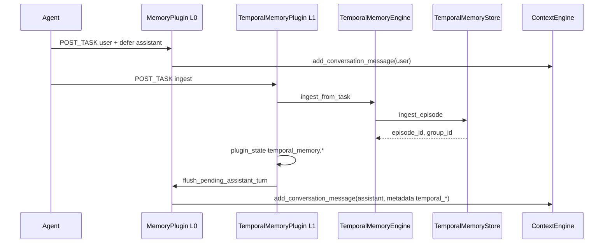

# Context Engine — L0 / L1 / L2 memory layers

Developer guide for **ContextEngine** (L0 working memory) and how it links to **L1 temporal memory** and **L2 knowledge graph** plugins.

**Related:**

- [DOMAIN_TEMPORAL_MEMORY.md](./DOMAIN_TEMPORAL_MEMORY.md)
- [MIGRATION_GRAPH_MEMORY_TO_L1.md](./MIGRATION_GRAPH_MEMORY_TO_L1.md)
- [CONTENT_ENGINE.md](./DOMAIN_CONTEXT/CONTENT_ENGINE.md)
- [TEMPORAL_KG_MEMORY_INDEX.md](../../issue_report/new_function_request/temporal_kg_memory/TEMPORAL_KG_MEMORY_INDEX.md) §4

---

## 1. Layer responsibilities

| Layer | Mechanism | Storage | Optional install |
|-------|-----------|---------|------------------|
| **L0** | `MemoryPlugin` → `ConversationMemory` → `ContextEngine` | Session messages, cold archive | Core |
| **L1** | `TemporalMemoryPlugin` → `TemporalMemoryEngine` → `TemporalMemoryStore` | Time-valid facts / episodes (Graphiti) | `graphiti-core` / `aiecs[temporal-graphiti]` |
| **L2** | `KnowledgePlugin` → `create_graph_store()` | Enterprise KG entities | Customer private `aiecs-kg` (ADR-003) |

**Separation:** L0, L1, and L2 do **not** share a single storage backend. `KnowledgePlugin` does **not** merge `temporal_memory.facts`. Use `UnifiedMemoryRetriever` for read-only combined retrieval.

---

## 2. episode_bridge (L0 ↔ L1 metadata)

After a successful L1 ingest, the assistant turn stored in L0 may include metadata pointers:

| L0 message metadata key | Source `plugin_state` key | Written by |
|----------------------|---------------------------|------------|
| `temporal_episode_id` | `temporal_memory.episode_id` | `MemoryPlugin` (after L1 POST_TASK) |
| `temporal_group_id` | `temporal_memory.group_id` | same |
| `temporal_ingest_job_id` | `temporal_memory.ingest_job_id` | same |

Constants: `aiecs/domain/temporal_memory/constants.py`.

**One-way bridge:** Agent POST_TASK → L1 ingest → L0 metadata. Context cold archive **does not** auto-ingest into Graphiti.

**Deferred assistant:** Only when `temporal_memory_enabled=true`. If a custom agent omits `TemporalMemoryPlugin` or ingest fails before flush, `MemoryPlugin.on_agent_shutdown` still flushes a pending assistant (metadata may contain only `temporal_ingest_job_id` under async ingest).

**Async ingest:** `temporal_ingest_job_id` may appear in metadata before `temporal_episode_id`; wait for flush or poll `plugin_state['temporal_memory.episode_id']` after ingest.

### Sequence (POST_TASK plugin order)

Plugins run by ascending priority: **memory (80)** then **temporal_memory (85)**.

---

## 3. Installation matrix (ADR-003)

Three **independent** optional packages on the customer side:

| Package | Install | Enables |
|---------|---------|---------|
| `aiecs` | `pip install aiecs` | L0 + agents (default) |
| `graphiti-core` | `pip install aiecs[temporal-graphiti]` | L1 Graphiti backend |
| Private `aiecs-kg` | Customer distribution | L2 `KnowledgePlugin` |

AIECS core **does not** bundle `graphiti-core` or proprietary KG. See [docs/user/INDEX.md](../user/INDEX.md).

---

## 4. API anchors

- `ContextEngine.add_conversation_message(..., metadata=dict)` — L0 persist with optional bridge keys
- `ConversationMemory.aadd_conversation_message` — used by `MemoryPlugin`
- `build_l0_temporal_metadata(plugin_state)` — maps L1 plugin_state → L0 metadata dict

Tests: `test/unit/domain/context/test_episode_bridge.py`, `test/unit/domain/agent/plugins/test_memory_plugin_temporal_bridge.py`.
