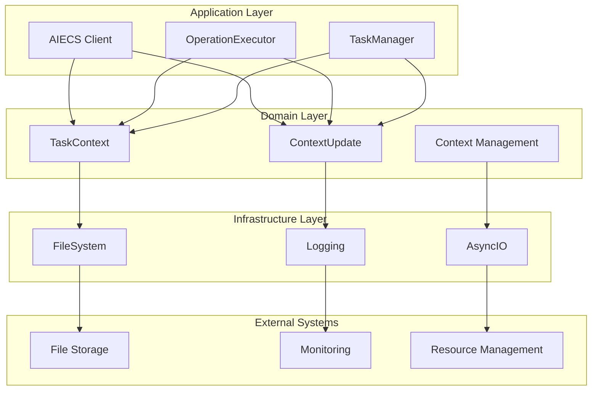
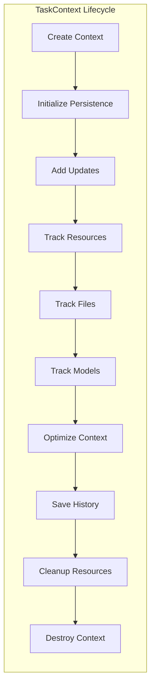
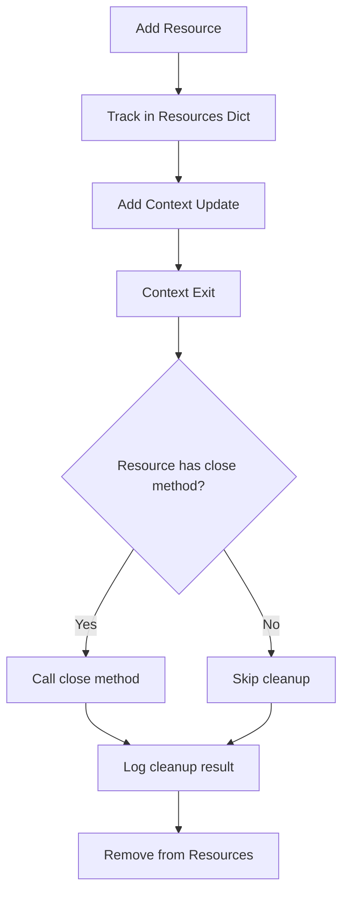
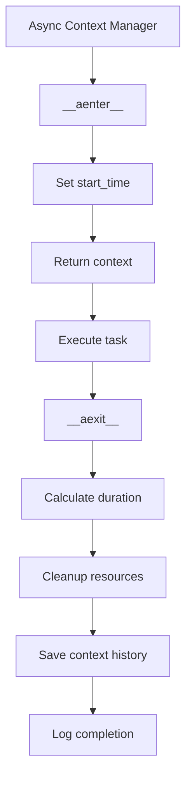

# 任务上下文技术文档

## 1. 概述 (Overview)

### 核心功能和价值

`domain/task/task_context.py` 是 AIECS 系统的核心领域服务组件，实现了增强的任务上下文管理器 **TaskContext** 和上下文更新模型 **ContextUpdate**。这些组件为整个 AI 应用系统提供了全面的任务执行上下文管理、资源跟踪、性能监控和持久化存储能力。

**核心价值**：
- **增强上下文管理**：提供完整的任务执行上下文生命周期管理，包括历史跟踪、资源管理和性能监控
- **资源跟踪与清理**：自动跟踪文件操作、模型使用和资源分配，确保资源正确释放
- **持久化存储**：支持上下文历史的持久化存储和恢复，确保任务状态的连续性
- **异步支持**：提供同步和异步两种上下文管理模式，适应不同的使用场景
- **性能优化**：内置上下文优化机制，支持去重和大小限制，确保系统性能

**解决的问题**：
- 任务执行过程中缺乏完整的上下文状态管理
- 资源分配和清理缺乏自动化机制
- 任务历史缺乏持久化存储和恢复能力
- 长时间运行的任务缺乏性能监控和优化机制
- 异步任务执行缺乏统一的上下文管理接口

## 2. 问题背景与设计动机 (Problem & Motivation)

### 问题背景

在构建复杂的 AI 应用系统时，任务执行上下文管理面临以下核心挑战：

**1. 上下文状态管理复杂性**
- 任务执行过程中需要维护大量的状态信息（用户ID、聊天ID、元数据等）
- 不同任务步骤间需要共享上下文状态和历史信息
- 缺乏统一的上下文生命周期管理机制

**2. 资源管理困难**
- 任务执行过程中会创建和分配各种资源（文件、模型、连接等）
- 资源清理缺乏自动化机制，容易导致资源泄漏
- 缺乏统一的资源跟踪和管理接口

**3. 持久化存储需求**
- 长时间运行的任务需要上下文状态的持久化存储
- 系统重启后需要能够恢复任务上下文状态
- 缺乏高效的上下文序列化和反序列化机制

**4. 性能监控和优化**
- 任务执行性能缺乏监控和统计机制
- 上下文历史增长可能导致内存使用过高
- 缺乏上下文优化和清理机制

**5. 异步执行支持**
- 现代 AI 应用大量使用异步编程模式
- 缺乏异步上下文管理器的支持
- 同步和异步模式缺乏统一的接口

### 设计动机

**任务上下文系统的解决方案**：
- **增强上下文管理器**：通过 TaskContext 提供完整的上下文生命周期管理
- **资源自动管理**：通过资源跟踪和自动清理机制确保资源正确释放
- **持久化存储**：通过文件系统存储实现上下文历史的持久化
- **性能优化**：通过去重和大小限制机制优化上下文性能
- **异步支持**：通过异步上下文管理器支持现代异步编程模式

## 3. 架构定位与上下文 (Architecture & Context)

### 组件类型
**领域服务组件** - 位于领域层 (Domain Layer)，属于业务逻辑层

### 架构层次
```
┌─────────────────────────────────────────┐
│         Application Layer               │  ← 使用任务上下文的组件
│  (AIECS Client, OperationExecutor)      │
└─────────────────┬───────────────────────┘
                  │
┌─────────────────▼───────────────────────┐
│         Domain Layer                    │  ← 任务上下文所在层
│  (TaskContext, ContextUpdate, Logic)    │
└─────────────────┬───────────────────────┘
                  │
┌─────────────────▼───────────────────────┐
│       Infrastructure Layer              │  ← 任务上下文依赖的组件
│  (FileSystem, Logging, AsyncIO)         │
└─────────────────┬───────────────────────┘
                  │
┌─────────────────▼───────────────────────┐
│         External Systems                │  ← 外部系统
│  (FileSystem, Database, Monitoring)     │
└─────────────────────────────────────────┘
```

### 上游组件（使用方）

#### 1. 应用层服务
- **AIECS Client** (`aiecs_client.py`) - 主要的客户端接口
- **OperationExecutor** (`application/executors/operation_executor.py`) - 操作执行器
- **TaskManager** (如果存在) - 任务管理器

#### 2. 领域服务
- **DSLProcessor** (`domain/task/dsl_processor.py`) - DSL 处理器
- **ContextEngine** (`domain/context/content_engine.py`) - 内容引擎
- **其他任务相关服务** - 任务执行相关服务

#### 3. 基础设施层
- **存储系统** - 通过序列化接口存储任务上下文
- **API 层** - 通过数据转换接口
- **消息队列** - 通过消息格式

### 下游组件（被依赖方）

#### 1. Python 标准库
- **time** - 提供时间戳支持
- **json** - 提供 JSON 序列化支持
- **os** - 提供文件系统操作
- **pathlib** - 提供路径操作
- **asyncio** - 提供异步编程支持
- **contextlib** - 提供上下文管理器支持
- **dataclasses** - 提供数据类支持
- **typing** - 提供类型注解支持

#### 2. 领域模型
- **ContextUpdate** - 上下文更新模型
- **其他领域模型** - 通过元数据字段关联

#### 3. 工具函数
- **build_context** - 向后兼容的上下文构建函数
- **task_context** - 异步上下文管理器

## 4. 核心功能与用例 (Core Features & Use Cases)

### 4.1 TaskContext - 增强任务上下文管理

#### 核心功能

**1. 基础上下文信息管理**
```python
class TaskContext:
    """增强的任务上下文管理器"""
    def __init__(self, data: dict, task_dir: str = "./tasks"):
        self.user_id = data.get("user_id", "anonymous")
        self.chat_id = data.get("chat_id", "none")
        self.metadata = data.get("metadata", {})
        self.task_dir = Path(task_dir)
        self.start_time: Optional[float] = None
        self.resources: Dict[str, Any] = {}
        self.context_history: List[ContextUpdate] = []
        self.file_tracker: Dict[str, Dict[str, Any]] = {}
        self.model_tracker: List[Dict[str, Any]] = []
        self.metadata_toggles: Dict[str, bool] = data.get("metadata_toggles", {})
```

**2. 上下文历史跟踪**
```python
def add_context_update(self, update_type: str, data: Any, metadata: Dict[str, Any] = None):
    """添加上下文更新"""
    update = ContextUpdate(
        timestamp=time.time(),
        update_type=update_type,
        data=data,
        metadata=metadata or {}
    )
    self.context_history.append(update)
```

**3. 资源管理**
```python
def add_resource(self, name: str, resource: Any) -> None:
    """添加需要清理的资源"""
    self.resources[name] = resource
    self.add_context_update("resource", {"name": name}, {"type": type(resource).__name__})
```

**4. 文件操作跟踪**
```python
def track_file_operation(self, file_path: str, operation: str, source: str = "task"):
    """跟踪文件操作"""
    self.file_tracker[file_path] = {
        "operation": operation,
        "source": source,
        "timestamp": time.time(),
        "state": "active"
    }
```

**5. 模型使用跟踪**
```python
def track_model_usage(self, model_id: str, provider_id: str, mode: str):
    """跟踪 AI 模型使用"""
    model_entry = {
        "model_id": model_id,
        "provider_id": provider_id,
        "mode": mode,
        "timestamp": time.time()
    }
    if not self.model_tracker or self.model_tracker[-1] != model_entry:
        self.model_tracker.append(model_entry)
        self.add_context_update("model_usage", model_entry)
```

**6. 上下文优化**
```python
def optimize_context(self, max_size: int = 1000) -> bool:
    """优化上下文，移除重复项和旧条目"""
    deduplicated = {}
    optimized_history = []
    total_size = 0

    for update in reversed(self.context_history):
        key = f"{update.update_type}:{json.dumps(update.data, sort_keys=True)}"
        if key not in deduplicated:
            deduplicated[key] = update
            data_size = len(str(update.data))
            if total_size + data_size <= max_size:
                optimized_history.append(update)
                total_size += data_size

    self.context_history = list(reversed(optimized_history))
    return len(deduplicated) < len(self.context_history)
```

### 4.2 ContextUpdate - 上下文更新模型

#### 核心功能

**1. 结构化更新记录**
```python
@dataclass
class ContextUpdate:
    """表示对上下文的单个更新"""
    timestamp: float
    update_type: str  # 例如: "message", "metadata", "resource"
    data: Any  # 更新的内容
    metadata: Dict[str, Any]  # 附加元数据
```

**2. 类型化更新支持**
- **message**: 消息更新
- **metadata**: 元数据更新
- **resource**: 资源更新
- **file_operation**: 文件操作更新
- **model_usage**: 模型使用更新

### 4.3 软件功能场景

**场景1: 智能文档处理任务**
```python
# 创建文档处理任务上下文
doc_context = TaskContext(
    data={
        "user_id": "doc_processor_001",
        "chat_id": "doc_session_abc123",
        "metadata": {
            "document_type": "pdf",
            "language": "zh-CN",
            "processing_mode": "batch"
        }
    },
    task_dir="/var/lib/aiecs/tasks"
)

# 跟踪文档处理过程
doc_context.add_context_update("message", "开始处理文档", {"source": "system"})
doc_context.track_file_operation("input.pdf", "read", "user")
doc_context.track_model_usage("gpt-4", "openai", "text_extraction")

# 添加处理资源
with open("input.pdf", "rb") as f:
    doc_context.add_resource("pdf_file", f)
    # 处理文档...

# 优化上下文
doc_context.optimize_context(max_size=2000)
```

**场景2: 数据科学工作流**
```python
# 创建数据科学任务上下文
ds_context = TaskContext(
    data={
        "user_id": "data_scientist_001",
        "chat_id": "ml_pipeline_session",
        "metadata": {
            "project": "customer_segmentation",
            "algorithm": "kmeans",
            "dataset_size": "large"
        }
    }
)

# 跟踪机器学习过程
ds_context.add_context_update("message", "开始数据预处理", {"step": "preprocessing"})
ds_context.track_file_operation("customer_data.csv", "read", "pandas")
ds_context.track_model_usage("sklearn", "scikit-learn", "clustering")

# 跟踪模型训练
ds_context.add_context_update("message", "开始模型训练", {"step": "training"})
ds_context.track_model_usage("kmeans", "sklearn", "clustering")

# 保存上下文历史
await ds_context._save_context_history()
```

**场景3: 实时聊天机器人**
```python
# 创建聊天机器人任务上下文
chat_context = TaskContext(
    data={
        "user_id": "user_456",
        "chat_id": "chat_session_xyz789",
        "metadata": {
            "bot_type": "customer_service",
            "language": "en",
            "model": "gpt-4"
        }
    }
)

# 跟踪对话过程
chat_context.add_context_update("message", "用户输入: Hello", {"source": "user"})
chat_context.track_model_usage("gpt-4", "openai", "chat_completion")
chat_context.add_context_update("message", "AI 回复: Hi! How can I help you?", {"source": "ai"})

# 跟踪文件操作
chat_context.track_file_operation("conversation_log.json", "write", "logging")

# 异步上下文管理
async with task_context(chat_data, task_dir="./chat_tasks") as context:
    # 处理聊天逻辑...
    pass
```

### 4.4 实际使用案例

**案例1: 多步骤数据分析管道**
```python
async def data_analysis_pipeline():
    """数据分析管道示例"""
    # 创建分析上下文
    context = TaskContext(
        data={
            "user_id": "analyst_001",
            "chat_id": "analysis_session_001",
            "metadata": {
                "pipeline_type": "sales_analysis",
                "data_source": "database",
                "output_format": "excel"
            }
        },
        task_dir="./analysis_tasks"
    )
    
    try:
        # 步骤1: 数据加载
        context.add_context_update("message", "开始数据加载", {"step": "data_loading"})
        context.track_file_operation("sales_data.csv", "read", "pandas")
        
        # 步骤2: 数据清洗
        context.add_context_update("message", "开始数据清洗", {"step": "data_cleaning"})
        context.track_model_usage("pandas", "python", "data_processing")
        
        # 步骤3: 数据分析
        context.add_context_update("message", "开始数据分析", {"step": "analysis"})
        context.track_model_usage("numpy", "python", "statistical_analysis")
        
        # 步骤4: 结果输出
        context.add_context_update("message", "生成分析报告", {"step": "reporting"})
        context.track_file_operation("analysis_report.xlsx", "write", "openpyxl")
        
        # 优化上下文
        context.optimize_context(max_size=1500)
        
        return context.to_dict()
        
    except Exception as e:
        context.add_context_update("error", str(e), {"step": "pipeline_error"})
        raise
    finally:
        # 清理资源
        for resource_name, resource in context.resources.items():
            if hasattr(resource, 'close'):
                resource.close()
```

**案例2: 实时监控系统**
```python
async def real_time_monitoring():
    """实时监控系统示例"""
    # 创建监控上下文
    context = TaskContext(
        data={
            "user_id": "monitor_001",
            "chat_id": "monitoring_session",
            "metadata": {
                "monitoring_type": "system_health",
                "alert_threshold": 0.8,
                "check_interval": 60
            }
        }
    )
    
    # 跟踪监控过程
    context.add_context_update("message", "开始系统监控", {"source": "monitor"})
    
    # 模拟监控循环
    for i in range(10):
        # 检查系统状态
        context.add_context_update("monitoring", f"检查 #{i+1}", {"timestamp": time.time()})
        
        # 跟踪资源使用
        context.track_model_usage("system_monitor", "internal", "health_check")
        
        # 模拟文件操作
        context.track_file_operation(f"monitor_log_{i}.txt", "write", "logging")
        
        # 优化上下文（每5次检查后）
        if (i + 1) % 5 == 0:
            context.optimize_context(max_size=1000)
        
        await asyncio.sleep(1)
    
    return context.to_dict()
```

**案例3: 批处理任务管理**
```python
async def batch_processing_manager():
    """批处理任务管理示例"""
    # 创建批处理上下文
    context = TaskContext(
        data={
            "user_id": "batch_processor_001",
            "chat_id": "batch_session_001",
            "metadata": {
                "batch_size": 1000,
                "processing_mode": "parallel",
                "output_format": "json"
            }
        }
    )
    
    # 跟踪批处理过程
    context.add_context_update("message", "开始批处理任务", {"batch_id": "batch_001"})
    
    # 模拟批处理
    for batch_num in range(5):
        batch_id = f"batch_{batch_num + 1}"
        context.add_context_update("batch", f"处理批次 {batch_id}", {"batch_id": batch_id})
        
        # 跟踪文件操作
        context.track_file_operation(f"input_{batch_id}.csv", "read", "batch_processor")
        context.track_file_operation(f"output_{batch_id}.json", "write", "batch_processor")
        
        # 跟踪模型使用
        context.track_model_usage("batch_processor", "internal", "data_processing")
        
        # 定期优化上下文
        if (batch_num + 1) % 2 == 0:
            context.optimize_context(max_size=2000)
    
    # 保存最终上下文
    await context._save_context_history()
    
    return context.to_dict()
```

## 5. API 参考 (API Reference)

### 5.1 TaskContext 类

#### 构造函数
```python
def __init__(self, data: dict, task_dir: str = "./tasks")
```

**参数**：
- `data` (dict): 上下文数据字典，必需
- `task_dir` (str): 任务目录路径，可选，默认为 "./tasks"

**返回值**：无

**异常**：无

#### 方法

##### add_context_update
```python
def add_context_update(self, update_type: str, data: Any, metadata: Dict[str, Any] = None) -> None
```

**功能**：添加上下文更新

**参数**：
- `update_type` (str): 更新类型，必需
- `data` (Any): 更新数据，必需
- `metadata` (Dict[str, Any]): 附加元数据，可选，默认为 None

**返回值**：无

**异常**：无

##### add_resource
```python
def add_resource(self, name: str, resource: Any) -> None
```

**功能**：添加需要清理的资源

**参数**：
- `name` (str): 资源名称，必需
- `resource` (Any): 资源对象，必需

**返回值**：无

**异常**：无

##### track_file_operation
```python
def track_file_operation(self, file_path: str, operation: str, source: str = "task") -> None
```

**功能**：跟踪文件操作

**参数**：
- `file_path` (str): 文件路径，必需
- `operation` (str): 操作类型，必需
- `source` (str): 操作来源，可选，默认为 "task"

**返回值**：无

**异常**：无

##### track_model_usage
```python
def track_model_usage(self, model_id: str, provider_id: str, mode: str) -> None
```

**功能**：跟踪 AI 模型使用

**参数**：
- `model_id` (str): 模型ID，必需
- `provider_id` (str): 提供商ID，必需
- `mode` (str): 使用模式，必需

**返回值**：无

**异常**：无

##### optimize_context
```python
def optimize_context(self, max_size: int = 1000) -> bool
```

**功能**：优化上下文，移除重复项和旧条目

**参数**：
- `max_size` (int): 最大大小限制，可选，默认为 1000

**返回值**：bool - 是否进行了优化

**异常**：无

##### to_dict
```python
def to_dict(self) -> Dict[str, Any]
```

**功能**：将上下文转换为字典格式

**参数**：无

**返回值**：Dict[str, Any] - 包含所有上下文信息的字典

**异常**：无

### 5.2 ContextUpdate 类

#### 构造函数
```python
@dataclass
class ContextUpdate:
    timestamp: float
    update_type: str
    data: Any
    metadata: Dict[str, Any]
```

**参数**：
- `timestamp` (float): 时间戳，必需
- `update_type` (str): 更新类型，必需
- `data` (Any): 更新数据，必需
- `metadata` (Dict[str, Any]): 附加元数据，必需

**返回值**：无

**异常**：无

### 5.3 工具函数

#### build_context
```python
def build_context(data: dict) -> dict
```

**功能**：构建简单的上下文字典（向后兼容）

**参数**：
- `data` (dict): 上下文数据，必需

**返回值**：dict - 上下文字典

**异常**：无

#### task_context
```python
@asynccontextmanager
async def task_context(data: dict, task_dir: str = "./tasks") -> AsyncGenerator[TaskContext, None]
```

**功能**：异步上下文管理器

**参数**：
- `data` (dict): 上下文数据，必需
- `task_dir` (str): 任务目录路径，可选，默认为 "./tasks"

**返回值**：AsyncGenerator[TaskContext, None] - 异步上下文生成器

**异常**：无

## 6. 技术实现细节 (Technical Details)

### 6.1 上下文历史管理

#### 持久化存储机制
```python
def _initialize_persistence(self):
    """初始化上下文历史的持久化存储"""
    try:
        self.task_dir.mkdir(parents=True, exist_ok=True)
        history_file = self.task_dir / f"context_history_{self.chat_id}.json"
        if history_file.exists():
            with open(history_file, "r") as f:
                raw_history = json.load(f)
                self.context_history = [
                    ContextUpdate(
                        timestamp=entry["timestamp"],
                        update_type=entry["update_type"],
                        data=entry["data"],
                        metadata=entry["metadata"]
                    )
                    for entry in raw_history
                ]
    except Exception as e:
        logger.error(f"Failed to initialize context history: {e}")
```

#### 异步保存机制
```python
async def _save_context_history(self):
    """异步保存上下文历史到磁盘"""
    try:
        history_file = self.task_dir / f"context_history_{self.chat_id}.json"
        serialized_history = [
            {
                "timestamp": update.timestamp,
                "update_type": update.update_type,
                "data": update.data,
                "metadata": update.metadata
            }
            for update in self.context_history
        ]
        with open(history_file, "w") as f:
            json.dump(serialized_history, f, indent=2)
    except Exception as e:
        logger.error(f"Failed to save context history: {e}")
```

### 6.2 资源管理机制

#### 资源跟踪和清理
```python
def add_resource(self, name: str, resource: Any) -> None:
    """添加需要清理的资源"""
    self.resources[name] = resource
    self.add_context_update("resource", {"name": name}, {"type": type(resource).__name__})

# 在上下文退出时自动清理资源
async def __aexit__(self, exc_type, exc_val, exc_tb):
    """异步上下文退出时清理资源"""
    for resource_name, resource in self.resources.items():
        try:
            if hasattr(resource, 'close'):
                if callable(getattr(resource, 'close')):
                    if hasattr(resource.close, '__await__'):
                        await resource.close()
                    else:
                        resource.close()
        except Exception as e:
            logger.error(f"Error cleaning up async resource {resource_name}: {e}")
```

### 6.3 上下文优化机制

#### 去重和大小限制
```python
def optimize_context(self, max_size: int = 1000) -> bool:
    """优化上下文，移除重复项和旧条目"""
    deduplicated = {}
    optimized_history = []
    total_size = 0

    # 从最新开始处理，保留最新的更新
    for update in reversed(self.context_history):
        key = f"{update.update_type}:{json.dumps(update.data, sort_keys=True)}"
        if key not in deduplicated:
            deduplicated[key] = update
            data_size = len(str(update.data))
            if total_size + data_size <= max_size:
                optimized_history.append(update)
                total_size += data_size

    self.context_history = list(reversed(optimized_history))
    return len(deduplicated) < len(self.context_history)
```

### 6.4 异步上下文管理

#### 异步上下文管理器实现
```python
async def __aenter__(self):
    """异步上下文入口"""
    self.start_time = time.time()
    logger.debug(f"Starting async task context for user {self.user_id}, chat {self.chat_id}")
    return self

async def __aexit__(self, exc_type, exc_val, exc_tb):
    """异步上下文退出"""
    duration = time.time() - self.start_time
    logger.debug(f"Completed async task context in {duration:.2f}s for user {self.user_id}")
    
    # 清理资源
    for resource_name, resource in self.resources.items():
        try:
            if hasattr(resource, 'close'):
                if callable(getattr(resource, 'close')):
                    if hasattr(resource.close, '__await__'):
                        await resource.close()
                    else:
                        resource.close()
        except Exception as e:
            logger.error(f"Error cleaning up async resource {resource_name}: {e}")
    
    # 保存上下文历史
    await self._save_context_history()
    return False
```

## 7. 配置与部署 (Configuration & Deployment)

### 7.1 默认配置

#### TaskContext 默认配置
```python
# 默认任务目录
DEFAULT_TASK_DIR = "./tasks"

# 默认元数据
DEFAULT_METADATA = {}

# 默认元数据开关
DEFAULT_METADATA_TOGGLES = {}

# 默认上下文优化大小
DEFAULT_MAX_CONTEXT_SIZE = 1000
```

### 7.2 环境变量支持

#### 配置环境变量
```python
import os

# 从环境变量获取配置
TASK_DIR = os.getenv("AIECS_TASK_DIR", "./tasks")
MAX_CONTEXT_SIZE = int(os.getenv("AIECS_MAX_CONTEXT_SIZE", "1000"))
ENABLE_PERSISTENCE = os.getenv("AIECS_ENABLE_PERSISTENCE", "true").lower() == "true"
LOG_LEVEL = os.getenv("AIECS_LOG_LEVEL", "INFO")
```

#### 配置验证
```python
def validate_config():
    """验证配置参数"""
    task_dir = os.getenv("AIECS_TASK_DIR", "./tasks")
    if not os.path.exists(task_dir):
        os.makedirs(task_dir, exist_ok=True)
    
    max_size = int(os.getenv("AIECS_MAX_CONTEXT_SIZE", "1000"))
    if max_size <= 0:
        raise ValueError("Max context size must be positive")
    
    log_level = os.getenv("AIECS_LOG_LEVEL", "INFO")
    valid_levels = ["DEBUG", "INFO", "WARNING", "ERROR", "CRITICAL"]
    if log_level not in valid_levels:
        raise ValueError(f"Log level must be one of {valid_levels}")
```

### 7.3 部署配置

#### 生产环境配置
```python
# 生产环境配置
PRODUCTION_CONFIG = {
    "task_dir": "/var/lib/aiecs/tasks",
    "max_context_size": 5000,
    "enable_persistence": True,
    "log_level": "INFO",
    "cleanup_interval": 3600,  # 1 hour
    "max_history_files": 100
}
```

#### 开发环境配置
```python
# 开发环境配置
DEVELOPMENT_CONFIG = {
    "task_dir": "./tasks",
    "max_context_size": 1000,
    "enable_persistence": False,
    "log_level": "DEBUG",
    "cleanup_interval": 300,  # 5 minutes
    "max_history_files": 10
}
```

## 8. 维护与故障排查 (Maintenance & Troubleshooting)

### 8.1 日常维护

#### 上下文健康检查
```python
def check_context_health(context: TaskContext):
    """检查上下文健康状态"""
    try:
        # 检查基本字段
        if not context.user_id:
            print("❌ Missing user_id")
            return False
        
        if not context.chat_id:
            print("❌ Missing chat_id")
            return False
        
        # 检查上下文历史
        if not isinstance(context.context_history, list):
            print("❌ Context history is not a list")
            return False
        
        # 检查资源字典
        if not isinstance(context.resources, dict):
            print("❌ Resources is not a dictionary")
            return False
        
        # 检查文件跟踪器
        if not isinstance(context.file_tracker, dict):
            print("❌ File tracker is not a dictionary")
            return False
        
        # 检查模型跟踪器
        if not isinstance(context.model_tracker, list):
            print("❌ Model tracker is not a list")
            return False
        
        print("✅ Context health check passed")
        return True
        
    except Exception as e:
        print(f"❌ Context health check failed: {e}")
        return False
```

#### 性能监控
```python
def monitor_context_performance(context: TaskContext):
    """监控上下文性能"""
    # 检查上下文大小
    context_size = len(str(context.to_dict()))
    print(f"Context size: {context_size} characters")
    
    # 检查历史条目数量
    history_count = len(context.context_history)
    print(f"History entries: {history_count}")
    
    # 检查资源数量
    resource_count = len(context.resources)
    print(f"Resources: {resource_count}")
    
    # 检查文件跟踪数量
    file_count = len(context.file_tracker)
    print(f"Tracked files: {file_count}")
    
    # 检查模型使用数量
    model_count = len(context.model_tracker)
    print(f"Model usages: {model_count}")
    
    # 建议优化
    if context_size > 5000:
        print("⚠️ Context size is large, consider optimization")
    
    if history_count > 100:
        print("⚠️ History has many entries, consider optimization")
```

### 8.2 故障排查

#### 常见问题诊断

**问题1: 上下文历史加载失败**
```python
def diagnose_history_loading_issue():
    """诊断上下文历史加载问题"""
    try:
        # 检查任务目录
        task_dir = Path("./tasks")
        if not task_dir.exists():
            print("❌ Task directory does not exist")
            return False
        
        # 检查历史文件
        history_file = task_dir / "context_history_test.json"
        if not history_file.exists():
            print("❌ History file does not exist")
            return False
        
        # 检查文件权限
        if not os.access(history_file, os.R_OK):
            print("❌ History file is not readable")
            return False
        
        # 检查 JSON 格式
        with open(history_file, "r") as f:
            json.load(f)
        print("✅ History file is valid JSON")
        
        return True
        
    except json.JSONDecodeError as e:
        print(f"❌ History file has invalid JSON: {e}")
        return False
    except Exception as e:
        print(f"❌ History loading failed: {e}")
        return False
```

**问题2: 资源清理失败**
```python
def diagnose_resource_cleanup_issue():
    """诊断资源清理问题"""
    try:
        context = TaskContext({"user_id": "test", "chat_id": "test"})
        
        # 添加测试资源
        class TestResource:
            def close(self):
                raise Exception("Test cleanup error")
        
        context.add_resource("test_resource", TestResource())
        
        # 测试资源清理
        for resource_name, resource in context.resources.items():
            try:
                if hasattr(resource, 'close'):
                    resource.close()
                print(f"✅ Resource {resource_name} cleaned up successfully")
            except Exception as e:
                print(f"❌ Resource {resource_name} cleanup failed: {e}")
        
        return True
        
    except Exception as e:
        print(f"❌ Resource cleanup diagnosis failed: {e}")
        return False
```

**问题3: 上下文优化失败**
```python
def diagnose_context_optimization_issue():
    """诊断上下文优化问题"""
    try:
        context = TaskContext({"user_id": "test", "chat_id": "test"})
        
        # 添加大量上下文更新
        for i in range(100):
            context.add_context_update("test", f"data_{i}", {"index": i})
        
        # 测试优化
        original_size = len(context.context_history)
        optimized = context.optimize_context(max_size=50)
        
        if optimized:
            new_size = len(context.context_history)
            print(f"✅ Context optimized: {original_size} -> {new_size}")
        else:
            print("⚠️ Context optimization had no effect")
        
        return True
        
    except Exception as e:
        print(f"❌ Context optimization failed: {e}")
        return False
```

### 8.3 性能优化

#### 内存使用优化
```python
def optimize_memory_usage():
    """优化内存使用"""
    import gc
    import sys
    
    # 创建大量上下文对象
    contexts = []
    for i in range(1000):
        context = TaskContext({"user_id": f"user_{i}", "chat_id": f"chat_{i}"})
        for j in range(10):
            context.add_context_update("test", f"data_{i}_{j}")
        contexts.append(context)
    
    print(f"Memory usage before cleanup: {sys.getsizeof(contexts)} bytes")
    
    # 清理对象
    contexts.clear()
    gc.collect()
    
    print(f"Memory usage after cleanup: {sys.getsizeof(contexts)} bytes")
```

#### 上下文优化
```python
def optimize_context_performance():
    """优化上下文性能"""
    import time
    
    context = TaskContext({"user_id": "test", "chat_id": "test"})
    
    # 添加大量更新
    for i in range(1000):
        context.add_context_update("test", f"data_{i}")
    
    # 测试优化性能
    start_time = time.time()
    context.optimize_context(max_size=100)
    end_time = time.time()
    
    print(f"Context optimization time: {(end_time - start_time) * 1000:.2f}ms")
    print(f"Final context size: {len(context.context_history)} entries")
```

## 9. 可视化图表 (Visualizations)

### 9.1 架构层次图



### 9.2 上下文生命周期图



### 9.3 资源管理流程图



### 9.4 异步上下文管理图



## 10. 版本历史 (Version History)

### v1.0.0 (2024-01-01)
- **初始版本**：基础 TaskContext 和 ContextUpdate 模型
- **功能**：
  - TaskContext 基础上下文管理
  - ContextUpdate 上下文更新模型
  - 基本序列化支持

### v1.1.0 (2024-01-15)
- **增强功能**：
  - 添加上下文历史跟踪
  - 添加资源管理功能
  - 改进序列化机制

### v1.2.0 (2024-02-01)
- **新增功能**：
  - 添加文件操作跟踪
  - 添加模型使用跟踪
  - 添加上下文优化功能

### v1.3.0 (2024-02-15)
- **优化功能**：
  - 添加异步上下文管理器支持
  - 改进资源清理机制
  - 添加性能监控

### v1.4.0 (2024-03-01)
- **扩展功能**：
  - 添加持久化存储支持
  - 添加上下文历史截断功能
  - 添加元数据开关支持

### v1.5.0 (2024-03-15)
- **完善功能**：
  - 添加监控和日志支持
  - 改进故障排查工具
  - 添加性能优化建议

## 相关文档

- [AIECS 项目总览](../PROJECT_SUMMARY.md)
- [任务模型文档](./TASK_MODELS.md)
- [DSL 处理器文档](./DSL_PROCESSOR.md)
- [内容引擎文档](./CONTENT_ENGINE.md)
