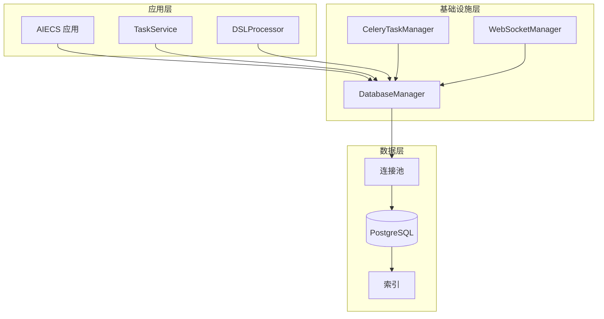
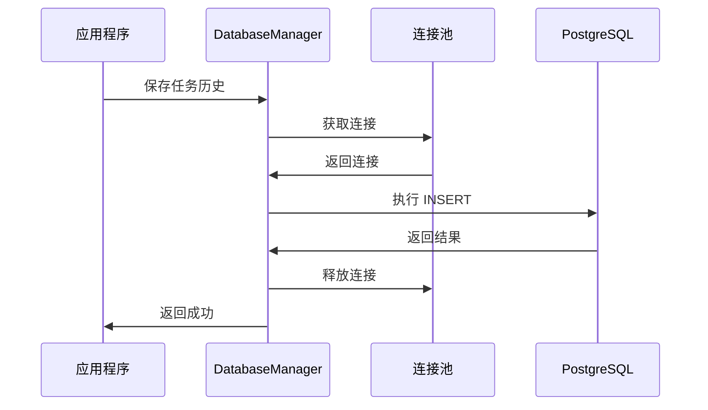
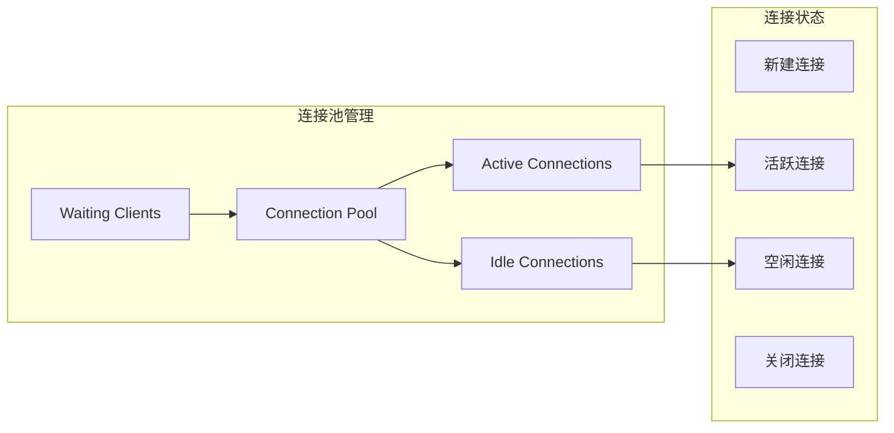

# DatabaseManager 技术文档

## 1. 概述 (Overview)

### 目的
`DatabaseManager` 是一个专门用于数据库连接管理、操作执行和任务历史管理的组件，基于 asyncpg 异步 PostgreSQL 驱动构建。它提供了连接池管理、任务历史持久化、状态跟踪等核心功能，是 AIECS 系统中数据持久化层的关键基础设施。

### 核心价值
- **异步数据库操作**：基于 asyncpg 的高性能异步数据库访问
- **连接池管理**：自动管理数据库连接池，提高并发性能
- **任务历史持久化**：完整记录任务执行历史和状态变化
- **数据一致性**：确保任务状态和结果的数据一致性
- **性能优化**：通过索引和查询优化提升数据库性能

## 2. 问题背景与设计动机 (Problem & Motivation)

### 问题背景
在 AIECS 系统中，需要处理大量任务执行数据，包括：
- **任务状态跟踪**：需要持久化存储任务执行状态和结果
- **历史记录管理**：需要保存完整的任务执行历史供查询和分析
- **并发访问**：多个服务同时访问数据库需要高效的连接管理
- **数据一致性**：确保任务状态变更的原子性和一致性
- **性能要求**：大量并发任务需要高性能的数据库操作

### 设计动机
1. **数据持久化**：将任务执行数据持久化存储，支持系统重启后数据恢复
2. **状态管理**：提供可靠的任务状态跟踪和查询机制
3. **性能优化**：通过连接池和异步操作提升数据库访问性能
4. **数据完整性**：确保任务执行历史的完整性和一致性
5. **运维支持**：提供数据清理和监控功能支持系统运维

## 3. 架构定位与上下文 (Architecture & Context)

### 系统架构位置
```
┌─────────────────────────────────────────────────────────────┐
│                    AIECS 系统架构                           │
├─────────────────────────────────────────────────────────────┤
│  领域层 (Domain Layer)                                     │
│  ┌─────────────────┐  ┌─────────────────┐                  │
│  │ TaskService     │  │ DSLProcessor    │                  │
│  └─────────────────┘  └─────────────────┘                  │
├─────────────────────────────────────────────────────────────┤
│  基础设施层 (Infrastructure Layer)                         │
│  ┌─────────────────┐  ┌─────────────────┐                  │
│  │ DatabaseManager │  │ CeleryTaskManager│                 │
│  └─────────────────┘  └─────────────────┘                  │
├─────────────────────────────────────────────────────────────┤
│  数据层 (Data Layer)                                       │
│  ┌─────────────────┐  ┌─────────────────┐                  │
│  │ PostgreSQL      │  │ 连接池          │                  │
│  └─────────────────┘  └─────────────────┘                  │
└─────────────────────────────────────────────────────────────┘
```

### 上游调用者
- **TaskService**：任务管理服务，需要保存和查询任务状态
- **DSLProcessor**：DSL 处理器，需要记录任务执行步骤
- **CeleryTaskManager**：任务执行器，需要更新任务状态
- **WebSocketManager**：WebSocket 管理器，需要查询任务历史

### 下游依赖
- **PostgreSQL**：主数据库系统
- **asyncpg**：异步 PostgreSQL 驱动
- **TaskStatus/TaskStepResult**：任务状态和结果模型
- **配置系统**：数据库连接配置

## 4. 核心功能与用例 (Core Features & Use Cases)

### 4.1 数据库连接管理

#### 连接池初始化
```python
# 创建数据库管理器
db_manager = DatabaseManager()

# 初始化连接池
await db_manager.init_connection_pool(
    min_size=10,  # 最小连接数
    max_size=20   # 最大连接数
)

# 初始化数据库模式
await db_manager.init_database_schema()
```

#### 自动连接管理
```python
# 数据库管理器自动处理连接获取和释放
async def process_task_with_db(task_data: Dict[str, Any]):
    """处理任务并自动管理数据库连接"""
    # 保存任务历史
    step_result = TaskStepResult(
        step="data_processing",
        result={"processed_rows": 1000},
        completed=True,
        message="数据处理完成",
        status="completed"
    )
    
    await db_manager.save_task_history(
        user_id="user_123",
        task_id="task_456",
        step=1,
        step_result=step_result
    )
```

### 4.2 任务历史管理

#### 保存任务执行历史
```python
# 保存任务步骤结果
async def save_task_step(user_id: str, task_id: str, step: int, result: Any):
    """保存任务步骤执行结果"""
    step_result = TaskStepResult(
        step=f"step_{step}",
        result=result,
        completed=True,
        message=f"步骤 {step} 执行完成",
        status=TaskStatus.COMPLETED
    )
    
    await db_manager.save_task_history(
        user_id=user_id,
        task_id=task_id,
        step=step,
        step_result=step_result
    )

# 保存错误信息
async def save_task_error(user_id: str, task_id: str, step: int, error: Exception):
    """保存任务执行错误"""
    step_result = TaskStepResult(
        step=f"step_{step}",
        result=None,
        completed=False,
        message=f"步骤 {step} 执行失败: {str(error)}",
        status=TaskStatus.FAILED,
        error_code="E003",
        error_message=str(error)
    )
    
    await db_manager.save_task_history(
        user_id=user_id,
        task_id=task_id,
        step=step,
        step_result=step_result
    )
```

#### 查询任务历史
```python
# 查询完整任务历史
async def get_task_execution_history(user_id: str, task_id: str):
    """获取任务执行历史"""
    history = await db_manager.load_task_history(user_id, task_id)
    
    print(f"任务 {task_id} 执行历史:")
    for step in history:
        print(f"  步骤 {step['step']}: {step['status']} - {step['result']}")
    
    return history

# 查询用户所有任务
async def get_user_task_list(user_id: str):
    """获取用户任务列表"""
    tasks = await db_manager.get_user_tasks(user_id, limit=50)
    
    print(f"用户 {user_id} 的任务列表:")
    for task in tasks:
        print(f"  任务 {task['task_id']}: {task['status']} (最后更新: {task['last_updated']})")
    
    return tasks
```

### 4.3 任务状态管理

#### 任务状态跟踪
```python
# 检查任务状态
async def check_task_status(user_id: str, task_id: str):
    """检查任务当前状态"""
    status = await db_manager.check_task_status(user_id, task_id)
    
    if status == TaskStatus.PENDING:
        print("任务等待执行")
    elif status == TaskStatus.RUNNING:
        print("任务正在执行")
    elif status == TaskStatus.COMPLETED:
        print("任务执行完成")
    elif status == TaskStatus.FAILED:
        print("任务执行失败")
    elif status == TaskStatus.CANCELLED:
        print("任务已取消")
    
    return status

# 取消任务
async def cancel_user_task(user_id: str, task_id: str):
    """取消用户任务"""
    success = await db_manager.mark_task_as_cancelled(user_id, task_id)
    
    if success:
        print(f"任务 {task_id} 已标记为取消")
    else:
        print(f"取消任务 {task_id} 失败")
    
    return success
```

### 4.4 数据维护和清理

#### 定期数据清理
```python
# 清理旧任务数据
async def cleanup_old_data():
    """清理30天前的任务数据"""
    success = await db_manager.cleanup_old_tasks(days_old=30)
    
    if success:
        print("旧任务数据清理完成")
    else:
        print("数据清理失败")
    
    return success

# 定期维护任务
import asyncio
from datetime import datetime, timedelta

async def scheduled_cleanup():
    """定期执行数据清理"""
    while True:
        try:
            # 每天凌晨2点执行清理
            now = datetime.now()
            if now.hour == 2 and now.minute == 0:
                await cleanup_old_data()
            
            # 等待1分钟
            await asyncio.sleep(60)
        except Exception as e:
            logger.error(f"定期清理任务出错: {e}")
            await asyncio.sleep(300)  # 出错后等待5分钟
```

### 4.5 批量操作

#### 批量保存任务历史
```python
# 批量保存多个任务步骤
async def save_batch_task_steps(user_id: str, task_id: str, steps: List[Dict[str, Any]]):
    """批量保存任务步骤"""
    for i, step_data in enumerate(steps):
        step_result = TaskStepResult(
            step=f"batch_step_{i}",
            result=step_data.get("result"),
            completed=step_data.get("completed", True),
            message=step_data.get("message", f"批量步骤 {i}"),
            status=step_data.get("status", TaskStatus.COMPLETED)
        )
        
        await db_manager.save_task_history(
            user_id=user_id,
            task_id=task_id,
            step=i,
            step_result=step_result
        )
```

## 5. API 参考 (API Reference)

### 5.1 类定义

#### `DatabaseManager`
```python
class DatabaseManager:
    """数据库连接和操作管理器"""
    
    def __init__(self, db_config: Optional[Dict[str, Any]] = None) -> None
    """初始化数据库管理器
    
    Args:
        db_config: 数据库配置字典，如果为 None 则从配置系统获取
    """
```

### 5.2 公共方法

#### `init_connection_pool`
```python
async def init_connection_pool(self, min_size: int = 10, max_size: int = 20) -> None
```
**功能**：初始化数据库连接池

**参数**：
- `min_size` (int): 最小连接数，默认 10
- `max_size` (int): 最大连接数，默认 20

**异常**：
- `Exception`: 连接池初始化失败

#### `init_database_schema`
```python
async def init_database_schema(self) -> bool
```
**功能**：初始化数据库表结构

**返回值**：
- `bool`: 初始化是否成功

#### `save_task_history`
```python
async def save_task_history(self, user_id: str, task_id: str, step: int, step_result: TaskStepResult) -> bool
```
**功能**：保存任务执行历史

**参数**：
- `user_id` (str): 用户 ID
- `task_id` (str): 任务 ID
- `step` (int): 步骤编号
- `step_result` (TaskStepResult): 步骤结果

**返回值**：
- `bool`: 保存是否成功

**异常**：
- `Exception`: 数据库操作失败

#### `load_task_history`
```python
async def load_task_history(self, user_id: str, task_id: str) -> List[Dict]
```
**功能**：加载任务执行历史

**参数**：
- `user_id` (str): 用户 ID
- `task_id` (str): 任务 ID

**返回值**：
- `List[Dict]`: 任务历史记录列表

**异常**：
- `Exception`: 数据库操作失败

#### `mark_task_as_cancelled`
```python
async def mark_task_as_cancelled(self, user_id: str, task_id: str) -> bool
```
**功能**：标记任务为已取消

**参数**：
- `user_id` (str): 用户 ID
- `task_id` (str): 任务 ID

**返回值**：
- `bool`: 操作是否成功

**异常**：
- `Exception`: 数据库操作失败

#### `check_task_status`
```python
async def check_task_status(self, user_id: str, task_id: str) -> TaskStatus
```
**功能**：检查任务状态

**参数**：
- `user_id` (str): 用户 ID
- `task_id` (str): 任务 ID

**返回值**：
- `TaskStatus`: 任务状态

**异常**：
- `Exception`: 数据库操作失败

#### `get_user_tasks`
```python
async def get_user_tasks(self, user_id: str, limit: int = 100) -> List[Dict]
```
**功能**：获取用户任务列表

**参数**：
- `user_id` (str): 用户 ID
- `limit` (int): 返回记录数限制，默认 100

**返回值**：
- `List[Dict]`: 用户任务列表

**异常**：
- `Exception`: 数据库操作失败

#### `cleanup_old_tasks`
```python
async def cleanup_old_tasks(self, days_old: int = 30) -> bool
```
**功能**：清理旧任务记录

**参数**：
- `days_old` (int): 清理多少天前的记录，默认 30

**返回值**：
- `bool`: 清理是否成功

#### `close`
```python
async def close(self) -> None
```
**功能**：关闭数据库连接池

## 6. 技术实现细节 (Technical Details)

### 6.1 连接池管理

#### 连接池配置
```python
async def init_connection_pool(self, min_size: int = 10, max_size: int = 20):
    """初始化数据库连接池"""
    self.connection_pool = await asyncpg.create_pool(
        **self.db_config,
        min_size=min_size,      # 最小连接数
        max_size=max_size,      # 最大连接数
        command_timeout=60,     # 命令超时时间
        server_settings={
            'application_name': 'aiecs_database_manager',
            'timezone': 'UTC'
        }
    )
```

#### 连接获取和释放
```python
async def _get_connection(self):
    """获取数据库连接"""
    if self.connection_pool:
        # 使用连接池
        return self.connection_pool.acquire()
    else:
        # 直接创建连接
        return asyncpg.connect(**self.db_config)

# 使用上下文管理器自动释放连接
async with self.connection_pool.acquire() as conn:
    result = await conn.fetch("SELECT * FROM task_history")
```

### 6.2 数据库模式管理

#### 表结构创建
```python
async def _create_tables(self, conn):
    """创建数据库表"""
    await conn.execute('''
        CREATE TABLE IF NOT EXISTS task_history (
            id SERIAL PRIMARY KEY,
            user_id TEXT NOT NULL,
            task_id TEXT NOT NULL,
            step INTEGER NOT NULL,
            result JSONB NOT NULL,
            timestamp TIMESTAMP NOT NULL,
            status TEXT NOT NULL DEFAULT 'pending'
        );
        
        -- 创建索引优化查询性能
        CREATE INDEX IF NOT EXISTS idx_task_history_user_id ON task_history (user_id);
        CREATE INDEX IF NOT EXISTS idx_task_history_task_id ON task_history (task_id);
        CREATE INDEX IF NOT EXISTS idx_task_history_status ON task_history (status);
        CREATE INDEX IF NOT EXISTS idx_task_history_timestamp ON task_history (timestamp);
        
        -- 复合索引优化常见查询
        CREATE INDEX IF NOT EXISTS idx_task_history_user_task ON task_history (user_id, task_id);
        CREATE INDEX IF NOT EXISTS idx_task_history_user_timestamp ON task_history (user_id, timestamp DESC);
    ''')
```

### 6.3 错误处理策略

#### 数据库操作容错
```python
async def save_task_history(self, user_id: str, task_id: str, step: int, step_result: TaskStepResult):
    """保存任务历史（带容错）"""
    try:
        if self.connection_pool:
            async with self.connection_pool.acquire() as conn:
                await conn.execute(
                    'INSERT INTO task_history (user_id, task_id, step, result, timestamp, status) VALUES ($1, $2, $3, $4, $5, $6)',
                    user_id, task_id, step, json.dumps(step_result.dict()), datetime.now(), step_result.status
                )
        else:
            conn = await asyncpg.connect(**self.db_config)
            try:
                await conn.execute(
                    'INSERT INTO task_history (user_id, task_id, step, result, timestamp, status) VALUES ($1, $2, $3, $4, $5, $6)',
                    user_id, task_id, step, json.dumps(step_result.dict()), datetime.now(), step_result.status
                )
            finally:
                await conn.close()
        
        return True
    except Exception as e:
        logger.error(f"Database error saving task history: {e}")
        raise Exception(f"Database error: {e}")
```

#### 重试机制
```python
import asyncio
from functools import wraps

def retry_db_operation(max_retries: int = 3, delay: float = 1.0):
    """数据库操作重试装饰器"""
    def decorator(func):
        @wraps(func)
        async def wrapper(*args, **kwargs):
            for attempt in range(max_retries):
                try:
                    return await func(*args, **kwargs)
                except Exception as e:
                    if attempt == max_retries - 1:
                        raise
                    logger.warning(f"Database operation failed (attempt {attempt + 1}/{max_retries}): {e}")
                    await asyncio.sleep(delay * (2 ** attempt))  # 指数退避
            return None
        return wrapper
    return decorator

# 使用重试装饰器
@retry_db_operation(max_retries=3, delay=1.0)
async def save_task_history_with_retry(self, user_id: str, task_id: str, step: int, step_result: TaskStepResult):
    """带重试的任务历史保存"""
    # 原有保存逻辑
    pass
```

### 6.4 性能优化

#### 批量操作优化
```python
async def save_batch_task_history(self, records: List[Dict[str, Any]]):
    """批量保存任务历史"""
    if not records:
        return
    
    try:
        if self.connection_pool:
            async with self.connection_pool.acquire() as conn:
                # 使用批量插入
                await conn.executemany(
                    '''INSERT INTO task_history (user_id, task_id, step, result, timestamp, status) 
                       VALUES ($1, $2, $3, $4, $5, $6)''',
                    [
                        (
                            record['user_id'],
                            record['task_id'],
                            record['step'],
                            json.dumps(record['result']),
                            record['timestamp'],
                            record['status']
                        )
                        for record in records
                    ]
                )
        else:
            conn = await asyncpg.connect(**self.db_config)
            try:
                await conn.executemany(
                    '''INSERT INTO task_history (user_id, task_id, step, result, timestamp, status) 
                       VALUES ($1, $2, $3, $4, $5, $6)''',
                    # 同样的批量数据
                )
            finally:
                await conn.close()
    except Exception as e:
        logger.error(f"Batch save error: {e}")
        raise
```

#### 查询优化
```python
async def get_user_tasks_optimized(self, user_id: str, limit: int = 100, offset: int = 0):
    """优化的用户任务查询"""
    try:
        if self.connection_pool:
            async with self.connection_pool.acquire() as conn:
                # 使用分页和优化的查询
                records = await conn.fetch(
                    '''SELECT DISTINCT task_id,
                       MAX(timestamp) as last_updated,
                       (SELECT status FROM task_history th2
                        WHERE th2.user_id = $1 AND th2.task_id = th1.task_id
                        ORDER BY step DESC LIMIT 1) as status
                       FROM task_history th1
                       WHERE user_id = $1
                       GROUP BY task_id
                       ORDER BY last_updated DESC
                       LIMIT $2 OFFSET $3''',
                    user_id, limit, offset
                )
        else:
            # 直接连接查询
            conn = await asyncpg.connect(**self.db_config)
            try:
                records = await conn.fetch(
                    # 同样的查询
                )
            finally:
                await conn.close()
        
        return [dict(r) for r in records]
    except Exception as e:
        logger.error(f"Optimized query error: {e}")
        raise
```

## 7. 配置与部署 (Configuration & Deployment)

### 7.1 基本配置

#### 数据库配置
```python
# 基本数据库配置
db_config = {
    "host": "localhost",
    "port": 5432,
    "database": "aiecs_db",
    "user": "aiecs_user",
    "password": "aiecs_password",
    "min_size": 10,
    "max_size": 20
}

# 创建数据库管理器
db_manager = DatabaseManager(db_config)
```

#### 环境变量配置
```bash
# 数据库连接配置
export DB_HOST="localhost"
export DB_PORT="5432"
export DB_NAME="aiecs_db"
export DB_USER="aiecs_user"
export DB_PASSWORD="aiecs_password"

# 连接池配置
export DB_MIN_SIZE="10"
export DB_MAX_SIZE="20"
export DB_COMMAND_TIMEOUT="60"
```

### 7.2 Docker 部署

#### Docker Compose 配置
```yaml
version: '3.8'
services:
  postgres:
    image: postgres:15-alpine
    environment:
      - POSTGRES_DB=aiecs_db
      - POSTGRES_USER=aiecs_user
      - POSTGRES_PASSWORD=aiecs_password
    ports:
      - "5432:5432"
    volumes:
      - postgres_data:/var/lib/postgresql/data
      - ./init.sql:/docker-entrypoint-initdb.d/init.sql

  aiecs-app:
    build: .
    environment:
      - DB_HOST=postgres
      - DB_PORT=5432
      - DB_NAME=aiecs_db
      - DB_USER=aiecs_user
      - DB_PASSWORD=aiecs_password
    depends_on:
      - postgres

volumes:
  postgres_data:
```

### 7.3 生产环境配置

#### 高可用配置
```python
# 生产环境数据库配置
production_config = {
    "host": "postgres-cluster.internal",
    "port": 5432,
    "database": "aiecs_prod",
    "user": "aiecs_prod_user",
    "password": "secure_password",
    "min_size": 20,
    "max_size": 100,
    "command_timeout": 30,
    "server_settings": {
        "application_name": "aiecs_production",
        "timezone": "UTC",
        "statement_timeout": "30s"
    }
}
```

## 8. 维护与故障排查 (Maintenance & Troubleshooting)

### 8.1 监控指标

#### 关键指标
- **连接池使用率**：`(活跃连接数 / 最大连接数) * 100%`
- **查询响应时间**：数据库查询的平均响应时间
- **错误率**：数据库操作失败的比例
- **数据量增长**：任务历史表的数据增长趋势

#### 监控实现
```python
class DatabaseMonitor:
    def __init__(self, db_manager: DatabaseManager):
        self.db_manager = db_manager
        self.metrics = {
            "connection_pool_size": 0,
            "active_connections": 0,
            "query_count": 0,
            "error_count": 0
        }
    
    async def get_connection_pool_stats(self) -> Dict[str, Any]:
        """获取连接池统计信息"""
        if self.db_manager.connection_pool:
            return {
                "size": self.db_manager.connection_pool.get_size(),
                "min_size": self.db_manager.connection_pool.get_min_size(),
                "max_size": self.db_manager.connection_pool.get_max_size(),
                "closed": self.db_manager.connection_pool.is_closed()
            }
        return {"error": "No connection pool"}
    
    async def get_database_health(self) -> Dict[str, Any]:
        """获取数据库健康状态"""
        try:
            if self.db_manager.connection_pool:
                async with self.db_manager.connection_pool.acquire() as conn:
                    # 检查数据库连接
                    result = await conn.fetchval("SELECT 1")
                    return {
                        "status": "healthy" if result == 1 else "unhealthy",
                        "connection_test": "passed" if result == 1 else "failed"
                    }
        except Exception as e:
            return {
                "status": "unhealthy",
                "error": str(e)
            }
```

### 8.2 常见故障及解决方案

#### 故障 1：连接池耗尽
**症状**：`asyncpg.exceptions.TooManyConnectionsError` 错误

**可能原因**：
- 连接未正确释放
- 连接池大小配置不当
- 长时间运行的查询占用连接

**解决方案**：
```python
# 1. 检查连接池配置
async def check_connection_pool_config():
    if db_manager.connection_pool:
        stats = await db_manager.get_connection_pool_stats()
        print(f"连接池大小: {stats['size']}/{stats['max_size']}")
        
        if stats['size'] >= stats['max_size'] * 0.9:
            print("警告: 连接池使用率过高")

# 2. 增加连接池大小
await db_manager.init_connection_pool(min_size=20, max_size=50)

# 3. 检查连接泄漏
import weakref
import gc

def check_connection_leaks():
    """检查连接泄漏"""
    # 强制垃圾回收
    gc.collect()
    
    # 检查未释放的连接
    for obj in gc.get_objects():
        if isinstance(obj, asyncpg.Connection) and not obj.is_closed():
            print(f"发现未关闭的连接: {obj}")
```

#### 故障 2：数据库连接超时
**症状**：`asyncpg.exceptions.QueryCanceledError` 错误

**可能原因**：
- 查询执行时间过长
- 网络连接不稳定
- 数据库负载过高

**解决方案**：
```python
# 1. 增加查询超时时间
db_config = {
    "command_timeout": 120,  # 2分钟超时
    "server_settings": {
        "statement_timeout": "120s"
    }
}

# 2. 优化查询性能
async def optimize_slow_queries():
    """优化慢查询"""
    if db_manager.connection_pool:
        async with db_manager.connection_pool.acquire() as conn:
            # 分析查询计划
            result = await conn.fetch("""
                EXPLAIN ANALYZE 
                SELECT * FROM task_history 
                WHERE user_id = $1 AND task_id = $2
            """, "user_123", "task_456")
            print("查询计划:", result)

# 3. 添加查询重试机制
@retry_db_operation(max_retries=3, delay=2.0)
async def robust_query(query: str, *args):
    """带重试的查询"""
    if db_manager.connection_pool:
        async with db_manager.connection_pool.acquire() as conn:
            return await conn.fetch(query, *args)
```

#### 故障 3：数据一致性问题
**症状**：任务状态不一致，数据重复或丢失

**可能原因**：
- 并发写入冲突
- 事务未正确提交
- 网络分区导致的数据不一致

**解决方案**：
```python
# 1. 使用事务确保数据一致性
async def save_task_with_transaction(user_id: str, task_id: str, step: int, step_result: TaskStepResult):
    """使用事务保存任务数据"""
    if db_manager.connection_pool:
        async with db_manager.connection_pool.acquire() as conn:
            async with conn.transaction():
                # 检查任务是否存在
                existing = await conn.fetchrow(
                    "SELECT id FROM task_history WHERE user_id = $1 AND task_id = $2 AND step = $3",
                    user_id, task_id, step
                )
                
                if existing:
                    # 更新现有记录
                    await conn.execute(
                        "UPDATE task_history SET result = $1, timestamp = $2, status = $3 WHERE id = $4",
                        json.dumps(step_result.dict()), datetime.now(), step_result.status, existing['id']
                    )
                else:
                    # 插入新记录
                    await conn.execute(
                        "INSERT INTO task_history (user_id, task_id, step, result, timestamp, status) VALUES ($1, $2, $3, $4, $5, $6)",
                        user_id, task_id, step, json.dumps(step_result.dict()), datetime.now(), step_result.status
                    )

# 2. 添加唯一约束防止重复
async def add_unique_constraints():
    """添加唯一约束"""
    if db_manager.connection_pool:
        async with db_manager.connection_pool.acquire() as conn:
            await conn.execute("""
                ALTER TABLE task_history 
                ADD CONSTRAINT unique_user_task_step 
                UNIQUE (user_id, task_id, step)
            """)
```

#### 故障 4：数据库性能问题
**症状**：查询响应缓慢，系统整体性能下降

**可能原因**：
- 缺少必要的索引
- 查询语句效率低下
- 数据量过大

**解决方案**：
```python
# 1. 分析查询性能
async def analyze_query_performance():
    """分析查询性能"""
    if db_manager.connection_pool:
        async with db_manager.connection_pool.acquire() as conn:
            # 查看慢查询
            slow_queries = await conn.fetch("""
                SELECT query, mean_time, calls 
                FROM pg_stat_statements 
                ORDER BY mean_time DESC 
                LIMIT 10
            """)
            
            for query in slow_queries:
                print(f"慢查询: {query['query'][:100]}... 平均时间: {query['mean_time']}ms")

# 2. 优化索引
async def optimize_indexes():
    """优化数据库索引"""
    if db_manager.connection_pool:
        async with db_manager.connection_pool.acquire() as conn:
            # 分析表统计信息
            await conn.execute("ANALYZE task_history")
            
            # 重建索引
            await conn.execute("REINDEX TABLE task_history")

# 3. 数据分区
async def partition_task_history():
    """对任务历史表进行分区"""
    if db_manager.connection_pool:
        async with db_manager.connection_pool.acquire() as conn:
            # 按时间分区
            await conn.execute("""
                CREATE TABLE task_history_2024_01 
                PARTITION OF task_history 
                FOR VALUES FROM ('2024-01-01') TO ('2024-02-01')
            """)
```

## 9. 可视化图表 (Visualizations)

### 9.1 系统架构图



### 9.2 数据库操作流程图



### 9.3 连接池管理图



## 10. 版本历史 (Version History)

### v1.0.0 (2024-01-15)
**新增功能**：
- 基础数据库连接管理
- 支持 asyncpg 异步驱动
- 实现任务历史保存和查询
- 提供基本的错误处理

**技术特性**：
- 基于 asyncpg 构建
- 支持连接池管理
- 实现 JSONB 数据存储
- 提供索引优化

### v1.1.0 (2024-02-01)
**功能增强**：
- 添加任务状态管理功能
- 实现用户任务列表查询
- 支持任务取消操作
- 添加数据清理功能

**性能优化**：
- 优化查询性能
- 改进连接池管理
- 增强错误处理机制

### v1.2.0 (2024-03-01)
**新增功能**：
- 支持批量操作
- 添加重试机制
- 实现连接池监控
- 提供健康检查接口

**稳定性改进**：
- 增强事务支持
- 改进并发控制
- 优化内存使用

### v1.3.0 (2024-04-01)
**架构升级**：
- 升级到 asyncpg 0.28.x
- 支持连接池高级配置
- 添加查询性能分析
- 实现数据分区支持

**监控增强**：
- 添加详细性能指标
- 实现慢查询监控
- 支持数据库健康检查
- 提供运维管理工具

---

## 附录

### A. 相关文档
- [Celery 任务管理器文档](./CELERY_TASK_MANAGER.md)
- [WebSocket 管理器文档](./WEBSOCKET_MANAGER.md)
- [系统配置指南](../CONFIG/SYSTEM_CONFIG.md)

### B. 外部依赖
- [asyncpg 官方文档](https://magicstack.github.io/asyncpg/)
- [PostgreSQL 官方文档](https://www.postgresql.org/docs/)
- [JSONB 数据类型文档](https://www.postgresql.org/docs/current/datatype-json.html)

### C. 最佳实践
```python
# 1. 连接池配置最佳实践
optimal_config = {
    "min_size": 10,           # 最小连接数
    "max_size": 50,           # 最大连接数
    "command_timeout": 60,    # 命令超时
    "server_settings": {
        "application_name": "aiecs_app",
        "timezone": "UTC",
        "statement_timeout": "60s"
    }
}

# 2. 查询优化最佳实践
async def optimized_query_example():
    """优化的查询示例"""
    # 使用参数化查询防止 SQL 注入
    query = "SELECT * FROM task_history WHERE user_id = $1 AND task_id = $2"
    
    # 使用适当的索引
    # CREATE INDEX idx_user_task ON task_history (user_id, task_id)
    
    # 限制返回结果数量
    query += " LIMIT 100"
    
    return await conn.fetch(query, user_id, task_id)

# 3. 错误处理最佳实践
async def robust_database_operation():
    """健壮的数据库操作"""
    try:
        result = await db_manager.save_task_history(...)
        return result
    except asyncpg.exceptions.UniqueViolationError:
        logger.warning("记录已存在，跳过插入")
        return True
    except asyncpg.exceptions.ConnectionDoesNotExistError:
        logger.error("数据库连接丢失，尝试重连")
        await db_manager.init_connection_pool()
        raise
    except Exception as e:
        logger.error(f"数据库操作失败: {e}")
        raise
```

### D. 联系方式
- 技术负责人：AIECS 开发团队
- 问题反馈：通过项目 Issue 系统
- 文档更新：定期维护，版本同步
