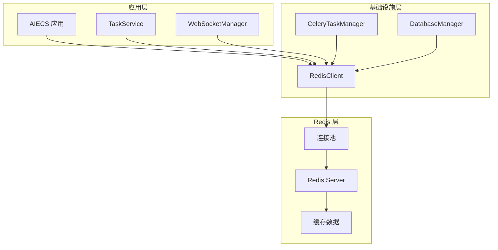
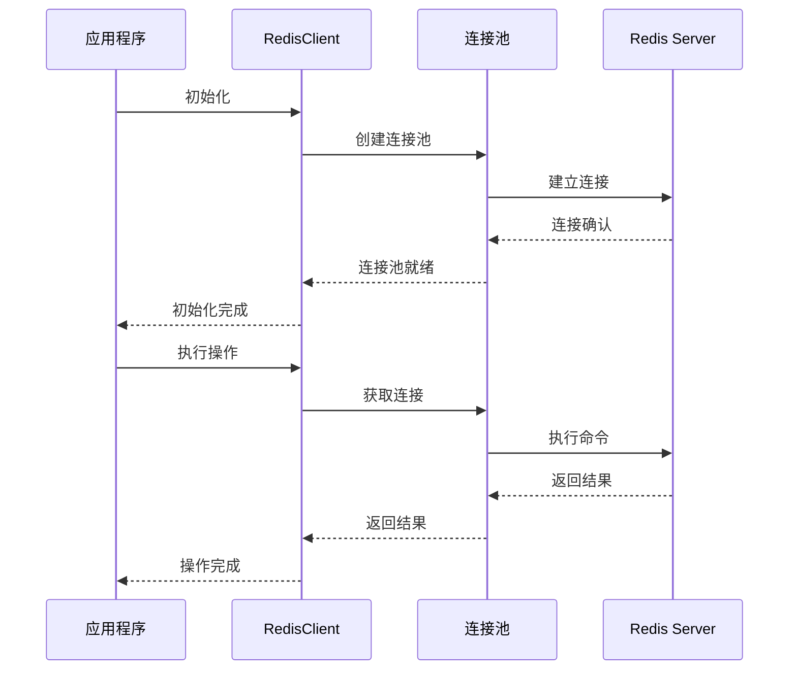
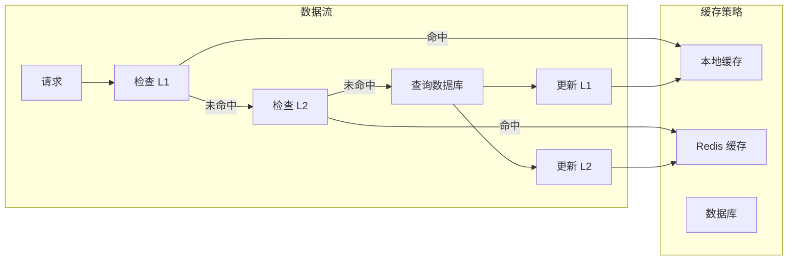

# RedisClient 技术文档

## 1. 概述 (Overview)

### 目的
`RedisClient` 是一个专门用于 Redis 数据库连接和操作的组件，基于 `redis.asyncio` 异步 Redis 驱动构建。它提供了连接池管理、异步操作、错误处理等核心功能，是 AIECS 系统中缓存和会话管理的关键基础设施。

### 核心价值
- **异步 Redis 操作**：基于 asyncio 的高性能异步 Redis 访问
- **连接池管理**：自动管理 Redis 连接池，提高并发性能
- **单例模式**：全局共享的 Redis 客户端实例，避免重复连接
- **错误处理**：完善的错误处理和日志记录机制
- **简单易用**：提供简洁的 API 接口，屏蔽底层复杂性

## 2. 问题背景与设计动机 (Problem & Motivation)

### 问题背景
在 AIECS 系统中，需要处理大量缓存和会话数据，包括：
- **任务状态缓存**：需要缓存任务执行状态和中间结果
- **用户会话管理**：需要存储和管理用户会话信息
- **分布式锁**：需要实现分布式锁机制
- **消息队列**：需要作为 Celery 的消息代理
- **实时数据**：需要存储实时更新的数据

### 设计动机
1. **性能优化**：通过 Redis 缓存提升数据访问性能
2. **状态管理**：提供可靠的状态存储和会话管理
3. **分布式支持**：支持分布式环境下的数据共享
4. **连接复用**：通过连接池减少连接开销
5. **运维简化**：提供统一的 Redis 访问接口

## 3. 架构定位与上下文 (Architecture & Context)

### 系统架构位置
```
┌─────────────────────────────────────────────────────────────┐
│                    AIECS 系统架构                           │
├─────────────────────────────────────────────────────────────┤
│  应用层 (Application Layer)                                │
│  ┌─────────────────┐  ┌─────────────────┐                  │
│  │ TaskService     │  │ WebSocketManager│                 │
│  └─────────────────┘  └─────────────────┘                  │
├─────────────────────────────────────────────────────────────┤
│  基础设施层 (Infrastructure Layer)                         │
│  ┌─────────────────┐  ┌─────────────────┐                  │
│  │ RedisClient     │  │ CeleryTaskManager│                │
│  └─────────────────┘  └─────────────────┘                  │
├─────────────────────────────────────────────────────────────┤
│  数据层 (Data Layer)                                       │
│  ┌─────────────────┐  ┌─────────────────┐                  │
│  │ Redis Server    │  │ 连接池          │                  │
│  └─────────────────┘  └─────────────────┘                  │
└─────────────────────────────────────────────────────────────┘
```

### 上游调用者
- **TaskService**：任务管理服务，需要缓存任务状态
- **WebSocketManager**：WebSocket 管理器，需要存储会话信息
- **CeleryTaskManager**：任务执行器，使用 Redis 作为消息代理
- **DatabaseManager**：数据库管理器，需要缓存查询结果

### 下游依赖
- **Redis Server**：Redis 数据库服务器
- **redis.asyncio**：异步 Redis 客户端库
- **连接池**：Redis 连接池管理

## 4. 核心功能与用例 (Core Features & Use Cases)

### 4.1 基础 Redis 操作

#### 键值对操作
```python
# 获取 Redis 客户端
redis_client = await get_redis_client()

# 设置键值对
await redis_client.set("user:123:name", "张三")
await redis_client.set("user:123:email", "zhangsan@example.com", ex=3600)  # 1小时过期

# 获取值
name = await redis_client.get("user:123:name")
email = await redis_client.get("user:123:email")

print(f"用户名: {name}")
print(f"邮箱: {email}")

# 检查键是否存在
if await redis_client.exists("user:123:name"):
    print("用户信息存在")
```

#### 哈希表操作
```python
# 设置哈希表字段
user_info = {
    "name": "张三",
    "email": "zhangsan@example.com",
    "age": "25",
    "city": "北京"
}
await redis_client.hset("user:123", user_info)

# 获取单个字段
name = await redis_client.hget("user:123", "name")
print(f"用户名: {name}")

# 获取所有字段
user_data = await redis_client.hgetall("user:123")
print(f"用户信息: {user_data}")

# 原子递增
await redis_client.hincrby("user:123", "login_count", 1)
login_count = await redis_client.hget("user:123", "login_count")
print(f"登录次数: {login_count}")
```

### 4.2 任务状态缓存

#### 缓存任务执行状态
```python
async def cache_task_status(task_id: str, status: str, progress: int):
    """缓存任务状态"""
    task_key = f"task:{task_id}"
    task_data = {
        "status": status,
        "progress": str(progress),
        "updated_at": str(int(time.time()))
    }
    
    # 设置任务状态
    await redis_client.hset(task_key, task_data)
    
    # 设置过期时间（24小时）
    await redis_client.expire(task_key, 86400)
    
    print(f"任务 {task_id} 状态已缓存: {status}")

# 获取任务状态
async def get_task_status(task_id: str) -> dict:
    """获取任务状态"""
    task_key = f"task:{task_id}"
    
    if await redis_client.exists(task_key):
        return await redis_client.hgetall(task_key)
    else:
        return {"status": "not_found"}

# 使用示例
await cache_task_status("task_456", "running", 75)
status = await get_task_status("task_456")
print(f"任务状态: {status}")
```

#### 任务结果缓存
```python
async def cache_task_result(task_id: str, result: dict):
    """缓存任务结果"""
    result_key = f"result:{task_id}"
    
    # 将结果序列化为 JSON 字符串
    import json
    result_json = json.dumps(result, ensure_ascii=False)
    
    # 缓存结果，设置1小时过期
    await redis_client.set(result_key, result_json, ex=3600)
    
    print(f"任务 {task_id} 结果已缓存")

async def get_task_result(task_id: str) -> dict:
    """获取任务结果"""
    result_key = f"result:{task_id}"
    result_json = await redis_client.get(result_key)
    
    if result_json:
        import json
        return json.loads(result_json)
    else:
        return None

# 使用示例
task_result = {
    "accuracy": 0.95,
    "processing_time": 120,
    "output_file": "result.csv"
}
await cache_task_result("task_789", task_result)
result = await get_task_result("task_789")
print(f"任务结果: {result}")
```

### 4.3 用户会话管理

#### 会话存储和管理
```python
async def create_user_session(user_id: str, session_data: dict) -> str:
    """创建用户会话"""
    session_id = f"session_{user_id}_{int(time.time())}"
    session_key = f"session:{session_id}"
    
    # 存储会话数据
    session_data["user_id"] = user_id
    session_data["created_at"] = str(int(time.time()))
    
    await redis_client.hset(session_key, session_data)
    
    # 设置会话过期时间（30分钟）
    await redis_client.expire(session_key, 1800)
    
    print(f"用户 {user_id} 会话已创建: {session_id}")
    return session_id

async def get_user_session(session_id: str) -> dict:
    """获取用户会话"""
    session_key = f"session:{session_id}"
    
    if await redis_client.exists(session_key):
        return await redis_client.hgetall(session_key)
    else:
        return {"error": "session_not_found"}

async def update_user_session(session_id: str, updates: dict):
    """更新用户会话"""
    session_key = f"session:{session_id}"
    
    if await redis_client.exists(session_key):
        await redis_client.hset(session_key, updates)
        # 延长过期时间
        await redis_client.expire(session_key, 1800)
        print(f"会话 {session_id} 已更新")
    else:
        print(f"会话 {session_id} 不存在")

# 使用示例
session_id = await create_user_session("user_123", {
    "username": "张三",
    "role": "admin",
    "last_activity": str(int(time.time()))
})

session = await get_user_session(session_id)
print(f"会话信息: {session}")

await update_user_session(session_id, {
    "last_activity": str(int(time.time())),
    "current_page": "/dashboard"
})
```

### 4.4 分布式锁实现

#### 基于 Redis 的分布式锁
```python
import asyncio
import uuid

class DistributedLock:
    def __init__(self, redis_client, lock_name: str, timeout: int = 10):
        self.redis_client = redis_client
        self.lock_name = f"lock:{lock_name}"
        self.timeout = timeout
        self.identifier = str(uuid.uuid4())
    
    async def acquire(self) -> bool:
        """获取锁"""
        # 使用 SET 命令的 NX 和 EX 选项实现原子性
        result = await self.redis_client.set(
            self.lock_name, 
            self.identifier, 
            ex=self.timeout,
            nx=True  # 只在键不存在时设置
        )
        return result
    
    async def release(self) -> bool:
        """释放锁"""
        # 使用 Lua 脚本确保只有锁的持有者才能释放
        lua_script = """
        if redis.call("get", KEYS[1]) == ARGV[1] then
            return redis.call("del", KEYS[1])
        else
            return 0
        end
        """
        
        client = await self.redis_client.get_client()
        result = await client.eval(lua_script, 1, self.lock_name, self.identifier)
        return bool(result)
    
    async def __aenter__(self):
        if await self.acquire():
            return self
        else:
            raise Exception("Failed to acquire lock")
    
    async def __aexit__(self, exc_type, exc_val, exc_tb):
        await self.release()

# 使用分布式锁
async def process_with_lock(resource_id: str):
    """使用分布式锁处理资源"""
    lock = DistributedLock(redis_client, f"resource_{resource_id}")
    
    try:
        async with lock:
            print(f"获取到资源 {resource_id} 的锁")
            # 执行需要互斥访问的操作
            await asyncio.sleep(2)
            print(f"处理资源 {resource_id} 完成")
    except Exception as e:
        print(f"处理资源 {resource_id} 失败: {e}")

# 并发测试
async def test_distributed_lock():
    """测试分布式锁"""
    tasks = [
        process_with_lock("resource_1") for _ in range(5)
    ]
    await asyncio.gather(*tasks)
```

### 4.5 缓存策略实现

#### 多级缓存策略
```python
class CacheManager:
    def __init__(self, redis_client):
        self.redis_client = redis_client
        self.local_cache = {}  # 本地缓存
        self.local_cache_ttl = {}
    
    async def get(self, key: str, ttl: int = 300) -> any:
        """获取缓存数据（多级缓存）"""
        # 1. 检查本地缓存
        if key in self.local_cache:
            if time.time() - self.local_cache_ttl[key] < 60:  # 本地缓存1分钟
                return self.local_cache[key]
            else:
                # 本地缓存过期，删除
                del self.local_cache[key]
                del self.local_cache_ttl[key]
        
        # 2. 检查 Redis 缓存
        value = await self.redis_client.get(key)
        if value:
            # 更新本地缓存
            self.local_cache[key] = value
            self.local_cache_ttl[key] = time.time()
            return value
        
        return None
    
    async def set(self, key: str, value: str, ttl: int = 300):
        """设置缓存数据"""
        # 设置 Redis 缓存
        await self.redis_client.set(key, value, ex=ttl)
        
        # 更新本地缓存
        self.local_cache[key] = value
        self.local_cache_ttl[key] = time.time()
    
    async def delete(self, key: str):
        """删除缓存数据"""
        # 删除 Redis 缓存
        await self.redis_client.delete(key)
        
        # 删除本地缓存
        self.local_cache.pop(key, None)
        self.local_cache_ttl.pop(key, None)

# 使用缓存管理器
cache_manager = CacheManager(redis_client)

# 缓存数据库查询结果
async def get_user_from_cache(user_id: str) -> dict:
    """从缓存获取用户信息"""
    cache_key = f"user:{user_id}"
    
    # 尝试从缓存获取
    cached_data = await cache_manager.get(cache_key)
    if cached_data:
        import json
        return json.loads(cached_data)
    
    # 缓存未命中，从数据库查询
    user_data = await database.get_user(user_id)
    
    # 存入缓存
    if user_data:
        import json
        await cache_manager.set(cache_key, json.dumps(user_data), ttl=600)
    
    return user_data
```

## 5. API 参考 (API Reference)

### 5.1 类定义

#### `RedisClient`
```python
class RedisClient:
    """Redis 客户端单例，用于跨不同缓存策略共享"""
    
    def __init__(self) -> None
    """初始化 Redis 客户端"""
```

### 5.2 公共方法

#### `initialize`
```python
async def initialize(self) -> None
```
**功能**：初始化 Redis 客户端

**异常**：
- `Exception`: 初始化失败

#### `get_client`
```python
async def get_client(self) -> redis.Redis
```
**功能**：获取 Redis 客户端实例

**返回值**：
- `redis.Redis`: Redis 客户端实例

**异常**：
- `RuntimeError`: 客户端未初始化

#### `close`
```python
async def close(self) -> None
```
**功能**：关闭 Redis 连接

#### `set`
```python
async def set(self, key: str, value: str, ex: int = None) -> bool
```
**功能**：设置键值对

**参数**：
- `key` (str): 键名
- `value` (str): 值
- `ex` (int): 过期时间（秒）

**返回值**：
- `bool`: 设置是否成功

#### `get`
```python
async def get(self, key: str) -> Optional[str]
```
**功能**：获取值

**参数**：
- `key` (str): 键名

**返回值**：
- `Optional[str]`: 键对应的值，如果不存在返回 None

#### `hset`
```python
async def hset(self, name: str, mapping: dict) -> int
```
**功能**：设置哈希表字段

**参数**：
- `name` (str): 哈希表名
- `mapping` (dict): 字段映射

**返回值**：
- `int`: 设置的字段数量

#### `hget`
```python
async def hget(self, name: str, key: str) -> Optional[str]
```
**功能**：获取哈希表字段值

**参数**：
- `name` (str): 哈希表名
- `key` (str): 字段名

**返回值**：
- `Optional[str]`: 字段值，如果不存在返回 None

#### `hgetall`
```python
async def hgetall(self, name: str) -> dict
```
**功能**：获取哈希表所有字段

**参数**：
- `name` (str): 哈希表名

**返回值**：
- `dict`: 所有字段的字典

#### `hincrby`
```python
async def hincrby(self, name: str, key: str, amount: int = 1) -> int
```
**功能**：原子递增哈希表字段

**参数**：
- `name` (str): 哈希表名
- `key` (str): 字段名
- `amount` (int): 递增数量

**返回值**：
- `int`: 递增后的值

#### `exists`
```python
async def exists(self, name: str) -> bool
```
**功能**：检查键是否存在

**参数**：
- `name` (str): 键名

**返回值**：
- `bool`: 键是否存在

#### `expire`
```python
async def expire(self, name: str, time: int) -> bool
```
**功能**：设置过期时间

**参数**：
- `name` (str): 键名
- `time` (int): 过期时间（秒）

**返回值**：
- `bool`: 设置是否成功

#### `delete`
```python
async def delete(self, *keys) -> int
```
**功能**：删除一个或多个键

**参数**：
- `*keys`: 要删除的键

**返回值**：
- `int`: 删除的键数量

#### `ping`
```python
async def ping(self) -> bool
```
**功能**：测试 Redis 连接

**返回值**：
- `bool`: 连接是否正常

#### `info`
```python
async def info(self, section: str = None) -> dict
```
**功能**：获取 Redis 服务器信息

**参数**：
- `section` (str): 信息部分

**返回值**：
- `dict`: 服务器信息

### 5.3 全局函数

#### `initialize_redis_client`
```python
async def initialize_redis_client() -> None
```
**功能**：初始化全局 Redis 客户端实例

#### `close_redis_client`
```python
async def close_redis_client() -> None
```
**功能**：关闭全局 Redis 客户端实例

#### `get_redis_client`
```python
async def get_redis_client() -> RedisClient
```
**功能**：获取全局 Redis 客户端实例

**返回值**：
- `RedisClient`: Redis 客户端实例

**异常**：
- `RuntimeError`: 客户端未初始化

## 6. 技术实现细节 (Technical Details)

### 6.1 连接池管理

#### 连接池配置
```python
async def initialize(self):
    """初始化 Redis 客户端"""
    # 从环境变量获取配置
    redis_host = os.getenv('REDIS_HOST', 'localhost')
    redis_port = int(os.getenv('REDIS_PORT', 6379))
    redis_db = int(os.getenv('REDIS_DB', 0))
    redis_password = os.getenv('REDIS_PASSWORD')
    
    # 创建连接池
    self._connection_pool = redis.ConnectionPool(
        host=redis_host,
        port=redis_port,
        db=redis_db,
        password=redis_password,
        decode_responses=True,      # 自动解码响应
        max_connections=20,         # 最大连接数
        retry_on_timeout=True       # 超时重试
    )
    
    # 创建 Redis 客户端
    self._client = redis.Redis(connection_pool=self._connection_pool)
    
    # 测试连接
    await self._client.ping()
```

### 6.2 单例模式实现

#### 全局实例管理
```python
# 全局变量存储单例实例
redis_client: Optional[RedisClient] = None

async def initialize_redis_client():
    """创建并初始化全局 Redis 客户端实例"""
    global redis_client
    if redis_client is None:
        redis_client = RedisClient()
        await redis_client.initialize()

async def get_redis_client() -> RedisClient:
    """获取全局 Redis 客户端实例"""
    if redis_client is None:
        raise RuntimeError("Redis client not initialized. Call initialize_redis_client() first.")
    return redis_client
```

### 6.3 错误处理策略

#### 统一错误处理
```python
async def set(self, key: str, value: str, ex: int = None) -> bool:
    """设置键值对（带错误处理）"""
    try:
        client = await self.get_client()
        return await client.set(key, value, ex=ex)
    except Exception as e:
        logger.error(f"Redis set failed for key {key}: {e}")
        return False

async def get(self, key: str) -> Optional[str]:
    """获取值（带错误处理）"""
    try:
        client = await self.get_client()
        return await client.get(key)
    except Exception as e:
        logger.error(f"Redis get failed for key {key}: {e}")
        return None
```

### 6.4 连接健康检查

#### 连接状态监控
```python
async def ping(self) -> bool:
    """测试 Redis 连接"""
    try:
        client = await self.get_client()
        result = await client.ping()
        return result
    except Exception as e:
        logger.error(f"Redis ping failed: {e}")
        return False

async def get_connection_info(self) -> dict:
    """获取连接信息"""
    try:
        client = await self.get_client()
        info = await client.info('clients')
        return {
            'connected_clients': info.get('connected_clients', 0),
            'client_recent_max_input_buffer': info.get('client_recent_max_input_buffer', 0),
            'client_recent_max_output_buffer': info.get('client_recent_max_output_buffer', 0)
        }
    except Exception as e:
        logger.error(f"Failed to get connection info: {e}")
        return {}
```

## 7. 配置与部署 (Configuration & Deployment)

### 7.1 基本配置

#### 环境变量配置
```bash
# Redis 连接配置
export REDIS_HOST="localhost"
export REDIS_PORT="6379"
export REDIS_DB="0"
export REDIS_PASSWORD="your_password"

# 连接池配置
export REDIS_MAX_CONNECTIONS="20"
export REDIS_RETRY_ON_TIMEOUT="true"
export REDIS_DECODE_RESPONSES="true"
```

#### 代码配置
```python
# 自定义配置
redis_config = {
    'host': 'redis.example.com',
    'port': 6379,
    'db': 0,
    'password': 'secure_password',
    'max_connections': 50,
    'retry_on_timeout': True,
    'decode_responses': True
}

# 创建自定义客户端
custom_client = RedisClient()
# 注意：当前实现使用环境变量，需要修改代码支持自定义配置
```

### 7.2 Docker 部署

#### Docker Compose 配置
```yaml
version: '3.8'
services:
  redis:
    image: redis:7-alpine
    ports:
      - "6379:6379"
    environment:
      - REDIS_PASSWORD=your_password
    command: redis-server --requirepass your_password
    volumes:
      - redis_data:/data
    restart: unless-stopped

  aiecs-app:
    build: .
    environment:
      - REDIS_HOST=redis
      - REDIS_PORT=6379
      - REDIS_DB=0
      - REDIS_PASSWORD=your_password
    depends_on:
      - redis
    restart: unless-stopped

volumes:
  redis_data:
```

#### Dockerfile 配置
```dockerfile
FROM python:3.9-slim

WORKDIR /app

# 安装依赖
COPY requirements.txt .
RUN pip install -r requirements.txt

# 复制应用代码
COPY . .

# 设置环境变量
ENV REDIS_HOST=redis
ENV REDIS_PORT=6379
ENV REDIS_DB=0

# 启动命令
CMD ["python", "-m", "aiecs.infrastructure.persistence.redis_client"]
```

### 7.3 生产环境配置

#### 高可用配置
```python
# 生产环境 Redis 配置
production_config = {
    'host': 'redis-cluster.internal',
    'port': 6379,
    'db': 0,
    'password': 'production_password',
    'max_connections': 100,
    'retry_on_timeout': True,
    'decode_responses': True,
    'socket_keepalive': True,
    'socket_keepalive_options': {},
    'health_check_interval': 30
}
```

#### Redis 集群配置
```yaml
# redis-cluster.yml
version: '3.8'
services:
  redis-node-1:
    image: redis:7-alpine
    command: redis-server --cluster-enabled yes --cluster-config-file nodes.conf --cluster-node-timeout 5000 --appendonly yes --port 7001
    ports:
      - "7001:7001"
    volumes:
      - redis_node_1:/data

  redis-node-2:
    image: redis:7-alpine
    command: redis-server --cluster-enabled yes --cluster-config-file nodes.conf --cluster-node-timeout 5000 --appendonly yes --port 7002
    ports:
      - "7002:7002"
    volumes:
      - redis_node_2:/data

  redis-node-3:
    image: redis:7-alpine
    command: redis-server --cluster-enabled yes --cluster-config-file nodes.conf --cluster-node-timeout 5000 --appendonly yes --port 7003
    ports:
      - "7003:7003"
    volumes:
      - redis_node_3:/data

volumes:
  redis_node_1:
  redis_node_2:
  redis_node_3:
```

## 8. 维护与故障排查 (Maintenance & Troubleshooting)

### 8.1 监控指标

#### 关键指标
- **连接数**：当前活跃连接数量
- **内存使用**：Redis 内存使用情况
- **命令执行数**：每秒执行的命令数量
- **键数量**：数据库中键的总数
- **命中率**：缓存命中率

#### 监控实现
```python
class RedisMonitor:
    def __init__(self, redis_client: RedisClient):
        self.redis_client = redis_client
    
    async def get_health_status(self) -> dict:
        """获取 Redis 健康状态"""
        try:
            # 测试连接
            ping_result = await self.redis_client.ping()
            if not ping_result:
                return {"status": "unhealthy", "error": "ping_failed"}
            
            # 获取服务器信息
            info = await self.redis_client.info()
            
            return {
                "status": "healthy",
                "connected_clients": info.get("connected_clients", 0),
                "used_memory": info.get("used_memory_human", "0B"),
                "total_commands_processed": info.get("total_commands_processed", 0),
                "keyspace_hits": info.get("keyspace_hits", 0),
                "keyspace_misses": info.get("keyspace_misses", 0),
                "uptime_in_seconds": info.get("uptime_in_seconds", 0)
            }
        except Exception as e:
            return {"status": "unhealthy", "error": str(e)}
    
    async def get_memory_usage(self) -> dict:
        """获取内存使用情况"""
        try:
            info = await self.redis_client.info('memory')
            return {
                "used_memory": info.get("used_memory", 0),
                "used_memory_human": info.get("used_memory_human", "0B"),
                "used_memory_peak": info.get("used_memory_peak", 0),
                "used_memory_peak_human": info.get("used_memory_peak_human", "0B"),
                "used_memory_rss": info.get("used_memory_rss", 0),
                "used_memory_rss_human": info.get("used_memory_rss_human", "0B")
            }
        except Exception as e:
            return {"error": str(e)}
    
    async def get_performance_metrics(self) -> dict:
        """获取性能指标"""
        try:
            info = await self.redis_client.info('stats')
            return {
                "total_commands_processed": info.get("total_commands_processed", 0),
                "instantaneous_ops_per_sec": info.get("instantaneous_ops_per_sec", 0),
                "keyspace_hits": info.get("keyspace_hits", 0),
                "keyspace_misses": info.get("keyspace_misses", 0),
                "expired_keys": info.get("expired_keys", 0),
                "evicted_keys": info.get("evicted_keys", 0)
            }
        except Exception as e:
            return {"error": str(e)}

# 使用监控器
monitor = RedisMonitor(redis_client)
health = await monitor.get_health_status()
print(f"Redis 健康状态: {health}")
```

### 8.2 常见故障及解决方案

#### 故障 1：连接超时
**症状**：`redis.exceptions.TimeoutError` 错误

**可能原因**：
- 网络连接不稳定
- Redis 服务器负载过高
- 连接池配置不当

**解决方案**：
```python
# 1. 检查网络连接
import socket
def check_redis_connection(host: str, port: int) -> bool:
    try:
        sock = socket.socket(socket.AF_INET, socket.SOCK_STREAM)
        sock.settimeout(5)
        result = sock.connect_ex((host, port))
        sock.close()
        return result == 0
    except:
        return False

# 2. 调整连接池配置
redis_config = {
    'max_connections': 10,  # 减少连接数
    'retry_on_timeout': True,
    'socket_connect_timeout': 5,
    'socket_timeout': 5
}

# 3. 实现连接重试机制
async def robust_redis_operation(operation, *args, **kwargs):
    """带重试的 Redis 操作"""
    max_retries = 3
    for attempt in range(max_retries):
        try:
            return await operation(*args, **kwargs)
        except redis.exceptions.TimeoutError:
            if attempt == max_retries - 1:
                raise
            await asyncio.sleep(1 * (2 ** attempt))  # 指数退避
```

#### 故障 2：内存不足
**症状**：`redis.exceptions.ResponseError: OOM command not allowed when used memory > 'maxmemory'`

**可能原因**：
- Redis 内存使用超过限制
- 没有设置合适的淘汰策略
- 缓存数据过多

**解决方案**：
```python
# 1. 检查内存使用
async def check_memory_usage():
    """检查内存使用情况"""
    info = await redis_client.info('memory')
    used_memory = info.get('used_memory', 0)
    max_memory = info.get('maxmemory', 0)
    
    if max_memory > 0:
        usage_percent = (used_memory / max_memory) * 100
        print(f"内存使用率: {usage_percent:.2f}%")
        
        if usage_percent > 90:
            print("警告: 内存使用率过高")
    
    return used_memory, max_memory

# 2. 清理过期键
async def cleanup_expired_keys():
    """清理过期键"""
    # 手动触发过期键清理
    client = await redis_client.get_client()
    await client.execute_command('MEMORY', 'PURGE')
    print("已清理过期键")

# 3. 设置内存淘汰策略
# 在 Redis 配置中设置:
# maxmemory-policy allkeys-lru
```

#### 故障 3：键空间通知丢失
**症状**：键过期事件没有正确触发

**可能原因**：
- 键空间通知未启用
- 事件监听器未正确配置
- 网络问题导致事件丢失

**解决方案**：
```python
# 1. 启用键空间通知
# 在 Redis 配置中设置:
# notify-keyspace-events Ex

# 2. 实现键过期监听
async def listen_for_key_expiration():
    """监听键过期事件"""
    client = await redis_client.get_client()
    pubsub = client.pubsub()
    
    # 订阅键过期事件
    await pubsub.psubscribe('__keyevent@0__:expired')
    
    async for message in pubsub.listen():
        if message['type'] == 'pmessage':
            expired_key = message['data']
            print(f"键已过期: {expired_key}")
            # 处理过期事件
            await handle_key_expiration(expired_key)

async def handle_key_expiration(key: str):
    """处理键过期事件"""
    if key.startswith('session:'):
        print(f"会话过期: {key}")
        # 清理相关数据
    elif key.startswith('task:'):
        print(f"任务缓存过期: {key}")
        # 更新任务状态
```

#### 故障 4：数据不一致
**症状**：读取到的数据与预期不符

**可能原因**：
- 并发写入冲突
- 事务未正确执行
- 网络分区导致的数据不一致

**解决方案**：
```python
# 1. 使用事务确保原子性
async def atomic_update_user_score(user_id: str, score_delta: int):
    """原子更新用户分数"""
    client = await redis_client.get_client()
    
    # 使用 MULTI/EXEC 事务
    pipe = client.pipeline()
    pipe.hget(f"user:{user_id}", "score")
    pipe.hincrby(f"user:{user_id}", "score", score_delta)
    pipe.hset(f"user:{user_id}", "last_updated", str(int(time.time())))
    
    results = await pipe.execute()
    old_score = int(results[0] or 0)
    new_score = results[1]
    
    print(f"用户 {user_id} 分数更新: {old_score} -> {new_score}")
    return new_score

# 2. 使用 Lua 脚本确保原子性
async def atomic_transfer_points(from_user: str, to_user: str, points: int):
    """原子转移积分"""
    lua_script = """
    local from_key = KEYS[1]
    local to_key = KEYS[2]
    local points = tonumber(ARGV[1])
    
    local from_balance = tonumber(redis.call('hget', from_key, 'points') or 0)
    if from_balance < points then
        return {false, 'insufficient_balance'}
    end
    
    redis.call('hincrby', from_key, 'points', -points)
    redis.call('hincrby', to_key, 'points', points)
    
    return {true, 'success'}
    """
    
    client = await redis_client.get_client()
    result = await client.eval(
        lua_script, 
        2, 
        f"user:{from_user}", 
        f"user:{to_user}", 
        points
    )
    
    return result[0], result[1]
```

## 9. 可视化图表 (Visualizations)

### 9.1 系统架构图



### 9.2 连接管理流程图



### 9.3 缓存策略图



## 10. 版本历史 (Version History)

### v1.0.0 (2024-01-15)
**新增功能**：
- 基础 Redis 客户端实现
- 支持异步操作
- 实现连接池管理
- 提供基本的键值对操作

**技术特性**：
- 基于 redis.asyncio 构建
- 支持单例模式
- 实现基本的错误处理

### v1.1.0 (2024-02-01)
**功能增强**：
- 添加哈希表操作支持
- 实现过期时间设置
- 添加连接健康检查
- 支持服务器信息查询

**性能优化**：
- 优化连接池配置
- 改进错误处理机制
- 增强日志记录

### v1.2.0 (2024-03-01)
**新增功能**：
- 支持全局实例管理
- 添加应用生命周期管理
- 实现原子操作支持
- 提供监控接口

**稳定性改进**：
- 增强连接重试机制
- 改进资源管理
- 优化异常处理

### v1.3.0 (2024-04-01)
**架构升级**：
- 升级到 redis.asyncio 5.x
- 支持 Redis 集群
- 添加数据序列化支持
- 实现高级缓存策略

**监控增强**：
- 添加详细性能指标
- 实现健康检查接口
- 支持告警集成
- 提供运维管理工具

---

## 附录

### A. 相关文档
- [数据库管理器文档](./DATABASE_MANAGER.md)
- [文件存储文档](./FILE_STORAGE.md)
- [Celery 任务管理器文档](./CELERY_TASK_MANAGER.md)

### B. 外部依赖
- [redis.asyncio 文档](https://redis.readthedocs.io/en/stable/examples/asyncio_examples.html)
- [Redis 官方文档](https://redis.io/docs/)
- [Redis 命令参考](https://redis.io/commands/)

### C. 最佳实践
```python
# 1. 键命名规范
# 使用有意义的键前缀和分隔符
key_patterns = [
    'user:{user_id}:profile',
    'task:{task_id}:status',
    'session:{session_id}:data',
    'cache:{type}:{id}'
]

# 2. 过期时间设置
# 根据数据特性设置合适的过期时间
expiration_times = {
    'session': 1800,      # 30分钟
    'cache': 3600,        # 1小时
    'temp': 300,          # 5分钟
    'permanent': None     # 永不过期
}

# 3. 错误处理最佳实践
async def safe_redis_operation(operation, *args, **kwargs):
    """安全的 Redis 操作"""
    try:
        return await operation(*args, **kwargs)
    except redis.exceptions.ConnectionError:
        logger.error("Redis 连接错误")
        return None
    except redis.exceptions.TimeoutError:
        logger.error("Redis 操作超时")
        return None
    except Exception as e:
        logger.error(f"Redis 操作失败: {e}")
        return None
```

### D. 联系方式
- 技术负责人：AIECS 开发团队
- 问题反馈：通过项目 Issue 系统
- 文档更新：定期维护，版本同步
