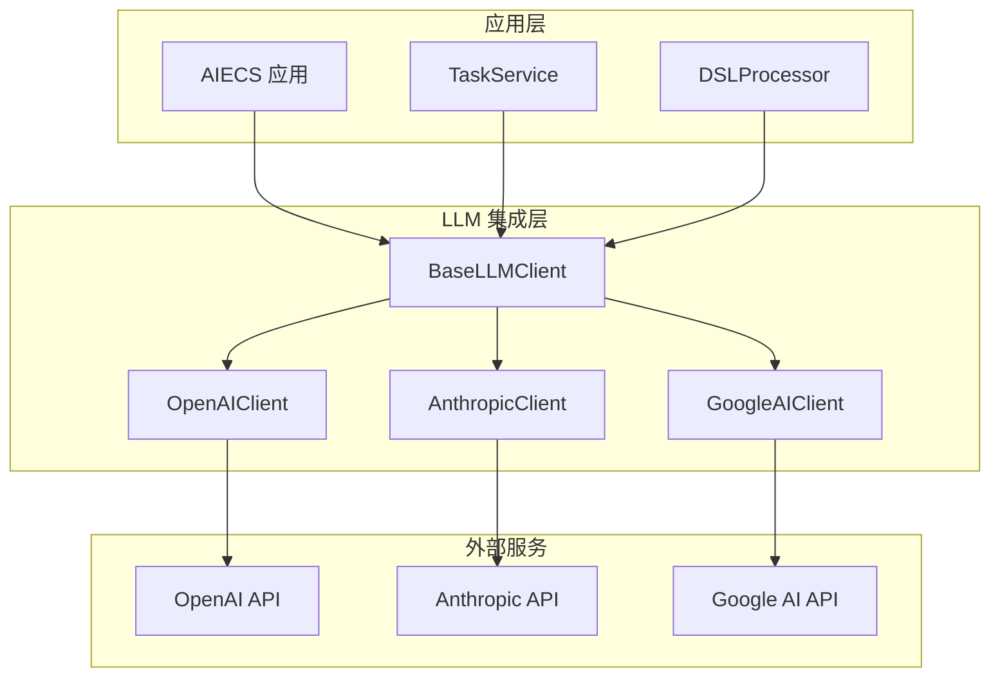
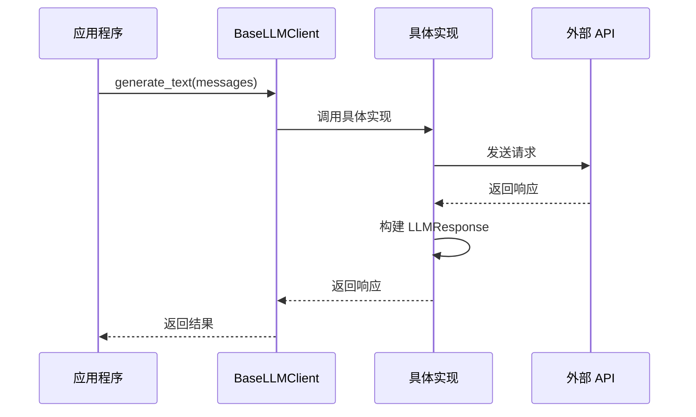
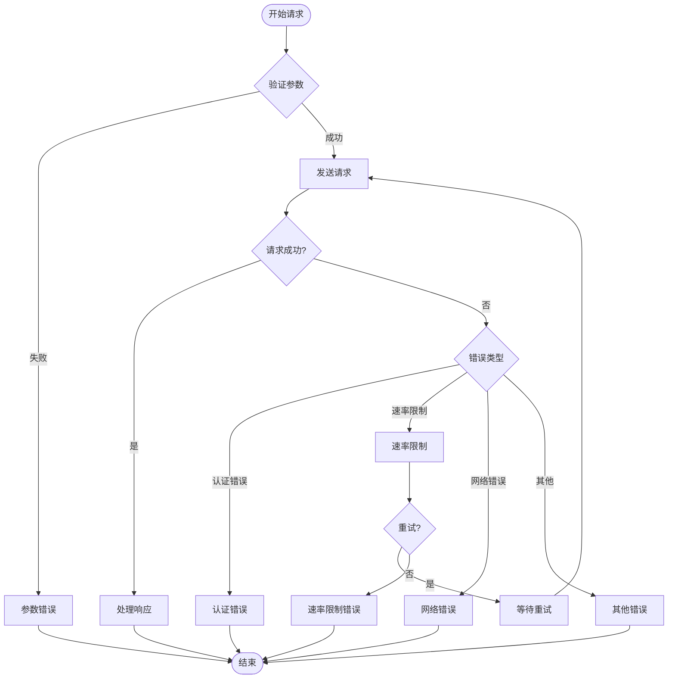

# BaseLLMClient 技术文档

## 1. 概述 (Overview)

### 目的
`BaseLLMClient` 是一个抽象基类，为所有大语言模型（LLM）提供商客户端提供统一的接口和基础功能。它定义了标准的消息格式、响应结构和核心方法，实现了多提供商支持、异步操作、成本估算等核心功能，是 AIECS 系统中 LLM 集成层的核心基础设施。

### 核心价值
- **统一接口**：为不同 LLM 提供商提供一致的 API 接口
- **异步支持**：基于 asyncio 的高性能异步操作
- **流式处理**：支持实时流式文本生成
- **成本控制**：提供 Token 使用量和成本估算功能
- **错误处理**：统一的异常处理和错误分类机制

## 2. 问题背景与设计动机 (Problem & Motivation)

### 问题背景
在 AIECS 系统中，需要集成多种大语言模型服务，包括：
- **多提供商支持**：需要同时支持 OpenAI、Anthropic、Google 等不同提供商
- **接口统一**：不同提供商的 API 接口差异较大，需要统一抽象
- **成本管理**：需要跟踪和估算不同模型的使用成本
- **性能优化**：需要支持异步操作和流式处理以提升用户体验
- **错误处理**：需要统一的错误处理和重试机制

### 设计动机
1. **抽象统一**：通过抽象基类统一不同 LLM 提供商的接口
2. **可扩展性**：便于添加新的 LLM 提供商支持
3. **成本控制**：提供 Token 使用量和成本估算功能
4. **性能优化**：支持异步操作和流式处理
5. **维护简化**：统一的错误处理和日志记录机制

## 3. 架构定位与上下文 (Architecture & Context)

### 系统架构位置
```
┌─────────────────────────────────────────────────────────────┐
│                    AIECS 系统架构                           │
├─────────────────────────────────────────────────────────────┤
│  应用层 (Application Layer)                                │
│  ┌─────────────────┐  ┌─────────────────┐                  │
│  │ TaskService     │  │ DSLProcessor    │                  │
│  └─────────────────┘  └─────────────────┘                  │
├─────────────────────────────────────────────────────────────┤
│  LLM 集成层 (LLM Integration Layer)                        │
│  ┌─────────────────┐  ┌─────────────────┐                  │
│  │ BaseLLMClient   │  │ 具体 LLM 客户端 │                  │
│  └─────────────────┘  └─────────────────┘                  │
├─────────────────────────────────────────────────────────────┤
│  外部服务层 (External Services Layer)                      │
│  ┌─────────────────┐  ┌─────────────────┐                  │
│  │ OpenAI API      │  │ Anthropic API   │                  │
│  └─────────────────┘  └─────────────────┘                  │
└─────────────────────────────────────────────────────────────┘
```

### 上游调用者
- **TaskService**：任务管理服务，需要调用 LLM 进行文本处理
- **DSLProcessor**：DSL 处理器，需要 LLM 进行自然语言理解
- **ChatService**：聊天服务，需要 LLM 进行对话生成
- **ContentGenerator**：内容生成服务，需要 LLM 进行内容创作

### 下游依赖
- **OpenAI API**：OpenAI 大语言模型服务
- **Anthropic API**：Anthropic Claude 模型服务
- **Google AI API**：Google Gemini 模型服务
- **其他 LLM 提供商**：各种第三方 LLM 服务

## 4. 核心功能与用例 (Core Features & Use Cases)

### 4.1 基础文本生成

#### 单次文本生成
```python
from aiecs.llm.base_client import BaseLLMClient, LLMMessage, LLMResponse

# 创建消息列表
messages = [
    LLMMessage(role="system", content="你是一个专业的AI助手，擅长回答技术问题。"),
    LLMMessage(role="user", content="请解释什么是异步编程？")
]

# 调用 LLM 生成文本
async def generate_explanation():
    """生成技术解释"""
    # 这里需要具体的 LLM 客户端实现
    # client = OpenAIClient()  # 或其他具体实现
    
    response = await client.generate_text(
        messages=messages,
        model="gpt-4",
        temperature=0.7,
        max_tokens=500
    )
    
    print(f"生成内容: {response.content}")
    print(f"使用模型: {response.model}")
    print(f"Token 使用: {response.tokens_used}")
    print(f"成本估算: ${response.cost_estimate:.4f}")
    
    return response

# 使用示例
response = await generate_explanation()
```

#### 对话式交互
```python
async def chat_with_llm():
    """与 LLM 进行对话"""
    conversation = [
        LLMMessage(role="system", content="你是一个友好的AI助手。"),
        LLMMessage(role="user", content="你好，我想学习Python编程。"),
    ]
    
    # 第一轮对话
    response1 = await client.generate_text(
        messages=conversation,
        temperature=0.8
    )
    
    print(f"AI: {response1.content}")
    
    # 添加 AI 回复到对话历史
    conversation.append(LLMMessage(role="assistant", content=response1.content))
    conversation.append(LLMMessage(role="user", content="请推荐一些学习资源。"))
    
    # 第二轮对话
    response2 = await client.generate_text(
        messages=conversation,
        temperature=0.8
    )
    
    print(f"AI: {response2.content}")
    
    return conversation
```

### 4.2 流式文本生成

#### 实时流式输出
```python
async def stream_text_generation():
    """流式生成文本"""
    messages = [
        LLMMessage(role="system", content="你是一个创意写作助手。"),
        LLMMessage(role="user", content="请写一个关于人工智能的短故事。")
    ]
    
    print("开始生成故事...")
    
    # 流式生成
    async for chunk in client.stream_text(
        messages=messages,
        model="gpt-4",
        temperature=0.9,
        max_tokens=1000
    ):
        print(chunk, end='', flush=True)  # 实时输出
    
    print("\n故事生成完成！")

# 使用示例
await stream_text_generation()
```

#### 流式对话系统
```python
async def interactive_chat():
    """交互式聊天系统"""
    conversation = [
        LLMMessage(role="system", content="你是一个专业的编程导师。")
    ]
    
    while True:
        user_input = input("\n用户: ")
        if user_input.lower() in ['quit', 'exit', '退出']:
            break
        
        conversation.append(LLMMessage(role="user", content=user_input))
        
        print("AI: ", end='', flush=True)
        
        # 流式生成回复
        ai_response = ""
        async for chunk in client.stream_text(
            messages=conversation,
            temperature=0.7
        ):
            print(chunk, end='', flush=True)
            ai_response += chunk
        
        conversation.append(LLMMessage(role="assistant", content=ai_response))
        print()  # 换行

# 使用示例
await interactive_chat()
```

### 4.3 任务处理集成

#### 任务描述生成
```python
async def generate_task_description(user_input: str) -> str:
    """根据用户输入生成任务描述"""
    messages = [
        LLMMessage(
            role="system", 
            content="你是一个任务分析专家，能够将用户的自然语言描述转换为结构化的任务描述。"
        ),
        LLMMessage(
            role="user", 
            content=f"请分析以下用户需求并生成详细的任务描述：{user_input}"
        )
    ]
    
    response = await client.generate_text(
        messages=messages,
        model="gpt-4",
        temperature=0.3,  # 较低温度确保一致性
        max_tokens=300
    )
    
    return response.content

# 使用示例
user_request = "我想分析销售数据并生成报告"
task_description = await generate_task_description(user_request)
print(f"生成的任务描述: {task_description}")
```

#### 代码生成和优化
```python
async def generate_code(requirements: str, language: str = "python") -> str:
    """根据需求生成代码"""
    messages = [
        LLMMessage(
            role="system",
            content=f"你是一个专业的{language}程序员，能够根据需求生成高质量的代码。"
        ),
        LLMMessage(
            role="user",
            content=f"请根据以下需求生成{language}代码：\n{requirements}"
        )
    ]
    
    response = await client.generate_text(
        messages=messages,
        model="gpt-4",
        temperature=0.2,  # 低温度确保代码准确性
        max_tokens=1000
    )
    
    return response.content

# 使用示例
requirements = "实现一个快速排序算法，包含详细的注释"
code = await generate_code(requirements, "python")
print(f"生成的代码:\n{code}")
```

### 4.4 内容分析和处理

#### 文本摘要生成
```python
async def summarize_text(text: str, max_length: int = 200) -> str:
    """生成文本摘要"""
    messages = [
        LLMMessage(
            role="system",
            content=f"你是一个专业的文本摘要专家，能够生成简洁准确的摘要，长度不超过{max_length}字。"
        ),
        LLMMessage(
            role="user",
            content=f"请为以下文本生成摘要：\n\n{text}"
        )
    ]
    
    response = await client.generate_text(
        messages=messages,
        model="gpt-3.5-turbo",
        temperature=0.3,
        max_tokens=max_length
    )
    
    return response.content

# 使用示例
long_text = """
人工智能（AI）是计算机科学的一个分支，它企图了解智能的实质，
并生产出一种新的能以人类智能相似的方式做出反应的智能机器...
"""
summary = await summarize_text(long_text, 100)
print(f"摘要: {summary}")
```

#### 情感分析
```python
async def analyze_sentiment(text: str) -> dict:
    """分析文本情感"""
    messages = [
        LLMMessage(
            role="system",
            content="你是一个情感分析专家，能够准确分析文本的情感倾向。请返回JSON格式：{'sentiment': 'positive/negative/neutral', 'confidence': 0.0-1.0, 'reason': '分析原因'}"
        ),
        LLMMessage(
            role="user",
            content=f"请分析以下文本的情感：{text}"
        )
    ]
    
    response = await client.generate_text(
        messages=messages,
        model="gpt-3.5-turbo",
        temperature=0.1,  # 低温度确保一致性
        max_tokens=200
    )
    
    import json
    try:
        return json.loads(response.content)
    except json.JSONDecodeError:
        return {"error": "无法解析响应", "raw_response": response.content}

# 使用示例
text = "这个产品真的很棒，我非常满意！"
sentiment = await analyze_sentiment(text)
print(f"情感分析结果: {sentiment}")
```

### 4.5 批量处理

#### 批量文本处理
```python
async def batch_process_texts(texts: List[str], operation: str) -> List[str]:
    """批量处理文本"""
    results = []
    
    for i, text in enumerate(texts):
        print(f"处理文本 {i+1}/{len(texts)}")
        
        messages = [
            LLMMessage(
                role="system",
                content=f"你是一个文本处理专家，请执行以下操作：{operation}"
            ),
            LLMMessage(role="user", content=text)
        ]
        
        response = await client.generate_text(
            messages=messages,
            model="gpt-3.5-turbo",
            temperature=0.3
        )
        
        results.append(response.content)
        
        # 添加延迟避免速率限制
        await asyncio.sleep(0.1)
    
    return results

# 使用示例
texts = [
    "这是第一段文本",
    "这是第二段文本",
    "这是第三段文本"
]
processed = await batch_process_texts(texts, "将文本转换为正式商务语言")
for i, result in enumerate(processed):
    print(f"文本 {i+1}: {result}")
```

## 5. API 参考 (API Reference)

### 5.1 数据类定义

#### `LLMMessage`
```python
@dataclass
class LLMMessage:
    """LLM 消息数据类"""
    role: str      # 角色："system", "user", "assistant"
    content: str   # 消息内容
```

#### `LLMResponse`
```python
@dataclass
class LLMResponse:
    """LLM 响应数据类"""
    content: str                    # 响应内容
    provider: str                   # 提供商名称
    model: str                      # 模型名称
    tokens_used: Optional[int] = None           # 总 Token 数
    prompt_tokens: Optional[int] = None         # 输入 Token 数
    completion_tokens: Optional[int] = None     # 输出 Token 数
    cost_estimate: Optional[float] = None       # 成本估算
    response_time: Optional[float] = None       # 响应时间
```

### 5.2 异常类定义

#### `LLMClientError`
```python
class LLMClientError(Exception):
    """LLM 客户端基础异常"""
    pass
```

#### `ProviderNotAvailableError`
```python
class ProviderNotAvailableError(LLMClientError):
    """提供商不可用异常"""
    pass
```

#### `RateLimitError`
```python
class RateLimitError(LLMClientError):
    """速率限制异常"""
    pass
```

### 5.3 抽象基类

#### `BaseLLMClient`
```python
class BaseLLMClient(ABC):
    """所有 LLM 提供商客户端的抽象基类"""
    
    def __init__(self, provider_name: str) -> None
    """初始化 LLM 客户端
    
    Args:
        provider_name: 提供商名称
    """
```

### 5.4 抽象方法

#### `generate_text`
```python
@abstractmethod
async def generate_text(
    self,
    messages: List[LLMMessage],
    model: Optional[str] = None,
    temperature: float = 0.7,
    max_tokens: Optional[int] = None,
    **kwargs
) -> LLMResponse
```
**功能**：生成文本

**参数**：
- `messages` (List[LLMMessage]): 消息列表
- `model` (Optional[str]): 模型名称
- `temperature` (float): 温度参数，默认 0.7
- `max_tokens` (Optional[int]): 最大 Token 数
- `**kwargs`: 其他参数

**返回值**：
- `LLMResponse`: LLM 响应对象

#### `stream_text`
```python
@abstractmethod
async def stream_text(
    self,
    messages: List[LLMMessage],
    model: Optional[str] = None,
    temperature: float = 0.7,
    max_tokens: Optional[int] = None,
    **kwargs
) -> AsyncGenerator[str, None]
```
**功能**：流式生成文本

**参数**：同 `generate_text`

**返回值**：
- `AsyncGenerator[str, None]`: 文本块生成器

#### `close`
```python
@abstractmethod
async def close(self) -> None
```
**功能**：清理资源

### 5.5 工具方法

#### `_count_tokens_estimate`
```python
def _count_tokens_estimate(self, text: str) -> int
```
**功能**：估算 Token 数量

**参数**：
- `text` (str): 文本内容

**返回值**：
- `int`: 估算的 Token 数量

#### `_estimate_cost`
```python
def _estimate_cost(self, model: str, input_tokens: int, output_tokens: int, token_costs: Dict) -> float
```
**功能**：估算成本

**参数**：
- `model` (str): 模型名称
- `input_tokens` (int): 输入 Token 数
- `output_tokens` (int): 输出 Token 数
- `token_costs` (Dict): Token 成本配置

**返回值**：
- `float`: 估算成本

## 6. 技术实现细节 (Technical Details)

### 6.1 抽象基类设计

#### 接口统一
```python
class BaseLLMClient(ABC):
    """抽象基类设计"""
    
    def __init__(self, provider_name: str):
        self.provider_name = provider_name
        self.logger = logging.getLogger(f"{__name__}.{provider_name}")
    
    @abstractmethod
    async def generate_text(self, messages: List[LLMMessage], **kwargs) -> LLMResponse:
        """统一的文本生成接口"""
        pass
    
    @abstractmethod
    async def stream_text(self, messages: List[LLMMessage], **kwargs) -> AsyncGenerator[str, None]:
        """统一的流式生成接口"""
        pass
```

### 6.2 数据类设计

#### 消息结构
```python
@dataclass
class LLMMessage:
    """标准化的消息结构"""
    role: str      # 角色类型
    content: str   # 消息内容
    
    def __post_init__(self):
        """验证消息格式"""
        if self.role not in ["system", "user", "assistant"]:
            raise ValueError(f"Invalid role: {self.role}")
        if not self.content.strip():
            raise ValueError("Message content cannot be empty")
```

#### 响应结构
```python
@dataclass
class LLMResponse:
    """标准化的响应结构"""
    content: str
    provider: str
    model: str
    tokens_used: Optional[int] = None
    prompt_tokens: Optional[int] = None
    completion_tokens: Optional[int] = None
    cost_estimate: Optional[float] = None
    response_time: Optional[float] = None
    
    def __post_init__(self):
        """确保 Token 数据一致性"""
        # 如果有详细 Token 信息但没有总数，计算总数
        if (self.prompt_tokens is not None and 
            self.completion_tokens is not None and 
            self.tokens_used is None):
            self.tokens_used = self.prompt_tokens + self.completion_tokens
```

### 6.3 错误处理机制

#### 异常层次结构
```python
class LLMClientError(Exception):
    """基础异常类"""
    pass

class ProviderNotAvailableError(LLMClientError):
    """提供商不可用"""
    pass

class RateLimitError(LLMClientError):
    """速率限制"""
    pass

class AuthenticationError(LLMClientError):
    """认证错误"""
    pass

class ModelNotFoundError(LLMClientError):
    """模型不存在"""
    pass
```

#### 错误处理策略
```python
async def safe_generate_text(self, messages: List[LLMMessage], **kwargs) -> Optional[LLMResponse]:
    """安全的文本生成（带错误处理）"""
    try:
        return await self.generate_text(messages, **kwargs)
    except RateLimitError as e:
        self.logger.warning(f"Rate limit exceeded: {e}")
        # 实现退避重试
        await asyncio.sleep(1)
        return await self.generate_text(messages, **kwargs)
    except ProviderNotAvailableError as e:
        self.logger.error(f"Provider not available: {e}")
        return None
    except Exception as e:
        self.logger.error(f"Unexpected error: {e}")
        raise LLMClientError(f"Text generation failed: {e}")
```

### 6.4 成本估算机制

#### Token 计数
```python
def _count_tokens_estimate(self, text: str) -> int:
    """Token 数量估算"""
    # 简单估算：4个字符约等于1个Token（英文）
    return len(text) // 4

def _count_tokens_accurate(self, text: str, model: str) -> int:
    """精确 Token 计数（需要具体实现）"""
    # 这里需要根据具体提供商实现
    # 例如使用 tiktoken 库
    pass
```

#### 成本计算
```python
def _estimate_cost(self, model: str, input_tokens: int, output_tokens: int, token_costs: Dict) -> float:
    """成本估算"""
    if model in token_costs:
        costs = token_costs[model]
        return (input_tokens * costs["input"] + output_tokens * costs["output"]) / 1000
    return 0.0

# 成本配置示例
TOKEN_COSTS = {
    "gpt-4": {
        "input": 0.03,    # 每1K输入Token
        "output": 0.06    # 每1K输出Token
    },
    "gpt-3.5-turbo": {
        "input": 0.0015,
        "output": 0.002
    }
}
```

### 6.5 上下文管理

#### 异步上下文管理器
```python
async def __aenter__(self):
    """异步上下文管理器入口"""
    return self

async def __aexit__(self, exc_type, exc_val, exc_tb):
    """异步上下文管理器出口"""
    await self.close()

# 使用示例
async with client as llm:
    response = await llm.generate_text(messages)
    # 自动清理资源
```

## 7. 配置与部署 (Configuration & Deployment)

### 7.1 基本配置

#### 环境变量配置
```bash
# OpenAI 配置
export OPENAI_API_KEY="your_openai_api_key"
export OPENAI_BASE_URL="https://api.openai.com/v1"

# Anthropic 配置
export ANTHROPIC_API_KEY="your_anthropic_api_key"

# Google AI 配置
export GOOGLE_AI_API_KEY="your_google_ai_api_key"

# 通用配置
export LLM_DEFAULT_MODEL="gpt-3.5-turbo"
export LLM_DEFAULT_TEMPERATURE="0.7"
export LLM_MAX_TOKENS="1000"
export LLM_TIMEOUT="30"
```

#### 配置文件
```python
# config/llm_config.py
LLM_CONFIG = {
    "providers": {
        "openai": {
            "api_key": os.getenv("OPENAI_API_KEY"),
            "base_url": os.getenv("OPENAI_BASE_URL", "https://api.openai.com/v1"),
            "models": ["gpt-4", "gpt-3.5-turbo", "gpt-3.5-turbo-16k"]
        },
        "anthropic": {
            "api_key": os.getenv("ANTHROPIC_API_KEY"),
            "models": ["claude-3-opus", "claude-3-sonnet", "claude-3-haiku"]
        },
        "google": {
            "api_key": os.getenv("GOOGLE_AI_API_KEY"),
            "models": ["gemini-pro", "gemini-pro-vision"]
        }
    },
    "defaults": {
        "model": "gpt-3.5-turbo",
        "temperature": 0.7,
        "max_tokens": 1000,
        "timeout": 30
    },
    "costs": {
        "gpt-4": {"input": 0.03, "output": 0.06},
        "gpt-3.5-turbo": {"input": 0.0015, "output": 0.002},
        "claude-3-opus": {"input": 0.015, "output": 0.075}
    }
}
```

### 7.2 具体实现示例

#### OpenAI 客户端实现
```python
# llm/openai_client.py
import openai
from .base_client import BaseLLMClient, LLMMessage, LLMResponse

class OpenAIClient(BaseLLMClient):
    def __init__(self, api_key: str, base_url: str = None):
        super().__init__("openai")
        self.client = openai.AsyncOpenAI(
            api_key=api_key,
            base_url=base_url
        )
    
    async def generate_text(self, messages: List[LLMMessage], **kwargs) -> LLMResponse:
        """实现 OpenAI 文本生成"""
        start_time = time.time()
        
        # 转换消息格式
        openai_messages = [
            {"role": msg.role, "content": msg.content}
            for msg in messages
        ]
        
        # 调用 OpenAI API
        response = await self.client.chat.completions.create(
            messages=openai_messages,
            **kwargs
        )
        
        # 构建响应
        return LLMResponse(
            content=response.choices[0].message.content,
            provider="openai",
            model=response.model,
            prompt_tokens=response.usage.prompt_tokens,
            completion_tokens=response.usage.completion_tokens,
            tokens_used=response.usage.total_tokens,
            response_time=time.time() - start_time
        )
    
    async def stream_text(self, messages: List[LLMMessage], **kwargs) -> AsyncGenerator[str, None]:
        """实现 OpenAI 流式生成"""
        openai_messages = [
            {"role": msg.role, "content": msg.content}
            for msg in messages
        ]
        
        stream = await self.client.chat.completions.create(
            messages=openai_messages,
            stream=True,
            **kwargs
        )
        
        async for chunk in stream:
            if chunk.choices[0].delta.content:
                yield chunk.choices[0].delta.content
    
    async def close(self):
        """清理资源"""
        await self.client.close()
```

### 7.3 Docker 部署

#### Dockerfile 配置
```dockerfile
FROM python:3.9-slim

WORKDIR /app

# 安装依赖
COPY requirements.txt .
RUN pip install -r requirements.txt

# 复制应用代码
COPY . .

# 设置环境变量
ENV LLM_DEFAULT_MODEL="gpt-3.5-turbo"
ENV LLM_DEFAULT_TEMPERATURE="0.7"

# 启动命令
CMD ["python", "-m", "aiecs.llm.base_client"]
```

#### Docker Compose 配置
```yaml
version: '3.8'
services:
  llm-service:
    build: .
    environment:
      - OPENAI_API_KEY=${OPENAI_API_KEY}
      - ANTHROPIC_API_KEY=${ANTHROPIC_API_KEY}
      - GOOGLE_AI_API_KEY=${GOOGLE_AI_API_KEY}
      - LLM_DEFAULT_MODEL=gpt-3.5-turbo
    restart: unless-stopped
    ports:
      - "8000:8000"
```

## 8. 维护与故障排查 (Maintenance & Troubleshooting)

### 8.1 监控指标

#### 关键指标
- **请求成功率**：`(成功请求数 / 总请求数) * 100%`
- **平均响应时间**：LLM 请求的平均响应时间
- **Token 使用量**：输入和输出 Token 的使用统计
- **成本统计**：各模型的使用成本统计
- **错误率**：按错误类型分类的错误统计

#### 监控实现
```python
class LLMMonitor:
    def __init__(self):
        self.metrics = {
            "total_requests": 0,
            "successful_requests": 0,
            "failed_requests": 0,
            "total_tokens": 0,
            "total_cost": 0.0,
            "avg_response_time": 0.0
        }
    
    def record_request(self, success: bool, tokens: int, cost: float, response_time: float):
        """记录请求指标"""
        self.metrics["total_requests"] += 1
        if success:
            self.metrics["successful_requests"] += 1
        else:
            self.metrics["failed_requests"] += 1
        
        self.metrics["total_tokens"] += tokens
        self.metrics["total_cost"] += cost
        
        # 更新平均响应时间
        total = self.metrics["total_requests"]
        current_avg = self.metrics["avg_response_time"]
        self.metrics["avg_response_time"] = (current_avg * (total - 1) + response_time) / total
    
    def get_metrics(self) -> dict:
        """获取监控指标"""
        success_rate = (self.metrics["successful_requests"] / 
                       max(self.metrics["total_requests"], 1)) * 100
        
        return {
            **self.metrics,
            "success_rate": success_rate,
            "error_rate": 100 - success_rate
        }

# 使用监控器
monitor = LLMMonitor()

# 在请求中记录指标
async def monitored_generate_text(self, messages: List[LLMMessage], **kwargs) -> LLMResponse:
    start_time = time.time()
    try:
        response = await self.generate_text(messages, **kwargs)
        monitor.record_request(
            success=True,
            tokens=response.tokens_used or 0,
            cost=response.cost_estimate or 0.0,
            response_time=time.time() - start_time
        )
        return response
    except Exception as e:
        monitor.record_request(
            success=False,
            tokens=0,
            cost=0.0,
            response_time=time.time() - start_time
        )
        raise
```

### 8.2 常见故障及解决方案

#### 故障 1：API 密钥无效
**症状**：`AuthenticationError` 或 `401 Unauthorized` 错误

**可能原因**：
- API 密钥错误或过期
- 密钥权限不足
- 环境变量未正确设置

**解决方案**：
```python
# 1. 验证 API 密钥
async def validate_api_key(provider: str, api_key: str) -> bool:
    """验证 API 密钥"""
    try:
        if provider == "openai":
            client = openai.AsyncOpenAI(api_key=api_key)
            await client.models.list()
            return True
        elif provider == "anthropic":
            # 实现 Anthropic 密钥验证
            pass
        return False
    except Exception:
        return False

# 2. 检查环境变量
def check_environment_variables():
    """检查环境变量"""
    required_vars = ["OPENAI_API_KEY", "ANTHROPIC_API_KEY"]
    missing_vars = []
    
    for var in required_vars:
        if not os.getenv(var):
            missing_vars.append(var)
    
    if missing_vars:
        raise ValueError(f"Missing environment variables: {missing_vars}")

# 3. 实现密钥轮换
class APIKeyManager:
    def __init__(self):
        self.keys = {
            "openai": [os.getenv("OPENAI_API_KEY_1"), os.getenv("OPENAI_API_KEY_2")],
            "anthropic": [os.getenv("ANTHROPIC_API_KEY_1"), os.getenv("ANTHROPIC_API_KEY_2")]
        }
        self.current_index = {provider: 0 for provider in self.keys}
    
    def get_key(self, provider: str) -> str:
        """获取当前可用的 API 密钥"""
        keys = self.keys[provider]
        current = self.current_index[provider]
        return keys[current]
    
    def rotate_key(self, provider: str):
        """轮换到下一个 API 密钥"""
        self.current_index[provider] = (self.current_index[provider] + 1) % len(self.keys[provider])
```

#### 故障 2：速率限制
**症状**：`RateLimitError` 或 `429 Too Many Requests` 错误

**可能原因**：
- 请求频率超过限制
- 并发请求过多
- 配额用尽

**解决方案**：
```python
import asyncio
from functools import wraps

def rate_limit_retry(max_retries: int = 3, base_delay: float = 1.0):
    """速率限制重试装饰器"""
    def decorator(func):
        @wraps(func)
        async def wrapper(*args, **kwargs):
            for attempt in range(max_retries):
                try:
                    return await func(*args, **kwargs)
                except RateLimitError as e:
                    if attempt == max_retries - 1:
                        raise
                    
                    # 指数退避
                    delay = base_delay * (2 ** attempt)
                    logger.warning(f"Rate limit hit, retrying in {delay}s (attempt {attempt + 1}/{max_retries})")
                    await asyncio.sleep(delay)
            return None
        return wrapper
    return decorator

# 使用重试装饰器
@rate_limit_retry(max_retries=3, base_delay=1.0)
async def generate_text_with_retry(self, messages: List[LLMMessage], **kwargs) -> LLMResponse:
    return await self.generate_text(messages, **kwargs)

# 实现请求队列
class RequestQueue:
    def __init__(self, max_concurrent: int = 5):
        self.semaphore = asyncio.Semaphore(max_concurrent)
        self.queue = asyncio.Queue()
    
    async def process_request(self, func, *args, **kwargs):
        """处理请求（带并发控制）"""
        async with self.semaphore:
            return await func(*args, **kwargs)
```

#### 故障 3：模型不可用
**症状**：`ModelNotFoundError` 或 `404 Not Found` 错误

**可能原因**：
- 模型名称错误
- 模型在当前区域不可用
- 模型已弃用

**解决方案**：
```python
class ModelManager:
    def __init__(self):
        self.available_models = {
            "openai": ["gpt-4", "gpt-3.5-turbo", "gpt-3.5-turbo-16k"],
            "anthropic": ["claude-3-opus", "claude-3-sonnet", "claude-3-haiku"],
            "google": ["gemini-pro", "gemini-pro-vision"]
        }
        self.fallback_models = {
            "gpt-4": "gpt-3.5-turbo",
            "claude-3-opus": "claude-3-sonnet"
        }
    
    def get_available_model(self, provider: str, requested_model: str) -> str:
        """获取可用的模型"""
        available = self.available_models.get(provider, [])
        
        if requested_model in available:
            return requested_model
        
        # 尝试回退模型
        fallback = self.fallback_models.get(requested_model)
        if fallback and fallback in available:
            logger.warning(f"Model {requested_model} not available, using {fallback}")
            return fallback
        
        # 使用默认模型
        default = available[0] if available else "gpt-3.5-turbo"
        logger.warning(f"Using default model {default}")
        return default
    
    async def validate_model(self, provider: str, model: str) -> bool:
        """验证模型是否可用"""
        try:
            # 实现模型验证逻辑
            return True
        except Exception:
            return False
```

#### 故障 4：网络连接问题
**症状**：`ConnectionError` 或超时错误

**可能原因**：
- 网络连接不稳定
- 代理配置问题
- DNS 解析失败

**解决方案**：
```python
import aiohttp
from aiohttp import ClientTimeout, TCPConnector

class RobustHTTPClient:
    def __init__(self, timeout: int = 30, max_retries: int = 3):
        self.timeout = ClientTimeout(total=timeout)
        self.max_retries = max_retries
        
        # 配置连接器
        connector = TCPConnector(
            limit=100,
            limit_per_host=30,
            keepalive_timeout=30,
            enable_cleanup_closed=True
        )
        
        self.session = aiohttp.ClientSession(
            timeout=self.timeout,
            connector=connector
        )
    
    async def request_with_retry(self, method: str, url: str, **kwargs):
        """带重试的请求"""
        for attempt in range(self.max_retries):
            try:
                async with self.session.request(method, url, **kwargs) as response:
                    return await response.json()
            except (aiohttp.ClientError, asyncio.TimeoutError) as e:
                if attempt == self.max_retries - 1:
                    raise
                
                delay = 2 ** attempt
                logger.warning(f"Request failed (attempt {attempt + 1}/{self.max_retries}): {e}")
                await asyncio.sleep(delay)
    
    async def close(self):
        """关闭会话"""
        await self.session.close()
```

## 9. 可视化图表 (Visualizations)

### 9.1 系统架构图



### 9.2 请求流程图



### 9.3 错误处理流程图



## 10. 版本历史 (Version History)

### v1.0.0 (2024-01-15)
**新增功能**：
- 基础抽象类实现
- 支持消息和响应数据结构
- 实现异步操作接口
- 提供基本的错误处理

**技术特性**：
- 基于 ABC 抽象基类设计
- 支持异步生成和流式处理
- 实现上下文管理器

### v1.1.0 (2024-02-01)
**功能增强**：
- 添加 Token 计数和成本估算
- 实现错误分类和异常处理
- 支持多种提供商接口
- 添加日志记录功能

**性能优化**：
- 优化异步操作性能
- 改进错误处理机制
- 增强资源管理

### v1.2.0 (2024-03-01)
**新增功能**：
- 支持流式文本生成
- 添加成本监控和统计
- 实现请求重试机制
- 提供健康检查接口

**稳定性改进**：
- 增强错误恢复能力
- 改进并发控制
- 优化资源清理

### v1.3.0 (2024-04-01)
**架构升级**：
- 支持更多 LLM 提供商
- 添加模型管理和回退机制
- 实现高级缓存策略
- 支持批量处理

**监控增强**：
- 添加详细性能指标
- 实现成本分析工具
- 支持告警集成
- 提供运维管理界面

---

## 附录

### A. 相关文档
- [OpenAI 客户端文档](./OPENAI_CLIENT.md)
- [Anthropic 客户端文档](./ANTHROPIC_CLIENT.md)
- [系统配置指南](../CONFIG/SYSTEM_CONFIG.md)

### B. 外部依赖
- [OpenAI Python 库](https://github.com/openai/openai-python)
- [Anthropic Python 库](https://github.com/anthropics/anthropic-sdk-python)
- [Google AI Python 库](https://github.com/google/generative-ai-python)

### C. 最佳实践
```python
# 1. 消息构建最佳实践
def build_conversation(system_prompt: str, user_messages: List[str]) -> List[LLMMessage]:
    """构建对话消息"""
    messages = [LLMMessage(role="system", content=system_prompt)]
    
    for i, content in enumerate(user_messages):
        role = "user" if i % 2 == 0 else "assistant"
        messages.append(LLMMessage(role=role, content=content))
    
    return messages

# 2. 错误处理最佳实践
async def safe_llm_call(client: BaseLLMClient, messages: List[LLMMessage], **kwargs) -> Optional[LLMResponse]:
    """安全的 LLM 调用"""
    try:
        return await client.generate_text(messages, **kwargs)
    except RateLimitError:
        logger.warning("Rate limit exceeded, implementing backoff")
        await asyncio.sleep(5)
        return await client.generate_text(messages, **kwargs)
    except ProviderNotAvailableError:
        logger.error("Provider not available, using fallback")
        return None
    except Exception as e:
        logger.error(f"Unexpected error: {e}")
        return None

# 3. 成本控制最佳实践
class CostController:
    def __init__(self, daily_budget: float = 10.0):
        self.daily_budget = daily_budget
        self.daily_spent = 0.0
    
    def can_make_request(self, estimated_cost: float) -> bool:
        """检查是否可以发起请求"""
        return self.daily_spent + estimated_cost <= self.daily_budget
    
    def record_cost(self, cost: float):
        """记录成本"""
        self.daily_spent += cost
```

### D. 联系方式
- 技术负责人：AIECS 开发团队
- 问题反馈：通过项目 Issue 系统
- 文档更新：定期维护，版本同步
