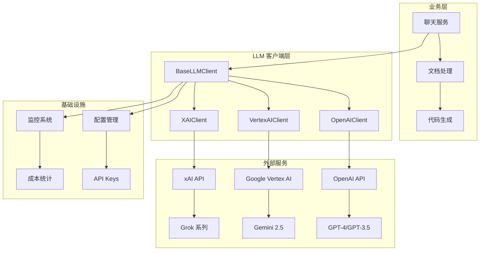
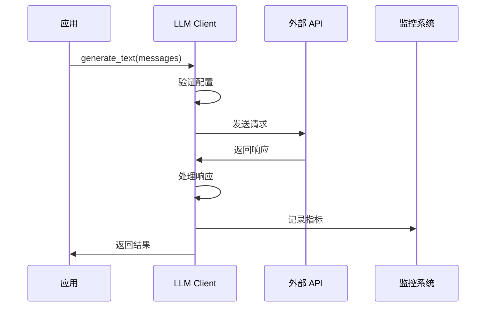
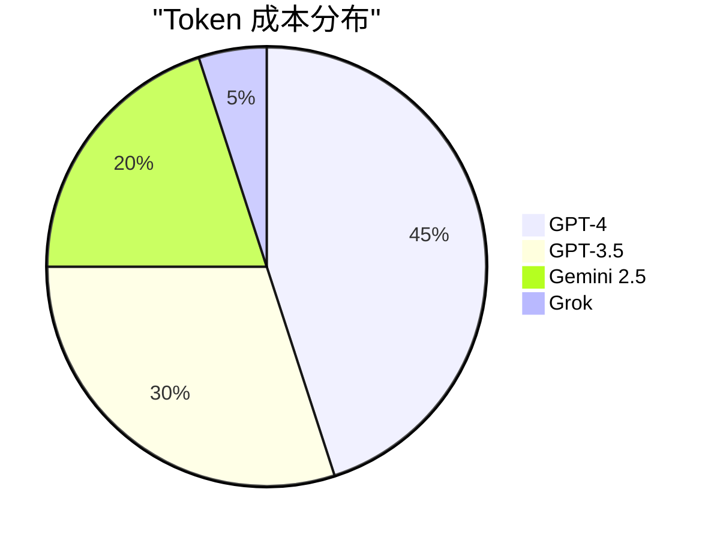
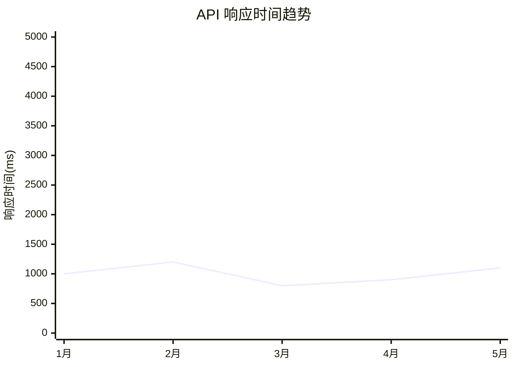

# LLM AI 客户端技术文档

## 1. 概述 (Overview)

**目的**：AIECS 系统的 LLM 客户端模块提供了统一的大语言模型接口，支持 OpenAI、Google Vertex AI 和 xAI (Grok) 三大主流 AI 服务提供商。该模块通过抽象基类设计，实现了多厂商的统一调用接口，解决了 AI 服务集成复杂、厂商锁定、成本控制等关键问题。

**核心价值**：
- **统一接口**：提供一致的 API 调用方式，屏蔽不同厂商的差异
- **多厂商支持**：同时支持 OpenAI、Vertex AI、xAI 三大主流服务
- **成本控制**：内置 token 成本估算和用量统计
- **高可用性**：集成重试机制和错误处理
- **流式支持**：支持实时流式文本生成

## 2. 问题背景与设计动机 (Problem & Motivation)

### 2.1 业务痛点

在 AI 应用开发中面临以下挑战：

1. **厂商锁定风险**：单一厂商依赖导致业务风险
2. **接口不统一**：不同厂商 API 差异大，开发成本高
3. **成本不可控**：缺乏统一的成本监控和优化机制
4. **可用性保障**：单点故障影响业务连续性
5. **性能优化**：缺乏统一的性能监控和调优

### 2.2 设计动机

基于以上痛点，设计了统一的 LLM 客户端架构：

- **抽象化设计**：通过 `BaseLLMClient` 定义统一接口
- **多厂商适配**：为每个厂商实现专门的客户端
- **成本透明化**：内置 token 成本计算和统计
- **容错机制**：集成重试和降级策略

## 3. 架构定位与上下文 (Architecture & Context)

### 3.1 系统架构图



### 3.2 上下游依赖

**上游调用者**：
- 业务服务层（聊天、文档处理等）
- 回调处理器（token 统计、监控等）

**下游依赖**：
- 各厂商 API 服务
- 配置管理系统
- 监控和日志系统

## 4. 核心功能与用例 (Core Features & Use Cases)

### 4.1 OpenAI 客户端

**核心功能**：
- 支持 GPT-4、GPT-3.5 等模型
- 内置成本估算
- 重试机制和错误处理
- 流式文本生成

**使用场景**：
```python
from aiecs.llm.openai_client import OpenAIClient
from aiecs.llm.base_client import LLMMessage

# 创建客户端
client = OpenAIClient()

# 基础文本生成
messages = [
    LLMMessage(role="user", content="解释一下量子计算")
]
response = await client.generate_text(messages, model="gpt-4")
print(f"回复: {response.content}")
print(f"成本: ${response.cost_estimate:.4f}")

# 流式生成
async for chunk in client.stream_text(messages):
    print(chunk, end="", flush=True)
```

### 4.2 Vertex AI 客户端

**核心功能**：
- 支持 Gemini 2.5 系列模型
- Google Cloud 认证集成
- 安全过滤配置
- 异步执行支持

**使用场景**：
```python
from aiecs.llm.vertex_client import VertexAIClient

# 创建客户端
client = VertexAIClient()

# 多轮对话
messages = [
    LLMMessage(role="user", content="你好"),
    LLMMessage(role="assistant", content="你好！有什么可以帮助你的吗？"),
    LLMMessage(role="user", content="请写一首诗")
]
response = await client.generate_text(messages, model="gemini-2.5-pro")
```

### 4.3 xAI 客户端

**核心功能**：
- 支持 Grok 系列模型
- 兼容 OpenAI API 格式
- 模型映射和别名支持
- 长超时配置

**使用场景**：
```python
from aiecs.llm.xai_client import XAIClient

# 创建客户端
client = XAIClient()

# 使用不同 Grok 模型
models = ["grok-4", "grok-3-reasoning", "grok-3-mini"]
for model in models:
    response = await client.generate_text(messages, model=model)
    print(f"{model}: {response.content[:100]}...")
```

## 5. API 参考 (API Reference)

### 5.1 BaseLLMClient 抽象基类

#### 构造函数
```python
def __init__(self, provider_name: str)
```

#### 抽象方法

##### generate_text
```python
async def generate_text(
    self,
    messages: List[LLMMessage],
    model: Optional[str] = None,
    temperature: float = 0.7,
    max_tokens: Optional[int] = None,
    **kwargs
) -> LLMResponse
```

**参数**：
- `messages`: 消息列表
- `model`: 模型名称（可选）
- `temperature`: 温度参数（0.0-1.0）
- `max_tokens`: 最大 token 数
- `**kwargs`: 额外参数

**返回**：`LLMResponse` 对象

##### stream_text
```python
async def stream_text(
    self,
    messages: List[LLMMessage],
    model: Optional[str] = None,
    temperature: float = 0.7,
    max_tokens: Optional[int] = None,
    **kwargs
) -> AsyncGenerator[str, None]
```

##### close
```python
async def close(self)
```

### 5.2 OpenAIClient

#### 构造函数
```python
def __init__(self)
```

#### 特性
- 支持 GPT-4、GPT-3.5 等模型
- 内置成本估算
- 重试机制（3次，指数退避）
- 流式支持

#### 成本估算
```python
token_costs = {
    "gpt-4": {"input": 0.03, "output": 0.06},
    "gpt-4-turbo": {"input": 0.01, "output": 0.03},
    "gpt-3.5-turbo": {"input": 0.0015, "output": 0.002},
    "gpt-4o": {"input": 0.005, "output": 0.015},
    "gpt-4o-mini": {"input": 0.00015, "output": 0.0006},
}
```

### 5.3 VertexAIClient

#### 构造函数
```python
def __init__(self)
```

#### 特性
- 支持 Gemini 2.5 系列
- Google Cloud 认证
- 安全过滤配置
- 异步执行

#### 安全设置
```python
safety_settings = {
    HarmCategory.HARM_CATEGORY_HARASSMENT: HarmBlockThreshold.BLOCK_NONE,
    HarmCategory.HARM_CATEGORY_HATE_SPEECH: HarmBlockThreshold.BLOCK_NONE,
    HarmCategory.HARM_CATEGORY_SEXUALLY_EXPLICIT: HarmBlockThreshold.BLOCK_NONE,
    HarmCategory.HARM_CATEGORY_DANGEROUS_CONTENT: HarmBlockThreshold.BLOCK_NONE,
}
```

### 5.4 XAIClient

#### 构造函数
```python
def __init__(self)
```

#### 特性
- 支持 Grok 系列模型
- OpenAI API 兼容
- 模型映射支持
- 长超时配置（360秒）

#### 模型映射
```python
model_map = {
    "grok-4": "grok-4",
    "grok-3": "grok-3",
    "grok-3-reasoning": "grok-3-reasoning",
    "grok-3-mini": "grok-3-mini",
    # ... 更多模型
}
```

## 6. 技术实现细节 (Technical Details)

### 6.1 异步处理机制

**设计原则**：
- 所有 API 调用都是异步的
- 使用 `asyncio` 进行并发控制
- 支持流式和非流式两种模式

**实现细节**：
```python
# 异步文本生成
async def generate_text(self, messages, **kwargs):
    client = self._get_client()
    response = await client.chat.completions.create(
        model=model,
        messages=openai_messages,
        **kwargs
    )
    return self._process_response(response)
```

### 6.2 重试机制

**策略**：
- 使用 `tenacity` 库实现重试
- 指数退避策略：1s, 2s, 4s
- 最大重试 3 次
- 针对特定异常类型重试

**配置**：
```python
@retry(
    stop=stop_after_attempt(3),
    wait=wait_exponential(multiplier=1, min=4, max=10),
    retry=retry_if_exception_type((httpx.RequestError, RateLimitError))
)
```

### 6.3 错误处理

**分层处理**：
1. **API 级别**：处理 HTTP 错误和 API 限制
2. **客户端级别**：处理认证和配置错误
3. **业务级别**：处理内容过滤和响应错误

**异常类型**：
- `ProviderNotAvailableError`: 服务不可用
- `RateLimitError`: 速率限制
- `LLMClientError`: 通用客户端错误

### 6.4 成本估算

**OpenAI 成本**：
```python
def _estimate_cost(self, model, input_tokens, output_tokens, token_costs):
    if model in token_costs:
        costs = token_costs[model]
        return (input_tokens * costs["input"] + output_tokens * costs["output"]) / 1000
    return 0.0
```

**Vertex AI 成本**：
- Gemini 2.5 Pro: $0.00125/1K input, $0.00375/1K output
- Gemini 2.5 Flash: $0.000075/1K input, $0.0003/1K output

### 6.5 流式处理

**实现方式**：
```python
async def stream_text(self, messages, **kwargs):
    stream = await client.chat.completions.create(
        model=model,
        messages=messages,
        stream=True,
        **kwargs
    )
    
    async for chunk in stream:
        if chunk.choices[0].delta.content:
            yield chunk.choices[0].delta.content
```

## 7. 配置与部署 (Configuration & Deployment)

### 7.1 环境变量配置

**OpenAI 配置**：
```bash
OPENAI_API_KEY=sk-...
```

**Vertex AI 配置**：
```bash
VERTEX_PROJECT_ID=your-project-id
VERTEX_LOCATION=us-central1
GOOGLE_APPLICATION_CREDENTIALS=/path/to/credentials.json
```

**xAI 配置**：
```bash
XAI_API_KEY=xai-...
# 或向后兼容
GROK_API_KEY=xai-...
```

### 7.2 依赖管理

**核心依赖**：
```python
# requirements.txt
openai>=1.0.0
google-cloud-aiplatform>=1.0.0
tenacity>=8.0.0
httpx>=0.24.0
```

### 7.3 部署配置

**Docker 配置**：
```dockerfile
FROM python:3.9-slim

WORKDIR /app
COPY requirements.txt .
RUN pip install -r requirements.txt

COPY . .
CMD ["python", "-m", "aiecs.llm"]
```

**Kubernetes 配置**：
```yaml
apiVersion: v1
kind: ConfigMap
metadata:
  name: llm-config
data:
  OPENAI_API_KEY: "sk-..."
  VERTEX_PROJECT_ID: "your-project"
  XAI_API_KEY: "xai-..."
```

## 8. 维护与故障排查 (Maintenance & Troubleshooting)

### 8.1 监控指标

**关键指标**：
- API 调用成功率
- 响应时间分布
- Token 使用量
- 成本统计
- 错误率

**监控配置**：
```python
from prometheus_client import Counter, Histogram

api_calls_total = Counter('llm_api_calls_total', 'Total API calls', ['provider', 'model'])
api_duration = Histogram('llm_api_duration_seconds', 'API call duration', ['provider'])
api_errors = Counter('llm_api_errors_total', 'API errors', ['provider', 'error_type'])
```

### 8.2 常见故障及解决方案

#### 8.2.1 API 密钥问题

**症状**：
- `ProviderNotAvailableError: API key not configured`
- 认证失败错误

**解决方案**：
```bash
# 检查环境变量
echo $OPENAI_API_KEY
echo $XAI_API_KEY

# 验证密钥格式
python -c "import os; print(len(os.getenv('OPENAI_API_KEY', '')))"
```

#### 8.2.2 速率限制

**症状**：
- `RateLimitError: Rate limit exceeded`
- HTTP 429 错误

**解决方案**：
```python
# 增加重试延迟
@retry(
    stop=stop_after_attempt(5),
    wait=wait_exponential(multiplier=2, min=4, max=60)
)
```

#### 8.2.3 内容过滤

**症状**：
- Vertex AI 返回空内容
- 安全过滤器阻止响应

**解决方案**：
```python
# 调整安全设置
safety_settings = {
    HarmCategory.HARM_CATEGORY_HARASSMENT: HarmBlockThreshold.BLOCK_NONE,
    # ... 其他设置
}
```

### 8.3 性能优化

**缓存策略**：
```python
from functools import lru_cache

@lru_cache(maxsize=128)
def _get_client(self):
    return AsyncOpenAI(api_key=self.api_key)
```

**连接池配置**：
```python
client = AsyncOpenAI(
    api_key=api_key,
    http_client=httpx.AsyncClient(
        limits=httpx.Limits(max_keepalive_connections=20, max_connections=100)
    )
)
```

## 9. 可视化图表 (Visualizations)

### 9.1 架构流程图



### 9.2 成本分析图



### 9.3 性能监控图



## 10. 版本历史 (Version History)

### v1.0.0 (2024-01-15)
**新增功能**：
- 实现 `BaseLLMClient` 抽象基类
- 支持 OpenAI GPT 系列模型
- 集成成本估算和重试机制
- 添加流式文本生成支持

### v1.1.0 (2024-02-01)
**新增功能**：
- 添加 Vertex AI 客户端支持
- 集成 Google Cloud 认证
- 支持 Gemini 2.5 系列模型
- 添加安全过滤配置

### v1.2.0 (2024-03-01)
**新增功能**：
- 添加 xAI (Grok) 客户端支持
- 实现模型映射和别名系统
- 支持所有 Grok 系列模型
- 添加长超时配置

### v1.3.0 (2024-04-01) [计划中]
**计划功能**：
- 添加 Anthropic Claude 支持
- 实现智能模型选择
- 添加缓存机制
- 支持批量处理

---

## 附录

### A. 相关文档
- [Base Client 文档](./BASE_CLIENT.md)
- [配置管理文档](./CONFIG_MANAGEMENT.md)
- [监控系统文档](./MONITORING.md)

### B. 示例代码
- [完整示例项目](https://github.com/aiecs/examples)
- [性能测试脚本](https://github.com/aiecs/performance-tests)

### C. 技术支持
- 技术文档：https://docs.aiecs.com
- 问题反馈：https://github.com/aiecs/issues
