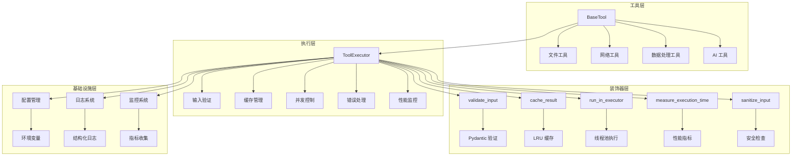
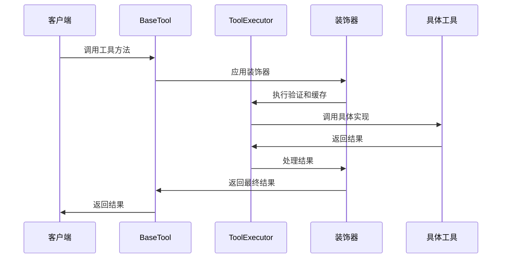
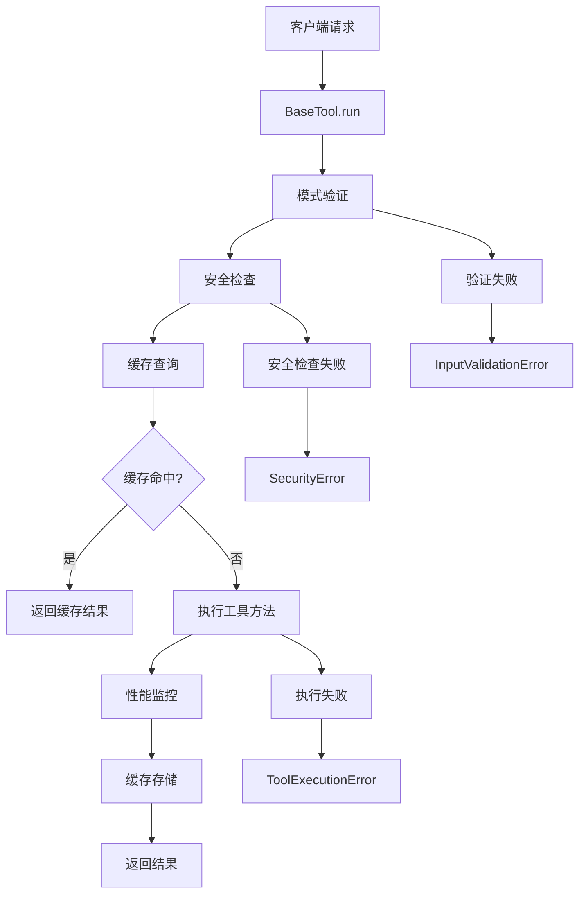
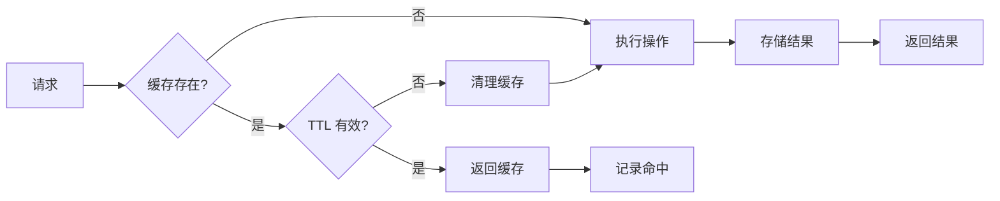
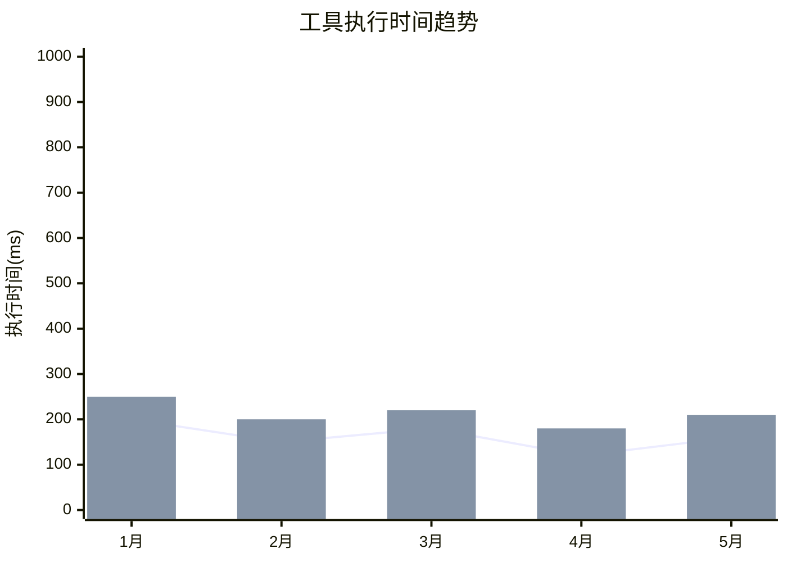

# 基础工具类技术文档

## 1. 概述 (Overview)

**目的**：`BaseTool` 是 AIECS 系统中所有工具类的抽象基类，提供了统一的工具开发框架和通用功能。该组件通过装饰器模式、依赖注入和横切关注点分离，实现了工具开发的标准化、安全化和性能优化，解决了工具开发中的重复代码、安全漏洞和性能瓶颈问题。

**核心价值**：
- **统一开发框架**：提供标准化的工具开发模式和接口
- **安全防护**：内置输入验证、安全检查和注入攻击防护
- **性能优化**：集成缓存、并发控制和性能监控
- **可扩展性**：支持同步/异步操作和批量处理
- **开发效率**：通过装饰器简化横切关注点的实现

## 2. 问题背景与设计动机 (Problem & Motivation)

### 2.1 业务痛点

在 AI 工具开发中面临以下关键挑战：

1. **重复代码问题**：每个工具都需要实现输入验证、缓存、错误处理等通用逻辑
2. **安全风险**：缺乏统一的输入验证和安全检查机制
3. **性能瓶颈**：没有统一的缓存和并发控制策略
4. **开发效率低**：开发者需要重复实现相同的横切关注点
5. **维护困难**：通用逻辑分散在各个工具中，难以统一维护和升级
6. **测试复杂**：缺乏统一的测试框架和模拟机制

### 2.2 设计动机

基于以上痛点，设计了基于装饰器模式的工具基类：

- **横切关注点分离**：将通用逻辑抽象为装饰器，与业务逻辑分离
- **依赖注入**：通过 ToolExecutor 注入通用服务，降低耦合度
- **安全优先**：内置多层安全检查和输入验证机制
- **性能导向**：集成智能缓存和并发控制策略
- **开发友好**：提供简洁的 API 和丰富的装饰器

## 3. 架构定位与上下文 (Architecture & Context)

### 3.1 系统架构图



### 3.2 上下游依赖

**上游调用者**：
- 业务服务层
- AI 代理系统
- 任务执行器
- API 接口层

**下游依赖**：
- ToolExecutor（工具执行器）
- Pydantic（数据验证）
- 缓存系统（LRU Cache）
- 线程池执行器
- 日志和监控系统

**同级组件**：
- 具体工具实现类
- 配置管理系统
- 安全模块

### 3.3 数据流向



## 4. 核心功能与用例 (Core Features & Use Cases)

### 4.1 输入验证与安全防护

**功能描述**：通过 Pydantic 模式自动验证输入参数，并提供多层安全检查机制。

**核心特性**：
- 自动模式注册和验证
- SQL 注入攻击防护
- 恶意内容检测
- 参数类型检查

**使用场景**：
```python
from aiecs.tools.base_tool import BaseTool
from pydantic import BaseModel
from typing import Optional

class FileTool(BaseTool):
    class ReadSchema(BaseModel):
        path: str
        encoding: str = "utf-8"
        max_size: Optional[int] = None

    def read(self, path: str, encoding: str = "utf-8", max_size: Optional[int] = None):
        """安全读取文件内容"""
        # 业务逻辑实现
        with open(path, 'r', encoding=encoding) as f:
            content = f.read(max_size) if max_size else f.read()
        return content

# 使用示例
tool = FileTool()
try:
    result = tool.run("read", path="/path/to/file.txt", encoding="utf-8")
    print(f"文件内容: {result}")
except InputValidationError as e:
    print(f"输入验证失败: {e}")
except SecurityError as e:
    print(f"安全检查失败: {e}")
```

**实际应用案例**：
- **文件操作工具**：验证文件路径和权限
- **数据库工具**：防止 SQL 注入攻击
- **网络工具**：验证 URL 和请求参数
- **AI 工具**：验证模型参数和输入数据

### 4.2 智能缓存系统

**功能描述**：基于内容哈希的智能缓存机制，支持 TTL 和 LRU 策略。

**核心特性**：
- 内容感知的缓存键生成
- 可配置的 TTL 和缓存大小
- 用户和任务级别的缓存隔离
- 自动缓存失效和清理

**使用场景**：
```python
from aiecs.tools.base_tool import BaseTool, cache_result
from pydantic import BaseModel
import time

class DataTool(BaseTool):
    class ProcessSchema(BaseModel):
        data: str
        algorithm: str = "default"

    @cache_result(ttl=3600)  # 缓存1小时
    def process_data(self, data: str, algorithm: str = "default"):
        """处理数据并缓存结果"""
        # 模拟复杂的数据处理
        time.sleep(2)  # 模拟耗时操作
        return f"Processed {data} with {algorithm}"

# 使用示例
tool = DataTool()

# 第一次调用，会执行并缓存
start = time.time()
result1 = tool.run("process_data", data="test data", algorithm="advanced")
print(f"第一次调用耗时: {time.time() - start:.2f}秒")

# 第二次调用，从缓存返回
start = time.time()
result2 = tool.run("process_data", data="test data", algorithm="advanced")
print(f"第二次调用耗时: {time.time() - start:.2f}秒")
print(f"结果相同: {result1 == result2}")
```

**实际应用案例**：
- **API 调用工具**：缓存外部 API 响应
- **文件处理工具**：缓存文件处理结果
- **AI 模型工具**：缓存模型推理结果
- **数据查询工具**：缓存数据库查询结果

### 4.3 异步并发处理

**功能描述**：支持异步操作和批量处理，提高系统并发性能。

**核心特性**：
- 自动检测异步方法
- 线程池执行同步方法
- 批量操作并行处理
- 异步上下文管理

**使用场景**：
```python
import asyncio
from aiecs.tools.base_tool import BaseTool
from pydantic import BaseModel

class NetworkTool(BaseTool):
    class FetchSchema(BaseModel):
        url: str
        timeout: int = 30

    async def fetch_url(self, url: str, timeout: int = 30):
        """异步获取 URL 内容"""
        import aiohttp
        async with aiohttp.ClientSession() as session:
            async with session.get(url, timeout=timeout) as response:
                return await response.text()

    def process_sync(self, data: str):
        """同步处理方法"""
        return f"Processed: {data}"

# 异步使用示例
async def main():
    tool = NetworkTool()
    
    # 异步调用
    result = await tool.run_async("fetch_url", url="https://api.example.com/data")
    print(f"异步获取结果: {result[:100]}...")
    
    # 批量处理
    operations = [
        {"op": "fetch_url", "kwargs": {"url": "https://api1.example.com"}},
        {"op": "fetch_url", "kwargs": {"url": "https://api2.example.com"}},
        {"op": "process_sync", "kwargs": {"data": "test"}}
    ]
    
    results = await tool.run_batch(operations)
    print(f"批量处理结果: {len(results)} 个操作完成")

# 运行异步示例
asyncio.run(main())
```

**实际应用案例**：
- **批量文件处理**：并行处理多个文件
- **API 聚合工具**：并发调用多个外部 API
- **数据同步工具**：异步同步大量数据
- **AI 推理工具**：批量处理 AI 模型推理

### 4.4 性能监控与指标收集

**功能描述**：自动收集执行时间、缓存命中率等性能指标。

**核心特性**：
- 自动执行时间测量
- 缓存命中率统计
- 错误率监控
- 性能指标导出

**使用场景**：
```python
from aiecs.tools.base_tool import BaseTool, measure_execution_time
import time

class PerformanceTool(BaseTool):
    @measure_execution_time
    def heavy_computation(self, n: int):
        """模拟重计算任务"""
        result = 0
        for i in range(n):
            result += i ** 2
        return result

# 使用示例
tool = PerformanceTool()

# 执行多个操作
for i in range(5):
    result = tool.run("heavy_computation", n=10000)
    print(f"计算结果: {result}")

# 获取性能指标
executor = tool._executor
metrics = executor.get_metrics()
print(f"性能指标: {metrics}")
# 输出: {'requests': 5, 'failures': 0, 'cache_hits': 0, 'avg_processing_time': 0.1234}
```

**实际应用案例**：
- **性能分析工具**：监控工具执行性能
- **资源使用监控**：跟踪内存和 CPU 使用
- **API 性能监控**：监控外部 API 调用性能
- **缓存效果分析**：分析缓存策略效果

## 5. API 参考 (API Reference)

### 5.1 BaseTool 类

#### 构造函数
```python
def __init__(self, config: Optional[Dict[str, Any]] = None)
```

**参数**：
- `config` (Dict[str, Any], 可选): 工具特定配置

**异常**：
- `ValueError`: 如果配置无效

#### 核心方法

##### run
```python
def run(self, op: str, **kwargs) -> Any
```

**功能**：执行同步操作
**参数**：
- `op` (str, 必需): 要执行的操作名称
- `**kwargs`: 传递给操作的参数

**返回**：操作结果
**异常**：
- `ToolExecutionError`: 操作执行失败
- `InputValidationError`: 输入参数无效
- `SecurityError`: 输入包含恶意内容

##### run_async
```python
async def run_async(self, op: str, **kwargs) -> Any
```

**功能**：执行异步操作
**参数**：与 `run` 相同
**返回**：操作结果
**异常**：与 `run` 相同

##### run_batch
```python
async def run_batch(self, operations: List[Dict[str, Any]]) -> List[Any]
```

**功能**：并行执行多个操作
**参数**：
- `operations` (List[Dict[str, Any]], 必需): 操作列表，每个包含 'op' 和 'kwargs'

**返回**：操作结果列表
**异常**：
- `ToolExecutionError`: 任何操作失败
- `InputValidationError`: 输入参数无效

### 5.2 装饰器

#### validate_input
```python
@validate_input(schema_class: Type[BaseModel])
```

**功能**：使用 Pydantic 模式验证输入
**参数**：
- `schema_class` (Type[BaseModel], 必需): Pydantic 模式类

**异常**：
- `InputValidationError`: 输入验证失败

#### cache_result
```python
@cache_result(ttl: Optional[int] = None)
```

**功能**：缓存函数结果
**参数**：
- `ttl` (Optional[int], 可选): 缓存生存时间（秒）

#### run_in_executor
```python
@run_in_executor
```

**功能**：在线程池中运行同步函数
**返回**：异步包装器

#### measure_execution_time
```python
@measure_execution_time
```

**功能**：测量和记录执行时间

#### sanitize_input
```python
@sanitize_input
```

**功能**：清理输入参数以增强安全性

### 5.3 内部方法

#### _register_schemas
```python
def _register_schemas(self) -> None
```

**功能**：通过检查内部 Schema 类注册 Pydantic 模式

#### _register_async_methods
```python
def _register_async_methods(self) -> None
```

**功能**：注册异步方法以正确处理执行

#### _sanitize_kwargs
```python
def _sanitize_kwargs(self, kwargs: Dict[str, Any]) -> Dict[str, Any]
```

**功能**：清理关键字参数以防止注入攻击
**参数**：
- `kwargs` (Dict[str, Any]): 输入关键字参数

**返回**：清理后的关键字参数
**异常**：
- `SecurityError`: 如果参数包含恶意内容

## 6. 技术实现细节 (Technical Details)

### 6.1 装饰器模式实现

**设计原则**：
- 使用装饰器分离横切关注点
- 保持业务逻辑的纯净性
- 支持装饰器组合和链式调用

**实现机制**：
```python
def validate_input(schema_class: Type[BaseModel]) -> Callable:
    def decorator(func: Callable) -> Callable:
        @functools.wraps(func)
        def wrapper(self, *args, **kwargs):
            try:
                schema = schema_class(**kwargs)
                validated_kwargs = schema.dict(exclude_unset=True)
                return func(self, **validated_kwargs)
            except ValidationError as e:
                raise InputValidationError(f"Invalid input parameters: {e}")
        return wrapper
    return decorator
```

### 6.2 模式自动注册机制

**实现原理**：
```python
def _register_schemas(self) -> None:
    for attr_name in dir(self.__class__):
        attr = getattr(self.__class__, attr_name)
        if isinstance(attr, type) and issubclass(attr, BaseModel) and attr.__name__.endswith('Schema'):
            op_name = attr.__name__.replace('Schema', '').lower()
            self._schemas[op_name] = attr
```

**命名约定**：
- 模式类必须以 'Schema' 结尾
- 操作名通过移除 'Schema' 并转小写获得
- 例如：`ReadSchema` → `read` 操作

### 6.3 缓存键生成策略

**内容感知键生成**：
```python
def _get_cache_key(self, func_name: str, args: tuple, kwargs: Dict[str, Any]) -> str:
    user_id = kwargs.get("user_id", "anonymous")
    task_id = kwargs.get("task_id", "none")
    return self.execution_utils.generate_cache_key(func_name, user_id, task_id, args, kwargs)
```

**键生成特性**：
- 包含用户 ID 和任务 ID 实现隔离
- 基于参数内容生成哈希值
- 支持 TTL 和版本控制

### 6.4 安全防护机制

**多层安全检查**：
```python
def _sanitize_kwargs(self, kwargs: Dict[str, Any]) -> Dict[str, Any]:
    sanitized = {}
    for k, v in kwargs.items():
        if isinstance(v, str) and re.search(r'(\bSELECT\b|\bINSERT\b|--|;|/\*)', v, re.IGNORECASE):
            raise SecurityError(f"Input parameter '{k}' contains potentially malicious content")
        sanitized[k] = v
    return sanitized
```

**防护策略**：
- SQL 注入模式检测
- 脚本注入防护
- 路径遍历攻击防护
- 可扩展的安全规则

### 6.5 异步执行机制

**异步方法检测**：
```python
def _register_async_methods(self) -> None:
    for attr_name in dir(self.__class__):
        attr = getattr(self.__class__, attr_name)
        if inspect.iscoroutinefunction(attr) and not attr_name.startswith('_'):
            self._async_methods.append(attr_name)
```

**执行策略**：
- 自动检测异步方法
- 同步方法在线程池中执行
- 支持批量并行处理
- 异步上下文管理

## 7. 配置与部署 (Configuration & Deployment)

### 7.1 环境变量配置

**基础配置**：
```bash
# 工具执行器配置
TOOL_EXECUTOR_ENABLE_CACHE=true
TOOL_EXECUTOR_CACHE_SIZE=100
TOOL_EXECUTOR_CACHE_TTL=3600
TOOL_EXECUTOR_MAX_WORKERS=4
TOOL_EXECUTOR_IO_CONCURRENCY=8
TOOL_EXECUTOR_CHUNK_SIZE=10000
TOOL_EXECUTOR_MAX_FILE_SIZE=1000000
TOOL_EXECUTOR_LOG_LEVEL=INFO
TOOL_EXECUTOR_LOG_EXECUTION_TIME=true
TOOL_EXECUTOR_ENABLE_SECURITY_CHECKS=true
TOOL_EXECUTOR_RETRY_ATTEMPTS=3
TOOL_EXECUTOR_RETRY_BACKOFF=1.0
TOOL_EXECUTOR_TIMEOUT=30
```

**高级配置**：
```bash
# 缓存配置
CACHE_BACKEND=redis
CACHE_REDIS_URL=redis://localhost:6379/0
CACHE_PREFIX=tool_cache

# 监控配置
ENABLE_METRICS=true
METRICS_BACKEND=prometheus
PROMETHEUS_PORT=9090

# 安全配置
SECURITY_LEVEL=high
ALLOWED_FILE_EXTENSIONS=.txt,.json,.csv
MAX_INPUT_SIZE=1048576
```

### 7.2 依赖管理

**核心依赖**：
```python
# requirements.txt
pydantic>=2.0.0
cachetools>=5.3.0
asyncio-mqtt>=0.11.0
aiohttp>=3.8.0
```

**开发依赖**：
```python
# requirements-dev.txt
pytest>=7.0.0
pytest-asyncio>=0.21.0
pytest-mock>=3.10.0
black>=23.0.0
mypy>=1.0.0
```

### 7.3 部署配置

**Docker 配置**：
```dockerfile
FROM python:3.9-slim

WORKDIR /app
COPY requirements.txt .
RUN pip install -r requirements.txt

COPY . .
CMD ["python", "-m", "aiecs.tools"]
```

**Kubernetes 配置**：
```yaml
apiVersion: apps/v1
kind: Deployment
metadata:
  name: tool-service
spec:
  replicas: 3
  selector:
    matchLabels:
      app: tool-service
  template:
    metadata:
      labels:
        app: tool-service
    spec:
      containers:
      - name: tool-service
        image: aiecs/tool-service:latest
        env:
        - name: TOOL_EXECUTOR_MAX_WORKERS
          value: "8"
        - name: TOOL_EXECUTOR_CACHE_SIZE
          value: "1000"
        resources:
          requests:
            memory: "512Mi"
            cpu: "250m"
          limits:
            memory: "1Gi"
            cpu: "500m"
```

### 7.4 监控配置

**Prometheus 指标**：
```python
from prometheus_client import Counter, Histogram, Gauge

# 定义监控指标
tool_executions = Counter('tool_executions_total', 'Total tool executions', ['tool_name', 'operation'])
tool_duration = Histogram('tool_duration_seconds', 'Tool execution duration', ['tool_name'])
tool_cache_hits = Counter('tool_cache_hits_total', 'Tool cache hits', ['tool_name'])
tool_errors = Counter('tool_errors_total', 'Tool errors', ['tool_name', 'error_type'])
```

**健康检查**：
```python
async def health_check():
    """检查工具服务健康状态"""
    try:
        # 检查缓存连接
        cache_status = await check_cache_connection()
        
        # 检查线程池状态
        executor_status = check_executor_status()
        
        return {
            "status": "healthy",
            "cache": cache_status,
            "executor": executor_status,
            "timestamp": time.time()
        }
    except Exception as e:
        return {
            "status": "unhealthy",
            "error": str(e),
            "timestamp": time.time()
        }
```

## 8. 维护与故障排查 (Maintenance & Troubleshooting)

### 8.1 监控指标

**关键指标**：
- 工具执行成功率
- 平均执行时间
- 缓存命中率
- 错误率和错误类型
- 内存和 CPU 使用率

**监控仪表板**：
```python
# Grafana 查询示例
# 工具执行成功率
sum(rate(tool_executions_total[5m])) by (tool_name)

# 平均执行时间
histogram_quantile(0.95, rate(tool_duration_seconds_bucket[5m]))

# 缓存命中率
rate(tool_cache_hits_total[5m]) / rate(tool_executions_total[5m])
```

### 8.2 常见故障及解决方案

#### 8.2.1 输入验证失败

**症状**：
- `InputValidationError` 异常
- 参数类型不匹配
- 必需参数缺失

**排查步骤**：
1. 检查 Pydantic 模式定义
2. 验证输入参数类型
3. 检查必需参数是否提供
4. 查看详细错误信息

**解决方案**：
```python
# 检查模式定义
class MyTool(BaseTool):
    class ProcessSchema(BaseModel):
        data: str
        count: int = 1  # 提供默认值
        
    def process(self, data: str, count: int = 1):
        pass

# 添加详细验证
try:
    result = tool.run("process", data="test", count="invalid")
except InputValidationError as e:
    print(f"验证失败详情: {e}")
    # 检查具体字段错误
    for error in e.errors():
        print(f"字段 {error['loc']}: {error['msg']}")
```

#### 8.2.2 缓存问题

**症状**：
- 缓存命中率低
- 内存使用过高
- 缓存数据不一致

**排查步骤**：
1. 检查缓存配置
2. 分析缓存键生成
3. 监控内存使用
4. 检查 TTL 设置

**解决方案**：
```python
# 优化缓存配置
config = {
    "enable_cache": True,
    "cache_size": 1000,  # 增加缓存大小
    "cache_ttl": 1800,   # 调整 TTL
}

tool = MyTool(config)

# 检查缓存状态
executor = tool._executor
metrics = executor.get_metrics()
print(f"缓存命中率: {metrics['cache_hits'] / metrics['requests']:.2%}")

# 清理缓存
executor.execution_utils.clear_cache()
```

#### 8.2.3 性能问题

**症状**：
- 执行时间过长
- 内存使用持续增长
- 并发处理能力不足

**排查步骤**：
1. 分析执行时间分布
2. 检查内存泄漏
3. 优化并发配置
4. 分析瓶颈操作

**解决方案**：
```python
# 性能分析
@measure_execution_time
def slow_operation(self, data):
    # 添加性能分析
    import cProfile
    profiler = cProfile.Profile()
    profiler.enable()
    
    try:
        result = self._process_data(data)
        return result
    finally:
        profiler.disable()
        profiler.dump_stats('slow_operation.prof')

# 优化并发配置
config = {
    "max_workers": 8,        # 增加工作线程
    "io_concurrency": 16,    # 增加 I/O 并发
    "chunk_size": 5000,      # 优化块大小
}
```

### 8.3 日志分析

**日志配置**：
```python
import logging

# 配置工具日志
tool_logger = logging.getLogger('aiecs.tools')
tool_logger.setLevel(logging.INFO)

# 添加文件处理器
file_handler = logging.FileHandler('/var/log/aiecs/tools.log')
file_handler.setFormatter(logging.Formatter(
    '%(asctime)s - %(name)s - %(levelname)s - %(message)s'
))
tool_logger.addHandler(file_handler)
```

**关键日志模式**：
```bash
# 查找错误日志
grep "ERROR" /var/log/aiecs/tools.log | tail -100

# 分析性能问题
grep "executed in" /var/log/aiecs/tools.log | awk '{print $NF}' | sort -n

# 监控缓存命中
grep "Cache hit" /var/log/aiecs/tools.log | wc -l
```

### 8.4 测试策略

**单元测试**：
```python
import pytest
from aiecs.tools.base_tool import BaseTool

class TestTool(BaseTool):
    class AddSchema(BaseModel):
        a: int
        b: int
    
    def add(self, a: int, b: int):
        return a + b

def test_tool_execution():
    tool = TestTool()
    result = tool.run("add", a=2, b=3)
    assert result == 5

def test_input_validation():
    tool = TestTool()
    with pytest.raises(InputValidationError):
        tool.run("add", a="invalid", b=3)

def test_async_execution():
    async def test():
        tool = TestTool()
        result = await tool.run_async("add", a=2, b=3)
        assert result == 5
    
    asyncio.run(test())
```

## 9. 可视化图表 (Visualizations)

### 9.1 架构流程图



### 9.2 装饰器组合图

```mermaid
graph TB
    A[工具方法] --> B[@validate_input]
    B --> C[@sanitize_input]
    C --> D[@cache_result]
    D --> E[@measure_execution_time]
    E --> F[@run_in_executor]
    F --> G[最终方法]
    
    H[Pydantic 验证] --> B
    I[安全检查] --> C
    J[LRU 缓存] --> D
    K[性能监控] --> E
    L[线程池] --> F
```

### 9.3 缓存策略图



### 9.4 性能监控图



## 10. 版本历史 (Version History)

### v1.0.0 (2024-01-15)
**新增功能**：
- 实现 BaseTool 基础架构
- 集成 Pydantic 输入验证
- 添加基础装饰器支持
- 实现简单的缓存机制

**技术特性**：
- 基于装饰器模式的横切关注点分离
- 自动模式注册机制
- 基础安全防护

### v1.1.0 (2024-02-01)
**新增功能**：
- 集成 ToolExecutor 执行器
- 添加智能缓存系统
- 实现异步操作支持
- 增强安全防护机制

**性能优化**：
- LRU 缓存策略
- 线程池并发执行
- 性能指标收集

### v1.2.0 (2024-03-01)
**新增功能**：
- 添加批量操作支持
- 实现高级安全检查
- 集成监控和指标
- 支持配置管理

**监控增强**：
- Prometheus 指标集成
- 详细性能分析
- 错误追踪和报告

### v1.3.0 (2024-04-01) [计划中]
**计划功能**：
- 添加插件系统
- 实现动态配置
- 支持分布式缓存
- 添加机器学习优化

**架构优化**：
- 微服务架构支持
- 云原生集成
- 自动扩缩容

---

## 附录

### A. 相关文档
- [ToolExecutor 文档](./TOOL_EXECUTOR.md)
- [装饰器模式指南](./DECORATOR_PATTERN.md)
- [安全最佳实践](./SECURITY_BEST_PRACTICES.md)

### B. 示例代码
- [完整示例项目](https://github.com/aiecs/examples)
- [性能测试脚本](https://github.com/aiecs/performance-tests)
- [安全测试套件](https://github.com/aiecs/security-tests)

### C. 技术支持
- 技术文档：https://docs.aiecs.com
- 问题反馈：https://github.com/aiecs/issues
- 社区讨论：https://discord.gg/aiecs
