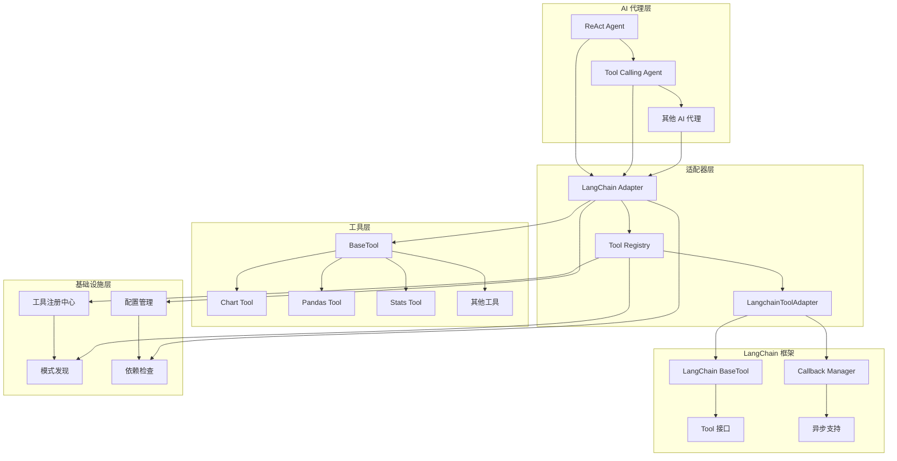
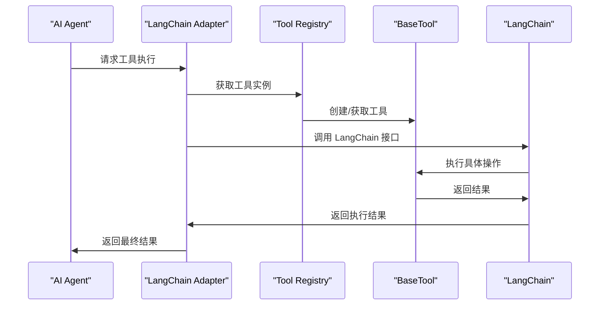
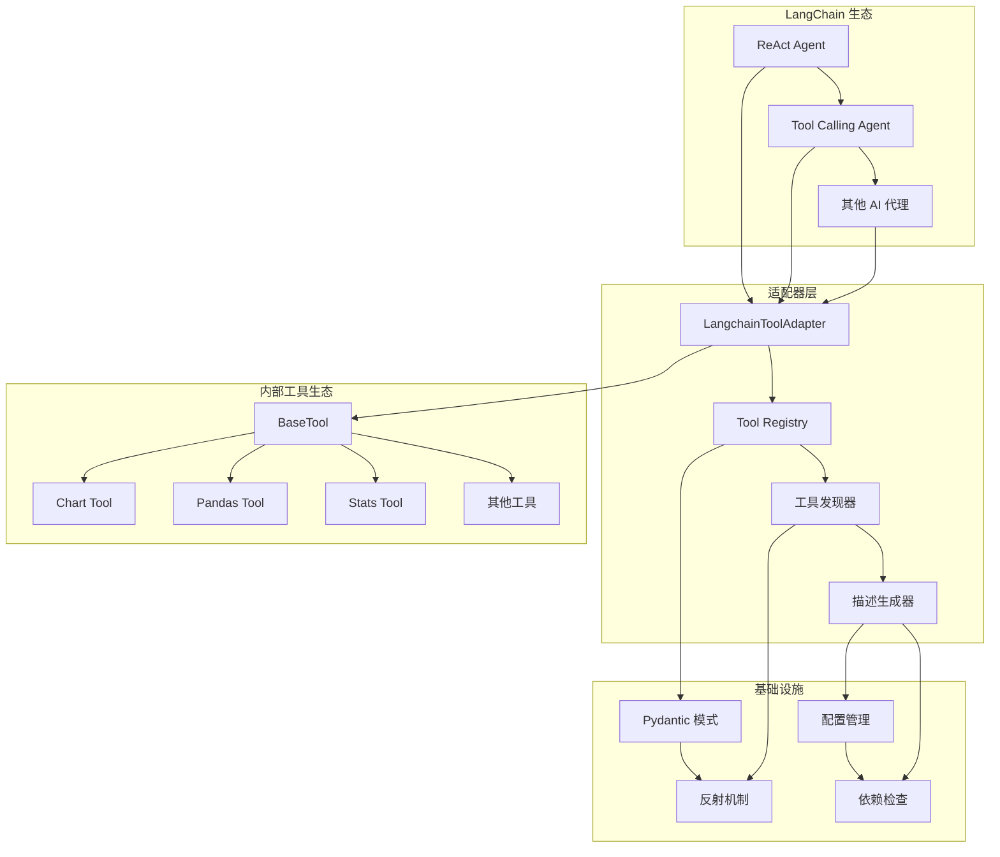
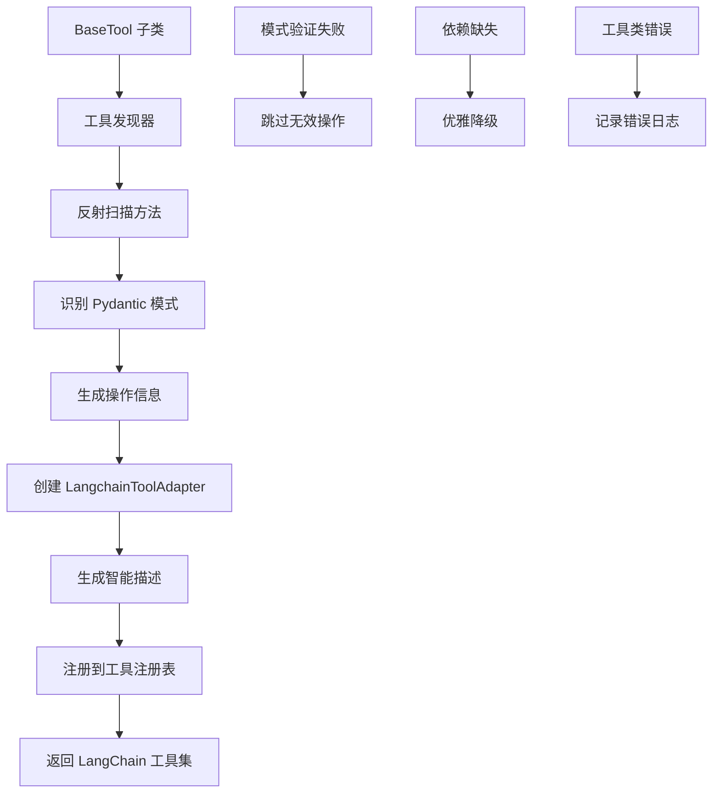
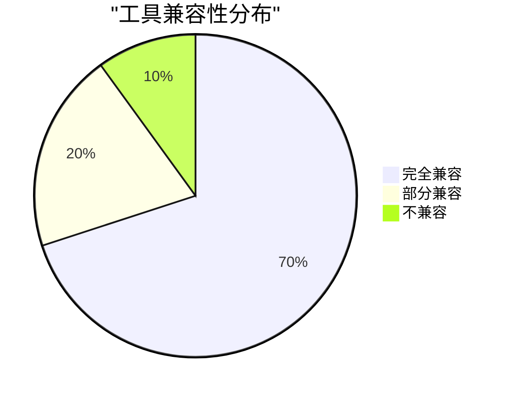

# LangChain 适配器技术文档

## 1. 概述 (Overview)

**目的**：`langchain_adapter.py` 是 AIECS 系统中连接内部工具生态与 LangChain 框架的关键适配器组件。该模块通过自动发现和转换机制，将基于 `BaseTool` 的工具类无缝集成到 LangChain 的 ReAct Agent 和 Tool Calling Agent 中，实现了内部工具与主流 AI 框架的标准化对接。

**核心价值**：
- **无缝集成**：自动将内部工具转换为 LangChain 兼容的工具
- **功能保持**：完整保留原始工具的所有功能特性（缓存、验证、安全等）
- **智能发现**：自动发现工具的操作方法和 Pydantic 模式
- **灵活配置**：支持选择性工具转换和自定义描述生成
- **兼容性保障**：优雅处理 LangChain 依赖缺失的情况

## 2. 问题背景与设计动机 (Problem & Motivation)

### 2.1 业务痛点

在 AI 应用开发中面临以下关键挑战：

1. **框架割裂**：内部工具系统与主流 AI 框架（如 LangChain）缺乏统一接口
2. **重复开发**：需要为不同框架重复实现相同的工具功能
3. **维护成本高**：多套工具实现导致代码重复和维护困难
4. **集成复杂**：手动集成工具到 AI 代理中工作量大且容易出错
5. **功能丢失**：集成过程中容易丢失原始工具的高级功能
6. **版本兼容**：不同框架版本更新导致兼容性问题

### 2.2 设计动机

基于以上痛点，设计了基于适配器模式的集成方案：

- **适配器模式**：通过适配器层实现不同框架间的无缝对接
- **自动发现机制**：通过反射自动发现工具的操作和模式
- **功能保持策略**：确保转换后的工具保持所有原始功能
- **优雅降级**：在依赖缺失时提供基础功能支持
- **标准化接口**：提供统一的工具集成标准

## 3. 架构定位与上下文 (Architecture & Context)

### 3.1 系统架构图



### 3.2 上下游依赖

**上游调用者**：
- LangChain ReAct Agent
- LangChain Tool Calling Agent
- 其他基于 LangChain 的 AI 代理
- 自定义 AI 应用

**下游依赖**：
- BaseTool 及其子类
- 工具注册中心（TOOL_CLASSES）
- Pydantic 模式系统
- LangChain 框架（可选）

**同级组件**：
- 工具执行器（ToolExecutor）
- 临时文件管理器
- 配置管理系统

### 3.3 数据流向



## 4. 核心功能与用例 (Core Features & Use Cases)

### 4.1 自动工具发现与转换

**功能描述**：自动发现 BaseTool 子类的所有操作方法，并转换为独立的 LangChain 工具。

**核心特性**：
- 反射机制自动发现操作方法
- 自动识别 Pydantic 模式
- 生成增强的工具描述
- 支持同步和异步操作

**使用场景**：
```python
from aiecs.tools.langchain_adapter import get_langchain_tools, create_react_agent_tools

# 获取所有工具的 LangChain 适配器
all_tools = get_langchain_tools()
print(f"发现 {len(all_tools)} 个 LangChain 工具")

# 获取特定工具的适配器
chart_tools = get_langchain_tools(['chart'])
for tool in chart_tools:
    print(f"工具: {tool.name}")
    print(f"描述: {tool.description}")
    print(f"参数模式: {tool.args_schema}")

# 创建 ReAct Agent 工具集
react_tools = create_react_agent_tools()
```

**实际应用案例**：
- **数据分析代理**：自动集成图表、统计、数据处理工具
- **文档处理代理**：集成 Office、PDF、文本处理工具
- **研究助手代理**：集成搜索、爬虫、信息收集工具
- **代码助手代理**：集成代码分析、生成、测试工具

### 4.2 智能描述生成

**功能描述**：基于工具类型和操作特点，自动生成详细且用户友好的工具描述。

**核心特性**：
- 基于工具名称的智能描述
- 参数信息自动提取
- 功能特性详细说明
- 多语言支持准备

**使用场景**：
```python
from aiecs.tools.langchain_adapter import ToolRegistry

# 创建工具注册表
registry = ToolRegistry()

# 为图表工具生成描述
chart_tools = registry.create_langchain_tools('chart')
for tool in chart_tools:
    print(f"工具名称: {tool.name}")
    print(f"智能描述: {tool.description}")
    print("---")

# 输出示例：
# 工具名称: chart_read_data
# 智能描述: Read and analyze data files in multiple formats (CSV, Excel, JSON, Parquet, etc.). 
#          Returns data structure summary, preview, and optional export functionality. 
#          Required: path. Optional: format, preview_rows.
```

**实际应用案例**：
- **AI 代理理解**：帮助 AI 代理更好地理解工具功能
- **用户界面**：在工具选择界面显示详细说明
- **文档生成**：自动生成工具使用文档
- **错误诊断**：提供更准确的错误提示和建议

### 4.3 兼容性检查与优雅降级

**功能描述**：检查 LangChain 依赖可用性，在依赖缺失时提供基础功能支持。

**核心特性**：
- 运行时依赖检查
- 优雅降级机制
- 兼容性报告生成
- 错误提示和建议

**使用场景**：
```python
from aiecs.tools.langchain_adapter import check_langchain_compatibility

# 检查兼容性
compatibility = check_langchain_compatibility()
print(f"LangChain 可用: {compatibility['langchain_available']}")
print(f"兼容工具数量: {len(compatibility['compatible_tools'])}")
print(f"总操作数: {compatibility['total_operations']}")

if not compatibility['langchain_available']:
    print("建议安装 LangChain: pip install langchain")
else:
    print("环境配置正常，可以使用所有功能")

# 检查特定工具兼容性
for tool_info in compatibility['compatible_tools']:
    print(f"工具 {tool_info['name']}: {tool_info['operations_count']} 个操作")
```

**实际应用案例**：
- **环境诊断**：快速检查开发环境配置
- **部署验证**：确保生产环境依赖完整
- **故障排查**：快速定位集成问题
- **版本管理**：处理不同版本间的兼容性

### 4.4 批量工具管理

**功能描述**：支持批量创建、管理和使用多个工具的 LangChain 适配器。

**核心特性**：
- 批量工具转换
- 工具集合管理
- 选择性工具加载
- 统一错误处理

**使用场景**：
```python
from aiecs.tools.langchain_adapter import ToolRegistry, get_langchain_tools

# 创建工具注册表
registry = ToolRegistry()

# 批量创建特定工具集
data_tools = get_langchain_tools(['chart', 'pandas', 'stats'])
print(f"数据工具集: {len(data_tools)} 个工具")

# 创建完整工具集
all_tools = registry.create_all_langchain_tools()
print(f"完整工具集: {len(all_tools)} 个工具")

# 按类别组织工具
tools_by_category = {}
for tool in all_tools:
    category = tool.name.split('_')[0]  # 提取工具类别
    if category not in tools_by_category:
        tools_by_category[category] = []
    tools_by_category[category].append(tool)

for category, tools in tools_by_category.items():
    print(f"{category} 类别: {len(tools)} 个工具")
```

**实际应用案例**：
- **专业代理**：为特定领域创建专业工具集
- **性能优化**：只加载必要的工具减少内存占用
- **模块化部署**：按功能模块部署不同的工具集
- **A/B 测试**：测试不同工具组合的效果

## 5. API 参考 (API Reference)

### 5.1 LangchainToolAdapter 类

#### 构造函数
```python
def __init__(
    self, 
    base_tool_name: str,
    operation_name: str, 
    operation_schema: Optional[Type[BaseModel]] = None,
    description: Optional[str] = None
)
```

**参数**：
- `base_tool_name` (str, 必需): 原始工具名称
- `operation_name` (str, 必需): 操作名称
- `operation_schema` (Type[BaseModel], 可选): 操作的 Pydantic 模式
- `description` (str, 可选): 工具描述

#### 核心方法

##### _run
```python
def _run(
    self, 
    run_manager: Optional[CallbackManagerForToolRun] = None, 
    **kwargs: Any
) -> Any
```

**功能**：同步执行操作
**参数**：
- `run_manager` (CallbackManagerForToolRun, 可选): LangChain 回调管理器
- `**kwargs`: 操作参数

**返回**：操作结果
**异常**：
- `Exception`: 操作执行失败

##### _arun
```python
async def _arun(
    self, 
    run_manager: Optional[AsyncCallbackManagerForToolRun] = None,
    **kwargs: Any
) -> Any
```

**功能**：异步执行操作
**参数**：
- `run_manager` (AsyncCallbackManagerForToolRun, 可选): 异步回调管理器
- `**kwargs`: 操作参数

**返回**：操作结果
**异常**：
- `Exception`: 操作执行失败

### 5.2 ToolRegistry 类

#### 构造函数
```python
def __init__(self)
```

#### 核心方法

##### discover_operations
```python
def discover_operations(self, base_tool_class: Type[BaseTool]) -> List[Dict[str, Any]]
```

**功能**：发现 BaseTool 类的所有操作方法和模式
**参数**：
- `base_tool_class` (Type[BaseTool], 必需): BaseTool 子类

**返回**：操作信息列表，包含方法名、模式、描述等

##### create_langchain_tools
```python
def create_langchain_tools(self, tool_name: str) -> List[LangchainToolAdapter]
```

**功能**：为指定工具创建所有 LangChain 适配器
**参数**：
- `tool_name` (str, 必需): 工具名称

**返回**：LangChain 工具适配器列表
**异常**：
- `ImportError`: LangChain 未安装
- `ValueError`: 工具未注册

##### create_all_langchain_tools
```python
def create_all_langchain_tools(self) -> List[LangchainToolAdapter]
```

**功能**：为所有注册的 BaseTool 创建 LangChain 适配器
**返回**：所有 LangChain 工具适配器列表

##### get_tool
```python
def get_tool(self, name: str) -> Optional[LangchainToolAdapter]
```

**功能**：获取指定名称的 LangChain 工具
**参数**：
- `name` (str, 必需): 工具名称

**返回**：LangChain 工具适配器或 None

##### list_langchain_tools
```python
def list_langchain_tools(self) -> List[str]
```

**功能**：列出所有 LangChain 工具名称
**返回**：工具名称列表

### 5.3 便利函数

#### get_langchain_tools
```python
def get_langchain_tools(tool_names: Optional[List[str]] = None) -> List[LangchainToolAdapter]
```

**功能**：获取 LangChain 工具集合
**参数**：
- `tool_names` (List[str], 可选): 要转换的工具名称列表，None 表示转换所有工具

**返回**：LangChain 工具适配器列表

#### create_react_agent_tools
```python
def create_react_agent_tools() -> List[LangchainToolAdapter]
```

**功能**：创建 ReAct Agent 的完整工具集合
**返回**：适配的 LangChain 工具列表

#### create_tool_calling_agent_tools
```python
def create_tool_calling_agent_tools() -> List[LangchainToolAdapter]
```

**功能**：创建 Tool Calling Agent 的完整工具集合
**返回**：优化的 LangChain 工具列表

#### check_langchain_compatibility
```python
def check_langchain_compatibility() -> Dict[str, Any]
```

**功能**：检查当前环境与 LangChain 的兼容性
**返回**：兼容性检查结果字典

## 6. 技术实现细节 (Technical Details)

### 6.1 自动发现机制

**反射实现**：
```python
def discover_operations(self, base_tool_class: Type[BaseTool]) -> List[Dict[str, Any]]:
    operations = []
    
    # 发现 Pydantic 模式
    schemas = {}
    for attr_name in dir(base_tool_class):
        attr = getattr(base_tool_class, attr_name)
        if isinstance(attr, type) and issubclass(attr, BaseModel) and attr.__name__.endswith('Schema'):
            op_name = attr.__name__.replace('Schema', '').lower()
            schemas[op_name] = attr
    
    # 发现公共方法
    for method_name in dir(base_tool_class):
        if method_name.startswith('_') or not callable(getattr(base_tool_class, method_name)):
            continue
        if method_name in ['run', 'run_async', 'run_batch']:
            continue
            
        operation_info = {
            'name': method_name,
            'method': getattr(base_tool_class, method_name),
            'schema': schemas.get(method_name),
            'description': inspect.getdoc(getattr(base_tool_class, method_name)),
            'is_async': inspect.iscoroutinefunction(getattr(base_tool_class, method_name))
        }
        operations.append(operation_info)
    
    return operations
```

**命名约定**：
- 模式类必须以 'Schema' 结尾
- 操作名通过移除 'Schema' 并转小写获得
- 跳过私有方法和基类方法

### 6.2 智能描述生成

**基于上下文的描述生成**：
```python
def _extract_description(self, method, base_tool_name: str, operation_name: str, schema: Optional[Type[BaseModel]] = None) -> str:
    doc = inspect.getdoc(method)
    base_desc = doc.split('\n')[0].strip() if doc else f"Execute {operation_name} operation"
    
    # 基于工具类型的增强描述
    if base_tool_name == "chart":
        if operation_name == "read_data":
            enhanced_desc = "Read and analyze data files in multiple formats (CSV, Excel, JSON, Parquet, etc.). Returns data structure summary, preview, and optional export functionality."
        elif operation_name == "visualize":
            enhanced_desc = "Create data visualizations including histograms, scatter plots, bar charts, line charts, heatmaps, and pair plots. Supports customizable styling, colors, and high-resolution output."
    elif base_tool_name == "pandas":
        enhanced_desc = f"Pandas data manipulation: {base_desc}. Supports DataFrame operations with built-in validation and error handling."
    
    # 添加参数信息
    if schema:
        fields = schema.__fields__ if hasattr(schema, '__fields__') else {}
        required_params = [name for name, field in fields.items() if field.is_required()]
        optional_params = [name for name, field in fields.items() if not field.is_required()]
        
        if required_params:
            enhanced_desc += f" Required: {', '.join(required_params)}."
        if optional_params:
            enhanced_desc += f" Optional: {', '.join(optional_params)}."
    
    return enhanced_desc
```

### 6.3 兼容性处理

**优雅降级机制**：
```python
try:
    from langchain.tools import BaseTool as LangchainBaseTool
    from langchain.callbacks.manager import CallbackManagerForToolRun, AsyncCallbackManagerForToolRun
    LANGCHAIN_AVAILABLE = True
except ImportError:
    # 创建简单基类用于类型检查
    class LangchainBaseTool:
        pass
    CallbackManagerForToolRun = None
    AsyncCallbackManagerForToolRun = None
    LANGCHAIN_AVAILABLE = False
```

**运行时检查**：
```python
def create_langchain_tools(self, tool_name: str) -> List[LangchainToolAdapter]:
    if not LANGCHAIN_AVAILABLE:
        raise ImportError("langchain is not installed. Please install it to use this adapter.")
    # ... 继续执行
```

### 6.4 工具实例管理

**延迟实例化**：
```python
def _run(self, run_manager: Optional[CallbackManagerForToolRun] = None, **kwargs: Any) -> Any:
    try:
        # 获取原始工具实例（延迟实例化）
        base_tool = get_tool(self.__dict__['base_tool_name'])
        
        # 执行操作
        result = base_tool.run(self.__dict__['operation_name'], **kwargs)
        
        logger.info(f"Successfully executed {self.name} with result type: {type(result)}")
        return result
    except Exception as e:
        logger.error(f"Error executing {self.name}: {str(e)}")
        raise
```

**实例缓存**：
- 通过 `get_tool()` 函数实现工具实例的延迟创建和缓存
- 避免重复创建相同的工具实例
- 支持配置化的工具实例管理

### 6.5 错误处理与日志

**分层错误处理**：
```python
def create_all_langchain_tools(self) -> List[LangchainToolAdapter]:
    all_tools = []
    
    for tool_name in list_tools():
        try:
            tools = self.create_langchain_tools(tool_name)
            all_tools.extend(tools)
        except Exception as e:
            logger.error(f"Failed to create Langchain tools for {tool_name}: {e}")
    
    return all_tools
```

**结构化日志**：
```python
logger.info(f"Created {len(langchain_tools)} Langchain tools for {tool_name}")
logger.info(f"Successfully executed {self.name} with result type: {type(result)}")
logger.error(f"Error executing {self.name}: {str(e)}")
```

## 7. 配置与部署 (Configuration & Deployment)

### 7.1 环境变量配置

**基础配置**：
```bash
# LangChain 配置
LANGCHAIN_API_KEY=your-api-key
LANGCHAIN_TRACING_V2=true
LANGCHAIN_ENDPOINT=https://api.smith.langchain.com

# 工具配置
TOOL_REGISTRY_CACHE_SIZE=1000
TOOL_REGISTRY_CACHE_TTL=3600
TOOL_DISCOVERY_AUTO_SCAN=true
TOOL_DISCOVERY_PACKAGE_PATH=aiecs.tools

# 日志配置
LOG_LEVEL=INFO
LOG_FORMAT=json
LOG_FILE=/var/log/aiecs/langchain_adapter.log
```

**高级配置**：
```bash
# 性能优化
TOOL_EXECUTION_TIMEOUT=30
TOOL_EXECUTION_MAX_RETRIES=3
TOOL_EXECUTION_RETRY_DELAY=1.0

# 安全配置
TOOL_SECURITY_VALIDATE_INPUT=true
TOOL_SECURITY_SANITIZE_OUTPUT=true
TOOL_SECURITY_MAX_INPUT_SIZE=1048576

# 监控配置
ENABLE_METRICS=true
METRICS_BACKEND=prometheus
PROMETHEUS_PORT=9090
```

### 7.2 依赖管理

**核心依赖**：
```python
# requirements.txt
langchain>=0.1.0
langchain-community>=0.0.10
pydantic>=2.0.0
aiohttp>=3.8.0
```

**可选依赖**：
```python
# requirements-optional.txt
langchain-openai>=0.0.5
langchain-anthropic>=0.1.0
langchain-google-vertexai>=0.1.0
langchain-experimental>=0.0.40
```

**开发依赖**：
```python
# requirements-dev.txt
pytest>=7.0.0
pytest-asyncio>=0.21.0
pytest-mock>=3.10.0
black>=23.0.0
mypy>=1.0.0
```

### 7.3 部署配置

**Docker 配置**：
```dockerfile
FROM python:3.9-slim

WORKDIR /app
COPY requirements.txt .
RUN pip install -r requirements.txt

# 安装可选依赖
COPY requirements-optional.txt .
RUN pip install -r requirements-optional.txt

COPY . .
CMD ["python", "-m", "aiecs.tools.langchain_adapter"]
```

**Kubernetes 配置**：
```yaml
apiVersion: apps/v1
kind: Deployment
metadata:
  name: langchain-adapter
spec:
  replicas: 3
  selector:
    matchLabels:
      app: langchain-adapter
  template:
    metadata:
      labels:
        app: langchain-adapter
    spec:
      containers:
      - name: adapter
        image: aiecs/langchain-adapter:latest
        env:
        - name: LANGCHAIN_API_KEY
          valueFrom:
            secretKeyRef:
              name: langchain-secrets
              key: api-key
        - name: TOOL_REGISTRY_CACHE_SIZE
          value: "2000"
        resources:
          requests:
            memory: "1Gi"
            cpu: "500m"
          limits:
            memory: "2Gi"
            cpu: "1000m"
```

### 7.4 监控配置

**Prometheus 指标**：
```python
from prometheus_client import Counter, Histogram, Gauge

# 定义监控指标
tool_adaptations = Counter('tool_adaptations_total', 'Total tool adaptations', ['tool_name', 'status'])
tool_executions = Counter('tool_executions_total', 'Total tool executions', ['tool_name', 'operation'])
tool_duration = Histogram('tool_duration_seconds', 'Tool execution duration', ['tool_name'])
tool_errors = Counter('tool_errors_total', 'Tool errors', ['tool_name', 'error_type'])
```

**健康检查**：
```python
async def health_check():
    """检查适配器健康状态"""
    try:
        # 检查 LangChain 可用性
        langchain_status = LANGCHAIN_AVAILABLE
        
        # 检查工具注册表
        registry_status = len(tool_registry._langchain_tools) > 0
        
        # 检查依赖工具
        tools_status = len(list_tools()) > 0
        
        return {
            "status": "healthy" if all([langchain_status, registry_status, tools_status]) else "degraded",
            "langchain_available": langchain_status,
            "tools_registered": registry_status,
            "base_tools_available": tools_status,
            "timestamp": time.time()
        }
    except Exception as e:
        return {
            "status": "unhealthy",
            "error": str(e),
            "timestamp": time.time()
        }
```

## 8. 维护与故障排查 (Maintenance & Troubleshooting)

### 8.1 监控指标

**关键指标**：
- 工具适配成功率
- 工具执行成功率
- 平均执行时间
- 错误率和错误类型
- 缓存命中率

**监控仪表板**：
```python
# Grafana 查询示例
# 工具适配成功率
sum(rate(tool_adaptations_total[5m])) by (status)

# 平均执行时间
histogram_quantile(0.95, rate(tool_duration_seconds_bucket[5m]))

# 错误率
rate(tool_errors_total[5m]) / rate(tool_executions_total[5m])
```

### 8.2 常见故障及解决方案

#### 8.2.1 LangChain 依赖缺失

**症状**：
- `ImportError: langchain is not installed`
- 适配器功能不可用
- 兼容性检查失败

**排查步骤**：
1. 检查 LangChain 安装：`pip list | grep langchain`
2. 验证版本兼容性：`python -c "import langchain; print(langchain.__version__)"`
3. 检查依赖完整性：`pip check`

**解决方案**：
```bash
# 安装 LangChain
pip install langchain>=0.1.0

# 安装可选依赖
pip install langchain-community langchain-openai

# 验证安装
python -c "from aiecs.tools.langchain_adapter import check_langchain_compatibility; print(check_langchain_compatibility())"
```

#### 8.2.2 工具发现失败

**症状**：
- 工具数量为 0
- 特定工具无法发现
- 操作列表为空

**排查步骤**：
1. 检查工具注册：`from aiecs.tools import list_tools; print(list_tools())`
2. 验证工具类继承：检查是否继承自 BaseTool
3. 检查模式定义：验证 Pydantic 模式是否正确

**解决方案**：
```python
# 检查工具注册状态
from aiecs.tools import list_tools, TOOL_CLASSES
print("已注册工具:", list_tools())
print("工具类:", list(TOOL_CLASSES.keys()))

# 手动注册工具
from aiecs.tools import register_tool

@register_tool("my_tool")
class MyTool(BaseTool):
    class ProcessSchema(BaseModel):
        data: str
    
    def process(self, data: str):
        return f"Processed: {data}"

# 重新发现工具
from aiecs.tools.langchain_adapter import tool_registry
tools = tool_registry.create_langchain_tools("my_tool")
```

#### 8.2.3 模式验证失败

**症状**：
- `ValidationError` 异常
- 参数类型不匹配
- 必需参数缺失

**排查步骤**：
1. 检查 Pydantic 模式定义
2. 验证参数类型注解
3. 检查必需参数设置

**解决方案**：
```python
# 检查模式定义
class MyTool(BaseTool):
    class ProcessSchema(BaseModel):
        data: str
        count: int = 1  # 提供默认值
        optional_param: Optional[str] = None  # 可选参数
    
    def process(self, data: str, count: int = 1, optional_param: Optional[str] = None):
        return f"Processed {data} {count} times"

# 测试模式验证
from pydantic import ValidationError
try:
    schema = MyTool.ProcessSchema(data="test", count="invalid")
except ValidationError as e:
    print(f"验证错误: {e}")
```

#### 8.2.4 性能问题

**症状**：
- 工具创建缓慢
- 执行时间过长
- 内存使用过高

**排查步骤**：
1. 分析工具创建时间
2. 检查工具实例化频率
3. 监控内存使用情况

**解决方案**：
```python
# 优化工具创建
import time
from aiecs.tools.langchain_adapter import tool_registry

# 测量创建时间
start = time.time()
tools = tool_registry.create_langchain_tools('chart')
creation_time = time.time() - start
print(f"工具创建耗时: {creation_time:.2f}秒")

# 使用缓存
tools = tool_registry.create_langchain_tools('chart')  # 第一次创建
tools_cached = tool_registry.create_langchain_tools('chart')  # 从缓存获取

# 批量创建优化
all_tools = tool_registry.create_all_langchain_tools()
```

### 8.3 日志分析

**日志配置**：
```python
import logging

# 配置适配器日志
adapter_logger = logging.getLogger('aiecs.tools.langchain_adapter')
adapter_logger.setLevel(logging.INFO)

# 添加文件处理器
file_handler = logging.FileHandler('/var/log/aiecs/langchain_adapter.log')
file_handler.setFormatter(logging.Formatter(
    '%(asctime)s - %(name)s - %(levelname)s - %(message)s'
))
adapter_logger.addHandler(file_handler)
```

**关键日志模式**：
```bash
# 查找错误日志
grep "ERROR" /var/log/aiecs/langchain_adapter.log | tail -100

# 分析工具创建
grep "Created.*Langchain tools" /var/log/aiecs/langchain_adapter.log

# 监控执行性能
grep "Successfully executed" /var/log/aiecs/langchain_adapter.log | awk '{print $NF}' | sort -n
```

### 8.4 测试策略

**单元测试**：
```python
import pytest
from aiecs.tools.langchain_adapter import LangchainToolAdapter, ToolRegistry

def test_tool_adapter_creation():
    """测试工具适配器创建"""
    adapter = LangchainToolAdapter(
        base_tool_name="test_tool",
        operation_name="test_op",
        description="Test operation"
    )
    assert adapter.name == "test_tool_test_op"
    assert adapter.description == "Test operation"

def test_tool_registry_discovery():
    """测试工具发现"""
    registry = ToolRegistry()
    # 假设有测试工具类
    operations = registry.discover_operations(TestTool)
    assert len(operations) > 0

def test_langchain_compatibility():
    """测试 LangChain 兼容性"""
    compatibility = check_langchain_compatibility()
    assert 'langchain_available' in compatibility
    assert 'total_operations' in compatibility
```

## 9. 可视化图表 (Visualizations)

### 9.1 适配器架构图



### 9.2 工具转换流程图



### 9.3 执行流程图


### 9.4 兼容性检查图



## 10. 版本历史 (Version History)

### v1.0.0 (2024-01-15)
**新增功能**：
- 实现基础 LangChain 适配器架构
- 支持自动工具发现和转换
- 集成 Pydantic 模式验证
- 添加基础错误处理机制

**技术特性**：
- 基于反射的工具发现
- 简单的描述生成
- 基础兼容性检查

### v1.1.0 (2024-02-01)
**新增功能**：
- 添加智能描述生成机制
- 实现工具注册表管理
- 支持批量工具转换
- 增强错误处理和日志记录

**性能优化**：
- 工具实例缓存
- 延迟实例化
- 批量操作优化

### v1.2.0 (2024-03-01)
**新增功能**：
- 添加兼容性检查功能
- 实现优雅降级机制
- 支持选择性工具加载
- 集成监控和指标收集

**监控增强**：
- Prometheus 指标集成
- 详细性能分析
- 健康检查接口

### v1.3.0 (2024-04-01) [计划中]
**计划功能**：
- 添加工具版本管理
- 实现动态工具热加载
- 支持多框架适配
- 添加工具依赖分析

**架构优化**：
- 插件化架构
- 云原生集成
- 自动扩缩容

---

## 附录

### A. 相关文档
- [BaseTool 文档](./TOOLS_BASE_TOOL.md)
- [工具注册中心文档](./TOOL_REGISTRY.md)
- [LangChain 集成指南](./LANGCHAIN_INTEGRATION.md)

### B. 示例代码
- [完整示例项目](https://github.com/aiecs/examples)
- [LangChain 集成示例](https://github.com/aiecs/langchain-examples)
- [性能测试脚本](https://github.com/aiecs/performance-tests)

### C. 技术支持
- 技术文档：https://docs.aiecs.com
- 问题反馈：https://github.com/aiecs/issues
- 社区讨论：https://discord.gg/aiecs
