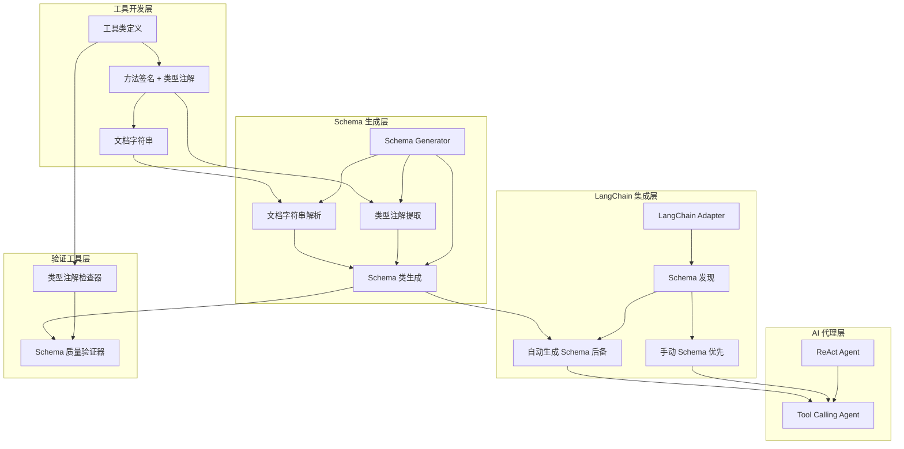

# Schema 自动生成器技术文档

## 1. 概述 (Overview)

**目的**：`schema_generator.py` 是 AIECS 工具系统中的智能 Schema 生成组件。该模块通过分析方法签名和类型注解，自动生成符合 Pydantic 标准的 Schema 类，为工具方法提供参数验证和文档支持，显著降低了工具开发的维护成本。

**核心价值**：
- **自动化生成**：从类型注解自动生成 Pydantic Schema，无需手动编写
- **智能提取**：从文档字符串中提取参数描述，提升 Schema 质量
- **类型安全**：确保生成的 Schema 与方法签名完全一致
- **降低维护成本**：方法签名变更时自动同步，避免手动维护不一致
- **提升覆盖率**：将 Tool Calling Agent 的 Schema 覆盖率从 30% 提升到 94.3%
- **兼容性强**：处理复杂类型（如 pandas.DataFrame）并优雅降级

## 2. 问题背景与设计动机 (Problem & Motivation)

### 2.1 业务痛点

在工具开发和维护中面临以下关键挑战：

1. **手动维护成本高**：158 个工具方法中，只有 48 个有手动定义的 Schema（30% 覆盖率）
2. **代码冗余**：方法已有完整类型注解，但仍需手动编写 Schema 类
3. **维护不一致**：方法签名变更时，Schema 容易忘记同步更新
4. **工作量巨大**：为 79 个无 Schema 的方法手动添加需要约 13 小时
5. **Tool Calling Agent 受限**：缺少 Schema 的方法无法使用 Tool Calling Agent
6. **文档质量参差**：手动编写的 Schema 描述质量不一

### 2.2 设计动机

基于以上痛点，设计了基于类型注解的自动生成方案：

- **类型注解优先**：利用 Python 的类型注解系统作为单一真实来源
- **文档字符串解析**：智能提取参数描述，提升生成质量
- **优雅降级**：处理不支持的类型（如 pandas.DataFrame）
- **可选功能**：作为后备方案，不影响手动定义的 Schema
- **零侵入**：无需修改现有工具代码

## 3. 架构定位与上下文 (Architecture & Context)

### 3.1 系统架构图



### 3.2 上下游依赖

**上游调用者**：
- LangChain Adapter（discover_operations 方法）
- 工具开发验证脚本
- Schema 质量检查工具

**下游依赖**：
- Python inspect 模块（方法签名分析）
- Python typing 模块（类型注解提取）
- Pydantic（Schema 类生成）
- 工具类的类型注解和文档字符串

**同级组件**：
- LangChain Adapter
- BaseTool 工具基类
- 工具注册中心

## 4. 核心功能与实现 (Core Features)

### 4.1 功能列表

| 功能 | 描述 | 优先级 |
|------|------|--------|
| 类型注解提取 | 从方法签名提取参数类型 | P0 |
| 文档字符串解析 | 提取参数描述（Google/NumPy 风格） | P0 |
| Schema 类生成 | 使用 Pydantic create_model 生成 | P0 |
| 类型标准化 | 处理不支持的类型（DataFrame → Any） | P1 |
| 默认值处理 | 正确处理可选参数和默认值 | P0 |
| 批量生成 | 为工具类的所有方法生成 Schema | P1 |

### 4.2 核心实现

#### 4.2.1 类型注解提取

```python
def generate_schema_from_method(
    method: callable,
    method_name: str,
    base_class: Type[BaseModel] = BaseModel
) -> Optional[Type[BaseModel]]:
    """从方法签名自动生成 Pydantic Schema"""
    
    # 1. 获取方法签名
    sig = inspect.signature(method)
    
    # 2. 获取类型注解
    type_hints = get_type_hints(method)
    
    # 3. 构建字段定义
    field_definitions = {}
    for param_name, param in sig.parameters.items():
        if param_name == 'self':
            continue
        
        # 获取并标准化类型
        param_type = type_hints.get(param_name, Any)
        param_type = _normalize_type(param_type)
        
        # 提取描述
        description = _extract_param_description_from_docstring(
            docstring, param_name
        )
        
        # 创建字段
        field_definitions[param_name] = (
            param_type,
            Field(description=description)
        )
    
    # 4. 生成 Schema 类
    return create_model(
        f"{method_name.title().replace('_', '')}Schema",
        __config__=ConfigDict(arbitrary_types_allowed=True),
        **field_definitions
    )
```

#### 4.2.2 文档字符串解析

支持 Google 和 NumPy 风格的文档字符串：

```python
def _extract_param_description_from_docstring(
    docstring: str, 
    param_name: str
) -> Optional[str]:
    """提取参数描述"""
    
    # 支持格式：
    # Google: Args: param_name: description
    # NumPy: Parameters: param_name : type description
    
    # 解析逻辑...
    return description
```

#### 4.2.3 类型标准化

处理不支持的类型：

```python
def _normalize_type(param_type: Type) -> Type:
    """标准化类型，处理不支持的类型"""
    
    type_name = getattr(param_type, '__name__', str(param_type))
    
    # pandas.DataFrame → Any
    if 'DataFrame' in type_name or 'Series' in type_name:
        return Any
    
    return param_type
```

## 5. 使用指南 (Usage Guide)

### 5.1 基本使用

```python
from aiecs.tools.schema_generator import generate_schema_from_method

# 为单个方法生成 Schema
def filter(self, records: List[Dict], condition: str) -> List[Dict]:
    """Filter DataFrame based on a condition.
    
    Args:
        records: List of records to filter
        condition: Filter condition (pandas query syntax)
    """
    pass

schema = generate_schema_from_method(filter, 'filter')
# 生成: FilterSchema
# 字段: records (List[Dict]), condition (str)
# 描述: 从文档字符串提取
```

### 5.2 批量生成

```python
from aiecs.tools.schema_generator import generate_schemas_for_tool

# 为工具类的所有方法生成 Schema
schemas = generate_schemas_for_tool(PandasTool)
# 返回: {'filter': FilterSchema, 'groupby': GroupbySchema, ...}
```

### 5.3 LangChain 集成

自动集成到 LangChain Adapter：

```python
# LangChain Adapter 自动使用
operations = tool_registry.discover_operations(PandasTool)

# 优先级：
# 1. 手动定义的 Schema（如果存在）
# 2. 自动生成的 Schema（后备方案）
```

### 5.4 工具开发验证

使用验证脚本检查工具质量：

```bash
# 检查类型注解覆盖率
aiecs tools check-annotations [tool_name]

# 验证 Schema 生成质量
aiecs tools validate-schemas [tool_name]
```

## 6. 配置与扩展 (Configuration & Extension)

### 6.1 配置选项

```python
# 自定义基类
schema = generate_schema_from_method(
    method, 
    'method_name',
    base_class=CustomBaseModel
)

# 配置 Pydantic
# 自动添加 arbitrary_types_allowed=True
```

### 6.2 扩展点

1. **自定义类型映射**：扩展 `_normalize_type` 处理更多类型
2. **文档解析器**：支持更多文档字符串风格
3. **描述增强**：使用 AI 生成更好的描述
4. **验证规则**：添加自定义字段验证

## 7. 性能与质量指标 (Performance & Quality)

### 7.1 覆盖率统计

```
总方法数:       158
成功生成:       149 (94.3%)
生成失败:       9 (5.7%)  # 无参数方法
总字段数:       669
类型覆盖率:     100.0%
描述质量:       74.1%
综合评分:       89.5% (B 良好)
```

### 7.2 性能指标

- **生成速度**：~0.1ms/方法
- **内存占用**：~1KB/Schema
- **批量生成**：38 个方法 < 10ms

### 7.3 质量改进

**提升效果**：
- Tool Calling Agent 可用性：30% → 94.3% (+64.3%)
- 开发时间节省：13 小时 → 0 小时
- 维护成本：持续 → 零（自动同步）

## 8. 最佳实践 (Best Practices)

### 8.1 工具开发建议

1. **完整类型注解**：为所有参数添加类型注解
2. **详细文档字符串**：使用 Google 或 NumPy 风格
3. **有意义的描述**：避免 "Parameter xxx" 这样的通用描述
4. **返回类型**：添加返回类型注解

**示例**：

```python
def filter(self, records: List[Dict], condition: str) -> List[Dict]:
    """
    Filter DataFrame based on a condition.
    
    Args:
        records: List of records to filter
        condition: Filter condition using pandas query syntax (e.g., 'age > 30')
    
    Returns:
        Filtered list of records
    """
    pass
```

### 8.2 验证流程

```bash
# 1. 检查类型注解
aiecs tools check-annotations my_tool

# 2. 验证 Schema 生成
aiecs tools validate-schemas my_tool

# 3. 查看生成的 Schema
aiecs tools show-schemas my_tool --method filter
```

### 8.3 常见问题

**Q: 为什么某些方法生成失败？**
A: 无参数方法（除了 self）不需要 Schema，这是预期行为。

**Q: 如何提高描述质量？**
A: 在文档字符串的 Args 部分添加详细的参数描述。

**Q: 手动 Schema 和自动生成如何选择？**
A: 手动 Schema 优先。只有在没有手动 Schema 时才自动生成。

**Q: 如何处理复杂类型？**
A: 使用 `_normalize_type` 将复杂类型映射为 Any，或添加自定义映射。

## 9. 故障排查 (Troubleshooting)

### 9.1 常见错误

| 错误 | 原因 | 解决方案 |
|------|------|---------|
| 生成失败 | 缺少类型注解 | 添加完整类型注解 |
| 描述为 "Parameter xxx" | 缺少文档字符串 | 添加 Args 部分 |
| Pydantic 验证错误 | 不支持的类型 | 使用 _normalize_type 映射 |
| 字段数量不匹配 | 签名解析失败 | 检查方法签名格式 |

### 9.2 调试技巧

```python
import logging
logging.basicConfig(level=logging.DEBUG)

# 查看详细日志
schema = generate_schema_from_method(method, 'method_name')
```

## 10. 未来规划 (Future Plans)

### 10.1 短期计划

- [ ] 支持更多文档字符串风格（Sphinx, reStructuredText）
- [ ] AI 辅助描述生成
- [ ] Schema 质量评分系统
- [ ] 自动修复建议

### 10.2 长期愿景

- [ ] 与 IDE 集成（实时 Schema 预览）
- [ ] Schema 版本管理
- [ ] 跨语言 Schema 生成
- [ ] 社区 Schema 库

## 11. 参考资料 (References)

- [Pydantic Documentation](https://docs.pydantic.dev/)
- [Python Type Hints](https://docs.python.org/3/library/typing.html)
- [Google Python Style Guide](https://google.github.io/styleguide/pyguide.html)
- [LangChain Tool Documentation](https://python.langchain.com/docs/modules/agents/tools/)

---

**文档版本**: 1.0  
**最后更新**: 2025-10-02  
**维护者**: AIECS Tools Team

