# LLM Output Structor 技术文档

## 1. 概述 (Overview)

**目的**：`LLM_output_structor.py` 是 AIECS 系统中负责 LLM 输出格式化和可读性增强的核心组件。该模块将技术性强的 LLM 输出转换为更加友好、自然和易于理解的格式，同时保留原始的分析过程和推理逻辑，显著提升用户体验和交互质量。

**核心价值**：
- **可读性增强**：将技术术语转换为用户友好的表达，降低理解门槛
- **结构优化**：改进文本格式和布局，提升视觉体验和阅读效率
- **人性化交互**：添加友好的问候语和结尾语，营造自然的对话氛围
- **推理保留**：保持 LLM 的思考过程和分析逻辑，确保透明度
- **多场景适配**：支持澄清、确认、完成等不同消息类型的专门优化

## 2. 问题背景与设计动机 (Problem & Motivation)

### 2.1 业务痛点

在 AIECS 系统开发过程中，我们面临以下关键挑战：

1. **技术门槛高**：LLM 输出包含大量技术术语和专业概念，普通用户难以理解
2. **交互体验差**：原始输出缺乏人性化元素，感觉像机器对话而非自然交流
3. **结构混乱**：LLM 输出格式不统一，缺乏清晰的层次结构和视觉引导
4. **推理过程隐藏**：重要的分析过程和思考逻辑被技术性表达掩盖
5. **场景适配不足**：不同业务场景需要不同的表达方式和交互风格
6. **用户接受度低**：生硬的输出格式影响用户对系统的信任和使用意愿

### 2.2 设计动机

基于以上痛点，我们设计了智能输出结构化组件：

- **降低理解门槛**：通过术语替换和语言简化，让技术内容更易理解
- **提升交互体验**：添加人性化元素，营造自然友好的对话氛围
- **优化视觉呈现**：统一格式标准，提供清晰的层次结构和视觉引导
- **保持透明度**：在提升可读性的同时保留完整的推理过程
- **场景化优化**：针对不同业务场景提供专门的格式化和表达优化

## 3. 架构定位与上下文 (Architecture & Context)

### 3.1 系统架构图

```mermaid
graph TB
    subgraph "用户交互层"
        A[用户请求] --> B[LLM 处理]
        B --> C[原始输出]
    end
    
    subgraph "输出处理层"
        C --> D[LLM Output Structor]
        D --> E[术语替换]
        D --> F[格式优化]
        D --> G[人性化增强]
    end
    
    subgraph "输出类型层"
        H[澄清消息] --> D
        I[确认消息] --> D
        J[完成消息] --> D
        K[通用消息] --> D
    end
    
    subgraph "用户界面层"
        D --> L[友好输出]
        L --> M[用户界面]
    end
    
    subgraph "配置层"
        N[术语映射表] --> D
        O[问候语模板] --> D
        P[结尾语模板] --> D
    end
```



### 3.2 上下游依赖关系

**上游调用者**：
- LLM 客户端：提供原始的技术性输出
- 业务服务层：需要用户友好的输出格式
- 任务执行器：需要结构化的确认和澄清消息

**下游依赖**：
- 用户界面：展示格式化后的友好输出
- 消息系统：发送增强后的交互消息
- 日志系统：记录转换过程和效果

**同级组件**：
- 提示词管理：提供原始输入内容
- 输出验证：确保转换后的内容质量
- 多语言支持：适配不同语言的表达习惯

### 3.3 数据流向


## 4. 核心功能与用例 (Core Features & Use Cases)

### 4.1 智能术语替换

**功能描述**：将技术术语和专业概念转换为用户友好的表达，降低理解门槛。

**核心特性**：
- 全面的术语映射表，覆盖常见技术概念
- 智能上下文匹配，确保替换的准确性
- 大小写不敏感匹配，提高替换覆盖率
- 保持原始含义的同时提升可读性

**使用场景**：
```python
from aiecs.utils.LLM_output_structor import LLMOutputTransformer

# 创建转换器实例
transformer = LLMOutputTransformer()

# 原始技术输出
technical_output = """
The demand_state is VAGUE_UNCLEAR and fails most SMART criteria.
The request lacks specificity and requires significant clarification.
I have generated a detailed smart_analysis with confidence level 0.8.
"""

# 转换为友好表达
friendly_output = transformer._enhance_readability(technical_output)
print(friendly_output)
# 输出：
# The request status is needs clarification and lacks several key details.
# The request lacks specificity and requires more details.
# I have generated a detailed analysis with certainty level 0.8.
```

**实际应用案例**：
- **需求分析**：将技术性需求分析转换为业务人员可理解的描述
- **错误诊断**：将系统错误信息转换为用户友好的问题说明
- **配置说明**：将技术配置参数转换为操作指导
- **状态报告**：将系统状态信息转换为直观的状态描述

### 4.2 结构化格式优化

**功能描述**：改进文本的层次结构、格式布局和视觉呈现，提升阅读体验。

**核心特性**：
- 统一的标题格式，使用表情符号增强视觉效果
- 优化的列表格式，提供清晰的层次结构
- 智能段落分割，确保内容的逻辑分组
- JSON 结构美化，提升数据可读性

**使用场景**：
```python
# 原始输出
raw_content = """
Reasoning: The user request is not Specific and not Measurable.
Clarification needed: What is the exact scope? What are the success criteria?
Problem Analysis: This is a high-level goal that requires breaking down.
Solution Approach: We need to create a multi-stage plan.
"""

# 格式化处理
formatted_content = transformer._enhance_readability(raw_content)
print(formatted_content)
# 输出：
# 💭 My Analysis: The user request is not specific enough and missing measurable goals.
# 
# 📝 Questions to Help Me Understand Better:
# • What is the exact scope?
# • What are the success criteria?
# 
# 🔍 Situation Overview: This is a general objective that requires breaking down.
# 
# 💡 Recommended Approach: We need to create a step-by-step plan.
```

**实际应用案例**：
- **报告生成**：将分析报告转换为结构化的业务文档
- **操作指南**：将技术操作步骤转换为清晰的用户手册
- **状态展示**：将系统状态信息转换为直观的仪表板显示
- **错误说明**：将错误信息转换为结构化的故障排除指南

### 4.3 人性化交互增强

**功能描述**：添加友好的问候语、结尾语和对话元素，营造自然的交互体验。

**核心特性**：
- 场景化问候语，根据消息类型选择合适的开场白
- 个性化结尾语，提供相应的后续行动建议
- 对话式表达，将第三人称转换为第二人称
- 情感化表达，使用更自然和友好的语言风格

**使用场景**：
```python
# 澄清消息
clarification_content = """
The request needs more details about the timeline and budget.
Please provide specific requirements for the project scope.
"""

# 转换为友好格式
friendly_message = transformer.transform_message(
    content=clarification_content,
    message_type='clarification'
)
print(friendly_message)
# 输出：
# Hello! Thank you for reaching out. Let me help you with your request.
# 
# The request needs more details about the timeline and budget.
# Please provide specific requirements for the project scope.
# 
# ✨ These details will help me provide you with the most accurate and helpful solution!
```

**实际应用案例**：
- **客服对话**：将系统响应转换为友好的客服交互
- **指导说明**：将操作指导转换为贴心的使用建议
- **状态通知**：将系统通知转换为温馨的状态更新
- **错误提示**：将错误信息转换为友好的问题解决建议

### 4.4 多场景消息优化

**功能描述**：针对不同业务场景提供专门的格式化和表达优化。

**核心特性**：
- 澄清消息：优化问题格式，增强引导性
- 确认消息：强化计划展示，提升可信度
- 完成消息：突出成果展示，增强成就感
- 通用消息：保持平衡，确保适用性

**使用场景**：
```python
# 确认消息优化
confirmation_content = """
I have generated a detailed strategy:
- Phase 1: Requirements analysis
- Phase 2: System design
- Phase 3: Implementation
Do you want to proceed with this plan?
"""

# 转换为确认消息格式
confirmation_message = transformer.transform_message(
    content=confirmation_content,
    message_type='confirmation'
)
print(confirmation_message)
# 输出：
# Great! I've carefully analyzed your requirements.
# 
# I've prepared a comprehensive strategy for you:
# 
# 📋 **Proposed Approach:**
# - Phase 1: Requirements analysis
# - Phase 2: System design
# - Phase 3: Implementation
# 
# 🤝 I'm ready to proceed whenever you are. Feel free to ask any questions or suggest modifications!
```

**实际应用案例**：
- **需求澄清**：将技术问题转换为引导性澄清对话
- **方案确认**：将技术方案转换为可理解的业务计划
- **任务完成**：将技术结果转换为用户友好的成果展示
- **状态更新**：将系统状态转换为用户关心的进度信息

## 5. API 参考 (API Reference)

### 5.1 LLMOutputTransformer 类

#### 构造函数
```python
def __init__(self)
```

**功能**：初始化 LLM 输出转换器
**参数**：无
**返回**：`LLMOutputTransformer` 实例

**初始化内容**：
- 技术术语替换映射表
- 友好标题映射表
- 问候语模板
- 结尾语模板

#### 方法

##### transform_message
```python
def transform_message(self, content: str, message_type: str = 'general', preserve_structure: bool = True) -> str
```

**功能**：转换 LLM 输出为更可读的格式
**参数**：
- `content` (str, 必需): 原始 LLM 输出内容
- `message_type` (str, 可选): 消息类型，可选值：
  - `'clarification'`: 澄清消息
  - `'confirmation'`: 确认消息
  - `'completion'`: 完成消息
  - `'general'`: 通用消息
- `preserve_structure` (bool, 可选): 是否保留原始结构，默认为 True

**返回**：
- `str`: 转换后的友好输出

**异常**：
- 无直接异常

**使用示例**：
```python
transformer = LLMOutputTransformer()
result = transformer.transform_message(
    content="The request is VAGUE_UNCLEAR and needs clarification.",
    message_type='clarification'
)
```

##### _enhance_readability
```python
def _enhance_readability(self, content: str) -> str
```

**功能**：增强内容可读性
**参数**：
- `content` (str, 必需): 要处理的内容

**返回**：
- `str`: 增强后的内容

**处理步骤**：
1. 替换技术术语
2. 更新标题格式
3. 格式化 JSON 结构
4. 优化列表格式
5. 改进间距布局

##### _enhance_clarification
```python
def _enhance_clarification(self, content: str) -> str
```

**功能**：专门优化澄清消息
**参数**：
- `content` (str, 必需): 澄清消息内容

**返回**：
- `str`: 优化后的澄清消息

**特殊处理**：
- 转换推理部分为对话式表达
- 格式化澄清问题
- 增强引导性

##### _enhance_confirmation
```python
def _enhance_confirmation(self, content: str) -> str
```

**功能**：专门优化确认消息
**参数**：
- `content` (str, 必需): 确认消息内容

**返回**：
- `str`: 优化后的确认消息

**特殊处理**：
- 优化技术描述
- 格式化计划展示
- 增强可信度表达

### 5.2 便利函数

#### format_clarification_message
```python
def format_clarification_message(
    questions: List[str],
    round_number: int = 1,
    reasoning: Optional[str] = None
) -> str
```

**功能**：格式化澄清消息
**参数**：
- `questions` (List[str], 必需): 澄清问题列表
- `round_number` (int, 可选): 当前轮次，默认为 1
- `reasoning` (Optional[str], 可选): 推理过程

**返回**：
- `str`: 格式化的澄清消息

**使用示例**：
```python
questions = [
    "What is the exact timeline for this project?",
    "What is the expected budget range?",
    "Who are the key stakeholders?"
]
message = format_clarification_message(questions, round_number=2)
```

#### format_confirmation_message
```python
def format_confirmation_message(
    content: Union[str, Dict[str, Any]],
    confirmation_type: str = 'strategy'
) -> str
```

**功能**：格式化确认消息
**参数**：
- `content` (Union[str, Dict[str, Any]], 必需): 确认内容
- `confirmation_type` (str, 可选): 确认类型，默认为 'strategy'

**返回**：
- `str`: 格式化的确认消息

**使用示例**：
```python
strategy = {
    "phase1": "Requirements analysis",
    "phase2": "System design",
    "phase3": "Implementation"
}
message = format_confirmation_message(strategy, 'strategy')
```

#### enhance_reasoning
```python
def enhance_reasoning(reasoning: str) -> str
```

**功能**：增强推理文本可读性
**参数**：
- `reasoning` (str, 必需): 原始推理文本

**返回**：
- `str`: 增强后的推理文本

**使用示例**：
```python
reasoning = "The user request is not specific enough and lacks measurable criteria."
enhanced = enhance_reasoning(reasoning)
# 输出: "Looking at what you've shared, the user request is not specific enough and lacks measurable criteria."
```

#### clean_technical_terms
```python
def clean_technical_terms(content: str) -> str
```

**功能**：清理技术术语
**参数**：
- `content` (str, 必需): 包含技术术语的内容

**返回**：
- `str`: 清理后的内容

**使用示例**：
```python
technical_content = "The demand_state is VAGUE_UNCLEAR and fails SMART criteria."
cleaned = clean_technical_terms(technical_content)
# 输出: "The request status is needs clarification and lacks several key details."
```

## 6. 技术实现细节 (Technical Details)

### 6.1 术语替换机制

**映射表设计**：
```python
self.technical_replacements = {
    # 技术术语到友好表达的映射
    "demand_state": "request status",
    "VAGUE_UNCLEAR": "needs clarification",
    "SMART_COMPLIANT": "well-defined",
    # ... 更多映射
}
```

**替换算法**：
```python
def _enhance_readability(self, content: str) -> str:
    result = content
    
    # 替换标题
    for old_header, new_header in self.section_headers.items():
        result = result.replace(old_header, new_header)
    
    # 替换技术术语（大小写不敏感）
    for technical, friendly in self.technical_replacements.items():
        result = re.sub(rf'\b{re.escape(technical)}\b', friendly, result, flags=re.IGNORECASE)
    
    return result
```

**优势**：
- 精确匹配：使用单词边界确保准确替换
- 大小写不敏感：提高替换覆盖率
- 可扩展性：易于添加新的术语映射

### 6.2 对话式转换机制

**人称转换**：
```python
def _convert_perspective(self, text: str) -> str:
    """将第三人称转换为第二人称"""
    # 替换 "the user" 为 "your"
    text = re.sub(r"the user'?s?\s+", "your ", text, flags=re.IGNORECASE)
    text = re.sub(r"user'?s?\s+", "your ", text, flags=re.IGNORECASE)
    
    # 替换 "the request" 为 "your request"
    text = re.sub(r"the request", "your request", text, flags=re.IGNORECASE)
    
    return text
```

**对话式表达**：
```python
def _make_reasoning_conversational(self, reasoning: str) -> str:
    """将推理转换为对话式表达"""
    sentences = reasoning.strip().split('.')
    conversational_parts = []
    
    for i, sentence in enumerate(sentences):
        sentence = sentence.strip()
        if not sentence:
            continue
            
        # 第一句添加引导语
        if i == 0:
            sentence = "Looking at what you've shared, " + sentence.lower()
        # 缺失信息句添加观察语
        elif any(word in sentence.lower() for word in ["lacks", "missing"]):
            sentence = "I notice that it " + sentence.lower()
        # 要求句添加帮助语
        elif any(word in sentence.lower() for word in ["requires", "needs"]):
            sentence = "To help you effectively, " + sentence.lower()
            
        conversational_parts.append(sentence)
    
    return '. '.join(conversational_parts)
```

### 6.3 格式优化机制

**标题美化**：
```python
self.section_headers = {
    "Reasoning:": "💭 My Analysis:",
    "Clarification needed": "📝 Questions to Help Me Understand Better",
    "Problem Analysis:": "🔍 Situation Overview:",
    "Solution Approach:": "💡 Recommended Approach:",
    # ... 更多标题映射
}
```

**列表格式化**：
```python
def _enhance_bullet_points(self, content: str) -> str:
    """优化列表格式"""
    # 统一项目符号
    content = re.sub(r'^[-*•]\s*', '• ', content, flags=re.MULTILINE)
    # 加粗编号
    content = re.sub(r'^\d+\.\s*', lambda m: f"**{m.group(0)}**", content, flags=re.MULTILINE)
    return content
```

**JSON 结构美化**：
```python
def _format_json_structures(self, content: str) -> str:
    """美化 JSON 结构"""
    def format_dict(match):
        dict_str = match.group(0)
        formatted = dict_str.replace("'", "")
        formatted = formatted.replace("{", "{\n  ")
        formatted = formatted.replace(",", ",\n  ")
        formatted = formatted.replace("}", "\n}")
        return formatted
    
    return re.sub(r'\{[^{}]+\}', format_dict, content)
```

### 6.4 场景化处理机制

**消息类型识别**：
```python
def transform_message(self, content: str, message_type: str = 'general', preserve_structure: bool = True) -> str:
    # 添加问候语
    result = self._add_greeting(message_type)
    
    # 转换主要内容
    transformed_content = self._enhance_readability(content)
    
    # 场景化处理
    if message_type == 'clarification':
        transformed_content = self._enhance_clarification(transformed_content)
    elif message_type == 'confirmation':
        transformed_content = self._enhance_confirmation(transformed_content)
    
    # 添加结尾语
    result += "\n\n" + transformed_content
    result += self._add_closing(message_type)
    
    return result
```

**问候语和结尾语模板**：
```python
self.greetings = {
    'clarification': "Hello! Thank you for reaching out. Let me help you with your request.",
    'confirmation': "Great! I've carefully analyzed your requirements.",
    'completion': "Excellent! I've completed the analysis.",
    'general': "Thank you for your message."
}

self.closings = {
    'clarification': "\n\n✨ These details will help me provide you with the most accurate and helpful solution!",
    'confirmation': "\n\n🤝 I'm ready to proceed whenever you are. Feel free to ask any questions or suggest modifications!",
    'completion': "\n\n✅ Everything is set up and ready. Let me know if you need any adjustments!",
    'general': "\n\n💬 Please let me know if you need any clarification!"
}
```

### 6.5 性能优化策略

**正则表达式优化**：
- 预编译常用正则表达式
- 使用非贪婪匹配减少回溯
- 合理使用标志位提高匹配效率

**字符串操作优化**：
- 批量替换减少多次遍历
- 使用字符串方法替代正则表达式
- 避免不必要的字符串复制

**内存管理**：
- 及时清理临时变量
- 使用生成器处理大文本
- 避免深拷贝大对象

## 7. 配置与部署 (Configuration & Deployment)

### 7.1 环境要求

**Python 版本**：
- Python 3.8+（推荐 Python 3.9+）
- 支持 `typing` 类型注解
- 支持 `re` 正则表达式模块

**依赖包**：
```python
# requirements.txt
# 核心依赖（无外部依赖）
# 仅使用 Python 标准库
```

**可选依赖**：
```python
# 用于高级文本处理（可选）
nltk>=3.7
spacy>=3.4.0
```

### 7.2 配置选项

**基础配置**：
```python
# config.py
class LLMOutputStructorConfig:
    """LLM 输出结构化配置"""
    
    # 术语替换配置
    ENABLE_TERM_REPLACEMENT = True
    CUSTOM_TERM_MAPPINGS = {}
    
    # 格式优化配置
    ENABLE_EMOJI_HEADERS = True
    ENABLE_BULLET_FORMATTING = True
    ENABLE_JSON_FORMATTING = True
    
    # 对话式转换配置
    ENABLE_CONVERSATIONAL_CONVERSION = True
    ENABLE_PERSPECTIVE_CONVERSION = True
    
    # 场景化处理配置
    ENABLE_SCENARIO_OPTIMIZATION = True
    CUSTOM_GREETINGS = {}
    CUSTOM_CLOSINGS = {}
```

**环境变量配置**：
```bash
# .env
LLM_OUTPUT_ENABLE_EMOJI=true
LLM_OUTPUT_ENABLE_CONVERSATIONAL=true
LLM_OUTPUT_CUSTOM_TERMS_FILE=/path/to/custom_terms.json
```

### 7.3 部署配置

**Docker 配置**：
```dockerfile
FROM python:3.9-slim

WORKDIR /app

# 复制代码
COPY aiecs/ ./aiecs/

# 设置环境变量
ENV LLM_OUTPUT_ENABLE_EMOJI=true
ENV LLM_OUTPUT_ENABLE_CONVERSATIONAL=true

# 运行应用
CMD ["python", "-m", "aiecs.utils.LLM_output_structor"]
```

**Kubernetes 配置**：
```yaml
apiVersion: apps/v1
kind: Deployment
metadata:
  name: aiecs-llm-output-structor
spec:
  replicas: 3
  selector:
    matchLabels:
      app: aiecs-llm-output-structor
  template:
    metadata:
      labels:
        app: aiecs-llm-output-structor
    spec:
      containers:
      - name: llm-output-structor
        image: aiecs/llm-output-structor:latest
        env:
        - name: LLM_OUTPUT_ENABLE_EMOJI
          value: "true"
        - name: LLM_OUTPUT_ENABLE_CONVERSATIONAL
          value: "true"
        resources:
          requests:
            memory: "64Mi"
            cpu: "50m"
          limits:
            memory: "128Mi"
            cpu: "100m"
```

### 7.4 监控配置

**性能指标**：
```python
from prometheus_client import Counter, Histogram, Gauge

# 定义监控指标
transformations_total = Counter('llm_output_transformations_total', 'Total transformations', ['message_type'])
transformation_duration_seconds = Histogram('llm_output_transformation_duration_seconds', 'Transformation duration')
term_replacements_total = Counter('llm_output_term_replacements_total', 'Total term replacements', ['term_type'])
```

**健康检查**：
```python
async def health_check():
    """LLM 输出结构化健康检查"""
    try:
        # 测试基本功能
        transformer = LLMOutputTransformer()
        test_content = "The demand_state is VAGUE_UNCLEAR."
        result = transformer._enhance_readability(test_content)
        
        if "request status" not in result:
            return {"status": "unhealthy", "error": "Term replacement failed"}
        
        return {
            "status": "healthy",
            "timestamp": time.time(),
            "version": "1.0.0"
        }
    except Exception as e:
        return {"status": "unhealthy", "error": str(e)}
```

## 8. 维护与故障排查 (Maintenance & Troubleshooting)

### 8.1 监控指标

**关键指标**：
- 转换成功率
- 转换处理时间
- 术语替换频率
- 不同消息类型的分布

**监控仪表板**：
```python
# Grafana 查询示例
# 转换成功率
rate(transformations_total[5m])

# 平均转换时间
histogram_quantile(0.95, rate(transformation_duration_seconds_bucket[5m]))

# 术语替换分布
rate(term_replacements_total[5m])
```

### 8.2 常见故障及解决方案

#### 8.2.1 术语替换不准确

**症状**：
- 某些技术术语未被正确替换
- 替换后的表达不准确或不符合上下文
- 用户反馈理解困难

**排查步骤**：
1. 检查术语映射表：确认术语是否在映射表中
2. 分析上下文：检查替换是否适合当前语境
3. 查看用户反馈：了解哪些术语需要调整

**解决方案**：
```python
# 添加自定义术语映射
class CustomLLMOutputTransformer(LLMOutputTransformer):
    def __init__(self):
        super().__init__()
        # 添加自定义术语映射
        self.technical_replacements.update({
            "custom_term": "friendly_expression",
            "another_term": "another_expression"
        })
    
    def add_custom_mapping(self, technical: str, friendly: str):
        """动态添加术语映射"""
        self.technical_replacements[technical] = friendly
```

#### 8.2.2 格式转换错误

**症状**：
- 输出格式混乱或不符合预期
- 表情符号或特殊字符显示异常
- 列表格式不正确

**排查步骤**：
1. 检查输入内容：确认原始内容格式
2. 分析转换逻辑：查看格式转换步骤
3. 测试边界情况：验证特殊字符处理

**解决方案**：
```python
# 增强格式转换的健壮性
def _enhance_readability(self, content: str) -> str:
    try:
        result = content
        
        # 安全地替换标题
        for old_header, new_header in self.section_headers.items():
            if old_header in result:
                result = result.replace(old_header, new_header)
        
        # 安全地替换术语
        for technical, friendly in self.technical_replacements.items():
            try:
                result = re.sub(rf'\b{re.escape(technical)}\b', friendly, result, flags=re.IGNORECASE)
            except re.error as e:
                logger.warning(f"Regex error for term '{technical}': {e}")
                # 使用简单替换作为备选
                result = result.replace(technical, friendly)
        
        return result
    except Exception as e:
        logger.error(f"Error in readability enhancement: {e}")
        return content  # 返回原始内容
```

#### 8.2.3 性能问题

**症状**：
- 转换处理时间过长
- 内存使用持续增长
- 系统响应变慢

**排查步骤**：
1. 分析处理时间：使用性能分析工具
2. 检查内存使用：监控内存增长趋势
3. 优化算法：减少不必要的操作

**解决方案**：
```python
# 性能优化版本
class OptimizedLLMOutputTransformer(LLMOutputTransformer):
    def __init__(self):
        super().__init__()
        # 预编译正则表达式
        self._compiled_patterns = {}
        for technical in self.technical_replacements:
            try:
                self._compiled_patterns[technical] = re.compile(
                    rf'\b{re.escape(technical)}\b', 
                    flags=re.IGNORECASE
                )
            except re.error:
                self._compiled_patterns[technical] = None
    
    def _enhance_readability(self, content: str) -> str:
        result = content
        
        # 使用预编译的正则表达式
        for technical, friendly in self.technical_replacements.items():
            pattern = self._compiled_patterns.get(technical)
            if pattern:
                result = pattern.sub(friendly, result)
            else:
                result = result.replace(technical, friendly)
        
        return result
```

### 8.3 日志分析

**日志配置**：
```python
import logging

# 配置 LLM 输出结构化日志
structor_logger = logging.getLogger('aiecs.llm_output_structor')
structor_logger.setLevel(logging.INFO)

# 添加文件处理器
file_handler = logging.FileHandler('/var/log/aiecs/llm_output_structor.log')
file_handler.setFormatter(logging.Formatter(
    '%(asctime)s - %(name)s - %(levelname)s - %(message)s'
))
structor_logger.addHandler(file_handler)
```

**关键日志模式**：
```bash
# 查找转换错误
grep "ERROR" /var/log/aiecs/llm_output_structor.log | tail -100

# 分析性能问题
grep "transformation_duration" /var/log/aiecs/llm_output_structor.log

# 监控术语替换
grep "term_replacement" /var/log/aiecs/llm_output_structor.log | tail -50
```

### 8.4 测试和验证

**单元测试**：
```python
import unittest

class TestLLMOutputTransformer(unittest.TestCase):
    def setUp(self):
        self.transformer = LLMOutputTransformer()
    
    def test_term_replacement(self):
        """测试术语替换功能"""
        input_text = "The demand_state is VAGUE_UNCLEAR."
        expected = "The request status is needs clarification."
        result = self.transformer._enhance_readability(input_text)
        self.assertIn("request status", result)
        self.assertIn("needs clarification", result)
    
    def test_message_transformation(self):
        """测试消息转换功能"""
        content = "The request needs clarification."
        result = self.transformer.transform_message(content, 'clarification')
        self.assertIn("Hello!", result)
        self.assertIn("✨", result)
    
    def test_format_optimization(self):
        """测试格式优化功能"""
        content = "Reasoning: This is a test.\nClarification needed: What is the scope?"
        result = self.transformer._enhance_readability(content)
        self.assertIn("💭 My Analysis:", result)
        self.assertIn("📝 Questions to Help Me Understand Better:", result)
```

**集成测试**：
```python
def test_end_to_end_transformation():
    """端到端转换测试"""
    transformer = LLMOutputTransformer()
    
    # 模拟真实场景
    technical_output = """
    Reasoning: The user request is not Specific and not Measurable.
    Clarification needed: What is the exact scope? What are the success criteria?
    Problem Analysis: This is a high-level goal that requires breaking down.
    """
    
    result = transformer.transform_message(technical_output, 'clarification')
    
    # 验证关键元素
    assert "Hello!" in result
    assert "💭 My Analysis:" in result
    assert "📝 Questions to Help Me Understand Better:" in result
    assert "✨" in result
    assert "Looking at what you've shared" in result
```

## 9. 可视化图表 (Visualizations)

### 9.1 系统架构图


### 9.2 数据流图


### 9.3 术语替换效果图


### 9.4 消息类型分布图


## 10. 版本历史 (Version History)

### v1.0.0 (2024-01-15)
**新增功能**：
- 实现基础 `LLMOutputTransformer` 类
- 支持技术术语替换
- 实现格式优化功能
- 添加基础对话转换

**技术特性**：
- 基于正则表达式的术语替换
- 表情符号标题美化
- 基础的人称转换
- 简单的格式优化

### v1.1.0 (2024-02-01)
**新增功能**：
- 实现场景化消息处理
- 添加问候语和结尾语模板
- 支持 JSON 结构美化
- 增强对话式转换

**改进**：
- 优化术语替换算法
- 增强格式转换逻辑
- 改进人称转换准确性
- 添加更多表情符号

### v1.2.0 (2024-03-01)
**新增功能**：
- 实现便利函数接口
- 添加自定义术语映射支持
- 支持批量处理
- 添加性能监控

**性能优化**：
- 预编译正则表达式
- 优化字符串操作
- 减少内存使用
- 提升处理速度

### v1.3.0 (2024-04-01) [计划中]
**计划功能**：
- 支持多语言术语替换
- 添加智能上下文分析
- 实现动态模板生成
- 支持用户自定义样式

**性能目标**：
- 处理时间 < 10ms
- 支持 1000+ 并发转换
- 99.9% 转换成功率
- 内存使用 < 50MB

---

## 附录

### A. 相关文档链接
- [LLM 客户端架构文档](../LLM/LLM_CLIENT_ARCHITECTURE.md)
- [用户界面设计文档](../UI/UI_DESIGN.md)
- [消息系统文档](../INFRASTRUCTURE_MESSAGEING/MESSAGE_SYSTEM.md)

### B. 示例代码仓库
- [完整示例项目](https://github.com/aiecs/examples)
- [术语映射配置](https://github.com/aiecs/term-mappings)
- [格式模板库](https://github.com/aiecs/format-templates)

### C. 技术支持
- 技术文档：https://docs.aiecs.com
- 问题反馈：https://github.com/aiecs/issues
- 社区讨论：https://discord.gg/aiecs

### D. 最佳实践

#### D.1 术语映射最佳实践
```python
# 创建自定义术语映射
class CustomTermMappings:
    """自定义术语映射最佳实践"""
    
    def __init__(self):
        self.mappings = {
            # 业务特定术语
            "API_ENDPOINT": "服务接口",
            "DATABASE_QUERY": "数据查询",
            "AUTHENTICATION": "身份验证",
            
            # 技术概念映射
            "MICROSERVICE": "微服务",
            "CONTAINER": "容器",
            "KUBERNETES": "K8s 集群",
            
            # 状态描述
            "PENDING": "等待中",
            "PROCESSING": "处理中",
            "COMPLETED": "已完成",
            "FAILED": "失败"
        }
    
    def add_domain_specific_terms(self, domain: str, terms: Dict[str, str]):
        """添加特定领域的术语映射"""
        prefix = f"{domain.upper()}_"
        for technical, friendly in terms.items():
            self.mappings[f"{prefix}{technical}"] = friendly
```

#### D.2 格式模板最佳实践
```python
# 创建自定义格式模板
class CustomFormatTemplates:
    """自定义格式模板最佳实践"""
    
    def __init__(self):
        self.templates = {
            'error_message': {
                'greeting': "抱歉，我遇到了一些问题。",
                'closing': "请稍后重试，或联系技术支持。"
            },
            'success_message': {
                'greeting': "太好了！操作已成功完成。",
                'closing': "如有其他需要，请随时告诉我。"
            },
            'warning_message': {
                'greeting': "请注意，我发现了一些需要注意的地方。",
                'closing': "建议您仔细检查后再继续。"
            }
        }
    
    def get_template(self, message_type: str) -> Dict[str, str]:
        """获取指定类型的模板"""
        return self.templates.get(message_type, self.templates['default'])
```

#### D.3 性能优化最佳实践
```python
# 性能优化配置
class PerformanceOptimizedTransformer(LLMOutputTransformer):
    """性能优化的转换器"""
    
    def __init__(self):
        super().__init__()
        self._cache = {}  # 结果缓存
        self._max_cache_size = 1000
    
    def transform_message(self, content: str, message_type: str = 'general', preserve_structure: bool = True) -> str:
        """带缓存的转换方法"""
        # 生成缓存键
        cache_key = f"{hash(content)}_{message_type}_{preserve_structure}"
        
        # 检查缓存
        if cache_key in self._cache:
            return self._cache[cache_key]
        
        # 执行转换
        result = super().transform_message(content, message_type, preserve_structure)
        
        # 缓存结果
        if len(self._cache) < self._max_cache_size:
            self._cache[cache_key] = result
        
        return result
```

