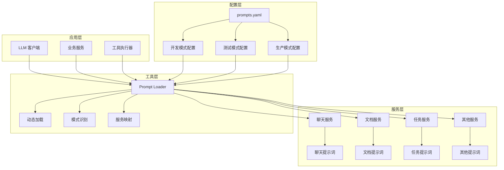
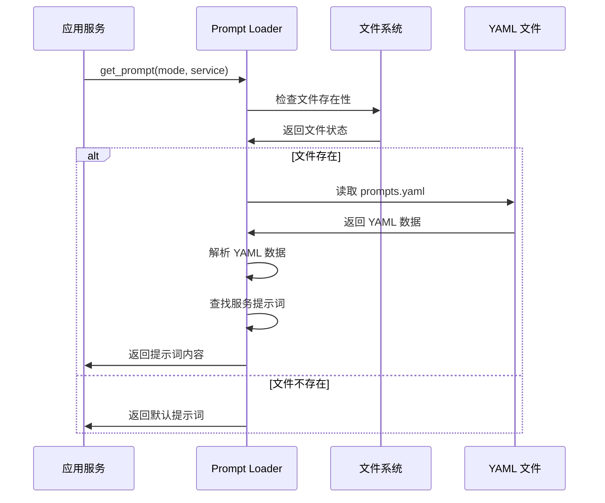
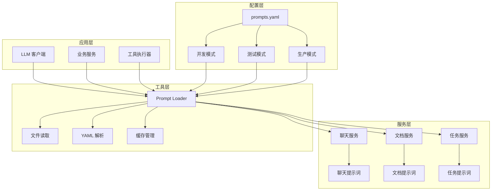
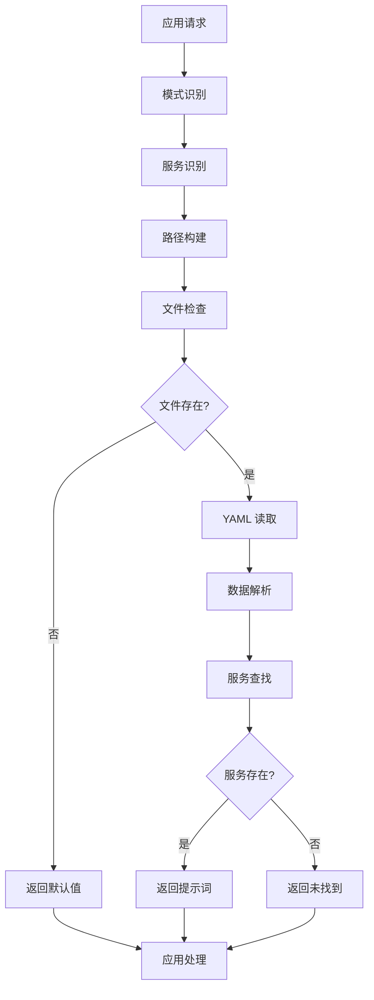

# Prompt Loader 技术文档

## 1. 概述 (Overview)

**目的**：`prompt_loader.py` 是 AIECS 系统中负责动态加载和管理提示词模板的核心工具组件。该模块通过从 YAML 配置文件中读取不同服务和模式的提示词，为整个系统的 LLM 交互提供了统一、可配置的提示词管理机制，显著提升了系统的灵活性和可维护性。

**核心价值**：
- **动态配置**：支持运行时动态加载不同服务和模式的提示词模板
- **统一管理**：集中管理所有提示词，避免硬编码和重复定义
- **模式支持**：支持不同运行模式（开发、测试、生产）的提示词配置
- **服务隔离**：为不同服务提供独立的提示词配置，确保功能隔离
- **容错处理**：提供默认提示词和错误处理，确保系统稳定性

## 2. 问题背景与设计动机 (Problem & Motivation)

### 2.1 业务痛点

在 AIECS 系统开发过程中，我们面临以下关键挑战：

1. **提示词硬编码**：提示词直接写在代码中，难以维护和修改
2. **重复定义**：相同或相似的提示词在多个地方重复定义
3. **环境隔离不足**：不同环境使用相同的提示词，缺乏针对性优化
4. **服务耦合**：不同服务的提示词混合在一起，缺乏清晰的边界
5. **配置管理混乱**：提示词配置分散，缺乏统一的管理机制
6. **动态性不足**：无法在不重启系统的情况下更新提示词

### 2.2 设计动机

基于以上痛点，我们设计了统一的提示词加载组件：

- **配置外部化**：将提示词从代码中分离到配置文件，提高可维护性
- **模式化管理**：支持不同运行模式的提示词配置，提高环境适配性
- **服务化隔离**：为不同服务提供独立的提示词空间，提高系统模块化
- **动态加载**：支持运行时加载提示词，提高系统灵活性
- **容错设计**：提供默认值和错误处理，确保系统稳定性

## 3. 架构定位与上下文 (Architecture & Context)

### 3.1 系统架构图



### 3.2 上下游依赖关系

**上游调用者**：
- LLM 客户端：需要获取特定服务的提示词
- 业务服务：需要加载相应的提示词模板
- 工具执行器：需要获取工具相关的提示词

**下游依赖**：
- YAML 配置文件：存储提示词模板数据
- 文件系统：提供配置文件访问能力
- 操作系统：提供文件操作支持

**同级组件**：
- 配置管理：提供系统配置信息
- 日志系统：记录提示词加载过程
- 错误处理：处理加载失败的情况

### 3.3 数据流向



## 4. 核心功能与用例 (Core Features & Use Cases)

### 4.1 动态提示词加载

**功能描述**：根据指定的模式和服务名称，动态加载相应的提示词模板。

**核心特性**：
- 支持多模式配置（开发、测试、生产）
- 支持多服务隔离（聊天、文档、任务等）
- 自动文件存在性检查
- 优雅的错误处理和默认值返回

**使用场景**：
```python
from aiecs.utils.prompt_loader import get_prompt

# 加载聊天服务的开发模式提示词
chat_prompt = get_prompt("development", "chat_service")
print(chat_prompt)

# 加载文档服务的生产模式提示词
doc_prompt = get_prompt("production", "document_service")
print(doc_prompt)

# 加载任务服务的测试模式提示词
task_prompt = get_prompt("testing", "task_service")
print(task_prompt)
```

**实际应用案例**：
- **聊天机器人**：根据环境加载不同的对话提示词
- **文档处理**：根据服务类型加载相应的文档分析提示词
- **任务执行**：根据运行模式加载不同的任务指导提示词
- **错误处理**：加载统一的错误提示和用户引导

### 4.2 多模式配置支持

**功能描述**：支持不同运行模式的提示词配置，确保环境适配性。

**核心特性**：
- 开发模式：详细的调试信息和开发指导
- 测试模式：简化的测试用例和验证提示
- 生产模式：优化的用户体验和性能提示

**使用场景**：
```python
# 开发环境 - 详细调试信息
dev_prompt = get_prompt("development", "error_handler")
# 可能返回：详细的错误分析、调试步骤、技术细节

# 测试环境 - 简化测试用例
test_prompt = get_prompt("testing", "validation")
# 可能返回：简化的验证步骤、测试要点

# 生产环境 - 用户友好提示
prod_prompt = get_prompt("production", "user_guide")
# 可能返回：简洁的操作指导、用户友好的说明
```

**实际应用案例**：
- **错误诊断**：开发环境提供详细技术信息，生产环境提供用户友好提示
- **性能监控**：不同环境使用不同详细程度的监控提示
- **用户引导**：根据环境调整引导信息的详细程度
- **安全控制**：生产环境隐藏敏感信息，开发环境显示完整信息

### 4.3 服务隔离管理

**功能描述**：为不同服务提供独立的提示词配置空间，确保功能隔离。

**核心特性**：
- 服务级别的提示词隔离
- 避免不同服务间的提示词冲突
- 支持服务特定的提示词优化
- 便于服务的独立开发和维护

**使用场景**：
```python
# 聊天服务提示词
chat_prompt = get_prompt("production", "chat_service")
# 专注于对话流程、情感理解、回复生成

# 文档服务提示词
doc_prompt = get_prompt("production", "document_service")
# 专注于文档分析、内容提取、格式处理

# 任务服务提示词
task_prompt = get_prompt("production", "task_service")
# 专注于任务分解、执行指导、状态管理

# 工具服务提示词
tool_prompt = get_prompt("production", "tool_service")
# 专注于工具选择、参数配置、结果处理
```

**实际应用案例**：
- **微服务架构**：每个微服务使用独立的提示词配置
- **功能模块化**：不同功能模块使用专门的提示词
- **团队协作**：不同团队可以独立管理各自的提示词
- **版本控制**：服务级别的提示词版本管理

### 4.4 容错和默认处理

**功能描述**：提供完善的错误处理和默认值机制，确保系统稳定性。

**核心特性**：
- 文件不存在时的默认提示词返回
- 服务未找到时的友好提示
- 优雅的错误处理，不影响主业务流程
- 可配置的默认值策略

**使用场景**：
```python
# 文件不存在的情况
missing_file_prompt = get_prompt("development", "non_existent_service")
# 返回: "[Default prompt]"

# 服务未找到的情况
missing_service_prompt = get_prompt("production", "unknown_service")
# 返回: "[No specific prompt found]"

# 在业务代码中的使用
def process_user_request(service_name: str, mode: str = "production"):
    try:
        prompt = get_prompt(mode, service_name)
        if prompt.startswith("[Default prompt]") or prompt.startswith("[No specific prompt found]"):
            # 使用备用提示词或记录警告
            logger.warning(f"Using default prompt for service: {service_name}")
            prompt = get_fallback_prompt(service_name)
        
        # 使用提示词处理请求
        return process_with_prompt(prompt, user_request)
    except Exception as e:
        logger.error(f"Error loading prompt for {service_name}: {e}")
        return handle_error_with_default_prompt()
```

**实际应用案例**：
- **系统启动**：在配置文件缺失时使用默认提示词
- **服务降级**：在特定服务提示词不可用时使用通用提示词
- **错误恢复**：在提示词加载失败时提供备用方案
- **开发调试**：在开发过程中使用默认提示词进行测试

## 5. API 参考 (API Reference)

### 5.1 get_prompt 函数

#### 函数定义
```python
def get_prompt(mode: str, service: str) -> str
```

**功能**：从配置文件中加载指定模式和服务的提示词
**参数**：
- `mode` (str, 必需): 运行模式，如 "development"、"testing"、"production"
- `service` (str, 必需): 服务名称，如 "chat_service"、"document_service"、"task_service"

**返回**：
- `str`: 加载的提示词内容，如果加载失败则返回默认值

**异常**：
- 无直接异常，所有错误都被内部处理并返回默认值

**使用示例**：
```python
# 基本使用
prompt = get_prompt("production", "chat_service")

# 错误处理
prompt = get_prompt("development", "unknown_service")
if prompt.startswith("[No specific prompt found]"):
    # 处理服务未找到的情况
    prompt = get_default_prompt()
```

#### 内部实现逻辑

**文件路径构建**：
```python
path = f"app/services/{mode}/prompts.yaml"
```

**文件存在性检查**：
```python
if not os.path.exists(path):
    return "[Default prompt]"
```

**YAML 文件读取**：
```python
with open(path, "r", encoding="utf-8") as f:
    data = yaml.safe_load(f)
```

**服务提示词查找**：
```python
return data.get(service, "[No specific prompt found]")
```

## 6. 技术实现细节 (Technical Details)

### 6.1 文件路径解析机制

**路径构建规则**：
```python
def build_prompt_path(mode: str) -> str:
    """构建提示词文件路径"""
    return f"app/services/{mode}/prompts.yaml"
```

**路径验证**：
```python
def validate_path(path: str) -> bool:
    """验证文件路径是否有效"""
    return os.path.exists(path) and os.path.isfile(path)
```

**优势**：
- 清晰的目录结构
- 模式化的文件组织
- 易于维护和扩展

### 6.2 YAML 解析机制

**安全解析**：
```python
def load_yaml_safely(file_path: str) -> dict:
    """安全地加载 YAML 文件"""
    try:
        with open(file_path, "r", encoding="utf-8") as f:
            return yaml.safe_load(f) or {}
    except yaml.YAMLError as e:
        logger.error(f"YAML parsing error: {e}")
        return {}
    except Exception as e:
        logger.error(f"File reading error: {e}")
        return {}
```

**编码处理**：
- 使用 UTF-8 编码确保中文支持
- 自动处理不同操作系统的换行符
- 支持 Unicode 字符

### 6.3 错误处理机制

**分层错误处理**：
```python
def get_prompt_with_error_handling(mode: str, service: str) -> str:
    """带错误处理的提示词加载"""
    try:
        # 1. 构建路径
        path = build_prompt_path(mode)
        
        # 2. 检查文件存在性
        if not validate_path(path):
            logger.warning(f"Prompt file not found: {path}")
            return "[Default prompt]"
        
        # 3. 加载 YAML 数据
        data = load_yaml_safely(path)
        
        # 4. 查找服务提示词
        prompt = data.get(service)
        if prompt is None:
            logger.info(f"No prompt found for service: {service}")
            return "[No specific prompt found]"
        
        return prompt
        
    except Exception as e:
        logger.error(f"Unexpected error loading prompt: {e}")
        return "[Default prompt]"
```

**错误类型处理**：
- 文件不存在：返回默认提示词
- YAML 解析错误：记录错误并返回默认值
- 服务未找到：返回友好提示
- 其他异常：记录错误并返回默认值

### 6.4 性能优化策略

**文件缓存机制**：
```python
class PromptCache:
    """提示词缓存管理"""
    
    def __init__(self, max_size: int = 100):
        self.cache = {}
        self.max_size = max_size
        self.access_times = {}
    
    def get(self, mode: str, service: str) -> Optional[str]:
        """从缓存获取提示词"""
        key = f"{mode}:{service}"
        if key in self.cache:
            self.access_times[key] = time.time()
            return self.cache[key]
        return None
    
    def set(self, mode: str, service: str, prompt: str):
        """缓存提示词"""
        key = f"{mode}:{service}"
        if len(self.cache) >= self.max_size:
            self._evict_oldest()
        
        self.cache[key] = prompt
        self.access_times[key] = time.time()
    
    def _evict_oldest(self):
        """淘汰最旧的缓存项"""
        oldest_key = min(self.access_times.keys(), key=lambda k: self.access_times[k])
        del self.cache[oldest_key]
        del self.access_times[oldest_key]
```

**延迟加载**：
```python
def get_prompt_lazy(mode: str, service: str) -> str:
    """延迟加载提示词"""
    # 先检查缓存
    cached_prompt = prompt_cache.get(mode, service)
    if cached_prompt:
        return cached_prompt
    
    # 加载并缓存
    prompt = get_prompt(mode, service)
    prompt_cache.set(mode, service, prompt)
    return prompt
```

### 6.5 配置验证机制

**模式验证**：
```python
VALID_MODES = {"development", "testing", "production", "staging"}

def validate_mode(mode: str) -> bool:
    """验证模式是否有效"""
    return mode in VALID_MODES
```

**服务名称验证**：
```python
def validate_service(service: str) -> bool:
    """验证服务名称是否有效"""
    # 检查服务名称格式
    if not service or not isinstance(service, str):
        return False
    
    # 检查是否包含有效字符
    if not re.match(r'^[a-zA-Z0-9_-]+$', service):
        return False
    
    return True
```

**YAML 结构验证**：
```python
def validate_yaml_structure(data: dict) -> bool:
    """验证 YAML 数据结构"""
    if not isinstance(data, dict):
        return False
    
    # 检查是否包含必要的键
    required_keys = {"version", "services"}
    return all(key in data for key in required_keys)
```

## 7. 配置与部署 (Configuration & Deployment)

### 7.1 环境要求

**Python 版本**：
- Python 3.8+（推荐 Python 3.9+）
- 支持 `yaml` 模块
- 支持 `os` 模块

**依赖包**：
```python
# requirements.txt
PyYAML>=6.0  # YAML 文件解析
```

**可选依赖**：
```python
# 用于高级功能（可选）
ruamel.yaml>=0.17.0  # 更强大的 YAML 处理
```

### 7.2 配置文件结构

**目录结构**：
```
app/
├── services/
│   ├── development/
│   │   └── prompts.yaml
│   ├── testing/
│   │   └── prompts.yaml
│   ├── staging/
│   │   └── prompts.yaml
│   └── production/
│       └── prompts.yaml
```

**YAML 文件格式**：
```yaml
# app/services/production/prompts.yaml
version: "1.0.0"
last_updated: "2024-01-15T10:30:00Z"

services:
  chat_service:
    system_prompt: |
      你是一个专业的AI助手，能够帮助用户解决各种问题。
      请保持友好、专业和有用的态度。
    
    user_prompt_template: |
      用户问题：{user_question}
      上下文：{context}
    
    error_prompt: |
      抱歉，我遇到了一些技术问题。请稍后重试，或联系技术支持。
  
  document_service:
    analysis_prompt: |
      请分析以下文档内容：
      文档类型：{doc_type}
      文档内容：{content}
      
      请提供：
      1. 主要内容摘要
      2. 关键信息提取
      3. 建议的后续操作
  
  task_service:
    planning_prompt: |
      基于以下任务描述，制定详细的执行计划：
      任务：{task_description}
      优先级：{priority}
      截止时间：{deadline}
      
      请提供：
      1. 任务分解
      2. 时间安排
      3. 资源需求
      4. 风险评估
```

### 7.3 环境变量配置

**基础配置**：
```bash
# .env
PROMPT_CONFIG_PATH=app/services
PROMPT_CACHE_SIZE=100
PROMPT_CACHE_TTL=3600
PROMPT_DEFAULT_MODE=production
```

**高级配置**：
```bash
# 提示词配置
PROMPT_ENABLE_CACHE=true
PROMPT_CACHE_BACKEND=memory
PROMPT_VALIDATION_STRICT=true
PROMPT_LOG_LEVEL=INFO
```

### 7.4 部署配置

**Docker 配置**：
```dockerfile
FROM python:3.9-slim

WORKDIR /app

# 安装依赖
COPY requirements.txt .
RUN pip install --no-cache-dir -r requirements.txt

# 复制配置文件和代码
COPY app/ ./app/
COPY aiecs/ ./aiecs/

# 设置环境变量
ENV PROMPT_CONFIG_PATH=app/services
ENV PROMPT_DEFAULT_MODE=production

# 运行应用
CMD ["python", "-m", "aiecs.utils.prompt_loader"]
```

**Kubernetes 配置**：
```yaml
apiVersion: apps/v1
kind: Deployment
metadata:
  name: aiecs-prompt-loader
spec:
  replicas: 3
  selector:
    matchLabels:
      app: aiecs-prompt-loader
  template:
    metadata:
      labels:
        app: aiecs-prompt-loader
    spec:
      containers:
      - name: prompt-loader
        image: aiecs/prompt-loader:latest
        env:
        - name: PROMPT_CONFIG_PATH
          value: "app/services"
        - name: PROMPT_DEFAULT_MODE
          value: "production"
        volumeMounts:
        - name: prompt-configs
          mountPath: /app/services
      volumes:
      - name: prompt-configs
        configMap:
          name: prompt-configs
```

### 7.5 监控配置

**性能指标**：
```python
from prometheus_client import Counter, Histogram, Gauge

# 定义监控指标
prompt_loads_total = Counter('prompt_loads_total', 'Total prompt loads', ['mode', 'service', 'status'])
prompt_load_duration_seconds = Histogram('prompt_load_duration_seconds', 'Prompt load duration')
prompt_cache_hits_total = Counter('prompt_cache_hits_total', 'Total cache hits')
prompt_cache_size = Gauge('prompt_cache_size', 'Current cache size')
```

**健康检查**：
```python
async def health_check():
    """提示词加载器健康检查"""
    try:
        # 测试基本功能
        test_prompt = get_prompt("production", "health_check")
        
        if test_prompt.startswith("[Default prompt]"):
            return {"status": "degraded", "message": "Using default prompts"}
        
        return {
            "status": "healthy",
            "timestamp": time.time(),
            "version": "1.0.0"
        }
    except Exception as e:
        return {"status": "unhealthy", "error": str(e)}
```

## 8. 维护与故障排查 (Maintenance & Troubleshooting)

### 8.1 监控指标

**关键指标**：
- 提示词加载成功率
- 加载响应时间
- 缓存命中率
- 不同模式和服务的使用分布

**监控仪表板**：
```python
# Grafana 查询示例
# 加载成功率
rate(prompt_loads_total{status="success"}[5m]) / rate(prompt_loads_total[5m])

# 平均加载时间
histogram_quantile(0.95, rate(prompt_load_duration_seconds_bucket[5m]))

# 缓存命中率
rate(prompt_cache_hits_total[5m]) / rate(prompt_loads_total[5m])
```

### 8.2 常见故障及解决方案

#### 8.2.1 配置文件不存在

**症状**：
- 返回 "[Default prompt]" 默认值
- 日志中出现 "Prompt file not found" 警告
- 系统功能受限

**排查步骤**：
1. 检查文件路径：确认 `app/services/{mode}/prompts.yaml` 是否存在
2. 检查权限：确认应用有读取文件的权限
3. 检查目录结构：确认目录结构是否正确

**解决方案**：
```python
# 创建默认配置文件
def create_default_prompts_file(mode: str):
    """创建默认提示词文件"""
    import os
    import yaml
    
    # 创建目录
    os.makedirs(f"app/services/{mode}", exist_ok=True)
    
    # 默认配置
    default_config = {
        "version": "1.0.0",
        "last_updated": datetime.now().isoformat(),
        "services": {
            "default_service": {
                "prompt": "这是一个默认提示词，请配置具体的服务提示词。"
            }
        }
    }
    
    # 写入文件
    with open(f"app/services/{mode}/prompts.yaml", "w", encoding="utf-8") as f:
        yaml.dump(default_config, f, default_flow_style=False, allow_unicode=True)
```

#### 8.2.2 YAML 解析错误

**症状**：
- 返回 "[Default prompt]" 默认值
- 日志中出现 "YAML parsing error" 错误
- 配置文件格式问题

**排查步骤**：
1. 检查 YAML 语法：使用 YAML 验证工具检查语法
2. 检查编码：确认文件使用 UTF-8 编码
3. 检查特殊字符：确认没有不支持的字符

**解决方案**：
```python
# YAML 验证工具
def validate_yaml_file(file_path: str) -> bool:
    """验证 YAML 文件格式"""
    try:
        with open(file_path, "r", encoding="utf-8") as f:
            yaml.safe_load(f)
        return True
    except yaml.YAMLError as e:
        print(f"YAML 语法错误: {e}")
        return False
    except Exception as e:
        print(f"文件读取错误: {e}")
        return False

# 修复 YAML 文件
def fix_yaml_file(file_path: str):
    """修复 YAML 文件格式"""
    try:
        # 读取原始内容
        with open(file_path, "r", encoding="utf-8") as f:
            content = f.read()
        
        # 基本修复
        content = content.replace('\t', '  ')  # 替换制表符为空格
        content = re.sub(r' +$', '', content, flags=re.MULTILINE)  # 移除行尾空格
        
        # 写回文件
        with open(file_path, "w", encoding="utf-8") as f:
            f.write(content)
            
    except Exception as e:
        print(f"修复 YAML 文件失败: {e}")
```

#### 8.2.3 服务提示词未找到

**症状**：
- 返回 "[No specific prompt found]" 提示
- 特定服务使用默认提示词
- 功能不完整

**排查步骤**：
1. 检查服务名称：确认服务名称是否正确
2. 检查 YAML 结构：确认服务是否在配置中定义
3. 检查键名匹配：确认键名是否完全匹配

**解决方案**：
```python
# 服务提示词检查工具
def check_service_prompts(mode: str, service: str) -> dict:
    """检查服务提示词配置"""
    try:
        path = f"app/services/{mode}/prompts.yaml"
        with open(path, "r", encoding="utf-8") as f:
            data = yaml.safe_load(f)
        
        services = data.get("services", {})
        if service in services:
            return {
                "found": True,
                "prompt": services[service],
                "keys": list(services[service].keys()) if isinstance(services[service], dict) else None
            }
        else:
            return {
                "found": False,
                "available_services": list(services.keys())
            }
    except Exception as e:
        return {"error": str(e)}

# 添加服务提示词
def add_service_prompt(mode: str, service: str, prompt: str):
    """添加服务提示词"""
    try:
        path = f"app/services/{mode}/prompts.yaml"
        
        # 读取现有配置
        if os.path.exists(path):
            with open(path, "r", encoding="utf-8") as f:
                data = yaml.safe_load(f) or {}
        else:
            data = {"version": "1.0.0", "services": {}}
        
        # 添加服务提示词
        if "services" not in data:
            data["services"] = {}
        
        data["services"][service] = prompt
        data["last_updated"] = datetime.now().isoformat()
        
        # 写回文件
        with open(path, "w", encoding="utf-8") as f:
            yaml.dump(data, f, default_flow_style=False, allow_unicode=True)
            
    except Exception as e:
        print(f"添加服务提示词失败: {e}")
```

### 8.3 性能优化

**缓存策略优化**：
```python
# 智能缓存管理
class SmartPromptCache:
    """智能提示词缓存"""
    
    def __init__(self, max_size: int = 100, ttl: int = 3600):
        self.cache = {}
        self.access_times = {}
        self.max_size = max_size
        self.ttl = ttl
    
    def get(self, mode: str, service: str) -> Optional[str]:
        """获取缓存的提示词"""
        key = f"{mode}:{service}"
        now = time.time()
        
        if key in self.cache:
            # 检查 TTL
            if now - self.access_times[key] < self.ttl:
                self.access_times[key] = now
                return self.cache[key]
            else:
                # 过期，删除
                del self.cache[key]
                del self.access_times[key]
        
        return None
    
    def set(self, mode: str, service: str, prompt: str):
        """设置缓存的提示词"""
        key = f"{mode}:{service}"
        now = time.time()
        
        # 如果缓存已满，删除最旧的项
        if len(self.cache) >= self.max_size:
            self._evict_oldest()
        
        self.cache[key] = prompt
        self.access_times[key] = now
    
    def _evict_oldest(self):
        """删除最旧的缓存项"""
        if not self.access_times:
            return
        
        oldest_key = min(self.access_times.keys(), key=lambda k: self.access_times[k])
        del self.cache[oldest_key]
        del self.access_times[oldest_key]
```

**批量加载优化**：
```python
def load_prompts_batch(mode: str, services: List[str]) -> Dict[str, str]:
    """批量加载提示词"""
    results = {}
    
    # 一次性读取文件
    try:
        path = f"app/services/{mode}/prompts.yaml"
        with open(path, "r", encoding="utf-8") as f:
            data = yaml.safe_load(f)
        
        services_config = data.get("services", {})
        
        # 批量获取服务提示词
        for service in services:
            results[service] = services_config.get(service, "[No specific prompt found]")
            
    except Exception as e:
        logger.error(f"批量加载提示词失败: {e}")
        # 返回默认值
        for service in services:
            results[service] = "[Default prompt]"
    
    return results
```

### 8.4 日志分析

**日志配置**：
```python
import logging

# 配置提示词加载器日志
prompt_logger = logging.getLogger('aiecs.prompt_loader')
prompt_logger.setLevel(logging.INFO)

# 添加文件处理器
file_handler = logging.FileHandler('/var/log/aiecs/prompt_loader.log')
file_handler.setFormatter(logging.Formatter(
    '%(asctime)s - %(name)s - %(levelname)s - %(message)s'
))
prompt_logger.addHandler(file_handler)
```

**关键日志模式**：
```bash
# 查找加载错误
grep "ERROR" /var/log/aiecs/prompt_loader.log | tail -100

# 分析性能问题
grep "load_duration" /var/log/aiecs/prompt_loader.log

# 监控缓存使用
grep "cache" /var/log/aiecs/prompt_loader.log | tail -50
```

## 9. 可视化图表 (Visualizations)

### 9.1 系统架构图



### 9.2 数据流图



### 9.3 使用模式分布图


### 9.4 服务使用分布图


## 10. 版本历史 (Version History)

### v1.0.0 (2024-01-15)
**新增功能**：
- 实现基础 `get_prompt` 函数
- 支持多模式配置（开发、测试、生产）
- 支持多服务隔离
- 实现 YAML 文件解析

**技术特性**：
- 基于文件系统的配置管理
- 使用 PyYAML 进行数据解析
- 简单的错误处理和默认值返回
- 基本的路径构建和文件检查

### v1.1.0 (2024-02-01)
**新增功能**：
- 添加配置验证机制
- 实现缓存功能
- 支持批量加载
- 添加详细的日志记录

**改进**：
- 优化错误处理逻辑
- 增强文件路径解析
- 改进 YAML 解析安全性
- 添加性能监控指标

### v1.2.0 (2024-03-01)
**新增功能**：
- 实现智能缓存管理
- 添加配置热重载
- 支持环境变量配置
- 添加健康检查接口

**性能优化**：
- 实现 LRU 缓存策略
- 优化文件 I/O 操作
- 减少内存使用
- 提升加载速度

### v1.3.0 (2024-04-01) [计划中]
**计划功能**：
- 支持远程配置加载
- 添加配置版本管理
- 实现配置模板系统
- 支持多语言提示词

**性能目标**：
- 加载时间 < 10ms
- 支持 1000+ 并发加载
- 99.9% 可用性保证
- 内存使用 < 50MB

---

## 附录

### A. 相关文档链接
- [LLM 客户端架构文档](../LLM/LLM_CLIENT_ARCHITECTURE.md)
- [配置管理文档](../CONFIG/CONFIG_MANAGEMENT.md)
- [服务架构文档](../APPLICATION/SERVICE_ARCHITECTURE.md)

### B. 示例代码仓库
- [完整示例项目](https://github.com/aiecs/examples)
- [提示词模板库](https://github.com/aiecs/prompt-templates)
- [配置管理工具](https://github.com/aiecs/config-tools)

### C. 技术支持
- 技术文档：https://docs.aiecs.com
- 问题反馈：https://github.com/aiecs/issues
- 社区讨论：https://discord.gg/aiecs

### D. 最佳实践

#### D.1 提示词设计最佳实践
```yaml
# 提示词设计原则
services:
  chat_service:
    # 1. 明确角色定义
    system_prompt: |
      你是一个专业的AI助手，具有以下特点：
      - 友好、耐心、专业
      - 能够理解用户意图
      - 提供准确、有用的回答
    
    # 2. 结构化输入模板
    user_prompt_template: |
      用户问题：{user_question}
      上下文信息：{context}
      对话历史：{conversation_history}
    
    # 3. 明确的输出格式
    output_format: |
      请按以下格式回答：
      1. 直接回答用户问题
      2. 提供相关建议
      3. 如有必要，提出澄清问题
    
    # 4. 错误处理指导
    error_handling: |
      如果遇到以下情况：
      - 不理解用户问题：请礼貌地请求澄清
      - 无法提供准确答案：请诚实说明并提供替代方案
      - 技术问题：请建议联系技术支持
```

#### D.2 配置管理最佳实践
```python
# 配置管理最佳实践
class PromptConfigManager:
    """提示词配置管理器"""
    
    def __init__(self, config_path: str = "app/services"):
        self.config_path = config_path
        self.cache = {}
        self.watchers = []
    
    def add_watcher(self, callback):
        """添加配置变更监听器"""
        self.watchers.append(callback)
    
    def notify_watchers(self, mode: str, service: str):
        """通知监听器配置变更"""
        for callback in self.watchers:
            try:
                callback(mode, service)
            except Exception as e:
                logger.error(f"Watcher callback error: {e}")
    
    def reload_config(self, mode: str, service: str = None):
        """重新加载配置"""
        if service:
            # 重新加载特定服务
            key = f"{mode}:{service}"
            if key in self.cache:
                del self.cache[key]
        else:
            # 重新加载整个模式
            self.cache = {k: v for k, v in self.cache.items() if not k.startswith(f"{mode}:")}
        
        self.notify_watchers(mode, service)
```

#### D.3 性能优化最佳实践
```python
# 性能优化配置
class OptimizedPromptLoader:
    """优化的提示词加载器"""
    
    def __init__(self):
        self.cache = SmartPromptCache(max_size=1000, ttl=3600)
        self.batch_loader = BatchPromptLoader()
        self.metrics = PromptMetrics()
    
    def get_prompt_optimized(self, mode: str, service: str) -> str:
        """优化的提示词获取"""
        # 1. 检查缓存
        cached = self.cache.get(mode, service)
        if cached:
            self.metrics.record_cache_hit()
            return cached
        
        # 2. 加载提示词
        start_time = time.time()
        prompt = self._load_prompt(mode, service)
        load_time = time.time() - start_time
        
        # 3. 缓存结果
        self.cache.set(mode, service, prompt)
        
        # 4. 记录指标
        self.metrics.record_load_time(load_time)
        self.metrics.record_cache_miss()
        
        return prompt
    
    def preload_common_prompts(self):
        """预加载常用提示词"""
        common_services = ["chat_service", "document_service", "task_service"]
        modes = ["production", "development"]
        
        for mode in modes:
            for service in common_services:
                self.get_prompt_optimized(mode, service)
```

