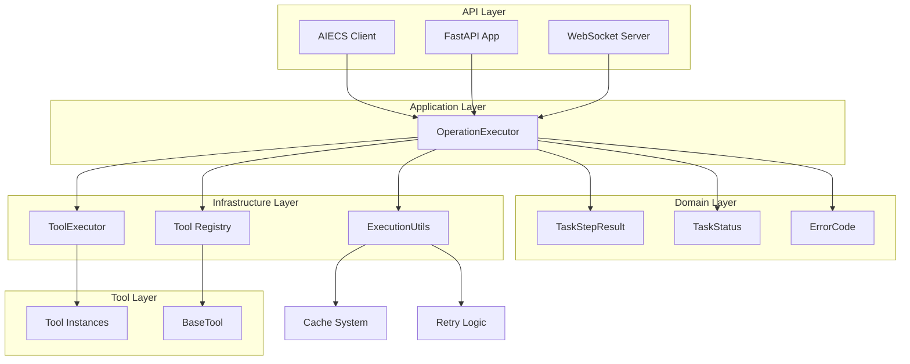
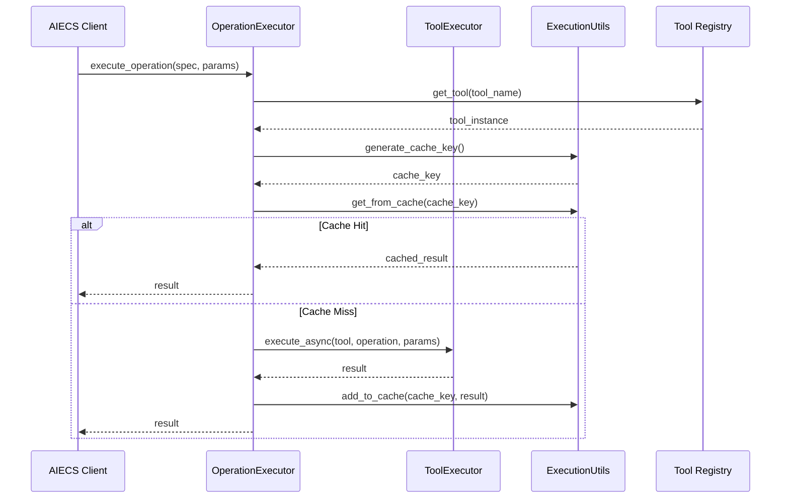
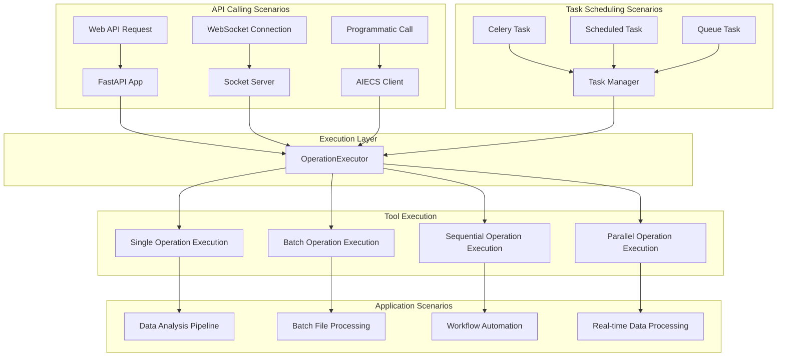
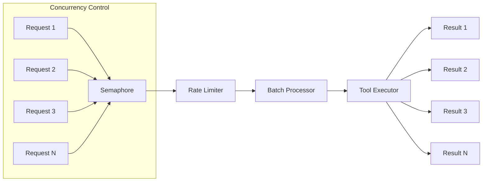

# OperationExecutor Component Technical Documentation

## Overview

### Design Motivation & Problem Background

When building AI-driven application systems, developers face the following core challenges:

**1. Tool Operation Fragmentation**
- Different tools (data processing, document analysis, image processing, etc.) have their own calling interfaces
- Lack of unified execution standards and error handling mechanisms
- Difficult to manage and orchestrate dependencies between tools

**2. Complex Business Process Orchestration Difficulties**
- Need to chain multiple tool operations into complex business pipelines
- Lack of standardized ways for parameter passing and referencing between operations
- Failure recovery and error handling strategies are inconsistent

**3. Performance and Resource Management Challenges**
- Large numbers of tool operations need concurrent execution to improve efficiency
- Lack of unified caching, rate limiting, and resource management mechanisms
- Long-running tasks lack progress tracking and state management

**4. High Development and Maintenance Costs**
- Each tool needs separate handling of async/sync execution
- Lack of unified monitoring, logging, and debugging mechanisms
- New tool integration requires repetitive writing of similar execution logic

**OperationExecutor's Solution**:
- **Unified Execution Interface**: Provides consistent calling methods for all tool operations
- **Intelligent Orchestration Capabilities**: Supports sequential, parallel, batch processing, and other execution modes
- **Parameter Reference System**: Implements data passing between operations through `$result[index]` syntax
- **Enterprise Features**: Built-in caching, rate limiting, retry, monitoring, and other production-essential features
- **Developer Friendly**: Simplifies tool integration, provides rich error information and debugging support

### Component Positioning

`OperationExecutor` is the core application component in the AIECS (AI Execute Services) system, responsible for unified management and execution of various tool operations. As an application-layer executor, it provides advanced operation orchestration, batch processing, concurrency control, and error handling capabilities.

## Component Type & Positioning

### Component Type
**Application Component** - Located in the Application Layer, belongs to the business logic layer

### Architecture Layers
```
┌─────────────────────────────────────────┐
│            API Layer                    │  ← Upstream callers
│  (FastAPI, WebSocket, AIECS Client)     │
└─────────────────┬───────────────────────┘
                  │
┌─────────────────▼───────────────────────┐
│         Application Layer               │  ← OperationExecutor layer
│     (OperationExecutor)                 │
└─────────────────┬───────────────────────┘
                  │
┌─────────────────▼───────────────────────┐
│          Domain Layer                   │
│  (TaskStepResult, TaskStatus, ErrorCode)│
└─────────────────┬───────────────────────┘
                  │
┌─────────────────▼───────────────────────┐
│       Infrastructure Layer              │  ← Downstream dependencies
│  (ToolExecutor, ExecutionUtils)         │
└─────────────────────────────────────────┘
```

## Upstream Components (Callers)

### 1. AIECS Client (`aiecs_client.py`)
- **Purpose**: Main entry point for programmatic use of AIECS services
- **Calling Method**: Initialize and use OperationExecutor in full mode
- **Dependency Relationship**: Direct dependency, obtains instance through dependency injection
- **Calling Scenarios**: 
  - Programmatic tool calls and batch processing
  - Data analysis and processing pipelines
  - Automation scripts and task orchestration

### 2. FastAPI Application (`main.py`)
- **Purpose**: Web API service, handles HTTP requests
- **Calling Method**: Indirectly called through task execution API
- **Dependency Relationship**: Indirect dependency, called through service layer
- **Calling Scenarios**:
  - RESTful API interface calls
  - Task submission and status queries
  - Tool list and metadata retrieval

### 3. WebSocket Service (`socket_server.py`)
- **Purpose**: Real-time communication, handles WebSocket connections
- **Calling Method**: Indirectly called through message processing
- **Dependency Relationship**: Indirect dependency, called through message routing
- **Calling Scenarios**:
  - Real-time task progress pushing
  - Client real-time interaction
  - Real-time task status updates

### 4. Celery Task Manager (`infrastructure/messaging/celery_task_manager.py`)
- **Purpose**: Distributed task scheduling and execution
- **Calling Method**: Indirectly called through task queue
- **Dependency Relationship**: Indirect dependency, called through task executor
- **Calling Scenarios**:
  - Asynchronous task execution
  - Distributed computing tasks
  - Long-running task processing

### 5. Task Executor (`tasks/worker.py`)
- **Purpose**: Specific task execution logic
- **Calling Method**: Indirectly called through Celery tasks
- **Dependency Relationship**: Indirect dependency, called through service instance
- **Calling Scenarios**:
  - Fast task execution (fast_tasks queue)
  - Heavy task execution (heavy_tasks queue)
  - Task status management and progress pushing

## Downstream Components (Dependencies)

### 1. ToolExecutor (`tools/tool_executor/tool_executor.py`)
- **Purpose**: Low-level tool execution engine
- **Functionality**: Provides sync/async tool execution, caching, retry, security validation
- **Dependency Type**: Direct dependency, injected through constructor

### 2. ExecutionUtils (`utils/execution_utils.py`)
- **Purpose**: Execution utility class, provides caching and retry mechanisms
- **Functionality**: Cache management, retry strategies, timeout control
- **Dependency Type**: Direct dependency, injected through constructor

### 3. Tool Registry (`tools/__init__.py`)
- **Purpose**: Tool discovery and instance management
- **Functionality**: Tool registration, obtaining tool instances
- **Dependency Type**: Direct dependency, called through `get_tool()` function

### 4. Domain Models (`domain/execution/model.py`)
- **Purpose**: Data model definitions
- **Functionality**: TaskStepResult, TaskStatus, ErrorCode, and other models
- **Dependency Type**: Direct dependency, used for result encapsulation

## Key Domain Models

### TaskStepResult
Represents the execution result of a single operation step, containing complete execution state and result information.

```python
@dataclass
class TaskStepResult:
    step: str                    # Operation step identifier (e.g., "pandas_tool.read_csv")
    result: Any                  # Operation execution result
    completed: bool              # Whether successfully completed
    message: str                 # Execution message description
    status: str                  # Status code (pending/running/completed/failed)
    error_code: Optional[str]    # Error code (e.g., "E003")
    error_message: Optional[str] # Detailed error information
    
    def dict(self) -> Dict[str, Any]:
        """Convert to dictionary format for serialization"""
        return {
            "step": self.step,
            "result": self.result,
            "completed": self.completed,
            "message": self.message,
            "status": self.status,
            "error_code": self.error_code,
            "error_message": self.error_message
        }
```

**Example Data**:
```json
{
    "step": "pandas_tool.read_csv",
    "result": {"rows": 1000, "columns": 5, "data": [...]},
    "completed": true,
    "message": "Successfully loaded CSV file",
    "status": "completed",
    "error_code": null,
    "error_message": null
}
```

### TaskStatus
Defines various states of task execution.

```python
class TaskStatus(Enum):
    PENDING = "pending"      # Waiting for execution
    RUNNING = "running"      # Executing
    COMPLETED = "completed"  # Execution completed
    CANCELLED = "cancelled"  # Cancelled
    TIMED_OUT = "timed_out"  # Execution timeout
    FAILED = "failed"        # Execution failed
```

### ErrorCode
Unified error code system for easy error classification and handling.

```python
class ErrorCode(Enum):
    VALIDATION_ERROR = "E001"    # Parameter validation error
    TIMEOUT_ERROR = "E002"       # Execution timeout
    EXECUTION_ERROR = "E003"     # Execution error
    CANCELLED_ERROR = "E004"     # Cancellation error
    RETRY_EXHAUSTED = "E005"     # Retry exhausted
    DATABASE_ERROR = "E006"      # Database error
    DSL_EVALUATION_ERROR = "E007" # DSL evaluation error
```

## Core Features

### 1. Single Operation Execution
```python
async def execute_operation(self, operation_spec: str, params: Dict[str, Any]) -> Any
```
- Execute a single tool operation
- Supports operation specifications in `tool_name.operation_name` format
- Automatically handles sync/async operations
- Parameter filtering and validation

#### Parameters Dictionary Contract

The key-value pairs of the `params` dictionary are defined by specific tool operations, each tool operation has its specific parameter requirements:

**Parameter Sources**:
- **Tool Definition**: Each tool class's method signature defines required parameters
- **Tool Documentation**: Obtain parameter information through `list_tools()` or tool metadata
- **Type Hints**: Tool methods use Python type hints to declare parameter types

**Parameter Passing Rules**:
```python
# Example: pandas_tool.read_csv operation
params = {
    "file_path": "data.csv",        # Required parameter
    "encoding": "utf-8",            # Optional parameter
    "delimiter": ",",               # Optional parameter
    "user_id": "user123",           # System parameter (will be filtered)
    "task_id": "task456"            # System parameter (will be filtered)
}

# System parameters will be automatically filtered, only tool-required parameters are passed
# Actual parameters passed to tool:
# {
#     "file_path": "data.csv",
#     "encoding": "utf-8", 
#     "delimiter": ","
# }
```

**How to Find Tool Parameters**:
1. Use `list_tools()` to get tool list and basic information
2. Check method signatures and docstrings in tool source code
3. Refer to [Tool Development Guide](../TOOLS/TOOLS_BASE_TOOL.md) for parameter definition specifications
4. Runtime errors will prompt missing parameter names

### 2. Batch Operation Execution
```python
async def batch_execute_operations(self, operations: List[Dict[str, Any]]) -> List[Any]
```
- Batch execute multiple operations
- Supports rate limiting and batch size control
- Concurrent execution improves performance

### 3. Sequential Operation Execution
```python
async def execute_operations_sequence(self, operations: List[Dict[str, Any]], 
                                    user_id: str, task_id: str,
                                    stop_on_failure: bool = False, 
                                    save_callback=None) -> List[TaskStepResult]
```
- Execute operation sequence in order
- Supports stopping execution on failure
- Supports step result save callback
- Parameter reference handling (e.g., `$result[0].data.field`)

### 4. Parallel Operation Execution
```python
async def execute_parallel_operations(self, operations: List[Dict[str, Any]]) -> List[TaskStepResult]
```
- Execute multiple operations in parallel
- Exception handling and result aggregation
- Suitable for operations without dependencies

### 5. Tool Call Batch Processing
```python
async def batch_tool_calls(self, tool_calls: List[Dict], tool_executor_func=None) -> List[Any]
```
- Batch execute tool calls
- Supports custom executor function
- Rate limiting and cache support

## Technical Features

### 1. Parameter Processing
- **System Parameter Filtering**: Automatically filters system parameters like `user_id`, `task_id`
- **Parameter Reference Parsing**: Supports parameter references in `$result[index]` format
- **Nested Attribute Access**: Supports attribute access in `$result[0].data.field` format

### 2. Caching Mechanism
- **Context-Aware Caching**: Cache keys based on user ID, task ID, and parameters
- **TTL Support**: Configurable cache time-to-live
- **Cache Invalidation**: Automatically handles expired cache

### 3. Concurrency Control
- **Semaphore Limiting**: Uses `asyncio.Semaphore` to control concurrency
- **Rate Limiting**: Configurable requests per second limit
- **Batch Size**: Configurable batch processing size

### 4. Error Handling
- **Exception Catching**: Comprehensive exception catching and handling
- **Error Code Mapping**: Unified error code system
- **Failure Recovery**: Supports stopping or continuing execution on failure

### 5. Tool Management
- **Lazy Loading**: Tool instances created on demand
- **Instance Caching**: Caches created tool instances
- **Tool Discovery**: Supports dynamic tool discovery and registration

## API Interface

### Constructor
```python
def __init__(self, tool_executor: ToolExecutor, execution_utils: ExecutionUtils, config: Dict[str, Any])
```

**Parameters**:
- `tool_executor`: Tool executor instance
- `execution_utils`: Execution utility class instance
- `config`: Configuration dictionary

**Configuration Options**:
- `rate_limit_requests_per_second`: Requests per second limit (default: 5)
- `batch_size`: Batch processing size (default: 10)
- `enable_cache`: Enable cache (default: True)

### Main Methods

#### 1. execute_operation
```python
async def execute_operation(self, operation_spec: str, params: Dict[str, Any]) -> Any
```
Execute a single operation

#### 2. batch_execute_operations
```python
async def batch_execute_operations(self, operations: List[Dict[str, Any]]) -> List[Any]
```
Batch execute operations

#### 3. execute_operations_sequence
```python
async def execute_operations_sequence(self, operations: List[Dict[str, Any]], 
                                    user_id: str, task_id: str,
                                    stop_on_failure: bool = False, 
                                    save_callback=None) -> List[TaskStepResult]
```
Sequentially execute operation sequence

#### 4. execute_parallel_operations
```python
async def execute_parallel_operations(self, operations: List[Dict[str, Any]]) -> List[TaskStepResult]
```
Execute operations in parallel

#### 5. batch_tool_calls
```python
async def batch_tool_calls(self, tool_calls: List[Dict], tool_executor_func=None) -> List[Any]
```
Batch tool calls

### Utility Methods

#### 1. get_tool_instance
```python
def get_tool_instance(self, tool_name: str)
```
Get tool instance

#### 2. clear_tool_cache
```python
def clear_tool_cache(self)
```
Clear tool cache

#### 3. get_stats
```python
def get_stats(self) -> Dict[str, Any]
```
Get executor statistics

## Configuration Management

### Default Configuration
```python
{
    "rate_limit_requests_per_second": 5,
    "batch_size": 10,
    "enable_cache": True
}
```

### Environment Variable Support
Through `ExecutionUtils` and `ToolExecutor` support environment variable configuration:
- `TOOL_EXECUTOR_CACHE_SIZE`: Cache size
- `TOOL_EXECUTOR_CACHE_TTL`: Cache TTL
- `TOOL_EXECUTOR_MAX_WORKERS`: Maximum worker threads

## Error Handling

### Exception Types & Examples

#### 1. ValueError - Parameter Validation Error
**Trigger Condition**: Operation specification format error or parameter validation failure

```python
# Example 1: Operation specification format error
try:
    result = await executor.execute_operation("invalid_format", {})
except ValueError as e:
    print(f"ValueError: {e}")
    # Output: "Invalid operation spec: invalid_format, expected 'tool_name.operation_name'"

# Example 2: Operation specification contains extra parts
try:
    result = await executor.execute_operation("tool.op.extra", {})
except ValueError as e:
    print(f"ValueError: {e}")
    # Output: "Invalid operation spec: tool.op.extra, expected 'tool_name.operation_name'"

# Example 3: Parameter reference index out of range
operations = [{"operation": "pandas_tool.read_csv", "params": {"file_path": "data.csv"}}]
try:
    result = await executor.execute_operations_sequence(
        [{"operation": "pandas_tool.describe", "params": {"df": "$result[5]"}}],  # Index 5 doesn't exist
        "user123", "task456"
    )
except ValueError as e:
    print(f"ValueError: {e}")
    # Output: "Referenced result index 5 out of range"
```

#### 2. AttributeError - Tool or Operation Not Found
**Trigger Condition**: Tool not registered or operation doesn't exist

```python
# Example 1: Tool doesn't exist
try:
    result = await executor.execute_operation("nonexistent_tool.read_data", {})
except AttributeError as e:
    print(f"AttributeError: {e}")
    # Output: "Tool 'nonexistent_tool' is not registered"

# Example 2: Tool exists but operation doesn't exist
try:
    result = await executor.execute_operation("pandas_tool.nonexistent_method", {})
except AttributeError as e:
    print(f"AttributeError: {e}")
    # Output: "Operation 'nonexistent_method' not found in tool 'pandas_tool'"
```

#### 3. Exception - General Execution Error
**Trigger Condition**: Various errors during tool execution

```python
# Example 1: File doesn't exist
try:
    result = await executor.execute_operation(
        "pandas_tool.read_csv", 
        {"file_path": "nonexistent_file.csv"}
    )
except Exception as e:
    print(f"Execution Error: {e}")
    # Output: "Error executing read_csv: [Errno 2] No such file or directory: 'nonexistent_file.csv'"

# Example 2: Parameter type error
try:
    result = await executor.execute_operation(
        "pandas_tool.read_csv", 
        {"file_path": 123}  # Should be string
    )
except Exception as e:
    print(f"Execution Error: {e}")
    # Output: "Error executing read_csv: expected str, bytes or os.PathLike object, not int"
```

### Error Code Mapping

| Error Type | Error Code | Description | Example Scenario |
|---------|--------|------|----------|
| ValueError | E001 | Parameter validation error | Operation spec format error, invalid parameter reference |
| TimeoutError | E002 | Execution timeout | Operation execution time exceeds limit |
| Exception | E003 | Execution error | Various exceptions during tool execution |
| CancelledError | E004 | Cancellation error | Task actively cancelled |
| RetryExhausted | E005 | Retry exhausted | Retry attempts exhausted but still failed |
| DatabaseError | E006 | Database error | Database operation failed |
| DSLEvaluationError | E007 | DSL evaluation error | Parameter reference parsing failed |

### Error Recovery Strategies

#### 1. Single Operation Error Handling
```python
# Single operation fails, returns error result but doesn't affect other operations
try:
    result = await executor.execute_operation("risky_operation", params)
    print(f"Success: {result}")
except Exception as e:
    print(f"Operation failed: {e}")
    # Can continue executing other operations
```

#### 2. Sequence Operation Error Handling
```python
# Configure to stop execution on failure
results = await executor.execute_operations_sequence(
    operations, 
    user_id, 
    task_id,
    stop_on_failure=True  # Stop immediately on error
)

# Check results
for i, result in enumerate(results):
    if not result.completed:
        print(f"Step {i} failed: {result.error_message}")
        break  # Due to stop_on_failure=True, subsequent steps won't execute
```

#### 3. Parallel Operation Error Handling
```python
# Single failure in parallel operations doesn't affect other operations
results = await executor.execute_parallel_operations(operations)

# Check each result
for i, result in enumerate(results):
    if result.completed:
        print(f"Operation {i} succeeded: {result.result}")
    else:
        print(f"Operation {i} failed: {result.error_message}")
```

### Error Monitoring and Debugging

```python
# Get executor statistics, including error statistics
stats = executor.get_stats()
print(f"Total operations: {stats.get('total_operations', 0)}")
print(f"Failed operations: {stats.get('failed_operations', 0)}")
print(f"Success rate: {stats.get('success_rate', 0):.2%}")

# Detailed error logging
import logging
logging.basicConfig(level=logging.DEBUG)
# Error information will be logged with complete stack traces
```

## Performance Optimization

### 1. Caching Strategy
- LRU cache algorithm
- Context-aware cache keys
- Configurable TTL

### 2. Concurrency Control
- Semaphore limiting concurrency
- Batch processing reduces overhead
- Async execution improves throughput

### 3. Resource Management
- Tool instance reuse
- Memory usage optimization
- Connection pool management

## Monitoring & Logging

### Logging
- Operation execution logs
- Error and exception logs
- Performance metrics logs

### Statistics
```python
{
    "cached_tools": 5,
    "tool_names": ["chart_tool", "pandas_tool", ...],
    "semaphore_value": 3,
    "config": {
        "batch_size": 10,
        "rate_limit": 5,
        "enable_cache": True
    }
}
```

## Maintenance Guide

### 1. Daily Maintenance
- **Monitor Cache Hit Rate**: Monitor cache performance through `get_stats()`
- **Check Tool Registration**: Ensure required tools are properly registered
- **Performance Tuning**: Adjust batch size and rate limits based on load

### 2. Troubleshooting
- **Tool Execution Failure**: Check tool registration and parameter passing
- **Cache Issues**: Check cache configuration and TTL settings
- **Concurrency Issues**: Check semaphore configuration and resource limits

### 3. Extension Development
- **Add New Operation Types**: Extend `execute_operation` method
- **Custom Tool Executor**: Through `tool_executor_func` parameter
- **New Batch Processing Strategies**: Extend batch processing methods

### 4. Configuration Tuning
```python
# High concurrency configuration
config = {
    "rate_limit_requests_per_second": 20,
    "batch_size": 50,
    "enable_cache": True
}

# Low latency configuration
config = {
    "rate_limit_requests_per_second": 1,
    "batch_size": 1,
    "enable_cache": False
}
```

## Dependency Diagram

### Component Architecture Diagram


### Data Flow Diagram


### Calling Scenario Flow Diagram


### Concurrency Control Diagram


## Software Function Scenarios

### 1. Data Analysis & Processing Pipeline
**Scenario Description**: Build complete data analysis pipeline through OperationExecutor
**Applicable Scenarios**: Data science, business intelligence, report generation
**Implementation**:
```python
# Data reading → Cleaning → Analysis → Visualization → Report generation
operations = [
    {"operation": "pandas_tool.read_csv", "params": {"file_path": "sales_data.csv"}},
    {"operation": "pandas_tool.clean_data", "params": {"df": "$result[0]", "drop_na": True}},
    {"operation": "pandas_tool.analyze_sales", "params": {"df": "$result[1]"}},
    {"operation": "chart_tool.create_dashboard", "params": {"data": "$result[2]"}},
    {"operation": "report_tool.generate_pdf", "params": {"charts": "$result[3]"}}
]
results = await executor.execute_operations_sequence(operations, user_id, task_id)
```

### 2. Document Processing & Content Extraction
**Scenario Description**: Batch process various format documents, extract key information
**Applicable Scenarios**: Document management, content analysis, information extraction
**Implementation**:
```python
# Document reading → OCR recognition → Content analysis → Keyword extraction → Classification
operations = [
    {"operation": "office_tool.read_document", "params": {"file_path": "document.pdf"}},
    {"operation": "image_tool.ocr_text", "params": {"image": "$result[0].images"}},
    {"operation": "classfire_tool.extract_keywords", "params": {"text": "$result[1]"}},
    {"operation": "classfire_tool.classify_text", "params": {"text": "$result[1]"}}
]
results = await executor.batch_execute_operations(operations)
```

### 3. Real-time Data Processing & Monitoring
**Scenario Description**: Real-time processing of streaming data, monitoring and alerting
**Applicable Scenarios**: System monitoring, real-time analysis, anomaly detection
**Implementation**:
```python
# Data collection → Real-time analysis → Anomaly detection → Alert pushing
operations = [
    {"operation": "scraper_tool.collect_metrics", "params": {"endpoint": "api/metrics"}},
    {"operation": "stats_tool.calculate_trends", "params": {"data": "$result[0]"}},
    {"operation": "stats_tool.detect_anomalies", "params": {"data": "$result[1]"}},
    {"operation": "search_api.send_alert", "params": {"anomalies": "$result[2]"}}
]
# Use parallel execution to improve real-time performance
results = await executor.execute_parallel_operations(operations)
```

### 4. Intelligent Content Generation & Optimization
**Scenario Description**: AI-based content generation, optimization, and personalized recommendations
**Applicable Scenarios**: Content creation, marketing automation, personalized recommendations
**Implementation**:
```python
# Content analysis → Generate suggestions → Optimize content → Personalized recommendations
operations = [
    {"operation": "research_tool.analyze_topic", "params": {"topic": "AI trends"}},
    {"operation": "research_tool.generate_outline", "params": {"analysis": "$result[0]"}},
    {"operation": "classfire_tool.optimize_content", "params": {"content": "$result[1]"}},
    {"operation": "search_api.personalize_recommendation", "params": {"content": "$result[2]"}}
]
results = await executor.execute_operations_sequence(operations, user_id, task_id)
```

### 5. Batch File Processing & Conversion
**Scenario Description**: Batch process large numbers of files, format conversion and content extraction
**Applicable Scenarios**: File management, format conversion, batch processing
**Implementation**:
```python
# File discovery → Batch conversion → Content extraction → Result aggregation
file_operations = [
    {"operation": "office_tool.convert_to_pdf", "params": {"file_path": f"doc_{i}.docx"}} 
    for i in range(100)
]
results = await executor.batch_execute_operations(file_operations)
```

### 6. Multimodal Data Processing
**Scenario Description**: Process text, image, audio, and other multimodal data
**Applicable Scenarios**: Multimedia analysis, content understanding, cross-modal search
**Implementation**:
```python
# Parallel processing of multimodal data
operations = [
    {"operation": "image_tool.analyze_image", "params": {"image_path": "photo.jpg"}},
    {"operation": "classfire_tool.analyze_text", "params": {"text": "description.txt"}},
    {"operation": "research_tool.search_related", "params": {"query": "AI applications"}}
]
results = await executor.execute_parallel_operations(operations)
```

### 7. Workflow Automation & Orchestration
**Scenario Description**: Automate complex workflows, reduce manual intervention
**Applicable Scenarios**: Business process automation, task orchestration, workflow management
**Implementation**:
```python
# Conditional branching → Parallel processing → Result merging → Subsequent processing
operations = [
    {"operation": "pandas_tool.check_data_quality", "params": {"df": "input_data"}},
    # Decide subsequent processing based on data quality
    {"operation": "pandas_tool.clean_data", "params": {"df": "$result[0]", "if_quality_low": True}},
    {"operation": "stats_tool.generate_report", "params": {"df": "$result[1]"}}
]
results = await executor.execute_operations_sequence(
    operations, user_id, task_id, stop_on_failure=True
)
```

### 8. Real-time Collaboration & Sharing
**Scenario Description**: Support multi-user real-time collaboration and resource sharing
**Applicable Scenarios**: Team collaboration, shared workspace, real-time editing
**Implementation**:
```python
# Push processing progress in real-time through WebSocket
async def process_with_progress(operations, user_id, task_id):
    def progress_callback(step, result):
        # Push progress to client in real-time
        asyncio.create_task(push_progress(user_id, {
            "step": step,
            "result": result,
            "status": "processing"
        }))
    
    return await executor.execute_operations_sequence(
        operations, user_id, task_id, save_callback=progress_callback
    )
```

## Real-world Use Cases

### Case 1: E-commerce Data Analysis Platform
**Business Background**: An e-commerce company needs real-time analysis of sales data, generate daily reports
**Technical Implementation**:
```python
# Daily sales data analysis pipeline
daily_analysis_operations = [
    # 1. Data collection
    {"operation": "pandas_tool.read_csv", "params": {"file_path": f"sales_{date}.csv"}},
    {"operation": "scraper_tool.collect_external_data", "params": {"api_endpoint": "market_api"}},
    
    # 2. Data cleaning and preprocessing
    {"operation": "pandas_tool.clean_data", "params": {"df": "$result[0]", "remove_duplicates": True}},
    {"operation": "pandas_tool.merge_data", "params": {"df1": "$result[2]", "df2": "$result[1]"}},
    
    # 3. Data analysis
    {"operation": "stats_tool.calculate_metrics", "params": {"df": "$result[3]"}},
    {"operation": "pandas_tool.group_analysis", "params": {"df": "$result[3]", "group_by": "category"}},
    
    # 4. Visualization generation
    {"operation": "chart_tool.create_sales_chart", "params": {"data": "$result[4]"}},
    {"operation": "chart_tool.create_trend_analysis", "params": {"data": "$result[5]"}},
    
    # 5. Report generation
    {"operation": "report_tool.generate_daily_report", "params": {
        "charts": ["$result[6]", "$result[7]"],
        "metrics": "$result[4]",
        "template": "daily_sales_template"
    }}
]

# Use sequential execution to ensure data dependencies
results = await executor.execute_operations_sequence(
    daily_analysis_operations, 
    user_id="analyst_001", 
    task_id=f"daily_analysis_{date}",
    stop_on_failure=True
)
```

### Case 2: Intelligent Document Processing System
**Business Background**: Law firm needs batch processing of contract documents, extract key clauses
**Technical Implementation**:
```python
# Contract document intelligent analysis
contract_analysis_operations = [
    # 1. Document reading and OCR
    {"operation": "office_tool.read_document", "params": {"file_path": "contract.pdf"}},
    {"operation": "image_tool.ocr_text", "params": {"image": "$result[0].scanned_pages"}},
    
    # 2. Text analysis and key information extraction
    {"operation": "classfire_tool.extract_entities", "params": {"text": "$result[1]"}},
    {"operation": "classfire_tool.find_contract_terms", "params": {"text": "$result[1]"}},
    {"operation": "research_tool.search_legal_precedents", "params": {"terms": "$result[3]"}},
    
    # 3. Risk assessment and classification
    {"operation": "classfire_tool.assess_risk_level", "params": {
        "entities": "$result[2]",
        "terms": "$result[3]",
        "precedents": "$result[4]"
    }},
    {"operation": "classfire_tool.classify_contract_type", "params": {"text": "$result[1]"}},
    
    # 4. Generate analysis report
    {"operation": "report_tool.generate_legal_analysis", "params": {
        "contract_text": "$result[1]",
        "entities": "$result[2]",
        "terms": "$result[3]",
        "risk_assessment": "$result[5]",
        "contract_type": "$result[6]"
    }}
]

# Use batch processing for multiple contracts
contract_files = ["contract_001.pdf", "contract_002.pdf", "contract_003.pdf"]
all_results = []

for contract_file in contract_files:
    # Create independent task for each contract
    contract_ops = [
        {**op, "params": {**op["params"], "file_path": contract_file}}
        for op in contract_analysis_operations
    ]
    
    result = await executor.execute_operations_sequence(
        contract_ops,
        user_id="lawyer_001",
        task_id=f"contract_analysis_{contract_file}",
        stop_on_failure=False  # Single contract failure doesn't affect others
    )
    all_results.append(result)
```

### Case 3: Real-time Monitoring & Alerting System
**Business Background**: Cloud service provider needs real-time monitoring of system performance, timely problem detection
**Technical Implementation**:
```python
# Real-time monitoring and alerting processing
async def monitor_system_health():
    while True:
        # Parallel collection of various monitoring data
        monitoring_operations = [
            {"operation": "scraper_tool.collect_cpu_metrics", "params": {"endpoint": "metrics_api"}},
            {"operation": "scraper_tool.collect_memory_metrics", "params": {"endpoint": "metrics_api"}},
            {"operation": "scraper_tool.collect_network_metrics", "params": {"endpoint": "metrics_api"}},
            {"operation": "scraper_tool.collect_disk_metrics", "params": {"endpoint": "metrics_api"}}
        ]
        
        # Parallel execution of monitoring data collection
        metrics_results = await executor.execute_parallel_operations(monitoring_operations)
        
        # Analyze monitoring data
        analysis_operations = [
            {"operation": "stats_tool.analyze_cpu_trends", "params": {"data": "$result[0]"}},
            {"operation": "stats_tool.analyze_memory_usage", "params": {"data": "$result[1]"}},
            {"operation": "stats_tool.detect_anomalies", "params": {"data": "$result[2]"}},
            {"operation": "stats_tool.predict_failures", "params": {"data": "$result[3]"}}
        ]
        
        analysis_results = await executor.execute_parallel_operations(analysis_operations)
        
        # Check if alerting is needed
        alert_operations = [
            {"operation": "search_api.check_alert_conditions", "params": {"analysis": analysis_results}},
            {"operation": "search_api.send_notifications", "params": {"alerts": "$result[0]"}},
            {"operation": "search_api.update_dashboard", "params": {"metrics": metrics_results}}
        ]
        
        await executor.execute_operations_sequence(
            alert_operations,
            user_id="system_monitor",
            task_id=f"monitoring_{int(time.time())}"
        )
        
        # Wait for next monitoring cycle
        await asyncio.sleep(60)  # Monitor every minute
```

## Usage Examples

### Basic Usage
```python
from aiecs.application.executors.operation_executor import OperationExecutor
from aiecs.tools.tool_executor import ToolExecutor
from aiecs.utils.execution_utils import ExecutionUtils

# Initialize
tool_executor = ToolExecutor()
execution_utils = ExecutionUtils()
config = {"rate_limit_requests_per_second": 10}

executor = OperationExecutor(tool_executor, execution_utils, config)

# Execute single operation
result = await executor.execute_operation(
    "pandas_tool.read_csv", 
    {"file_path": "data.csv"}
)

# Batch execution
operations = [
    {"operation": "pandas_tool.read_csv", "params": {"file_path": "data1.csv"}},
    {"operation": "pandas_tool.read_csv", "params": {"file_path": "data2.csv"}}
]
results = await executor.batch_execute_operations(operations)
```

### Advanced Usage
```python
# Sequential execution with parameter references
operations = [
    {"operation": "pandas_tool.read_csv", "params": {"file_path": "data.csv"}},
    {"operation": "pandas_tool.describe", "params": {"df": "$result[0]"}}
]
results = await executor.execute_operations_sequence(
    operations, 
    user_id="user123", 
    task_id="task456",
    stop_on_failure=True
)
```

## Version History

- **v1.0.0**: Initial version, basic operation execution functionality
- **v1.1.0**: Added batch processing and concurrency control
- **v1.2.0**: Added parameter references and cache support
- **v1.3.0**: Added tool management and statistics functionality

## Related Documentation

- [AIECS Project Overview](../PROJECT_SUMMARY.md)
- [Tool Development Guide](../TOOLS/TOOLS_BASE_TOOL.md)
- [API Usage Guide](../USAGE_GUIDE.md)
- [Configuration Management Guide](../CONFIG/CONFIG_MANAGEMENT.md)
