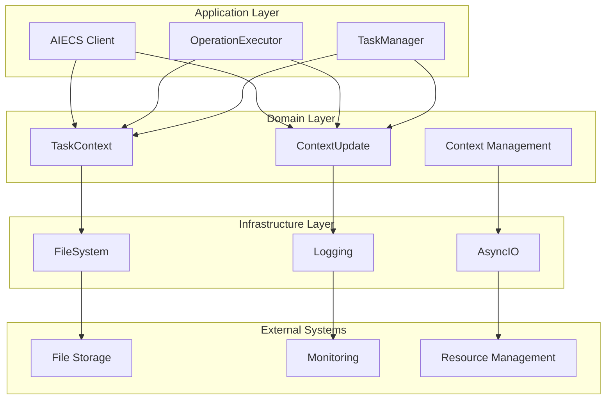
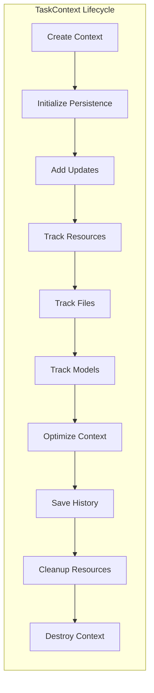
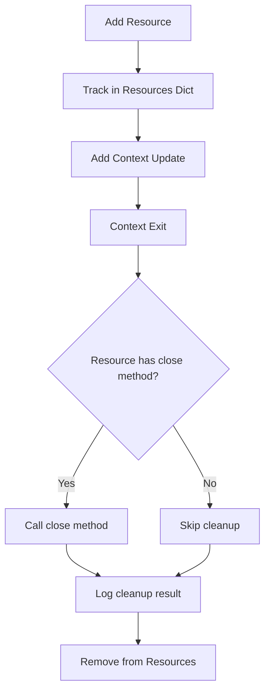
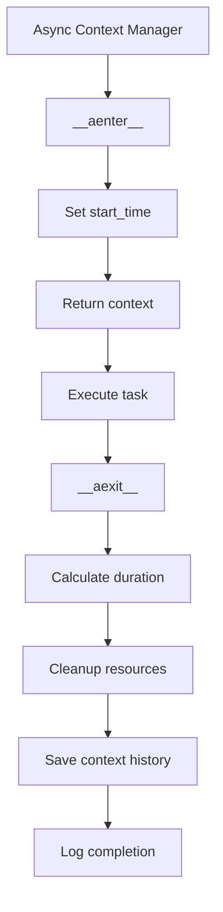

# Task Context Technical Documentation

## 1. Overview

### Core Functionality and Value

`domain/task/task_context.py` is a core domain service component of the AIECS system, implementing the enhanced task context manager **TaskContext** and context update model **ContextUpdate**. These components provide comprehensive task execution context management, resource tracking, performance monitoring, and persistent storage capabilities for the entire AI application system.

**Core Value**:
- **Enhanced Context Management**: Provides complete task execution context lifecycle management, including history tracking, resource management, and performance monitoring
- **Resource Tracking and Cleanup**: Automatically tracks file operations, model usage, and resource allocation, ensuring proper resource release
- **Persistent Storage**: Supports persistent storage and recovery of context history, ensuring task state continuity
- **Async Support**: Provides both synchronous and asynchronous context management modes, adapting to different use cases
- **Performance Optimization**: Built-in context optimization mechanisms, supporting deduplication and size limits, ensuring system performance

**Problems Solved**:
- Lack of complete context state management during task execution
- Lack of automation mechanisms for resource allocation and cleanup
- Lack of persistent storage and recovery capabilities for task history
- Lack of performance monitoring and optimization mechanisms for long-running tasks
- Lack of unified context management interface for asynchronous task execution

## 2. Problem Background and Design Motivation

### Problem Background

When building complex AI application systems, task execution context management faces the following core challenges:

**1. Context State Management Complexity**
- Task execution requires maintaining large amounts of state information (user ID, chat ID, metadata, etc.)
- Different task steps need to share context state and historical information
- Lack of unified context lifecycle management mechanism

**2. Resource Management Difficulties**
- Task execution creates and allocates various resources (files, models, connections, etc.)
- Resource cleanup lacks automation mechanisms, easily leading to resource leaks
- Lack of unified resource tracking and management interface

**3. Persistent Storage Requirements**
- Long-running tasks require persistent storage of context state
- System needs to recover task context state after restart
- Lack of efficient context serialization and deserialization mechanisms

**4. Performance Monitoring and Optimization**
- Task execution performance lacks monitoring and statistics mechanisms
- Context history growth may lead to excessive memory usage
- Lack of context optimization and cleanup mechanisms

**5. Async Execution Support**
- Modern AI applications extensively use asynchronous programming patterns
- Lack of support for asynchronous context managers
- Synchronous and asynchronous modes lack unified interface

### Design Motivation

**Task Context System Solution**:
- **Enhanced Context Manager**: Provides complete context lifecycle management through TaskContext
- **Automatic Resource Management**: Ensures proper resource release through resource tracking and automatic cleanup mechanisms
- **Persistent Storage**: Implements persistent storage of context history through file system storage
- **Performance Optimization**: Optimizes context performance through deduplication and size limit mechanisms
- **Async Support**: Supports modern asynchronous programming patterns through asynchronous context managers

## 3. Architecture Positioning and Context

### Component Type
**Domain Service Component** - Located in the Domain Layer, belongs to the business logic layer

### Architecture Layers
```
┌─────────────────────────────────────────┐
│         Application Layer               │  ← Components using task context
│  (AIECS Client, OperationExecutor)      │
└─────────────────┬───────────────────────┘
                  │
┌─────────────────▼───────────────────────┐
│         Domain Layer                    │  ← Task context layer
│  (TaskContext, ContextUpdate, Logic)    │
└─────────────────┬───────────────────────┘
                  │
┌─────────────────▼───────────────────────┐
│       Infrastructure Layer              │  ← Components task context depends on
│  (FileSystem, Logging, AsyncIO)         │
└─────────────────┬───────────────────────┘
                  │
┌─────────────────▼───────────────────────┐
│         External Systems                │  ← External systems
│  (FileSystem, Database, Monitoring)     │
└─────────────────────────────────────────┘
```

### Upstream Components (Consumers)

#### 1. Application Layer Services
- **AIECS Client** (`aiecs_client.py`) - Main client interface
- **OperationExecutor** (`application/executors/operation_executor.py`) - Operation executor
- **TaskManager** (if exists) - Task manager

#### 2. Domain Services
- **DSLProcessor** (`domain/task/dsl_processor.py`) - DSL processor
- **ContextEngine** (`domain/context/content_engine.py`) - Content engine
- **Other task-related services** - Task execution related services

#### 3. Infrastructure Layer
- **Storage Systems** - Store task context through serialization interface
- **API Layer** - Through data conversion interface
- **Message Queue** - Through message format

### Downstream Components (Dependencies)

#### 1. Python Standard Library
- **time** - Provides timestamp support
- **json** - Provides JSON serialization support
- **os** - Provides file system operations
- **pathlib** - Provides path operations
- **asyncio** - Provides asynchronous programming support
- **contextlib** - Provides context manager support
- **dataclasses** - Provides dataclass support
- **typing** - Provides type annotation support

#### 2. Domain Models
- **ContextUpdate** - Context update model
- **Other domain models** - Associated through metadata fields

#### 3. Utility Functions
- **build_context** - Backward-compatible context building function
- **task_context** - Asynchronous context manager

## 4. Core Features and Use Cases

### 4.1 TaskContext - Enhanced Task Context Management

#### Core Functionality

**1. Basic Context Information Management**
```python
class TaskContext:
    """Enhanced task context manager"""
    def __init__(self, data: dict, task_dir: str = "./tasks"):
        self.user_id = data.get("user_id", "anonymous")
        self.chat_id = data.get("chat_id", "none")
        self.metadata = data.get("metadata", {})
        self.task_dir = Path(task_dir)
        self.start_time: Optional[float] = None
        self.resources: Dict[str, Any] = {}
        self.context_history: List[ContextUpdate] = []
        self.file_tracker: Dict[str, Dict[str, Any]] = {}
        self.model_tracker: List[Dict[str, Any]] = []
        self.metadata_toggles: Dict[str, bool] = data.get("metadata_toggles", {})
```

**2. Context History Tracking**
```python
def add_context_update(self, update_type: str, data: Any, metadata: Dict[str, Any] = None):
    """Add context update"""
    update = ContextUpdate(
        timestamp=time.time(),
        update_type=update_type,
        data=data,
        metadata=metadata or {}
    )
    self.context_history.append(update)
```

**3. Resource Management**
```python
def add_resource(self, name: str, resource: Any) -> None:
    """Add resource that needs cleanup"""
    self.resources[name] = resource
    self.add_context_update("resource", {"name": name}, {"type": type(resource).__name__})
```

**4. File Operation Tracking**
```python
def track_file_operation(self, file_path: str, operation: str, source: str = "task"):
    """Track file operation"""
    self.file_tracker[file_path] = {
        "operation": operation,
        "source": source,
        "timestamp": time.time(),
        "state": "active"
    }
```

**5. Model Usage Tracking**
```python
def track_model_usage(self, model_id: str, provider_id: str, mode: str):
    """Track AI model usage"""
    model_entry = {
        "model_id": model_id,
        "provider_id": provider_id,
        "mode": mode,
        "timestamp": time.time()
    }
    if not self.model_tracker or self.model_tracker[-1] != model_entry:
        self.model_tracker.append(model_entry)
        self.add_context_update("model_usage", model_entry)
```

**6. Context Optimization**
```python
def optimize_context(self, max_size: int = 1000) -> bool:
    """Optimize context, remove duplicates and old entries"""
    deduplicated = {}
    optimized_history = []
    total_size = 0

    for update in reversed(self.context_history):
        key = f"{update.update_type}:{json.dumps(update.data, sort_keys=True)}"
        if key not in deduplicated:
            deduplicated[key] = update
            data_size = len(str(update.data))
            if total_size + data_size <= max_size:
                optimized_history.append(update)
                total_size += data_size

    self.context_history = list(reversed(optimized_history))
    return len(deduplicated) < len(self.context_history)
```

### 4.2 ContextUpdate - Context Update Model

#### Core Functionality

**1. Structured Update Records**
```python
@dataclass
class ContextUpdate:
    """Represents a single update to the context"""
    timestamp: float
    update_type: str  # e.g.: "message", "metadata", "resource"
    data: Any  # Update content
    metadata: Dict[str, Any]  # Additional metadata
```

**2. Typed Update Support**
- **message**: Message update
- **metadata**: Metadata update
- **resource**: Resource update
- **file_operation**: File operation update
- **model_usage**: Model usage update

### 4.3 Software Functionality Scenarios

**Scenario 1: Intelligent Document Processing Task**
```python
# Create document processing task context
doc_context = TaskContext(
    data={
        "user_id": "doc_processor_001",
        "chat_id": "doc_session_abc123",
        "metadata": {
            "document_type": "pdf",
            "language": "zh-CN",
            "processing_mode": "batch"
        }
    },
    task_dir="/var/lib/aiecs/tasks"
)

# Track document processing process
doc_context.add_context_update("message", "Starting document processing", {"source": "system"})
doc_context.track_file_operation("input.pdf", "read", "user")
doc_context.track_model_usage("gpt-4", "openai", "text_extraction")

# Add processing resources
with open("input.pdf", "rb") as f:
    doc_context.add_resource("pdf_file", f)
    # Process document...

# Optimize context
doc_context.optimize_context(max_size=2000)
```

**Scenario 2: Data Science Workflow**
```python
# Create data science task context
ds_context = TaskContext(
    data={
        "user_id": "data_scientist_001",
        "chat_id": "ml_pipeline_session",
        "metadata": {
            "project": "customer_segmentation",
            "algorithm": "kmeans",
            "dataset_size": "large"
        }
    }
)

# Track machine learning process
ds_context.add_context_update("message", "Starting data preprocessing", {"step": "preprocessing"})
ds_context.track_file_operation("customer_data.csv", "read", "pandas")
ds_context.track_model_usage("sklearn", "scikit-learn", "clustering")

# Track model training
ds_context.add_context_update("message", "Starting model training", {"step": "training"})
ds_context.track_model_usage("kmeans", "sklearn", "clustering")

# Save context history
await ds_context._save_context_history()
```

**Scenario 3: Real-time Chatbot**
```python
# Create chatbot task context
chat_context = TaskContext(
    data={
        "user_id": "user_456",
        "chat_id": "chat_session_xyz789",
        "metadata": {
            "bot_type": "customer_service",
            "language": "en",
            "model": "gpt-4"
        }
    }
)

# Track conversation process
chat_context.add_context_update("message", "User input: Hello", {"source": "user"})
chat_context.track_model_usage("gpt-4", "openai", "chat_completion")
chat_context.add_context_update("message", "AI reply: Hi! How can I help you?", {"source": "ai"})

# Track file operations
chat_context.track_file_operation("conversation_log.json", "write", "logging")

# Async context management
async with task_context(chat_data, task_dir="./chat_tasks") as context:
    # Handle chat logic...
    pass
```

### 4.4 Real-world Use Cases

**Case 1: Multi-step Data Analysis Pipeline**
```python
async def data_analysis_pipeline():
    """Data analysis pipeline example"""
    # Create analysis context
    context = TaskContext(
        data={
            "user_id": "analyst_001",
            "chat_id": "analysis_session_001",
            "metadata": {
                "pipeline_type": "sales_analysis",
                "data_source": "database",
                "output_format": "excel"
            }
        },
        task_dir="./analysis_tasks"
    )
    
    try:
        # Step 1: Data loading
        context.add_context_update("message", "Starting data loading", {"step": "data_loading"})
        context.track_file_operation("sales_data.csv", "read", "pandas")
        
        # Step 2: Data cleaning
        context.add_context_update("message", "Starting data cleaning", {"step": "data_cleaning"})
        context.track_model_usage("pandas", "python", "data_processing")
        
        # Step 3: Data analysis
        context.add_context_update("message", "Starting data analysis", {"step": "analysis"})
        context.track_model_usage("numpy", "python", "statistical_analysis")
        
        # Step 4: Result output
        context.add_context_update("message", "Generating analysis report", {"step": "reporting"})
        context.track_file_operation("analysis_report.xlsx", "write", "openpyxl")
        
        # Optimize context
        context.optimize_context(max_size=1500)
        
        return context.to_dict()
        
    except Exception as e:
        context.add_context_update("error", str(e), {"step": "pipeline_error"})
        raise
    finally:
        # Cleanup resources
        for resource_name, resource in context.resources.items():
            if hasattr(resource, 'close'):
                resource.close()
```

**Case 2: Real-time Monitoring System**
```python
async def real_time_monitoring():
    """Real-time monitoring system example"""
    # Create monitoring context
    context = TaskContext(
        data={
            "user_id": "monitor_001",
            "chat_id": "monitoring_session",
            "metadata": {
                "monitoring_type": "system_health",
                "alert_threshold": 0.8,
                "check_interval": 60
            }
        }
    )
    
    # Track monitoring process
    context.add_context_update("message", "Starting system monitoring", {"source": "monitor"})
    
    # Simulate monitoring loop
    for i in range(10):
        # Check system status
        context.add_context_update("monitoring", f"Check #{i+1}", {"timestamp": time.time()})
        
        # Track resource usage
        context.track_model_usage("system_monitor", "internal", "health_check")
        
        # Simulate file operations
        context.track_file_operation(f"monitor_log_{i}.txt", "write", "logging")
        
        # Optimize context (after every 5 checks)
        if (i + 1) % 5 == 0:
            context.optimize_context(max_size=1000)
        
        await asyncio.sleep(1)
    
    return context.to_dict()
```

**Case 3: Batch Processing Task Management**
```python
async def batch_processing_manager():
    """Batch processing task management example"""
    # Create batch processing context
    context = TaskContext(
        data={
            "user_id": "batch_processor_001",
            "chat_id": "batch_session_001",
            "metadata": {
                "batch_size": 1000,
                "processing_mode": "parallel",
                "output_format": "json"
            }
        }
    )
    
    # Track batch processing process
    context.add_context_update("message", "Starting batch processing task", {"batch_id": "batch_001"})
    
    # Simulate batch processing
    for batch_num in range(5):
        batch_id = f"batch_{batch_num + 1}"
        context.add_context_update("batch", f"Processing batch {batch_id}", {"batch_id": batch_id})
        
        # Track file operations
        context.track_file_operation(f"input_{batch_id}.csv", "read", "batch_processor")
        context.track_file_operation(f"output_{batch_id}.json", "write", "batch_processor")
        
        # Track model usage
        context.track_model_usage("batch_processor", "internal", "data_processing")
        
        # Periodically optimize context
        if (batch_num + 1) % 2 == 0:
            context.optimize_context(max_size=2000)
    
    # Save final context
    await context._save_context_history()
    
    return context.to_dict()
```

## 5. API Reference

### 5.1 TaskContext Class

#### Constructor
```python
def __init__(self, data: dict, task_dir: str = "./tasks")
```

**Parameters**:
- `data` (dict): Context data dictionary, required
- `task_dir` (str): Task directory path, optional, defaults to "./tasks"

**Returns**: None

**Exceptions**: None

#### Methods

##### add_context_update
```python
def add_context_update(self, update_type: str, data: Any, metadata: Dict[str, Any] = None) -> None
```

**Function**: Add context update

**Parameters**:
- `update_type` (str): Update type, required
- `data` (Any): Update data, required
- `metadata` (Dict[str, Any]): Additional metadata, optional, defaults to None

**Returns**: None

**Exceptions**: None

##### add_resource
```python
def add_resource(self, name: str, resource: Any) -> None
```

**Function**: Add resource that needs cleanup

**Parameters**:
- `name` (str): Resource name, required
- `resource` (Any): Resource object, required

**Returns**: None

**Exceptions**: None

##### track_file_operation
```python
def track_file_operation(self, file_path: str, operation: str, source: str = "task") -> None
```

**Function**: Track file operation

**Parameters**:
- `file_path` (str): File path, required
- `operation` (str): Operation type, required
- `source` (str): Operation source, optional, defaults to "task"

**Returns**: None

**Exceptions**: None

##### track_model_usage
```python
def track_model_usage(self, model_id: str, provider_id: str, mode: str) -> None
```

**Function**: Track AI model usage

**Parameters**:
- `model_id` (str): Model ID, required
- `provider_id` (str): Provider ID, required
- `mode` (str): Usage mode, required

**Returns**: None

**Exceptions**: None

##### optimize_context
```python
def optimize_context(self, max_size: int = 1000) -> bool
```

**Function**: Optimize context, remove duplicates and old entries

**Parameters**:
- `max_size` (int): Maximum size limit, optional, defaults to 1000

**Returns**: bool - Whether optimization was performed

**Exceptions**: None

##### to_dict
```python
def to_dict(self) -> Dict[str, Any]
```

**Function**: Convert context to dictionary format

**Parameters**: None

**Returns**: Dict[str, Any] - Dictionary containing all context information

**Exceptions**: None

### 5.2 ContextUpdate Class

#### Constructor
```python
@dataclass
class ContextUpdate:
    timestamp: float
    update_type: str
    data: Any
    metadata: Dict[str, Any]
```

**Parameters**:
- `timestamp` (float): Timestamp, required
- `update_type` (str): Update type, required
- `data` (Any): Update data, required
- `metadata` (Dict[str, Any]): Additional metadata, required

**Returns**: None

**Exceptions**: None

### 5.3 Utility Functions

#### build_context
```python
def build_context(data: dict) -> dict
```

**Function**: Build simple context dictionary (backward compatible)

**Parameters**:
- `data` (dict): Context data, required

**Returns**: dict - Context dictionary

**Exceptions**: None

#### task_context
```python
@asynccontextmanager
async def task_context(data: dict, task_dir: str = "./tasks") -> AsyncGenerator[TaskContext, None]
```

**Function**: Asynchronous context manager

**Parameters**:
- `data` (dict): Context data, required
- `task_dir` (str): Task directory path, optional, defaults to "./tasks"

**Returns**: AsyncGenerator[TaskContext, None] - Asynchronous context generator

**Exceptions**: None

## 6. Technical Implementation Details

### 6.1 Context History Management

#### Persistent Storage Mechanism
```python
def _initialize_persistence(self):
    """Initialize persistent storage for context history"""
    try:
        self.task_dir.mkdir(parents=True, exist_ok=True)
        history_file = self.task_dir / f"context_history_{self.chat_id}.json"
        if history_file.exists():
            with open(history_file, "r") as f:
                raw_history = json.load(f)
                self.context_history = [
                    ContextUpdate(
                        timestamp=entry["timestamp"],
                        update_type=entry["update_type"],
                        data=entry["data"],
                        metadata=entry["metadata"]
                    )
                    for entry in raw_history
                ]
    except Exception as e:
        logger.error(f"Failed to initialize context history: {e}")
```

#### Async Save Mechanism
```python
async def _save_context_history(self):
    """Asynchronously save context history to disk"""
    try:
        history_file = self.task_dir / f"context_history_{self.chat_id}.json"
        serialized_history = [
            {
                "timestamp": update.timestamp,
                "update_type": update.update_type,
                "data": update.data,
                "metadata": update.metadata
            }
            for update in self.context_history
        ]
        with open(history_file, "w") as f:
            json.dump(serialized_history, f, indent=2)
    except Exception as e:
        logger.error(f"Failed to save context history: {e}")
```

### 6.2 Resource Management Mechanism

#### Resource Tracking and Cleanup
```python
def add_resource(self, name: str, resource: Any) -> None:
    """Add resource that needs cleanup"""
    self.resources[name] = resource
    self.add_context_update("resource", {"name": name}, {"type": type(resource).__name__})

# Automatically cleanup resources when context exits
async def __aexit__(self, exc_type, exc_val, exc_tb):
    """Cleanup resources when async context exits"""
    for resource_name, resource in self.resources.items():
        try:
            if hasattr(resource, 'close'):
                if callable(getattr(resource, 'close')):
                    if hasattr(resource.close, '__await__'):
                        await resource.close()
                    else:
                        resource.close()
        except Exception as e:
            logger.error(f"Error cleaning up async resource {resource_name}: {e}")
```

### 6.3 Context Optimization Mechanism

#### Deduplication and Size Limiting
```python
def optimize_context(self, max_size: int = 1000) -> bool:
    """Optimize context, remove duplicates and old entries"""
    deduplicated = {}
    optimized_history = []
    total_size = 0

    # Process from newest, keep latest updates
    for update in reversed(self.context_history):
        key = f"{update.update_type}:{json.dumps(update.data, sort_keys=True)}"
        if key not in deduplicated:
            deduplicated[key] = update
            data_size = len(str(update.data))
            if total_size + data_size <= max_size:
                optimized_history.append(update)
                total_size += data_size

    self.context_history = list(reversed(optimized_history))
    return len(deduplicated) < len(self.context_history)
```

### 6.4 Async Context Management

#### Async Context Manager Implementation
```python
async def __aenter__(self):
    """Async context entry"""
    self.start_time = time.time()
    logger.debug(f"Starting async task context for user {self.user_id}, chat {self.chat_id}")
    return self

async def __aexit__(self, exc_type, exc_val, exc_tb):
    """Async context exit"""
    duration = time.time() - self.start_time
    logger.debug(f"Completed async task context in {duration:.2f}s for user {self.user_id}")
    
    # Cleanup resources
    for resource_name, resource in self.resources.items():
        try:
            if hasattr(resource, 'close'):
                if callable(getattr(resource, 'close')):
                    if hasattr(resource.close, '__await__'):
                        await resource.close()
                    else:
                        resource.close()
        except Exception as e:
            logger.error(f"Error cleaning up async resource {resource_name}: {e}")
    
    # Save context history
    await self._save_context_history()
    return False
```

## 7. Configuration and Deployment

### 7.1 Default Configuration

#### TaskContext Default Configuration
```python
# Default task directory
DEFAULT_TASK_DIR = "./tasks"

# Default metadata
DEFAULT_METADATA = {}

# Default metadata toggles
DEFAULT_METADATA_TOGGLES = {}

# Default context optimization size
DEFAULT_MAX_CONTEXT_SIZE = 1000
```

### 7.2 Environment Variable Support

#### Configuration Environment Variables
```python
import os

# Get configuration from environment variables
TASK_DIR = os.getenv("AIECS_TASK_DIR", "./tasks")
MAX_CONTEXT_SIZE = int(os.getenv("AIECS_MAX_CONTEXT_SIZE", "1000"))
ENABLE_PERSISTENCE = os.getenv("AIECS_ENABLE_PERSISTENCE", "true").lower() == "true"
LOG_LEVEL = os.getenv("AIECS_LOG_LEVEL", "INFO")
```

#### Configuration Validation
```python
def validate_config():
    """Validate configuration parameters"""
    task_dir = os.getenv("AIECS_TASK_DIR", "./tasks")
    if not os.path.exists(task_dir):
        os.makedirs(task_dir, exist_ok=True)
    
    max_size = int(os.getenv("AIECS_MAX_CONTEXT_SIZE", "1000"))
    if max_size <= 0:
        raise ValueError("Max context size must be positive")
    
    log_level = os.getenv("AIECS_LOG_LEVEL", "INFO")
    valid_levels = ["DEBUG", "INFO", "WARNING", "ERROR", "CRITICAL"]
    if log_level not in valid_levels:
        raise ValueError(f"Log level must be one of {valid_levels}")
```

### 7.3 Deployment Configuration

#### Production Environment Configuration
```python
# Production environment configuration
PRODUCTION_CONFIG = {
    "task_dir": "/var/lib/aiecs/tasks",
    "max_context_size": 5000,
    "enable_persistence": True,
    "log_level": "INFO",
    "cleanup_interval": 3600,  # 1 hour
    "max_history_files": 100
}
```

#### Development Environment Configuration
```python
# Development environment configuration
DEVELOPMENT_CONFIG = {
    "task_dir": "./tasks",
    "max_context_size": 1000,
    "enable_persistence": False,
    "log_level": "DEBUG",
    "cleanup_interval": 300,  # 5 minutes
    "max_history_files": 10
}
```

## 8. Maintenance and Troubleshooting

### 8.1 Daily Maintenance

#### Context Health Check
```python
def check_context_health(context: TaskContext):
    """Check context health status"""
    try:
        # Check basic fields
        if not context.user_id:
            print("❌ Missing user_id")
            return False
        
        if not context.chat_id:
            print("❌ Missing chat_id")
            return False
        
        # Check context history
        if not isinstance(context.context_history, list):
            print("❌ Context history is not a list")
            return False
        
        # Check resources dictionary
        if not isinstance(context.resources, dict):
            print("❌ Resources is not a dictionary")
            return False
        
        # Check file tracker
        if not isinstance(context.file_tracker, dict):
            print("❌ File tracker is not a dictionary")
            return False
        
        # Check model tracker
        if not isinstance(context.model_tracker, list):
            print("❌ Model tracker is not a list")
            return False
        
        print("✅ Context health check passed")
        return True
        
    except Exception as e:
        print(f"❌ Context health check failed: {e}")
        return False
```

#### Performance Monitoring
```python
def monitor_context_performance(context: TaskContext):
    """Monitor context performance"""
    # Check context size
    context_size = len(str(context.to_dict()))
    print(f"Context size: {context_size} characters")
    
    # Check history entry count
    history_count = len(context.context_history)
    print(f"History entries: {history_count}")
    
    # Check resource count
    resource_count = len(context.resources)
    print(f"Resources: {resource_count}")
    
    # Check file tracking count
    file_count = len(context.file_tracker)
    print(f"Tracked files: {file_count}")
    
    # Check model usage count
    model_count = len(context.model_tracker)
    print(f"Model usages: {model_count}")
    
    # Optimization suggestions
    if context_size > 5000:
        print("⚠️ Context size is large, consider optimization")
    
    if history_count > 100:
        print("⚠️ History has many entries, consider optimization")
```

### 8.2 Troubleshooting

#### Common Issue Diagnosis

**Issue 1: Context History Loading Failure**
```python
def diagnose_history_loading_issue():
    """Diagnose context history loading issues"""
    try:
        # Check task directory
        task_dir = Path("./tasks")
        if not task_dir.exists():
            print("❌ Task directory does not exist")
            return False
        
        # Check history file
        history_file = task_dir / "context_history_test.json"
        if not history_file.exists():
            print("❌ History file does not exist")
            return False
        
        # Check file permissions
        if not os.access(history_file, os.R_OK):
            print("❌ History file is not readable")
            return False
        
        # Check JSON format
        with open(history_file, "r") as f:
            json.load(f)
        print("✅ History file is valid JSON")
        
        return True
        
    except json.JSONDecodeError as e:
        print(f"❌ History file has invalid JSON: {e}")
        return False
    except Exception as e:
        print(f"❌ History loading failed: {e}")
        return False
```

**Issue 2: Resource Cleanup Failure**
```python
def diagnose_resource_cleanup_issue():
    """Diagnose resource cleanup issues"""
    try:
        context = TaskContext({"user_id": "test", "chat_id": "test"})
        
        # Add test resource
        class TestResource:
            def close(self):
                raise Exception("Test cleanup error")
        
        context.add_resource("test_resource", TestResource())
        
        # Test resource cleanup
        for resource_name, resource in context.resources.items():
            try:
                if hasattr(resource, 'close'):
                    resource.close()
                print(f"✅ Resource {resource_name} cleaned up successfully")
            except Exception as e:
                print(f"❌ Resource {resource_name} cleanup failed: {e}")
        
        return True
        
    except Exception as e:
        print(f"❌ Resource cleanup diagnosis failed: {e}")
        return False
```

**Issue 3: Context Optimization Failure**
```python
def diagnose_context_optimization_issue():
    """Diagnose context optimization issues"""
    try:
        context = TaskContext({"user_id": "test", "chat_id": "test"})
        
        # Add many context updates
        for i in range(100):
            context.add_context_update("test", f"data_{i}", {"index": i})
        
        # Test optimization
        original_size = len(context.context_history)
        optimized = context.optimize_context(max_size=50)
        
        if optimized:
            new_size = len(context.context_history)
            print(f"✅ Context optimized: {original_size} -> {new_size}")
        else:
            print("⚠️ Context optimization had no effect")
        
        return True
        
    except Exception as e:
        print(f"❌ Context optimization failed: {e}")
        return False
```

### 8.3 Performance Optimization

#### Memory Usage Optimization
```python
def optimize_memory_usage():
    """Optimize memory usage"""
    import gc
    import sys
    
    # Create many context objects
    contexts = []
    for i in range(1000):
        context = TaskContext({"user_id": f"user_{i}", "chat_id": f"chat_{i}"})
        for j in range(10):
            context.add_context_update("test", f"data_{i}_{j}")
        contexts.append(context)
    
    print(f"Memory usage before cleanup: {sys.getsizeof(contexts)} bytes")
    
    # Cleanup objects
    contexts.clear()
    gc.collect()
    
    print(f"Memory usage after cleanup: {sys.getsizeof(contexts)} bytes")
```

#### Context Optimization
```python
def optimize_context_performance():
    """Optimize context performance"""
    import time
    
    context = TaskContext({"user_id": "test", "chat_id": "test"})
    
    # Add many updates
    for i in range(1000):
        context.add_context_update("test", f"data_{i}")
    
    # Test optimization performance
    start_time = time.time()
    context.optimize_context(max_size=100)
    end_time = time.time()
    
    print(f"Context optimization time: {(end_time - start_time) * 1000:.2f}ms")
    print(f"Final context size: {len(context.context_history)} entries")
```

## 9. Visualizations

### 9.1 Architecture Layers Diagram



### 9.2 Context Lifecycle Diagram



### 9.3 Resource Management Flow Diagram



### 9.4 Async Context Management Diagram



## 10. Version History

### v1.0.0 (2024-01-01)
- **Initial Version**: Basic TaskContext and ContextUpdate models
- **Features**:
  - TaskContext basic context management
  - ContextUpdate context update model
  - Basic serialization support

### v1.1.0 (2024-01-15)
- **Enhanced Features**:
  - Added context history tracking
  - Added resource management functionality
  - Improved serialization mechanism

### v1.2.0 (2024-02-01)
- **New Features**:
  - Added file operation tracking
  - Added model usage tracking
  - Added context optimization functionality

### v1.3.0 (2024-02-15)
- **Optimization Features**:
  - Added asynchronous context manager support
  - Improved resource cleanup mechanism
  - Added performance monitoring

### v1.4.0 (2024-03-01)
- **Extension Features**:
  - Added persistent storage support
  - Added context history truncation functionality
  - Added metadata toggle support

### v1.5.0 (2024-03-15)
- **Completion Features**:
  - Added monitoring and logging support
  - Improved troubleshooting tools
  - Added performance optimization suggestions

## Related Documentation

- [AIECS Project Overview](../PROJECT_SUMMARY.md)
- [Task Models Documentation](./TASK_MODELS.md)
- [DSL Processor Documentation](./DSL_PROCESSOR.md)
- [Content Engine Documentation](../DOMAIN_CONTEXT/CONTENT_ENGINE.md)
