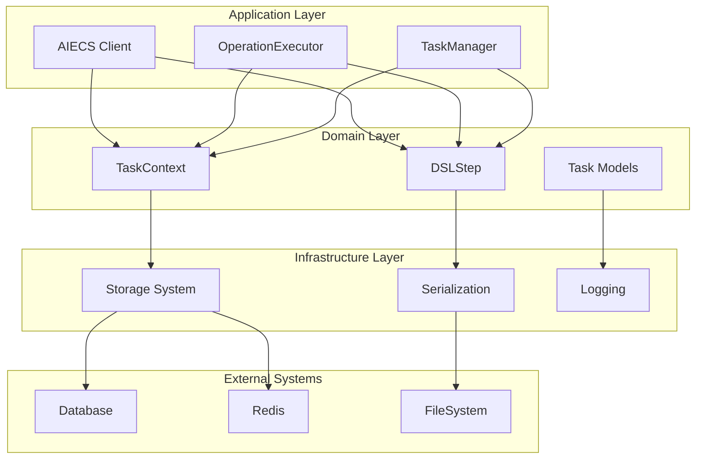
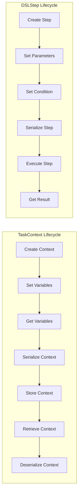
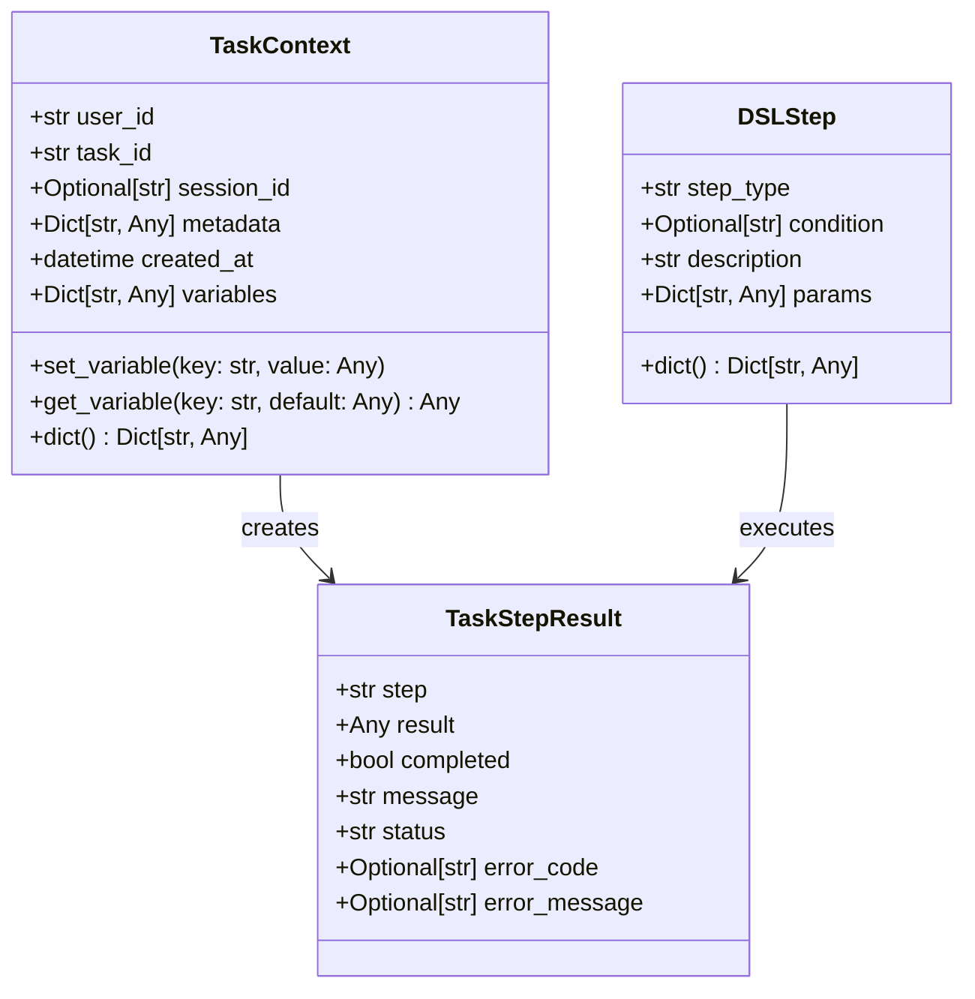
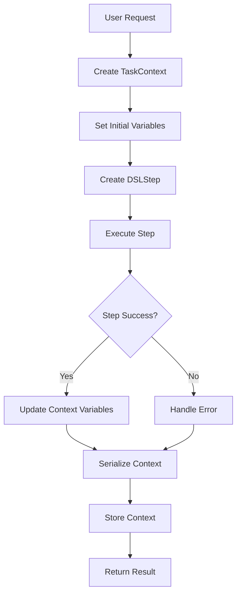

# Task Models Technical Documentation

## 1. Overview

### Core Functionality and Value

`domain/task/model.py` is a core domain model component of the AIECS system, defining two key data models related to task execution: **TaskContext** and **DSLStep**. These models provide standardized task context management and DSL step definition capabilities for the entire AI application system.

**Core Value**:
- **Task Context Management**: Provides unified task execution context, supporting variable storage, metadata management, and lifecycle tracking
- **DSL Step Definition**: Provides standardized step models for declarative task flows, supporting conditional execution and parameter passing
- **Data Contract Standardization**: Provides consistent data model contracts for the entire system, ensuring standardized data exchange between components
- **Type Safety Guarantees**: Provides compile-time type checking based on Python type system, reducing runtime errors

**Problems Solved**:
- Lack of unified context management mechanism during task execution
- Lack of standardized data models for DSL step definitions
- Lack of unified contract specifications for data exchange between components
- Lack of type safety guarantees for task state and variable management

## 2. Problem Background and Design Motivation

### Problem Background

When building complex AI application systems, task execution and flow management face the following core challenges:

**1. Task Context Management Complexity**
- Task execution requires maintaining large amounts of state information (user ID, task ID, session ID, etc.)
- Different task steps need to share variables and metadata
- Lack of unified task context lifecycle management mechanism

**2. DSL Step Definition Standardization Requirements**
- Declarative task flows need standardized step definition formats
- Different step types need to support different parameters and conditions
- Lack of unified DSL step data models

**3. Component Data Exchange Standardization**
- Different components need to exchange task-related data
- Lack of unified data serialization and deserialization mechanisms
- Inconsistent data formats lead to integration difficulties

**4. Type Safety and Data Validation**
- Task-related data lacks type safety guarantees
- Insufficient runtime data validation, prone to errors
- Lack of compile-time type checking mechanisms

### Design Motivation

**Task Model System Solution**:
- **Unified Context Model**: Provides unified task execution context management through TaskContext
- **Standardized Step Model**: Provides standardized DSL step definitions through DSLStep
- **Type-Safe Design**: Provides type safety guarantees based on Python type system
- **Serialization Support**: Provides unified data serialization and deserialization mechanisms
- **Extensible Design**: Supports flexible extension of metadata and parameters

## 3. Architecture Positioning and Context

### Component Type
**Domain Model Component** - Located in the Domain Layer, belongs to data contract definitions

### Architecture Layers
```
┌─────────────────────────────────────────┐
│         Application Layer               │  ← Components using task models
│  (AIECS Client, OperationExecutor)     │
└─────────────────┬───────────────────────┘
                  │
┌─────────────────▼───────────────────────┐
│         Domain Layer                    │  ← Task models layer
│  (TaskContext, DSLStep, Data Contracts)│
└─────────────────┬───────────────────────┘
                  │
┌─────────────────▼───────────────────────┐
│       Infrastructure Layer              │  ← Components task models depend on
│  (Storage, Serialization, Logging)     │
└─────────────────┬───────────────────────┘
                  │
┌─────────────────▼───────────────────────┐
│         External Systems                │  ← External systems
│  (Database, Redis, FileSystem)         │
└─────────────────────────────────────────┘
```

### Upstream Components (Consumers)

#### 1. Application Layer Services
- **AIECS Client** (`aiecs_client.py`) - Main client interface
- **OperationExecutor** (`application/executors/operation_executor.py`) - Operation executor
- **TaskManager** (if exists) - Task manager

#### 2. Domain Services
- **DSLProcessor** (`domain/task/dsl_processor.py`) - DSL processor
- **ContextEngine** (`domain/context/content_engine.py`) - Content engine
- **Other task-related services** - Task execution related services

#### 3. Infrastructure Layer
- **Storage Systems** - Store task data through serialization interface
- **API Layer** - Through data conversion interface
- **Message Queue** - Through message format

### Downstream Components (Dependencies)

#### 1. Python Standard Library
- **typing** - Provides type annotation support
- **datetime** - Provides time handling
- **json** - Provides JSON serialization support

#### 2. Domain Models
- **TaskStepResult** (`domain/execution/model.py`) - Task step result
- **Other domain models** - Associated through metadata fields

#### 3. Utility Functions
- **Serialization Tools** - Through dict() method
- **Validation Tools** - Through type checking

## 4. Core Features and Use Cases

### 4.1 TaskContext - Task Context Management

#### Core Functionality

**1. Basic Context Information Management**
```python
class TaskContext:
    """Task context model"""
    def __init__(self, user_id: str, task_id: str, session_id: Optional[str] = None,
                 metadata: Optional[Dict[str, Any]] = None):
        self.user_id = user_id
        self.task_id = task_id
        self.session_id = session_id
        self.metadata = metadata or {}
        self.created_at = datetime.now()
        self.variables = {}  # Variable storage during task execution
```

**2. Variable Storage and Management**
```python
def set_variable(self, key: str, value: Any):
    """Set task variable"""
    self.variables[key] = value

def get_variable(self, key: str, default: Any = None) -> Any:
    """Get task variable"""
    return self.variables.get(key, default)
```

**3. Data Serialization Support**
```python
def dict(self) -> Dict[str, Any]:
    """Convert to dictionary format"""
    return {
        "user_id": self.user_id,
        "task_id": self.task_id,
        "session_id": self.session_id,
        "metadata": self.metadata,
        "created_at": self.created_at.isoformat(),
        "variables": self.variables
    }
```

#### Software Functionality Scenarios

**Scenario 1: Data Analysis and Processing Task**
```python
# Create data analysis task context
context = TaskContext(
    user_id="analyst_001",
    task_id="data_analysis_2024_001",
    session_id="session_abc123",
    metadata={
        "project": "sales_analysis",
        "priority": "high",
        "deadline": "2024-01-15"
    }
)

# Store variables during analysis process
context.set_variable("input_file", "sales_data.csv")
context.set_variable("output_format", "excel")
context.set_variable("analysis_type", "trend_analysis")

# Get variables for subsequent processing
input_file = context.get_variable("input_file")
print(f"Processing file: {input_file}")

# Serialize context for storage or transmission
context_data = context.dict()
```

**Scenario 2: Multi-Step Workflow Task**
```python
# Create multi-step workflow context
workflow_context = TaskContext(
    user_id="workflow_001",
    task_id="document_processing_workflow",
    metadata={
        "workflow_type": "document_processing",
        "steps": ["extract", "analyze", "summarize", "format"]
    }
)

# Track workflow execution state
workflow_context.set_variable("current_step", "extract")
workflow_context.set_variable("extracted_text", "Document content...")
workflow_context.set_variable("analysis_result", {"sentiment": "positive", "confidence": 0.95})

# Check workflow state
current_step = workflow_context.get_variable("current_step")
if current_step == "extract":
    print("Starting analysis step...")
    workflow_context.set_variable("current_step", "analyze")
```

**Scenario 3: User Session Management**
```python
# Create user session context
session_context = TaskContext(
    user_id="user_123",
    task_id="chat_session_001",
    session_id="session_xyz789",
    metadata={
        "session_type": "chat",
        "model": "gpt-4",
        "temperature": 0.7
    }
)

# Store session history
session_context.set_variable("message_count", 0)
session_context.set_variable("last_message", "Hello, how can I help you?")
session_context.set_variable("conversation_history", [])

# Update session state
message_count = session_context.get_variable("message_count", 0)
session_context.set_variable("message_count", message_count + 1)
```

### 4.2 DSLStep - DSL Step Definition

#### Core Functionality

**1. Step Type and Condition Definition**
```python
class DSLStep:
    """DSL step model"""
    def __init__(self, step_type: str, condition: Optional[str] = None,
                 description: str = "", params: Optional[Dict[str, Any]] = None):
        self.step_type = step_type
        self.condition = condition
        self.description = description
        self.params = params or {}
```

**2. Data Serialization Support**
```python
def dict(self) -> Dict[str, Any]:
    """Convert to dictionary format"""
    return {
        "step_type": self.step_type,
        "condition": self.condition,
        "description": self.description,
        "params": self.params
    }
```

#### Software Functionality Scenarios

**Scenario 1: Conditional Branch Task Flow**
```python
# Create conditional branch step
if_step = DSLStep(
    step_type="if",
    condition="intent.includes('data_analysis')",
    description="Check if user wants data analysis",
    params={
        "then": {
            "task": "pandas_tool.read_csv",
            "params": {"file_path": "data.csv"}
        },
        "else": {
            "task": "json_tool.read_json",
            "params": {"file_path": "data.json"}
        }
    }
)

# Serialize step for storage
step_data = if_step.dict()
print(f"Step type: {step_data['step_type']}")
print(f"Condition: {step_data['condition']}")
```

**Scenario 2: Parallel Task Execution**
```python
# Create parallel execution step
parallel_step = DSLStep(
    step_type="parallel",
    description="Execute multiple tasks in parallel",
    params={
        "tasks": [
            {
                "task": "pandas_tool.read_csv",
                "params": {"file_path": "data1.csv"}
            },
            {
                "task": "pandas_tool.read_csv",
                "params": {"file_path": "data2.csv"}
            }
        ]
    }
)

# Get parallel task list
tasks = parallel_step.params.get("tasks", [])
print(f"Executing {len(tasks)} tasks in parallel")
```

**Scenario 3: Sequential Task Execution**
```python
# Create sequential execution step
sequence_step = DSLStep(
    step_type="sequence",
    description="Execute tasks in sequence",
    params={
        "steps": [
            {
                "task": "pandas_tool.read_csv",
                "params": {"file_path": "data.csv"}
            },
            {
                "task": "pandas_tool.clean_data",
                "params": {"data": "{{result[0].result}}"}
            },
            {
                "task": "pandas_tool.analyze_data",
                "params": {"data": "{{result[1].result}}"}
            }
        ]
    }
)

# Get step list
steps = sequence_step.params.get("steps", [])
print(f"Executing {len(steps)} steps in sequence")
```

### 4.3 Real-World Use Cases

**Case 1: Intelligent Document Processing System**
```python
# Document processing task context
doc_context = TaskContext(
    user_id="doc_processor_001",
    task_id="document_analysis_2024_001",
    session_id="doc_session_abc123",
    metadata={
        "document_type": "pdf",
        "language": "zh-CN",
        "processing_mode": "batch"
    }
)

# Store document information
doc_context.set_variable("input_file", "document.pdf")
doc_context.set_variable("output_dir", "./output")
doc_context.set_variable("extracted_text", "")

# Define document processing steps
extract_step = DSLStep(
    step_type="task",
    description="Extract text from PDF",
    params={
        "task": "pdf_tool.extract_text",
        "params": {
            "file_path": "{{variables.input_file}}",
            "language": "zh-CN"
        }
    }
)

analyze_step = DSLStep(
    step_type="task",
    condition="result[0].success == true",
    description="Analyze extracted text",
    params={
        "task": "nlp_tool.analyze_sentiment",
        "params": {
            "text": "{{result[0].result}}",
            "model": "bert-base-chinese"
        }
    }
)

# Execute steps
steps = [extract_step, analyze_step]
for step in steps:
    print(f"Executing: {step.description}")
    step_data = step.dict()
    print(f"Step data: {step_data}")
```

**Case 2: Data Science Workflow**
```python
# Data science task context
ds_context = TaskContext(
    user_id="data_scientist_001",
    task_id="ml_pipeline_2024_001",
    metadata={
        "project": "customer_segmentation",
        "algorithm": "kmeans",
        "dataset_size": "large"
    }
)

# Store machine learning parameters
ds_context.set_variable("n_clusters", 5)
ds_context.set_variable("random_state", 42)
ds_context.set_variable("test_size", 0.2)

# Define machine learning pipeline steps
data_loading_step = DSLStep(
    step_type="task",
    description="Load and preprocess data",
    params={
        "task": "pandas_tool.load_and_preprocess",
        "params": {
            "file_path": "customer_data.csv",
            "target_column": "segment"
        }
    }
)

model_training_step = DSLStep(
    step_type="task",
    condition="result[0].success == true",
    description="Train clustering model",
    params={
        "task": "sklearn_tool.train_kmeans",
        "params": {
            "data": "{{result[0].result}}",
            "n_clusters": "{{variables.n_clusters}}",
            "random_state": "{{variables.random_state}}"
        }
    }
)

evaluation_step = DSLStep(
    step_type="task",
    condition="result[1].success == true",
    description="Evaluate model performance",
    params={
        "task": "sklearn_tool.evaluate_model",
        "params": {
            "model": "{{result[1].result}}",
            "test_data": "{{result[0].test_data}}"
        }
    }
)

# Build complete machine learning pipeline
ml_pipeline = [data_loading_step, model_training_step, evaluation_step]
```

**Case 3: Real-time Chatbot**
```python
# Chatbot task context
chat_context = TaskContext(
    user_id="user_456",
    task_id="chat_session_2024_001",
    session_id="chat_session_xyz789",
    metadata={
        "bot_type": "customer_service",
        "language": "en",
        "model": "gpt-4"
    }
)

# Store conversation state
chat_context.set_variable("conversation_history", [])
chat_context.set_variable("user_intent", "unknown")
chat_context.set_variable("response_count", 0)

# Define chatbot steps
intent_detection_step = DSLStep(
    step_type="task",
    description="Detect user intent",
    params={
        "task": "nlp_tool.detect_intent",
        "params": {
            "message": "{{input.message}}",
            "history": "{{variables.conversation_history}}"
        }
    }
)

response_generation_step = DSLStep(
    step_type="task",
    condition="result[0].confidence > 0.8",
    description="Generate response based on intent",
    params={
        "task": "llm_tool.generate_response",
        "params": {
            "intent": "{{result[0].intent}}",
            "message": "{{input.message}}",
            "context": "{{variables.conversation_history}}",
            "model": "gpt-4"
        }
    }
)

fallback_step = DSLStep(
    step_type="task",
    condition="result[0].confidence <= 0.8",
    description="Generate fallback response",
    params={
        "task": "llm_tool.generate_fallback",
        "params": {
            "message": "{{input.message}}",
            "model": "gpt-4"
        }
    }
)

# Build chatbot flow
chat_flow = [intent_detection_step, response_generation_step, fallback_step]
```

## 5. API Reference

### 5.1 TaskContext Class

#### Constructor
```python
def __init__(self, user_id: str, task_id: str, session_id: Optional[str] = None,
             metadata: Optional[Dict[str, Any]] = None)
```

**Parameters**:
- `user_id` (str): User unique identifier, required
- `task_id` (str): Task unique identifier, required
- `session_id` (Optional[str]): Session identifier, optional, defaults to None
- `metadata` (Optional[Dict[str, Any]]): Task metadata, optional, defaults to empty dictionary

**Returns**: None

**Exceptions**: None

#### Methods

##### set_variable
```python
def set_variable(self, key: str, value: Any) -> None
```

**Function**: Set task variable

**Parameters**:
- `key` (str): Variable key name, required
- `value` (Any): Variable value, required

**Returns**: None

**Exceptions**: None

**Example**:
```python
context = TaskContext("user_123", "task_456")
context.set_variable("input_file", "data.csv")
context.set_variable("processing_mode", "batch")
```

##### get_variable
```python
def get_variable(self, key: str, default: Any = None) -> Any
```

**Function**: Get task variable

**Parameters**:
- `key` (str): Variable key name, required
- `default` (Any): Default value, optional, defaults to None

**Returns**: Any - Variable value or default value

**Exceptions**: None

**Example**:
```python
context = TaskContext("user_123", "task_456")
context.set_variable("input_file", "data.csv")

file_path = context.get_variable("input_file")  # "data.csv"
mode = context.get_variable("processing_mode", "single")  # "single"
```

##### dict
```python
def dict(self) -> Dict[str, Any]
```

**Function**: Convert task context to dictionary format

**Parameters**: None

**Returns**: Dict[str, Any] - Dictionary containing all context information

**Exceptions**: None

**Example**:
```python
context = TaskContext("user_123", "task_456", "session_789")
context.set_variable("input_file", "data.csv")

context_data = context.dict()
# {
#     "user_id": "user_123",
#     "task_id": "task_456",
#     "session_id": "session_789",
#     "metadata": {},
#     "created_at": "2024-01-01T12:00:00.000000",
#     "variables": {"input_file": "data.csv"}
# }
```

### 5.2 DSLStep Class

#### Constructor
```python
def __init__(self, step_type: str, condition: Optional[str] = None,
             description: str = "", params: Optional[Dict[str, Any]] = None)
```

**Parameters**:
- `step_type` (str): Step type, required
- `condition` (Optional[str]): Execution condition, optional, defaults to None
- `description` (str): Step description, optional, defaults to empty string
- `params` (Optional[Dict[str, Any]]): Step parameters, optional, defaults to empty dictionary

**Returns**: None

**Exceptions**: None

#### Methods

##### dict
```python
def dict(self) -> Dict[str, Any]
```

**Function**: Convert DSL step to dictionary format

**Parameters**: None

**Returns**: Dict[str, Any] - Dictionary containing all step information

**Exceptions**: None

**Example**:
```python
step = DSLStep(
    step_type="task",
    condition="intent.includes('analysis')",
    description="Perform data analysis",
    params={"task": "pandas_tool.analyze", "params": {"file": "data.csv"}}
)

step_data = step.dict()
# {
#     "step_type": "task",
#     "condition": "intent.includes('analysis')",
#     "description": "Perform data analysis",
#     "params": {"task": "pandas_tool.analyze", "params": {"file": "data.csv"}}
# }
```

## 6. Technical Implementation Details

### 6.1 Data Model Design

#### TaskContext Design Principles

**1. Immutability Design**
```python
# TaskContext core identifiers are immutable after creation
context = TaskContext("user_123", "task_456")
# context.user_id and context.task_id should not be modified after creation
```

**2. Variable Storage Mechanism**
```python
# Use dictionary to store variables, supporting values of any type
self.variables = {}  # Dict[str, Any]

# Variable storage examples
context.set_variable("string_var", "hello")
context.set_variable("int_var", 42)
context.set_variable("dict_var", {"key": "value"})
context.set_variable("list_var", [1, 2, 3])
```

**3. Timestamp Management**
```python
# Automatically record creation time
self.created_at = datetime.now()

# Convert to ISO format during serialization
def dict(self) -> Dict[str, Any]:
    return {
        # ...
        "created_at": self.created_at.isoformat(),
        # ...
    }
```

#### DSLStep Design Principles

**1. Type-Safe Design**
```python
# Use type annotations to ensure type safety
def __init__(self, step_type: str, condition: Optional[str] = None,
             description: str = "", params: Optional[Dict[str, Any]] = None):
```

**2. Parameter Validation**
```python
# Ensure parameters are not None
self.params = params or {}  # If params is None, use empty dictionary
```

**3. Condition Expression Support**
```python
# Support condition expression strings
self.condition = condition  # e.g.: "intent.includes('analysis')"
```

### 6.2 Serialization Mechanism

#### JSON Serialization Support
```python
# TaskContext serialization
def dict(self) -> Dict[str, Any]:
    return {
        "user_id": self.user_id,
        "task_id": self.task_id,
        "session_id": self.session_id,
        "metadata": self.metadata,
        "created_at": self.created_at.isoformat(),  # Timestamp serialization
        "variables": self.variables
    }

# DSLStep serialization
def dict(self) -> Dict[str, Any]:
    return {
        "step_type": self.step_type,
        "condition": self.condition,
        "description": self.description,
        "params": self.params
    }
```

#### Deserialization Support
```python
# Create TaskContext from dictionary
def from_dict(data: Dict[str, Any]) -> 'TaskContext':
    context = TaskContext(
        user_id=data["user_id"],
        task_id=data["task_id"],
        session_id=data.get("session_id"),
        metadata=data.get("metadata", {})
    )
    
    # Restore variables
    context.variables = data.get("variables", {})
    
    # Restore timestamp
    if "created_at" in data:
        context.created_at = datetime.fromisoformat(data["created_at"])
    
    return context

# Create DSLStep from dictionary
def from_dict(data: Dict[str, Any]) -> 'DSLStep':
    return DSLStep(
        step_type=data["step_type"],
        condition=data.get("condition"),
        description=data.get("description", ""),
        params=data.get("params", {})
    )
```

### 6.3 Type Safety Mechanism

#### Type Annotations
```python
from typing import Any, Dict, List, Optional

class TaskContext:
    def __init__(self, user_id: str, task_id: str, session_id: Optional[str] = None,
                 metadata: Optional[Dict[str, Any]] = None):
        # Type annotations ensure correct parameter types
        pass
    
    def set_variable(self, key: str, value: Any) -> None:
        # Support values of any type
        pass
    
    def get_variable(self, key: str, default: Any = None) -> Any:
        # Return type is Any, supports type inference
        pass
```

#### Runtime Type Checking
```python
def validate_context_data(data: Dict[str, Any]) -> bool:
    """Validate context data format"""
    required_fields = ["user_id", "task_id"]
    
    for field in required_fields:
        if field not in data:
            return False
        if not isinstance(data[field], str):
            return False
    
    return True

def validate_step_data(data: Dict[str, Any]) -> bool:
    """Validate step data format"""
    required_fields = ["step_type"]
    
    for field in required_fields:
        if field not in data:
            return False
        if not isinstance(data[field], str):
            return False
    
    return True
```

## 7. Configuration and Deployment

### 7.1 Default Configuration

#### TaskContext Default Configuration
```python
# Default metadata
default_metadata = {}

# Default variable storage
default_variables = {}

# Default session ID
default_session_id = None
```

#### DSLStep Default Configuration
```python
# Default condition
default_condition = None

# Default description
default_description = ""

# Default parameters
default_params = {}
```

### 7.2 Environment Variable Support

#### Configuration Environment Variables
```python
import os

# Get configuration from environment variables
DEFAULT_TASK_DIR = os.getenv("AIECS_TASK_DIR", "./tasks")
DEFAULT_SESSION_TIMEOUT = int(os.getenv("AIECS_SESSION_TIMEOUT", "3600"))
DEFAULT_MAX_VARIABLES = int(os.getenv("AIECS_MAX_VARIABLES", "1000"))
```

#### Configuration Validation
```python
def validate_config():
    """Validate configuration parameters"""
    task_dir = os.getenv("AIECS_TASK_DIR", "./tasks")
    if not os.path.exists(task_dir):
        os.makedirs(task_dir, exist_ok=True)
    
    session_timeout = int(os.getenv("AIECS_SESSION_TIMEOUT", "3600"))
    if session_timeout <= 0:
        raise ValueError("Session timeout must be positive")
    
    max_variables = int(os.getenv("AIECS_MAX_VARIABLES", "1000"))
    if max_variables <= 0:
        raise ValueError("Max variables must be positive")
```

### 7.3 Deployment Configuration

#### Production Environment Configuration
```python
# Production environment configuration
PRODUCTION_CONFIG = {
    "task_dir": "/var/lib/aiecs/tasks",
    "session_timeout": 7200,  # 2 hours
    "max_variables": 5000,
    "enable_persistence": True,
    "log_level": "INFO"
}
```

#### Development Environment Configuration
```python
# Development environment configuration
DEVELOPMENT_CONFIG = {
    "task_dir": "./tasks",
    "session_timeout": 3600,  # 1 hour
    "max_variables": 1000,
    "enable_persistence": False,
    "log_level": "DEBUG"
}
```

## 8. Maintenance and Troubleshooting

### 8.1 Daily Maintenance

#### Model Health Check
```python
def check_models_health():
    """Check model health status"""
    try:
        # Test TaskContext creation
        context = TaskContext("test_user", "test_task")
        assert context.user_id == "test_user"
        assert context.task_id == "test_task"
        print("✅ TaskContext creation test passed")
        
        # Test variable storage
        context.set_variable("test_key", "test_value")
        assert context.get_variable("test_key") == "test_value"
        print("✅ TaskContext variable storage test passed")
        
        # Test serialization
        context_data = context.dict()
        assert "user_id" in context_data
        assert "variables" in context_data
        print("✅ TaskContext serialization test passed")
        
        # Test DSLStep creation
        step = DSLStep("task", "test condition", "test description", {"param": "value"})
        assert step.step_type == "task"
        assert step.condition == "test condition"
        print("✅ DSLStep creation test passed")
        
        # Test step serialization
        step_data = step.dict()
        assert "step_type" in step_data
        assert "params" in step_data
        print("✅ DSLStep serialization test passed")
        
        return True
        
    except Exception as e:
        print(f"❌ Model health check failed: {e}")
        return False
```

#### Data Consistency Check
```python
def check_data_consistency(context: TaskContext):
    """Check context data consistency"""
    try:
        # Check required fields
        if not context.user_id:
            print("❌ Missing user_id")
            return False
        
        if not context.task_id:
            print("❌ Missing task_id")
            return False
        
        # Check timestamp
        if not context.created_at:
            print("❌ Missing created_at")
            return False
        
        # Check variable storage
        if not isinstance(context.variables, dict):
            print("❌ Variables is not a dictionary")
            return False
        
        # Check metadata
        if not isinstance(context.metadata, dict):
            print("❌ Metadata is not a dictionary")
            return False
        
        print("✅ Data consistency check passed")
        return True
        
    except Exception as e:
        print(f"❌ Data consistency check failed: {e}")
        return False
```

### 8.2 Troubleshooting

#### Common Issue Diagnosis

**Issue 1: Variable Storage Failure**
```python
def diagnose_variable_storage_issue():
    """Diagnose variable storage issues"""
    try:
        context = TaskContext("test_user", "test_task")
        
        # Test normal variable storage
        context.set_variable("string_var", "hello")
        context.set_variable("int_var", 42)
        context.set_variable("dict_var", {"key": "value"})
        
        # Verify variable storage
        assert context.get_variable("string_var") == "hello"
        assert context.get_variable("int_var") == 42
        assert context.get_variable("dict_var") == {"key": "value"}
        
        print("✅ Variable storage working correctly")
        
    except Exception as e:
        print(f"❌ Variable storage issue: {e}")
        
        # Check if variables dictionary is properly initialized
        if not hasattr(context, 'variables'):
            print("❌ Variables dictionary not initialized")
        elif not isinstance(context.variables, dict):
            print("❌ Variables is not a dictionary")
```

**Issue 2: Serialization Failure**
```python
def diagnose_serialization_issue():
    """Diagnose serialization issues"""
    try:
        context = TaskContext("test_user", "test_task")
        context.set_variable("test_var", "test_value")
        
        # Test serialization
        context_data = context.dict()
        
        # Verify serialization result
        assert isinstance(context_data, dict)
        assert context_data["user_id"] == "test_user"
        assert context_data["task_id"] == "test_task"
        assert context_data["variables"]["test_var"] == "test_value"
        
        print("✅ Serialization working correctly")
        
    except Exception as e:
        print(f"❌ Serialization issue: {e}")
        
        # Check timestamp serialization
        if "created_at" in context_data:
            try:
                datetime.fromisoformat(context_data["created_at"])
                print("✅ Timestamp serialization working")
            except ValueError:
                print("❌ Timestamp serialization failed")
```

**Issue 3: Type Checking Failure**
```python
def diagnose_type_checking_issue():
    """Diagnose type checking issues"""
    try:
        # Test correct types
        context = TaskContext("user_123", "task_456")
        step = DSLStep("task", "condition", "description", {"param": "value"})
        
        print("✅ Type checking passed")
        
    except TypeError as e:
        print(f"❌ Type checking failed: {e}")
        
        # Check parameter types
        if not isinstance("user_123", str):
            print("❌ user_id must be string")
        if not isinstance("task_456", str):
            print("❌ task_id must be string")
```

### 8.3 Performance Optimization

#### Memory Usage Optimization
```python
def optimize_memory_usage():
    """Optimize memory usage"""
    import gc
    import sys
    
    # Create many context objects
    contexts = []
    for i in range(10000):
        context = TaskContext(f"user_{i}", f"task_{i}")
        context.set_variable(f"var_{i}", f"value_{i}")
        contexts.append(context)
    
    print(f"Memory usage before cleanup: {sys.getsizeof(contexts)} bytes")
    
    # Cleanup objects
    contexts.clear()
    gc.collect()
    
    print(f"Memory usage after cleanup: {sys.getsizeof(contexts)} bytes")
```

#### Serialization Performance Optimization
```python
def optimize_serialization_performance():
    """Optimize serialization performance"""
    import time
    
    context = TaskContext("user_123", "task_456")
    context.set_variable("var1", "value1")
    context.set_variable("var2", "value2")
    context.set_variable("var3", "value3")
    
    # Warm-up
    for _ in range(100):
        context.dict()
    
    # Performance test
    start_time = time.time()
    for _ in range(10000):
        context.dict()
    end_time = time.time()
    
    print(f"Serialization time: {(end_time - start_time) * 1000:.2f}ms for 10000 iterations")
```

## 9. Visualizations

### 9.1 Architecture Layers Diagram



### 9.2 Data Flow Diagram



### 9.3 Class Relationship Diagram



### 9.4 Usage Scenario Flow Diagram



## 10. Version History

### v1.0.0 (2024-01-01)
- **Initial Version**: Basic TaskContext and DSLStep models
- **Features**:
  - TaskContext basic context management
  - DSLStep basic step definition
  - Basic serialization support

### v1.1.0 (2024-01-15)
- **Enhanced Features**:
  - Added variable storage and management functionality
  - Improved serialization mechanism
  - Added type annotation support

### v1.2.0 (2024-02-01)
- **New Features**:
  - Added metadata support
  - Improved error handling
  - Added data validation

### v1.3.0 (2024-02-15)
- **Optimization Features**:
  - Performance optimization
  - Memory usage optimization
  - Added health checks

### v1.4.0 (2024-03-01)
- **Extension Features**:
  - Added session ID support
  - Improved condition expression support
  - Added configuration management

### v1.5.0 (2024-03-15)
- **Completion Features**:
  - Added monitoring and logging support
  - Improved troubleshooting tools
  - Added performance monitoring

## Related Documentation

- [AIECS Project Overview](../PROJECT_SUMMARY.md)
- [DSL Processor Documentation](./DSL_PROCESSOR.md)
- [Execution Models Documentation](../DOMAIN_EXECUTION/EXECUTION_MODELS.md)
- [Operation Executor Documentation](../APPLICATION/OPERATION_EXECUTOR.md)
