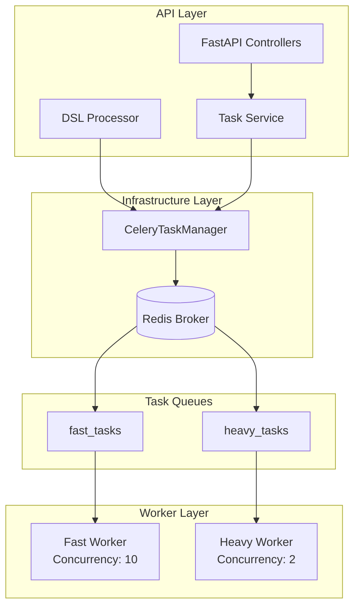
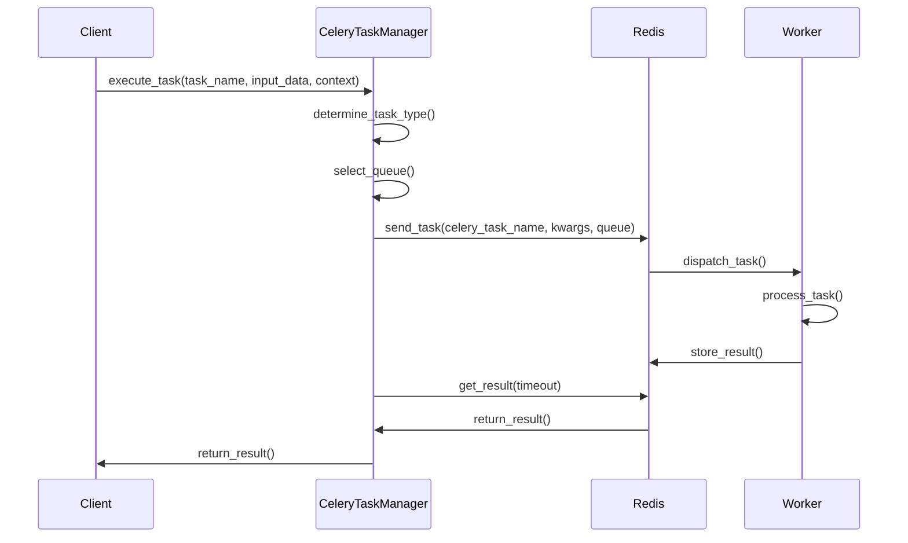
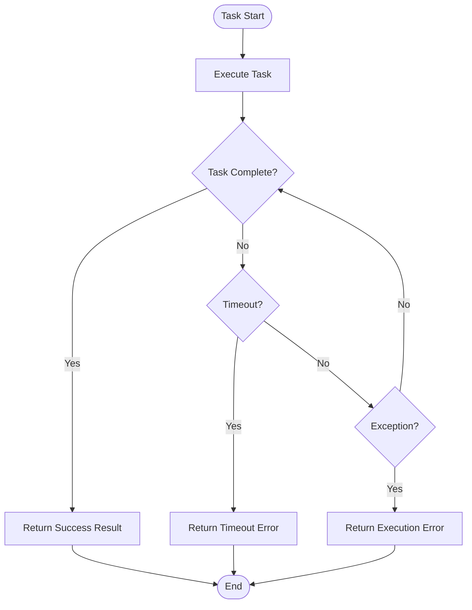
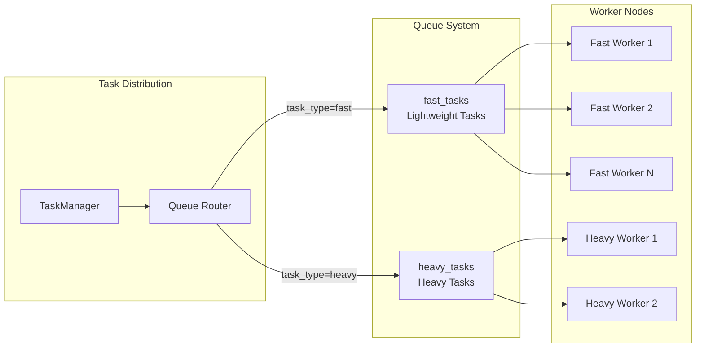

# CeleryTaskManager Technical Documentation

## 1. Overview

### Purpose
`CeleryTaskManager` is a component specifically designed for distributed task scheduling and execution, built on the Celery framework. It provides core functionalities including asynchronous task execution, queue management, task monitoring, and batch processing, serving as the core infrastructure for the task execution layer in the AIECS system.

### Core Value
- **Distributed Task Execution**: Supports task distribution and execution across multiple worker nodes
- **Queue Management**: Provides separate queue management for fast tasks and heavy tasks
- **Asynchronous Processing**: Asynchronous task execution based on asyncio, improving system throughput
- **Task Monitoring**: Provides task status tracking, result retrieval, and cancellation functionality
- **Fault Tolerance**: Built-in timeout handling, error retry, and exception recovery mechanisms

## 2. Problem Background & Design Motivation

### Problem Background
The AIECS system needs to handle a large number of compute-intensive tasks, including:
- **AI Model Inference**: Requires significant computational resources with uncertain execution times
- **Data Processing Tasks**: Involves heavy operations such as large file processing and data transformation
- **Batch Task Processing**: Needs to process multiple related tasks simultaneously
- **Long-Running Tasks**: Some tasks may take minutes to hours to complete

### Design Motivation
1. **Performance Isolation**: Separates heavy tasks from fast tasks to avoid mutual interference
2. **Resource Optimization**: Achieves reasonable resource allocation through queue management
3. **Scalability**: Supports horizontal scaling, dynamically adjusting worker nodes based on load
4. **Reliability**: Provides task status tracking and error recovery mechanisms
5. **Monitoring Capability**: Provides detailed task execution statistics and queue status information

## 3. Architecture Positioning & Context

### System Architecture Location
```
┌─────────────────────────────────────────────────────────────┐
│                    AIECS System Architecture                │
├─────────────────────────────────────────────────────────────┤
│  API Layer (FastAPI)                                       │
├─────────────────────────────────────────────────────────────┤
│  Domain Layer (Task, Execution)                            │
├─────────────────────────────────────────────────────────────┤
│  Infrastructure Layer                                      │
│  ┌─────────────────┐  ┌─────────────────┐                  │
│  │ CeleryTaskManager│  │ Other Infrastructure│              │
│  └─────────────────┘  └─────────────────┘                  │
├─────────────────────────────────────────────────────────────┤
│  Message Broker (Redis)                                    │
├─────────────────────────────────────────────────────────────┤
│  Worker Nodes (Celery Workers)                             │
└─────────────────────────────────────────────────────────────┘
```

### Upstream Callers
- **TaskService**: Task management service responsible for task creation and scheduling
- **DSLProcessor**: DSL processor that executes complex task workflows
- **API Controllers**: REST API controllers that handle user requests

### Downstream Dependencies
- **Redis**: Serves as message broker and result storage
- **Celery Workers**: Worker nodes that actually execute tasks
- **TaskStatus/ErrorCode**: Task status and error code definitions

## 4. Core Features & Use Cases

### 4.1 Task Execution Functionality

#### Basic Task Execution
```python
# Create task manager instance
config = {
    'broker_url': 'redis://localhost:6379/0',
    'backend_url': 'redis://localhost:6379/0',
    'task_timeout_seconds': 300
}
task_manager = CeleryTaskManager(config)

# Execute a single task
result = await task_manager.execute_task(
    task_name="data_processing",
    input_data={
        "file_path": "/data/input.csv",
        "task_id": "task_123",
        "step": 1
    },
    context={
        "user_id": "user_456",
        "mode": "batch"
    }
)
```

#### Heavy Task Execution
```python
# Execute compute-intensive task
heavy_result = await task_manager.execute_heavy_task(
    task_name="ml_model_training",
    input_data={
        "dataset_path": "/data/training_data.parquet",
        "model_config": {"epochs": 100, "batch_size": 32}
    },
    context={"user_id": "user_789"}
)
```

### 4.2 DSL Task Step Execution

#### Complex Workflow Execution
```python
# Execute DSL-defined task step
dsl_step = {
    "task": "data_validation",
    "parameters": {
        "validation_rules": ["not_null", "data_type_check"],
        "error_threshold": 0.05
    }
}

step_result = await task_manager.execute_dsl_task_step(
    step=dsl_step,
    input_data={"data_source": "database_table"},
    context={
        "user_id": "user_123",
        "task_id": "workflow_456",
        "step": 2
    }
)
```

### 4.3 Batch Task Processing

#### Batch Execution of Multiple Tasks
```python
# Prepare batch tasks
tasks = [
    {
        "task_name": "image_resize",
        "input_data": {"image_path": f"/images/img_{i}.jpg"},
        "context": {"user_id": "user_123"}
    }
    for i in range(100)
]

# Batch execution
batch_results = await task_manager.batch_execute_tasks(tasks)
```

### 4.4 Task Monitoring and Management

#### Task Status Query
```python
# Get task result
task_result = task_manager.get_task_result("task_123")
print(f"Task status: {task_result['status']}")
print(f"Execution result: {task_result['result']}")

# Cancel task
success = task_manager.cancel_task("task_123")
```

#### Queue Status Monitoring
```python
# Get queue information
queue_info = task_manager.get_queue_info()
print(f"Active tasks: {queue_info['active_tasks']}")
print(f"Scheduled tasks: {queue_info['scheduled_tasks']}")

# Get worker statistics
worker_stats = task_manager.get_worker_stats()
print(f"Worker statistics: {worker_stats}")
```

## 5. API Reference

### 5.1 Class Definition

#### `CeleryTaskManager`
```python
class CeleryTaskManager:
    """Celery distributed task scheduling and execution manager"""
    
    def __init__(self, config: Dict[str, Any]) -> None
    """Initialize task manager
    
    Args:
        config: Configuration dictionary containing Celery-related configuration
    """
```

### 5.2 Public Methods

#### `execute_task`
```python
async def execute_task(
    self, 
    task_name: str, 
    input_data: Dict[str, Any], 
    context: Dict[str, Any]
) -> Any
```
**Function**: Execute a single asynchronous task

**Parameters**:
- `task_name` (str): Task name
- `input_data` (Dict[str, Any]): Task input data
- `context` (Dict[str, Any]): Task context information

**Returns**:
- `Any`: Task execution result

**Exceptions**:
- `CeleryTimeoutError`: Task execution timeout
- `Exception`: Other execution exceptions

#### `execute_heavy_task`
```python
async def execute_heavy_task(
    self, 
    task_name: str, 
    input_data: Dict[str, Any], 
    context: Dict[str, Any]
) -> Any
```
**Function**: Execute a heavy task (automatically assigned to heavy task queue)

**Parameters**: Same as `execute_task`

**Returns**: Same as `execute_task`

#### `execute_dsl_task_step`
```python
async def execute_dsl_task_step(
    self, 
    step: Dict[str, Any], 
    input_data: Dict[str, Any], 
    context: Dict[str, Any]
) -> Dict[str, Any]
```
**Function**: Execute a DSL-defined task step

**Parameters**:
- `step` (Dict[str, Any]): DSL step definition
- `input_data` (Dict[str, Any]): Input data
- `context` (Dict[str, Any]): Context information

**Returns**:
- `Dict[str, Any]`: Dictionary containing step execution result

#### `batch_execute_tasks`
```python
async def batch_execute_tasks(
    self, 
    tasks: List[Dict[str, Any]]
) -> List[Any]
```
**Function**: Batch execute multiple tasks

**Parameters**:
- `tasks` (List[Dict[str, Any]]): Task list

**Returns**:
- `List[Any]`: Task execution result list

#### `get_task_result`
```python
def get_task_result(self, task_id: str) -> Dict[str, Any]
```
**Function**: Get task execution result

**Parameters**:
- `task_id` (str): Task ID

**Returns**:
- `Dict[str, Any]`: Task status and result information

#### `cancel_task`
```python
def cancel_task(self, task_id: str) -> bool
```
**Function**: Cancel specified task

**Parameters**:
- `task_id` (str): Task ID

**Returns**:
- `bool`: Whether cancellation operation succeeded

#### `get_queue_info`
```python
def get_queue_info(self) -> Dict[str, Any]
```
**Function**: Get queue status information

**Returns**:
- `Dict[str, Any]`: Queue status statistics

#### `get_worker_stats`
```python
def get_worker_stats(self) -> Dict[str, Any]
```
**Function**: Get worker node statistics

**Returns**:
- `Dict[str, Any]`: Worker node statistics

## 6. Technical Implementation Details

### 6.1 Queue Management Strategy

#### Dual Queue Architecture
```python
task_queues = {
    'fast_tasks': {
        'exchange': 'fast_tasks', 
        'routing_key': 'fast_tasks'
    },
    'heavy_tasks': {
        'exchange': 'heavy_tasks', 
        'routing_key': 'heavy_tasks'
    }
}
```

- **fast_tasks**: Handles lightweight tasks such as data validation, simple calculations, etc.
- **heavy_tasks**: Handles compute-intensive tasks such as machine learning training, big data processing, etc.

#### Worker Node Configuration
```python
worker_concurrency = {
    'fast_worker': 10,    # Fast task worker node concurrency
    'heavy_worker': 2     # Heavy task worker node concurrency
}
```

### 6.2 Task Type Auto-Detection

The system automatically determines task type through the following logic:

```python
# 1. Try to get task type
task_type_result = await self.execute_task(task_name, {"get_task_type": True}, context)

# 2. Determine queue based on return result
if isinstance(task_type_result, dict) and "task_type" in task_type_result:
    task_type = task_type_result["task_type"]
else:
    task_type = "fast"  # Default type

# 3. Select corresponding queue
queue = "heavy_tasks" if task_type == "heavy" else "fast_tasks"
```

### 6.3 Timeout Handling Mechanism

#### Multi-Layer Timeout Control
```python
# 1. Configuration-level timeout
timeout_seconds = self.config.get('task_timeout_seconds', 300)

# 2. Task-level timeout check
while not celery_task.ready():
    if time.time() - start_time > timeout_seconds:
        raise AsyncioTimeoutError(f"Task {task_name} timed out after {timeout_seconds} seconds")
    await asyncio.sleep(0.5)

# 3. Celery native timeout
result = celery_task.get(timeout=timeout)
```

### 6.4 Error Handling Strategy

#### Exception Classification Handling
```python
try:
    # Task execution logic
    result = await self.execute_task(...)
except CeleryTimeoutError as e:
    # Timeout error
    return {
        "status": TaskStatus.TIMED_OUT,
        "error_code": ErrorCode.TIMEOUT_ERROR,
        "error_message": str(e)
    }
except Exception as e:
    # Other execution errors
    return {
        "status": TaskStatus.FAILED,
        "error_code": ErrorCode.EXECUTION_ERROR,
        "error_message": str(e)
    }
```

### 6.5 Batch Processing Optimization

#### Batch Processing Strategy
```python
# 1. Batch processing
batch_size = self.config.get('batch_size', 10)
for i in range(0, len(tasks), batch_size):
    batch = tasks[i:i + batch_size]
    
# 2. Concurrent execution
batch_results = await asyncio.gather(
    *[self.execute_task(...) for task in batch],
    return_exceptions=True
)

# 3. Rate limiting
rate_limit = self.config.get('rate_limit_requests_per_second', 5)
await asyncio.sleep(1.0 / rate_limit)
```

## 7. Configuration & Deployment

### 7.1 Configuration Parameters

#### Required Configuration
```python
config = {
    # Message broker configuration
    'broker_url': 'redis://localhost:6379/0',
    'backend_url': 'redis://localhost:6379/0',
    
    # Task timeout configuration
    'task_timeout_seconds': 300,
    
    # Batch processing configuration
    'batch_size': 10,
    'rate_limit_requests_per_second': 5
}
```

#### Optional Configuration
```python
config = {
    # Serialization configuration
    'task_serializer': 'json',
    'accept_content': ['json'],
    'result_serializer': 'json',
    
    # Timezone configuration
    'timezone': 'UTC',
    'enable_utc': True,
    
    # Queue configuration
    'task_queues': {
        'fast_tasks': {'exchange': 'fast_tasks', 'routing_key': 'fast_tasks'},
        'heavy_tasks': {'exchange': 'heavy_tasks', 'routing_key': 'heavy_tasks'}
    },
    
    # Worker node configuration
    'worker_concurrency': {
        'fast_worker': 10,
        'heavy_worker': 2
    }
}
```

### 7.2 Environment Variable Support

```bash
# Redis configuration
export CELERY_BROKER_URL="redis://localhost:6379/0"
export CELERY_BACKEND_URL="redis://localhost:6379/0"

# Task configuration
export CELERY_TASK_TIMEOUT="300"
export CELERY_BATCH_SIZE="10"
export CELERY_RATE_LIMIT="5"

# Queue configuration
export CELERY_FAST_WORKER_CONCURRENCY="10"
export CELERY_HEAVY_WORKER_CONCURRENCY="2"
```

### 7.3 Docker Deployment

#### Docker Compose Configuration
```yaml
version: '3.8'
services:
  redis:
    image: redis:7-alpine
    ports:
      - "6379:6379"
    
  celery-worker-fast:
    build: .
    command: celery -A aiecs.tasks.worker worker --loglevel=info --queues=fast_tasks --concurrency=10
    environment:
      - CELERY_BROKER_URL=redis://redis:6379/0
      - CELERY_BACKEND_URL=redis://redis:6379/0
    depends_on:
      - redis
    
  celery-worker-heavy:
    build: .
    command: celery -A aiecs.tasks.worker worker --loglevel=info --queues=heavy_tasks --concurrency=2
    environment:
      - CELERY_BROKER_URL=redis://redis:6379/0
      - CELERY_BACKEND_URL=redis://redis:6379/0
    depends_on:
      - redis
```

### 7.4 Production Environment Configuration

#### High Availability Configuration
```python
# Production environment configuration example
production_config = {
    'broker_url': 'redis://redis-cluster:6379/0',
    'backend_url': 'redis://redis-cluster:6379/0',
    'task_timeout_seconds': 1800,  # 30 minutes
    'batch_size': 5,
    'rate_limit_requests_per_second': 2,
    'worker_concurrency': {
        'fast_worker': 20,
        'heavy_worker': 4
    },
    # Enable result expiration
    'result_expires': 3600,
    # Enable task retry
    'task_acks_late': True,
    'worker_prefetch_multiplier': 1
}
```

## 8. Maintenance & Troubleshooting

### 8.1 Monitoring Metrics

#### Key Metrics
- **Task Execution Success Rate**: `(Successful tasks / Total tasks) * 100%`
- **Average Task Execution Time**: Average processing time for each queue
- **Queue Length**: Number of pending tasks
- **Worker Node Status**: Number of active worker nodes and health status
- **Error Rate**: Error statistics categorized by error type

#### Monitoring Implementation
```python
# Get system status
def get_system_health(self) -> Dict[str, Any]:
    """Get system health status"""
    try:
        inspect = self.celery_app.control.inspect()
        
        # Worker node status
        stats = inspect.stats()
        active_tasks = inspect.active()
        
        # Calculate key metrics
        total_workers = len(stats) if stats else 0
        total_active_tasks = sum(len(tasks) for tasks in active_tasks.values()) if active_tasks else 0
        
        return {
            "status": "healthy" if total_workers > 0 else "unhealthy",
            "total_workers": total_workers,
            "active_tasks": total_active_tasks,
            "worker_stats": stats,
            "timestamp": time.time()
        }
    except Exception as e:
        return {
            "status": "error",
            "error": str(e),
            "timestamp": time.time()
        }
```

### 8.2 Common Issues & Solutions

#### Issue 1: Task Execution Timeout
**Symptoms**: Task remains in PENDING state for a long time, eventually returns timeout error

**Possible Causes**:
- Worker node overload
- Task complexity exceeds expectations
- Network latency causing message delivery failure

**Solutions**:
```python
# 1. Check worker node status
worker_stats = task_manager.get_worker_stats()
print(f"Worker node status: {worker_stats}")

# 2. Adjust timeout configuration
config['task_timeout_seconds'] = 600  # Increase to 10 minutes

# 3. Check queue status
queue_info = task_manager.get_queue_info()
print(f"Queue status: {queue_info}")

# 4. Restart worker nodes
# celery -A aiecs.tasks.worker worker --loglevel=info --queues=fast_tasks
```

#### Issue 2: Redis Connection Failure
**Symptoms**: `Failed to initialize Celery` error

**Possible Causes**:
- Redis service not started
- Network connection issues
- Authentication configuration error

**Solutions**:
```bash
# 1. Check Redis service status
redis-cli ping

# 2. Check network connection
telnet redis-host 6379

# 3. Verify configuration
python -c "
import redis
r = redis.Redis(host='localhost', port=6379, db=0)
print(r.ping())
"
```

#### Issue 3: Task Result Loss
**Symptoms**: Task executes successfully but result cannot be retrieved

**Possible Causes**:
- Redis memory insufficient causing results to be cleaned up
- Result expiration time set too short
- Serialization/deserialization error

**Solutions**:
```python
# 1. Check Redis memory usage
redis-cli info memory

# 2. Adjust result expiration time
config['result_expires'] = 7200  # 2 hours

# 3. Check serialization configuration
config['result_serializer'] = 'json'
config['task_serializer'] = 'json'
```

#### Issue 4: Worker Node Memory Leak
**Symptoms**: Worker node memory usage continuously increases

**Possible Causes**:
- Memory not properly released during task processing
- Large accumulation of task results
- Third-party library memory leak

**Solutions**:
```python
# 1. Monitor memory usage
import psutil
process = psutil.Process()
memory_info = process.memory_info()
print(f"Memory usage: {memory_info.rss / 1024 / 1024:.2f} MB")

# 2. Periodically clean results
config['result_expires'] = 3600  # 1 hour expiration

# 3. Limit worker node concurrency
config['worker_concurrency'] = {
    'fast_worker': 5,  # Reduce concurrency
    'heavy_worker': 1
}
```

### 8.3 Performance Optimization Recommendations

#### Queue Optimization
```python
# 1. Adjust queue configuration based on task characteristics
optimized_config = {
    'task_queues': {
        'fast_tasks': {
            'exchange': 'fast_tasks',
            'routing_key': 'fast_tasks',
            'queue_arguments': {
                'x-max-priority': 10,  # Support priority
                'x-message-ttl': 300000  # Message TTL
            }
        }
    }
}
```

#### Batch Processing Optimization
```python
# 2. Dynamically adjust batch size
def calculate_optimal_batch_size(queue_length: int, worker_count: int) -> int:
    """Calculate optimal batch size based on queue length and worker count"""
    if queue_length < 10:
        return 1
    elif queue_length < 100:
        return min(5, queue_length // worker_count)
    else:
        return min(10, queue_length // worker_count)
```

## 9. Visualizations

### 9.1 System Architecture Diagram



### 9.2 Task Execution Flow Diagram



### 9.3 Error Handling Flow Diagram



### 9.4 Queue Management Architecture Diagram



## 10. Version History

### v1.0.0 (2024-01-15)
**New Features**:
- Basic Celery task manager implementation
- Support for fast task and heavy task dual queue architecture
- Implement asynchronous task execution interface
- Add task status monitoring and result retrieval functionality

**Technical Features**:
- Built on Celery 4.x
- Support Redis as message broker
- Implement task timeout and error handling mechanisms
- Provide batch task processing capability

### v1.1.0 (2024-02-01)
**Feature Enhancements**:
- Add DSL task step execution support
- Implement task type auto-detection mechanism
- Enhance error handling and exception classification
- Add worker node statistics and queue monitoring

**Performance Optimizations**:
- Optimize batch processing algorithm
- Add rate limiting mechanism
- Improve memory usage efficiency

### v1.2.0 (2024-03-01)
**New Features**:
- Support task priority management
- Add task cancellation and recovery functionality
- Implement health check and monitoring metrics
- Support dynamic configuration updates

**Stability Improvements**:
- Enhance timeout handling mechanism
- Improve error recovery strategy
- Optimize connection pool management

### v1.3.0 (2024-04-01)
**Architecture Upgrades**:
- Upgrade to Celery 5.x
- Support asynchronous task execution
- Add task result caching mechanism
- Implement distributed lock support

**Monitoring Enhancements**:
- Add Prometheus metrics export
- Implement task execution trace tracking
- Support custom monitoring metrics

---

## Appendix

### A. Related Documentation
- [Task Execution Model Documentation](../DOMAIN_EXECUTION/EXECUTION_MODELS.md)
- [DSL Processor Documentation](../DOMAIN_TASK/DSL_PROCESSOR.md)
- [System Configuration Guide](../CONFIG/CONFIG_MANAGEMENT.md)

### B. External Dependencies
- [Celery Official Documentation](https://docs.celeryproject.org/)
- [Redis Official Documentation](https://redis.io/docs/)
- [Python asyncio Documentation](https://docs.python.org/3/library/asyncio.html)

### C. Contact Information
- Technical Lead: AIECS Development Team
- Issue Reporting: Through project Issue system
- Documentation Updates: Regular maintenance, version synchronization
