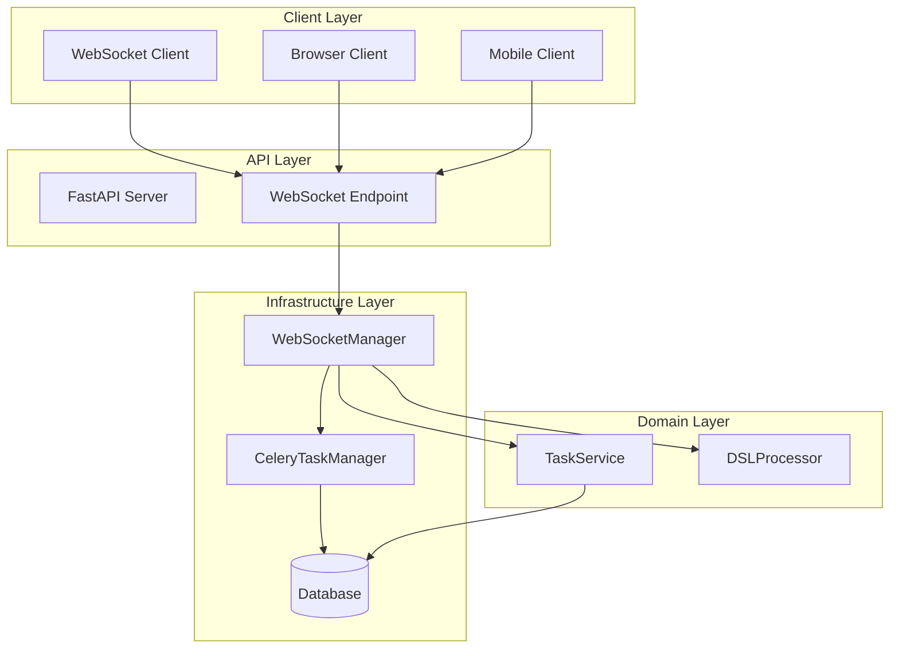
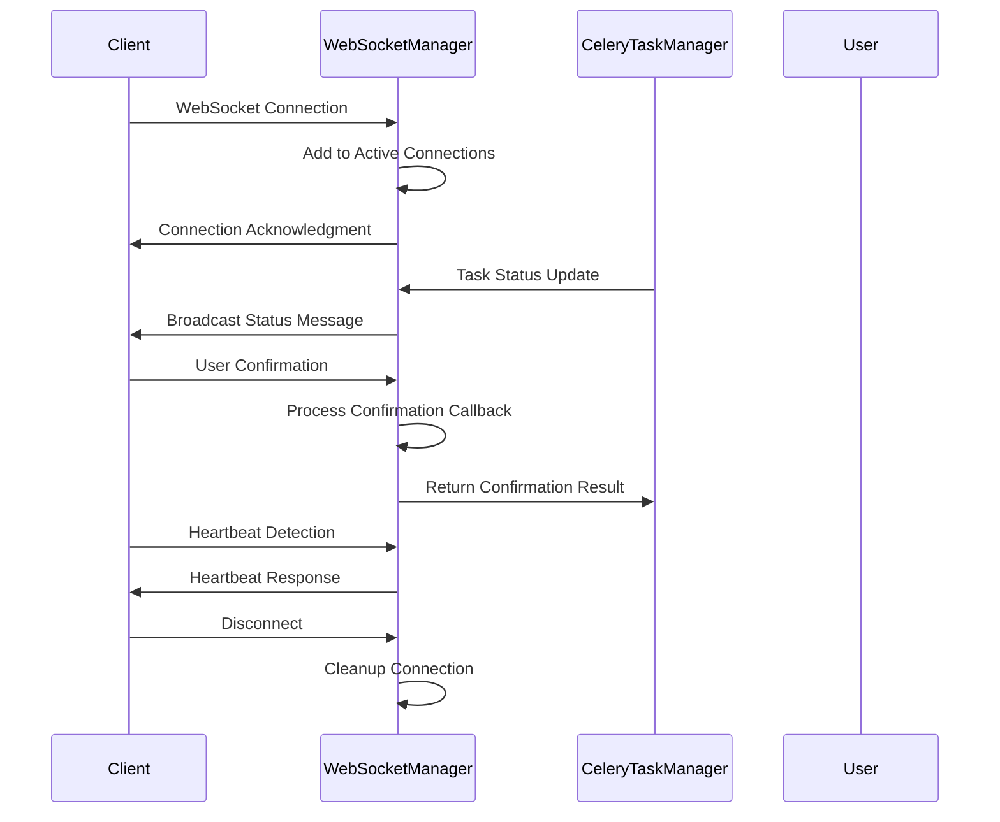
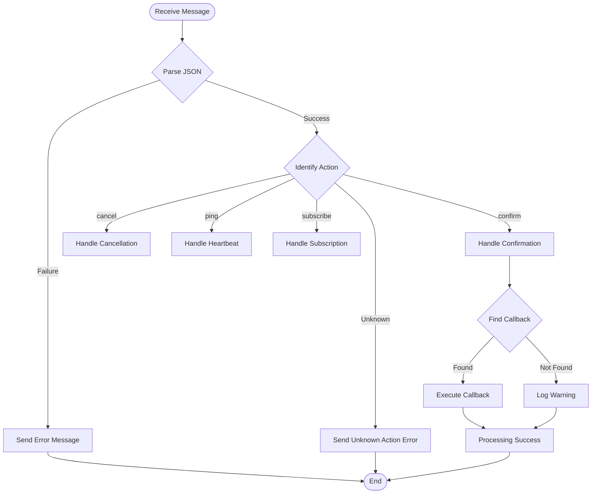
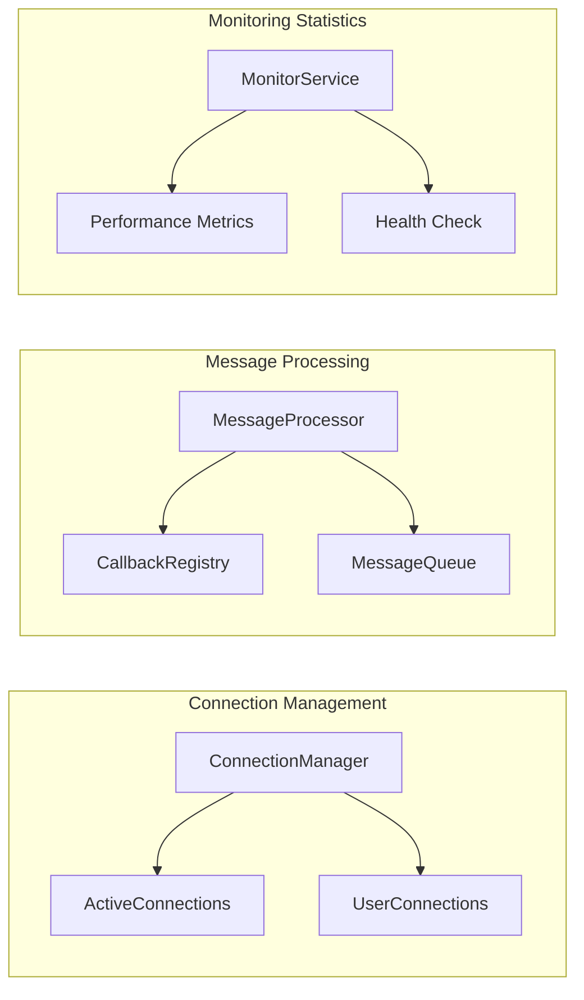

# WebSocketManager Technical Documentation

## 1. Overview

### Purpose
`WebSocketManager` is a component specifically designed for WebSocket server and client communication, built on Python's `websockets` library. It provides core functionalities including real-time bidirectional communication, user notifications, task status push, heartbeat detection, etc., serving as key infrastructure for the real-time communication layer in the AIECS system.

### Core Value
- **Real-Time Bidirectional Communication**: Supports real-time message passing between server and clients
- **User Interaction Management**: Provides interactive functionalities such as user confirmation and cancellation operations
- **Task Status Push**: Real-time push of task execution status and results to users
- **Connection Management**: Automatically manages WebSocket connection lifecycle
- **Heartbeat Detection**: Ensures connection stability and timely detection of disconnections

## 2. Problem Background & Design Motivation

### Problem Background
The AIECS system needs to handle a large number of long-running tasks that require user interaction, including:
- **Task Execution Confirmation**: Some tasks require user confirmation before continuing execution
- **Real-Time Status Updates**: Users need real-time understanding of task execution progress
- **Exception Handling Interaction**: When tasks encounter exceptions, users need to choose handling methods
- **Long-Running Task Monitoring**: For tasks with long execution times, connections need to remain active

### Design Motivation
1. **User Experience Optimization**: Provides real-time task status feedback to improve user experience
2. **Interactive Task Processing**: Supports task workflows that require user decisions
3. **Connection Stability**: Ensures communication stability through heartbeat detection and connection management
4. **Scalability**: Supports multi-user concurrent connections and message broadcasting
5. **Fault Tolerance**: Provides connection exception handling and automatic recovery mechanisms

## 3. Architecture Positioning & Context

### System Architecture Location
```
┌─────────────────────────────────────────────────────────────┐
│                    AIECS System Architecture                │
├─────────────────────────────────────────────────────────────┤
│  Client Layer (Web/Mobile)                                 │
│  ┌─────────────────┐  ┌─────────────────┐                  │
│  │ WebSocket Client│  │ HTTP Client     │                  │
│  └─────────────────┘  └─────────────────┘                  │
├─────────────────────────────────────────────────────────────┤
│  API Layer (FastAPI)                                       │
├─────────────────────────────────────────────────────────────┤
│  Infrastructure Layer                                      │
│  ┌─────────────────┐  ┌─────────────────┐                  │
│  │ WebSocketManager│  │ CeleryTaskManager│                 │
│  └─────────────────┘  └─────────────────┘                  │
├─────────────────────────────────────────────────────────────┤
│  Domain Layer (Task, Execution)                            │
└─────────────────────────────────────────────────────────────┘
```

### Upstream Callers
- **TaskService**: Task management service that needs to push task status updates
- **DSLProcessor**: DSL processor that requires user confirmation and interaction
- **API Controllers**: REST API controllers that handle WebSocket-related requests
- **CeleryTaskManager**: Task executor that needs to push execution status in real-time

### Downstream Dependencies
- **WebSocket Clients**: Browser, mobile applications, and other clients
- **TaskStepResult**: Task step result model
- **UserConfirmation**: User confirmation model
- **asyncio**: Asynchronous event loop

## 4. Core Features & Use Cases

### 4.1 WebSocket Server Management

#### Starting and Stopping Server
```python
# Create WebSocket manager
ws_manager = WebSocketManager(host="0.0.0.0", port=8765)

# Start server
await ws_manager.start_server()
print("WebSocket server started")

# Stop server
await ws_manager.stop_server()
print("WebSocket server stopped")
```

#### Server Status Monitoring
```python
# Get server status
status = ws_manager.get_status()
print(f"Server running status: {status['running']}")
print(f"Active connections: {status['active_connections']}")
print(f"Pending callbacks: {status['pending_callbacks']}")
```

### 4.2 User Notification and Interaction

#### Task Step Result Notification
```python
# Create task step result
step_result = TaskStepResult(
    step="data_validation",
    result={"validated_rows": 1000, "errors": 5},
    completed=True,
    message="Data validation completed, found 5 errors",
    status="completed"
)

# Notify user and wait for confirmation
confirmation = await ws_manager.notify_user(
    step_result=step_result,
    user_id="user_123",
    task_id="task_456",
    step=1
)

if confirmation.proceed:
    print("User confirmed to continue execution")
    print(f"User feedback: {confirmation.feedback}")
else:
    print("User cancelled execution")
```

#### Error Handling and User Choice
```python
# Handle task execution error
error_result = TaskStepResult(
    step="model_training",
    result=None,
    completed=False,
    message="Model training failed, retry?",
    status="failed",
    error_code="E003",
    error_message="GPU memory insufficient"
)

# Wait for user decision
confirmation = await ws_manager.notify_user(
    step_result=error_result,
    user_id="user_123",
    task_id="task_789",
    step=2
)

if confirmation.proceed:
    # User chose to retry
    await retry_task(task_id)
else:
    # User chose to cancel
    await cancel_task(task_id)
```

### 4.3 Real-Time Message Push

#### Broadcast Messages
```python
# Broadcast system notification
system_message = {
    "type": "system_notification",
    "message": "System will undergo maintenance in 5 minutes",
    "timestamp": time.time(),
    "severity": "warning"
}
await ws_manager.broadcast_message(system_message)

# Broadcast task status update
task_update = {
    "type": "task_progress",
    "task_id": "task_123",
    "progress": 75,
    "message": "Task execution progress 75%",
    "timestamp": time.time()
}
await ws_manager.broadcast_message(task_update)
```

#### User-Specific Messages
```python
# Send user-specific message
user_message = {
    "type": "personal_notification",
    "message": "Your task has been completed",
    "task_id": "task_456"
}
await ws_manager.send_to_user("user_123", user_message)
```

### 4.4 Heartbeat Detection and Connection Management

#### Heartbeat Detection
```python
# Start heartbeat detection
async def start_heartbeat():
    await ws_manager.send_heartbeat(
        user_id="user_123",
        task_id="task_456",
        interval=30  # 30 second interval
    )

# Run in background task
asyncio.create_task(start_heartbeat())
```

#### Connection Status Monitoring
```python
# Monitor connection status
def monitor_connections():
    connection_count = ws_manager.get_connection_count()
    print(f"Current active connections: {connection_count}")
    
    if connection_count == 0:
        print("Warning: No active WebSocket connections")
    elif connection_count > 100:
        print("Warning: Too many connections, may need load balancing")
```

### 4.5 Client Message Handling

#### Handling Client Confirmation
```python
# Client sends confirmation message
client_message = {
    "action": "confirm",
    "callback_id": "callback_123",
    "proceed": True,
    "feedback": "Agree to continue execution"
}

# Server automatically handles confirmation and calls corresponding callback
```

#### Handling Task Cancellation
```python
# Client sends cancellation request
cancel_message = {
    "action": "cancel",
    "user_id": "user_123",
    "task_id": "task_456"
}

# Server processes cancellation request and broadcasts cancellation notification
```

## 5. API Reference

### 5.1 Class Definition

#### `WebSocketManager`
```python
class WebSocketManager:
    """WebSocket server and client communication manager"""
    
    def __init__(self, host: str = "python-middleware-api", port: int = 8765) -> None
    """Initialize WebSocket manager
    
    Args:
        host: Server host address
        port: Server port number
    """
```

### 5.2 Data Models

#### `UserConfirmation`
```python
class UserConfirmation(BaseModel):
    """User confirmation model"""
    proceed: bool  # Whether to continue execution
    feedback: Optional[str] = None  # User feedback information
```

#### `TaskStepResult`
```python
class TaskStepResult(BaseModel):
    """Task step result model"""
    step: str  # Step name
    result: Any = None  # Execution result
    completed: bool = False  # Whether completed
    message: str  # Status message
    status: str  # Status
    error_code: Optional[str] = None  # Error code
    error_message: Optional[str] = None  # Error message
```

### 5.3 Public Methods

#### `start_server`
```python
async def start_server(self) -> Server
```
**Function**: Start WebSocket server

**Returns**:
- `Server`: WebSocket server instance

**Exceptions**:
- `Exception`: Server startup failed

#### `stop_server`
```python
async def stop_server(self) -> None
```
**Function**: Stop WebSocket server and close all connections

#### `notify_user`
```python
async def notify_user(
    self, 
    step_result: TaskStepResult, 
    user_id: str, 
    task_id: str, 
    step: int
) -> UserConfirmation
```
**Function**: Notify user of task step result and wait for confirmation

**Parameters**:
- `step_result` (TaskStepResult): Task step result
- `user_id` (str): User ID
- `task_id` (str): Task ID
- `step` (int): Step number

**Returns**:
- `UserConfirmation`: User confirmation result

#### `broadcast_message`
```python
async def broadcast_message(self, message: Dict[str, Any]) -> None
```
**Function**: Broadcast message to all connected clients

**Parameters**:
- `message` (Dict[str, Any]): Message to broadcast

#### `send_to_user`
```python
async def send_to_user(self, user_id: str, message: Dict[str, Any]) -> None
```
**Function**: Send message to specific user

**Parameters**:
- `user_id` (str): Target user ID
- `message` (Dict[str, Any]): Message to send

#### `send_heartbeat`
```python
async def send_heartbeat(
    self, 
    user_id: str, 
    task_id: str, 
    interval: int = 30
) -> None
```
**Function**: Send heartbeat message

**Parameters**:
- `user_id` (str): User ID
- `task_id` (str): Task ID
- `interval` (int): Heartbeat interval (seconds)

#### `get_connection_count`
```python
def get_connection_count(self) -> int
```
**Function**: Get current active connection count

**Returns**:
- `int`: Active connection count

#### `get_status`
```python
def get_status(self) -> Dict[str, Any]
```
**Function**: Get WebSocket manager status

**Returns**:
- `Dict[str, Any]`: Status information dictionary

## 6. Technical Implementation Details

### 6.1 Connection Management Mechanism

#### Connection Lifecycle Management
```python
async def _handle_client_connection(self, websocket: ServerConnection, path: str):
    """Handle client connection"""
    # 1. Add connection to active connections set
    self.active_connections.add(websocket)
    
    try:
        # 2. Handle message loop
        async for message in websocket:
            await self._handle_client_message(websocket, message)
    except websockets.exceptions.ConnectionClosed:
        # 3. Handle connection close
        logger.info(f"WebSocket connection closed: {websocket.remote_address}")
    finally:
        # 4. Cleanup connection
        self.active_connections.discard(websocket)
        if not websocket.closed:
            await websocket.close()
```

#### Connection Status Monitoring
```python
def get_connection_count(self) -> int:
    """Get active connection count (filter closed connections)"""
    return len([conn for conn in self.active_connections if not conn.closed])
```

### 6.2 Message Handling Mechanism

#### Message Routing System
```python
async def _handle_client_message(self, websocket: ServerConnection, message: str):
    """Handle client message"""
    try:
        data = json.loads(message)
        action = data.get("action")
        
        # Route to corresponding handler based on action type
        if action == "confirm":
            await self._handle_confirmation(data)
        elif action == "cancel":
            await self._handle_cancellation(data)
        elif action == "ping":
            await self._handle_ping(websocket, data)
        elif action == "subscribe":
            await self._handle_subscription(websocket, data)
        else:
            await self._send_error(websocket, f"Unknown action: {action}")
    except json.JSONDecodeError:
        await self._send_error(websocket, "Invalid JSON format")
```

#### Callback Registration Mechanism
```python
async def notify_user(self, step_result: TaskStepResult, user_id: str, task_id: str, step: int):
    """Notify user and wait for confirmation"""
    callback_id = str(uuid.uuid4())
    confirmation_future = asyncio.Future()
    
    # Register callback function
    self.callback_registry[callback_id] = lambda confirmation: confirmation_future.set_result(confirmation)
    
    # Send notification
    notification_data = {
        "type": "task_step_result",
        "callback_id": callback_id,
        # ... other data
    }
    await self.broadcast_message(notification_data)
    
    # Wait for user confirmation (with timeout)
    try:
        return await asyncio.wait_for(confirmation_future, timeout=300)
    except asyncio.TimeoutError:
        # Timeout handling
        self.callback_registry.pop(callback_id, None)
        return UserConfirmation(proceed=True)  # Default continue
```

### 6.3 Error Handling Strategy

#### Layered Error Handling
```python
async def _handle_client_message(self, websocket: ServerConnection, message: str):
    """Handle client message (with error handling)"""
    try:
        # 1. JSON parsing error
        data = json.loads(message)
    except json.JSONDecodeError as e:
        logger.error(f"Invalid JSON received: {e}")
        await self._send_error(websocket, "Invalid JSON format")
        return
    
    try:
        # 2. Message processing error
        await self._process_message(websocket, data)
    except Exception as e:
        logger.error(f"Error processing client message: {e}")
        await self._send_error(websocket, f"Internal error: {str(e)}")
```

#### Connection Exception Handling
```python
async def _send_to_client(self, websocket: ServerConnection, data: Dict[str, Any]):
    """Send data to client (with exception handling)"""
    try:
        if not websocket.closed:
            await websocket.send(json.dumps(data))
    except Exception as e:
        logger.error(f"Failed to send message to client: {e}")
        # Optionally remove from active connections
        self.active_connections.discard(websocket)
```

### 6.4 Concurrency Control Mechanism

#### Asynchronous Message Broadcasting
```python
async def broadcast_message(self, message: Dict[str, Any]):
    """Broadcast message to all connected clients"""
    if not self.active_connections:
        return
    
    # Filter closed connections
    active_connections = [conn for conn in self.active_connections if not conn.closed]
    self.active_connections = set(active_connections)
    
    if active_connections:
        # Concurrently send to all connections
        await asyncio.gather(
            *[self._send_to_client(conn, message) for conn in active_connections],
            return_exceptions=True  # Ignore individual connection send errors
        )
```

#### Callback Timeout Control
```python
# Callback timeout handling
try:
    return await asyncio.wait_for(confirmation_future, timeout=300)  # 5 minute timeout
except asyncio.TimeoutError:
    logger.warning(f"User confirmation timeout: {callback_id}")
    self.callback_registry.pop(callback_id, None)
    return UserConfirmation(proceed=True)  # Default continue execution
```

## 7. Configuration & Deployment

### 7.1 Basic Configuration

#### Server Configuration
```python
# Basic configuration
ws_manager = WebSocketManager(
    host="0.0.0.0",  # Listen on all interfaces
    port=8765        # WebSocket port
)

# Production environment configuration
production_config = {
    "host": "0.0.0.0",
    "port": 8765,
    "max_connections": 1000,
    "ping_interval": 30,
    "ping_timeout": 10
}
```

#### Environment Variable Support
```bash
# WebSocket server configuration
export WEBSOCKET_HOST="0.0.0.0"
export WEBSOCKET_PORT="8765"
export WEBSOCKET_MAX_CONNECTIONS="1000"

# Heartbeat configuration
export WEBSOCKET_PING_INTERVAL="30"
export WEBSOCKET_PING_TIMEOUT="10"

# Timeout configuration
export WEBSOCKET_CALLBACK_TIMEOUT="300"
```

### 7.2 Docker Deployment

#### Dockerfile Configuration
```dockerfile
FROM python:3.9-slim

WORKDIR /app
COPY requirements.txt .
RUN pip install -r requirements.txt

COPY . .

# Expose WebSocket port
EXPOSE 8765

# Start command
CMD ["python", "-m", "aiecs.infrastructure.messaging.websocket_manager"]
```

#### Docker Compose Configuration
```yaml
version: '3.8'
services:
  websocket-server:
    build: .
    ports:
      - "8765:8765"
    environment:
      - WEBSOCKET_HOST=0.0.0.0
      - WEBSOCKET_PORT=8765
      - WEBSOCKET_MAX_CONNECTIONS=1000
    volumes:
      - ./logs:/app/logs
    restart: unless-stopped
```

### 7.3 Load Balancing Configuration

#### Nginx Configuration
```nginx
upstream websocket_backend {
    server websocket1:8765;
    server websocket2:8765;
    server websocket3:8765;
}

server {
    listen 80;
    server_name your-domain.com;
    
    location /ws/ {
        proxy_pass http://websocket_backend;
        proxy_http_version 1.1;
        proxy_set_header Upgrade $http_upgrade;
        proxy_set_header Connection "upgrade";
        proxy_set_header Host $host;
        proxy_set_header X-Real-IP $remote_addr;
        proxy_set_header X-Forwarded-For $proxy_add_x_forwarded_for;
        proxy_set_header X-Forwarded-Proto $scheme;
        
        # WebSocket specific configuration
        proxy_read_timeout 86400;
        proxy_send_timeout 86400;
    }
}
```

### 7.4 Monitoring and Logging Configuration

#### Logging Configuration
```python
import logging

# Configure WebSocket logging
logging.basicConfig(
    level=logging.INFO,
    format='%(asctime)s - %(name)s - %(levelname)s - %(message)s',
    handlers=[
        logging.FileHandler('websocket.log'),
        logging.StreamHandler()
    ]
)

# Set WebSocket specific log level
logger = logging.getLogger('websockets')
logger.setLevel(logging.WARNING)
```

#### Monitoring Metrics
```python
# Monitoring metrics collection
def collect_metrics():
    status = ws_manager.get_status()
    metrics = {
        "websocket_connections": status["active_connections"],
        "websocket_running": status["running"],
        "pending_callbacks": status["pending_callbacks"],
        "timestamp": time.time()
    }
    return metrics
```

## 8. Maintenance & Troubleshooting

### 8.1 Monitoring Metrics

#### Key Metrics
- **Connection Count**: Current active WebSocket connection count
- **Message Throughput**: Number of messages processed per second
- **Connection Success Rate**: Proportion of successfully established connections
- **Message Latency**: Average latency from message send to receive
- **Error Rate**: Proportion of failed message processing

#### Monitoring Implementation
```python
class WebSocketMonitor:
    def __init__(self, ws_manager: WebSocketManager):
        self.ws_manager = ws_manager
        self.metrics = {
            "total_connections": 0,
            "failed_connections": 0,
            "messages_sent": 0,
            "messages_failed": 0,
            "avg_response_time": 0
        }
    
    def get_health_status(self) -> Dict[str, Any]:
        """Get health status"""
        status = self.ws_manager.get_status()
        return {
            "status": "healthy" if status["running"] else "unhealthy",
            "active_connections": status["active_connections"],
            "pending_callbacks": status["pending_callbacks"],
            "metrics": self.metrics,
            "timestamp": time.time()
        }
```

### 8.2 Common Issues & Solutions

#### Issue 1: Frequent Connection Drops
**Symptoms**: Client connections are established but quickly dropped, unable to maintain long connections

**Possible Causes**:
- Unstable network or firewall settings
- Improper heartbeat detection configuration
- Insufficient server resources

**Solutions**:
```python
# 1. Adjust heartbeat configuration
ws_manager = WebSocketManager(host="0.0.0.0", port=8765)

# 2. Increase heartbeat frequency
await ws_manager.send_heartbeat(
    user_id="user_123",
    task_id="task_456",
    interval=10  # Reduce to 10 seconds
)

# 3. Check network connection
import socket
sock = socket.socket(socket.AF_INET, socket.SOCK_STREAM)
result = sock.connect_ex(('localhost', 8765))
if result != 0:
    print("WebSocket port unreachable")
```

#### Issue 2: Message Loss
**Symptoms**: Sent messages are not received by clients

**Possible Causes**:
- Connection disconnected but not detected in time
- Message serialization failure
- Network packet loss

**Solutions**:
```python
# 1. Enhance message sending reliability
async def reliable_send(self, websocket: ServerConnection, data: Dict[str, Any]):
    """Reliable message sending"""
    max_retries = 3
    for attempt in range(max_retries):
        try:
            if not websocket.closed:
                await websocket.send(json.dumps(data))
                return True
        except Exception as e:
            logger.warning(f"Failed to send message (attempt {attempt + 1}/{max_retries}): {e}")
            if attempt < max_retries - 1:
                await asyncio.sleep(0.1)  # Brief wait before retry
    return False

# 2. Implement message acknowledgment mechanism
async def send_with_ack(self, websocket: ServerConnection, data: Dict[str, Any]):
    """Message sending with acknowledgment"""
    message_id = str(uuid.uuid4())
    data["message_id"] = message_id
    data["requires_ack"] = True
    
    if await self.reliable_send(websocket, data):
        # Wait for acknowledgment
        try:
            ack = await asyncio.wait_for(
                self.wait_for_ack(message_id), 
                timeout=5.0
            )
            return ack
        except asyncio.TimeoutError:
            logger.error(f"Message acknowledgment timeout: {message_id}")
            return False
    return False
```

#### Issue 3: Memory Leak
**Symptoms**: Server memory usage continuously increases

**Possible Causes**:
- Callback registry not cleaned up
- Connection objects not properly released
- Message queue backlog

**Solutions**:
```python
# 1. Periodically clean callback registry
async def cleanup_callbacks(self):
    """Clean up expired callbacks"""
    current_time = time.time()
    expired_callbacks = []
    
    for callback_id, callback_data in self.callback_registry.items():
        if current_time - callback_data["timestamp"] > 300:  # 5 minute expiration
            expired_callbacks.append(callback_id)
    
    for callback_id in expired_callbacks:
        del self.callback_registry[callback_id]
        logger.info(f"Cleaned up expired callback: {callback_id}")

# 2. Limit connection count
class WebSocketManager:
    def __init__(self, host: str, port: int, max_connections: int = 1000):
        self.max_connections = max_connections
        # ... other initialization
    
    async def _handle_client_connection(self, websocket: ServerConnection, path: str):
        """Handle client connection (with connection limit)"""
        if len(self.active_connections) >= self.max_connections:
            await websocket.close(code=1013, reason="Server connection limit reached")
            return
        
        # Normal connection handling
        # ...
```

#### Issue 4: High Concurrency Performance Issues
**Symptoms**: Response slows down under high concurrency, message latency increases

**Possible Causes**:
- Single thread handling all connections
- Inefficient message broadcasting
- Resource contention

**Solutions**:
```python
# 1. Use connection pool
class ConnectionPool:
    def __init__(self, max_size: int = 1000):
        self.connections = {}
        self.max_size = max_size
    
    def add_connection(self, user_id: str, websocket: ServerConnection):
        if len(self.connections) < self.max_size:
            self.connections[user_id] = websocket
            return True
        return False
    
    def remove_connection(self, user_id: str):
        self.connections.pop(user_id, None)
    
    def get_connection(self, user_id: str) -> Optional[ServerConnection]:
        return self.connections.get(user_id)

# 2. Optimize message broadcasting
async def optimized_broadcast(self, message: Dict[str, Any]):
    """Optimized message broadcasting"""
    if not self.active_connections:
        return
    
    # Process connections in batches
    batch_size = 100
    connections = list(self.active_connections)
    
    for i in range(0, len(connections), batch_size):
        batch = connections[i:i + batch_size]
        await asyncio.gather(
            *[self._send_to_client(conn, message) for conn in batch],
            return_exceptions=True
        )
```

### 8.3 Performance Optimization Recommendations

#### Connection Management Optimization
```python
# 1. Implement connection reuse
class ConnectionManager:
    def __init__(self):
        self.user_connections = {}  # user_id -> websocket
        self.connection_users = {}  # websocket -> user_id
    
    def add_connection(self, user_id: str, websocket: ServerConnection):
        # If user already has connection, close old connection
        if user_id in self.user_connections:
            old_websocket = self.user_connections[user_id]
            asyncio.create_task(old_websocket.close())
        
        self.user_connections[user_id] = websocket
        self.connection_users[websocket] = user_id
    
    def remove_connection(self, websocket: ServerConnection):
        if websocket in self.connection_users:
            user_id = self.connection_users[websocket]
            del self.user_connections[user_id]
            del self.connection_users[websocket]
```

#### Message Processing Optimization
```python
# 2. Implement message queue
import asyncio
from collections import deque

class MessageQueue:
    def __init__(self, max_size: int = 10000):
        self.queue = asyncio.Queue(maxsize=max_size)
        self.processing = False
    
    async def put_message(self, message: Dict[str, Any]):
        """Add message to queue"""
        try:
            await asyncio.wait_for(
                self.queue.put(message), 
                timeout=1.0
            )
        except asyncio.TimeoutError:
            logger.warning("Message queue full, dropping message")
    
    async def process_messages(self):
        """Process message queue"""
        self.processing = True
        while self.processing:
            try:
                message = await asyncio.wait_for(
                    self.queue.get(), 
                    timeout=1.0
                )
                await self._handle_message(message)
            except asyncio.TimeoutError:
                continue
            except Exception as e:
                logger.error(f"Error processing message: {e}")
```

## 9. Visualizations

### 9.1 System Architecture Diagram



### 9.2 WebSocket Connection Flow Diagram



### 9.3 Message Processing Flow Diagram



### 9.4 Connection Management Architecture Diagram



## 10. Version History

### v1.0.0 (2024-01-15)
**New Features**:
- Basic WebSocket server implementation
- Support for client connection management
- Implement message broadcasting functionality
- Add heartbeat detection mechanism

**Technical Features**:
- Built on websockets library
- Support asynchronous message processing
- Implement connection lifecycle management
- Provide basic error handling

### v1.1.0 (2024-02-01)
**Feature Enhancements**:
- Add user confirmation mechanism
- Implement task status push
- Support user-specific message sending
- Add connection status monitoring

**Performance Optimizations**:
- Optimize message broadcasting efficiency
- Improve connection management strategy
- Enhance error handling mechanism

### v1.2.0 (2024-03-01)
**New Features**:
- Support callback registration and timeout handling
- Add task cancellation functionality
- Implement subscription mechanism
- Support message acknowledgment mechanism

**Stability Improvements**:
- Enhance connection exception handling
- Improve memory management
- Optimize concurrency performance

### v1.3.0 (2024-04-01)
**Architecture Upgrades**:
- Upgrade to websockets 11.x
- Support WebSocket subprotocols
- Add message compression support
- Implement connection pool management

**Monitoring Enhancements**:
- Add detailed performance metrics
- Implement health check interface
- Support Prometheus metrics export
- Add connection quality monitoring

---

## Appendix

### A. Related Documentation
- [Celery Task Manager Documentation](./CELERY_TASK_MANAGER.md)
- [Task Execution Model Documentation](../DOMAIN_EXECUTION/EXECUTION_MODELS.md)
- [System Configuration Guide](../CONFIG/CONFIG_MANAGEMENT.md)

### B. External Dependencies
- [WebSockets Official Documentation](https://websockets.readthedocs.io/)
- [Pydantic Official Documentation](https://pydantic-docs.helpmanual.io/)
- [Python asyncio Documentation](https://docs.python.org/3/library/asyncio.html)

### C. Client Examples
```javascript
// JavaScript WebSocket client example
const ws = new WebSocket('ws://localhost:8765');

ws.onopen = function(event) {
    console.log('WebSocket connection established');
    
    // Send heartbeat
    setInterval(() => {
        ws.send(JSON.stringify({
            action: 'ping',
            timestamp: Date.now()
        }));
    }, 30000);
};

ws.onmessage = function(event) {
    const data = JSON.parse(event.data);
    console.log('Message received:', data);
    
    // Handle task confirmation
    if (data.type === 'task_step_result') {
        const proceed = confirm(data.message);
        ws.send(JSON.stringify({
            action: 'confirm',
            callback_id: data.callback_id,
            proceed: proceed,
            feedback: proceed ? 'Agree to continue' : 'Cancel execution'
        }));
    }
};

ws.onclose = function(event) {
    console.log('WebSocket connection closed');
};
```

### D. Contact Information
- Technical Lead: AIECS Development Team
- Issue Reporting: Through project Issue system
- Documentation Updates: Regular maintenance, version synchronization
