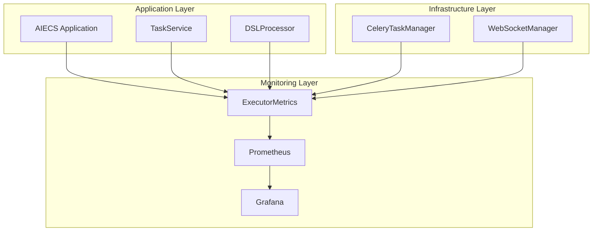
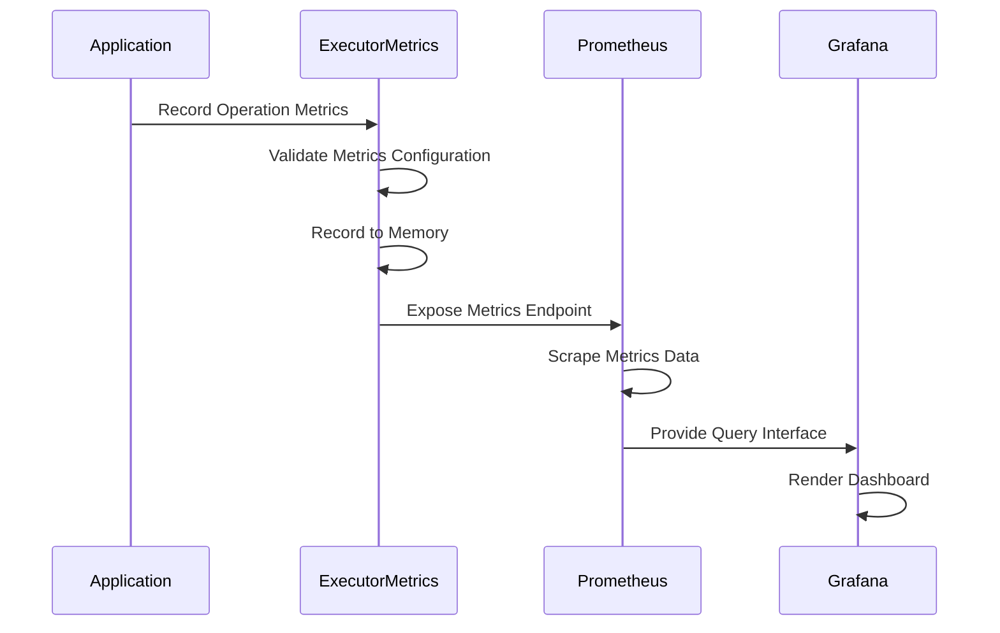
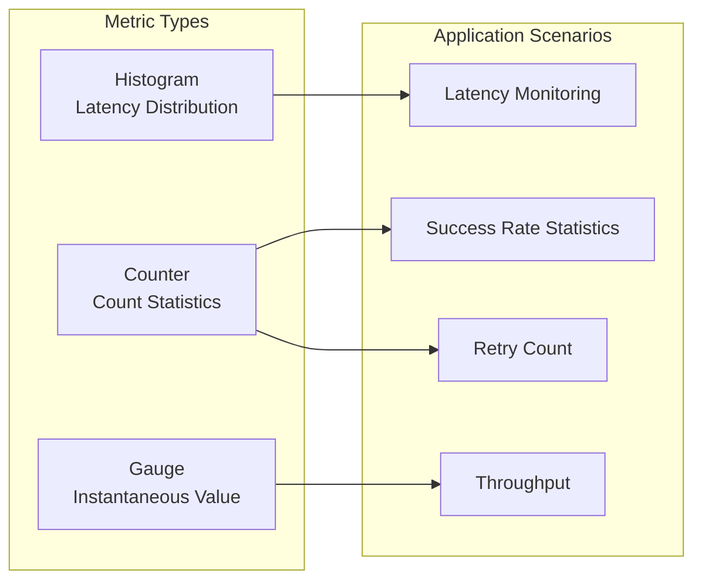
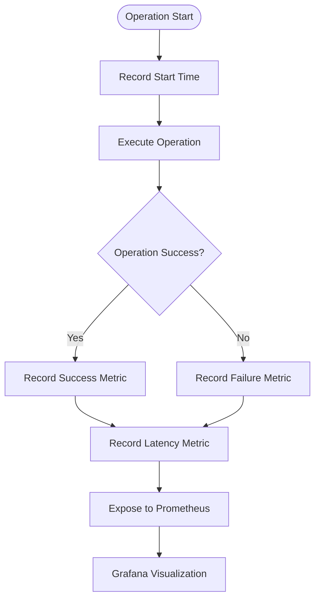

# ExecutorMetrics Technical Documentation

## 1. Overview

### Purpose
`ExecutorMetrics` is a component specifically designed for executor performance monitoring and metrics collection, built on the Prometheus client library. It provides collection, recording, and exposure of key performance metrics such as task execution latency, success rate, retry count, etc., serving as core infrastructure for monitoring and observability in the AIECS system.

### Core Value
- **Performance Monitoring**: Real-time monitoring of key metrics such as task execution latency and success rate
- **Observability**: Provides comprehensive visibility of system operational status
- **Problem Diagnosis**: Quickly locate performance bottlenecks and anomalies through metrics data
- **Capacity Planning**: Predict system capacity requirements based on historical data
- **SLA Assurance**: Ensure system meets service level agreement requirements

## 2. Problem Background & Design Motivation

### Problem Background
In the AIECS system, a large number of complex task executions need to be handled, including:
- **Performance Bottleneck Identification**: Unable to quickly identify which task types or operations cause performance issues
- **System Health Monitoring**: Lack of real-time monitoring of overall system operational status
- **Capacity Planning Difficulties**: Unable to predict system load and resource requirements based on historical data
- **Complex Troubleshooting**: Difficult to quickly locate root causes when problems occur
- **Missing SLA Monitoring**: Unable to quantify whether the system meets service level agreements

### Design Motivation
1. **Performance Optimization**: Identify performance bottlenecks through metrics data to guide system optimization
2. **Fault Prevention**: Discover potential issues early through monitoring metrics
3. **Capacity Management**: Develop capacity planning strategies based on historical data
4. **Operational Efficiency**: Provide automated monitoring and alerting capabilities
5. **Business Insights**: Understand business usage patterns through metrics data

## 3. Architecture Positioning & Context

### System Architecture Location
```
┌─────────────────────────────────────────────────────────────┐
│                    AIECS System Architecture                │
├─────────────────────────────────────────────────────────────┤
│  Monitoring Layer                                           │
│  ┌─────────────────┐  ┌─────────────────┐                  │
│  │ ExecutorMetrics │  │ Prometheus      │                  │
│  └─────────────────┘  └─────────────────┘                  │
├─────────────────────────────────────────────────────────────┤
│  Infrastructure Layer                                      │
│  ┌─────────────────┐  ┌─────────────────┐                  │
│  │ CeleryTaskManager│  │ WebSocketManager│                 │
│  └─────────────────┘  └─────────────────┘                  │
├─────────────────────────────────────────────────────────────┤
│  Domain Layer                                              │
│  ┌─────────────────┐  ┌─────────────────┐                  │
│  │ TaskService     │  │ DSLProcessor    │                  │
│  └─────────────────┘  └─────────────────┘                  │
└─────────────────────────────────────────────────────────────┘
```

### Upstream Callers
- **TaskService**: Task management service that needs to monitor task execution performance
- **DSLProcessor**: DSL processor that needs to monitor plan generation and execution performance
- **CeleryTaskManager**: Task executor that needs to monitor task execution metrics
- **WebSocketManager**: WebSocket manager that needs to monitor connection performance

### Downstream Dependencies
- **Prometheus**: Metrics collection and storage system
- **Grafana**: Metrics visualization and dashboards
- **AlertManager**: Alert system based on metrics
- **prometheus_client**: Python Prometheus client library

## 4. Core Features & Use Cases

### 4.1 Metrics Collection and Recording

#### Latency Metrics Recording
```python
# Create metrics collector
metrics = ExecutorMetrics(enable_metrics=True, metrics_port=8001)

# Record intent parsing latency
start_time = time.time()
intent_result = await parse_user_intent(user_input)
duration = time.time() - start_time
metrics.record_operation_latency("intent", duration)

# Record task planning latency
start_time = time.time()
plan = await generate_task_plan(intent_result)
duration = time.time() - start_time
metrics.record_operation_latency("plan", duration)

# Record task execution latency (with labels)
start_time = time.time()
result = await execute_task(task_data)
duration = time.time() - start_time
metrics.record_operation_latency("execute", duration)
```

#### Success Rate Metrics Recording
```python
# Record successful operations
try:
    result = await process_task(task_data)
    metrics.record_operation_success("execute", labels={"task_type": "data_processing"})
except Exception as e:
    metrics.record_operation_failure("execute", "execution_error", 
                                   labels={"task_type": "data_processing"})

# Record retry count
for attempt in range(max_retries):
    try:
        result = await retry_operation()
        break
    except Exception:
        metrics.record_retry("execute", attempt + 1)
```

### 4.2 Decorator Monitoring

#### Automatic Monitoring with Decorator
```python
# Use decorator to monitor function performance
@metrics.with_metrics("intent_parsing")
async def parse_user_intent(user_input: str) -> Dict[str, Any]:
    """Parse user intent"""
    # Function execution logic
    return intent_result

@metrics.with_metrics("task_planning", labels={"plan_type": "complex"})
async def generate_complex_plan(intent: Dict[str, Any]) -> List[Dict[str, Any]]:
    """Generate complex task plan"""
    # Plan generation logic
    return plan_steps

# Monitoring with labels
@metrics.with_metrics("task_execution", labels={"task_type": "ml_training"})
async def execute_ml_training(data: Dict[str, Any]) -> Dict[str, Any]:
    """Execute machine learning training task"""
    # Training logic
    return training_result
```

### 4.3 Comprehensive Operation Recording

#### Record Complete Operation Metrics
```python
# Record complete operation metrics
async def process_user_request(user_input: str, user_id: str):
    """Complete process for handling user request"""
    start_time = time.time()
    
    try:
        # 1. Intent parsing
        intent_start = time.time()
        intent = await parse_user_intent(user_input)
        intent_duration = time.time() - intent_start
        
        # 2. Task planning
        plan_start = time.time()
        plan = await generate_task_plan(intent)
        plan_duration = time.time() - plan_start
        
        # 3. Task execution
        execute_start = time.time()
        result = await execute_task(plan)
        execute_duration = time.time() - execute_start
        
        # Record success metrics
        metrics.record_operation("intent", success=True, duration=intent_duration)
        metrics.record_operation("plan", success=True, duration=plan_duration)
        metrics.record_operation("execute", success=True, duration=execute_duration,
                               labels={"task_type": plan.get("type", "unknown")})
        
        return result
        
    except Exception as e:
        # Record failure metrics
        total_duration = time.time() - start_time
        metrics.record_operation("intent", success=False, duration=intent_duration,
                               error_type=type(e).__name__)
        raise
```

### 4.4 Custom Metrics Recording

#### Business-Specific Metrics
```python
# Record business-specific metrics
class BusinessMetrics:
    def __init__(self, base_metrics: ExecutorMetrics):
        self.base_metrics = base_metrics
    
    async def record_user_engagement(self, user_id: str, action: str, duration: float):
        """Record user engagement metrics"""
        self.base_metrics.record_operation(
            "user_engagement",
            success=True,
            duration=duration,
            labels={"action": action, "user_id": user_id}
        )
    
    async def record_data_processing_volume(self, data_size: int, processing_time: float):
        """Record data processing volume metrics"""
        self.base_metrics.record_operation(
            "data_processing",
            success=True,
            duration=processing_time,
            labels={"data_size_category": self._categorize_data_size(data_size)}
        )
    
    def _categorize_data_size(self, size: int) -> str:
        """Categorize by data size"""
        if size < 1024:
            return "small"
        elif size < 1024 * 1024:
            return "medium"
        else:
            return "large"
```

### 4.5 Metrics Query and Monitoring

#### Get Metrics Summary
```python
# Get metrics summary information
summary = metrics.get_metrics_summary()
print(f"Metrics enabled status: {summary['metrics_enabled']}")
print(f"Metrics port: {summary['metrics_port']}")
print(f"Available metrics: {summary['available_metrics']}")

# Check if specific metric is available
if "intent_latency" in metrics.metrics:
    print("Intent parsing latency metric enabled")
```

#### Prometheus Metrics Query Examples
```promql
# Query intent parsing average latency
rate(intent_latency_seconds_sum[5m]) / rate(intent_latency_seconds_count[5m])

# Query task execution success rate
rate(execute_success_total[5m]) / (rate(execute_success_total[5m]) + rate(execute_retries_total[5m]))

# Query execution latency grouped by task type
histogram_quantile(0.95, rate(execute_latency_seconds_bucket[5m]) by (le, task_type))
```

## 5. API Reference

### 5.1 Class Definition

#### `ExecutorMetrics`
```python
class ExecutorMetrics:
    """Executor performance monitoring and metrics collector"""
    
    def __init__(self, enable_metrics: bool = True, metrics_port: int = 8001) -> None
    """Initialize metrics collector
    
    Args:
        enable_metrics: Whether to enable metrics collection
        metrics_port: Prometheus metrics server port
    """
```

### 5.2 Public Methods

#### `record_operation_latency`
```python
def record_operation_latency(self, operation: str, duration: float) -> None
```
**Function**: Record operation latency

**Parameters**:
- `operation` (str): Operation name
- `duration` (float): Operation duration (seconds)

#### `record_operation_success`
```python
def record_operation_success(self, operation: str, labels: Optional[Dict[str, str]] = None) -> None
```
**Function**: Record operation success

**Parameters**:
- `operation` (str): Operation name
- `labels` (Optional[Dict[str, str]]): Labels dictionary

#### `record_operation_failure`
```python
def record_operation_failure(self, operation: str, error_type: str, labels: Optional[Dict[str, str]] = None) -> None
```
**Function**: Record operation failure

**Parameters**:
- `operation` (str): Operation name
- `error_type` (str): Error type
- `labels` (Optional[Dict[str, str]]): Labels dictionary

#### `record_retry`
```python
def record_retry(self, operation: str, attempt_number: int) -> None
```
**Function**: Record retry count

**Parameters**:
- `operation` (str): Operation name
- `attempt_number` (int): Attempt number

#### `with_metrics`
```python
def with_metrics(self, metric_name: str, labels: Optional[Dict[str, str]] = None) -> Callable
```
**Function**: Monitoring decorator

**Parameters**:
- `metric_name` (str): Metric name
- `labels` (Optional[Dict[str, str]]): Labels dictionary

**Returns**:
- `Callable`: Decorator function

#### `get_metrics_summary`
```python
def get_metrics_summary(self) -> Dict[str, Any]
```
**Function**: Get metrics summary

**Returns**:
- `Dict[str, Any]`: Metrics summary information

#### `record_operation`
```python
def record_operation(self, operation_type: str, success: bool = True, duration: Optional[float] = None, **kwargs) -> None
```
**Function**: Record comprehensive operation metrics

**Parameters**:
- `operation_type` (str): Operation type
- `success` (bool): Whether successful
- `duration` (Optional[float]): Operation duration
- `**kwargs`: Other parameters (labels, error_type, etc.)

#### `record_duration`
```python
def record_duration(self, operation: str, duration: float, labels: Optional[Dict[str, str]] = None) -> None
```
**Function**: Record operation duration

**Parameters**:
- `operation` (str): Operation name
- `duration` (float): Duration
- `labels` (Optional[Dict[str, str]]): Labels dictionary

## 6. Technical Implementation Details

### 6.1 Prometheus Metric Types

#### Histogram Metrics
```python
# Latency metrics use Histogram type
"intent_latency": Histogram("intent_latency_seconds", "Latency of intent parsing"),
"plan_latency": Histogram("plan_latency_seconds", "Latency of task planning"),
"execute_latency": Histogram("execute_latency_seconds", "Latency of task execution", ["task_type"])

# Histogram automatically provides the following metrics:
# - intent_latency_seconds_count: Total request count
# - intent_latency_seconds_sum: Total latency time
# - intent_latency_seconds_bucket: Bucket statistics
```

#### Counter Metrics
```python
# Count metrics use Counter type
"intent_success": Counter("intent_success_total", "Number of successful intent parsings"),
"intent_retries": Counter("intent_retries_total", "Number of intent parsing retries"),
"execute_success": Counter("execute_success_total", "Number of successful executions", ["task_type"])

# Counter only increases, suitable for counting successes, retries, etc.
```

### 6.2 Decorator Implementation Mechanism

#### Async Function Monitoring
```python
def with_metrics(self, metric_name: str, labels: Optional[Dict[str, str]] = None):
    """Monitoring decorator implementation"""
    def decorator(func):
        @functools.wraps(func)
        async def wrapper(*args, **kwargs):
            if not self.metrics or f"{metric_name}_latency" not in self.metrics:
                return await func(*args, **kwargs)

            labels_dict = labels or {}
            metric = self.metrics[f"{metric_name}_latency"]
            if labels:
                metric = metric.labels(**labels_dict)

            # Use context manager to automatically record time
            with metric.time():
                try:
                    result = await func(*args, **kwargs)
                    # Record success metric
                    if f"{metric_name}_success" in self.metrics:
                        success_metric = self.metrics[f"{metric_name}_success"]
                        if labels:
                            success_metric = success_metric.labels(**labels_dict)
                        success_metric.inc()
                    return result
                except Exception as e:
                    logger.error(f"Error in {func.__name__}: {e}")
                    raise
        return wrapper
    return decorator
```

### 6.3 Label Management Mechanism

#### Dynamic Label Support
```python
def record_operation_success(self, operation: str, labels: Optional[Dict[str, str]] = None):
    """Record operation success (with label support)"""
    if not self.enable_metrics or f"{operation}_success" not in self.metrics:
        return
    
    metric = self.metrics[f"{operation}_success"]
    if labels:
        # Create labeled instance for labeled metrics
        metric = metric.labels(**labels)
    metric.inc()
```

#### Label Validation and Cleaning
```python
def _validate_labels(self, labels: Dict[str, str]) -> Dict[str, str]:
    """Validate and clean labels"""
    if not labels:
        return {}
    
    # Remove empty values and invalid characters
    cleaned_labels = {}
    for key, value in labels.items():
        if value and isinstance(value, str) and len(value.strip()) > 0:
            # Clean label value, remove special characters
            cleaned_value = re.sub(r'[^a-zA-Z0-9_:]', '_', str(value).strip())
            cleaned_labels[key] = cleaned_value
    
    return cleaned_labels
```

### 6.4 Error Handling Strategy

#### Metrics Recording Fault Tolerance
```python
def record_operation(self, operation_type: str, success: bool = True, duration: Optional[float] = None, **kwargs):
    """Record comprehensive operation metrics (with fault tolerance)"""
    if not self.enable_metrics:
        return

    try:
        # Record operation success/failure
        if success:
            self.record_operation_success(operation_type, kwargs.get('labels'))
        else:
            error_type = kwargs.get('error_type', 'unknown')
            self.record_operation_failure(operation_type, error_type, kwargs.get('labels'))

        # Record operation latency
        if duration is not None:
            self.record_operation_latency(operation_type, duration)

    except Exception as e:
        # Metrics recording failure should not affect business logic
        logger.warning(f"Failed to record operation metrics: {e}")
```

#### Metrics Initialization Fault Tolerance
```python
def _init_prometheus_metrics(self):
    """Initialize Prometheus metrics (with fault tolerance)"""
    try:
        start_http_server(self.metrics_port)
        self.metrics = {
            # Metric definitions...
        }
        logger.info(f"Prometheus metrics server started on port {self.metrics_port}")
    except Exception as e:
        logger.warning(f"Failed to start metrics server: {e}")
        # Degrade to no-metrics mode
        self.metrics = {}
        self.enable_metrics = False
```

### 6.5 Performance Optimization Mechanism

#### Conditional Check Optimization
```python
def record_operation_latency(self, operation: str, duration: float):
    """Record operation latency (optimized version)"""
    # Fast path: if metrics not enabled, return directly
    if not self.enable_metrics:
        return
    
    # Check if metric exists
    metric_key = f"{operation}_latency"
    if metric_key not in self.metrics:
        return
    
    # Record metric
    self.metrics[metric_key].observe(duration)
```

#### Batch Metrics Recording
```python
def record_batch_operations(self, operations: List[Dict[str, Any]]):
    """Batch record operation metrics"""
    if not self.enable_metrics:
        return
    
    for op in operations:
        try:
            if op.get('success', True):
                self.record_operation_success(
                    op['operation'], 
                    op.get('labels')
                )
            else:
                self.record_operation_failure(
                    op['operation'], 
                    op.get('error_type', 'unknown'),
                    op.get('labels')
                )
            
            if 'duration' in op:
                self.record_operation_latency(
                    op['operation'], 
                    op['duration']
                )
        except Exception as e:
            logger.warning(f"Failed to record batch operation: {e}")
```

## 7. Configuration & Deployment

### 7.1 Basic Configuration

#### Metrics Collector Configuration
```python
# Basic configuration
metrics = ExecutorMetrics(
    enable_metrics=True,
    metrics_port=8001
)

# Production environment configuration
production_metrics = ExecutorMetrics(
    enable_metrics=True,
    metrics_port=8001
)
```

#### Environment Variable Support
```bash
# Metrics configuration
export METRICS_ENABLED="true"
export METRICS_PORT="8001"
export METRICS_HOST="0.0.0.0"

# Prometheus configuration
export PROMETHEUS_ENDPOINT="http://prometheus:9090"
export PROMETHEUS_RETENTION="30d"
```

### 7.2 Docker Deployment

#### Dockerfile Configuration
```dockerfile
FROM python:3.9-slim

WORKDIR /app
COPY requirements.txt .
RUN pip install -r requirements.txt

COPY . .

# Expose metrics port
EXPOSE 8001

# Start command
CMD ["python", "-m", "aiecs.infrastructure.monitoring.executor_metrics"]
```

#### Docker Compose Configuration
```yaml
version: '3.8'
services:
  executor-metrics:
    build: .
    ports:
      - "8001:8001"
    environment:
      - METRICS_ENABLED=true
      - METRICS_PORT=8001
    volumes:
      - ./logs:/app/logs
    restart: unless-stopped

  prometheus:
    image: prom/prometheus:latest
    ports:
      - "9090:9090"
    volumes:
      - ./prometheus.yml:/etc/prometheus/prometheus.yml
    command:
      - '--config.file=/etc/prometheus/prometheus.yml'
      - '--storage.tsdb.path=/prometheus'
      - '--web.console.libraries=/etc/prometheus/console_libraries'
      - '--web.console.templates=/etc/prometheus/consoles'
```

### 7.3 Prometheus Configuration

#### prometheus.yml Configuration
```yaml
global:
  scrape_interval: 15s
  evaluation_interval: 15s

scrape_configs:
  - job_name: 'executor-metrics'
    static_configs:
      - targets: ['executor-metrics:8001']
    scrape_interval: 5s
    metrics_path: /metrics

  - job_name: 'aiecs-api'
    static_configs:
      - targets: ['aiecs-api:8000']
    scrape_interval: 10s
```

### 7.4 Grafana Dashboard Configuration

#### Dashboard JSON Configuration
```json
{
  "dashboard": {
    "title": "AIECS Executor Metrics",
    "panels": [
      {
        "title": "Request Rate",
        "type": "graph",
        "targets": [
          {
            "expr": "rate(intent_success_total[5m])",
            "legendFormat": "Intent Success Rate"
          }
        ]
      },
      {
        "title": "Latency Percentiles",
        "type": "graph",
        "targets": [
          {
            "expr": "histogram_quantile(0.95, rate(execute_latency_seconds_bucket[5m]))",
            "legendFormat": "95th percentile"
          }
        ]
      }
    ]
  }
}
```

## 8. Maintenance & Troubleshooting

### 8.1 Monitoring Metrics

#### Key Metrics
- **Request Rate**: `rate(intent_success_total[5m])`
- **Error Rate**: `rate(intent_retries_total[5m]) / rate(intent_success_total[5m])`
- **Latency Percentiles**: `histogram_quantile(0.95, rate(execute_latency_seconds_bucket[5m]))`
- **Success Rate**: `rate(execute_success_total[5m]) / (rate(execute_success_total[5m]) + rate(execute_retries_total[5m]))`

#### Monitoring Implementation
```python
class MetricsMonitor:
    def __init__(self, metrics: ExecutorMetrics):
        self.metrics = metrics
        self.alert_thresholds = {
            "error_rate": 0.05,  # 5% error rate threshold
            "latency_p95": 5.0,  # 95% latency 5 second threshold
            "success_rate": 0.95  # 95% success rate threshold
        }
    
    def check_health(self) -> Dict[str, Any]:
        """Check system health status"""
        if not self.metrics.enable_metrics:
            return {"status": "disabled", "message": "Metrics disabled"}
        
        # Add specific health check logic here
        return {
            "status": "healthy",
            "metrics_enabled": True,
            "available_metrics": len(self.metrics.metrics)
        }
```

### 8.2 Common Issues & Solutions

#### Issue 1: Metrics Server Startup Failure
**Symptoms**: `Failed to start metrics server` error

**Possible Causes**:
- Port already in use
- Insufficient permissions
- Network configuration issues

**Solutions**:
```python
# 1. Check port availability
import socket
def check_port_available(port: int) -> bool:
    sock = socket.socket(socket.AF_INET, socket.SOCK_STREAM)
    result = sock.connect_ex(('localhost', port))
    sock.close()
    return result != 0

# 2. Use dynamic port
def find_available_port(start_port: int = 8001) -> int:
    for port in range(start_port, start_port + 100):
        if check_port_available(port):
            return port
    raise RuntimeError("No available port found")

# 3. Retry mechanism
def init_metrics_with_retry(max_retries: int = 3):
    for attempt in range(max_retries):
        try:
            port = find_available_port()
            metrics = ExecutorMetrics(metrics_port=port)
            return metrics
        except Exception as e:
            if attempt == max_retries - 1:
                raise
            time.sleep(1)
```

#### Issue 2: Metrics Recording Failed
**Symptoms**: Metrics recording not working, data not updating

**Possible Causes**:
- Metrics not properly initialized
- Label format error
- Metric name mismatch

**Solutions**:
```python
# 1. Validate metrics initialization
def validate_metrics_initialization(metrics: ExecutorMetrics):
    if not metrics.enable_metrics:
        print("Warning: Metrics collection disabled")
        return False
    
    if not metrics.metrics:
        print("Error: Metrics not properly initialized")
        return False
    
    print(f"Metrics initialized: {list(metrics.metrics.keys())}")
    return True

# 2. Validate metrics recording
def test_metrics_recording(metrics: ExecutorMetrics):
    try:
        metrics.record_operation_success("test_operation")
        metrics.record_operation_latency("test_operation", 1.0)
        print("Metrics recording test successful")
        return True
    except Exception as e:
        print(f"Metrics recording test failed: {e}")
        return False
```

#### Issue 3: Prometheus Unable to Scrape Metrics
**Symptoms**: Prometheus shows target unreachable

**Possible Causes**:
- Network connection issues
- Firewall blocking
- Service not started

**Solutions**:
```bash
# 1. Check service status
curl http://localhost:8001/metrics

# 2. Check network connection
telnet localhost 8001

# 3. Check Prometheus configuration
promtool check config prometheus.yml

# 4. View Prometheus logs
docker logs prometheus
```

#### Issue 4: Metrics Data Inaccurate
**Symptoms**: Metrics data inconsistent with actual situation

**Possible Causes**:
- Incorrect metrics recording timing
- Improper label usage
- Concurrency issues

**Solutions**:
```python
# 1. Ensure correct metrics recording timing
async def correct_metrics_recording():
    start_time = time.time()
    try:
        result = await process_task()
        # Record on success
        metrics.record_operation_success("process_task")
    except Exception as e:
        # Record on failure
        metrics.record_operation_failure("process_task", type(e).__name__)
    finally:
        # Always record latency
        duration = time.time() - start_time
        metrics.record_operation_latency("process_task", duration)

# 2. Use thread-safe metrics recording
import threading
from concurrent.futures import ThreadPoolExecutor

class ThreadSafeMetrics:
    def __init__(self, base_metrics: ExecutorMetrics):
        self.base_metrics = base_metrics
        self.lock = threading.Lock()
        self.executor = ThreadPoolExecutor(max_workers=1)
    
    def record_operation_async(self, operation: str, success: bool, duration: float):
        """Asynchronously record metrics, avoid blocking main thread"""
        self.executor.submit(
            self._record_with_lock, operation, success, duration
        )
    
    def _record_with_lock(self, operation: str, success: bool, duration: float):
        """Metrics recording with lock"""
        with self.lock:
            if success:
                self.base_metrics.record_operation_success(operation)
            else:
                self.base_metrics.record_operation_failure(operation, "unknown")
            self.base_metrics.record_operation_latency(operation, duration)
```

### 8.3 Performance Optimization Recommendations

#### Metrics Recording Optimization
```python
# 1. Batch metrics recording
class BatchMetricsRecorder:
    def __init__(self, metrics: ExecutorMetrics, batch_size: int = 100):
        self.metrics = metrics
        self.batch_size = batch_size
        self.batch = []
        self.lock = threading.Lock()
    
    def add_metric(self, operation: str, success: bool, duration: float):
        """Add metric to batch"""
        with self.lock:
            self.batch.append({
                'operation': operation,
                'success': success,
                'duration': duration,
                'timestamp': time.time()
            })
            
            if len(self.batch) >= self.batch_size:
                self._flush_batch()
    
    def _flush_batch(self):
        """Flush batch metrics"""
        if not self.batch:
            return
        
        for metric in self.batch:
            try:
                if metric['success']:
                    self.metrics.record_operation_success(metric['operation'])
                else:
                    self.metrics.record_operation_failure(metric['operation'], 'unknown')
                self.metrics.record_operation_latency(metric['operation'], metric['duration'])
            except Exception as e:
                logger.warning(f"Failed to record batch metric: {e}")
        
        self.batch.clear()

# 2. Async metrics recording
import asyncio
from asyncio import Queue

class AsyncMetricsRecorder:
    def __init__(self, metrics: ExecutorMetrics):
        self.metrics = metrics
        self.queue = Queue(maxsize=1000)
        self.running = False
    
    async def start(self):
        """Start async metrics recorder"""
        self.running = True
        asyncio.create_task(self._process_queue())
    
    async def record_metric(self, operation: str, success: bool, duration: float):
        """Asynchronously record metric"""
        try:
            await self.queue.put({
                'operation': operation,
                'success': success,
                'duration': duration
            })
        except asyncio.QueueFull:
            logger.warning("Metrics queue is full, dropping metric")
    
    async def _process_queue(self):
        """Process metrics queue"""
        while self.running:
            try:
                metric = await asyncio.wait_for(self.queue.get(), timeout=1.0)
                # Record metric
                if metric['success']:
                    self.metrics.record_operation_success(metric['operation'])
                else:
                    self.metrics.record_operation_failure(metric['operation'], 'unknown')
                self.metrics.record_operation_latency(metric['operation'], metric['duration'])
            except asyncio.TimeoutError:
                continue
            except Exception as e:
                logger.error(f"Error processing metrics queue: {e}")
```

## 9. Visualizations

### 9.1 System Architecture Diagram



### 9.2 Metrics Collection Flow Diagram



### 9.3 Metric Types Architecture Diagram



### 9.4 Monitoring Data Flow Diagram



## 10. Version History

### v1.0.0 (2024-01-15)
**New Features**:
- Basic metrics collection functionality
- Support Histogram and Counter metric types
- Integrate Prometheus client
- Provide decorator monitoring support

**Technical Features**:
- Built on prometheus_client library
- Support async function monitoring
- Provide label support
- Implement basic error handling

### v1.1.0 (2024-02-01)
**Feature Enhancements**:
- Add comprehensive operation recording functionality
- Support batch metrics recording
- Implement metrics summary query
- Enhance error handling mechanism

**Performance Optimizations**:
- Optimize metrics recording performance
- Reduce memory usage
- Improve concurrent processing

### v1.2.0 (2024-03-01)
**New Features**:
- Support custom metric labels
- Add metrics validation mechanism
- Implement metrics recording fault tolerance
- Support dynamic port allocation

**Stability Improvements**:
- Enhance exception handling
- Improve resource management
- Optimize monitoring performance

### v1.3.0 (2024-04-01)
**Architecture Upgrades**:
- Upgrade to prometheus_client 0.17.x
- Support multi-dimensional labels
- Add metrics aggregation functionality
- Implement async metrics recording

**Monitoring Enhancements**:
- Add health check interface
- Support metrics export
- Implement alert integration
- Add performance analysis tools

---

## Appendix

### A. Related Documentation
- [Celery Task Manager Documentation](../INFRASTRUCTURE_MESSAGEING/CELERY_TASK_MANAGER.md)
- [WebSocket Manager Documentation](../INFRASTRUCTURE_MESSAGEING/WEBSOCKET_MANAGER.md)
- [System Configuration Guide](../CONFIG/CONFIG_MANAGEMENT.md)

### B. External Dependencies
- [Prometheus Official Documentation](https://prometheus.io/docs/)
- [Grafana Official Documentation](https://grafana.com/docs/)
- [prometheus_client Documentation](https://prometheus.github.io/client_python/)

### C. Monitoring Best Practices
```python
# 1. Metric naming conventions
# Use descriptive names, include units
"request_duration_seconds"
"http_requests_total"
"memory_usage_bytes"

# 2. Label usage principles
# Use meaningful labels, avoid high cardinality
labels = {
    "method": "POST",           # Low cardinality
    "endpoint": "/api/tasks",   # Low cardinality
    "status_code": "200"        # Low cardinality
}

# 3. Metrics recording timing
# Record immediately after operation completes
try:
    result = await operation()
    metrics.record_operation_success("operation")
except Exception as e:
    metrics.record_operation_failure("operation", type(e).__name__)
finally:
    metrics.record_operation_latency("operation", duration)
```

### D. Contact Information
- Technical Lead: AIECS Development Team
- Issue Reporting: Through project Issue system
- Documentation Updates: Regular maintenance, version synchronization
