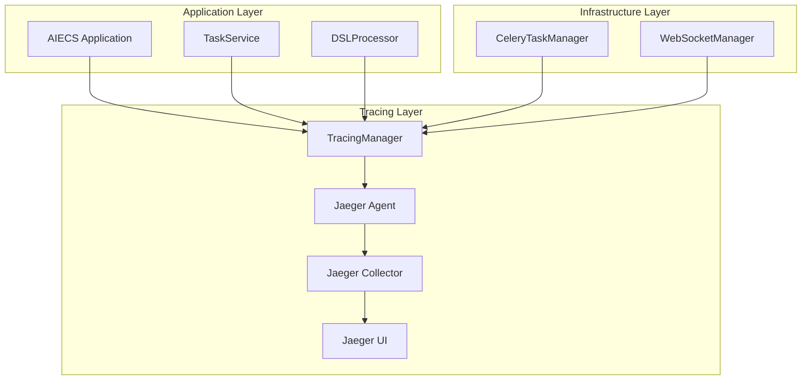
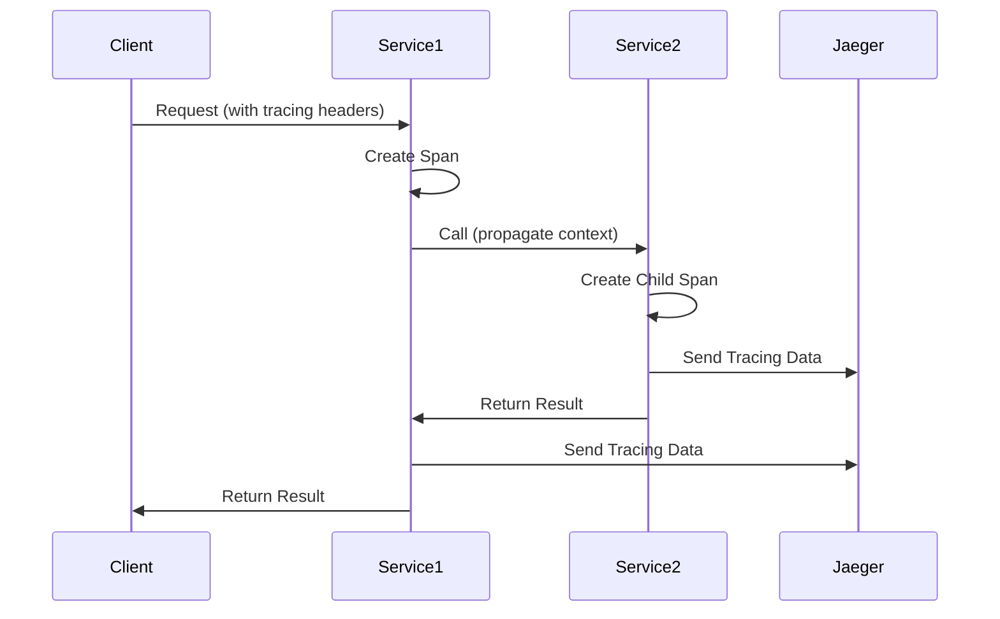

# TracingManager Technical Documentation

## 1. Overview

### Purpose
`TracingManager` is a component specifically designed for distributed tracing and call chain tracking, built on Jaeger and OpenTracing standards. It provides core functionalities including cross-service request tracing, performance analysis, error localization, etc., serving as important infrastructure for observability in the AIECS system.

### Core Value
- **Distributed Tracing**: Track complete call chains of requests across multiple services
- **Performance Analysis**: Identify system bottlenecks and performance hotspots
- **Error Localization**: Quickly locate error sources in distributed systems
- **Dependency Analysis**: Understand dependencies between services
- **SLA Monitoring**: Monitor end-to-end service response times

## 2. Problem Background & Design Motivation

### Problem Background
In the AIECS distributed system, the following challenges are faced:
- **Complex Call Chains**: Requests pass through multiple services, difficult to track complete paths
- **Performance Bottlenecks Hard to Locate**: Unable to quickly identify which service or operation causes delays
- **Complex Error Propagation**: Errors propagate between services, difficult to locate root causes
- **Unclear Dependencies**: Lack of visualization of dependencies between services
- **Difficult Debugging**: Low efficiency of problem troubleshooting in distributed environments

### Design Motivation
1. **Observability Enhancement**: Provide comprehensive visibility of system operational status
2. **Performance Optimization**: Identify performance bottlenecks through tracing data
3. **Rapid Fault Localization**: Reduce problem troubleshooting and resolution time
4. **System Understanding**: Help teams understand system architecture and dependencies
5. **SLA Assurance**: Ensure system meets service level agreements

## 3. Architecture Positioning & Context

### System Architecture Location
```
┌─────────────────────────────────────────────────────────────┐
│                    AIECS System Architecture                │
├─────────────────────────────────────────────────────────────┤
│  Monitoring Layer                                          │
│  ┌─────────────────┐  ┌─────────────────┐                  │
│  │ TracingManager  │  │ Jaeger Agent    │                  │
│  └─────────────────┘  └─────────────────┘                  │
├─────────────────────────────────────────────────────────────┤
│  Infrastructure Layer                                      │
│  ┌─────────────────┐  ┌─────────────────┐                  │
│  │ CeleryTaskManager│  │ WebSocketManager│                 │
│  └─────────────────┘  └─────────────────┘                  │
├─────────────────────────────────────────────────────────────┤
│  Domain Layer                                              │
│  ┌─────────────────┐  ┌─────────────────┐                  │
│  │ TaskService     │  │ DSLProcessor    │                  │
│  └─────────────────┘  └─────────────────┘                  │
└─────────────────────────────────────────────────────────────┘
```

### Upstream Callers
- **TaskService**: Task management service that needs to trace task execution flows
- **DSLProcessor**: DSL processor that needs to trace plan generation and execution
- **CeleryTaskManager**: Task executor that needs to trace task scheduling
- **WebSocketManager**: WebSocket manager that needs to trace connection handling

### Downstream Dependencies
- **Jaeger Agent**: Tracing data collection agent
- **Jaeger Collector**: Tracing data collector
- **Jaeger UI**: Tracing data visualization interface
- **OpenTracing**: Distributed tracing standard library

## 4. Core Features & Use Cases

### 4.1 Basic Tracing

#### Manual Span Creation
```python
# Create tracing manager
tracing = TracingManager(service_name="task_executor")

# Manually create and finish Span
span = tracing.start_span("process_user_request", tags={"user_id": "123"})
try:
    result = await process_request()
    tracing.finish_span(span, tags={"success": True})
except Exception as e:
    tracing.finish_span(span, error=e)
    raise
```

#### Automatic Tracing with Decorator
```python
# Use decorator to automatically trace functions
@tracing.with_tracing("parse_user_intent", tags={"component": "nlp"})
async def parse_user_intent(user_input: str) -> Dict[str, Any]:
    """Parse user intent"""
    return intent_result

@tracing.with_tracing("generate_task_plan", tags={"component": "planner"})
async def generate_task_plan(intent: Dict[str, Any]) -> List[Dict[str, Any]]:
    """Generate task plan"""
    return plan_steps
```

### 4.2 Database Operation Tracing

#### Database Query Tracing
```python
# Trace database operations
@tracing.trace_database_operation("SELECT", table="tasks", query="SELECT * FROM tasks WHERE status = 'pending'")
async def get_pending_tasks() -> List[Dict[str, Any]]:
    """Get pending tasks"""
    return await db.fetch_all("SELECT * FROM tasks WHERE status = 'pending'")

@tracing.trace_database_operation("INSERT", table="task_results")
async def save_task_result(result: Dict[str, Any]) -> int:
    """Save task result"""
    return await db.execute("INSERT INTO task_results ...")
```

### 4.3 External Service Call Tracing

#### HTTP Service Call Tracing
```python
# Trace external service calls
@tracing.trace_external_call("ml_service", endpoint="/api/predict")
async def call_ml_service(data: Dict[str, Any]) -> Dict[str, Any]:
    """Call machine learning service"""
    async with httpx.AsyncClient() as client:
        response = await client.post("http://ml-service/api/predict", json=data)
        return response.json()

@tracing.trace_external_call("notification_service", endpoint="/api/send")
async def send_notification(user_id: str, message: str) -> bool:
    """Send notification"""
    async with httpx.AsyncClient() as client:
        response = await client.post("http://notification-service/api/send", 
                                   json={"user_id": user_id, "message": message})
        return response.status_code == 200
```

### 4.4 Tool Execution Tracing

#### Tool Call Tracing
```python
# Trace tool execution
@tracing.trace_tool_execution("data_processor", "clean_data")
async def clean_data(raw_data: List[Dict[str, Any]]) -> List[Dict[str, Any]]:
    """Clean data"""
    return cleaned_data

@tracing.trace_tool_execution("ml_model", "train")
async def train_model(training_data: List[Dict[str, Any]]) -> Dict[str, Any]:
    """Train model"""
    return model_info
```

### 4.5 Cross-Service Tracing

#### Context Propagation
```python
# Inter-service context propagation
async def process_request_with_context(request_data: Dict[str, Any], headers: Dict[str, str]):
    """Process request with context"""
    # Extract tracing context from upstream service
    span_context = tracing.extract_span_context(headers)
    
    # Create child Span
    span = tracing.start_span("process_request", parent_span=span_context)
    
    try:
        # Process request
        result = await handle_request(request_data)
        
        # Propagate context to downstream service
        downstream_headers = {}
        tracing.inject_span_context(span, downstream_headers)
        
        # Call downstream service
        await call_downstream_service(result, downstream_headers)
        
        tracing.finish_span(span, tags={"success": True})
        return result
    except Exception as e:
        tracing.finish_span(span, error=e)
        raise
```

## 5. API Reference

### 5.1 Class Definition

#### `TracingManager`
```python
class TracingManager:
    """Distributed tracing manager"""
    
    def __init__(self, service_name: str = "service_executor",
                 jaeger_host: Optional[str] = None,
                 jaeger_port: Optional[int] = None,
                 enable_tracing: Optional[bool] = None) -> None
    """Initialize tracing manager
    
    Args:
        service_name: Service name
        jaeger_host: Jaeger Agent host address
        jaeger_port: Jaeger Agent port
        enable_tracing: Whether to enable tracing
    """
```

### 5.2 Public Methods

#### `start_span`
```python
def start_span(self, operation_name: str, parent_span: Optional[Span] = None,
               tags: Optional[Dict[str, Any]] = None) -> Optional[Span]
```
**Function**: Start a new tracing Span

**Parameters**:
- `operation_name` (str): Operation name
- `parent_span` (Optional[Span]): Parent Span
- `tags` (Optional[Dict[str, Any]]): Initial tags

**Returns**:
- `Optional[Span]`: Span object or None

#### `finish_span`
```python
def finish_span(self, span: Optional[Span], tags: Optional[Dict[str, Any]] = None,
                logs: Optional[Dict[str, Any]] = None, error: Optional[Exception] = None) -> None
```
**Function**: Finish tracing Span

**Parameters**:
- `span` (Optional[Span]): Span to finish
- `tags` (Optional[Dict[str, Any]]): Additional tags
- `logs` (Optional[Dict[str, Any]]): Log information
- `error` (Optional[Exception]): Error information

#### `with_tracing`
```python
def with_tracing(self, operation_name: str, tags: Optional[Dict[str, Any]] = None) -> Callable
```
**Function**: Tracing decorator

**Parameters**:
- `operation_name` (str): Operation name
- `tags` (Optional[Dict[str, Any]]): Initial tags

**Returns**:
- `Callable`: Decorator function

#### `trace_database_operation`
```python
def trace_database_operation(self, operation: str, table: str = None, query: str = None) -> Callable
```
**Function**: Database operation tracing decorator

**Parameters**:
- `operation` (str): Database operation type
- `table` (str): Table name
- `query` (str): SQL query

**Returns**:
- `Callable`: Decorator function

#### `trace_external_call`
```python
def trace_external_call(self, service_name: str, endpoint: str = None) -> Callable
```
**Function**: External service call tracing decorator

**Parameters**:
- `service_name` (str): Service name
- `endpoint` (str): Endpoint path

**Returns**:
- `Callable`: Decorator function

#### `trace_tool_execution`
```python
def trace_tool_execution(self, tool_name: str, operation: str) -> Callable
```
**Function**: Tool execution tracing decorator

**Parameters**:
- `tool_name` (str): Tool name
- `operation` (str): Operation name

**Returns**:
- `Callable`: Decorator function

## 6. Technical Implementation Details

### 6.1 Jaeger Integration

#### Configuration Initialization
```python
def _init_tracer(self):
    """Initialize Jaeger tracer"""
    config = jaeger_client.config.Config(
        config={
            'sampler': {
                'type': 'const',  # Constant sampling
                'param': 1,       # 100% sampling
            },
            'local_agent': {
                'reporting_host': self.jaeger_host,
                'reporting_port': self.jaeger_port,
            },
            'logging': True,
        },
        service_name=self.service_name,
        validate=True
    )
    self.tracer = config.initialize_tracer()
```

### 6.2 Decorator Implementation

#### Async Function Support
```python
def with_tracing(self, operation_name: str, tags: Optional[Dict[str, Any]] = None):
    """Tracing decorator implementation"""
    def decorator(func):
        @functools.wraps(func)
        async def async_wrapper(*args, **kwargs):
            if not self.enable_tracing or not self.tracer:
                return await func(*args, **kwargs)

            span = self.start_span(operation_name, tags=tags)
            try:
                # Add function arguments to Span
                self._add_function_args_to_span(span, args, kwargs)
                result = await func(*args, **kwargs)
                if span:
                    span.set_tag("success", True)
                return result
            except Exception as e:
                self.finish_span(span, error=e)
                raise
            finally:
                if span and not span.finished:
                    self.finish_span(span)
        return async_wrapper
    return decorator
```

### 6.3 Context Propagation

#### Cross-Service Context Propagation
```python
def inject_span_context(self, span: Optional[Span], carrier: Dict[str, str]):
    """Inject Span context into carrier"""
    if not self.enable_tracing or not span or not self.tracer:
        return
    
    try:
        from opentracing.propagation import Format
        self.tracer.inject(span.context, Format.TEXT_MAP, carrier)
    except Exception as e:
        logger.error(f"Error injecting span context: {e}")

def extract_span_context(self, carrier: Dict[str, str]) -> Optional[Any]:
    """Extract Span context from carrier"""
    if not self.enable_tracing or not self.tracer:
        return None
    
    try:
        from opentracing.propagation import Format
        return self.tracer.extract(Format.TEXT_MAP, carrier)
    except Exception as e:
        logger.error(f"Error extracting span context: {e}")
        return None
```

## 7. Configuration & Deployment

### 7.1 Basic Configuration

#### Environment Variable Configuration
```bash
# Jaeger configuration
export JAEGER_AGENT_HOST="jaeger"
export JAEGER_AGENT_PORT="6831"
export JAEGER_ENABLE_TRACING="true"

# Service configuration
export SERVICE_NAME="task_executor"
```

#### Code Configuration
```python
# Basic configuration
tracing = TracingManager(
    service_name="task_executor",
    jaeger_host="jaeger",
    jaeger_port=6831,
    enable_tracing=True
)
```

### 7.2 Docker Deployment

#### Docker Compose Configuration
```yaml
version: '3.8'
services:
  jaeger:
    image: jaegertracing/all-in-one:latest
    ports:
      - "16686:16686"  # Jaeger UI
      - "14268:14268"  # HTTP collector
      - "6831:6831/udp"  # UDP agent
    environment:
      - COLLECTOR_OTLP_ENABLED=true

  task-executor:
    build: .
    environment:
      - JAEGER_AGENT_HOST=jaeger
      - JAEGER_AGENT_PORT=6831
      - JAEGER_ENABLE_TRACING=true
    depends_on:
      - jaeger
```

## 8. Maintenance & Troubleshooting

### 8.1 Common Issues & Solutions

#### Issue 1: Jaeger Connection Failure
**Symptoms**: `Failed to initialize Jaeger tracer` error

**Solution**:
```python
# Check Jaeger service status
import socket
def check_jaeger_connection(host: str, port: int) -> bool:
    try:
        sock = socket.socket(socket.AF_INET, socket.SOCK_DGRAM)
        sock.settimeout(1)
        sock.connect((host, port))
        sock.close()
        return True
    except:
        return False

# Retry mechanism
def init_tracer_with_retry(max_retries: int = 3):
    for attempt in range(max_retries):
        try:
            tracing = TracingManager()
            if tracing.tracer:
                return tracing
        except Exception as e:
            if attempt == max_retries - 1:
                raise
            time.sleep(1)
```

#### Issue 2: Span Creation Failed
**Symptoms**: Span creation returns None

**Solution**:
```python
# Check tracing status
def validate_tracing_status(tracing: TracingManager):
    info = tracing.get_tracer_info()
    if not info["enabled"]:
        print("Tracing disabled")
        return False
    if not info["tracer_initialized"]:
        print("Tracer not initialized")
        return False
    return True
```

## 9. Visualizations

### 9.1 System Architecture Diagram



### 9.2 Tracing Flow Diagram



## 10. Version History

### v1.0.0 (2024-01-15)
**New Features**:
- Basic Jaeger integration
- Support manual and decorator tracing
- Implement context propagation
- Provide various tracing decorators

### v1.1.0 (2024-02-01)
**Feature Enhancements**:
- Add database operation tracing
- Support external service call tracing
- Implement tool execution tracing
- Enhance error handling

### v1.2.0 (2024-03-01)
**New Features**:
- Support async function tracing
- Add automatic function argument recording
- Implement Span context management
- Provide tracing information query

---

## Appendix

### A. Related Documentation
- [Executor Metrics Documentation](./EXECUTOR_METRICS.md)
- [WebSocket Manager Documentation](../INFRASTRUCTURE_MESSAGEING/WEBSOCKET_MANAGER.md)
- [System Configuration Guide](../CONFIG/CONFIG_MANAGEMENT.md)

### B. External Dependencies
- [Jaeger Official Documentation](https://www.jaegertracing.io/docs/)
- [OpenTracing Documentation](https://opentracing.io/docs/)
- [Jaeger Python Client](https://github.com/jaegertracing/jaeger-client-python)

### C. Contact Information
- Technical Lead: AIECS Development Team
- Issue Reporting: Through project Issue system
- Documentation Updates: Regular maintenance, version synchronization
