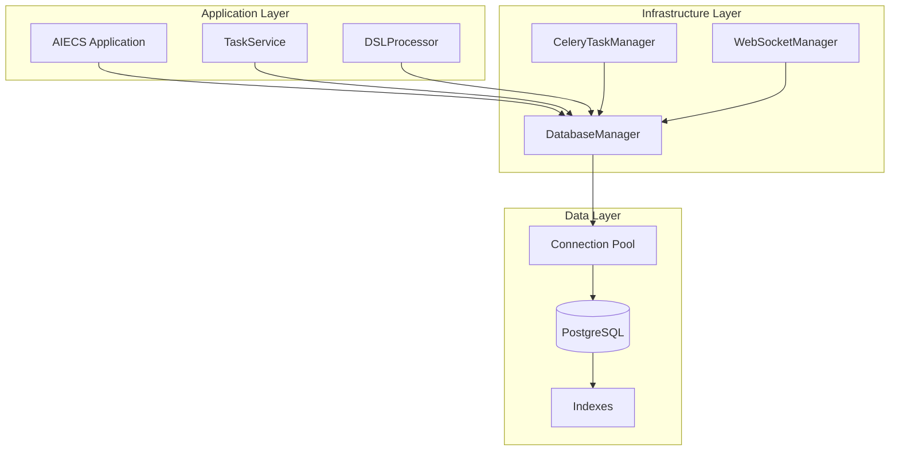
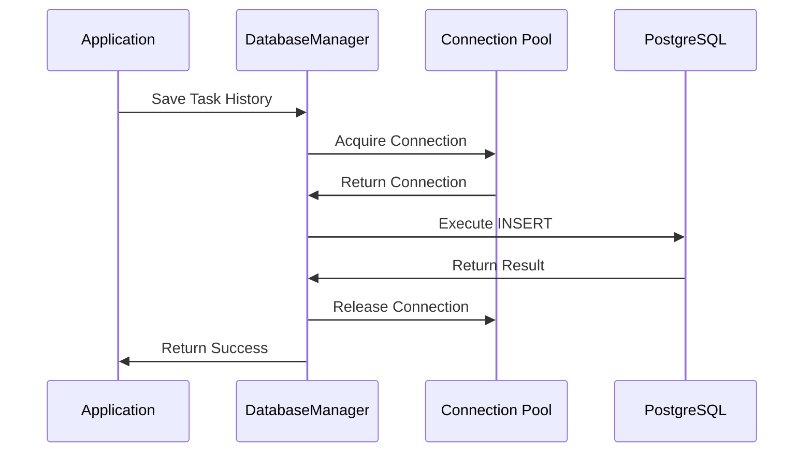
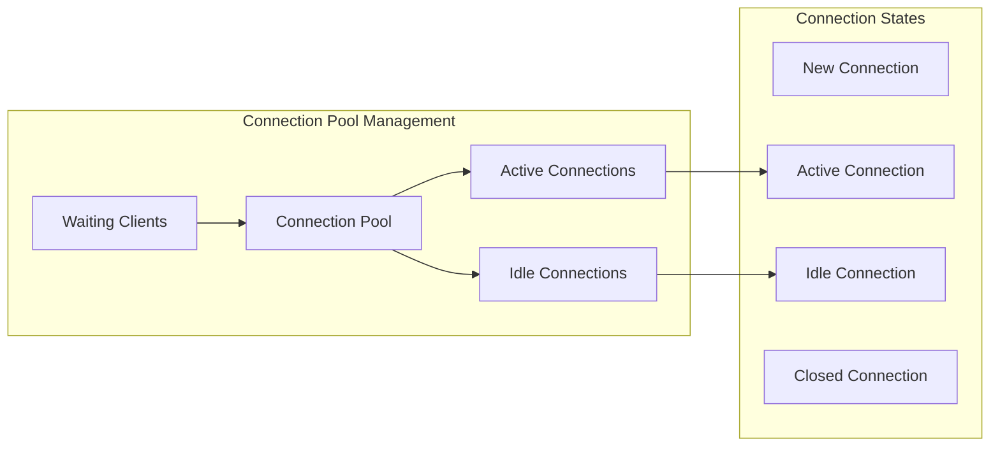

# DatabaseManager Technical Documentation

## 1. Overview

### Purpose
`DatabaseManager` is a component specifically designed for database connection management, operation execution, and task history management, built on the asyncpg asynchronous PostgreSQL driver. It provides core functionalities including connection pool management, task history persistence, status tracking, etc., serving as key infrastructure for the data persistence layer in the AIECS system.

### Core Value
- **Asynchronous Database Operations**: High-performance asynchronous database access based on asyncpg
- **Connection Pool Management**: Automatically manages database connection pools, improving concurrent performance
- **Task History Persistence**: Complete recording of task execution history and status changes
- **Data Consistency**: Ensures data consistency of task status and results
- **Performance Optimization**: Improves database performance through indexing and query optimization

## 2. Problem Background & Design Motivation

### Problem Background
In the AIECS system, a large amount of task execution data needs to be handled, including:
- **Task Status Tracking**: Need to persistently store task execution status and results
- **History Record Management**: Need to save complete task execution history for query and analysis
- **Concurrent Access**: Multiple services accessing the database simultaneously require efficient connection management
- **Data Consistency**: Ensure atomicity and consistency of task status changes
- **Performance Requirements**: Large numbers of concurrent tasks require high-performance database operations

### Design Motivation
1. **Data Persistence**: Persistently store task execution data, supporting data recovery after system restart
2. **State Management**: Provide reliable task status tracking and query mechanisms
3. **Performance Optimization**: Improve database access performance through connection pools and asynchronous operations
4. **Data Integrity**: Ensure completeness and consistency of task execution history
5. **Operational Support**: Provide data cleanup and monitoring functionality to support system operations

## 3. Architecture Positioning & Context

### System Architecture Location
```
┌─────────────────────────────────────────────────────────────┐
│                    AIECS System Architecture                │
├─────────────────────────────────────────────────────────────┤
│  Domain Layer                                              │
│  ┌─────────────────┐  ┌─────────────────┐                  │
│  │ TaskService     │  │ DSLProcessor    │                  │
│  └─────────────────┘  └─────────────────┘                  │
├─────────────────────────────────────────────────────────────┤
│  Infrastructure Layer                                      │
│  ┌─────────────────┐  ┌─────────────────┐                  │
│  │ DatabaseManager │  │ CeleryTaskManager│                 │
│  └─────────────────┘  └─────────────────┘                  │
├─────────────────────────────────────────────────────────────┤
│  Data Layer                                                │
│  ┌─────────────────┐  ┌─────────────────┐                  │
│  │ PostgreSQL      │  │ Connection Pool │                  │
│  └─────────────────┘  └─────────────────┘                  │
└─────────────────────────────────────────────────────────────┘
```

### Upstream Callers
- **TaskService**: Task management service that needs to save and query task status
- **DSLProcessor**: DSL processor that needs to record task execution steps
- **CeleryTaskManager**: Task executor that needs to update task status
- **WebSocketManager**: WebSocket manager that needs to query task history

### Downstream Dependencies
- **PostgreSQL**: Main database system
- **asyncpg**: Asynchronous PostgreSQL driver
- **TaskStatus/TaskStepResult**: Task status and result models
- **Configuration System**: Database connection configuration

## 4. Core Features & Use Cases

### 4.1 Database Connection Management

#### Connection Pool Initialization
```python
# Create database manager
db_manager = DatabaseManager()

# Initialize connection pool
await db_manager.init_connection_pool(
    min_size=10,  # Minimum connections
    max_size=20   # Maximum connections
)

# Initialize database schema
await db_manager.init_database_schema()
```

#### Automatic Connection Management
```python
# Database manager automatically handles connection acquisition and release
async def process_task_with_db(task_data: Dict[str, Any]):
    """Process task and automatically manage database connections"""
    # Save task history
    step_result = TaskStepResult(
        step="data_processing",
        result={"processed_rows": 1000},
        completed=True,
        message="Data processing completed",
        status="completed"
    )
    
    await db_manager.save_task_history(
        user_id="user_123",
        task_id="task_456",
        step=1,
        step_result=step_result
    )
```

### 4.2 Task History Management

#### Save Task Execution History
```python
# Save task step result
async def save_task_step(user_id: str, task_id: str, step: int, result: Any):
    """Save task step execution result"""
    step_result = TaskStepResult(
        step=f"step_{step}",
        result=result,
        completed=True,
        message=f"Step {step} execution completed",
        status=TaskStatus.COMPLETED
    )
    
    await db_manager.save_task_history(
        user_id=user_id,
        task_id=task_id,
        step=step,
        step_result=step_result
    )

# Save error information
async def save_task_error(user_id: str, task_id: str, step: int, error: Exception):
    """Save task execution error"""
    step_result = TaskStepResult(
        step=f"step_{step}",
        result=None,
        completed=False,
        message=f"Step {step} execution failed: {str(error)}",
        status=TaskStatus.FAILED,
        error_code="E003",
        error_message=str(error)
    )
    
    await db_manager.save_task_history(
        user_id=user_id,
        task_id=task_id,
        step=step,
        step_result=step_result
    )
```

#### Query Task History
```python
# Query complete task history
async def get_task_execution_history(user_id: str, task_id: str):
    """Get task execution history"""
    history = await db_manager.load_task_history(user_id, task_id)
    
    print(f"Task {task_id} execution history:")
    for step in history:
        print(f"  Step {step['step']}: {step['status']} - {step['result']}")
    
    return history

# Query all user tasks
async def get_user_task_list(user_id: str):
    """Get user task list"""
    tasks = await db_manager.get_user_tasks(user_id, limit=50)
    
    print(f"User {user_id} task list:")
    for task in tasks:
        print(f"  Task {task['task_id']}: {task['status']} (Last updated: {task['last_updated']})")
    
    return tasks
```

### 4.3 Task Status Management

#### Task Status Tracking
```python
# Check task status
async def check_task_status(user_id: str, task_id: str):
    """Check current task status"""
    status = await db_manager.check_task_status(user_id, task_id)
    
    if status == TaskStatus.PENDING:
        print("Task waiting for execution")
    elif status == TaskStatus.RUNNING:
        print("Task running")
    elif status == TaskStatus.COMPLETED:
        print("Task execution completed")
    elif status == TaskStatus.FAILED:
        print("Task execution failed")
    elif status == TaskStatus.CANCELLED:
        print("Task cancelled")
    
    return status

# Cancel task
async def cancel_user_task(user_id: str, task_id: str):
    """Cancel user task"""
    success = await db_manager.mark_task_as_cancelled(user_id, task_id)
    
    if success:
        print(f"Task {task_id} marked as cancelled")
    else:
        print(f"Failed to cancel task {task_id}")
    
    return success
```

### 4.4 Data Maintenance and Cleanup

#### Periodic Data Cleanup
```python
# Clean old task data
async def cleanup_old_data():
    """Clean task data older than 30 days"""
    success = await db_manager.cleanup_old_tasks(days_old=30)
    
    if success:
        print("Old task data cleanup completed")
    else:
        print("Data cleanup failed")
    
    return success

# Scheduled maintenance task
import asyncio
from datetime import datetime, timedelta

async def scheduled_cleanup():
    """Periodically execute data cleanup"""
    while True:
        try:
            # Execute cleanup at 2 AM daily
            now = datetime.now()
            if now.hour == 2 and now.minute == 0:
                await cleanup_old_data()
            
            # Wait 1 minute
            await asyncio.sleep(60)
        except Exception as e:
            logger.error(f"Scheduled cleanup task error: {e}")
            await asyncio.sleep(300)  # Wait 5 minutes after error
```

### 4.5 Batch Operations

#### Batch Save Task History
```python
# Batch save multiple task steps
async def save_batch_task_steps(user_id: str, task_id: str, steps: List[Dict[str, Any]]):
    """Batch save task steps"""
    for i, step_data in enumerate(steps):
        step_result = TaskStepResult(
            step=f"batch_step_{i}",
            result=step_data.get("result"),
            completed=step_data.get("completed", True),
            message=step_data.get("message", f"Batch step {i}"),
            status=step_data.get("status", TaskStatus.COMPLETED)
        )
        
        await db_manager.save_task_history(
            user_id=user_id,
            task_id=task_id,
            step=i,
            step_result=step_result
        )
```

## 5. API Reference

### 5.1 Class Definition

#### `DatabaseManager`
```python
class DatabaseManager:
    """Database connection and operation manager"""
    
    def __init__(self, db_config: Optional[Dict[str, Any]] = None) -> None
    """Initialize database manager
    
    Args:
        db_config: Database configuration dictionary, if None then get from configuration system
    """
```

### 5.2 Public Methods

#### `init_connection_pool`
```python
async def init_connection_pool(self, min_size: int = 10, max_size: int = 20) -> None
```
**Function**: Initialize database connection pool

**Parameters**:
- `min_size` (int): Minimum connections, default 10
- `max_size` (int): Maximum connections, default 20

**Exceptions**:
- `Exception`: Connection pool initialization failed

#### `init_database_schema`
```python
async def init_database_schema(self) -> bool
```
**Function**: Initialize database table structure

**Returns**:
- `bool`: Whether initialization succeeded

#### `save_task_history`
```python
async def save_task_history(self, user_id: str, task_id: str, step: int, step_result: TaskStepResult) -> bool
```
**Function**: Save task execution history

**Parameters**:
- `user_id` (str): User ID
- `task_id` (str): Task ID
- `step` (int): Step number
- `step_result` (TaskStepResult): Step result

**Returns**:
- `bool`: Whether save succeeded

**Exceptions**:
- `Exception`: Database operation failed

#### `load_task_history`
```python
async def load_task_history(self, user_id: str, task_id: str) -> List[Dict]
```
**Function**: Load task execution history

**Parameters**:
- `user_id` (str): User ID
- `task_id` (str): Task ID

**Returns**:
- `List[Dict]`: Task history record list

**Exceptions**:
- `Exception`: Database operation failed

#### `mark_task_as_cancelled`
```python
async def mark_task_as_cancelled(self, user_id: str, task_id: str) -> bool
```
**Function**: Mark task as cancelled

**Parameters**:
- `user_id` (str): User ID
- `task_id` (str): Task ID

**Returns**:
- `bool`: Whether operation succeeded

**Exceptions**:
- `Exception`: Database operation failed

#### `check_task_status`
```python
async def check_task_status(self, user_id: str, task_id: str) -> TaskStatus
```
**Function**: Check task status

**Parameters**:
- `user_id` (str): User ID
- `task_id` (str): Task ID

**Returns**:
- `TaskStatus`: Task status

**Exceptions**:
- `Exception`: Database operation failed

#### `get_user_tasks`
```python
async def get_user_tasks(self, user_id: str, limit: int = 100) -> List[Dict]
```
**Function**: Get user task list

**Parameters**:
- `user_id` (str): User ID
- `limit` (int): Return record limit, default 100

**Returns**:
- `List[Dict]`: User task list

**Exceptions**:
- `Exception`: Database operation failed

#### `cleanup_old_tasks`
```python
async def cleanup_old_tasks(self, days_old: int = 30) -> bool
```
**Function**: Clean old task records

**Parameters**:
- `days_old` (int): Clean records older than how many days, default 30

**Returns**:
- `bool`: Whether cleanup succeeded

#### `close`
```python
async def close(self) -> None
```
**Function**: Close database connection pool

## 6. Technical Implementation Details

### 6.1 Connection Pool Management

#### Connection Pool Configuration
```python
async def init_connection_pool(self, min_size: int = 10, max_size: int = 20):
    """Initialize database connection pool"""
    self.connection_pool = await asyncpg.create_pool(
        **self.db_config,
        min_size=min_size,      # Minimum connections
        max_size=max_size,      # Maximum connections
        command_timeout=60,     # Command timeout
        server_settings={
            'application_name': 'aiecs_database_manager',
            'timezone': 'UTC'
        }
    )
```

#### Connection Acquisition and Release
```python
async def _get_connection(self):
    """Get database connection"""
    if self.connection_pool:
        # Use connection pool
        return self.connection_pool.acquire()
    else:
        # Create connection directly
        return asyncpg.connect(**self.db_config)

# Use context manager to automatically release connection
async with self.connection_pool.acquire() as conn:
    result = await conn.fetch("SELECT * FROM task_history")
```

### 6.2 Database Schema Management

#### Table Structure Creation
```python
async def _create_tables(self, conn):
    """Create database tables"""
    await conn.execute('''
        CREATE TABLE IF NOT EXISTS task_history (
            id SERIAL PRIMARY KEY,
            user_id TEXT NOT NULL,
            task_id TEXT NOT NULL,
            step INTEGER NOT NULL,
            result JSONB NOT NULL,
            timestamp TIMESTAMP NOT NULL,
            status TEXT NOT NULL DEFAULT 'pending'
        );
        
        -- Create indexes to optimize query performance
        CREATE INDEX IF NOT EXISTS idx_task_history_user_id ON task_history (user_id);
        CREATE INDEX IF NOT EXISTS idx_task_history_task_id ON task_history (task_id);
        CREATE INDEX IF NOT EXISTS idx_task_history_status ON task_history (status);
        CREATE INDEX IF NOT EXISTS idx_task_history_timestamp ON task_history (timestamp);
        
        -- Composite indexes to optimize common queries
        CREATE INDEX IF NOT EXISTS idx_task_history_user_task ON task_history (user_id, task_id);
        CREATE INDEX IF NOT EXISTS idx_task_history_user_timestamp ON task_history (user_id, timestamp DESC);
    ''')
```

### 6.3 Error Handling Strategy

#### Database Operation Fault Tolerance
```python
async def save_task_history(self, user_id: str, task_id: str, step: int, step_result: TaskStepResult):
    """Save task history (with fault tolerance)"""
    try:
        if self.connection_pool:
            async with self.connection_pool.acquire() as conn:
                await conn.execute(
                    'INSERT INTO task_history (user_id, task_id, step, result, timestamp, status) VALUES ($1, $2, $3, $4, $5, $6)',
                    user_id, task_id, step, json.dumps(step_result.dict()), datetime.now(), step_result.status
                )
        else:
            conn = await asyncpg.connect(**self.db_config)
            try:
                await conn.execute(
                    'INSERT INTO task_history (user_id, task_id, step, result, timestamp, status) VALUES ($1, $2, $3, $4, $5, $6)',
                    user_id, task_id, step, json.dumps(step_result.dict()), datetime.now(), step_result.status
                )
            finally:
                await conn.close()
        
        return True
    except Exception as e:
        logger.error(f"Database error saving task history: {e}")
        raise Exception(f"Database error: {e}")
```

#### Retry Mechanism
```python
import asyncio
from functools import wraps

def retry_db_operation(max_retries: int = 3, delay: float = 1.0):
    """Database operation retry decorator"""
    def decorator(func):
        @wraps(func)
        async def wrapper(*args, **kwargs):
            for attempt in range(max_retries):
                try:
                    return await func(*args, **kwargs)
                except Exception as e:
                    if attempt == max_retries - 1:
                        raise
                    logger.warning(f"Database operation failed (attempt {attempt + 1}/{max_retries}): {e}")
                    await asyncio.sleep(delay * (2 ** attempt))  # Exponential backoff
            return None
        return wrapper
    return decorator

# Use retry decorator
@retry_db_operation(max_retries=3, delay=1.0)
async def save_task_history_with_retry(self, user_id: str, task_id: str, step: int, step_result: TaskStepResult):
    """Save task history with retry"""
    # Original save logic
    pass
```

### 6.4 Performance Optimization

#### Batch Operation Optimization
```python
async def save_batch_task_history(self, records: List[Dict[str, Any]]):
    """Batch save task history"""
    if not records:
        return
    
    try:
        if self.connection_pool:
            async with self.connection_pool.acquire() as conn:
                # Use batch insert
                await conn.executemany(
                    '''INSERT INTO task_history (user_id, task_id, step, result, timestamp, status) 
                       VALUES ($1, $2, $3, $4, $5, $6)''',
                    [
                        (
                            record['user_id'],
                            record['task_id'],
                            record['step'],
                            json.dumps(record['result']),
                            record['timestamp'],
                            record['status']
                        )
                        for record in records
                    ]
                )
        else:
            conn = await asyncpg.connect(**self.db_config)
            try:
                await conn.executemany(
                    '''INSERT INTO task_history (user_id, task_id, step, result, timestamp, status) 
                       VALUES ($1, $2, $3, $4, $5, $6)''',
                    # Same batch data
                )
            finally:
                await conn.close()
    except Exception as e:
        logger.error(f"Batch save error: {e}")
        raise
```

#### Query Optimization
```python
async def get_user_tasks_optimized(self, user_id: str, limit: int = 100, offset: int = 0):
    """Optimized user task query"""
    try:
        if self.connection_pool:
            async with self.connection_pool.acquire() as conn:
                # Use pagination and optimized query
                records = await conn.fetch(
                    '''SELECT DISTINCT task_id,
                       MAX(timestamp) as last_updated,
                       (SELECT status FROM task_history th2
                        WHERE th2.user_id = $1 AND th2.task_id = th1.task_id
                        ORDER BY step DESC LIMIT 1) as status
                       FROM task_history th1
                       WHERE user_id = $1
                       GROUP BY task_id
                       ORDER BY last_updated DESC
                       LIMIT $2 OFFSET $3''',
                    user_id, limit, offset
                )
        else:
            # Direct connection query
            conn = await asyncpg.connect(**self.db_config)
            try:
                records = await conn.fetch(
                    # Same query
                )
            finally:
                await conn.close()
        
        return [dict(r) for r in records]
    except Exception as e:
        logger.error(f"Optimized query error: {e}")
        raise
```

## 7. Configuration & Deployment

### 7.1 Basic Configuration

#### Database Configuration
```python
# Basic database configuration
db_config = {
    "host": "localhost",
    "port": 5432,
    "database": "aiecs_db",
    "user": "aiecs_user",
    "password": "aiecs_password",
    "min_size": 10,
    "max_size": 20
}

# Create database manager
db_manager = DatabaseManager(db_config)
```

#### Environment Variable Configuration
```bash
# Database connection configuration
export DB_HOST="localhost"
export DB_PORT="5432"
export DB_NAME="aiecs_db"
export DB_USER="aiecs_user"
export DB_PASSWORD="aiecs_password"

# Connection pool configuration
export DB_MIN_SIZE="10"
export DB_MAX_SIZE="20"
export DB_COMMAND_TIMEOUT="60"
```

### 7.2 Docker Deployment

#### Docker Compose Configuration
```yaml
version: '3.8'
services:
  postgres:
    image: postgres:15-alpine
    environment:
      - POSTGRES_DB=aiecs_db
      - POSTGRES_USER=aiecs_user
      - POSTGRES_PASSWORD=aiecs_password
    ports:
      - "5432:5432"
    volumes:
      - postgres_data:/var/lib/postgresql/data
      - ./init.sql:/docker-entrypoint-initdb.d/init.sql

  aiecs-app:
    build: .
    environment:
      - DB_HOST=postgres
      - DB_PORT=5432
      - DB_NAME=aiecs_db
      - DB_USER=aiecs_user
      - DB_PASSWORD=aiecs_password
    depends_on:
      - postgres

volumes:
  postgres_data:
```

### 7.3 Production Environment Configuration

#### High Availability Configuration
```python
# Production environment database configuration
production_config = {
    "host": "postgres-cluster.internal",
    "port": 5432,
    "database": "aiecs_prod",
    "user": "aiecs_prod_user",
    "password": "secure_password",
    "min_size": 20,
    "max_size": 100,
    "command_timeout": 30,
    "server_settings": {
        "application_name": "aiecs_production",
        "timezone": "UTC",
        "statement_timeout": "30s"
    }
}
```

## 8. Maintenance & Troubleshooting

### 8.1 Monitoring Metrics

#### Key Metrics
- **Connection Pool Usage**: `(Active connections / Maximum connections) * 100%`
- **Query Response Time**: Average response time of database queries
- **Error Rate**: Proportion of failed database operations
- **Data Growth**: Data growth trend of task history table

#### Monitoring Implementation
```python
class DatabaseMonitor:
    def __init__(self, db_manager: DatabaseManager):
        self.db_manager = db_manager
        self.metrics = {
            "connection_pool_size": 0,
            "active_connections": 0,
            "query_count": 0,
            "error_count": 0
        }
    
    async def get_connection_pool_stats(self) -> Dict[str, Any]:
        """Get connection pool statistics"""
        if self.db_manager.connection_pool:
            return {
                "size": self.db_manager.connection_pool.get_size(),
                "min_size": self.db_manager.connection_pool.get_min_size(),
                "max_size": self.db_manager.connection_pool.get_max_size(),
                "closed": self.db_manager.connection_pool.is_closed()
            }
        return {"error": "No connection pool"}
    
    async def get_database_health(self) -> Dict[str, Any]:
        """Get database health status"""
        try:
            if self.db_manager.connection_pool:
                async with self.db_manager.connection_pool.acquire() as conn:
                    # Check database connection
                    result = await conn.fetchval("SELECT 1")
                    return {
                        "status": "healthy" if result == 1 else "unhealthy",
                        "connection_test": "passed" if result == 1 else "failed"
                    }
        except Exception as e:
            return {
                "status": "unhealthy",
                "error": str(e)
            }
```

### 8.2 Common Issues & Solutions

#### Issue 1: Connection Pool Exhausted
**Symptoms**: `asyncpg.exceptions.TooManyConnectionsError` error

**Possible Causes**:
- Connections not properly released
- Improper connection pool size configuration
- Long-running queries occupying connections

**Solutions**:
```python
# 1. Check connection pool configuration
async def check_connection_pool_config():
    if db_manager.connection_pool:
        stats = await db_manager.get_connection_pool_stats()
        print(f"Connection pool size: {stats['size']}/{stats['max_size']}")
        
        if stats['size'] >= stats['max_size'] * 0.9:
            print("Warning: Connection pool usage too high")

# 2. Increase connection pool size
await db_manager.init_connection_pool(min_size=20, max_size=50)

# 3. Check connection leaks
import weakref
import gc

def check_connection_leaks():
    """Check connection leaks"""
    # Force garbage collection
    gc.collect()
    
    # Check unreleased connections
    for obj in gc.get_objects():
        if isinstance(obj, asyncpg.Connection) and not obj.is_closed():
            print(f"Found unclosed connection: {obj}")
```

#### Issue 2: Database Connection Timeout
**Symptoms**: `asyncpg.exceptions.QueryCanceledError` error

**Possible Causes**:
- Query execution time too long
- Unstable network connection
- Database overload

**Solutions**:
```python
# 1. Increase query timeout
db_config = {
    "command_timeout": 120,  # 2 minute timeout
    "server_settings": {
        "statement_timeout": "120s"
    }
}

# 2. Optimize query performance
async def optimize_slow_queries():
    """Optimize slow queries"""
    if db_manager.connection_pool:
        async with db_manager.connection_pool.acquire() as conn:
            # Analyze query plan
            result = await conn.fetch("""
                EXPLAIN ANALYZE 
                SELECT * FROM task_history 
                WHERE user_id = $1 AND task_id = $2
            """, "user_123", "task_456")
            print("Query plan:", result)

# 3. Add query retry mechanism
@retry_db_operation(max_retries=3, delay=2.0)
async def robust_query(query: str, *args):
    """Query with retry"""
    if db_manager.connection_pool:
        async with db_manager.connection_pool.acquire() as conn:
            return await conn.fetch(query, *args)
```

#### Issue 3: Data Consistency Issues
**Symptoms**: Task status inconsistent, data duplicate or missing

**Possible Causes**:
- Concurrent write conflicts
- Transactions not properly committed
- Data inconsistency due to network partitions

**Solutions**:
```python
# 1. Use transactions to ensure data consistency
async def save_task_with_transaction(user_id: str, task_id: str, step: int, step_result: TaskStepResult):
    """Save task data using transaction"""
    if db_manager.connection_pool:
        async with db_manager.connection_pool.acquire() as conn:
            async with conn.transaction():
                # Check if task exists
                existing = await conn.fetchrow(
                    "SELECT id FROM task_history WHERE user_id = $1 AND task_id = $2 AND step = $3",
                    user_id, task_id, step
                )
                
                if existing:
                    # Update existing record
                    await conn.execute(
                        "UPDATE task_history SET result = $1, timestamp = $2, status = $3 WHERE id = $4",
                        json.dumps(step_result.dict()), datetime.now(), step_result.status, existing['id']
                    )
                else:
                    # Insert new record
                    await conn.execute(
                        "INSERT INTO task_history (user_id, task_id, step, result, timestamp, status) VALUES ($1, $2, $3, $4, $5, $6)",
                        user_id, task_id, step, json.dumps(step_result.dict()), datetime.now(), step_result.status
                    )

# 2. Add unique constraints to prevent duplicates
async def add_unique_constraints():
    """Add unique constraints"""
    if db_manager.connection_pool:
        async with db_manager.connection_pool.acquire() as conn:
            await conn.execute("""
                ALTER TABLE task_history 
                ADD CONSTRAINT unique_user_task_step 
                UNIQUE (user_id, task_id, step)
            """)
```

#### Issue 4: Database Performance Issues
**Symptoms**: Slow query response, overall system performance degradation

**Possible Causes**:
- Missing necessary indexes
- Inefficient query statements
- Excessive data volume

**Solutions**:
```python
# 1. Analyze query performance
async def analyze_query_performance():
    """Analyze query performance"""
    if db_manager.connection_pool:
        async with db_manager.connection_pool.acquire() as conn:
            # View slow queries
            slow_queries = await conn.fetch("""
                SELECT query, mean_time, calls 
                FROM pg_stat_statements 
                ORDER BY mean_time DESC 
                LIMIT 10
            """)
            
            for query in slow_queries:
                print(f"Slow query: {query['query'][:100]}... Average time: {query['mean_time']}ms")

# 2. Optimize indexes
async def optimize_indexes():
    """Optimize database indexes"""
    if db_manager.connection_pool:
        async with db_manager.connection_pool.acquire() as conn:
            # Analyze table statistics
            await conn.execute("ANALYZE task_history")
            
            # Rebuild indexes
            await conn.execute("REINDEX TABLE task_history")

# 3. Data partitioning
async def partition_task_history():
    """Partition task history table"""
    if db_manager.connection_pool:
        async with db_manager.connection_pool.acquire() as conn:
            # Partition by time
            await conn.execute("""
                CREATE TABLE task_history_2024_01 
                PARTITION OF task_history 
                FOR VALUES FROM ('2024-01-01') TO ('2024-02-01')
            """)
```

## 9. Visualizations

### 9.1 System Architecture Diagram



### 9.2 Database Operation Flow Diagram



### 9.3 Connection Pool Management Diagram



## 10. Version History

### v1.0.0 (2024-01-15)
**New Features**:
- Basic database connection management
- Support asyncpg asynchronous driver
- Implement task history save and query
- Provide basic error handling

**Technical Features**:
- Built on asyncpg
- Support connection pool management
- Implement JSONB data storage
- Provide index optimization

### v1.1.0 (2024-02-01)
**Feature Enhancements**:
- Add task status management functionality
- Implement user task list query
- Support task cancellation operation
- Add data cleanup functionality

**Performance Optimizations**:
- Optimize query performance
- Improve connection pool management
- Enhance error handling mechanism

### v1.2.0 (2024-03-01)
**New Features**:
- Support batch operations
- Add retry mechanism
- Implement connection pool monitoring
- Provide health check interface

**Stability Improvements**:
- Enhance transaction support
- Improve concurrency control
- Optimize memory usage

### v1.3.0 (2024-04-01)
**Architecture Upgrades**:
- Upgrade to asyncpg 0.28.x
- Support advanced connection pool configuration
- Add query performance analysis
- Implement data partitioning support

**Monitoring Enhancements**:
- Add detailed performance metrics
- Implement slow query monitoring
- Support database health check
- Provide operational management tools

---

## Appendix

### A. Related Documentation
- [Celery Task Manager Documentation](../INFRASTRUCTURE_MESSAGEING/CELERY_TASK_MANAGER.md)
- [WebSocket Manager Documentation](../INFRASTRUCTURE_MESSAGEING/WEBSOCKET_MANAGER.md)
- [System Configuration Guide](../CONFIG/CONFIG_MANAGEMENT.md)

### B. External Dependencies
- [asyncpg Official Documentation](https://magicstack.github.io/asyncpg/)
- [PostgreSQL Official Documentation](https://www.postgresql.org/docs/)
- [JSONB Data Type Documentation](https://www.postgresql.org/docs/current/datatype-json.html)

### C. Best Practices
```python
# 1. Connection pool configuration best practices
optimal_config = {
    "min_size": 10,           # Minimum connections
    "max_size": 50,           # Maximum connections
    "command_timeout": 60,    # Command timeout
    "server_settings": {
        "application_name": "aiecs_app",
        "timezone": "UTC",
        "statement_timeout": "60s"
    }
}

# 2. Query optimization best practices
async def optimized_query_example():
    """Optimized query example"""
    # Use parameterized queries to prevent SQL injection
    query = "SELECT * FROM task_history WHERE user_id = $1 AND task_id = $2"
    
    # Use appropriate indexes
    # CREATE INDEX idx_user_task ON task_history (user_id, task_id)
    
    # Limit return result count
    query += " LIMIT 100"
    
    return await conn.fetch(query, user_id, task_id)

# 3. Error handling best practices
async def robust_database_operation():
    """Robust database operation"""
    try:
        result = await db_manager.save_task_history(...)
        return result
    except asyncpg.exceptions.UniqueViolationError:
        logger.warning("Record already exists, skip insert")
        return True
    except asyncpg.exceptions.ConnectionDoesNotExistError:
        logger.error("Database connection lost, attempting reconnect")
        await db_manager.init_connection_pool()
        raise
    except Exception as e:
        logger.error(f"Database operation failed: {e}")
        raise
```

### D. Contact Information
- Technical Lead: AIECS Development Team
- Issue Reporting: Through project Issue system
- Documentation Updates: Regular maintenance, version synchronization
