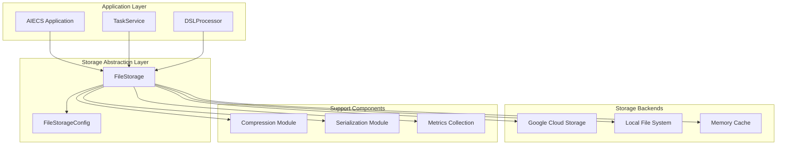
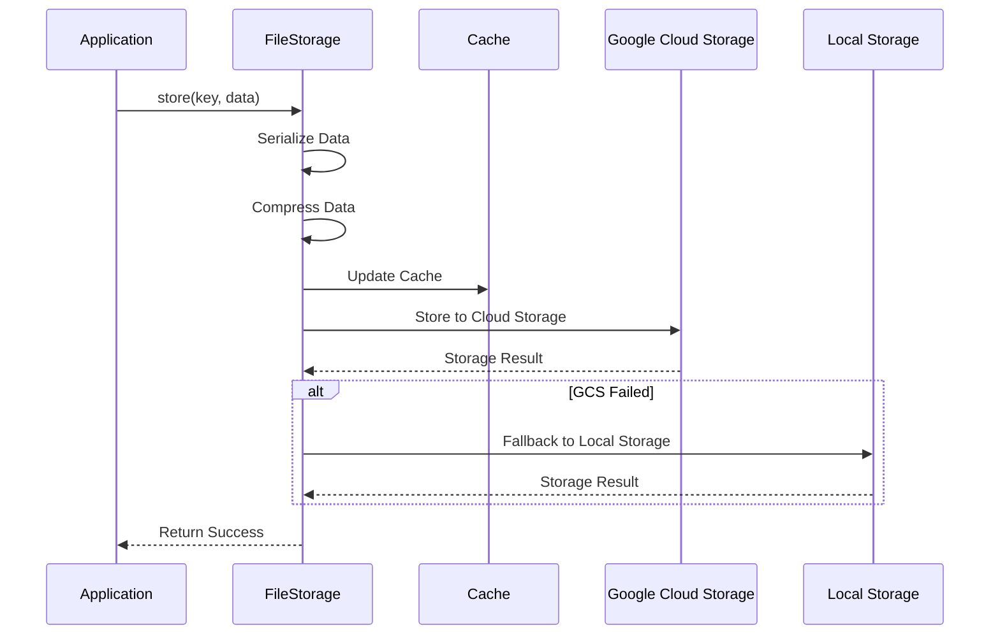
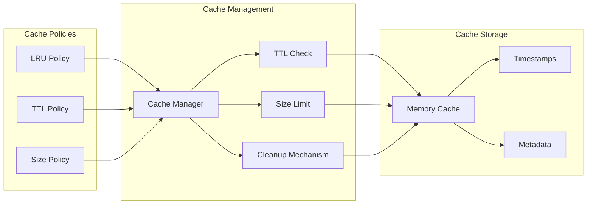

# FileStorage Technical Documentation

## 1. Overview

### Purpose
`FileStorage` is a component specifically designed for file storage and management, based on Google Cloud Storage as the primary backend, with support for local file system as a fallback option. It provides core functionalities including unified file storage interface, automatic compression, cache management, metrics collection, etc., serving as key infrastructure for the file persistence layer in the AIECS system.

### Core Value
- **Multi-Cloud Storage Support**: Supports Google Cloud Storage and local file system
- **Automatic Fallback Mechanism**: Automatically switches to local storage when cloud storage is unavailable
- **Intelligent Cache Management**: TTL-based in-memory cache, improving access performance
- **Automatic Compression**: Automatically compresses large files with gzip, saving storage space
- **Unified Interface**: Provides consistent storage interface, hiding underlying storage differences

## 2. Problem Background & Design Motivation

### Problem Background
In the AIECS system, a large amount of file storage needs to be handled, including:
- **Task Result Storage**: Need to save files and results generated by task execution
- **Model File Management**: Need to store and version manage machine learning model files
- **Data File Caching**: Need to cache intermediate processing results and temporary files
- **Cross-Service File Sharing**: Multiple services need to access the same file resources
- **Storage Reliability**: Need to ensure reliability and availability of file storage

### Design Motivation
1. **Storage Abstraction**: Provide unified file storage interface, hiding underlying storage implementation
2. **High Availability**: Ensure file access availability through multi-level storage
3. **Performance Optimization**: Improve file access performance through caching and compression
4. **Cost Control**: Reduce storage costs through intelligent compression and caching
5. **Operational Simplification**: Provide unified monitoring and management interface

## 3. Architecture Positioning & Context

### System Architecture Location
```
┌─────────────────────────────────────────────────────────────┐
│                    AIECS System Architecture                │
├─────────────────────────────────────────────────────────────┤
│  Application Layer                                         │
│  ┌─────────────────┐  ┌─────────────────┐                  │
│  │ TaskService     │  │ DSLProcessor    │                  │
│  └─────────────────┘  └─────────────────┘                  │
├─────────────────────────────────────────────────────────────┤
│  Infrastructure Layer                                      │
│  ┌─────────────────┐  ┌─────────────────┐                  │
│  │ FileStorage     │  │ DatabaseManager │                  │
│  └─────────────────┘  └─────────────────┘                  │
├─────────────────────────────────────────────────────────────┤
│  Storage Layer                                             │
│  ┌─────────────────┐  ┌─────────────────┐                  │
│  │ Google Cloud    │  │ Local File System│                  │
│  │ Storage         │  │                 │                  │
│  └─────────────────┘  └─────────────────┘                  │
└─────────────────────────────────────────────────────────────┘
```

### Upstream Callers
- **TaskService**: Task management service that needs to store task result files
- **DSLProcessor**: DSL processor that needs to store intermediate processing files
- **CeleryTaskManager**: Task executor that needs to store execution results
- **WebSocketManager**: WebSocket manager that needs to store user uploaded files

### Downstream Dependencies
- **Google Cloud Storage**: Primary cloud storage backend
- **Local File System**: Fallback storage backend
- **aiofiles**: Asynchronous file operations library
- **gzip**: File compression library
- **pickle/json**: Data serialization libraries

## 4. Core Features & Use Cases

### 4.1 Basic File Storage

#### Store Various Types of Data
```python
# Create file storage instance
storage = FileStorage({
    'gcs_bucket_name': 'aiecs-storage',
    'gcs_project_id': 'my-project',
    'enable_local_fallback': True,
    'local_storage_path': './storage'
})

# Initialize storage
await storage.initialize()

# Store string data
await storage.store('user_123/profile.txt', 'User profile content')

# Store binary data
image_data = b'\x89PNG\r\n\x1a\n...'  # Image binary data
await storage.store('images/avatar.png', image_data)

# Store structured data
task_result = {
    'task_id': 'task_456',
    'status': 'completed',
    'result': {'accuracy': 0.95, 'processing_time': 120}
}
await storage.store('results/task_456.json', task_result)
```

#### Store Files with Metadata
```python
# Store file with metadata
metadata = {
    'content_type': 'application/json',
    'created_by': 'user_123',
    'version': '1.0',
    'tags': ['task_result', 'ml_model']
}

await storage.store(
    'models/model_v1.pkl',
    model_data,
    metadata=metadata
)
```

### 4.2 File Retrieval and Management

#### Retrieve Stored Files
```python
# Retrieve file
profile_data = await storage.retrieve('user_123/profile.txt')
if profile_data:
    print(f"User profile: {profile_data}")

# Retrieve binary file
image_data = await storage.retrieve('images/avatar.png')
if image_data:
    with open('downloaded_avatar.png', 'wb') as f:
        f.write(image_data)

# Retrieve structured data
task_result = await storage.retrieve('results/task_456.json')
if task_result:
    print(f"Task result: {task_result['result']['accuracy']}")
```

#### Check File Existence
```python
# Check if file exists
if await storage.exists('user_123/profile.txt'):
    print("User profile file exists")
else:
    print("User profile file does not exist")

# Batch check files
files_to_check = ['file1.txt', 'file2.txt', 'file3.txt']
existing_files = []
for file_path in files_to_check:
    if await storage.exists(file_path):
        existing_files.append(file_path)
```

### 4.3 File Listing and Search

#### List Stored Files
```python
# List all files
all_files = await storage.list_keys()
print(f"Number of stored files: {len(all_files)}")

# Filter files by prefix
user_files = await storage.list_keys(prefix='user_123/')
print(f"User files: {user_files}")

# Limit return count
recent_files = await storage.list_keys(limit=10)
print(f"Recent files: {recent_files}")

# Filter files by type
image_files = await storage.list_keys(prefix='images/')
print(f"Image files: {image_files}")
```

### 4.4 File Deletion and Cleanup

#### Delete Files
```python
# Delete single file
success = await storage.delete('user_123/profile.txt')
if success:
    print("File deleted successfully")
else:
    print("File deletion failed")

# Batch delete files
files_to_delete = ['temp1.txt', 'temp2.txt', 'temp3.txt']
for file_path in files_to_delete:
    await storage.delete(file_path)
    print(f"Deleted: {file_path}")
```

#### Clean Expired Files
```python
# Clean temporary files
temp_files = await storage.list_keys(prefix='temp/')
for file_path in temp_files:
    await storage.delete(file_path)
    print(f"Cleaned temporary file: {file_path}")
```

### 4.5 Task Result Storage

#### Store Task Execution Results
```python
# Store machine learning model training results
async def save_model_training_result(model_id: str, training_data: Dict[str, Any]):
    """Save model training result"""
    result_data = {
        'model_id': model_id,
        'training_accuracy': training_data['accuracy'],
        'validation_accuracy': training_data['val_accuracy'],
        'training_time': training_data['training_time'],
        'model_parameters': training_data['parameters']
    }
    
    # Store result metadata
    await storage.store(
        f'models/{model_id}/training_result.json',
        result_data,
        metadata={
            'content_type': 'application/json',
            'model_type': 'neural_network',
            'created_at': datetime.now().isoformat()
        }
    )
    
    # Store model file
    if 'model_file' in training_data:
        await storage.store(
            f'models/{model_id}/model.pkl',
            training_data['model_file']
        )

# Store data processing results
async def save_data_processing_result(task_id: str, processed_data: List[Dict[str, Any]]):
    """Save data processing result"""
    # Store processed data
    await storage.store(
        f'processed_data/{task_id}/result.json',
        processed_data,
        metadata={
            'content_type': 'application/json',
            'record_count': len(processed_data),
            'task_id': task_id
        }
    )
    
    # Store processing statistics
    stats = {
        'total_records': len(processed_data),
        'processing_time': time.time() - start_time,
        'memory_usage': get_memory_usage()
    }
    
    await storage.store(
        f'processed_data/{task_id}/stats.json',
        stats
    )
```

### 4.6 Caching and Performance Optimization

#### Leverage Cache to Improve Performance
```python
# Configure cache
storage = FileStorage({
    'enable_cache': True,
    'cache_ttl_seconds': 3600,  # 1 hour cache
    'max_cache_size_mb': 100    # Maximum 100MB cache
})

# Frequently accessed files will be automatically cached
for i in range(10):
    # First access loads from storage, subsequent accesses get from cache
    data = await storage.retrieve('frequently_accessed_file.txt')
    print(f"Access {i+1}: Data length {len(data)}")
```

## 5. API Reference

### 5.1 Class Definition

#### `FileStorage`
```python
class FileStorage:
    """File storage implementation, supports Google Cloud Storage and local file system"""
    
    def __init__(self, config: Dict[str, Any]) -> None
    """Initialize file storage
    
    Args:
        config: Storage configuration dictionary
    """
```

#### `FileStorageConfig`
```python
class FileStorageConfig:
    """File storage configuration class"""
    
    def __init__(self, config: Dict[str, Any]) -> None
    """Initialize storage configuration
    
    Args:
        config: Configuration dictionary
    """
```

### 5.2 Public Methods

#### `initialize`
```python
async def initialize(self) -> bool
```
**Function**: Initialize file storage system

**Returns**:
- `bool`: Whether initialization succeeded

#### `store`
```python
async def store(self, key: str, data: Union[str, bytes, Dict[str, Any]], 
                metadata: Optional[Dict[str, Any]] = None) -> bool
```
**Function**: Store data

**Parameters**:
- `key` (str): Storage key
- `data` (Union[str, bytes, Dict[str, Any]]): Data to store
- `metadata` (Optional[Dict[str, Any]]): Optional metadata

**Returns**:
- `bool`: Whether storage succeeded

#### `retrieve`
```python
async def retrieve(self, key: str) -> Optional[Union[str, bytes, Dict[str, Any]]]
```
**Function**: Retrieve data

**Parameters**:
- `key` (str): Storage key

**Returns**:
- `Optional[Union[str, bytes, Dict[str, Any]]]`: Stored data, returns None if not exists

#### `delete`
```python
async def delete(self, key: str) -> bool
```
**Function**: Delete data

**Parameters**:
- `key` (str): Storage key

**Returns**:
- `bool`: Whether deletion succeeded

#### `exists`
```python
async def exists(self, key: str) -> bool
```
**Function**: Check if data exists

**Parameters**:
- `key` (str): Storage key

**Returns**:
- `bool`: Whether data exists

#### `list_keys`
```python
async def list_keys(self, prefix: Optional[str] = None, 
                   limit: Optional[int] = None) -> List[str]
```
**Function**: List storage keys

**Parameters**:
- `prefix` (Optional[str]): Key prefix filter
- `limit` (Optional[int]): Return count limit

**Returns**:
- `List[str]`: Storage key list

#### `get_stats`
```python
def get_stats(self) -> Dict[str, Any]
```
**Function**: Get storage statistics

**Returns**:
- `Dict[str, Any]`: Statistics dictionary

### 5.3 Global Functions

#### `get_file_storage`
```python
def get_file_storage(config: Optional[Dict[str, Any]] = None) -> FileStorage
```
**Function**: Get global file storage instance

**Parameters**:
- `config` (Optional[Dict[str, Any]]): Configuration dictionary

**Returns**:
- `FileStorage`: File storage instance

#### `initialize_file_storage`
```python
async def initialize_file_storage(config: Optional[Dict[str, Any]] = None) -> FileStorage
```
**Function**: Initialize and return file storage instance

**Parameters**:
- `config` (Optional[Dict[str, Any]]): Configuration dictionary

**Returns**:
- `FileStorage`: Initialized file storage instance

## 6. Technical Implementation Details

### 6.1 Storage Backend Management

#### Google Cloud Storage Integration
```python
async def _init_gcs(self):
    """Initialize Google Cloud Storage client"""
    try:
        # Set authentication credentials
        if self.config.gcs_credentials_path:
            os.environ['GOOGLE_APPLICATION_CREDENTIALS'] = self.config.gcs_credentials_path
        
        # Create client
        self._gcs_client = storage.Client(project=self.config.gcs_project_id)
        
        # Get or create bucket
        try:
            self._gcs_bucket = self._gcs_client.bucket(self.config.gcs_bucket_name)
            self._gcs_bucket.reload()  # Test access
        except NotFound:
            # Create bucket
            self._gcs_bucket = self._gcs_client.create_bucket(
                self.config.gcs_bucket_name,
                location=self.config.gcs_location
            )
    except DefaultCredentialsError:
        logger.warning("GCS credentials not found, using local storage only")
        self._gcs_client = None
        self._gcs_bucket = None
```

#### Local Storage Fallback
```python
async def _store_local(self, key: str, data: bytes, metadata: Optional[Dict[str, Any]], compressed: bool) -> bool:
    """Store data in local file system"""
    try:
        file_path = Path(self.config.local_storage_path) / key
        file_path.parent.mkdir(parents=True, exist_ok=True)
        
        # Write data file
        async with aiofiles.open(file_path, 'wb') as f:
            await f.write(data)
        
        # Store metadata
        if metadata:
            metadata_path = file_path.with_suffix('.metadata')
            metadata_with_compression = {**metadata, 'compressed': compressed}
            async with aiofiles.open(metadata_path, 'w') as f:
                await f.write(json.dumps(metadata_with_compression))
        
        return True
    except Exception as e:
        logger.error(f"Local storage failed {key}: {e}")
        return False
```

### 6.2 Cache Management Mechanism

#### TTL Cache Implementation
```python
async def _cleanup_cache(self):
    """Clean up expired cache entries"""
    if not self.config.enable_cache:
        return
    
    current_time = datetime.utcnow()
    expired_keys = []
    
    # Find expired keys
    for key, timestamp in self._cache_timestamps.items():
        if (current_time - timestamp).total_seconds() > self.config.cache_ttl_seconds:
            expired_keys.append(key)
    
    # Clean expired entries
    for key in expired_keys:
        self._cache.pop(key, None)
        self._cache_timestamps.pop(key, None)
```

#### Cache Size Management
```python
def _calculate_cache_size(self) -> int:
    """Calculate current cache size (bytes)"""
    total_size = 0
    for key, cache_data in self._cache.items():
        data = cache_data['data']
        if isinstance(data, str):
            total_size += len(data.encode('utf-8'))
        elif isinstance(data, bytes):
            total_size += len(data)
        elif isinstance(data, dict):
            total_size += len(json.dumps(data).encode('utf-8'))
    return total_size

async def _enforce_cache_limit(self):
    """Enforce cache size limit"""
    if not self.config.enable_cache:
        return
    
    max_size_bytes = self.config.max_cache_size_mb * 1024 * 1024
    current_size = self._calculate_cache_size()
    
    if current_size > max_size_bytes:
        # Sort by time, delete oldest entries
        sorted_keys = sorted(self._cache_timestamps.items(), key=lambda x: x[1])
        
        for key, _ in sorted_keys:
            self._cache.pop(key, None)
            self._cache_timestamps.pop(key, None)
            current_size = self._calculate_cache_size()
            
            if current_size <= max_size_bytes:
                break
```

### 6.3 Data Serialization and Compression

#### Intelligent Serialization
```python
async def _serialize_data(self, data: Union[str, bytes, Dict[str, Any]]) -> bytes:
    """Serialize data for storage"""
    if isinstance(data, bytes):
        return data
    elif isinstance(data, str):
        return data.encode('utf-8')
    else:
        # Use pickle for complex objects
        return pickle.dumps(data)

async def _deserialize_data(self, data: bytes) -> Any:
    """Deserialize data from storage"""
    try:
        # First try pickle deserialization
        return pickle.loads(data)
    except:
        try:
            # Try JSON deserialization
            return json.loads(data.decode('utf-8'))
        except:
            # Return string
            return data.decode('utf-8')
```

#### Automatic Compression
```python
async def _should_compress(self, data: bytes) -> bool:
    """Determine if data should be compressed"""
    return (self.config.enable_compression and 
            len(data) > self.config.compression_threshold_bytes)

async def _compress_data(self, data: bytes) -> bytes:
    """Compress data"""
    return gzip.compress(data)

async def _decompress_data(self, data: bytes) -> bytes:
    """Decompress data"""
    return gzip.decompress(data)
```

### 6.4 Error Handling and Retry Mechanism

#### Retry Decorator
```python
import asyncio
from functools import wraps

def retry_storage_operation(max_retries: int = 3, delay: float = 1.0):
    """Storage operation retry decorator"""
    def decorator(func):
        @wraps(func)
        async def wrapper(*args, **kwargs):
            for attempt in range(max_retries):
                try:
                    return await func(*args, **kwargs)
                except Exception as e:
                    if attempt == max_retries - 1:
                        raise
                    logger.warning(f"Storage operation failed (attempt {attempt + 1}/{max_retries}): {e}")
                    await asyncio.sleep(delay * (2 ** attempt))  # Exponential backoff
            return None
        return wrapper
    return decorator

# Use retry decorator
@retry_storage_operation(max_retries=3, delay=1.0)
async def robust_store(self, key: str, data: Union[str, bytes, Dict[str, Any]], 
                      metadata: Optional[Dict[str, Any]] = None) -> bool:
    """Storage operation with retry"""
    return await self.store(key, data, metadata)
```

## 7. Configuration & Deployment

### 7.1 Basic Configuration

#### Complete Configuration Example
```python
# File storage configuration
file_storage_config = {
    # Google Cloud Storage settings
    'gcs_bucket_name': 'aiecs-storage',
    'gcs_project_id': 'my-project-123',
    'gcs_credentials_path': '/path/to/service-account.json',
    'gcs_location': 'US',
    
    # Local storage fallback
    'local_storage_path': './storage',
    'enable_local_fallback': True,
    
    # Cache settings
    'enable_cache': True,
    'cache_ttl_seconds': 3600,  # 1 hour
    'max_cache_size_mb': 100,   # 100MB
    
    # Performance settings
    'chunk_size': 8192,         # 8KB chunk size
    'max_retries': 3,           # Maximum retries
    'timeout_seconds': 30,      # Timeout
    
    # Compression settings
    'enable_compression': True,
    'compression_threshold_bytes': 1024,  # Compress above 1KB
    
    # Security settings
    'enable_encryption': False,
    'encryption_key': None
}
```

#### Environment Variable Configuration
```bash
# Google Cloud Storage configuration
export GCS_BUCKET_NAME="aiecs-storage"
export GCS_PROJECT_ID="my-project-123"
export GOOGLE_APPLICATION_CREDENTIALS="/path/to/service-account.json"
export GCS_LOCATION="US"

# Local storage configuration
export LOCAL_STORAGE_PATH="./storage"
export ENABLE_LOCAL_FALLBACK="true"

# Cache configuration
export ENABLE_CACHE="true"
export CACHE_TTL_SECONDS="3600"
export MAX_CACHE_SIZE_MB="100"

# Performance configuration
export CHUNK_SIZE="8192"
export MAX_RETRIES="3"
export TIMEOUT_SECONDS="30"

# Compression configuration
export ENABLE_COMPRESSION="true"
export COMPRESSION_THRESHOLD_BYTES="1024"
```

### 7.2 Docker Deployment

#### Dockerfile Configuration
```dockerfile
FROM python:3.9-slim

WORKDIR /app

# Install dependencies
COPY requirements.txt .
RUN pip install -r requirements.txt

# Install Google Cloud SDK (optional)
RUN apt-get update && apt-get install -y curl
RUN curl https://sdk.cloud.google.com | bash
ENV PATH $PATH:/root/google-cloud-sdk/bin

# Copy application code
COPY . .

# Create storage directory
RUN mkdir -p /app/storage

# Set environment variables
ENV LOCAL_STORAGE_PATH="/app/storage"
ENV ENABLE_LOCAL_FALLBACK="true"

# Start command
CMD ["python", "-m", "aiecs.infrastructure.persistence.file_storage"]
```

#### Docker Compose Configuration
```yaml
version: '3.8'
services:
  file-storage:
    build: .
    environment:
      - GCS_BUCKET_NAME=aiecs-storage
      - GCS_PROJECT_ID=my-project-123
      - GOOGLE_APPLICATION_CREDENTIALS=/app/credentials/service-account.json
      - LOCAL_STORAGE_PATH=/app/storage
      - ENABLE_LOCAL_FALLBACK=true
      - ENABLE_CACHE=true
      - CACHE_TTL_SECONDS=3600
    volumes:
      - ./storage:/app/storage
      - ./credentials:/app/credentials
    restart: unless-stopped

  # Optional: Local MinIO as S3-compatible storage
  minio:
    image: minio/minio:latest
    ports:
      - "9000:9000"
      - "9001:9001"
    environment:
      - MINIO_ROOT_USER=admin
      - MINIO_ROOT_PASSWORD=password123
    command: server /data --console-address ":9001"
    volumes:
      - minio_data:/data

volumes:
  minio_data:
```

### 7.3 Production Environment Configuration

#### High Availability Configuration
```python
# Production environment configuration
production_config = {
    'gcs_bucket_name': 'aiecs-prod-storage',
    'gcs_project_id': 'production-project',
    'gcs_location': 'US-CENTRAL1',
    'local_storage_path': '/var/lib/aiecs/storage',
    'enable_local_fallback': True,
    'enable_cache': True,
    'cache_ttl_seconds': 7200,  # 2 hours
    'max_cache_size_mb': 500,   # 500MB
    'chunk_size': 16384,        # 16KB
    'max_retries': 5,
    'timeout_seconds': 60,
    'enable_compression': True,
    'compression_threshold_bytes': 512,  # Compress above 512B
    'enable_encryption': True,
    'encryption_key': 'your-encryption-key'
}
```

#### Monitoring Configuration
```python
# Monitoring configuration
monitoring_config = {
    'enable_metrics': True,
    'metrics_port': 8002,
    'log_level': 'INFO',
    'enable_tracing': True,
    'tracing_endpoint': 'jaeger:14268'
}
```

## 8. Maintenance & Troubleshooting

### 8.1 Monitoring Metrics

#### Key Metrics
- **Storage Operation Success Rate**: `(Successful operations / Total operations) * 100%`
- **Cache Hit Rate**: `(Cache hits / Total requests) * 100%`
- **Compression Ratio**: `(Compressed size / Original size) * 100%`
- **Average Response Time**: Average response time of storage operations
- **Storage Usage**: Current storage space usage

#### Monitoring Implementation
```python
class FileStorageMonitor:
    def __init__(self, storage: FileStorage):
        self.storage = storage
        self.metrics = {
            'total_operations': 0,
            'successful_operations': 0,
            'cache_hits': 0,
            'cache_misses': 0,
            'compression_savings': 0,
            'total_data_size': 0
        }
    
    def get_health_status(self) -> Dict[str, Any]:
        """Get storage health status"""
        stats = self.storage.get_stats()
        
        return {
            'status': 'healthy' if stats['initialized'] else 'unhealthy',
            'gcs_available': stats['gcs_available'],
            'local_fallback_enabled': stats['local_fallback_enabled'],
            'cache_enabled': stats['cache_enabled'],
            'cache_size': stats['cache_size'],
            'metrics': self.metrics
        }
    
    async def get_storage_usage(self) -> Dict[str, Any]:
        """Get storage usage"""
        try:
            # Get all file list
            all_files = await self.storage.list_keys()
            
            total_size = 0
            file_count = len(all_files)
            
            # Calculate total size (simplified version)
            for file_key in all_files[:100]:  # Limit checked file count
                try:
                    data = await self.storage.retrieve(file_key)
                    if isinstance(data, str):
                        total_size += len(data.encode('utf-8'))
                    elif isinstance(data, bytes):
                        total_size += len(data)
                except:
                    continue
            
            return {
                'file_count': file_count,
                'total_size_bytes': total_size,
                'total_size_mb': total_size / (1024 * 1024)
            }
        except Exception as e:
            return {'error': str(e)}
```

### 8.2 Common Issues & Solutions

#### Issue 1: Google Cloud Storage Connection Failure
**Symptoms**: `DefaultCredentialsError` or `GoogleCloudError` error

**Possible Causes**:
- Invalid or expired authentication credentials
- Network connection issues
- Incorrect project ID
- Bucket does not exist or insufficient permissions

**Solutions**:
```python
# 1. Check authentication credentials
def check_gcs_credentials():
    """Check GCS authentication credentials"""
    try:
        from google.auth import default
        credentials, project = default()
        print(f"Authentication successful, project: {project}")
        return True
    except Exception as e:
        print(f"Authentication failed: {e}")
        return False

# 2. Verify bucket access permissions
async def verify_bucket_access(bucket_name: str):
    """Verify bucket access permissions"""
    try:
        from google.cloud import storage
        client = storage.Client()
        bucket = client.bucket(bucket_name)
        bucket.reload()
        print(f"Bucket {bucket_name} access normal")
        return True
    except Exception as e:
        print(f"Bucket access failed: {e}")
        return False

# 3. Use local storage fallback
storage_config = {
    'gcs_bucket_name': 'aiecs-storage',
    'enable_local_fallback': True,  # Enable local fallback
    'local_storage_path': './backup_storage'
}
```

#### Issue 2: Local Storage Space Insufficient
**Symptoms**: `OSError: [Errno 28] No space left on device` error

**Possible Causes**:
- Insufficient disk space
- Too many files causing inode exhaustion
- Storage path permission issues

**Solutions**:
```python
# 1. Check disk space
import shutil

def check_disk_space(path: str) -> Dict[str, Any]:
    """Check disk space"""
    total, used, free = shutil.disk_usage(path)
    return {
        'total_gb': total // (1024**3),
        'used_gb': used // (1024**3),
        'free_gb': free // (1024**3),
        'usage_percent': (used / total) * 100
    }

# 2. Clean old files
async def cleanup_old_files(storage: FileStorage, days_old: int = 30):
    """Clean old files"""
    from datetime import datetime, timedelta
    cutoff_date = datetime.now() - timedelta(days=days_old)
    
    all_files = await storage.list_keys()
    cleaned_count = 0
    
    for file_key in all_files:
        # Need to determine file age based on file naming rules
        # Simplified example: delete temporary files
        if file_key.startswith('temp/') or file_key.startswith('cache/'):
            await storage.delete(file_key)
            cleaned_count += 1
    
    print(f"Cleaned {cleaned_count} files")
    return cleaned_count

# 3. Set storage quota
storage_config = {
    'max_cache_size_mb': 50,  # Limit cache size
    'enable_compression': True,  # Enable compression
    'compression_threshold_bytes': 100  # Lower compression threshold
}
```

#### Issue 3: Cache Memory Leak
**Symptoms**: Memory usage continuously increases, system slows down

**Possible Causes**:
- Cache cleanup mechanism failed
- Cache size limit not effective
- Large files occupying too much memory

**Solutions**:
```python
# 1. Monitor cache size
def monitor_cache_size(storage: FileStorage):
    """Monitor cache size"""
    stats = storage.get_stats()
    cache_size = stats.get('cache_size', 0)
    print(f"Current cache entry count: {cache_size}")
    
    # Calculate actual memory usage
    total_size = 0
    for key, cache_data in storage._cache.items():
        data = cache_data['data']
        if isinstance(data, str):
            total_size += len(data.encode('utf-8'))
        elif isinstance(data, bytes):
            total_size += len(data)
    
    print(f"Cache memory usage: {total_size / (1024*1024):.2f} MB")
    return total_size

# 2. Force cleanup cache
async def force_cleanup_cache(storage: FileStorage):
    """Force cleanup cache"""
    storage._cache.clear()
    storage._cache_timestamps.clear()
    print("Cache force cleaned")

# 3. Adjust cache configuration
storage_config = {
    'enable_cache': True,
    'cache_ttl_seconds': 1800,  # 30 minutes, reduce cache time
    'max_cache_size_mb': 50,    # Limit cache size
}
```

#### Issue 4: File Corruption or Data Inconsistency
**Symptoms**: Deserialization errors or incomplete data when reading files

**Possible Causes**:
- Interrupted write process causing incomplete files
- Compression/decompression errors
- Concurrent write conflicts

**Solutions**:
```python
# 1. Add data integrity check
async def verify_file_integrity(storage: FileStorage, key: str) -> bool:
    """Verify file integrity"""
    try:
        data = await storage.retrieve(key)
        if data is None:
            return False
        
        # Try deserialization verification
        if isinstance(data, dict):
            json.dumps(data)  # Verify JSON serializable
        elif isinstance(data, str):
            data.encode('utf-8')  # Verify string encoding
        
        return True
    except Exception as e:
        print(f"File {key} integrity check failed: {e}")
        return False

# 2. Implement atomic write
async def atomic_store(storage: FileStorage, key: str, data: Any, 
                      metadata: Optional[Dict[str, Any]] = None) -> bool:
    """Atomic write operation"""
    temp_key = f"{key}.tmp"
    
    try:
        # Write to temporary file first
        success = await storage.store(temp_key, data, metadata)
        if not success:
            return False
        
        # Verify temporary file
        if not await verify_file_integrity(storage, temp_key):
            await storage.delete(temp_key)
            return False
        
        # Atomic rename
        temp_data = await storage.retrieve(temp_key)
        success = await storage.store(key, temp_data, metadata)
        
        # Clean temporary file
        await storage.delete(temp_key)
        
        return success
    except Exception as e:
        # Clean temporary file
        await storage.delete(temp_key)
        raise e

# 3. Add retry mechanism
@retry_storage_operation(max_retries=3, delay=1.0)
async def robust_retrieve(storage: FileStorage, key: str):
    """Retrieve operation with retry"""
    return await storage.retrieve(key)
```

## 9. Visualizations

### 9.1 System Architecture Diagram



### 9.2 Storage Flow Diagram



### 9.3 Cache Management Diagram



## 10. Version History

### v1.0.0 (2024-01-15)
**New Features**:
- Basic file storage functionality
- Support Google Cloud Storage backend
- Implement local file system fallback
- Provide basic serialization and deserialization

**Technical Features**:
- Built on asyncpg and aiofiles
- Support multiple data type storage
- Implement basic error handling

### v1.1.0 (2024-02-01)
**Feature Enhancements**:
- Add memory cache support
- Implement automatic compression functionality
- Support metadata storage
- Add file listing and search functionality

**Performance Optimizations**:
- Optimize cache management strategy
- Improve compression algorithm
- Enhance error handling mechanism

### v1.2.0 (2024-03-01)
**New Features**:
- Support batch operations
- Add retry mechanism
- Implement metrics collection
- Provide health check interface

**Stability Improvements**:
- Enhance concurrency control
- Improve cache cleanup
- Optimize memory usage

### v1.3.0 (2024-04-01)
**Architecture Upgrades**:
- Upgrade to Google Cloud Storage 2.x
- Support more storage backends
- Add data encryption support
- Implement storage quota management

**Monitoring Enhancements**:
- Add detailed performance metrics
- Implement storage usage monitoring
- Support alert integration
- Provide operational management tools

---

## Appendix

### A. Related Documentation
- [Database Manager Documentation](./DATABASE_MANAGER.md)
- [Celery Task Manager Documentation](../INFRASTRUCTURE_MESSAGEING/CELERY_TASK_MANAGER.md)
- [System Configuration Guide](../CONFIG/CONFIG_MANAGEMENT.md)

### B. External Dependencies
- [Google Cloud Storage Documentation](https://cloud.google.com/storage/docs)
- [aiofiles Documentation](https://aiofiles.readthedocs.io/)
- [gzip Documentation](https://docs.python.org/3/library/gzip.html)

### C. Best Practices
```python
# 1. File naming conventions
# Use meaningful path structure
file_paths = [
    'users/{user_id}/profile.json',
    'tasks/{task_id}/results/data.json',
    'models/{model_id}/weights.pkl',
    'temp/{session_id}/upload.tmp'
]

# 2. Metadata usage best practices
metadata = {
    'content_type': 'application/json',
    'created_at': datetime.now().isoformat(),
    'created_by': 'user_123',
    'version': '1.0',
    'tags': ['task_result', 'ml_model'],
    'expires_at': (datetime.now() + timedelta(days=30)).isoformat()
}

# 3. Error handling best practices
async def robust_file_operation():
    """Robust file operation"""
    try:
        # Check if file exists
        if not await storage.exists(file_key):
            logger.warning(f"File does not exist: {file_key}")
            return None
        
        # Retrieve file
        data = await storage.retrieve(file_key)
        if data is None:
            logger.error(f"File retrieval failed: {file_key}")
            return None
        
        # Verify data integrity
        if not validate_data_integrity(data):
            logger.error(f"Data integrity verification failed: {file_key}")
            return None
        
        return data
    except Exception as e:
        logger.error(f"File operation failed: {e}")
        return None
```

### D. Contact Information
- Technical Lead: AIECS Development Team
- Issue Reporting: Through project Issue system
- Documentation Updates: Regular maintenance, version synchronization
