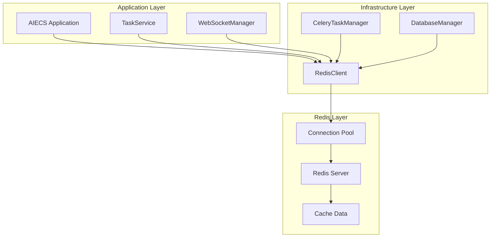
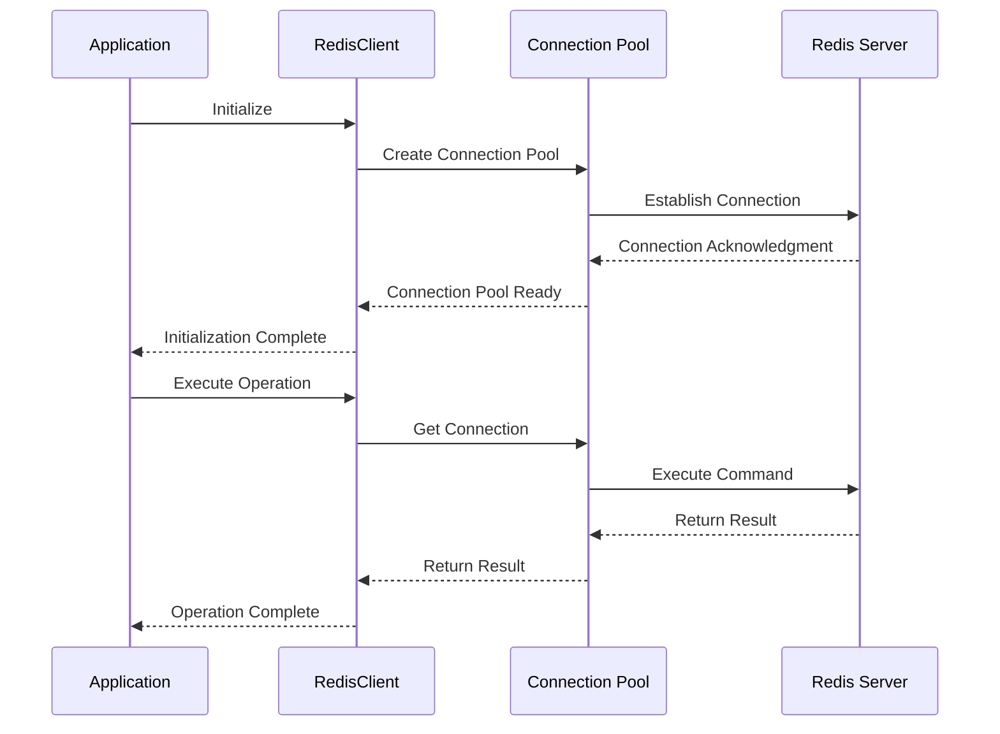
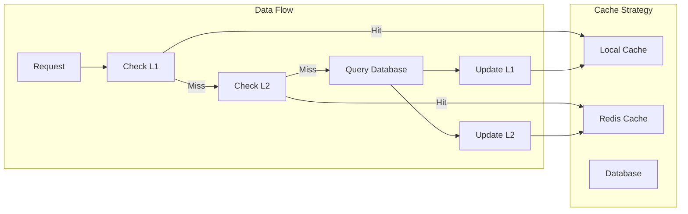

# RedisClient Technical Documentation

## 1. Overview

### Purpose
`RedisClient` is a component specifically designed for Redis database connection and operations, built on the `redis.asyncio` asynchronous Redis driver. It provides core functionalities including connection pool management, asynchronous operations, error handling, etc., serving as key infrastructure for caching and session management in the AIECS system.

### Core Value
- **Asynchronous Redis Operations**: High-performance asynchronous Redis access based on asyncio
- **Connection Pool Management**: Automatically manages Redis connection pools, improving concurrent performance
- **Singleton Pattern**: Globally shared Redis client instance, avoiding duplicate connections
- **Error Handling**: Comprehensive error handling and logging mechanisms
- **Simple and Easy to Use**: Provides concise API interface, hiding underlying complexity

## 2. Problem Background & Design Motivation

### Problem Background
In the AIECS system, a large amount of cache and session data needs to be handled, including:
- **Task Status Caching**: Need to cache task execution status and intermediate results
- **User Session Management**: Need to store and manage user session information
- **Distributed Locks**: Need to implement distributed lock mechanisms
- **Message Queue**: Need to serve as Celery's message broker
- **Real-Time Data**: Need to store real-time updated data

### Design Motivation
1. **Performance Optimization**: Improve data access performance through Redis caching
2. **State Management**: Provide reliable state storage and session management
3. **Distributed Support**: Support data sharing in distributed environments
4. **Connection Reuse**: Reduce connection overhead through connection pools
5. **Operational Simplification**: Provide unified Redis access interface

## 3. Architecture Positioning & Context

### System Architecture Location
```
┌─────────────────────────────────────────────────────────────┐
│                    AIECS System Architecture                │
├─────────────────────────────────────────────────────────────┤
│  Application Layer                                         │
│  ┌─────────────────┐  ┌─────────────────┐                  │
│  │ TaskService     │  │ WebSocketManager│                 │
│  └─────────────────┘  └─────────────────┘                  │
├─────────────────────────────────────────────────────────────┤
│  Infrastructure Layer                                      │
│  ┌─────────────────┐  ┌─────────────────┐                  │
│  │ RedisClient     │  │ CeleryTaskManager│                │
│  └─────────────────┘  └─────────────────┘                  │
├─────────────────────────────────────────────────────────────┤
│  Data Layer                                                │
│  ┌─────────────────┐  ┌─────────────────┐                  │
│  │ Redis Server    │  │ Connection Pool │                  │
│  └─────────────────┘  └─────────────────┘                  │
└─────────────────────────────────────────────────────────────┘
```

### Upstream Callers
- **TaskService**: Task management service that needs to cache task status
- **WebSocketManager**: WebSocket manager that needs to store session information
- **CeleryTaskManager**: Task executor that uses Redis as message broker
- **DatabaseManager**: Database manager that needs to cache query results

### Downstream Dependencies
- **Redis Server**: Redis database server
- **redis.asyncio**: Asynchronous Redis client library
- **Connection Pool**: Redis connection pool management

## 4. Core Features & Use Cases

### 4.1 Basic Redis Operations

#### Key-Value Operations
```python
# Get Redis client
redis_client = await get_redis_client()

# Set key-value pairs
await redis_client.set("user:123:name", "John Doe")
await redis_client.set("user:123:email", "john@example.com", ex=3600)  # 1 hour expiration

# Get values
name = await redis_client.get("user:123:name")
email = await redis_client.get("user:123:email")

print(f"Username: {name}")
print(f"Email: {email}")

# Check if key exists
if await redis_client.exists("user:123:name"):
    print("User information exists")
```

#### Hash Table Operations
```python
# Set hash table fields
user_info = {
    "name": "John Doe",
    "email": "john@example.com",
    "age": "25",
    "city": "New York"
}
await redis_client.hset("user:123", user_info)

# Get single field
name = await redis_client.hget("user:123", "name")
print(f"Username: {name}")

# Get all fields
user_data = await redis_client.hgetall("user:123")
print(f"User information: {user_data}")

# Atomic increment
await redis_client.hincrby("user:123", "login_count", 1)
login_count = await redis_client.hget("user:123", "login_count")
print(f"Login count: {login_count}")
```

### 4.2 Task Status Caching

#### Cache Task Execution Status
```python
async def cache_task_status(task_id: str, status: str, progress: int):
    """Cache task status"""
    task_key = f"task:{task_id}"
    task_data = {
        "status": status,
        "progress": str(progress),
        "updated_at": str(int(time.time()))
    }
    
    # Set task status
    await redis_client.hset(task_key, task_data)
    
    # Set expiration time (24 hours)
    await redis_client.expire(task_key, 86400)
    
    print(f"Task {task_id} status cached: {status}")

# Get task status
async def get_task_status(task_id: str) -> dict:
    """Get task status"""
    task_key = f"task:{task_id}"
    
    if await redis_client.exists(task_key):
        return await redis_client.hgetall(task_key)
    else:
        return {"status": "not_found"}

# Usage example
await cache_task_status("task_456", "running", 75)
status = await get_task_status("task_456")
print(f"Task status: {status}")
```

#### Task Result Caching
```python
async def cache_task_result(task_id: str, result: dict):
    """Cache task result"""
    result_key = f"result:{task_id}"
    
    # Serialize result to JSON string
    import json
    result_json = json.dumps(result, ensure_ascii=False)
    
    # Cache result, set 1 hour expiration
    await redis_client.set(result_key, result_json, ex=3600)
    
    print(f"Task {task_id} result cached")

async def get_task_result(task_id: str) -> dict:
    """Get task result"""
    result_key = f"result:{task_id}"
    result_json = await redis_client.get(result_key)
    
    if result_json:
        import json
        return json.loads(result_json)
    else:
        return None

# Usage example
task_result = {
    "accuracy": 0.95,
    "processing_time": 120,
    "output_file": "result.csv"
}
await cache_task_result("task_789", task_result)
result = await get_task_result("task_789")
print(f"Task result: {result}")
```

### 4.3 User Session Management

#### Session Storage and Management
```python
async def create_user_session(user_id: str, session_data: dict) -> str:
    """Create user session"""
    session_id = f"session_{user_id}_{int(time.time())}"
    session_key = f"session:{session_id}"
    
    # Store session data
    session_data["user_id"] = user_id
    session_data["created_at"] = str(int(time.time()))
    
    await redis_client.hset(session_key, session_data)
    
    # Set session expiration time (30 minutes)
    await redis_client.expire(session_key, 1800)
    
    print(f"User {user_id} session created: {session_id}")
    return session_id

async def get_user_session(session_id: str) -> dict:
    """Get user session"""
    session_key = f"session:{session_id}"
    
    if await redis_client.exists(session_key):
        return await redis_client.hgetall(session_key)
    else:
        return {"error": "session_not_found"}

async def update_user_session(session_id: str, updates: dict):
    """Update user session"""
    session_key = f"session:{session_id}"
    
    if await redis_client.exists(session_key):
        await redis_client.hset(session_key, updates)
        # Extend expiration time
        await redis_client.expire(session_key, 1800)
        print(f"Session {session_id} updated")
    else:
        print(f"Session {session_id} does not exist")

# Usage example
session_id = await create_user_session("user_123", {
    "username": "John Doe",
    "role": "admin",
    "last_activity": str(int(time.time()))
})

session = await get_user_session(session_id)
print(f"Session information: {session}")

await update_user_session(session_id, {
    "last_activity": str(int(time.time())),
    "current_page": "/dashboard"
})
```

### 4.4 Distributed Lock Implementation

#### Redis-Based Distributed Lock
```python
import asyncio
import uuid

class DistributedLock:
    def __init__(self, redis_client, lock_name: str, timeout: int = 10):
        self.redis_client = redis_client
        self.lock_name = f"lock:{lock_name}"
        self.timeout = timeout
        self.identifier = str(uuid.uuid4())
    
    async def acquire(self) -> bool:
        """Acquire lock"""
        # Use SET command with NX and EX options for atomicity
        result = await self.redis_client.set(
            self.lock_name, 
            self.identifier, 
            ex=self.timeout,
            nx=True  # Only set if key does not exist
        )
        return result
    
    async def release(self) -> bool:
        """Release lock"""
        # Use Lua script to ensure only lock holder can release
        lua_script = """
        if redis.call("get", KEYS[1]) == ARGV[1] then
            return redis.call("del", KEYS[1])
        else
            return 0
        end
        """
        
        client = await self.redis_client.get_client()
        result = await client.eval(lua_script, 1, self.lock_name, self.identifier)
        return bool(result)
    
    async def __aenter__(self):
        if await self.acquire():
            return self
        else:
            raise Exception("Failed to acquire lock")
    
    async def __aexit__(self, exc_type, exc_val, exc_tb):
        await self.release()

# Use distributed lock
async def process_with_lock(resource_id: str):
    """Process resource with distributed lock"""
    lock = DistributedLock(redis_client, f"resource_{resource_id}")
    
    try:
        async with lock:
            print(f"Acquired lock for resource {resource_id}")
            # Execute operations requiring mutual exclusion
            await asyncio.sleep(2)
            print(f"Processing resource {resource_id} completed")
    except Exception as e:
        print(f"Processing resource {resource_id} failed: {e}")

# Concurrency test
async def test_distributed_lock():
    """Test distributed lock"""
    tasks = [
        process_with_lock("resource_1") for _ in range(5)
    ]
    await asyncio.gather(*tasks)
```

### 4.5 Cache Strategy Implementation

#### Multi-Level Cache Strategy
```python
class CacheManager:
    def __init__(self, redis_client):
        self.redis_client = redis_client
        self.local_cache = {}  # Local cache
        self.local_cache_ttl = {}
    
    async def get(self, key: str, ttl: int = 300) -> any:
        """Get cached data (multi-level cache)"""
        # 1. Check local cache
        if key in self.local_cache:
            if time.time() - self.local_cache_ttl[key] < 60:  # Local cache 1 minute
                return self.local_cache[key]
            else:
                # Local cache expired, delete
                del self.local_cache[key]
                del self.local_cache_ttl[key]
        
        # 2. Check Redis cache
        value = await self.redis_client.get(key)
        if value:
            # Update local cache
            self.local_cache[key] = value
            self.local_cache_ttl[key] = time.time()
            return value
        
        return None
    
    async def set(self, key: str, value: str, ttl: int = 300):
        """Set cached data"""
        # Set Redis cache
        await self.redis_client.set(key, value, ex=ttl)
        
        # Update local cache
        self.local_cache[key] = value
        self.local_cache_ttl[key] = time.time()
    
    async def delete(self, key: str):
        """Delete cached data"""
        # Delete Redis cache
        await self.redis_client.delete(key)
        
        # Delete local cache
        self.local_cache.pop(key, None)
        self.local_cache_ttl.pop(key, None)

# Use cache manager
cache_manager = CacheManager(redis_client)

# Cache database query results
async def get_user_from_cache(user_id: str) -> dict:
    """Get user information from cache"""
    cache_key = f"user:{user_id}"
    
    # Try to get from cache
    cached_data = await cache_manager.get(cache_key)
    if cached_data:
        import json
        return json.loads(cached_data)
    
    # Cache miss, query from database
    user_data = await database.get_user(user_id)
    
    # Store in cache
    if user_data:
        import json
        await cache_manager.set(cache_key, json.dumps(user_data), ttl=600)
    
    return user_data
```

## 5. API Reference

### 5.1 Class Definition

#### `RedisClient`
```python
class RedisClient:
    """Redis client singleton, used for sharing across different cache strategies"""
    
    def __init__(self) -> None
    """Initialize Redis client"""
```

### 5.2 Public Methods

#### `initialize`
```python
async def initialize(self) -> None
```
**Function**: Initialize Redis client

**Exceptions**:
- `Exception`: Initialization failed

#### `get_client`
```python
async def get_client(self) -> redis.Redis
```
**Function**: Get Redis client instance

**Returns**:
- `redis.Redis`: Redis client instance

**Exceptions**:
- `RuntimeError`: Client not initialized

#### `close`
```python
async def close(self) -> None
```
**Function**: Close Redis connection

#### `set`
```python
async def set(self, key: str, value: str, ex: int = None) -> bool
```
**Function**: Set key-value pair

**Parameters**:
- `key` (str): Key name
- `value` (str): Value
- `ex` (int): Expiration time (seconds)

**Returns**:
- `bool`: Whether setting succeeded

#### `get`
```python
async def get(self, key: str) -> Optional[str]
```
**Function**: Get value

**Parameters**:
- `key` (str): Key name

**Returns**:
- `Optional[str]`: Value corresponding to key, returns None if not exists

#### `hset`
```python
async def hset(self, name: str, mapping: dict) -> int
```
**Function**: Set hash table fields

**Parameters**:
- `name` (str): Hash table name
- `mapping` (dict): Field mapping

**Returns**:
- `int`: Number of fields set

#### `hget`
```python
async def hget(self, name: str, key: str) -> Optional[str]
```
**Function**: Get hash table field value

**Parameters**:
- `name` (str): Hash table name
- `key` (str): Field name

**Returns**:
- `Optional[str]`: Field value, returns None if not exists

#### `hgetall`
```python
async def hgetall(self, name: str) -> dict
```
**Function**: Get all hash table fields

**Parameters**:
- `name` (str): Hash table name

**Returns**:
- `dict`: Dictionary of all fields

#### `hincrby`
```python
async def hincrby(self, name: str, key: str, amount: int = 1) -> int
```
**Function**: Atomically increment hash table field

**Parameters**:
- `name` (str): Hash table name
- `key` (str): Field name
- `amount` (int): Increment amount

**Returns**:
- `int`: Value after increment

#### `exists`
```python
async def exists(self, name: str) -> bool
```
**Function**: Check if key exists

**Parameters**:
- `name` (str): Key name

**Returns**:
- `bool`: Whether key exists

#### `expire`
```python
async def expire(self, name: str, time: int) -> bool
```
**Function**: Set expiration time

**Parameters**:
- `name` (str): Key name
- `time` (int): Expiration time (seconds)

**Returns**:
- `bool`: Whether setting succeeded

#### `delete`
```python
async def delete(self, *keys) -> int
```
**Function**: Delete one or more keys

**Parameters**:
- `*keys`: Keys to delete

**Returns**:
- `int`: Number of keys deleted

#### `ping`
```python
async def ping(self) -> bool
```
**Function**: Test Redis connection

**Returns**:
- `bool`: Whether connection is normal

#### `info`
```python
async def info(self, section: str = None) -> dict
```
**Function**: Get Redis server information

**Parameters**:
- `section` (str): Information section

**Returns**:
- `dict`: Server information

### 5.3 Global Functions

#### `initialize_redis_client`
```python
async def initialize_redis_client() -> None
```
**Function**: Initialize global Redis client instance

#### `close_redis_client`
```python
async def close_redis_client() -> None
```
**Function**: Close global Redis client instance

#### `get_redis_client`
```python
async def get_redis_client() -> RedisClient
```
**Function**: Get global Redis client instance

**Returns**:
- `RedisClient`: Redis client instance

**Exceptions**:
- `RuntimeError`: Client not initialized

## 6. Technical Implementation Details

### 6.1 Connection Pool Management

#### Connection Pool Configuration
```python
async def initialize(self):
    """Initialize Redis client"""
    # Get configuration from environment variables
    redis_host = os.getenv('REDIS_HOST', 'localhost')
    redis_port = int(os.getenv('REDIS_PORT', 6379))
    redis_db = int(os.getenv('REDIS_DB', 0))
    redis_password = os.getenv('REDIS_PASSWORD')
    
    # Create connection pool
    self._connection_pool = redis.ConnectionPool(
        host=redis_host,
        port=redis_port,
        db=redis_db,
        password=redis_password,
        decode_responses=True,      # Automatically decode responses
        max_connections=20,         # Maximum connections
        retry_on_timeout=True       # Retry on timeout
    )
    
    # Create Redis client
    self._client = redis.Redis(connection_pool=self._connection_pool)
    
    # Test connection
    await self._client.ping()
```

### 6.2 Singleton Pattern Implementation

#### Global Instance Management
```python
# Global variable storing singleton instance
redis_client: Optional[RedisClient] = None

async def initialize_redis_client():
    """Create and initialize global Redis client instance"""
    global redis_client
    if redis_client is None:
        redis_client = RedisClient()
        await redis_client.initialize()

async def get_redis_client() -> RedisClient:
    """Get global Redis client instance"""
    if redis_client is None:
        raise RuntimeError("Redis client not initialized. Call initialize_redis_client() first.")
    return redis_client
```

### 6.3 Error Handling Strategy

#### Unified Error Handling
```python
async def set(self, key: str, value: str, ex: int = None) -> bool:
    """Set key-value pair (with error handling)"""
    try:
        client = await self.get_client()
        return await client.set(key, value, ex=ex)
    except Exception as e:
        logger.error(f"Redis set failed for key {key}: {e}")
        return False

async def get(self, key: str) -> Optional[str]:
    """Get value (with error handling)"""
    try:
        client = await self.get_client()
        return await client.get(key)
    except Exception as e:
        logger.error(f"Redis get failed for key {key}: {e}")
        return None
```

### 6.4 Connection Health Check

#### Connection Status Monitoring
```python
async def ping(self) -> bool:
    """Test Redis connection"""
    try:
        client = await self.get_client()
        result = await client.ping()
        return result
    except Exception as e:
        logger.error(f"Redis ping failed: {e}")
        return False

async def get_connection_info(self) -> dict:
    """Get connection information"""
    try:
        client = await self.get_client()
        info = await client.info('clients')
        return {
            'connected_clients': info.get('connected_clients', 0),
            'client_recent_max_input_buffer': info.get('client_recent_max_input_buffer', 0),
            'client_recent_max_output_buffer': info.get('client_recent_max_output_buffer', 0)
        }
    except Exception as e:
        logger.error(f"Failed to get connection info: {e}")
        return {}
```

## 7. Configuration & Deployment

### 7.1 Basic Configuration

#### Environment Variable Configuration
```bash
# Redis connection configuration
export REDIS_HOST="localhost"
export REDIS_PORT="6379"
export REDIS_DB="0"
export REDIS_PASSWORD="your_password"

# Connection pool configuration
export REDIS_MAX_CONNECTIONS="20"
export REDIS_RETRY_ON_TIMEOUT="true"
export REDIS_DECODE_RESPONSES="true"
```

#### Code Configuration
```python
# Custom configuration
redis_config = {
    'host': 'redis.example.com',
    'port': 6379,
    'db': 0,
    'password': 'secure_password',
    'max_connections': 50,
    'retry_on_timeout': True,
    'decode_responses': True
}

# Create custom client
custom_client = RedisClient()
# Note: Current implementation uses environment variables, need to modify code to support custom configuration
```

### 7.2 Docker Deployment

#### Docker Compose Configuration
```yaml
version: '3.8'
services:
  redis:
    image: redis:7-alpine
    ports:
      - "6379:6379"
    environment:
      - REDIS_PASSWORD=your_password
    command: redis-server --requirepass your_password
    volumes:
      - redis_data:/data
    restart: unless-stopped

  aiecs-app:
    build: .
    environment:
      - REDIS_HOST=redis
      - REDIS_PORT=6379
      - REDIS_DB=0
      - REDIS_PASSWORD=your_password
    depends_on:
      - redis
    restart: unless-stopped

volumes:
  redis_data:
```

#### Dockerfile Configuration
```dockerfile
FROM python:3.9-slim

WORKDIR /app

# Install dependencies
COPY requirements.txt .
RUN pip install -r requirements.txt

# Copy application code
COPY . .

# Set environment variables
ENV REDIS_HOST=redis
ENV REDIS_PORT=6379
ENV REDIS_DB=0

# Start command
CMD ["python", "-m", "aiecs.infrastructure.persistence.redis_client"]
```

### 7.3 Production Environment Configuration

#### High Availability Configuration
```python
# Production environment Redis configuration
production_config = {
    'host': 'redis-cluster.internal',
    'port': 6379,
    'db': 0,
    'password': 'production_password',
    'max_connections': 100,
    'retry_on_timeout': True,
    'decode_responses': True,
    'socket_keepalive': True,
    'socket_keepalive_options': {},
    'health_check_interval': 30
}
```

#### Redis Cluster Configuration
```yaml
# redis-cluster.yml
version: '3.8'
services:
  redis-node-1:
    image: redis:7-alpine
    command: redis-server --cluster-enabled yes --cluster-config-file nodes.conf --cluster-node-timeout 5000 --appendonly yes --port 7001
    ports:
      - "7001:7001"
    volumes:
      - redis_node_1:/data

  redis-node-2:
    image: redis:7-alpine
    command: redis-server --cluster-enabled yes --cluster-config-file nodes.conf --cluster-node-timeout 5000 --appendonly yes --port 7002
    ports:
      - "7002:7002"
    volumes:
      - redis_node_2:/data

  redis-node-3:
    image: redis:7-alpine
    command: redis-server --cluster-enabled yes --cluster-config-file nodes.conf --cluster-node-timeout 5000 --appendonly yes --port 7003
    ports:
      - "7003:7003"
    volumes:
      - redis_node_3:/data

volumes:
  redis_node_1:
  redis_node_2:
  redis_node_3:
```

## 8. Maintenance & Troubleshooting

### 8.1 Monitoring Metrics

#### Key Metrics
- **Connection Count**: Current active connection count
- **Memory Usage**: Redis memory usage
- **Command Execution Count**: Number of commands executed per second
- **Key Count**: Total number of keys in database
- **Hit Rate**: Cache hit rate

#### Monitoring Implementation
```python
class RedisMonitor:
    def __init__(self, redis_client: RedisClient):
        self.redis_client = redis_client
    
    async def get_health_status(self) -> dict:
        """Get Redis health status"""
        try:
            # Test connection
            ping_result = await self.redis_client.ping()
            if not ping_result:
                return {"status": "unhealthy", "error": "ping_failed"}
            
            # Get server information
            info = await self.redis_client.info()
            
            return {
                "status": "healthy",
                "connected_clients": info.get("connected_clients", 0),
                "used_memory": info.get("used_memory_human", "0B"),
                "total_commands_processed": info.get("total_commands_processed", 0),
                "keyspace_hits": info.get("keyspace_hits", 0),
                "keyspace_misses": info.get("keyspace_misses", 0),
                "uptime_in_seconds": info.get("uptime_in_seconds", 0)
            }
        except Exception as e:
            return {"status": "unhealthy", "error": str(e)}
    
    async def get_memory_usage(self) -> dict:
        """Get memory usage"""
        try:
            info = await self.redis_client.info('memory')
            return {
                "used_memory": info.get("used_memory", 0),
                "used_memory_human": info.get("used_memory_human", "0B"),
                "used_memory_peak": info.get("used_memory_peak", 0),
                "used_memory_peak_human": info.get("used_memory_peak_human", "0B"),
                "used_memory_rss": info.get("used_memory_rss", 0),
                "used_memory_rss_human": info.get("used_memory_rss_human", "0B")
            }
        except Exception as e:
            return {"error": str(e)}
    
    async def get_performance_metrics(self) -> dict:
        """Get performance metrics"""
        try:
            info = await self.redis_client.info('stats')
            return {
                "total_commands_processed": info.get("total_commands_processed", 0),
                "instantaneous_ops_per_sec": info.get("instantaneous_ops_per_sec", 0),
                "keyspace_hits": info.get("keyspace_hits", 0),
                "keyspace_misses": info.get("keyspace_misses", 0),
                "expired_keys": info.get("expired_keys", 0),
                "evicted_keys": info.get("evicted_keys", 0)
            }
        except Exception as e:
            return {"error": str(e)}

# Use monitor
monitor = RedisMonitor(redis_client)
health = await monitor.get_health_status()
print(f"Redis health status: {health}")
```

### 8.2 Common Issues & Solutions

#### Issue 1: Connection Timeout
**Symptoms**: `redis.exceptions.TimeoutError` error

**Possible Causes**:
- Unstable network connection
- Redis server overload
- Improper connection pool configuration

**Solutions**:
```python
# 1. Check network connection
import socket
def check_redis_connection(host: str, port: int) -> bool:
    try:
        sock = socket.socket(socket.AF_INET, socket.SOCK_STREAM)
        sock.settimeout(5)
        result = sock.connect_ex((host, port))
        sock.close()
        return result == 0
    except:
        return False

# 2. Adjust connection pool configuration
redis_config = {
    'max_connections': 10,  # Reduce connection count
    'retry_on_timeout': True,
    'socket_connect_timeout': 5,
    'socket_timeout': 5
}

# 3. Implement connection retry mechanism
async def robust_redis_operation(operation, *args, **kwargs):
    """Redis operation with retry"""
    max_retries = 3
    for attempt in range(max_retries):
        try:
            return await operation(*args, **kwargs)
        except redis.exceptions.TimeoutError:
            if attempt == max_retries - 1:
                raise
            await asyncio.sleep(1 * (2 ** attempt))  # Exponential backoff
```

#### Issue 2: Out of Memory
**Symptoms**: `redis.exceptions.ResponseError: OOM command not allowed when used memory > 'maxmemory'`

**Possible Causes**:
- Redis memory usage exceeds limit
- No appropriate eviction policy set
- Too much cached data

**Solutions**:
```python
# 1. Check memory usage
async def check_memory_usage():
    """Check memory usage"""
    info = await redis_client.info('memory')
    used_memory = info.get('used_memory', 0)
    max_memory = info.get('maxmemory', 0)
    
    if max_memory > 0:
        usage_percent = (used_memory / max_memory) * 100
        print(f"Memory usage: {usage_percent:.2f}%")
        
        if usage_percent > 90:
            print("Warning: Memory usage too high")
    
    return used_memory, max_memory

# 2. Clean expired keys
async def cleanup_expired_keys():
    """Clean expired keys"""
    # Manually trigger expired key cleanup
    client = await redis_client.get_client()
    await client.execute_command('MEMORY', 'PURGE')
    print("Expired keys cleaned")

# 3. Set memory eviction policy
# In Redis configuration set:
# maxmemory-policy allkeys-lru
```

#### Issue 3: Keyspace Notification Loss
**Symptoms**: Key expiration events not triggered correctly

**Possible Causes**:
- Keyspace notifications not enabled
- Event listener not properly configured
- Network issues causing event loss

**Solutions**:
```python
# 1. Enable keyspace notifications
# In Redis configuration set:
# notify-keyspace-events Ex

# 2. Implement key expiration listener
async def listen_for_key_expiration():
    """Listen for key expiration events"""
    client = await redis_client.get_client()
    pubsub = client.pubsub()
    
    # Subscribe to key expiration events
    await pubsub.psubscribe('__keyevent@0__:expired')
    
    async for message in pubsub.listen():
        if message['type'] == 'pmessage':
            expired_key = message['data']
            print(f"Key expired: {expired_key}")
            # Handle expiration event
            await handle_key_expiration(expired_key)

async def handle_key_expiration(key: str):
    """Handle key expiration event"""
    if key.startswith('session:'):
        print(f"Session expired: {key}")
        # Clean up related data
    elif key.startswith('task:'):
        print(f"Task cache expired: {key}")
        # Update task status
```

#### Issue 4: Data Inconsistency
**Symptoms**: Read data inconsistent with expectations

**Possible Causes**:
- Concurrent write conflicts
- Transactions not properly executed
- Data inconsistency due to network partitions

**Solutions**:
```python
# 1. Use transactions to ensure atomicity
async def atomic_update_user_score(user_id: str, score_delta: int):
    """Atomically update user score"""
    client = await redis_client.get_client()
    
    # Use MULTI/EXEC transaction
    pipe = client.pipeline()
    pipe.hget(f"user:{user_id}", "score")
    pipe.hincrby(f"user:{user_id}", "score", score_delta)
    pipe.hset(f"user:{user_id}", "last_updated", str(int(time.time())))
    
    results = await pipe.execute()
    old_score = int(results[0] or 0)
    new_score = results[1]
    
    print(f"User {user_id} score updated: {old_score} -> {new_score}")
    return new_score

# 2. Use Lua script to ensure atomicity
async def atomic_transfer_points(from_user: str, to_user: str, points: int):
    """Atomically transfer points"""
    lua_script = """
    local from_key = KEYS[1]
    local to_key = KEYS[2]
    local points = tonumber(ARGV[1])
    
    local from_balance = tonumber(redis.call('hget', from_key, 'points') or 0)
    if from_balance < points then
        return {false, 'insufficient_balance'}
    end
    
    redis.call('hincrby', from_key, 'points', -points)
    redis.call('hincrby', to_key, 'points', points)
    
    return {true, 'success'}
    """
    
    client = await redis_client.get_client()
    result = await client.eval(
        lua_script, 
        2, 
        f"user:{from_user}", 
        f"user:{to_user}", 
        points
    )
    
    return result[0], result[1]
```

## 9. Visualizations

### 9.1 System Architecture Diagram



### 9.2 Connection Management Flow Diagram



### 9.3 Cache Strategy Diagram



## 10. Version History

### v1.0.0 (2024-01-15)
**New Features**:
- Basic Redis client implementation
- Support asynchronous operations
- Implement connection pool management
- Provide basic key-value operations

**Technical Features**:
- Built on redis.asyncio
- Support singleton pattern
- Implement basic error handling

### v1.1.0 (2024-02-01)
**Feature Enhancements**:
- Add hash table operation support
- Implement expiration time setting
- Add connection health check
- Support server information query

**Performance Optimizations**:
- Optimize connection pool configuration
- Improve error handling mechanism
- Enhance logging

### v1.2.0 (2024-03-01)
**New Features**:
- Support global instance management
- Add application lifecycle management
- Implement atomic operation support
- Provide monitoring interface

**Stability Improvements**:
- Enhance connection retry mechanism
- Improve resource management
- Optimize exception handling

### v1.3.0 (2024-04-01)
**Architecture Upgrades**:
- Upgrade to redis.asyncio 5.x
- Support Redis cluster
- Add data serialization support
- Implement advanced cache strategies

**Monitoring Enhancements**:
- Add detailed performance metrics
- Implement health check interface
- Support alert integration
- Provide operational management tools

---

## Appendix

### A. Related Documentation
- [Database Manager Documentation](./DATABASE_MANAGER.md)
- [File Storage Documentation](./FILE_STORAGE.md)
- [Celery Task Manager Documentation](../INFRASTRUCTURE_MESSAGEING/CELERY_TASK_MANAGER.md)

### B. External Dependencies
- [redis.asyncio Documentation](https://redis.readthedocs.io/en/stable/examples/asyncio_examples.html)
- [Redis Official Documentation](https://redis.io/docs/)
- [Redis Command Reference](https://redis.io/commands/)

### C. Best Practices
```python
# 1. Key naming conventions
# Use meaningful key prefixes and separators
key_patterns = [
    'user:{user_id}:profile',
    'task:{task_id}:status',
    'session:{session_id}:data',
    'cache:{type}:{id}'
]

# 2. Expiration time settings
# Set appropriate expiration times based on data characteristics
expiration_times = {
    'session': 1800,      # 30 minutes
    'cache': 3600,        # 1 hour
    'temp': 300,          # 5 minutes
    'permanent': None     # Never expires
}

# 3. Error handling best practices
async def safe_redis_operation(operation, *args, **kwargs):
    """Safe Redis operation"""
    try:
        return await operation(*args, **kwargs)
    except redis.exceptions.ConnectionError:
        logger.error("Redis connection error")
        return None
    except redis.exceptions.TimeoutError:
        logger.error("Redis operation timeout")
        return None
    except Exception as e:
        logger.error(f"Redis operation failed: {e}")
        return None
```

### D. Contact Information
- Technical Lead: AIECS Development Team
- Issue Reporting: Through project Issue system
- Documentation Updates: Regular maintenance, version synchronization
