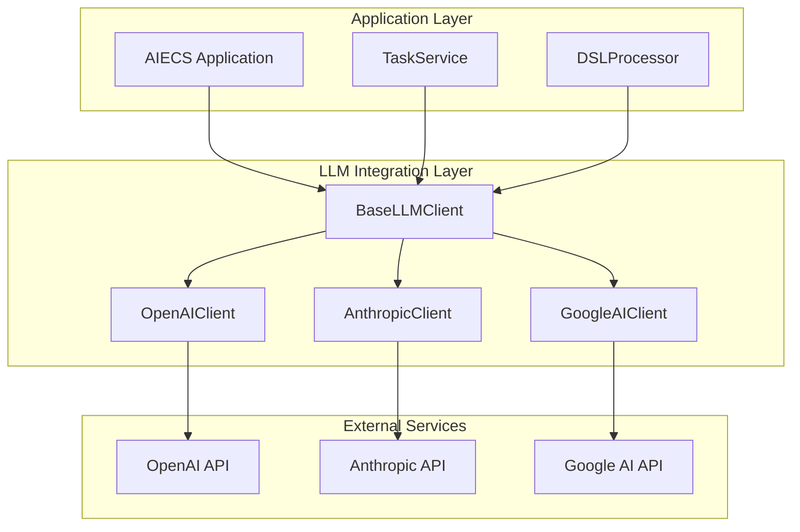
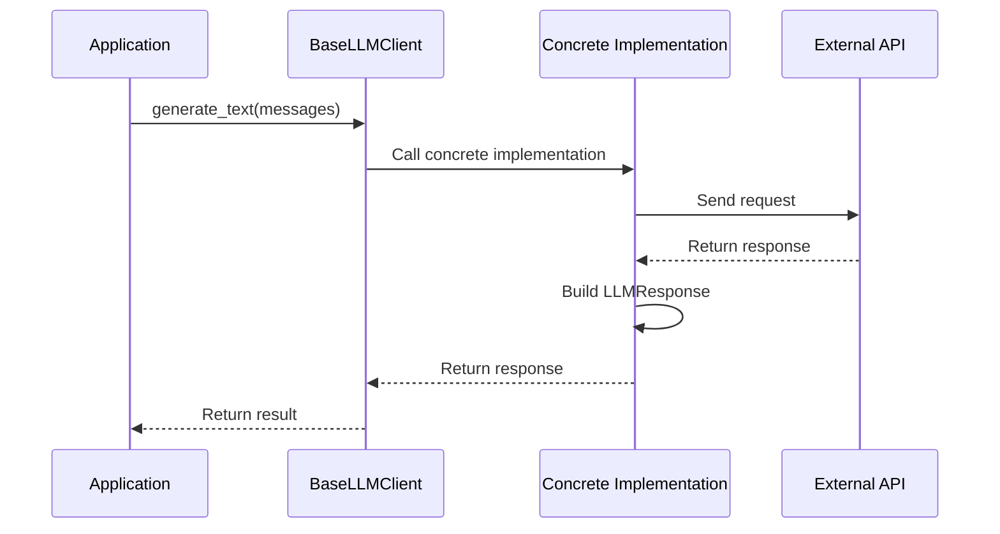
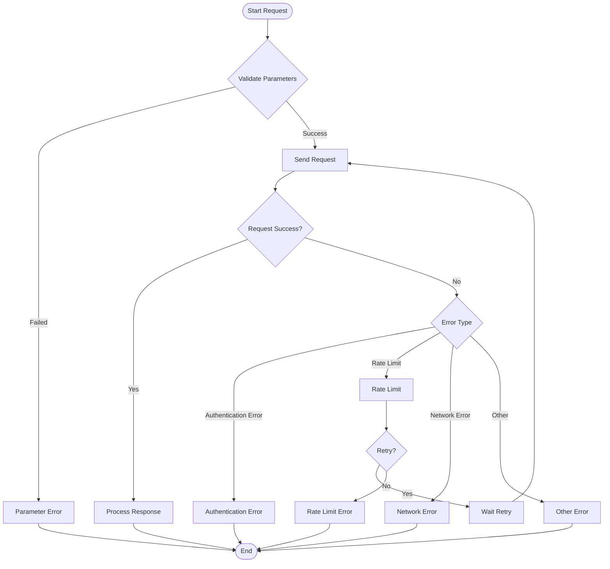

# BaseLLMClient Technical Documentation

## 1. Overview

### Purpose
`BaseLLMClient` is an abstract base class that provides a unified interface and foundational functionality for all Large Language Model (LLM) provider clients. It defines standard message formats, response structures, and core methods, implementing core features such as multi-provider support, asynchronous operations, and cost estimation. It is the core infrastructure of the LLM integration layer in the AIECS system.

### Core Value
- **Unified Interface**: Provides consistent API interfaces for different LLM providers
- **Async Support**: High-performance asynchronous operations based on asyncio
- **Streaming Processing**: Supports real-time streaming text generation
- **Cost Control**: Provides Token usage and cost estimation functionality
- **Error Handling**: Unified exception handling and error classification mechanisms

## 2. Problem Background & Design Motivation

### Problem Background
The AIECS system needs to integrate multiple large language model services, including:
- **Multi-Provider Support**: Need to simultaneously support different providers like OpenAI, Anthropic, Google, etc.
- **Interface Unification**: Different providers have significantly different API interfaces, requiring unified abstraction
- **Cost Management**: Need to track and estimate usage costs for different models
- **Performance Optimization**: Need to support asynchronous operations and streaming processing to improve user experience
- **Error Handling**: Need unified error handling and retry mechanisms

### Design Motivation
1. **Abstraction Unification**: Unify interfaces of different LLM providers through abstract base classes
2. **Extensibility**: Facilitate adding support for new LLM providers
3. **Cost Control**: Provide Token usage and cost estimation functionality
4. **Performance Optimization**: Support asynchronous operations and streaming processing
5. **Maintenance Simplification**: Unified error handling and logging mechanisms

## 3. Architecture Positioning & Context

### System Architecture Position
```
┌─────────────────────────────────────────────────────────────┐
│                    AIECS System Architecture                │
├─────────────────────────────────────────────────────────────┤
│  Application Layer                                         │
│  ┌─────────────────┐  ┌─────────────────┐                  │
│  │ TaskService     │  │ DSLProcessor    │                  │
│  └─────────────────┘  └─────────────────┘                  │
├─────────────────────────────────────────────────────────────┤
│  LLM Integration Layer                                     │
│  ┌─────────────────┐  ┌─────────────────┐                  │
│  │ BaseLLMClient   │  │ Concrete LLM Clients               │
│  └─────────────────┘  └─────────────────┘                  │
├─────────────────────────────────────────────────────────────┤
│  External Services Layer                                   │
│  ┌─────────────────┐  ┌─────────────────┐                  │
│  │ OpenAI API      │  │ Anthropic API   │                  │
│  └─────────────────┘  └─────────────────┘                  │
└─────────────────────────────────────────────────────────────┘
```

### Upstream Callers
- **TaskService**: Task management service that needs to call LLM for text processing
- **DSLProcessor**: DSL processor that needs LLM for natural language understanding
- **ChatService**: Chat service that needs LLM for conversation generation
- **ContentGenerator**: Content generation service that needs LLM for content creation

### Downstream Dependencies
- **OpenAI API**: OpenAI large language model service
- **Anthropic API**: Anthropic Claude model service
- **Google AI API**: Google Gemini model service
- **Other LLM Providers**: Various third-party LLM services

## 4. Core Features & Use Cases

### 4.1 Basic Text Generation

#### Single Text Generation
```python
from aiecs.llm import BaseLLMClient, LLMMessage, LLMResponse

# Create message list
messages = [
    LLMMessage(role="system", content="You are a professional AI assistant specializing in technical questions."),
    LLMMessage(role="user", content="Please explain what asynchronous programming is?")
]

# Call LLM to generate text
async def generate_explanation():
    """Generate technical explanation"""
    # Here we need a concrete LLM client implementation
    # client = OpenAIClient()  # or other concrete implementation
    
    response = await client.generate_text(
        messages=messages,
        model="gpt-4",
        temperature=0.7,
        max_tokens=500
    )
    
    print(f"Generated content: {response.content}")
    print(f"Model used: {response.model}")
    print(f"Tokens used: {response.tokens_used}")
    print(f"Cost estimate: ${response.cost_estimate:.4f}")
    
    return response

# Usage example
response = await generate_explanation()
```

#### Conversational Interaction
```python
async def chat_with_llm():
    """Chat with LLM"""
    conversation = [
        LLMMessage(role="system", content="You are a friendly AI assistant."),
        LLMMessage(role="user", content="Hello, I want to learn Python programming."),
    ]
    
    # First round of conversation
    response1 = await client.generate_text(
        messages=conversation,
        temperature=0.8
    )
    
    print(f"AI: {response1.content}")
    
    # Add AI response to conversation history
    conversation.append(LLMMessage(role="assistant", content=response1.content))
    conversation.append(LLMMessage(role="user", content="Please recommend some learning resources."))
    
    # Second round of conversation
    response2 = await client.generate_text(
        messages=conversation,
        temperature=0.8
    )
    
    print(f"AI: {response2.content}")
    
    return conversation
```

### 4.2 Streaming Text Generation

#### Real-Time Streaming Output
```python
async def stream_text_generation():
    """Stream text generation"""
    messages = [
        LLMMessage(role="system", content="You are a creative writing assistant."),
        LLMMessage(role="user", content="Please write a short story about artificial intelligence.")
    ]
    
    print("Starting story generation...")
    
    # Stream generation
    async for chunk in client.stream_text(
        messages=messages,
        model="gpt-4",
        temperature=0.9,
        max_tokens=1000
    ):
        print(chunk, end='', flush=True)  # Real-time output
    
    print("\nStory generation completed!")

# Usage example
await stream_text_generation()
```

#### Streaming Chat System
```python
async def interactive_chat():
    """Interactive chat system"""
    conversation = [
        LLMMessage(role="system", content="You are a professional programming tutor.")
    ]
    
    while True:
        user_input = input("\nUser: ")
        if user_input.lower() in ['quit', 'exit']:
            break
        
        conversation.append(LLMMessage(role="user", content=user_input))
        
        print("AI: ", end='', flush=True)
        
        # Stream generate response
        ai_response = ""
        async for chunk in client.stream_text(
            messages=conversation,
            temperature=0.7
        ):
            print(chunk, end='', flush=True)
            ai_response += chunk
        
        conversation.append(LLMMessage(role="assistant", content=ai_response))
        print()  # New line

# Usage example
await interactive_chat()
```

### 4.3 Task Processing Integration

#### Task Description Generation
```python
async def generate_task_description(user_input: str) -> str:
    """Generate task description from user input"""
    messages = [
        LLMMessage(
            role="system", 
            content="You are a task analysis expert capable of converting user natural language descriptions into structured task descriptions."
        ),
        LLMMessage(
            role="user", 
            content=f"Please analyze the following user requirement and generate a detailed task description: {user_input}"
        )
    ]
    
    response = await client.generate_text(
        messages=messages,
        model="gpt-4",
        temperature=0.3,  # Lower temperature ensures consistency
        max_tokens=300
    )
    
    return response.content

# Usage example
user_request = "I want to analyze sales data and generate a report"
task_description = await generate_task_description(user_request)
print(f"Generated task description: {task_description}")
```

#### Code Generation and Optimization
```python
async def generate_code(requirements: str, language: str = "python") -> str:
    """Generate code based on requirements"""
    messages = [
        LLMMessage(
            role="system",
            content=f"You are a professional {language} programmer capable of generating high-quality code based on requirements."
        ),
        LLMMessage(
            role="user",
            content=f"Please generate {language} code based on the following requirements:\n{requirements}"
        )
    ]
    
    response = await client.generate_text(
        messages=messages,
        model="gpt-4",
        temperature=0.2,  # Low temperature ensures code accuracy
        max_tokens=1000
    )
    
    return response.content

# Usage example
requirements = "Implement a quicksort algorithm with detailed comments"
code = await generate_code(requirements, "python")
print(f"Generated code:\n{code}")
```

### 4.4 Content Analysis and Processing

#### Text Summarization
```python
async def summarize_text(text: str, max_length: int = 200) -> str:
    """Generate text summary"""
    messages = [
        LLMMessage(
            role="system",
            content=f"You are a professional text summarization expert capable of generating concise and accurate summaries, not exceeding {max_length} characters."
        ),
        LLMMessage(
            role="user",
            content=f"Please generate a summary for the following text:\n\n{text}"
        )
    ]
    
    response = await client.generate_text(
        messages=messages,
        model="gpt-3.5-turbo",
        temperature=0.3,
        max_tokens=max_length
    )
    
    return response.content

# Usage example
long_text = """
Artificial Intelligence (AI) is a branch of computer science that attempts to understand the essence of intelligence,
and produce a new type of intelligent machine that can react in ways similar to human intelligence...
"""
summary = await summarize_text(long_text, 100)
print(f"Summary: {summary}")
```

#### Sentiment Analysis
```python
async def analyze_sentiment(text: str) -> dict:
    """Analyze text sentiment"""
    messages = [
        LLMMessage(
            role="system",
            content="You are a sentiment analysis expert capable of accurately analyzing text sentiment. Please return JSON format: {'sentiment': 'positive/negative/neutral', 'confidence': 0.0-1.0, 'reason': 'analysis reason'}"
        ),
        LLMMessage(
            role="user",
            content=f"Please analyze the sentiment of the following text: {text}"
        )
    ]
    
    response = await client.generate_text(
        messages=messages,
        model="gpt-3.5-turbo",
        temperature=0.1,  # Low temperature ensures consistency
        max_tokens=200
    )
    
    import json
    try:
        return json.loads(response.content)
    except json.JSONDecodeError:
        return {"error": "Unable to parse response", "raw_response": response.content}

# Usage example
text = "This product is really great, I'm very satisfied!"
sentiment = await analyze_sentiment(text)
print(f"Sentiment analysis result: {sentiment}")
```

### 4.5 Batch Processing

#### Batch Text Processing
```python
async def batch_process_texts(texts: List[str], operation: str) -> List[str]:
    """Batch process texts"""
    results = []
    
    for i, text in enumerate(texts):
        print(f"Processing text {i+1}/{len(texts)}")
        
        messages = [
            LLMMessage(
                role="system",
                content=f"You are a text processing expert, please perform the following operation: {operation}"
            ),
            LLMMessage(role="user", content=text)
        ]
        
        response = await client.generate_text(
            messages=messages,
            model="gpt-3.5-turbo",
            temperature=0.3
        )
        
        results.append(response.content)
        
        # Add delay to avoid rate limiting
        await asyncio.sleep(0.1)
    
    return results

# Usage example
texts = [
    "This is the first text",
    "This is the second text",
    "This is the third text"
]
processed = await batch_process_texts(texts, "Convert text to formal business language")
for i, result in enumerate(processed):
    print(f"Text {i+1}: {result}")
```

## 5. API Reference

### 5.1 Data Class Definitions

#### `LLMMessage`
```python
@dataclass
class LLMMessage:
    """LLM message data class"""
    role: str      # Role: "system", "user", "assistant"
    content: str   # Message content
```

#### `LLMResponse`
```python
@dataclass
class LLMResponse:
    """LLM response data class"""
    content: str                    # Response content
    provider: str                   # Provider name
    model: str                      # Model name
    tokens_used: Optional[int] = None           # Total tokens
    prompt_tokens: Optional[int] = None         # Input tokens
    completion_tokens: Optional[int] = None     # Output tokens
    cost_estimate: Optional[float] = None       # Cost estimate
    response_time: Optional[float] = None       # Response time
```

### 5.2 Exception Class Definitions

#### `LLMClientError`
```python
class LLMClientError(Exception):
    """LLM client base exception"""
    pass
```

#### `ProviderNotAvailableError`
```python
class ProviderNotAvailableError(LLMClientError):
    """Provider not available exception"""
    pass
```

#### `RateLimitError`
```python
class RateLimitError(LLMClientError):
    """Rate limit exception"""
    pass
```

### 5.3 Abstract Base Class

#### `BaseLLMClient`
```python
class BaseLLMClient(ABC):
    """Abstract base class for all LLM provider clients"""
    
    def __init__(self, provider_name: str) -> None
    """Initialize LLM client
    
    Args:
        provider_name: Provider name
    """
```

### 5.4 Abstract Methods

#### `generate_text`
```python
@abstractmethod
async def generate_text(
    self,
    messages: List[LLMMessage],
    model: Optional[str] = None,
    temperature: float = 0.7,
    max_tokens: Optional[int] = None,
    **kwargs
) -> LLMResponse
```
**Function**: Generate text

**Parameters**:
- `messages` (List[LLMMessage]): Message list
- `model` (Optional[str]): Model name
- `temperature` (float): Temperature parameter, default 0.7
- `max_tokens` (Optional[int]): Maximum tokens
- `**kwargs`: Other parameters

**Returns**:
- `LLMResponse`: LLM response object

#### `stream_text`
```python
@abstractmethod
async def stream_text(
    self,
    messages: List[LLMMessage],
    model: Optional[str] = None,
    temperature: float = 0.7,
    max_tokens: Optional[int] = None,
    **kwargs
) -> AsyncGenerator[str, None]
```
**Function**: Stream generate text

**Parameters**: Same as `generate_text`

**Returns**:
- `AsyncGenerator[str, None]`: Text chunk generator

#### `close`
```python
@abstractmethod
async def close(self) -> None
```
**Function**: Clean up resources

### 5.5 Utility Methods

#### `_count_tokens_estimate`
```python
def _count_tokens_estimate(self, text: str) -> int
```
**Function**: Estimate token count

**Parameters**:
- `text` (str): Text content

**Returns**:
- `int`: Estimated token count

#### `_estimate_cost`
```python
def _estimate_cost(self, model: str, input_tokens: int, output_tokens: int, token_costs: Dict) -> float
```
**Function**: Estimate cost

**Parameters**:
- `model` (str): Model name
- `input_tokens` (int): Input token count
- `output_tokens` (int): Output token count
- `token_costs` (Dict): Token cost configuration

**Returns**:
- `float`: Estimated cost

## 6. Technical Implementation Details

### 6.1 Abstract Base Class Design

#### Interface Unification
```python
class BaseLLMClient(ABC):
    """Abstract base class design"""
    
    def __init__(self, provider_name: str):
        self.provider_name = provider_name
        self.logger = logging.getLogger(f"{__name__}.{provider_name}")
    
    @abstractmethod
    async def generate_text(self, messages: List[LLMMessage], **kwargs) -> LLMResponse:
        """Unified text generation interface"""
        pass
    
    @abstractmethod
    async def stream_text(self, messages: List[LLMMessage], **kwargs) -> AsyncGenerator[str, None]:
        """Unified streaming generation interface"""
        pass
```

### 6.2 Data Class Design

#### Message Structure
```python
@dataclass
class LLMMessage:
    """Standardized message structure"""
    role: str      # Role type
    content: str   # Message content
    
    def __post_init__(self):
        """Validate message format"""
        if self.role not in ["system", "user", "assistant"]:
            raise ValueError(f"Invalid role: {self.role}")
        if not self.content.strip():
            raise ValueError("Message content cannot be empty")
```

#### Response Structure
```python
@dataclass
class LLMResponse:
    """Standardized response structure"""
    content: str
    provider: str
    model: str
    tokens_used: Optional[int] = None
    prompt_tokens: Optional[int] = None
    completion_tokens: Optional[int] = None
    cost_estimate: Optional[float] = None
    response_time: Optional[float] = None
    
    def __post_init__(self):
        """Ensure Token data consistency"""
        # If detailed Token info exists but no total, calculate total
        if (self.prompt_tokens is not None and 
            self.completion_tokens is not None and 
            self.tokens_used is None):
            self.tokens_used = self.prompt_tokens + self.completion_tokens
```

### 6.3 Error Handling Mechanism

#### Exception Hierarchy
```python
class LLMClientError(Exception):
    """Base exception class"""
    pass

class ProviderNotAvailableError(LLMClientError):
    """Provider not available"""
    pass

class RateLimitError(LLMClientError):
    """Rate limit"""
    pass

class AuthenticationError(LLMClientError):
    """Authentication error"""
    pass

class ModelNotFoundError(LLMClientError):
    """Model not found"""
    pass
```

#### Error Handling Strategy
```python
async def safe_generate_text(self, messages: List[LLMMessage], **kwargs) -> Optional[LLMResponse]:
    """Safe text generation (with error handling)"""
    try:
        return await self.generate_text(messages, **kwargs)
    except RateLimitError as e:
        self.logger.warning(f"Rate limit exceeded: {e}")
        # Implement backoff retry
        await asyncio.sleep(1)
        return await self.generate_text(messages, **kwargs)
    except ProviderNotAvailableError as e:
        self.logger.error(f"Provider not available: {e}")
        return None
    except Exception as e:
        self.logger.error(f"Unexpected error: {e}")
        raise LLMClientError(f"Text generation failed: {e}")
```

### 6.4 Cost Estimation Mechanism

#### Token Counting
```python
def _count_tokens_estimate(self, text: str) -> int:
    """Token count estimation"""
    # Simple estimation: approximately 4 characters equals 1 Token (English)
    return len(text) // 4

def _count_tokens_accurate(self, text: str, model: str) -> int:
    """Accurate Token counting (requires concrete implementation)"""
    # This needs to be implemented based on specific provider
    # For example, using tiktoken library
    pass
```

#### Cost Calculation
```python
def _estimate_cost(self, model: str, input_tokens: int, output_tokens: int, token_costs: Dict) -> float:
    """Cost estimation"""
    if model in token_costs:
        costs = token_costs[model]
        return (input_tokens * costs["input"] + output_tokens * costs["output"]) / 1000
    return 0.0

# Cost configuration example
TOKEN_COSTS = {
    "gpt-4": {
        "input": 0.03,    # Per 1K input tokens
        "output": 0.06    # Per 1K output tokens
    },
    "gpt-3.5-turbo": {
        "input": 0.0015,
        "output": 0.002
    }
}
```

### 6.5 Context Management

#### Async Context Manager
```python
async def __aenter__(self):
    """Async context manager entry"""
    return self

async def __aexit__(self, exc_type, exc_val, exc_tb):
    """Async context manager exit"""
    await self.close()

# Usage example
async with client as llm:
    response = await llm.generate_text(messages)
    # Automatically clean up resources
```

## 7. Configuration & Deployment

### 7.1 Basic Configuration

#### Environment Variable Configuration
```bash
# OpenAI configuration
export OPENAI_API_KEY="your_openai_api_key"
export OPENAI_BASE_URL="https://api.openai.com/v1"

# Anthropic configuration
export ANTHROPIC_API_KEY="your_anthropic_api_key"

# Google AI configuration
export GOOGLE_AI_API_KEY="your_google_ai_api_key"

# General configuration
export LLM_DEFAULT_MODEL="gpt-3.5-turbo"
export LLM_DEFAULT_TEMPERATURE="0.7"
export LLM_MAX_TOKENS="1000"
export LLM_TIMEOUT="30"
```

#### Configuration File
```python
# config/llm_config.py
LLM_CONFIG = {
    "providers": {
        "openai": {
            "api_key": os.getenv("OPENAI_API_KEY"),
            "base_url": os.getenv("OPENAI_BASE_URL", "https://api.openai.com/v1"),
            "models": ["gpt-4", "gpt-3.5-turbo", "gpt-3.5-turbo-16k"]
        },
        "anthropic": {
            "api_key": os.getenv("ANTHROPIC_API_KEY"),
            "models": ["claude-3-opus", "claude-3-sonnet", "claude-3-haiku"]
        },
        "google": {
            "api_key": os.getenv("GOOGLE_AI_API_KEY"),
            "models": ["gemini-pro", "gemini-pro-vision"]
        }
    },
    "defaults": {
        "model": "gpt-3.5-turbo",
        "temperature": 0.7,
        "max_tokens": 1000,
        "timeout": 30
    },
    "costs": {
        "gpt-4": {"input": 0.03, "output": 0.06},
        "gpt-3.5-turbo": {"input": 0.0015, "output": 0.002},
        "claude-3-opus": {"input": 0.015, "output": 0.075}
    }
}
```

### 7.2 Concrete Implementation Examples

#### OpenAI Client Implementation
```python
# llm/openai_client.py
import openai
from .base_client import BaseLLMClient, LLMMessage, LLMResponse

class OpenAIClient(BaseLLMClient):
    def __init__(self, api_key: str, base_url: str = None):
        super().__init__("openai")
        self.client = openai.AsyncOpenAI(
            api_key=api_key,
            base_url=base_url
        )
    
    async def generate_text(self, messages: List[LLMMessage], **kwargs) -> LLMResponse:
        """Implement OpenAI text generation"""
        start_time = time.time()
        
        # Convert message format
        openai_messages = [
            {"role": msg.role, "content": msg.content}
            for msg in messages
        ]
        
        # Call OpenAI API
        response = await self.client.chat.completions.create(
            messages=openai_messages,
            **kwargs
        )
        
        # Build response
        return LLMResponse(
            content=response.choices[0].message.content,
            provider="openai",
            model=response.model,
            prompt_tokens=response.usage.prompt_tokens,
            completion_tokens=response.usage.completion_tokens,
            tokens_used=response.usage.total_tokens,
            response_time=time.time() - start_time
        )
    
    async def stream_text(self, messages: List[LLMMessage], **kwargs) -> AsyncGenerator[str, None]:
        """Implement OpenAI streaming generation"""
        openai_messages = [
            {"role": msg.role, "content": msg.content}
            for msg in messages
        ]
        
        stream = await self.client.chat.completions.create(
            messages=openai_messages,
            stream=True,
            **kwargs
        )
        
        async for chunk in stream:
            if chunk.choices[0].delta.content:
                yield chunk.choices[0].delta.content
    
    async def close(self):
        """Clean up resources"""
        await self.client.close()
```

### 7.3 Docker Deployment

#### Dockerfile Configuration
```dockerfile
FROM python:3.9-slim

WORKDIR /app

# Install dependencies
COPY requirements.txt .
RUN pip install -r requirements.txt

# Copy application code
COPY . .

# Set environment variables
ENV LLM_DEFAULT_MODEL="gpt-3.5-turbo"
ENV LLM_DEFAULT_TEMPERATURE="0.7"

# Start command
CMD ["python", "-m", "aiecs.llm.base_client"]
```

#### Docker Compose Configuration
```yaml
version: '3.8'
services:
  llm-service:
    build: .
    environment:
      - OPENAI_API_KEY=${OPENAI_API_KEY}
      - ANTHROPIC_API_KEY=${ANTHROPIC_API_KEY}
      - GOOGLE_AI_API_KEY=${GOOGLE_AI_API_KEY}
      - LLM_DEFAULT_MODEL=gpt-3.5-turbo
    restart: unless-stopped
    ports:
      - "8000:8000"
```

## 8. Maintenance & Troubleshooting

### 8.1 Monitoring Metrics

#### Key Metrics
- **Request Success Rate**: `(successful requests / total requests) * 100%`
- **Average Response Time**: Average response time of LLM requests
- **Token Usage**: Usage statistics for input and output tokens
- **Cost Statistics**: Usage cost statistics for each model
- **Error Rate**: Error statistics classified by error type

#### Monitoring Implementation
```python
class LLMMonitor:
    def __init__(self):
        self.metrics = {
            "total_requests": 0,
            "successful_requests": 0,
            "failed_requests": 0,
            "total_tokens": 0,
            "total_cost": 0.0,
            "avg_response_time": 0.0
        }
    
    def record_request(self, success: bool, tokens: int, cost: float, response_time: float):
        """Record request metrics"""
        self.metrics["total_requests"] += 1
        if success:
            self.metrics["successful_requests"] += 1
        else:
            self.metrics["failed_requests"] += 1
        
        self.metrics["total_tokens"] += tokens
        self.metrics["total_cost"] += cost
        
        # Update average response time
        total = self.metrics["total_requests"]
        current_avg = self.metrics["avg_response_time"]
        self.metrics["avg_response_time"] = (current_avg * (total - 1) + response_time) / total
    
    def get_metrics(self) -> dict:
        """Get monitoring metrics"""
        success_rate = (self.metrics["successful_requests"] / 
                       max(self.metrics["total_requests"], 1)) * 100
        
        return {
            **self.metrics,
            "success_rate": success_rate,
            "error_rate": 100 - success_rate
        }

# Use monitor
monitor = LLMMonitor()

# Record metrics in requests
async def monitored_generate_text(self, messages: List[LLMMessage], **kwargs) -> LLMResponse:
    start_time = time.time()
    try:
        response = await self.generate_text(messages, **kwargs)
        monitor.record_request(
            success=True,
            tokens=response.tokens_used or 0,
            cost=response.cost_estimate or 0.0,
            response_time=time.time() - start_time
        )
        return response
    except Exception as e:
        monitor.record_request(
            success=False,
            tokens=0,
            cost=0.0,
            response_time=time.time() - start_time
        )
        raise
```

### 8.2 Common Issues and Solutions

#### Issue 1: Invalid API Key
**Symptoms**: `AuthenticationError` or `401 Unauthorized` error

**Possible Causes**:
- API key is incorrect or expired
- Insufficient key permissions
- Environment variables not set correctly

**Solution**:
```python
# 1. Validate API key
async def validate_api_key(provider: str, api_key: str) -> bool:
    """Validate API key"""
    try:
        if provider == "openai":
            client = openai.AsyncOpenAI(api_key=api_key)
            await client.models.list()
            return True
        elif provider == "anthropic":
            # Implement Anthropic key validation
            pass
        return False
    except Exception:
        return False

# 2. Check environment variables
def check_environment_variables():
    """Check environment variables"""
    required_vars = ["OPENAI_API_KEY", "ANTHROPIC_API_KEY"]
    missing_vars = []
    
    for var in required_vars:
        if not os.getenv(var):
            missing_vars.append(var)
    
    if missing_vars:
        raise ValueError(f"Missing environment variables: {missing_vars}")

# 3. Implement key rotation
class APIKeyManager:
    def __init__(self):
        self.keys = {
            "openai": [os.getenv("OPENAI_API_KEY_1"), os.getenv("OPENAI_API_KEY_2")],
            "anthropic": [os.getenv("ANTHROPIC_API_KEY_1"), os.getenv("ANTHROPIC_API_KEY_2")]
        }
        self.current_index = {provider: 0 for provider in self.keys}
    
    def get_key(self, provider: str) -> str:
        """Get currently available API key"""
        keys = self.keys[provider]
        current = self.current_index[provider]
        return keys[current]
    
    def rotate_key(self, provider: str):
        """Rotate to next API key"""
        self.current_index[provider] = (self.current_index[provider] + 1) % len(self.keys[provider])
```

#### Issue 2: Rate Limiting
**Symptoms**: `RateLimitError` or `429 Too Many Requests` error

**Possible Causes**:
- Request frequency exceeds limit
- Too many concurrent requests
- Quota exhausted

**Solution**:
```python
import asyncio
from functools import wraps

def rate_limit_retry(max_retries: int = 3, base_delay: float = 1.0):
    """Rate limit retry decorator"""
    def decorator(func):
        @wraps(func)
        async def wrapper(*args, **kwargs):
            for attempt in range(max_retries):
                try:
                    return await func(*args, **kwargs)
                except RateLimitError as e:
                    if attempt == max_retries - 1:
                        raise
                    
                    # Exponential backoff
                    delay = base_delay * (2 ** attempt)
                    logger.warning(f"Rate limit hit, retrying in {delay}s (attempt {attempt + 1}/{max_retries})")
                    await asyncio.sleep(delay)
            return None
        return wrapper
    return decorator

# Use retry decorator
@rate_limit_retry(max_retries=3, base_delay=1.0)
async def generate_text_with_retry(self, messages: List[LLMMessage], **kwargs) -> LLMResponse:
    return await self.generate_text(messages, **kwargs)

# Implement request queue
class RequestQueue:
    def __init__(self, max_concurrent: int = 5):
        self.semaphore = asyncio.Semaphore(max_concurrent)
        self.queue = asyncio.Queue()
    
    async def process_request(self, func, *args, **kwargs):
        """Process request (with concurrency control)"""
        async with self.semaphore:
            return await func(*args, **kwargs)
```

#### Issue 3: Model Not Available
**Symptoms**: `ModelNotFoundError` or `404 Not Found` error

**Possible Causes**:
- Incorrect model name
- Model not available in current region
- Model deprecated

**Solution**:
```python
class ModelManager:
    def __init__(self):
        self.available_models = {
            "openai": ["gpt-4", "gpt-3.5-turbo", "gpt-3.5-turbo-16k"],
            "anthropic": ["claude-3-opus", "claude-3-sonnet", "claude-3-haiku"],
            "google": ["gemini-pro", "gemini-pro-vision"]
        }
        self.fallback_models = {
            "gpt-4": "gpt-3.5-turbo",
            "claude-3-opus": "claude-3-sonnet"
        }
    
    def get_available_model(self, provider: str, requested_model: str) -> str:
        """Get available model"""
        available = self.available_models.get(provider, [])
        
        if requested_model in available:
            return requested_model
        
        # Try fallback model
        fallback = self.fallback_models.get(requested_model)
        if fallback and fallback in available:
            logger.warning(f"Model {requested_model} not available, using {fallback}")
            return fallback
        
        # Use default model
        default = available[0] if available else "gpt-3.5-turbo"
        logger.warning(f"Using default model {default}")
        return default
    
    async def validate_model(self, provider: str, model: str) -> bool:
        """Validate if model is available"""
        try:
            # Implement model validation logic
            return True
        except Exception:
            return False
```

#### Issue 4: Network Connection Problems
**Symptoms**: `ConnectionError` or timeout error

**Possible Causes**:
- Unstable network connection
- Proxy configuration issues
- DNS resolution failure

**Solution**:
```python
import aiohttp
from aiohttp import ClientTimeout, TCPConnector

class RobustHTTPClient:
    def __init__(self, timeout: int = 30, max_retries: int = 3):
        self.timeout = ClientTimeout(total=timeout)
        self.max_retries = max_retries
        
        # Configure connector
        connector = TCPConnector(
            limit=100,
            limit_per_host=30,
            keepalive_timeout=30,
            enable_cleanup_closed=True
        )
        
        self.session = aiohttp.ClientSession(
            timeout=self.timeout,
            connector=connector
        )
    
    async def request_with_retry(self, method: str, url: str, **kwargs):
        """Request with retry"""
        for attempt in range(self.max_retries):
            try:
                async with self.session.request(method, url, **kwargs) as response:
                    return await response.json()
            except (aiohttp.ClientError, asyncio.TimeoutError) as e:
                if attempt == self.max_retries - 1:
                    raise
                
                delay = 2 ** attempt
                logger.warning(f"Request failed (attempt {attempt + 1}/{self.max_retries}): {e}")
                await asyncio.sleep(delay)
    
    async def close(self):
        """Close session"""
        await self.session.close()
```

## 9. Visualizations

### 9.1 System Architecture Diagram



### 9.2 Request Flow Diagram



### 9.3 Error Handling Flow Diagram



## 10. Version History

### v1.0.0 (2024-01-15)
**New Features**:
- Basic abstract class implementation
- Support for message and response data structures
- Implement asynchronous operation interfaces
- Provide basic error handling

**Technical Features**:
- ABC abstract base class design
- Support for asynchronous generation and streaming processing
- Implement context manager

### v1.1.0 (2024-02-01)
**Feature Enhancements**:
- Add Token counting and cost estimation
- Implement error classification and exception handling
- Support multiple provider interfaces
- Add logging functionality

**Performance Optimizations**:
- Optimize asynchronous operation performance
- Improve error handling mechanisms
- Enhance resource management

### v1.2.0 (2024-03-01)
**New Features**:
- Support streaming text generation
- Add cost monitoring and statistics
- Implement request retry mechanism
- Provide health check interface

**Stability Improvements**:
- Enhance error recovery capabilities
- Improve concurrency control
- Optimize resource cleanup

### v1.3.0 (2024-04-01)
**Architecture Upgrades**:
- Support more LLM providers
- Add model management and fallback mechanisms
- Implement advanced caching strategies
- Support batch processing

**Monitoring Enhancements**:
- Add detailed performance metrics
- Implement cost analysis tools
- Support alert integration
- Provide operations management interface

---

## Appendix

### A. Related Documentation
- [LLM AI Clients Documentation](./LLM_AI_CLIENTS.md)
- [LLM Custom Callbacks Documentation](./LLM_CUSTOM_CALLBACKS.md)
- [Configuration Management Guide](../CONFIG/CONFIG_MANAGEMENT.md)

### B. External Dependencies
- [OpenAI Python Library](https://github.com/openai/openai-python)
- [Anthropic Python Library](https://github.com/anthropics/anthropic-sdk-python)
- [Google AI Python Library](https://github.com/google/generative-ai-python)

### C. Best Practices
```python
# 1. Message building best practices
def build_conversation(system_prompt: str, user_messages: List[str]) -> List[LLMMessage]:
    """Build conversation messages"""
    messages = [LLMMessage(role="system", content=system_prompt)]
    
    for i, content in enumerate(user_messages):
        role = "user" if i % 2 == 0 else "assistant"
        messages.append(LLMMessage(role=role, content=content))
    
    return messages

# 2. Error handling best practices
async def safe_llm_call(client: BaseLLMClient, messages: List[LLMMessage], **kwargs) -> Optional[LLMResponse]:
    """Safe LLM call"""
    try:
        return await client.generate_text(messages, **kwargs)
    except RateLimitError:
        logger.warning("Rate limit exceeded, implementing backoff")
        await asyncio.sleep(5)
        return await client.generate_text(messages, **kwargs)
    except ProviderNotAvailableError:
        logger.error("Provider not available, using fallback")
        return None
    except Exception as e:
        logger.error(f"Unexpected error: {e}")
        return None

# 3. Cost control best practices
class CostController:
    def __init__(self, daily_budget: float = 10.0):
        self.daily_budget = daily_budget
        self.daily_spent = 0.0
    
    def can_make_request(self, estimated_cost: float) -> bool:
        """Check if request can be made"""
        return self.daily_spent + estimated_cost <= self.daily_budget
    
    def record_cost(self, cost: float):
        """Record cost"""
        self.daily_spent += cost
```

### D. Contact Information
- Technical Lead: AIECS Development Team
- Issue Reporting: Through project Issue system
- Documentation Updates: Regular maintenance, version synchronization
