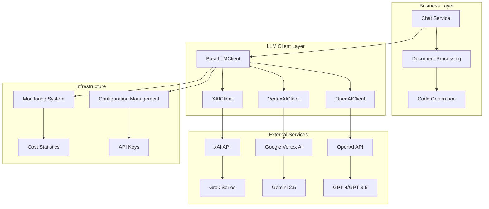
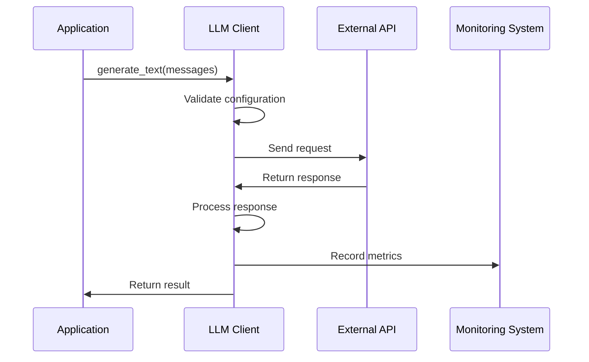
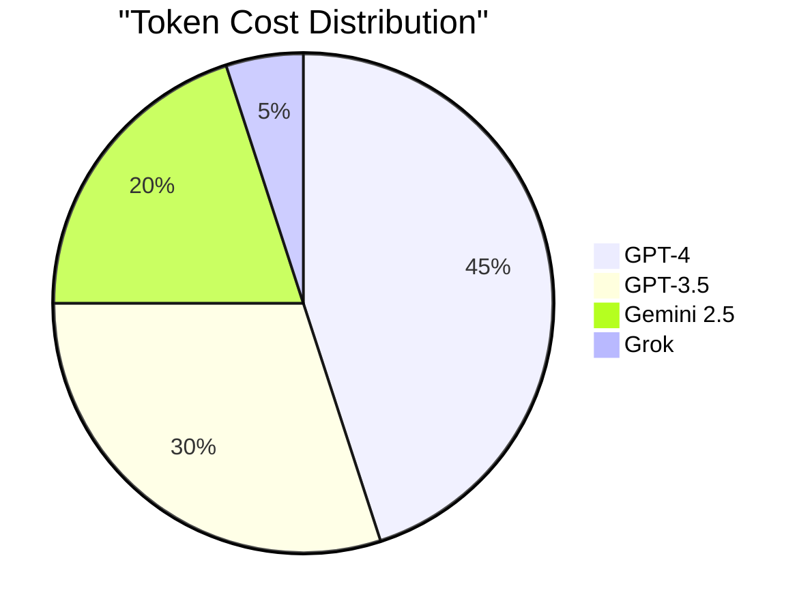
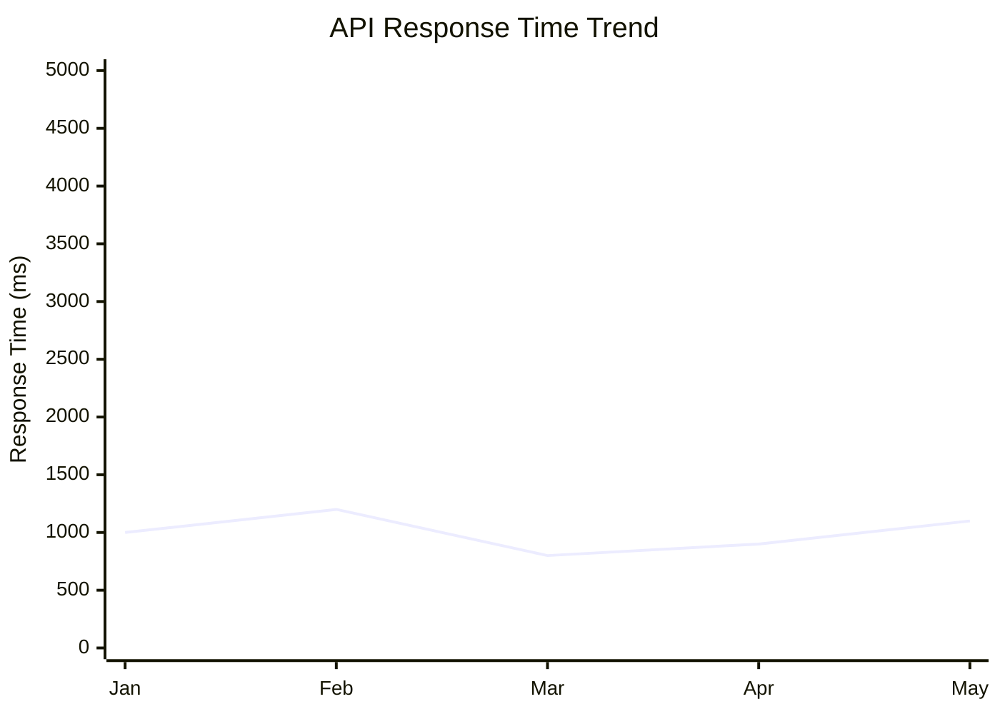

# LLM AI Clients Technical Documentation

## 1. Overview

**Purpose**: The LLM client module of the AIECS system provides a unified large language model interface, supporting three major AI service providers: OpenAI, Google Vertex AI, and xAI (Grok). Through abstract base class design, this module implements a unified calling interface for multiple vendors, solving critical issues such as complex AI service integration, vendor lock-in, and cost control.

**Core Value**:
- **Unified Interface**: Provides consistent API calling methods, shielding differences between vendors
- **Multi-Vendor Support**: Simultaneously supports three major services: OpenAI, Vertex AI, and xAI
- **Cost Control**: Built-in token cost estimation and usage statistics
- **High Availability**: Integrated retry mechanisms and error handling
- **Streaming Support**: Supports real-time streaming text generation

## 2. Problem Background & Design Motivation

### 2.1 Business Pain Points

The following challenges are faced in AI application development:

1. **Vendor Lock-in Risk**: Single vendor dependency leads to business risks
2. **Inconsistent Interfaces**: Different vendor APIs vary greatly, high development costs
3. **Uncontrollable Costs**: Lack of unified cost monitoring and optimization mechanisms
4. **Availability Guarantee**: Single point of failure affects business continuity
5. **Performance Optimization**: Lack of unified performance monitoring and tuning

### 2.2 Design Motivation

Based on the above pain points, a unified LLM client architecture was designed:

- **Abstraction Design**: Define unified interface through `BaseLLMClient`
- **Multi-Vendor Adaptation**: Implement dedicated clients for each vendor
- **Cost Transparency**: Built-in token cost calculation and statistics
- **Fault Tolerance**: Integrated retry and degradation strategies

## 3. Architecture Positioning & Context

### 3.1 System Architecture Diagram



### 3.2 Upstream and Downstream Dependencies

**Upstream Callers**:
- Business service layer (chat, document processing, etc.)
- Callback processors (token statistics, monitoring, etc.)

**Downstream Dependencies**:
- Vendor API services
- Configuration management system
- Monitoring and logging systems

## 4. Core Features & Use Cases

### 4.1 OpenAI Client

**Core Features**:
- Supports GPT-4, GPT-3.5, and other models
- Built-in cost estimation
- Retry mechanism and error handling
- Streaming text generation

**Usage Scenarios**:
```python
from aiecs.llm.openai_client import OpenAIClient
from aiecs.llm.base_client import LLMMessage

# Create client
client = OpenAIClient()

# Basic text generation
messages = [
    LLMMessage(role="user", content="Explain quantum computing")
]
response = await client.generate_text(messages, model="gpt-4")
print(f"Response: {response.content}")
print(f"Cost: ${response.cost_estimate:.4f}")

# Streaming generation
async for chunk in client.stream_text(messages):
    print(chunk, end="", flush=True)
```

### 4.2 Vertex AI Client

**Core Features**:
- Supports Gemini 2.5 series models
- Google Cloud authentication integration
- Safety filter configuration
- Asynchronous execution support

**Usage Scenarios**:
```python
from aiecs.llm.vertex_client import VertexAIClient

# Create client
client = VertexAIClient()

# Multi-turn conversation
messages = [
    LLMMessage(role="user", content="Hello"),
    LLMMessage(role="assistant", content="Hello! How can I help you?"),
    LLMMessage(role="user", content="Please write a poem")
]
response = await client.generate_text(messages, model="gemini-2.5-pro")
```

### 4.3 xAI Client

**Core Features**:
- Supports Grok series models
- OpenAI API format compatibility
- Model mapping and alias support
- Long timeout configuration

**Usage Scenarios**:
```python
from aiecs.llm.xai_client import XAIClient

# Create client
client = XAIClient()

# Use different Grok models
models = ["grok-4", "grok-3-reasoning", "grok-3-mini"]
for model in models:
    response = await client.generate_text(messages, model=model)
    print(f"{model}: {response.content[:100]}...")
```

## 5. API Reference

### 5.1 BaseLLMClient Abstract Base Class

#### Constructor
```python
def __init__(self, provider_name: str)
```

#### Abstract Methods

##### generate_text
```python
async def generate_text(
    self,
    messages: List[LLMMessage],
    model: Optional[str] = None,
    temperature: float = 0.7,
    max_tokens: Optional[int] = None,
    **kwargs
) -> LLMResponse
```

**Parameters**:
- `messages`: Message list
- `model`: Model name (optional)
- `temperature`: Temperature parameter (0.0-1.0)
- `max_tokens`: Maximum token count
- `**kwargs`: Additional parameters

**Returns**: `LLMResponse` object

##### stream_text
```python
async def stream_text(
    self,
    messages: List[LLMMessage],
    model: Optional[str] = None,
    temperature: float = 0.7,
    max_tokens: Optional[int] = None,
    **kwargs
) -> AsyncGenerator[str, None]
```

##### close
```python
async def close(self)
```

### 5.2 OpenAIClient

#### Constructor
```python
def __init__(self)
```

#### Features
- Supports GPT-4, GPT-3.5, and other models
- Built-in cost estimation
- Retry mechanism (3 attempts, exponential backoff)
- Streaming support

#### Cost Estimation
```python
token_costs = {
    "gpt-4": {"input": 0.03, "output": 0.06},
    "gpt-4-turbo": {"input": 0.01, "output": 0.03},
    "gpt-3.5-turbo": {"input": 0.0015, "output": 0.002},
    "gpt-4o": {"input": 0.005, "output": 0.015},
    "gpt-4o-mini": {"input": 0.00015, "output": 0.0006},
}
```

### 5.3 VertexAIClient

#### Constructor
```python
def __init__(self)
```

#### Features
- Supports Gemini 2.5 series
- Google Cloud authentication
- Safety filter configuration
- Asynchronous execution

#### Safety Settings
```python
safety_settings = {
    HarmCategory.HARM_CATEGORY_HARASSMENT: HarmBlockThreshold.BLOCK_NONE,
    HarmCategory.HARM_CATEGORY_HATE_SPEECH: HarmBlockThreshold.BLOCK_NONE,
    HarmCategory.HARM_CATEGORY_SEXUALLY_EXPLICIT: HarmBlockThreshold.BLOCK_NONE,
    HarmCategory.HARM_CATEGORY_DANGEROUS_CONTENT: HarmBlockThreshold.BLOCK_NONE,
}
```

### 5.4 XAIClient

#### Constructor
```python
def __init__(self)
```

#### Features
- Supports Grok series models
- OpenAI API compatibility
- Model mapping support
- Long timeout configuration (360 seconds)

#### Model Mapping
```python
model_map = {
    "grok-4": "grok-4",
    "grok-3": "grok-3",
    "grok-3-reasoning": "grok-3-reasoning",
    "grok-3-mini": "grok-3-mini",
    # ... more models
}
```

## 6. Technical Implementation Details

### 6.1 Asynchronous Processing Mechanism

**Design Principles**:
- All API calls are asynchronous
- Use `asyncio` for concurrency control
- Support both streaming and non-streaming modes

**Implementation Details**:
```python
# Asynchronous text generation
async def generate_text(self, messages, **kwargs):
    client = self._get_client()
    response = await client.chat.completions.create(
        model=model,
        messages=openai_messages,
        **kwargs
    )
    return self._process_response(response)
```

### 6.2 Retry Mechanism

**Strategy**:
- Use `tenacity` library for retry implementation
- Exponential backoff strategy: 1s, 2s, 4s
- Maximum 3 retries
- Retry for specific exception types

**Configuration**:
```python
@retry(
    stop=stop_after_attempt(3),
    wait=wait_exponential(multiplier=1, min=4, max=10),
    retry=retry_if_exception_type((httpx.RequestError, RateLimitError))
)
```

### 6.3 Error Handling

**Layered Processing**:
1. **API Level**: Handle HTTP errors and API limits
2. **Client Level**: Handle authentication and configuration errors
3. **Business Level**: Handle content filtering and response errors

**Exception Types**:
- `ProviderNotAvailableError`: Service unavailable
- `RateLimitError`: Rate limiting
- `LLMClientError`: General client error

### 6.4 Cost Estimation

**OpenAI Costs**:
```python
def _estimate_cost(self, model, input_tokens, output_tokens, token_costs):
    if model in token_costs:
        costs = token_costs[model]
        return (input_tokens * costs["input"] + output_tokens * costs["output"]) / 1000
    return 0.0
```

**Vertex AI Costs**:
- Gemini 2.5 Pro: $0.00125/1K input, $0.00375/1K output
- Gemini 2.5 Flash: $0.000075/1K input, $0.0003/1K output

### 6.5 Streaming Processing

**Implementation**:
```python
async def stream_text(self, messages, **kwargs):
    stream = await client.chat.completions.create(
        model=model,
        messages=messages,
        stream=True,
        **kwargs
    )
    
    async for chunk in stream:
        if chunk.choices[0].delta.content:
            yield chunk.choices[0].delta.content
```

## 7. Configuration & Deployment

### 7.1 Environment Variable Configuration

**OpenAI Configuration**:
```bash
OPENAI_API_KEY=sk-...
```

**Vertex AI Configuration**:
```bash
VERTEX_PROJECT_ID=your-project-id
VERTEX_LOCATION=us-central1
GOOGLE_APPLICATION_CREDENTIALS=/path/to/credentials.json
```

**xAI Configuration**:
```bash
XAI_API_KEY=xai-...
# Or backward compatible
GROK_API_KEY=xai-...
```

### 7.2 Dependency Management

**Core Dependencies**:
```python
# requirements.txt
openai>=1.0.0
google-cloud-aiplatform>=1.0.0
tenacity>=8.0.0
httpx>=0.24.0
```

### 7.3 Deployment Configuration

**Docker Configuration**:
```dockerfile
FROM python:3.9-slim

WORKDIR /app
COPY requirements.txt .
RUN pip install -r requirements.txt

COPY . .
CMD ["python", "-m", "aiecs.llm"]
```

**Kubernetes Configuration**:
```yaml
apiVersion: v1
kind: ConfigMap
metadata:
  name: llm-config
data:
  OPENAI_API_KEY: "sk-..."
  VERTEX_PROJECT_ID: "your-project"
  XAI_API_KEY: "xai-..."
```

## 8. Maintenance & Troubleshooting

### 8.1 Monitoring Metrics

**Key Metrics**:
- API call success rate
- Response time distribution
- Token usage
- Cost statistics
- Error rate

**Monitoring Configuration**:
```python
from prometheus_client import Counter, Histogram

api_calls_total = Counter('llm_api_calls_total', 'Total API calls', ['provider', 'model'])
api_duration = Histogram('llm_api_duration_seconds', 'API call duration', ['provider'])
api_errors = Counter('llm_api_errors_total', 'API errors', ['provider', 'error_type'])
```

### 8.2 Common Issues and Solutions

#### 8.2.1 API Key Issues

**Symptoms**:
- `ProviderNotAvailableError: API key not configured`
- Authentication failure errors

**Solution**:
```bash
# Check environment variables
echo $OPENAI_API_KEY
echo $XAI_API_KEY

# Validate key format
python -c "import os; print(len(os.getenv('OPENAI_API_KEY', '')))"
```

#### 8.2.2 Rate Limiting

**Symptoms**:
- `RateLimitError: Rate limit exceeded`
- HTTP 429 errors

**Solution**:
```python
# Increase retry delay
@retry(
    stop=stop_after_attempt(5),
    wait=wait_exponential(multiplier=2, min=4, max=60)
)
```

#### 8.2.3 Content Filtering

**Symptoms**:
- Vertex AI returns empty content
- Safety filters block responses

**Solution**:
```python
# Adjust safety settings
safety_settings = {
    HarmCategory.HARM_CATEGORY_HARASSMENT: HarmBlockThreshold.BLOCK_NONE,
    # ... other settings
}
```

### 8.3 Performance Optimization

**Caching Strategy**:
```python
from functools import lru_cache

@lru_cache(maxsize=128)
def _get_client(self):
    return AsyncOpenAI(api_key=self.api_key)
```

**Connection Pool Configuration**:
```python
client = AsyncOpenAI(
    api_key=api_key,
    http_client=httpx.AsyncClient(
        limits=httpx.Limits(max_keepalive_connections=20, max_connections=100)
    )
)
```

## 9. Visualizations

### 9.1 Architecture Flow Diagram



### 9.2 Cost Analysis Diagram



### 9.3 Performance Monitoring Diagram



## 10. Version History

### v1.0.0 (2024-01-15)
**New Features**:
- Implement `BaseLLMClient` abstract base class
- Support OpenAI GPT series models
- Integrate cost estimation and retry mechanism
- Add streaming text generation support

### v1.1.0 (2024-02-01)
**New Features**:
- Add Vertex AI client support
- Integrate Google Cloud authentication
- Support Gemini 2.5 series models
- Add safety filter configuration

### v1.2.0 (2024-03-01)
**New Features**:
- Add xAI (Grok) client support
- Implement model mapping and alias system
- Support all Grok series models
- Add long timeout configuration

### v1.3.0 (2024-04-01) [Planned]
**Planned Features**:
- Add Anthropic Claude support
- Implement intelligent model selection
- Add caching mechanism
- Support batch processing

---

## Appendix

### A. Related Documentation
- [Base LLM Client Documentation](./BASE_LLM_CLIENT.md)
- [Configuration Management Documentation](../CONFIG/CONFIG_MANAGEMENT.md)
- [Global Metrics Manager Documentation](../INFRASTRUCTURE_MONITORING/GLOBAL_METRICS_MANAGER.md)

### B. Example Code
- [Complete Example Project](https://github.com/aiecs/examples)
- [Performance Test Scripts](https://github.com/aiecs/performance-tests)

### C. Technical Support
- Technical Documentation: https://docs.aiecs.com
- Issue Reporting: https://github.com/aiecs/issues
