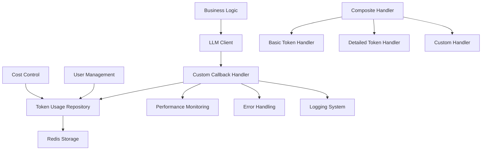
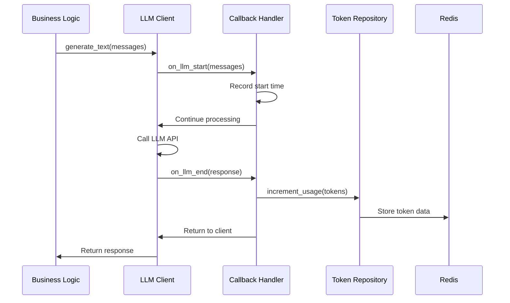
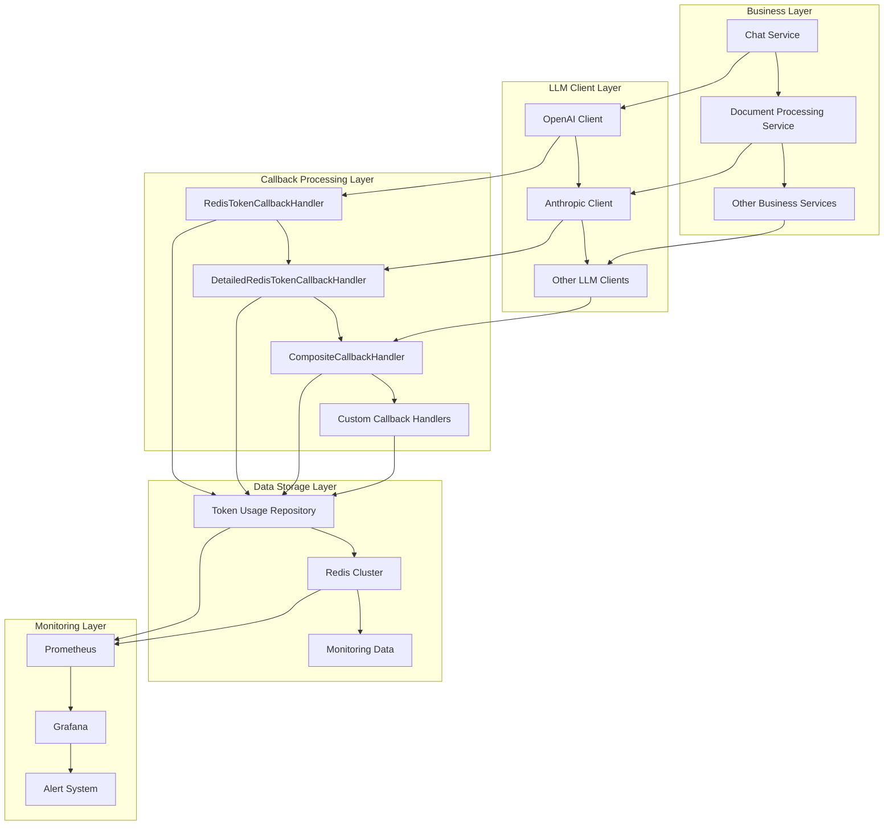
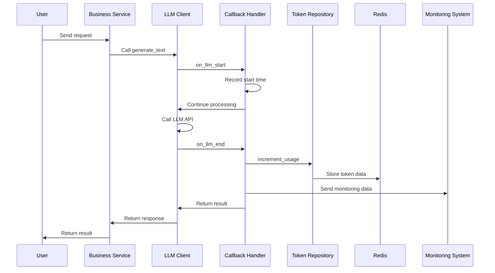
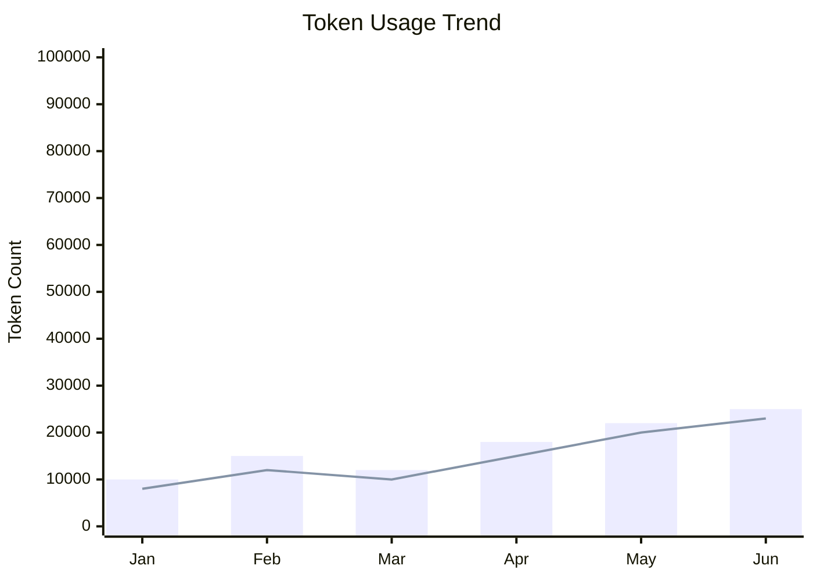
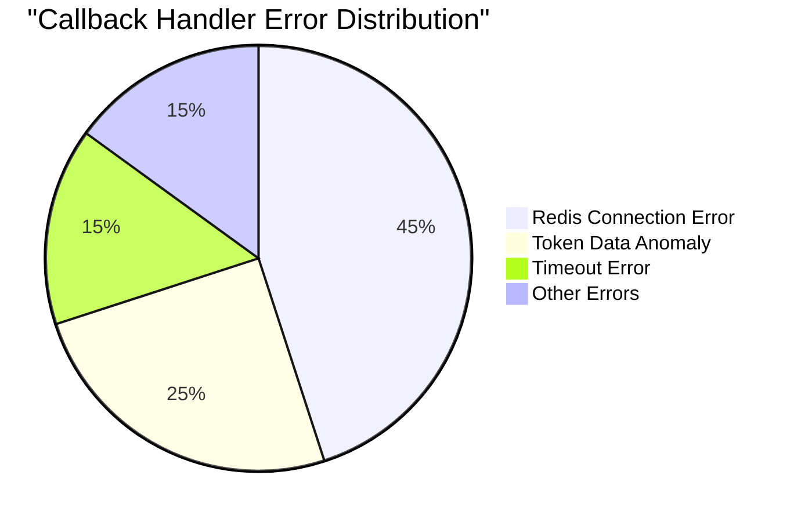

# LLM Custom Callback Handlers Technical Documentation

## 1. Overview

**Purpose**: The `custom_callbacks.py` module is a core component in the AIECS system responsible for managing the lifecycle of LLM (Large Language Model) calls. Through asynchronous callback mechanisms, this module implements fine-grained monitoring of LLM call processes, token usage statistics, performance metrics collection, and error handling.

**Core Value**:
- **Precise Token Usage Statistics**: Automatically records user prompt tokens and completion tokens usage
- **Performance Monitoring**: Real-time monitoring of LLM call response times and success rates
- **Cost Control**: Achieves precise cost accounting and usage limits through detailed token statistics
- **Extensibility**: Provides composite callback handlers supporting parallel execution of multiple monitoring strategies
- **Fault Tolerance**: Ensures callback processing failures do not affect main business processes

## 2. Problem Background & Design Motivation

### 2.1 Business Pain Points

During AIECS system development, we face the following key challenges:

1. **Cost Control Challenges**: LLM API calls are expensive, requiring precise statistics for each user's token usage
2. **Missing Performance Monitoring**: Lack of real-time monitoring of LLM call performance, making it difficult to identify performance bottlenecks
3. **Usage Limit Requirements**: Need to set different token usage limits for different users
4. **Multi-Dimensional Statistics**: Need to distinguish prompt tokens and completion tokens for fine-grained analysis
5. **System Observability**: Need complete call chain tracking and error monitoring

### 2.2 Design Motivation

Based on the above pain points, we designed a monitoring system based on callback patterns:

- **Decoupled Design**: Separates monitoring logic from business logic, avoiding code coupling
- **Asynchronous Processing**: Uses asynchronous callbacks to ensure monitoring operations do not affect main business performance
- **Flexible Extension**: Supports flexible combination of multiple monitoring strategies through composite pattern
- **Data Persistence**: Integrates Redis for high-performance statistics data storage

## 3. Architecture Positioning & Context

### 3.1 System Architecture Diagram



### 3.2 Upstream and Downstream Dependencies

**Upstream Callers**:
- `BaseLLMClient` and its subclasses (OpenAI, Anthropic, etc.)
- Business service layer (chat services, document processing services, etc.)

**Downstream Dependencies**:
- `TokenUsageRepository`: Responsible for Redis data storage
- `BaseCallback`: Provides abstract callback interface
- `Redis Client`: Data persistence layer

**Peer Components**:
- `LLMMessage` and `LLMResponse`: Data transfer objects
- Logging system: For monitoring and debugging

### 3.3 Data Flow



## 4. Core Features & Use Cases

### 4.1 Basic Token Statistics Callback Handler

**Function Description**: Records total token usage of LLM calls, suitable for simple usage statistics scenarios.

**Core Features**:
- Automatically records call start and end times
- Statistics total token usage
- Integrated Redis persistent storage
- Exception fault tolerance handling

**Usage Scenarios**:
```python
# Basic usage statistics
from aiecs.llm.custom_callbacks import create_token_callback

# Create callback handler
callback = create_token_callback(
    user_id="user_123",
    cycle_start_date="2024-01-01"
)

# Use in LLM client
async with LLMClient() as client:
    response = await client.generate_text(
        messages=messages,
        callbacks=[callback]
    )
```

**Real-World Application Cases**:
- **User Usage Limits**: Set monthly token limits for each user
- **Cost Accounting**: Calculate API call costs for different users
- **Usage Analysis**: Generate user usage reports and trend analysis

### 4.2 Detailed Token Statistics Callback Handler

**Function Description**: Separately records prompt tokens and completion tokens, providing more fine-grained usage analysis.

**Core Features**:
- Intelligent token estimation algorithm
- Separate statistics for prompt and completion tokens
- Support for multiple token data sources
- Automatic data validation and correction

**Usage Scenarios**:
```python
# Detailed usage statistics
from aiecs.llm.custom_callbacks import create_detailed_token_callback

# Create detailed statistics callback
detailed_callback = create_detailed_token_callback(
    user_id="user_123",
    cycle_start_date="2024-01-01"
)

# Combine multiple callbacks
composite_callback = create_composite_callback(
    detailed_callback,
    performance_callback,
    error_callback
)
```

**Real-World Application Cases**:
- **Cost Optimization**: Analyze cost ratio of prompt and completion
- **Model Selection**: Choose optimal model based on token usage patterns
- **Performance Tuning**: Optimize prompt length to reduce unnecessary token consumption

### 4.3 Composite Callback Handler

**Function Description**: Supports simultaneous execution of multiple callback handlers, implementing complex monitoring strategies.

**Core Features**:
- Parallel execution of multiple callbacks
- Independent exception handling
- Dynamic add/remove handlers
- Unified execution interface

**Usage Scenarios**:
```python
# Create composite monitoring strategy
from aiecs.llm.custom_callbacks import (
    create_token_callback,
    create_detailed_token_callback,
    create_composite_callback
)

# Build complete monitoring system
monitoring_callbacks = create_composite_callback(
    create_token_callback("user_123"),
    create_detailed_token_callback("user_123"),
    custom_performance_callback(),
    custom_alert_callback()
)

# Use in business code
async def process_user_query(user_id: str, query: str):
    messages = [{"role": "user", "content": query}]
    
    async with LLMClient() as client:
        response = await client.generate_text(
            messages=messages,
            callbacks=[monitoring_callbacks]
        )
    return response
```

**Real-World Application Cases**:
- **End-to-End Monitoring**: Simultaneously perform usage statistics, performance monitoring, and error tracking
- **Multi-Tenant Management**: Configure different monitoring strategies for different tenants
- **A/B Testing**: Compare performance under different configurations

## 5. API Reference

### 5.1 RedisTokenCallbackHandler

#### Constructor
```python
def __init__(self, user_id: str, cycle_start_date: Optional[str] = None)
```

**Parameters**:
- `user_id` (str, required): User unique identifier
- `cycle_start_date` (str, optional): Billing cycle start date in "YYYY-MM-DD" format, defaults to current month

**Exceptions**:
- `ValueError`: Raised when user_id is empty

#### Methods

##### on_llm_start
```python
async def on_llm_start(self, messages: List[dict], **kwargs: Any) -> None
```

**Function**: Triggered when LLM call starts
**Parameters**:
- `messages` (List[dict]): Message list, each message contains 'role' and 'content' keys
- `**kwargs`: Additional parameters (e.g., provider, model, etc.)

##### on_llm_end
```python
async def on_llm_end(self, response: dict, **kwargs: Any) -> None
```

**Function**: Triggered when LLM call successfully ends
**Parameters**:
- `response` (dict): Response dictionary containing 'content', 'tokens_used', 'model' keys
- `**kwargs`: Additional parameters

**Processing Logic**:
1. Calculate call duration
2. Extract token usage
3. Call repository to record data
4. Log record

##### on_llm_error
```python
async def on_llm_error(self, error: Exception, **kwargs: Any) -> None
```

**Function**: Triggered when LLM call encounters an error
**Parameters**:
- `error` (Exception): The exception that occurred
- `**kwargs`: Additional parameters

### 5.2 DetailedRedisTokenCallbackHandler

#### Constructor
```python
def __init__(self, user_id: str, cycle_start_date: Optional[str] = None)
```

**Parameters**: Same as `RedisTokenCallbackHandler`

#### Methods

##### on_llm_start
```python
async def on_llm_start(self, messages: List[dict], **kwargs: Any) -> None
```

**Function**: Record start time and estimate prompt tokens
**Special Processing**: Calls `_estimate_prompt_tokens` method to estimate input token count

##### on_llm_end
```python
async def on_llm_end(self, response: dict, **kwargs: Any) -> None
```

**Function**: Record detailed token usage
**Special Processing**:
1. Calls `_extract_detailed_tokens` to extract detailed token information
2. Uses `increment_detailed_usage` method to record data

##### _estimate_prompt_tokens
```python
def _estimate_prompt_tokens(self, messages: List[dict]) -> int
```

**Function**: Estimate token count of input messages
**Algorithm**: Uses rough estimation of 4 characters ≈ 1 token
**Returns**: Estimated token count

##### _extract_detailed_tokens
```python
def _extract_detailed_tokens(self, response: dict) -> tuple[int, int]
```

**Function**: Extract detailed token information from response
**Returns**: `(prompt_tokens, completion_tokens)` tuple
**Processing Strategy**:
1. Prioritize using detailed token information from response
2. If only total is available, use estimated prompt tokens to calculate completion tokens
3. If no information is available, estimate based on content length

### 5.3 CompositeCallbackHandler

#### Constructor
```python
def __init__(self, handlers: List[CustomAsyncCallbackHandler])
```

**Parameters**:
- `handlers` (List[CustomAsyncCallbackHandler]): Callback handler list

#### Methods

##### add_handler
```python
def add_handler(self, handler: CustomAsyncCallbackHandler)
```

**Function**: Dynamically add callback handler
**Parameters**:
- `handler` (CustomAsyncCallbackHandler): Handler to add

##### on_llm_start
```python
async def on_llm_start(self, messages: List[dict], **kwargs: Any) -> None
```

**Function**: Execute all handlers' start callbacks in parallel
**Exception Handling**: Failure of a single handler does not affect other handlers

##### on_llm_end
```python
async def on_llm_end(self, response: dict, **kwargs: Any) -> None
```

**Function**: Execute all handlers' end callbacks in parallel

##### on_llm_error
```python
async def on_llm_error(self, error: Exception, **kwargs: Any) -> None
```

**Function**: Execute all handlers' error callbacks in parallel

### 5.4 Convenience Functions

#### create_token_callback
```python
def create_token_callback(user_id: str, cycle_start_date: Optional[str] = None) -> RedisTokenCallbackHandler
```

**Function**: Create basic token statistics callback handler
**Returns**: `RedisTokenCallbackHandler` instance

#### create_detailed_token_callback
```python
def create_detailed_token_callback(user_id: str, cycle_start_date: Optional[str] = None) -> DetailedRedisTokenCallbackHandler
```

**Function**: Create detailed token statistics callback handler
**Returns**: `DetailedRedisTokenCallbackHandler` instance

#### create_composite_callback
```python
def create_composite_callback(*handlers: CustomAsyncCallbackHandler) -> CompositeCallbackHandler
```

**Function**: Create composite callback handler
**Parameters**: Variable number of callback handlers
**Returns**: `CompositeCallbackHandler` instance

## 6. Technical Implementation Details

### 6.1 Asynchronous Processing Mechanism

**Design Principles**:
- All callback methods are asynchronous, avoiding blocking main business threads
- Use `async/await` syntax to ensure non-blocking execution
- Exception handling does not affect main business processes

**Implementation Details**:
```python
async def on_llm_end(self, response: dict, **kwargs: Any) -> None:
    try:
        # Asynchronously execute token recording
        await token_usage_repo.increment_total_usage(
            self.user_id,
            tokens_used,
            self.cycle_start_date
        )
    except Exception as e:
        # Log error but don't re-raise, avoid affecting main process
        logger.error(f"Failed to record token usage: {e}")
```

### 6.2 Token Estimation Algorithm

**Basic Estimation**:
- Uses rough estimation of 4 characters ≈ 1 token
- Suitable for quick estimation of English text
- May not be accurate for languages like Chinese

**Improvement Strategy**:
```python
def _estimate_prompt_tokens(self, messages: List[dict]) -> int:
    total_chars = sum(len(msg.get('content', '')) for msg in messages)
    # Can adjust estimation ratio based on language type
    return total_chars // 4
```

**Future Optimization Directions**:
- Integrate professional token calculation libraries like tiktoken
- Support multi-language token estimation
- Dynamically adjust estimation parameters based on historical data

### 6.3 Error Handling Strategy

**Layered Error Handling**:
1. **Method Level**: Each callback method internally catches exceptions
2. **Handler Level**: CompositeCallbackHandler provides independent error handling for each sub-handler
3. **System Level**: All errors are recorded through logging system

**Fault Tolerance Mechanism**:
```python
async def on_llm_end(self, response: dict, **kwargs: Any) -> None:
    for handler in self.handlers:
        try:
            await handler.on_llm_end(response, **kwargs)
        except Exception as e:
            # Log error but continue executing other handlers
            logger.error(f"Error in callback handler {type(handler).__name__}: {e}")
```

### 6.4 Performance Optimization

**Batch Operations**:
- Use Redis pipeline for batch updates
- Reduce network round trips
- Improve data write efficiency

**Memory Management**:
- Clean up temporary variables promptly
- Avoid storing large amounts of data in callbacks
- Use weak references to avoid circular references

**Concurrency Control**:
- Use async locks to avoid race conditions
- Reasonably control concurrent callback count
- Implement backpressure mechanism to prevent memory overflow

### 6.5 Data Consistency

**Atomic Operations**:
- Use Redis HINCRBY command to ensure atomicity
- Avoid data inconsistency caused by concurrent updates

**Transaction Processing**:
```python
# Use pipeline to ensure transactional
pipe = client.pipeline()
for field, value in updates.items():
    pipe.hincrby(redis_key, field, value)
await pipe.execute()
```

## 7. Configuration & Deployment

### 7.1 Environment Variable Configuration

**Required Configuration**:
```bash
# Redis connection configuration
REDIS_HOST=localhost
REDIS_PORT=6379
REDIS_PASSWORD=your_password
REDIS_DB=0

# Logging configuration
LOG_LEVEL=INFO
LOG_FORMAT=json
```

**Optional Configuration**:
```bash
# Token estimation parameters
TOKEN_ESTIMATION_RATIO=4  # Character to token ratio

# Performance monitoring configuration
ENABLE_PERFORMANCE_MONITORING=true
PERFORMANCE_LOG_THRESHOLD=1000  # milliseconds

# Error retry configuration
CALLBACK_RETRY_ATTEMPTS=3
CALLBACK_RETRY_DELAY=100  # milliseconds
```

### 7.2 Dependency Management

**Core Dependencies**:
```python
# requirements.txt
redis>=4.5.0
asyncio-mqtt>=0.11.0
```

**Development Dependencies**:
```python
# requirements-dev.txt
pytest>=7.0.0
pytest-asyncio>=0.21.0
pytest-mock>=3.10.0
```

### 7.3 Deployment Configuration

**Docker Configuration**:
```dockerfile
FROM python:3.9-slim

WORKDIR /app
COPY requirements.txt .
RUN pip install -r requirements.txt

COPY . .
CMD ["python", "-m", "aiecs.llm.custom_callbacks"]
```

**Kubernetes Configuration**:
```yaml
apiVersion: apps/v1
kind: Deployment
metadata:
  name: aiecs-callbacks
spec:
  replicas: 3
  selector:
    matchLabels:
      app: aiecs-callbacks
  template:
    metadata:
      labels:
        app: aiecs-callbacks
    spec:
      containers:
      - name: callbacks
        image: aiecs/callbacks:latest
        env:
        - name: REDIS_HOST
          value: "redis-service"
        - name: REDIS_PORT
          value: "6379"
```

### 7.4 Monitoring Configuration

**Prometheus Metrics**:
```python
from prometheus_client import Counter, Histogram

# Define monitoring metrics
token_usage_total = Counter('token_usage_total', 'Total token usage', ['user_id', 'type'])
callback_duration = Histogram('callback_duration_seconds', 'Callback execution time')
callback_errors = Counter('callback_errors_total', 'Callback errors', ['handler_type'])
```

**Health Check**:
```python
async def health_check():
    """Check callback handler health status"""
    try:
        # Check Redis connection
        redis_client = await get_redis_client()
        await redis_client.ping()
        
        # Check handler status
        return {"status": "healthy", "timestamp": time.time()}
    except Exception as e:
        return {"status": "unhealthy", "error": str(e)}
```

## 8. Maintenance & Troubleshooting

### 8.1 Monitoring Metrics

**Key Metrics**:
- Token usage trends
- Callback execution time
- Error rate and exception types
- Redis connection status
- Memory usage

**Monitoring Dashboard**:
```python
# Grafana query examples
# Token usage trends
sum(rate(token_usage_total[5m])) by (user_id)

# Callback execution time
histogram_quantile(0.95, rate(callback_duration_seconds_bucket[5m]))

# Error rate
rate(callback_errors_total[5m])
```

### 8.2 Common Issues and Solutions

#### 8.2.1 Redis Connection Failure

**Symptoms**:
- "Failed to connect to Redis" errors in logs
- Token data cannot be recorded
- Callback handler exits abnormally

**Troubleshooting Steps**:
1. Check Redis service status: `redis-cli ping`
2. Verify network connection: `telnet redis_host 6379`
3. Check authentication: Verify username and password
4. View Redis logs: `tail -f /var/log/redis/redis.log`

**Solution**:
```python
# Add connection retry mechanism
async def get_redis_client_with_retry(max_retries=3):
    for attempt in range(max_retries):
        try:
            return await get_redis_client()
        except Exception as e:
            if attempt == max_retries - 1:
                raise
            await asyncio.sleep(2 ** attempt)  # Exponential backoff
```

#### 8.2.2 Token Data Inconsistency

**Symptoms**:
- Statistics token count does not match actual usage
- Query results inconsistent at different times
- Data shows negative values

**Troubleshooting Steps**:
1. Check concurrent updates: See if multiple processes are updating simultaneously
2. Verify data integrity: Check raw data in Redis
3. Analyze logs: Find abnormal callback execution records

**Solution**:
```python
# Add data validation
async def validate_token_data(user_id: str, tokens: int):
    if tokens < 0:
        logger.warning(f"Negative token count detected for user {user_id}: {tokens}")
        return 0
    return tokens
```

#### 8.2.3 Performance Issues

**Symptoms**:
- Callback execution time too long
- System response slows down
- Memory usage continuously grows

**Troubleshooting Steps**:
1. Analyze callback execution time: Use performance profiling tools
2. Check memory leaks: Monitor memory usage trends
3. Optimize Redis operations: Reduce unnecessary queries

**Solution**:
```python
# Add performance monitoring
import time
from functools import wraps

def monitor_performance(func):
    @wraps(func)
    async def wrapper(*args, **kwargs):
        start_time = time.time()
        try:
            result = await func(*args, **kwargs)
            return result
        finally:
            duration = time.time() - start_time
            if duration > 1.0:  # Log warning if exceeds 1 second
                logger.warning(f"Slow callback execution: {func.__name__} took {duration:.2f}s")
    return wrapper
```

### 8.3 Log Analysis

**Log Level Configuration**:
```python
import logging

# Configure callback handler logger
callback_logger = logging.getLogger('aiecs.callbacks')
callback_logger.setLevel(logging.INFO)

# Add file handler
file_handler = logging.FileHandler('/var/log/aiecs/callbacks.log')
file_handler.setFormatter(logging.Formatter(
    '%(asctime)s - %(name)s - %(levelname)s - %(message)s'
))
callback_logger.addHandler(file_handler)
```

**Key Log Patterns**:
```bash
# Find error logs
grep "ERROR" /var/log/aiecs/callbacks.log | tail -100

# Analyze performance issues
grep "Slow callback" /var/log/aiecs/callbacks.log

# Monitor token usage
grep "Recorded.*tokens" /var/log/aiecs/callbacks.log | tail -50
```

### 8.4 Data Backup and Recovery

**Backup Strategy**:
```bash
# Redis data backup
redis-cli --rdb /backup/redis-$(date +%Y%m%d).rdb

# Regular backup script
#!/bin/bash
DATE=$(date +%Y%m%d_%H%M%S)
redis-cli --rdb /backup/redis-$DATE.rdb
gzip /backup/redis-$DATE.rdb
```

**Recovery Process**:
```bash
# Stop Redis service
systemctl stop redis

# Restore data
gunzip /backup/redis-20240101_120000.rdb.gz
cp /backup/redis-20240101_120000.rdb /var/lib/redis/dump.rdb

# Start Redis service
systemctl start redis
```

## 9. Visualizations

### 9.1 System Architecture Diagram



### 9.2 Data Flow Diagram



### 9.3 Token Usage Trend Chart



### 9.4 Error Rate Monitoring Chart



## 10. Version History

### v1.0.0 (2024-01-15)
**New Features**:
- Implement basic `RedisTokenCallbackHandler`
- Support total token usage statistics
- Integrate Redis data storage
- Add asynchronous callback mechanism

**Technical Features**:
- Based on `CustomAsyncCallbackHandler` abstract base class
- Use Redis HINCRBY to ensure atomic operations
- Complete error handling and logging

### v1.1.0 (2024-02-01)
**New Features**:
- Implement `DetailedRedisTokenCallbackHandler`
- Support separate statistics for prompt and completion tokens
- Add intelligent token estimation algorithm
- Implement `CompositeCallbackHandler` composite pattern

**Performance Optimizations**:
- Use Redis pipeline for batch operations
- Optimize memory usage and concurrent processing
- Add performance monitoring metrics

### v1.2.0 (2024-03-01)
**New Features**:
- Add convenience functions to simplify usage
- Support custom billing cycles
- Implement data validation and correction mechanism
- Add health check interface

**Improvements**:
- Enhance error handling and retry mechanisms
- Optimize log format and monitoring metrics
- Add complete unit test coverage

### v1.3.0 (2024-04-01) [Planned]
**Planned Features**:
- Integrate tiktoken for precise token calculation
- Support multi-language token estimation
- Add cost prediction and usage alerts
- Implement distributed locks to avoid concurrent conflicts

**Performance Goals**:
- Callback execution time < 100ms
- Support 1000+ concurrent users
- 99.9% availability guarantee

---

## Appendix

### A. Related Documentation Links
- [Token Usage Repository Documentation](../UTILS/TOKEN_USAGE_REPOSITORY.md)
- [Redis Client Configuration Documentation](../INFRASTRUCTURE_PERSISTENCE/REDIS_CLIENT.md)
- [Base LLM Client Documentation](./BASE_LLM_CLIENT.md)

### B. Example Code Repositories
- [Complete Example Project](https://github.com/aiecs/examples)
- [Performance Test Scripts](https://github.com/aiecs/performance-tests)
- [Monitoring Configuration Templates](https://github.com/aiecs/monitoring-configs)

### C. Technical Support
- Technical Documentation: https://docs.aiecs.com
- Issue Reporting: https://github.com/aiecs/issues
- Community Discussion: https://discord.gg/aiecs
