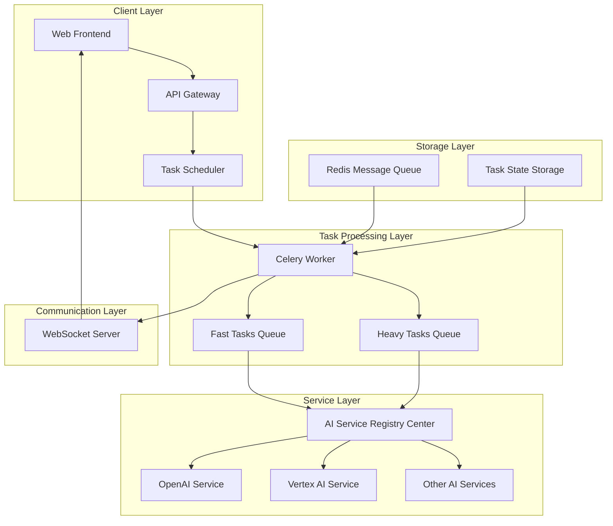
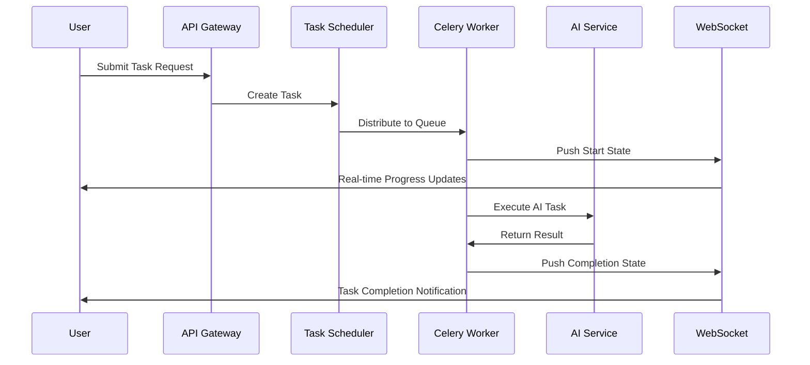
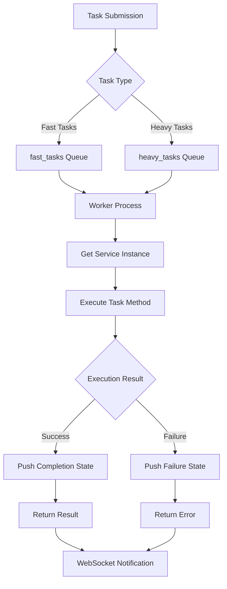
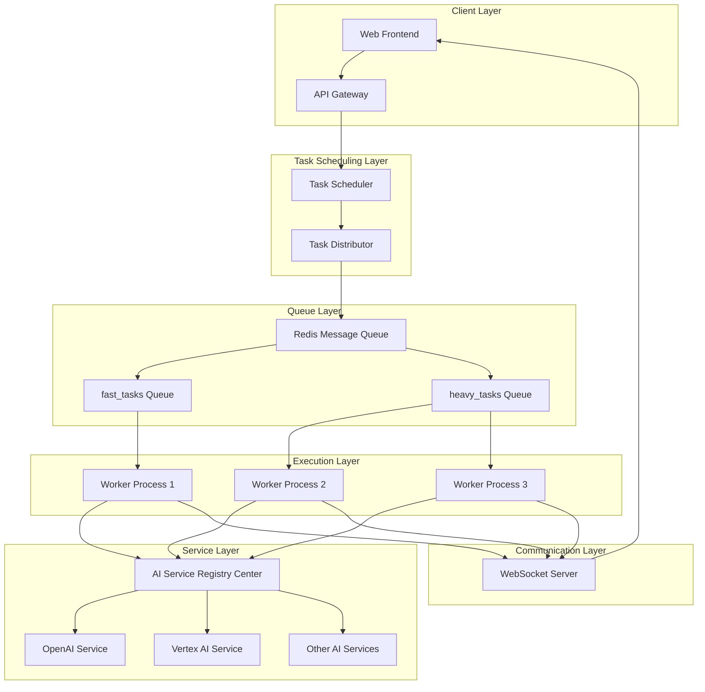
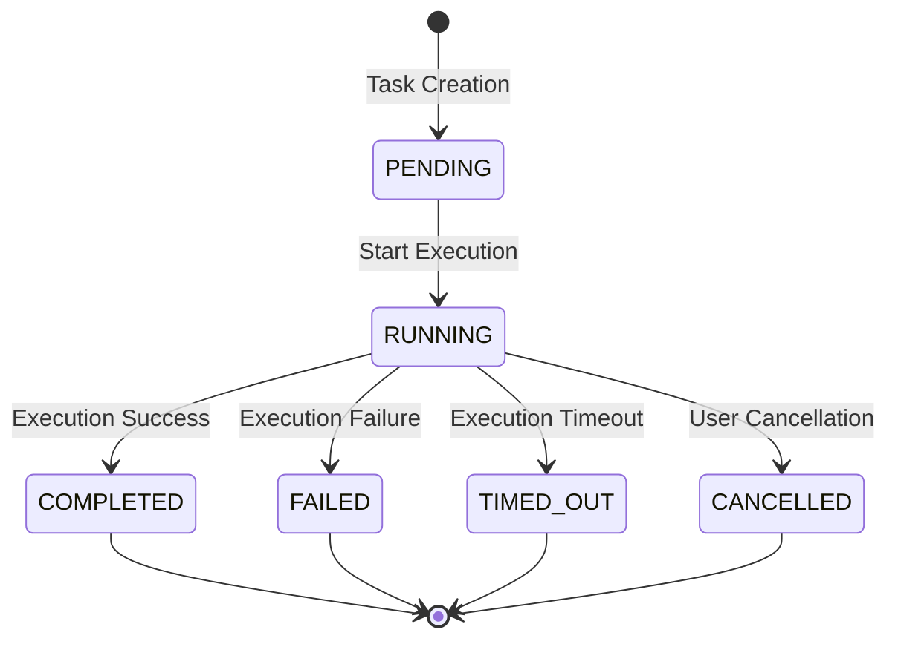
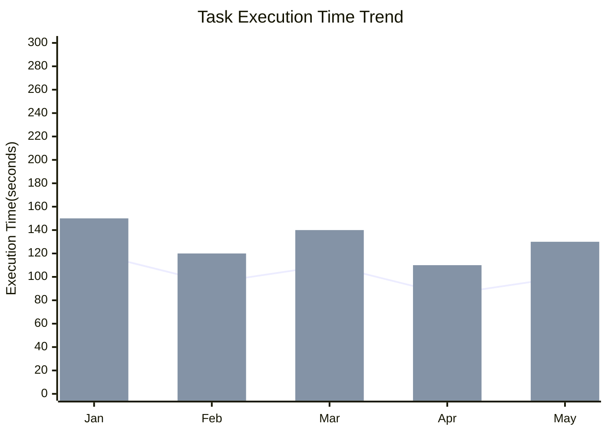

# Celery Task Worker Technical Documentation

## 1. Overview

**Purpose**: `worker.py` is the core task execution engine of the AIECS system, based on Celery distributed task queue for asynchronous task processing. This module is responsible for executing various AI service tasks, including fast tasks and heavy tasks, pushing task progress in real-time through WebSocket, ensuring high availability and scalability of the system.

**Core Value**:
- **Asynchronous Task Processing**: Support long-running AI tasks, avoid blocking main thread
- **Distributed Architecture**: Based on Celery for horizontal scaling and load balancing
- **Real-time Progress Pushing**: Real-time task execution status through WebSocket
- **Task Classification Management**: Distinguish fast tasks and heavy tasks, optimize resource allocation
- **Fault Tolerance Mechanism**: Complete error handling and state management

## 2. Problem Background & Design Motivation

### 2.1 Business Pain Points

In AI application development, the following key challenges are faced:

1. **Synchronous Blocking Issues**: AI task execution time is long, synchronous processing causes request timeouts
2. **Resource Competition**: Multiple users request AI services simultaneously, uneven resource allocation
3. **Poor User Experience**: Long waiting without feedback, users don't know task status
4. **System Scalability**: Single-machine processing capacity is limited, cannot handle high concurrency
5. **Task Management Complexity**: Lack of unified task scheduling and monitoring mechanisms

### 2.2 Design Motivation

Based on the above pain points, designed a distributed task processing system based on Celery:

- **Asynchronous Decoupling**: Separate task execution from request processing, improve system responsiveness
- **Queue Management**: Distinguish task priority and resource requirements through different queues
- **Real-time Communication**: Integrate WebSocket to push task progress in real-time
- **Service Discovery**: Dynamically obtain AI service instances through registry center
- **State Tracking**: Complete task lifecycle management and state updates

## 3. Architecture Positioning & Context

### 3.1 System Architecture Diagram



### 3.2 Upstream and Downstream Dependencies

**Upstream Callers**:
- Task scheduler (API layer)
- Business service layer
- User request processors

**Downstream Dependencies**:
- AI service registry center
- WebSocket server
- Redis message queue
- Task state storage

**Peer Components**:
- Configuration management system
- Logging and monitoring system
- Error handling mechanisms

### 3.3 Data Flow



## 4. Core Features & Use Cases

### 4.1 Fast Task Processing

**Function Description**: Process lightweight, fast-completing AI tasks, such as text analysis, simple Q&A, etc.

**Core Features**:
- Low latency execution
- High concurrency processing
- Fast response

**Use Cases**:
```python
# Fast text analysis task
from aiecs.tasks.worker import execute_task

# Submit fast task
task_result = execute_task.delay(
    task_name="analyze_text",
    user_id="user_123",
    task_id="task_456",
    step=1,
    mode="chat",
    service="text_analyzer",
    input_data={"text": "Analyze the sentiment tendency of this text"},
    context={"language": "en", "model": "gpt-3.5-turbo"}
)

# Get task result
result = task_result.get(timeout=30)
print(f"Analysis result: {result['result']}")
```

**Real-world Application Cases**:
- **Intelligent Customer Service**: Quickly answer user common questions
- **Content Review**: Real-time detection text content compliance
- **Language Detection**: Automatically identify text language type
- **Sentiment Analysis**: Analyze user comment sentiment analysis

### 4.2 Heavy Task Processing

**Function Description**: Process complex, time-consuming AI tasks, such as document generation, code analysis, image processing, etc.

**Core Features**:
- Long execution support
- Resource-intensive processing
- Progress real-time updates

**Use Cases**:
```python
# Heavy document generation task
from aiecs.tasks.worker import execute_heavy_task

# Submit heavy task
heavy_task = execute_heavy_task.delay(
    task_name="generate_document",
    user_id="user_123",
    task_id="task_789",
    step=1,
    mode="document",
    service="doc_generator",
    input_data={
        "topic": "AI development trends",
        "length": "5000 words",
        "style": "academic paper"
    },
    context={
        "template": "academic",
        "references": True,
        "citations": True
    }
)
```

**Real-world Application Cases**:
- **Technical Document Generation**: Automatically generate complete technical documents based on requirements
- **Code Review**: Deep analysis code quality and potential problems
- **Data Analysis Report**: Process large amounts of data and generate analysis reports
- **Multimedia Processing**: Image, video AI processing and analysis

### 4.3 Real-time Progress Pushing

**Function Description**: Push task execution status and progress information through WebSocket.

**Progress Bar Display**: Front-end real-time display task execution progress
- **State Notification**: Task completion or failure timely notify users

**Real-time Communication**: Integrate WebSocket to push task progress in real-time
- **Service Discovery**: Dynamically obtain AI service instances through registry center
- **State Tracking**: Complete task lifecycle management and state updates

## 5. API Reference

### 5.1 Celery Application Configuration

#### celery_app
```python
celery_app = Celery("ai_worker", broker=settings.celery_broker_url)
```

**Configuration**: Message broker configuration
- **Task Classification Management**: Distinguish fast tasks and heavy tasks, optimize resource allocation

**Real-time Communication Mechanism**: Integrate WebSocket to push task progress in real-time

**State Management**: Use TaskStatus enumeration management task status
- Support PENDING, RUNNING, COMPLETED, FAILED, etc. state updates

**Error Handling Mechanism**: Layered error handling

**Error Propagation**: Ensure exceptions don't cause Worker crashes
- Record detailed error information
- Push error state to clients

**Task Context Management**: Context building

**Resource Tracking**: File operation tracking
- Model usage records
- Performance metrics collection

## 6. Configuration & Deployment

### 6.1 Environment Variable Configuration

**Required Configuration**:
```bash
# Celery message broker
CELERY_BROKER_URL=redis://localhost:6379/0

# WebSocket configuration
CORS_ALLOWED_ORIGINS=http://localhost:3000,http://localhost:3001

# AI service configuration
OPENAI_API_KEY=sk-...
VERTEX_PROJECT_ID=your-project-id
XAI_API_KEY=xai-...
```

**Optional Configuration**:
```bash
- **Celery Advanced Configuration**: Task timeout configuration
CELERY_TASK_SOFT_TIME_LIMIT=300
CELERY_TASK_TIME_LIMIT=600

# Concurrency configuration
CELERY_WORKER_CONCURRENCY=4
CELERY_WORKER_PREFETCH_MULTIPLIER=1
```

### 6.2 Dependency Management

**Core Dependencies**:
```python
# requirements.txt
celery>=5.3.0
redis>=4.5.0
python-socketio>=5.8.0
```

**Development Dependencies**:
```python
# requirements-dev.txt
pytest>=7.0.0
pytest-celery>=0.0.0
flower>=2.0.0  # Celery monitoring tools
```

### 6.3 Deployment Configuration

**Docker Configuration**:
```dockerfile
FROM python:3.9-slim

WORKDIR /app
COPY requirements.txt .
RUN pip install -r requirements.txt

COPY . .

# Start Celery Worker
CMD ["celery", "-A", "aiecs.tasks.worker", "worker", "--loglevel=info"]
```

**Docker Compose Configuration**:
```yaml
version: '3.8'
services:
  redis:
    image: redis:7-alpine
    ports:
      - "6379:6379"
  
  celery-worker:
    build: .
    command: celery -A aiecs.tasks.worker worker --loglevel=info
    depends_on:
      - redis
    environment:
      - CELERY_BROKER_URL=redis://redis:6379/0
      - REDIS_URL=redis://redis:6379/0
  
  celery-beat:
    build: .
    command: celery -A aiecs.tasks.worker beat --loglevel=info
    depends_on:
      - redis
    environment:
      - CELERY_BROKER_URL=redis://localhost:6379/0
```

**Kubernetes Configuration**:
```yaml
apiVersion: apps/v1
kind: Deployment
metadata:
  name: celery-worker
spec:
  replicas: 3
  selector:
    matchLabels:
      app: celery-worker
  template:
    metadata:
      labels:
        app: celery-worker
    spec:
      containers:
      - name: worker
        image: aiecs/worker:latest
        command: ["celery", "-A", "aiecs.tasks.worker", "worker", "--loglevel=info"]
        env:
        - name: CELERY_BROKER_URL
          value: "redis://redis-service:6379/0"
        resources:
          requests:
            memory: "512Mi"
            cpu: "250m"
          limits:
            memory: "1Gi"
            cpu: "500m"
```

### 6.4 Monitoring Configuration

**Flower Monitoring**:
```bash
# Start Flower monitoring interface
celery -A aiecs.tasks.worker flower --port=5555
```

**Prometheus Metrics**:
```python
from prometheus_client import Counter, Histogram, Gauge

# Define monitoring metrics
task_executions = Counter('celery_task_executions_total', 'Total task executions', ['task_name', 'status'])
task_duration = Histogram('celery_task_duration_seconds', 'Task execution duration', ['task_name'])
active_tasks = Gauge('celery_active_tasks', 'Number of active tasks')
```

## 7. Maintenance & Troubleshooting

### 7.1 Monitoring Metrics

**Key Metrics**:
- Task execution success rate
- Task execution time distribution
- Queue length and backlog situation
- Worker process status
- Memory and CPU usage rate

**Monitoring Dashboard**:
```python
# Grafana query examples
# Task execution success rate
sum(rate(celery_task_executions_total[5m])) by (status)

# Average task execution time
histogram_quantile(0.95, rate(celery_task_duration_seconds_bucket[5m]))

# Active tasks number
celery_active_tasks
```

### 7.2 Common Faults & Solutions

#### 7.2.1 Worker Process Crashes

**Symptoms**:
- Tasks long time in PENDING state
- Worker process abnormal exit
- Logs appear memory errors

**Troubleshooting Steps**:
1. Check Worker logs: `tail -f /var/log/celery/worker.log`
2. Check system resources: `htop` or `top`
3. Check Redis connection: `redis-cli ping`
4. View task details: `celery -A aiecs.tasks.worker inspect active`

**Solutions**:
```bash
# Restart Worker process
celery -A aiecs.tasks.worker worker --loglevel=info --concurrency=2

# Clean zombie tasks
celery -A aiecs.tasks.worker purge

# Increase memory limit
celery -A aiecs.tasks.worker worker --max-memory-per-child=200000
```

#### 7.2.2 Task Execution Timeout

**Symptoms**:
- Task status display TIMED_OUT
- Long time no response
- Resource occupation too high

**Troubleshooting Steps**:
1. Check task complexity: Analyze input data size
2. Check AI service response: Test API calls
3. Check network connection: ping external services
4. View task details: `celery -A aiecs.tasks.worker inspect scheduled`

**Solutions**:
```python
# Increase task timeout time
@celery_app.task(bind=True, time_limit=1800)  # 30 minutes
def execute_heavy_task(self, ...):
    pass

# Optimize task execution
def _execute_service_task(self, ...):
    try:
        # Add timeout control
        import signal
        
        def timeout_handler(signum, frame):
            raise TimeoutError("Task execution timeout")
        
        signal.signal(signal.SIGALRM, timeout_handler)
        signal.alarm(1800)  # 30 minutes timeout
        
        # Execute task
        result = method(input_data, context)
        
        signal.alarm(0)  # Cancel timeout
        return result
    except TimeoutError:
        logger.error("Task execution timeout")
        raise
```

#### 7.2.3 WebSocket Connection Issues

**Symptoms**:
- Frontend cannot receive progress updates
- WebSocket connection disconnected
- Task status out of sync

**Troubleshooting Steps**:
1. Check WebSocket service status
2. Verify user registration: `connected_clients`
3. Check network connection: `telnet localhost 8000`
4. View WebSocket logs

**Solutions**:
```python
# Add connection retry mechanism
async def push_progress_with_retry(user_id: str, data: dict, max_retries=3):
    for attempt in range(max_retries):
        try:
            await push_progress(user_id, data)
            break
        except Exception as e:
            if attempt == max_retries - 1:
                logger.error(f"Failed to push progress after {max_retries} attempts: {e}")
            else:
                await asyncio.sleep(2 ** attempt)  # Exponential backoff

# Add heartbeat detection
@sio.event
async def ping(sid):
    await sio.emit('pong', to=sid)
```

### 7.3 Performance Optimization

**Concurrency Optimization**:
```bash
# Adjust concurrency based on CPU core count
celery -A aiecs.tasks.worker worker --concurrency=4

# Use event loop optimization
celery -A aiecs.tasks.worker worker --pool=eventlet --concurrency=1000
```

**Memory Optimization**:
```bash
# Limit child process memory usage
celery -A aiecs.tasks.worker worker --max-memory-per-child=200000

# Regularly restart Worker
celery -A aiecs.tasks.worker worker --max-tasks-per-child=1000
```

**Queue Optimization**:
```python
# Configure queue priority
task_routes = {
    'aiecs.tasks.worker.execute_task': {
        'queue': 'fast_tasks',
        'priority': 10
    },
    'aiecs.tasks.worker.execute_heavy_task': {
        'queue': 'heavy_tasks',
        'priority': 5
    }
```

### 7.4 Log Analysis

**Log Configuration**:
```python
import logging

# Configure Celery logs
logging.basicConfig(
    level=logging.INFO,
    format='%(asctime)s - %(name)s - %(levelname)s - %(message)s',
    handlers=[
        logging.FileHandler('/var/log/celery/worker.log'),
        logging.StreamHandler()
    ]
)
```

**Key Log Patterns**:
```bash
# Find error logs
grep "ERROR" /var/log/celery/worker.log | tail -100

# Analyze task execution time
grep "Task completed" /var/log/celery/worker.log | awk '{print $NF}' | sort -n

# Monitor memory usage
grep "Memory usage" /var/log/celery/worker.log
```

## 8. Visualizations

### 8.1 Task Execution Flow Diagram



### 8.2 System Architecture Diagram



### 8.3 Task State Transition Diagram



### 8.4 Performance Monitoring Diagram



## 9. Version History

### v1.0.0 (2024-01-15)
**New Features**:
- Implement basic Celery Worker architecture
- Support fast tasks and heavy tasks classification
- Integrate WebSocket real-time progress pushing
- Add basic error handling mechanism

**Technical Features**:
- Message queue based on Redis
- JSON serialization support
- Service registry center integration
- Task state management

### v1.1.0 (2024-02-01)
**New Features**:
- Optimize task execution performance
- Add task timeout control
- Implement task retry mechanism
- Enhance error handling and logging

**Performance Optimizations**:
- Concurrency processing optimization
- Memory usage optimization
- Queue routing optimization

### v1.2.0 (2024-03-01)
**New Features**:
- Add task priority support
- Implement task dependency management
- Integrate monitoring and metrics collection
- Support task batch processing

**Monitoring Enhancements**:
- Prometheus metrics integration
- Flower monitoring interface
- Detailed performance analysis

### v1.3.0 (2024-04-01) [Planned]
**Planned Features**:
- Add task scheduler
- Implement task persistence
- Support task version management
- Add task template system

**Architecture Optimizations**:
- Microservice architecture support
- Containerized deployment optimization
- Cloud native integration

---

## Appendix

### A. Related Documentation
- [Celery Official Documentation](https://docs.celeryproject.org/)
- [Redis Client Documentation](../INFRASTRUCTURE_PERSISTENCE/REDIS_CLIENT.md)
- [WebSocket Manager Documentation](../INFRASTRUCTURE_MESSAGEING/WEBSOCKET_MANAGER.md)
- [Service Registry Documentation](../CONFIG/SERVICE_REGISTRY.md)

### B. Example Code
- [Complete Example Project](https://github.com/aiecs/examples)
- [Performance Test Scripts](https://github.com/aiecs/performance-tests)
- [Monitoring Configuration Templates](https://github.com/aiecs/monitoring-configs)

### C. Technical Support
- Technical Documentation: https://docs.aiecs.com
- Issue Reporting: https://github.com/aiecs/issues
- Community Discussion: https://discord.gg/aiecs
