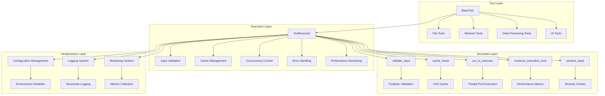
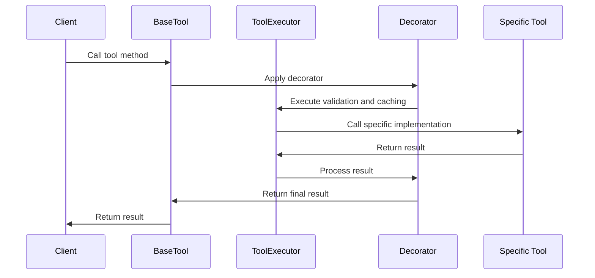
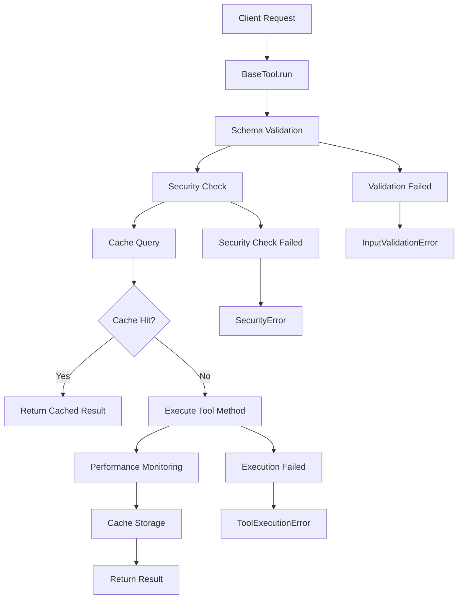
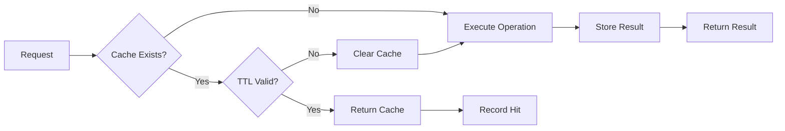
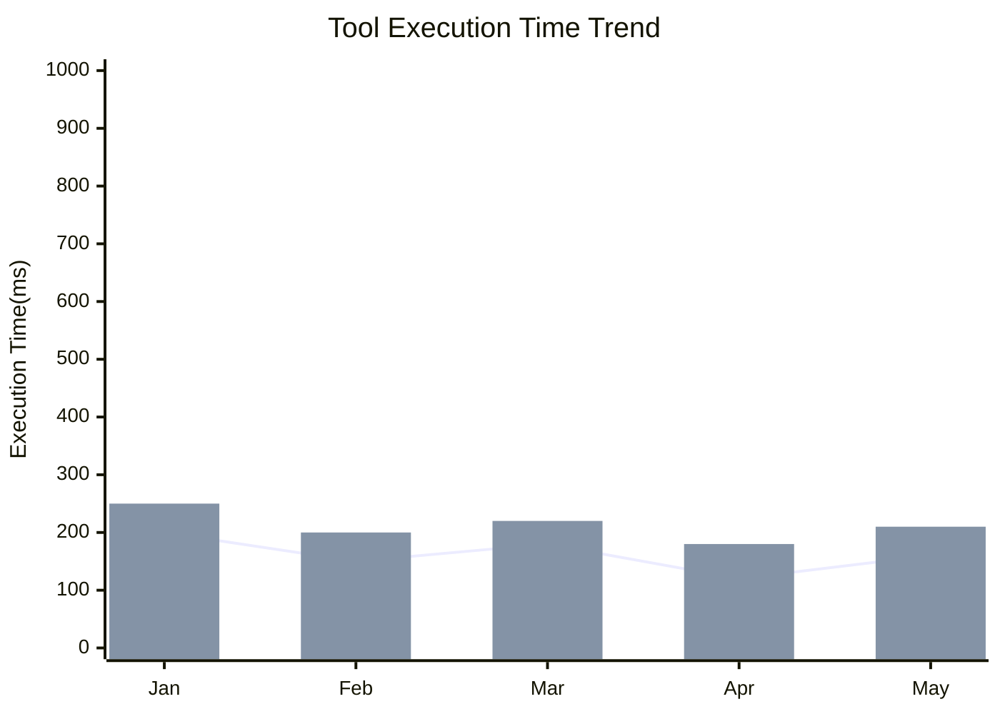

# Base Tool Class Technical Documentation

## 1. Overview

**Purpose**: `BaseTool` is the abstract base class for all tool classes in the AIECS system, providing a unified tool development framework and common functionality. This component implements standardized, secure, and performance-optimized tool development through the decorator pattern, dependency injection, and separation of cross-cutting concerns, solving problems of code duplication, security vulnerabilities, and performance bottlenecks in tool development.

**Core Value**:
- **Unified Development Framework**: Provides standardized tool development patterns and interfaces
- **Security Protection**: Built-in input validation, security checks, and injection attack protection
- **Performance Optimization**: Integrated caching, concurrency control, and performance monitoring
- **Extensibility**: Supports synchronous/asynchronous operations and batch processing
- **Development Efficiency**: Simplifies implementation of cross-cutting concerns through decorators

## 2. Problem Background and Design Motivation

### 2.1 Business Pain Points

Key challenges in AI tool development:

1. **Code Duplication**: Each tool needs to implement common logic like input validation, caching, error handling
2. **Security Risks**: Lack of unified input validation and security check mechanisms
3. **Performance Bottlenecks**: No unified caching and concurrency control strategies
4. **Low Development Efficiency**: Developers need to repeatedly implement the same cross-cutting concerns
5. **Maintenance Difficulties**: Common logic scattered across tools, difficult to maintain and upgrade uniformly
6. **Complex Testing**: Lack of unified testing framework and mocking mechanisms

### 2.2 Design Motivation

Based on the above pain points, designed a tool base class based on the decorator pattern:

- **Separation of Cross-Cutting Concerns**: Abstract common logic as decorators, separated from business logic
- **Dependency Injection**: Inject common services through ToolExecutor, reducing coupling
- **Security First**: Built-in multi-layer security checks and input validation mechanisms
- **Performance-Oriented**: Integrated intelligent caching and concurrency control strategies
- **Developer Friendly**: Provides concise APIs and rich decorators

## 3. Architecture Positioning and Context

### 3.1 System Architecture Diagram



### 3.2 Upstream and Downstream Dependencies

**Upstream Callers**:
- Business service layer
- AI agent system
- Task executor
- API interface layer

**Downstream Dependencies**:
- ToolExecutor (tool executor)
- Pydantic (data validation)
- Cache system (LRU Cache)
- Thread pool executor
- Logging and monitoring systems

**Peer Components**:
- Specific tool implementation classes
- Configuration management system
- Security module

### 3.3 Data Flow



## 4. Core Features and Use Cases

### 4.1 Input Validation and Security Protection

**Function Description**: Automatically validate input parameters through Pydantic schemas and provide multi-layer security check mechanisms.

**Core Features**:
- Automatic schema registration and validation
- SQL injection attack protection
- Malicious content detection
- Parameter type checking

**Use Cases**:
```python
from aiecs.tools.base_tool import BaseTool
from pydantic import BaseModel
from typing import Optional

class FileTool(BaseTool):
    class ReadSchema(BaseModel):
        path: str
        encoding: str = "utf-8"
        max_size: Optional[int] = None

    def read(self, path: str, encoding: str = "utf-8", max_size: Optional[int] = None):
        """Safely read file content"""
        # Business logic implementation
        with open(path, 'r', encoding=encoding) as f:
            content = f.read(max_size) if max_size else f.read()
        return content

# Usage example
tool = FileTool()
try:
    result = tool.run("read", path="/path/to/file.txt", encoding="utf-8")
    print(f"File content: {result}")
except InputValidationError as e:
    print(f"Input validation failed: {e}")
except SecurityError as e:
    print(f"Security check failed: {e}")
```

**Real-World Application Cases**:
- **File operation tools**: Validate file paths and permissions
- **Database tools**: Prevent SQL injection attacks
- **Network tools**: Validate URLs and request parameters
- **AI tools**: Validate model parameters and input data

### 4.2 Intelligent Caching System

**Function Description**: Content-hash-based intelligent caching mechanism supporting TTL and LRU strategies.

**Core Features**:
- Content-aware cache key generation
- Configurable TTL and cache size
- User and task-level cache isolation
- Automatic cache invalidation and cleanup

**Use Cases**:
```python
from aiecs.tools.base_tool import BaseTool, cache_result
from pydantic import BaseModel
import time

class DataTool(BaseTool):
    class ProcessSchema(BaseModel):
        data: str
        algorithm: str = "default"

    @cache_result(ttl=3600)  # Cache for 1 hour
    def process_data(self, data: str, algorithm: str = "default"):
        """Process data and cache result"""
        # Simulate complex data processing
        time.sleep(2)  # Simulate time-consuming operation
        return f"Processed {data} with {algorithm}"

# Usage example
tool = DataTool()

# First call, will execute and cache
start = time.time()
result1 = tool.run("process_data", data="test data", algorithm="advanced")
print(f"First call took: {time.time() - start:.2f} seconds")

# Second call, returns from cache
start = time.time()
result2 = tool.run("process_data", data="test data", algorithm="advanced")
print(f"Second call took: {time.time() - start:.2f} seconds")
print(f"Results are the same: {result1 == result2}")
```

**Real-World Application Cases**:
- **API call tools**: Cache external API responses
- **File processing tools**: Cache file processing results
- **AI model tools**: Cache model inference results
- **Data query tools**: Cache database query results

### 4.3 Asynchronous Concurrent Processing

**Function Description**: Supports asynchronous operations and batch processing to improve system concurrency performance.

**Core Features**:
- Automatic async method detection
- Thread pool execution for synchronous methods
- Parallel processing for batch operations
- Async context management

**Use Cases**:
```python
import asyncio
from aiecs.tools.base_tool import BaseTool
from pydantic import BaseModel

class NetworkTool(BaseTool):
    class FetchSchema(BaseModel):
        url: str
        timeout: int = 30

    async def fetch_url(self, url: str, timeout: int = 30):
        """Asynchronously fetch URL content"""
        import aiohttp
        async with aiohttp.ClientSession() as session:
            async with session.get(url, timeout=timeout) as response:
                return await response.text()

    def process_sync(self, data: str):
        """Synchronous processing method"""
        return f"Processed: {data}"

# Async usage example
async def main():
    tool = NetworkTool()
    
    # Async call
    result = await tool.run_async("fetch_url", url="https://api.example.com/data")
    print(f"Async fetch result: {result[:100]}...")
    
    # Batch processing
    operations = [
        {"op": "fetch_url", "kwargs": {"url": "https://api1.example.com"}},
        {"op": "fetch_url", "kwargs": {"url": "https://api2.example.com"}},
        {"op": "process_sync", "kwargs": {"data": "test"}}
    ]
    
    results = await tool.run_batch(operations)
    print(f"Batch processing results: {len(results)} operations completed")

# Run async example
asyncio.run(main())
```

**Real-World Application Cases**:
- **Batch file processing**: Process multiple files in parallel
- **API aggregation tools**: Concurrently call multiple external APIs
- **Data synchronization tools**: Asynchronously synchronize large amounts of data
- **AI inference tools**: Batch process AI model inference

### 4.4 Performance Monitoring and Metrics Collection

**Function Description**: Automatically collect performance metrics such as execution time and cache hit rate.

**Core Features**:
- Automatic execution time measurement
- Cache hit rate statistics
- Error rate monitoring
- Performance metrics export

**Use Cases**:
```python
from aiecs.tools.base_tool import BaseTool, measure_execution_time
import time

class PerformanceTool(BaseTool):
    @measure_execution_time
    def heavy_computation(self, n: int):
        """Simulate heavy computation task"""
        result = 0
        for i in range(n):
            result += i ** 2
        return result

# Usage example
tool = PerformanceTool()

# Execute multiple operations
for i in range(5):
    result = tool.run("heavy_computation", n=10000)
    print(f"Computation result: {result}")

# Get performance metrics
executor = tool._executor
metrics = executor.get_metrics()
print(f"Performance metrics: {metrics}")
# Output: {'requests': 5, 'failures': 0, 'cache_hits': 0, 'avg_processing_time': 0.1234}
```

**Real-World Application Cases**:
- **Performance analysis tools**: Monitor tool execution performance
- **Resource usage monitoring**: Track memory and CPU usage
- **API performance monitoring**: Monitor external API call performance
- **Cache effectiveness analysis**: Analyze cache strategy effectiveness

## 5. API Reference

### 5.1 BaseTool Class

#### Constructor
```python
def __init__(self, config: Optional[Dict[str, Any]] = None)
```

**Parameters**:
- `config` (Dict[str, Any], optional): Tool-specific configuration

**Exceptions**:
- `ValueError`: If configuration is invalid

#### Core Methods

##### run
```python
def run(self, op: str, **kwargs) -> Any
```

**Function**: Execute synchronous operation
**Parameters**:
- `op` (str, required): Name of operation to execute
- `**kwargs`: Parameters passed to the operation

**Returns**: Operation result
**Exceptions**:
- `ToolExecutionError`: Operation execution failed
- `InputValidationError`: Invalid input parameters
- `SecurityError`: Input contains malicious content

##### run_async
```python
async def run_async(self, op: str, **kwargs) -> Any
```

**Function**: Execute asynchronous operation
**Parameters**: Same as `run`
**Returns**: Operation result
**Exceptions**: Same as `run`

##### run_batch
```python
async def run_batch(self, operations: List[Dict[str, Any]]) -> List[Any]
```

**Function**: Execute multiple operations in parallel
**Parameters**:
- `operations` (List[Dict[str, Any]], required): List of operations, each containing 'op' and 'kwargs'

**Returns**: List of operation results
**Exceptions**:
- `ToolExecutionError`: Any operation failed
- `InputValidationError`: Invalid input parameters

### 5.2 Decorators

#### validate_input
```python
@validate_input(schema_class: Type[BaseModel])
```

**Function**: Validate input using Pydantic schema
**Parameters**:
- `schema_class` (Type[BaseModel], required): Pydantic schema class

**Exceptions**:
- `InputValidationError`: Input validation failed

#### cache_result
```python
@cache_result(ttl: Optional[int] = None)
```

**Function**: Cache function result
**Parameters**:
- `ttl` (Optional[int], optional): Cache time-to-live (seconds)

#### run_in_executor
```python
@run_in_executor
```

**Function**: Run synchronous function in thread pool
**Returns**: Async wrapper

#### measure_execution_time
```python
@measure_execution_time
```

**Function**: Measure and record execution time

#### sanitize_input
```python
@sanitize_input
```

**Function**: Sanitize input parameters for enhanced security

### 5.3 Internal Methods

#### _register_schemas
```python
def _register_schemas(self) -> None
```

**Function**: Register Pydantic schemas by inspecting internal Schema classes

#### _register_async_methods
```python
def _register_async_methods(self) -> None
```

**Function**: Register async methods for proper execution handling

#### _sanitize_kwargs
```python
def _sanitize_kwargs(self, kwargs: Dict[str, Any]) -> Dict[str, Any]
```

**Function**: Sanitize keyword arguments to prevent injection attacks
**Parameters**:
- `kwargs` (Dict[str, Any]): Input keyword arguments

**Returns**: Sanitized keyword arguments
**Exceptions**:
- `SecurityError`: If parameters contain malicious content

## 6. Technical Implementation Details

### 6.1 Decorator Pattern Implementation

**Design Principles**:
- Use decorators to separate cross-cutting concerns
- Maintain purity of business logic
- Support decorator composition and chaining

**Implementation Mechanism**:
```python
def validate_input(schema_class: Type[BaseModel]) -> Callable:
    def decorator(func: Callable) -> Callable:
        @functools.wraps(func)
        def wrapper(self, *args, **kwargs):
            try:
                schema = schema_class(**kwargs)
                validated_kwargs = schema.dict(exclude_unset=True)
                return func(self, **validated_kwargs)
            except ValidationError as e:
                raise InputValidationError(f"Invalid input parameters: {e}")
        return wrapper
    return decorator
```

### 6.2 Automatic Schema Registration Mechanism

**Implementation Principle**:
```python
def _register_schemas(self) -> None:
    for attr_name in dir(self.__class__):
        attr = getattr(self.__class__, attr_name)
        if isinstance(attr, type) and issubclass(attr, BaseModel) and attr.__name__.endswith('Schema'):
            op_name = attr.__name__.replace('Schema', '').lower()
            self._schemas[op_name] = attr
```

**Naming Convention**:
- Schema classes must end with 'Schema'
- Operation name obtained by removing 'Schema' and converting to lowercase
- Example: `ReadSchema` → `read` operation

### 6.3 Cache Key Generation Strategy

**Content-Aware Key Generation**:
```python
def _get_cache_key(self, func_name: str, args: tuple, kwargs: Dict[str, Any]) -> str:
    user_id = kwargs.get("user_id", "anonymous")
    task_id = kwargs.get("task_id", "none")
    return self.execution_utils.generate_cache_key(func_name, user_id, task_id, args, kwargs)
```

**Key Generation Features**:
- Include user ID and task ID for isolation
- Generate hash value based on parameter content
- Support TTL and version control

### 6.4 Security Protection Mechanism

**Multi-Layer Security Checks**:
```python
def _sanitize_kwargs(self, kwargs: Dict[str, Any]) -> Dict[str, Any]:
    sanitized = {}
    for k, v in kwargs.items():
        if isinstance(v, str) and re.search(r'(\bSELECT\b|\bINSERT\b|--|;|/\*)', v, re.IGNORECASE):
            raise SecurityError(f"Input parameter '{k}' contains potentially malicious content")
        sanitized[k] = v
    return sanitized
```

**Protection Strategies**:
- SQL injection pattern detection
- Script injection protection
- Path traversal attack protection
- Extensible security rules

### 6.5 Asynchronous Execution Mechanism

**Async Method Detection**:
```python
def _register_async_methods(self) -> None:
    for attr_name in dir(self.__class__):
        attr = getattr(self.__class__, attr_name)
        if inspect.iscoroutinefunction(attr) and not attr_name.startswith('_'):
            self._async_methods.append(attr_name)
```

**Execution Strategy**:
- Automatic async method detection
- Synchronous methods executed in thread pool
- Support batch parallel processing
- Async context management

## 7. Configuration and Deployment

### 7.1 Environment Variable Configuration

**Basic Configuration**:
```bash
# Tool executor configuration
TOOL_EXECUTOR_ENABLE_CACHE=true
TOOL_EXECUTOR_CACHE_SIZE=100
TOOL_EXECUTOR_CACHE_TTL=3600
TOOL_EXECUTOR_MAX_WORKERS=4
TOOL_EXECUTOR_IO_CONCURRENCY=8
TOOL_EXECUTOR_CHUNK_SIZE=10000
TOOL_EXECUTOR_MAX_FILE_SIZE=1000000
TOOL_EXECUTOR_LOG_LEVEL=INFO
TOOL_EXECUTOR_LOG_EXECUTION_TIME=true
TOOL_EXECUTOR_ENABLE_SECURITY_CHECKS=true
TOOL_EXECUTOR_RETRY_ATTEMPTS=3
TOOL_EXECUTOR_RETRY_BACKOFF=1.0
TOOL_EXECUTOR_TIMEOUT=30
```

**Advanced Configuration**:
```bash
# Cache configuration
CACHE_BACKEND=redis
CACHE_REDIS_URL=redis://localhost:6379/0
CACHE_PREFIX=tool_cache

# Monitoring configuration
ENABLE_METRICS=true
METRICS_BACKEND=prometheus
PROMETHEUS_PORT=9090

# Security configuration
SECURITY_LEVEL=high
ALLOWED_FILE_EXTENSIONS=.txt,.json,.csv
MAX_INPUT_SIZE=1048576
```

### 7.2 Dependency Management

**Core Dependencies**:
```python
# requirements.txt
pydantic>=2.0.0
cachetools>=5.3.0
asyncio-mqtt>=0.11.0
aiohttp>=3.8.0
```

**Development Dependencies**:
```python
# requirements-dev.txt
pytest>=7.0.0
pytest-asyncio>=0.21.0
pytest-mock>=3.10.0
black>=23.0.0
mypy>=1.0.0
```

### 7.3 Deployment Configuration

**Docker Configuration**:
```dockerfile
FROM python:3.9-slim

WORKDIR /app
COPY requirements.txt .
RUN pip install -r requirements.txt

COPY . .
CMD ["python", "-m", "aiecs.tools"]
```

**Kubernetes Configuration**:
```yaml
apiVersion: apps/v1
kind: Deployment
metadata:
  name: tool-service
spec:
  replicas: 3
  selector:
    matchLabels:
      app: tool-service
  template:
    metadata:
      labels:
        app: tool-service
    spec:
      containers:
      - name: tool-service
        image: aiecs/tool-service:latest
        env:
        - name: TOOL_EXECUTOR_MAX_WORKERS
          value: "8"
        - name: TOOL_EXECUTOR_CACHE_SIZE
          value: "1000"
        resources:
          requests:
            memory: "512Mi"
            cpu: "250m"
          limits:
            memory: "1Gi"
            cpu: "500m"
```

### 7.4 Monitoring Configuration

**Prometheus Metrics**:
```python
from prometheus_client import Counter, Histogram, Gauge

# Define monitoring metrics
tool_executions = Counter('tool_executions_total', 'Total tool executions', ['tool_name', 'operation'])
tool_duration = Histogram('tool_duration_seconds', 'Tool execution duration', ['tool_name'])
tool_cache_hits = Counter('tool_cache_hits_total', 'Tool cache hits', ['tool_name'])
tool_errors = Counter('tool_errors_total', 'Tool errors', ['tool_name', 'error_type'])
```

**Health Check**:
```python
async def health_check():
    """Check tool service health status"""
    try:
        # Check cache connection
        cache_status = await check_cache_connection()
        
        # Check thread pool status
        executor_status = check_executor_status()
        
        return {
            "status": "healthy",
            "cache": cache_status,
            "executor": executor_status,
            "timestamp": time.time()
        }
    except Exception as e:
        return {
            "status": "unhealthy",
            "error": str(e),
            "timestamp": time.time()
        }
```

## 8. Maintenance and Troubleshooting

### 8.1 Monitoring Metrics

**Key Metrics**:
- Tool execution success rate
- Average execution time
- Cache hit rate
- Error rate and error types
- Memory and CPU usage

**Monitoring Dashboard**:
```python
# Grafana query examples
# Tool execution success rate
sum(rate(tool_executions_total[5m])) by (tool_name)

# Average execution time
histogram_quantile(0.95, rate(tool_duration_seconds_bucket[5m]))

# Cache hit rate
rate(tool_cache_hits_total[5m]) / rate(tool_executions_total[5m])
```

### 8.2 Common Issues and Solutions

#### 8.2.1 Input Validation Failure

**Symptoms**:
- `InputValidationError` exception
- Parameter type mismatch
- Required parameters missing

**Troubleshooting Steps**:
1. Check Pydantic schema definition
2. Verify input parameter types
3. Check if required parameters are provided
4. View detailed error information

**Solution**:
```python
# Check schema definition
class MyTool(BaseTool):
    class ProcessSchema(BaseModel):
        data: str
        count: int = 1  # Provide default value
        
    def process(self, data: str, count: int = 1):
        pass

# Add detailed validation
try:
    result = tool.run("process", data="test", count="invalid")
except InputValidationError as e:
    print(f"Validation failure details: {e}")
    # Check specific field errors
    for error in e.errors():
        print(f"Field {error['loc']}: {error['msg']}")
```

#### 8.2.2 Cache Issues

**Symptoms**:
- Low cache hit rate
- High memory usage
- Inconsistent cache data

**Troubleshooting Steps**:
1. Check cache configuration
2. Analyze cache key generation
3. Monitor memory usage
4. Check TTL settings

**Solution**:
```python
# Optimize cache configuration
config = {
    "enable_cache": True,
    "cache_size": 1000,  # Increase cache size
    "cache_ttl": 1800,   # Adjust TTL
}

tool = MyTool(config)

# Check cache status
executor = tool._executor
metrics = executor.get_metrics()
print(f"Cache hit rate: {metrics['cache_hits'] / metrics['requests']:.2%}")

# Clear cache
executor.execution_utils.clear_cache()
```

#### 8.2.3 Performance Issues

**Symptoms**:
- Long execution time
- Continuously growing memory usage
- Insufficient concurrent processing capacity

**Troubleshooting Steps**:
1. Analyze execution time distribution
2. Check for memory leaks
3. Optimize concurrency configuration
4. Analyze bottleneck operations

**Solution**:
```python
# Performance analysis
@measure_execution_time
def slow_operation(self, data):
    # Add performance analysis
    import cProfile
    profiler = cProfile.Profile()
    profiler.enable()
    
    try:
        result = self._process_data(data)
        return result
    finally:
        profiler.disable()
        profiler.dump_stats('slow_operation.prof')

# Optimize concurrency configuration
config = {
    "max_workers": 8,        # Increase worker threads
    "io_concurrency": 16,    # Increase I/O concurrency
    "chunk_size": 5000,      # Optimize chunk size
}
```

### 8.3 Log Analysis

**Log Configuration**:
```python
import logging

# Configure tool logging
tool_logger = logging.getLogger('aiecs.tools')
tool_logger.setLevel(logging.INFO)

# Add file handler
file_handler = logging.FileHandler('/var/log/aiecs/tools.log')
file_handler.setFormatter(logging.Formatter(
    '%(asctime)s - %(name)s - %(levelname)s - %(message)s'
))
tool_logger.addHandler(file_handler)
```

**Key Log Patterns**:
```bash
# Find error logs
grep "ERROR" /var/log/aiecs/tools.log | tail -100

# Analyze performance issues
grep "executed in" /var/log/aiecs/tools.log | awk '{print $NF}' | sort -n

# Monitor cache hits
grep "Cache hit" /var/log/aiecs/tools.log | wc -l
```

### 8.4 Testing Strategy

**Unit Tests**:
```python
import pytest
from aiecs.tools.base_tool import BaseTool

class TestTool(BaseTool):
    class AddSchema(BaseModel):
        a: int
        b: int
    
    def add(self, a: int, b: int):
        return a + b

def test_tool_execution():
    tool = TestTool()
    result = tool.run("add", a=2, b=3)
    assert result == 5

def test_input_validation():
    tool = TestTool()
    with pytest.raises(InputValidationError):
        tool.run("add", a="invalid", b=3)

def test_async_execution():
    async def test():
        tool = TestTool()
        result = await tool.run_async("add", a=2, b=3)
        assert result == 5
    
    asyncio.run(test())
```

## 9. Visualizations

### 9.1 Architecture Flow Diagram



### 9.2 Decorator Composition Diagram

```mermaid
graph TB
    A[Tool Method] --> B[@validate_input]
    B --> C[@sanitize_input]
    C --> D[@cache_result]
    D --> E[@measure_execution_time]
    E --> F[@run_in_executor]
    F --> G[Final Method]
    
    H[Pydantic Validation] --> B
    I[Security Check] --> C
    J[LRU Cache] --> D
    K[Performance Monitoring] --> E
    L[Thread Pool] --> F
```

### 9.3 Cache Strategy Diagram



### 9.4 Performance Monitoring Diagram



## 10. Version History

### v1.0.0 (2024-01-15)
**New Features**:
- Implemented BaseTool base architecture
- Integrated Pydantic input validation
- Added basic decorator support
- Implemented simple caching mechanism

**Technical Features**:
- Cross-cutting concern separation based on decorator pattern
- Automatic schema registration mechanism
- Basic security protection

### v1.1.0 (2024-02-01)
**New Features**:
- Integrated ToolExecutor executor
- Added intelligent caching system
- Implemented async operation support
- Enhanced security protection mechanisms

**Performance Optimizations**:
- LRU cache strategy
- Thread pool concurrent execution
- Performance metrics collection

### v1.2.0 (2024-03-01)
**New Features**:
- Added batch operation support
- Implemented advanced security checks
- Integrated monitoring and metrics
- Supported configuration management

**Monitoring Enhancements**:
- Prometheus metrics integration
- Detailed performance analysis
- Error tracking and reporting

### v1.3.0 (2024-04-01) [Planned]
**Planned Features**:
- Add plugin system
- Implement dynamic configuration
- Support distributed caching
- Add machine learning optimization

**Architecture Optimizations**:
- Microservices architecture support
- Cloud-native integration
- Auto-scaling

---

## Appendix

### A. Related Documentation
- [Tool Executor Documentation](./TOOLS_TOOL_EXECUTOR.md)
- [Configuration Best Practices](../TOOLS_USED_INSTRUCTION/CONFIGURATION_BEST_PRACTICES.md)

### B. Example Code
- [Complete Example Project](https://github.com/aiecs/examples)
- [Performance Test Scripts](https://github.com/aiecs/performance-tests)
- [Security Test Suite](https://github.com/aiecs/security-tests)

### C. Technical Support
- Technical Documentation: https://docs.aiecs.com
- Issue Reporting: https://github.com/aiecs/issues
- Community Discussion: https://discord.gg/aiecs
