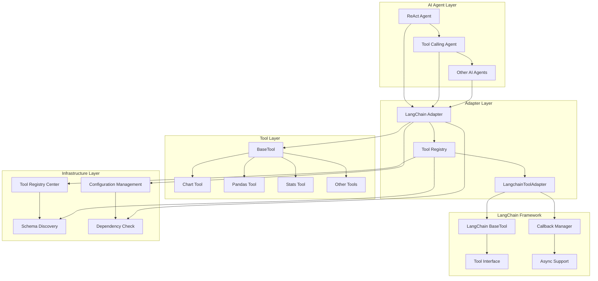
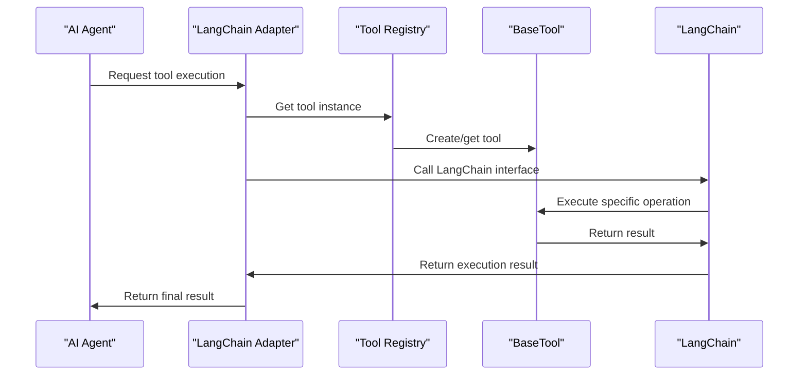
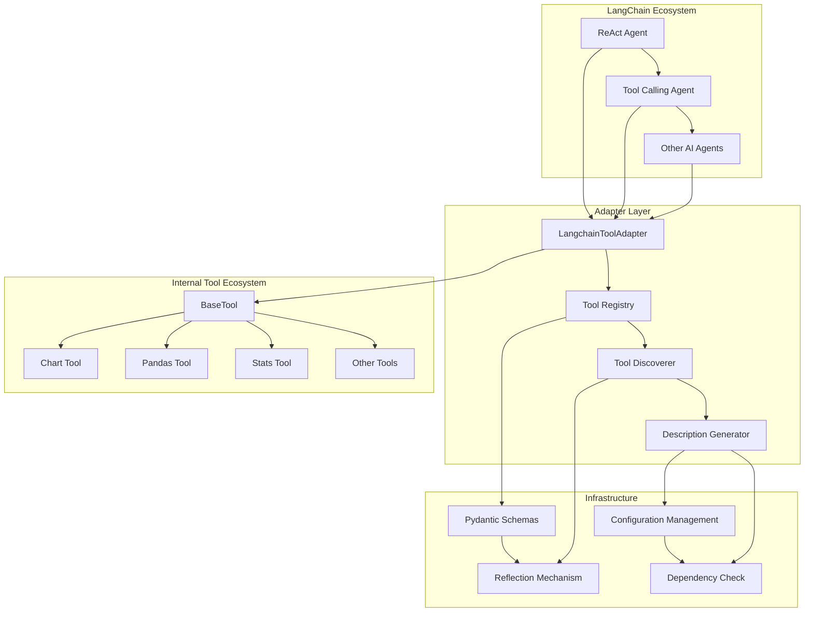
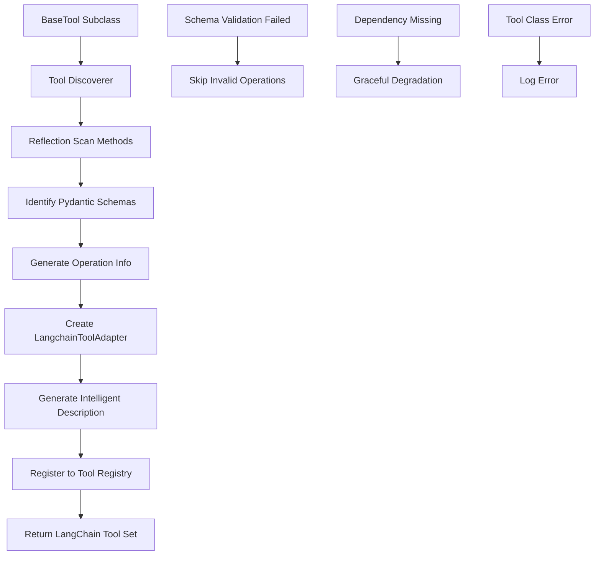
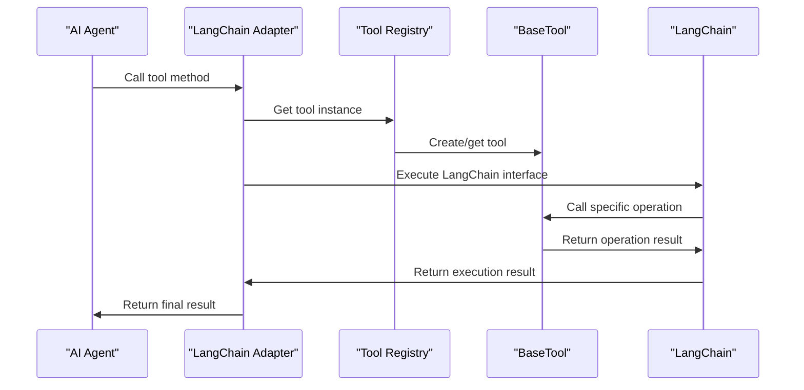
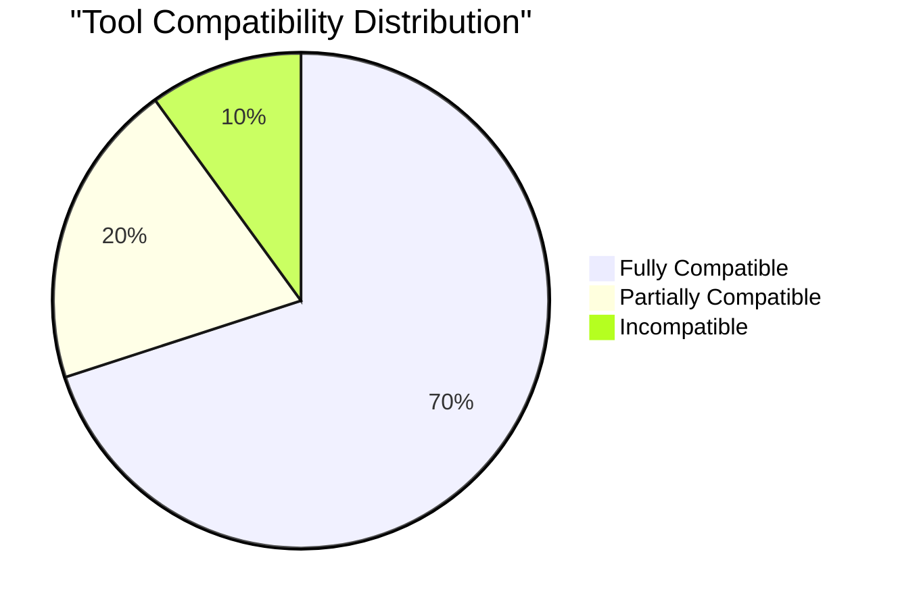

# LangChain Adapter Technical Documentation

## 1. Overview

**Purpose**: `langchain_adapter.py` is a key adapter component in the AIECS system that connects the internal tool ecosystem with the LangChain framework. This module seamlessly integrates tools based on `BaseTool` into LangChain's ReAct Agent and Tool Calling Agent through automatic discovery and conversion mechanisms, achieving standardized integration between internal tools and mainstream AI frameworks.

**Core Value**:
- **Seamless Integration**: Automatically converts internal tools to LangChain-compatible tools
- **Feature Preservation**: Completely preserves all functional features of original tools (caching, validation, security, etc.)
- **Intelligent Discovery**: Automatically discovers tool operation methods and Pydantic schemas
- **Flexible Configuration**: Supports selective tool conversion and custom description generation
- **Compatibility Assurance**: Gracefully handles missing LangChain dependencies

## 2. Problem Background & Design Motivation

### 2.1 Business Pain Points

The following key challenges are faced in AI application development:

1. **Framework Fragmentation**: Internal tool systems lack unified interfaces with mainstream AI frameworks (such as LangChain)
2. **Duplicate Development**: Need to repeatedly implement the same tool functionality for different frameworks
3. **High Maintenance Costs**: Multiple tool implementations lead to code duplication and maintenance difficulties
4. **Complex Integration**: Manual integration of tools into AI agents is labor-intensive and error-prone
5. **Feature Loss**: Advanced features of original tools are easily lost during integration
6. **Version Compatibility**: Framework version updates lead to compatibility issues

### 2.2 Design Motivation

Based on the above pain points, an integration solution based on the adapter pattern was designed:

- **Adapter Pattern**: Achieves seamless integration between different frameworks through an adapter layer
- **Automatic Discovery Mechanism**: Automatically discovers tool operations and schemas through reflection
- **Feature Preservation Strategy**: Ensures converted tools maintain all original functionality
- **Graceful Degradation**: Provides basic functionality support when dependencies are missing
- **Standardized Interface**: Provides a unified tool integration standard

## 3. Architecture Positioning & Context

### 3.1 System Architecture Diagram



### 3.2 Upstream and Downstream Dependencies

**Upstream Callers**:
- LangChain ReAct Agent
- LangChain Tool Calling Agent
- Other LangChain-based AI agents
- Custom AI applications

**Downstream Dependencies**:
- BaseTool and its subclasses
- Tool registry center (TOOL_CLASSES)
- Pydantic schema system
- LangChain framework (optional)

**Peer Components**:
- Tool Executor (ToolExecutor)
- Temporary file manager
- Configuration management system

### 3.3 Data Flow



## 4. Core Features & Use Cases

### 4.1 Automatic Tool Discovery and Conversion

**Feature Description**: Automatically discovers all operation methods of BaseTool subclasses and converts them into independent LangChain tools.

**Core Features**:
- Reflection mechanism automatically discovers operation methods
- Automatically identifies Pydantic schemas
- Generates enhanced tool descriptions
- Supports synchronous and asynchronous operations

**Usage Scenarios**:
```python
from aiecs.tools.langchain_adapter import get_langchain_tools, create_react_agent_tools

# Get LangChain adapters for all tools
all_tools = get_langchain_tools()
print(f"Discovered {len(all_tools)} LangChain tools")

# Get adapters for specific tools
chart_tools = get_langchain_tools(['chart'])
for tool in chart_tools:
    print(f"Tool: {tool.name}")
    print(f"Description: {tool.description}")
    print(f"Parameter schema: {tool.args_schema}")

# Create ReAct Agent tool set
react_tools = create_react_agent_tools()
```

**Real-world Application Cases**:
- **Data Analysis Agent**: Automatically integrates chart, statistics, and data processing tools
- **Document Processing Agent**: Integrates Office, PDF, and text processing tools
- **Research Assistant Agent**: Integrates search, scraping, and information gathering tools
- **Code Assistant Agent**: Integrates code analysis, generation, and testing tools

### 4.2 Intelligent Description Generation

**Feature Description**: Automatically generates detailed and user-friendly tool descriptions based on tool type and operation characteristics.

**Core Features**:
- Intelligent descriptions based on tool names
- Automatic parameter information extraction
- Detailed feature descriptions
- Multi-language support preparation

**Usage Scenarios**:
```python
from aiecs.tools.langchain_adapter import ToolRegistry

# Create tool registry
registry = ToolRegistry()

# Generate descriptions for chart tools
chart_tools = registry.create_langchain_tools('chart')
for tool in chart_tools:
    print(f"Tool name: {tool.name}")
    print(f"Intelligent description: {tool.description}")
    print("---")

# Output example:
# Tool name: chart_read_data
# Intelligent description: Read and analyze data files in multiple formats (CSV, Excel, JSON, Parquet, etc.). 
#          Returns data structure summary, preview, and optional export functionality. 
#          Required: path. Optional: format, preview_rows.
```

**Real-world Application Cases**:
- **AI Agent Understanding**: Helps AI agents better understand tool functionality
- **User Interface**: Displays detailed descriptions in tool selection interfaces
- **Documentation Generation**: Automatically generates tool usage documentation
- **Error Diagnosis**: Provides more accurate error messages and suggestions

### 4.3 Compatibility Check and Graceful Degradation

**Feature Description**: Checks LangChain dependency availability and provides basic functionality support when dependencies are missing.

**Core Features**:
- Runtime dependency checking
- Graceful degradation mechanism
- Compatibility report generation
- Error messages and suggestions

**Usage Scenarios**:
```python
from aiecs.tools.langchain_adapter import check_langchain_compatibility

# Check compatibility
compatibility = check_langchain_compatibility()
print(f"LangChain available: {compatibility['langchain_available']}")
print(f"Compatible tools count: {len(compatibility['compatible_tools'])}")
print(f"Total operations: {compatibility['total_operations']}")

if not compatibility['langchain_available']:
    print("Recommend installing LangChain: pip install langchain")
else:
    print("Environment configured correctly, all features available")

# Check specific tool compatibility
for tool_info in compatibility['compatible_tools']:
    print(f"Tool {tool_info['name']}: {tool_info['operations_count']} operations")
```

**Real-world Application Cases**:
- **Environment Diagnosis**: Quickly check development environment configuration
- **Deployment Verification**: Ensure production environment dependencies are complete
- **Troubleshooting**: Quickly locate integration issues
- **Version Management**: Handle compatibility between different versions

### 4.4 Batch Tool Management

**Feature Description**: Supports batch creation, management, and usage of LangChain adapters for multiple tools.

**Core Features**:
- Batch tool conversion
- Tool collection management
- Selective tool loading
- Unified error handling

**Usage Scenarios**:
```python
from aiecs.tools.langchain_adapter import ToolRegistry, get_langchain_tools

# Create tool registry
registry = ToolRegistry()

# Batch create specific tool set
data_tools = get_langchain_tools(['chart', 'pandas', 'stats'])
print(f"Data tool set: {len(data_tools)} tools")

# Create complete tool set
all_tools = registry.create_all_langchain_tools()
print(f"Complete tool set: {len(all_tools)} tools")

# Organize tools by category
tools_by_category = {}
for tool in all_tools:
    category = tool.name.split('_')[0]  # Extract tool category
    if category not in tools_by_category:
        tools_by_category[category] = []
    tools_by_category[category].append(tool)

for category, tools in tools_by_category.items():
    print(f"{category} category: {len(tools)} tools")
```

**Real-world Application Cases**:
- **Professional Agents**: Create professional tool sets for specific domains
- **Performance Optimization**: Load only necessary tools to reduce memory usage
- **Modular Deployment**: Deploy different tool sets by functional modules
- **A/B Testing**: Test effects of different tool combinations

## 5. API Reference

### 5.1 LangchainToolAdapter Class

#### Constructor
```python
def __init__(
    self, 
    base_tool_name: str,
    operation_name: str, 
    operation_schema: Optional[Type[BaseModel]] = None,
    description: Optional[str] = None
)
```

**Parameters**:
- `base_tool_name` (str, required): Original tool name
- `operation_name` (str, required): Operation name
- `operation_schema` (Type[BaseModel], optional): Pydantic schema for the operation
- `description` (str, optional): Tool description

#### Core Methods

##### _run
```python
def _run(
    self, 
    run_manager: Optional[CallbackManagerForToolRun] = None, 
    **kwargs: Any
) -> Any
```

**Function**: Synchronously execute operation
**Parameters**:
- `run_manager` (CallbackManagerForToolRun, optional): LangChain callback manager
- `**kwargs`: Operation parameters

**Returns**: Operation result
**Exceptions**:
- `Exception`: Operation execution failed

##### _arun
```python
async def _arun(
    self, 
    run_manager: Optional[AsyncCallbackManagerForToolRun] = None,
    **kwargs: Any
) -> Any
```

**Function**: Asynchronously execute operation
**Parameters**:
- `run_manager` (AsyncCallbackManagerForToolRun, optional): Async callback manager
- `**kwargs`: Operation parameters

**Returns**: Operation result
**Exceptions**:
- `Exception`: Operation execution failed

### 5.2 ToolRegistry Class

#### Constructor
```python
def __init__(self)
```

#### Core Methods

##### discover_operations
```python
def discover_operations(self, base_tool_class: Type[BaseTool]) -> List[Dict[str, Any]]
```

**Function**: Discover all operation methods and schemas of BaseTool class
**Parameters**:
- `base_tool_class` (Type[BaseTool], required): BaseTool subclass

**Returns**: List of operation information, including method name, schema, description, etc.

##### create_langchain_tools
```python
def create_langchain_tools(self, tool_name: str) -> List[LangchainToolAdapter]
```

**Function**: Create all LangChain adapters for the specified tool
**Parameters**:
- `tool_name` (str, required): Tool name

**Returns**: List of LangChain tool adapters
**Exceptions**:
- `ImportError`: LangChain not installed
- `ValueError`: Tool not registered

##### create_all_langchain_tools
```python
def create_all_langchain_tools(self) -> List[LangchainToolAdapter]
```

**Function**: Create LangChain adapters for all registered BaseTools
**Returns**: List of all LangChain tool adapters

##### get_tool
```python
def get_tool(self, name: str) -> Optional[LangchainToolAdapter]
```

**Function**: Get LangChain tool with specified name
**Parameters**:
- `name` (str, required): Tool name

**Returns**: LangChain tool adapter or None

##### list_langchain_tools
```python
def list_langchain_tools(self) -> List[str]
```

**Function**: List all LangChain tool names
**Returns**: List of tool names

### 5.3 Convenience Functions

#### get_langchain_tools
```python
def get_langchain_tools(tool_names: Optional[List[str]] = None) -> List[LangchainToolAdapter]
```

**Function**: Get LangChain tool collection
**Parameters**:
- `tool_names` (List[str], optional): List of tool names to convert, None means convert all tools

**Returns**: List of LangChain tool adapters

#### create_react_agent_tools
```python
def create_react_agent_tools() -> List[LangchainToolAdapter]
```

**Function**: Create complete tool set for ReAct Agent
**Returns**: List of adapted LangChain tools

#### create_tool_calling_agent_tools
```python
def create_tool_calling_agent_tools() -> List[LangchainToolAdapter]
```

**Function**: Create complete tool set for Tool Calling Agent
**Returns**: List of optimized LangChain tools

#### check_langchain_compatibility
```python
def check_langchain_compatibility() -> Dict[str, Any]
```

**Function**: Check compatibility between current environment and LangChain
**Returns**: Compatibility check result dictionary

## 6. Technical Implementation Details

### 6.1 Automatic Discovery Mechanism

**Reflection Implementation**:
```python
def discover_operations(self, base_tool_class: Type[BaseTool]) -> List[Dict[str, Any]]:
    operations = []
    
    # Discover Pydantic schemas
    schemas = {}
    for attr_name in dir(base_tool_class):
        attr = getattr(base_tool_class, attr_name)
        if isinstance(attr, type) and issubclass(attr, BaseModel) and attr.__name__.endswith('Schema'):
            op_name = attr.__name__.replace('Schema', '').lower()
            schemas[op_name] = attr
    
    # Discover public methods
    for method_name in dir(base_tool_class):
        if method_name.startswith('_') or not callable(getattr(base_tool_class, method_name)):
            continue
        if method_name in ['run', 'run_async', 'run_batch']:
            continue
            
        operation_info = {
            'name': method_name,
            'method': getattr(base_tool_class, method_name),
            'schema': schemas.get(method_name),
            'description': inspect.getdoc(getattr(base_tool_class, method_name)),
            'is_async': inspect.iscoroutinefunction(getattr(base_tool_class, method_name))
        }
        operations.append(operation_info)
    
    return operations
```

**Naming Conventions**:
- Schema classes must end with 'Schema'
- Operation names are obtained by removing 'Schema' and converting to lowercase
- Skip private methods and base class methods

### 6.2 Intelligent Description Generation

**Context-based Description Generation**:
```python
def _extract_description(self, method, base_tool_name: str, operation_name: str, schema: Optional[Type[BaseModel]] = None) -> str:
    doc = inspect.getdoc(method)
    base_desc = doc.split('\n')[0].strip() if doc else f"Execute {operation_name} operation"
    
    # Enhanced description based on tool type
    if base_tool_name == "chart":
        if operation_name == "read_data":
            enhanced_desc = "Read and analyze data files in multiple formats (CSV, Excel, JSON, Parquet, etc.). Returns data structure summary, preview, and optional export functionality."
        elif operation_name == "visualize":
            enhanced_desc = "Create data visualizations including histograms, scatter plots, bar charts, line charts, heatmaps, and pair plots. Supports customizable styling, colors, and high-resolution output."
    elif base_tool_name == "pandas":
        enhanced_desc = f"Pandas data manipulation: {base_desc}. Supports DataFrame operations with built-in validation and error handling."
    
    # Add parameter information
    if schema:
        fields = schema.__fields__ if hasattr(schema, '__fields__') else {}
        required_params = [name for name, field in fields.items() if field.is_required()]
        optional_params = [name for name, field in fields.items() if not field.is_required()]
        
        if required_params:
            enhanced_desc += f" Required: {', '.join(required_params)}."
        if optional_params:
            enhanced_desc += f" Optional: {', '.join(optional_params)}."
    
    return enhanced_desc
```

### 6.3 Compatibility Handling

**Graceful Degradation Mechanism**:
```python
try:
    from langchain.tools import BaseTool as LangchainBaseTool
    from langchain.callbacks.manager import CallbackManagerForToolRun, AsyncCallbackManagerForToolRun
    LANGCHAIN_AVAILABLE = True
except ImportError:
    # Create simple base class for type checking
    class LangchainBaseTool:
        pass
    CallbackManagerForToolRun = None
    AsyncCallbackManagerForToolRun = None
    LANGCHAIN_AVAILABLE = False
```

**Runtime Check**:
```python
def create_langchain_tools(self, tool_name: str) -> List[LangchainToolAdapter]:
    if not LANGCHAIN_AVAILABLE:
        raise ImportError("langchain is not installed. Please install it to use this adapter.")
    # ... continue execution
```

### 6.4 Tool Instance Management

**Lazy Instantiation**:
```python
def _run(self, run_manager: Optional[CallbackManagerForToolRun] = None, **kwargs: Any) -> Any:
    try:
        # Get original tool instance (lazy instantiation)
        base_tool = get_tool(self.__dict__['base_tool_name'])
        
        # Execute operation
        result = base_tool.run(self.__dict__['operation_name'], **kwargs)
        
        logger.info(f"Successfully executed {self.name} with result type: {type(result)}")
        return result
    except Exception as e:
        logger.error(f"Error executing {self.name}: {str(e)}")
        raise
```

**Instance Caching**:
- Implements lazy creation and caching of tool instances through `get_tool()` function
- Avoids duplicate creation of the same tool instances
- Supports configurable tool instance management

### 6.5 Error Handling and Logging

**Layered Error Handling**:
```python
def create_all_langchain_tools(self) -> List[LangchainToolAdapter]:
    all_tools = []
    
    for tool_name in list_tools():
        try:
            tools = self.create_langchain_tools(tool_name)
            all_tools.extend(tools)
        except Exception as e:
            logger.error(f"Failed to create Langchain tools for {tool_name}: {e}")
    
    return all_tools
```

**Structured Logging**:
```python
logger.info(f"Created {len(langchain_tools)} Langchain tools for {tool_name}")
logger.info(f"Successfully executed {self.name} with result type: {type(result)}")
logger.error(f"Error executing {self.name}: {str(e)}")
```

## 7. Configuration & Deployment

### 7.1 Environment Variable Configuration

**Basic Configuration**:
```bash
# LangChain configuration
LANGCHAIN_API_KEY=your-api-key
LANGCHAIN_TRACING_V2=true
LANGCHAIN_ENDPOINT=https://api.smith.langchain.com

# Tool configuration
TOOL_REGISTRY_CACHE_SIZE=1000
TOOL_REGISTRY_CACHE_TTL=3600
TOOL_DISCOVERY_AUTO_SCAN=true
TOOL_DISCOVERY_PACKAGE_PATH=aiecs.tools

# Logging configuration
LOG_LEVEL=INFO
LOG_FORMAT=json
LOG_FILE=/var/log/aiecs/langchain_adapter.log
```

**Advanced Configuration**:
```bash
# Performance optimization
TOOL_EXECUTION_TIMEOUT=30
TOOL_EXECUTION_MAX_RETRIES=3
TOOL_EXECUTION_RETRY_DELAY=1.0

# Security configuration
TOOL_SECURITY_VALIDATE_INPUT=true
TOOL_SECURITY_SANITIZE_OUTPUT=true
TOOL_SECURITY_MAX_INPUT_SIZE=1048576

# Monitoring configuration
ENABLE_METRICS=true
METRICS_BACKEND=prometheus
PROMETHEUS_PORT=9090
```

### 7.2 Dependency Management

**Core Dependencies**:
```python
# requirements.txt
langchain>=0.1.0
langchain-community>=0.0.10
pydantic>=2.0.0
aiohttp>=3.8.0
```

**Optional Dependencies**:
```python
# requirements-optional.txt
langchain-openai>=0.0.5
langchain-anthropic>=0.1.0
langchain-google-vertexai>=0.1.0
langchain-experimental>=0.0.40
```

**Development Dependencies**:
```python
# requirements-dev.txt
pytest>=7.0.0
pytest-asyncio>=0.21.0
pytest-mock>=3.10.0
black>=23.0.0
mypy>=1.0.0
```

### 7.3 Deployment Configuration

**Docker Configuration**:
```dockerfile
FROM python:3.9-slim

WORKDIR /app
COPY requirements.txt .
RUN pip install -r requirements.txt

# Install optional dependencies
COPY requirements-optional.txt .
RUN pip install -r requirements-optional.txt

COPY . .
CMD ["python", "-m", "aiecs.tools.langchain_adapter"]
```

**Kubernetes Configuration**:
```yaml
apiVersion: apps/v1
kind: Deployment
metadata:
  name: langchain-adapter
spec:
  replicas: 3
  selector:
    matchLabels:
      app: langchain-adapter
  template:
    metadata:
      labels:
        app: langchain-adapter
    spec:
      containers:
      - name: adapter
        image: aiecs/langchain-adapter:latest
        env:
        - name: LANGCHAIN_API_KEY
          valueFrom:
            secretKeyRef:
              name: langchain-secrets
              key: api-key
        - name: TOOL_REGISTRY_CACHE_SIZE
          value: "2000"
        resources:
          requests:
            memory: "1Gi"
            cpu: "500m"
          limits:
            memory: "2Gi"
            cpu: "1000m"
```

### 7.4 Monitoring Configuration

**Prometheus Metrics**:
```python
from prometheus_client import Counter, Histogram, Gauge

# Define monitoring metrics
tool_adaptations = Counter('tool_adaptations_total', 'Total tool adaptations', ['tool_name', 'status'])
tool_executions = Counter('tool_executions_total', 'Total tool executions', ['tool_name', 'operation'])
tool_duration = Histogram('tool_duration_seconds', 'Tool execution duration', ['tool_name'])
tool_errors = Counter('tool_errors_total', 'Tool errors', ['tool_name', 'error_type'])
```

**Health Check**:
```python
async def health_check():
    """Check adapter health status"""
    try:
        # Check LangChain availability
        langchain_status = LANGCHAIN_AVAILABLE
        
        # Check tool registry
        registry_status = len(tool_registry._langchain_tools) > 0
        
        # Check dependent tools
        tools_status = len(list_tools()) > 0
        
        return {
            "status": "healthy" if all([langchain_status, registry_status, tools_status]) else "degraded",
            "langchain_available": langchain_status,
            "tools_registered": registry_status,
            "base_tools_available": tools_status,
            "timestamp": time.time()
        }
    except Exception as e:
        return {
            "status": "unhealthy",
            "error": str(e),
            "timestamp": time.time()
        }
```

## 8. Maintenance & Troubleshooting

### 8.1 Monitoring Metrics

**Key Metrics**:
- Tool adaptation success rate
- Tool execution success rate
- Average execution time
- Error rate and error types
- Cache hit rate

**Monitoring Dashboard**:
```python
# Grafana query examples
# Tool adaptation success rate
sum(rate(tool_adaptations_total[5m])) by (status)

# Average execution time
histogram_quantile(0.95, rate(tool_duration_seconds_bucket[5m]))

# Error rate
rate(tool_errors_total[5m]) / rate(tool_executions_total[5m])
```

### 8.2 Common Issues and Solutions

#### 8.2.1 LangChain Dependency Missing

**Symptoms**:
- `ImportError: langchain is not installed`
- Adapter functionality unavailable
- Compatibility check failed

**Troubleshooting Steps**:
1. Check LangChain installation: `pip list | grep langchain`
2. Verify version compatibility: `python -c "import langchain; print(langchain.__version__)"`
3. Check dependency integrity: `pip check`

**Solution**:
```bash
# Install LangChain
pip install langchain>=0.1.0

# Install optional dependencies
pip install langchain-community langchain-openai

# Verify installation
python -c "from aiecs.tools.langchain_adapter import check_langchain_compatibility; print(check_langchain_compatibility())"
```

#### 8.2.2 Tool Discovery Failure

**Symptoms**:
- Tool count is 0
- Specific tools cannot be discovered
- Operation list is empty

**Troubleshooting Steps**:
1. Check tool registration: `from aiecs.tools import list_tools; print(list_tools())`
2. Verify tool class inheritance: Check if inheriting from BaseTool
3. Check schema definition: Verify Pydantic schema is correct

**Solution**:
```python
# Check tool registration status
from aiecs.tools import list_tools, TOOL_CLASSES
print("Registered tools:", list_tools())
print("Tool classes:", list(TOOL_CLASSES.keys()))

# Manually register tool
from aiecs.tools import register_tool

@register_tool("my_tool")
class MyTool(BaseTool):
    class ProcessSchema(BaseModel):
        data: str
    
    def process(self, data: str):
        return f"Processed: {data}"

# Rediscover tools
from aiecs.tools.langchain_adapter import tool_registry
tools = tool_registry.create_langchain_tools("my_tool")
```

#### 8.2.3 Schema Validation Failure

**Symptoms**:
- `ValidationError` exception
- Parameter type mismatch
- Required parameters missing

**Troubleshooting Steps**:
1. Check Pydantic schema definition
2. Verify parameter type annotations
3. Check required parameter settings

**Solution**:
```python
# Check schema definition
class MyTool(BaseTool):
    class ProcessSchema(BaseModel):
        data: str
        count: int = 1  # Provide default value
        optional_param: Optional[str] = None  # Optional parameter
    
    def process(self, data: str, count: int = 1, optional_param: Optional[str] = None):
        return f"Processed {data} {count} times"

# Test schema validation
from pydantic import ValidationError
try:
    schema = MyTool.ProcessSchema(data="test", count="invalid")
except ValidationError as e:
    print(f"Validation error: {e}")
```

#### 8.2.4 Performance Issues

**Symptoms**:
- Slow tool creation
- Long execution time
- High memory usage

**Troubleshooting Steps**:
1. Analyze tool creation time
2. Check tool instantiation frequency
3. Monitor memory usage

**Solution**:
```python
# Optimize tool creation
import time
from aiecs.tools.langchain_adapter import tool_registry

# Measure creation time
start = time.time()
tools = tool_registry.create_langchain_tools('chart')
creation_time = time.time() - start
print(f"Tool creation time: {creation_time:.2f} seconds")

# Use caching
tools = tool_registry.create_langchain_tools('chart')  # First creation
tools_cached = tool_registry.create_langchain_tools('chart')  # Get from cache

# Batch creation optimization
all_tools = tool_registry.create_all_langchain_tools()
```

### 8.3 Log Analysis

**Log Configuration**:
```python
import logging

# Configure adapter logger
adapter_logger = logging.getLogger('aiecs.tools.langchain_adapter')
adapter_logger.setLevel(logging.INFO)

# Add file handler
file_handler = logging.FileHandler('/var/log/aiecs/langchain_adapter.log')
file_handler.setFormatter(logging.Formatter(
    '%(asctime)s - %(name)s - %(levelname)s - %(message)s'
))
adapter_logger.addHandler(file_handler)
```

**Key Log Patterns**:
```bash
# Find error logs
grep "ERROR" /var/log/aiecs/langchain_adapter.log | tail -100

# Analyze tool creation
grep "Created.*Langchain tools" /var/log/aiecs/langchain_adapter.log

# Monitor execution performance
grep "Successfully executed" /var/log/aiecs/langchain_adapter.log | awk '{print $NF}' | sort -n
```

### 8.4 Testing Strategy

**Unit Tests**:
```python
import pytest
from aiecs.tools.langchain_adapter import LangchainToolAdapter, ToolRegistry

def test_tool_adapter_creation():
    """Test tool adapter creation"""
    adapter = LangchainToolAdapter(
        base_tool_name="test_tool",
        operation_name="test_op",
        description="Test operation"
    )
    assert adapter.name == "test_tool_test_op"
    assert adapter.description == "Test operation"

def test_tool_registry_discovery():
    """Test tool discovery"""
    registry = ToolRegistry()
    # Assume there is a test tool class
    operations = registry.discover_operations(TestTool)
    assert len(operations) > 0

def test_langchain_compatibility():
    """Test LangChain compatibility"""
    compatibility = check_langchain_compatibility()
    assert 'langchain_available' in compatibility
    assert 'total_operations' in compatibility
```

## 9. Visualizations

### 9.1 Adapter Architecture Diagram



### 9.2 Tool Conversion Flow Diagram



### 9.3 Execution Flow Diagram



### 9.4 Compatibility Check Diagram



## 10. Version History

### v1.0.0 (2024-01-15)
**New Features**:
- Implemented basic LangChain adapter architecture
- Supported automatic tool discovery and conversion
- Integrated Pydantic schema validation
- Added basic error handling mechanism

**Technical Features**:
- Reflection-based tool discovery
- Simple description generation
- Basic compatibility checking

### v1.1.0 (2024-02-01)
**New Features**:
- Added intelligent description generation mechanism
- Implemented tool registry management
- Supported batch tool conversion
- Enhanced error handling and logging

**Performance Optimizations**:
- Tool instance caching
- Lazy instantiation
- Batch operation optimization

### v1.2.0 (2024-03-01)
**New Features**:
- Added compatibility check functionality
- Implemented graceful degradation mechanism
- Supported selective tool loading
- Integrated monitoring and metrics collection

**Monitoring Enhancements**:
- Prometheus metrics integration
- Detailed performance analysis
- Health check interface

### v1.3.0 (2024-04-01) [Planned]
**Planned Features**:
- Add tool version management
- Implement dynamic tool hot-loading
- Support multi-framework adaptation
- Add tool dependency analysis

**Architecture Optimizations**:
- Plugin-based architecture
- Cloud-native integration
- Auto-scaling

---

## Appendix

### A. Related Documentation
- [BaseTool Documentation](./TOOLS_BASE_TOOL.md)
- [BaseTool Documentation](./TOOLS_BASE_TOOL.md)
- [Tool Executor Documentation](./TOOLS_TOOL_EXECUTOR.md)

### B. Example Code
- [Complete Example Project](https://github.com/aiecs/examples)
- [LangChain Integration Examples](https://github.com/aiecs/langchain-examples)
- [Performance Test Scripts](https://github.com/aiecs/performance-tests)

### C. Technical Support
- Technical Documentation: https://docs.aiecs.com
- Issue Reporting: https://github.com/aiecs/issues
- Community Discussion: https://discord.gg/aiecs
