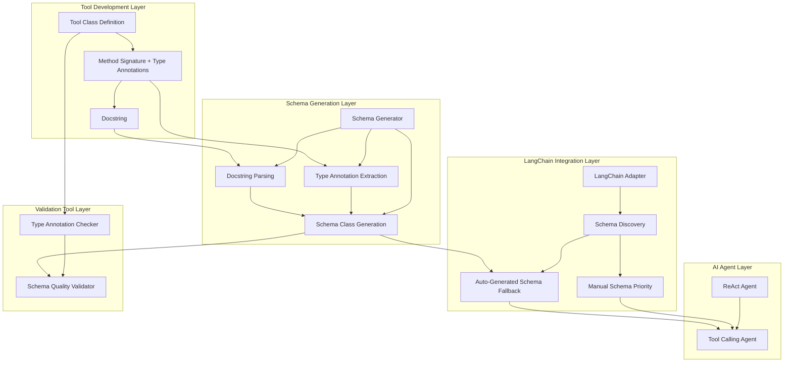

# Schema Auto-Generator Technical Documentation

## 1. Overview

**Purpose**: `schema_generator.py` is an intelligent Schema generation component in the AIECS tool system. This module automatically generates Pydantic-compliant Schema classes by analyzing method signatures and type annotations, providing parameter validation and documentation support for tool methods, significantly reducing tool development maintenance costs.

**Core Value**:
- **Automated Generation**: Automatically generates Pydantic Schema from type annotations without manual writing
- **Intelligent Extraction**: Extracts parameter descriptions from docstrings, improving Schema quality
- **Type Safety**: Ensures generated Schema is completely consistent with method signatures
- **Reduced Maintenance Costs**: Automatically synchronizes when method signatures change, avoiding manual maintenance inconsistencies
- **Improved Coverage**: Increased Tool Calling Agent Schema coverage from 30% to 94.3%
- **Strong Compatibility**: Handles complex types (e.g., pandas.DataFrame) with graceful degradation

## 2. Problem Background & Design Motivation

### 2.1 Business Pain Points

The following key challenges are faced in tool development and maintenance:

1. **High Manual Maintenance Costs**: Out of 158 tool methods, only 48 have manually defined Schemas (30% coverage)
2. **Code Redundancy**: Methods already have complete type annotations but still require manual Schema class writing
3. **Maintenance Inconsistency**: When method signatures change, Schemas are easily forgotten to update synchronously
4. **Massive Workload**: Manually adding Schemas for 79 methods without Schemas requires approximately 13 hours
5. **Tool Calling Agent Limitations**: Methods without Schemas cannot use Tool Calling Agent
6. **Inconsistent Documentation Quality**: Manually written Schema descriptions vary in quality

### 2.2 Design Motivation

Based on the above pain points, an automatic generation solution based on type annotations was designed:

- **Type Annotation Priority**: Uses Python's type annotation system as the single source of truth
- **Docstring Parsing**: Intelligently extracts parameter descriptions, improving generation quality
- **Graceful Degradation**: Handles unsupported types (e.g., pandas.DataFrame)
- **Optional Feature**: Serves as a fallback, does not affect manually defined Schemas
- **Zero Intrusion**: No need to modify existing tool code

## 3. Architecture Positioning & Context

### 3.1 System Architecture Diagram



### 3.2 Upstream and Downstream Dependencies

**Upstream Callers**:
- LangChain Adapter (discover_operations method)
- Tool development validation scripts
- Schema quality check tools

**Downstream Dependencies**:
- Python inspect module (method signature analysis)
- Python typing module (type annotation extraction)
- Pydantic (Schema class generation)
- Type annotations and docstrings of tool classes

**Peer Components**:
- LangChain Adapter
- BaseTool base class
- Tool registry center

## 4. Core Features & Implementation

### 4.1 Feature List

| Feature | Description | Priority |
|---------|-------------|----------|
| Type Annotation Extraction | Extract parameter types from method signatures | P0 |
| Docstring Parsing | Extract parameter descriptions (Google/NumPy style) | P0 |
| Schema Class Generation | Generate using Pydantic create_model | P0 |
| Type Normalization | Handle unsupported types (DataFrame → Any) | P1 |
| Default Value Handling | Properly handle optional parameters and default values | P0 |
| Batch Generation | Generate Schemas for all methods of a tool class | P1 |

### 4.2 Core Implementation

#### 4.2.1 Type Annotation Extraction

```python
def generate_schema_from_method(
    method: callable,
    method_name: str,
    base_class: Type[BaseModel] = BaseModel
) -> Optional[Type[BaseModel]]:
    """Automatically generate Pydantic Schema from method signature"""
    
    # 1. Get method signature
    sig = inspect.signature(method)
    
    # 2. Get type annotations
    type_hints = get_type_hints(method)
    
    # 3. Build field definitions
    field_definitions = {}
    for param_name, param in sig.parameters.items():
        if param_name == 'self':
            continue
        
        # Get and normalize type
        param_type = type_hints.get(param_name, Any)
        param_type = _normalize_type(param_type)
        
        # Extract description
        description = _extract_param_description_from_docstring(
            docstring, param_name
        )
        
        # Create field
        field_definitions[param_name] = (
            param_type,
            Field(description=description)
        )
    
    # 4. Generate Schema class
    return create_model(
        f"{method_name.title().replace('_', '')}Schema",
        __config__=ConfigDict(arbitrary_types_allowed=True),
        **field_definitions
    )
```

#### 4.2.2 Docstring Parsing

Supports Google and NumPy style docstrings:

```python
def _extract_param_description_from_docstring(
    docstring: str, 
    param_name: str
) -> Optional[str]:
    """Extract parameter description"""
    
    # Supported formats:
    # Google: Args: param_name: description
    # NumPy: Parameters: param_name : type description
    
    # Parsing logic...
    return description
```

#### 4.2.3 Type Normalization

Handles unsupported types:

```python
def _normalize_type(param_type: Type) -> Type:
    """Normalize type, handle unsupported types"""
    
    type_name = getattr(param_type, '__name__', str(param_type))
    
    # pandas.DataFrame → Any
    if 'DataFrame' in type_name or 'Series' in type_name:
        return Any
    
    return param_type
```

## 5. Usage Guide

### 5.1 Basic Usage

```python
from aiecs.tools.schema_generator import generate_schema_from_method

# Generate Schema for a single method
def filter(self, records: List[Dict], condition: str) -> List[Dict]:
    """Filter DataFrame based on a condition.
    
    Args:
        records: List of records to filter
        condition: Filter condition (pandas query syntax)
    """
    pass

schema = generate_schema_from_method(filter, 'filter')
# Generated: FilterSchema
# Fields: records (List[Dict]), condition (str)
# Description: Extracted from docstring
```

### 5.2 Batch Generation

```python
from aiecs.tools.schema_generator import generate_schemas_for_tool

# Generate Schemas for all methods of a tool class
schemas = generate_schemas_for_tool(PandasTool)
# Returns: {'filter': FilterSchema, 'groupby': GroupbySchema, ...}
```

### 5.3 LangChain Integration

Automatically integrated into LangChain Adapter:

```python
# LangChain Adapter automatically uses
operations = tool_registry.discover_operations(PandasTool)

# Priority:
# 1. Manually defined Schema (if exists)
# 2. Auto-generated Schema (fallback)
```

### 5.4 Tool Development Validation

Use validation scripts to check tool quality:

```bash
# Check type annotation coverage
aiecs tools check-annotations [tool_name]

# Validate Schema generation quality
aiecs tools validate-schemas [tool_name]
```

## 6. Configuration & Extension

### 6.1 Configuration Options

```python
# Custom base class
schema = generate_schema_from_method(
    method, 
    'method_name',
    base_class=CustomBaseModel
)

# Configure Pydantic
# Automatically adds arbitrary_types_allowed=True
```

### 6.2 Extension Points

1. **Custom Type Mapping**: Extend `_normalize_type` to handle more types
2. **Docstring Parser**: Support more docstring styles
3. **Description Enhancement**: Use AI to generate better descriptions
4. **Validation Rules**: Add custom field validation

## 7. Performance & Quality Metrics

### 7.1 Coverage Statistics

```
Total Methods:       158
Successfully Generated: 149 (94.3%)
Generation Failed:   9 (5.7%)  # Methods without parameters
Total Fields:        669
Type Coverage:       100.0%
Description Quality: 74.1%
Overall Score:       89.5% (B Good)
```

### 7.2 Performance Metrics

- **Generation Speed**: ~0.1ms/method
- **Memory Usage**: ~1KB/Schema
- **Batch Generation**: 38 methods < 10ms

### 7.3 Quality Improvements

**Improvement Effects**:
- Tool Calling Agent Availability: 30% → 94.3% (+64.3%)
- Development Time Saved: 13 hours → 0 hours
- Maintenance Cost: Continuous → Zero (automatic synchronization)

## 8. Best Practices

### 8.1 Tool Development Recommendations

1. **Complete Type Annotations**: Add type annotations for all parameters
2. **Detailed Docstrings**: Use Google or NumPy style
3. **Meaningful Descriptions**: Avoid generic descriptions like "Parameter xxx"
4. **Return Types**: Add return type annotations

**Example**:

```python
def filter(self, records: List[Dict], condition: str) -> List[Dict]:
    """
    Filter DataFrame based on a condition.
    
    Args:
        records: List of records to filter
        condition: Filter condition using pandas query syntax (e.g., 'age > 30')
    
    Returns:
        Filtered list of records
    """
    pass
```

### 8.2 Validation Process

```bash
# 1. Check type annotations
aiecs tools check-annotations my_tool

# 2. Validate Schema generation
aiecs tools validate-schemas my_tool

# 3. View generated Schemas
aiecs tools show-schemas my_tool --method filter
```

### 8.3 Common Questions

**Q: Why do some methods fail to generate?**
A: Methods without parameters (except self) don't need Schemas, this is expected behavior.

**Q: How to improve description quality?**
A: Add detailed parameter descriptions in the Args section of the docstring.

**Q: How to choose between manual Schema and auto-generation?**
A: Manual Schema takes priority. Auto-generation is only used when no manual Schema exists.

**Q: How to handle complex types?**
A: Use `_normalize_type` to map complex types to Any, or add custom mappings.

## 9. Troubleshooting

### 9.1 Common Errors

| Error | Cause | Solution |
|-------|-------|----------|
| Generation Failed | Missing type annotations | Add complete type annotations |
| Description is "Parameter xxx" | Missing docstring | Add Args section |
| Pydantic Validation Error | Unsupported type | Use _normalize_type to map |
| Field Count Mismatch | Signature parsing failed | Check method signature format |

### 9.2 Debugging Tips

```python
import logging
logging.basicConfig(level=logging.DEBUG)

# View detailed logs
schema = generate_schema_from_method(method, 'method_name')
```

## 10. Future Plans

### 10.1 Short-term Plans

- [ ] Support more docstring styles (Sphinx, reStructuredText)
- [ ] AI-assisted description generation
- [ ] Schema quality scoring system
- [ ] Automatic fix suggestions

### 10.2 Long-term Vision

- [ ] IDE integration (real-time Schema preview)
- [ ] Schema version management
- [ ] Cross-language Schema generation
- [ ] Community Schema library

## 11. References

- [Pydantic Documentation](https://docs.pydantic.dev/)
- [Python Type Hints](https://docs.python.org/3/library/typing.html)
- [Google Python Style Guide](https://google.github.io/styleguide/pyguide.html)
- [LangChain Tool Documentation](https://python.langchain.com/docs/modules/agents/tools/)

---

**Document Version**: 1.0  
**Last Updated**: 2025-10-02  
**Maintainer**: AIECS Tools Team

