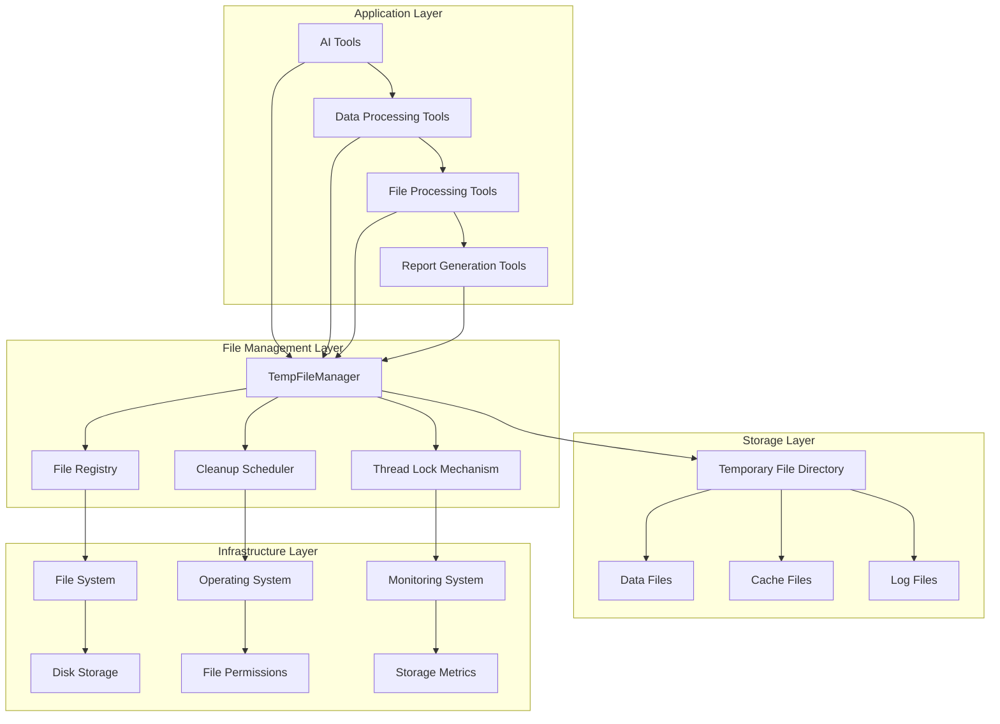
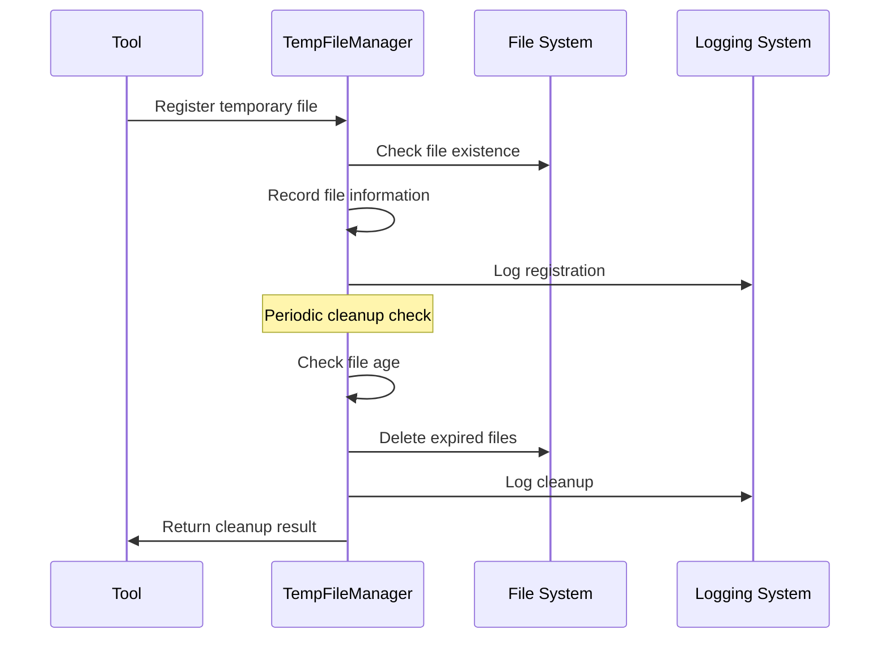
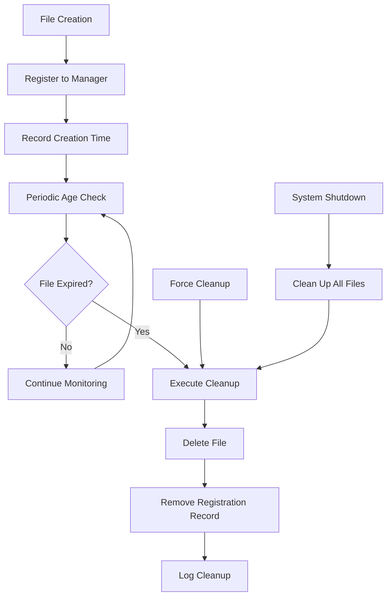
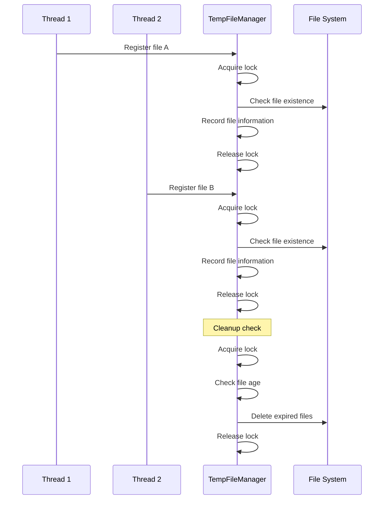
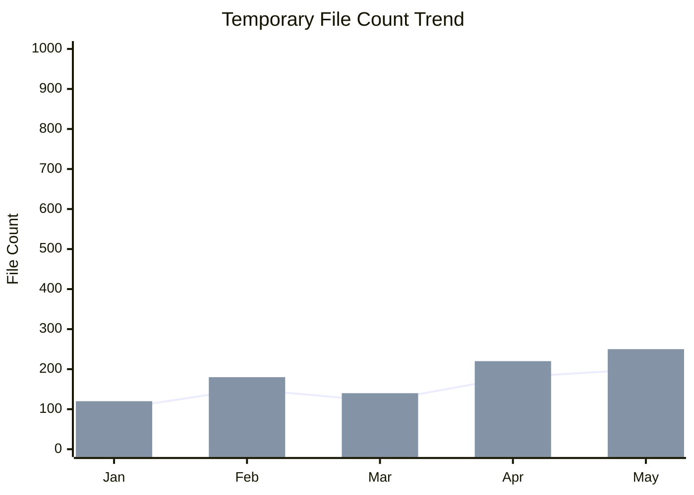

# Temporary File Manager Technical Documentation

## 1. Overview

**Purpose**: `TempFileManager` is a core component in the AIECS system responsible for managing the lifecycle of temporary files. This module solves critical issues in temporary file management such as storage leaks, concurrent access conflicts, and resource waste through time-based automatic cleanup mechanisms and thread-safe design, providing reliable file resource management infrastructure for the entire system.

**Core Value**:
- **Automatic Cleanup**: Intelligent cleanup mechanism based on file age, preventing storage space leaks
- **Thread Safety**: Uses lock mechanisms to ensure safe operations in multi-threaded environments
- **Resource Optimization**: Timely release of temporary files that are no longer needed, optimizing storage usage
- **Simple and Easy to Use**: Provides concise API interfaces, reducing usage complexity
- **Observability**: Complete logging and state tracking functionality

## 2. Problem Background & Design Motivation

### 2.1 Business Pain Points

The following key challenges are faced in AI application development:

1. **Storage Leak Issues**: Temporary files are created but forgotten to clean up, causing continuous disk space growth
2. **Concurrent Access Conflicts**: Simultaneous operations on file registry in multi-threaded environments lead to data inconsistency
3. **Complex Resource Management**: Manual management of temporary file lifecycles is error-prone
4. **Performance Impact**: Large numbers of temporary files affect file system performance
5. **Debugging Difficulties**: Lack of tracking mechanisms for file creation and cleanup
6. **Security Risks**: Sensitive data may remain in temporary files

### 2.2 Design Motivation

Based on the above pain points, a time-driven temporary file management solution was designed:

- **Automated Management**: Automatically triggers cleanup through time thresholds, reducing manual intervention
- **Thread-Safe Design**: Uses lock mechanisms to ensure data consistency in concurrent environments
- **Resource Isolation**: Centralizes temporary file management for easier monitoring and cleanup
- **Configurability**: Supports custom cleanup strategies and storage paths
- **Fault Tolerance**: Retains file records when cleanup fails, supporting retry mechanisms

## 3. Architecture Positioning & Context

### 3.1 System Architecture Diagram



### 3.2 Upstream and Downstream Dependencies

**Upstream Callers**:
- AI tool classes (chart tools, data processing tools, etc.)
- File processing services
- Report generation services
- Cache management systems

**Downstream Dependencies**:
- Operating system file system
- Python standard library (os, time, threading)
- Logging system

**Peer Components**:
- Configuration management system
- Monitoring and metrics collection
- Error handling mechanism

### 3.3 Data Flow



## 4. Core Features & Use Cases

### 4.1 File Registration and Tracking

**Feature Description**: Register temporary files with the manager, record creation time, and track file status.

**Core Features**:
- Automatic path normalization
- File existence validation
- Thread-safe registration
- Detailed logging

**Usage Scenarios**:
```python
from aiecs.tools.temp_file_manager import TempFileManager
import tempfile
import os

# Create temporary file manager
temp_manager = TempFileManager(
    base_dir="/tmp/aiecs_temp",
    max_age=3600  # Clean up after 1 hour
)

# Create temporary file
with tempfile.NamedTemporaryFile(mode='w', suffix='.json', delete=False) as f:
    f.write('{"data": "temporary content"}')
    temp_file_path = f.name

# Register temporary file
temp_manager.register_file(temp_file_path)
print(f"File registered: {temp_file_path}")

# Check if file is being managed
if temp_manager.is_temp_file(temp_file_path):
    print("File is being managed")
    age = temp_manager.get_file_age(temp_file_path)
    print(f"File age: {age:.2f} seconds")
```

**Real-world Application Cases**:
- **Data Processing Tools**: Register intermediate processing result files
- **Chart Generation Tools**: Manage generated image files
- **Report Tools**: Track temporary report files
- **Cache Systems**: Manage cache data files

### 4.2 Automatic Cleanup Mechanism

**Feature Description**: Automatically cleans up expired temporary files based on file age, preventing storage space leaks.

**Core Features**:
- Time-based cleanup strategy
- Force cleanup option
- Batch cleanup operations
- Error handling and retry

**Usage Scenarios**:
```python
import time
from aiecs.tools.temp_file_manager import TempFileManager

# Create short-term temporary file manager
short_term_manager = TempFileManager(
    base_dir="/tmp/short_term",
    max_age=300  # Clean up after 5 minutes
)

# Create multiple temporary files
temp_files = []
for i in range(5):
    with tempfile.NamedTemporaryFile(mode='w', suffix=f'_{i}.txt', delete=False) as f:
        f.write(f"Temporary content {i}")
        temp_files.append(f.name)
        short_term_manager.register_file(f.name)

print(f"Registered {len(temp_files)} temporary files")

# Wait for files to expire
print("Waiting for files to expire...")
time.sleep(310)  # Wait more than 5 minutes

# Execute cleanup
removed_count = short_term_manager.cleanup()
print(f"Cleaned up {removed_count} expired files")

# Force cleanup all files
remaining_count = short_term_manager.clear_all()
print(f"Force cleaned {remaining_count} remaining files")
```

**Real-world Application Cases**:
- **Scheduled Cleanup Tasks**: Regularly clean up expired temporary files
- **Memory Pressure Handling**: Force cleanup when memory is insufficient
- **System Maintenance**: Clean up all temporary files during system maintenance
- **Storage Monitoring**: Trigger cleanup when storage usage is too high

### 4.3 File Status Query

**Feature Description**: Provides file age query and status check functionality, supporting file lifecycle monitoring.

**Core Features**:
- File age calculation
- Registration status check
- Relative path support
- Real-time status updates

**Usage Scenarios**:
```python
from aiecs.tools.temp_file_manager import TempFileManager
import tempfile
import time

# Create file manager
manager = TempFileManager("/tmp/query_test", max_age=1800)

# Create and register file
with tempfile.NamedTemporaryFile(mode='w', suffix='.log', delete=False) as f:
    f.write("Log content")
    log_file = f.name

manager.register_file(log_file)

# Query file status
print(f"Is file managed: {manager.is_temp_file(log_file)}")
print(f"File age: {manager.get_file_age(log_file):.2f} seconds")

# Query again after waiting
time.sleep(10)
print(f"File age after 10 seconds: {manager.get_file_age(log_file):.2f} seconds")

# Check if file is approaching expiration
age = manager.get_file_age(log_file)
if age > manager.max_age * 0.8:  # Exceeded 80% of lifetime
    print("File is about to expire, recommend processing early")
```

**Real-world Application Cases**:
- **File Monitoring**: Monitor temporary file lifecycles
- **Performance Optimization**: Optimize processing strategies based on file age
- **Debugging Support**: View file status during debugging
- **Resource Planning**: Plan storage resources based on file usage

### 4.4 Batch Operation Support

**Feature Description**: Supports batch registration, querying, and cleanup of temporary files, improving operation efficiency.

**Core Features**:
- Batch file registration
- Batch status querying
- Batch cleanup operations
- Operation result statistics

**Usage Scenarios**:
```python
from aiecs.tools.temp_file_manager import TempFileManager
import tempfile
import os

# Create file manager
manager = TempFileManager("/tmp/batch_test", max_age=600)

# Batch create and register files
file_paths = []
for i in range(10):
    with tempfile.NamedTemporaryFile(mode='w', suffix=f'_batch_{i}.txt', delete=False) as f:
        f.write(f"Batch content {i}")
        file_paths.append(f.name)
        manager.register_file(f.name)

print(f"Batch registered {len(file_paths)} files")

# Batch check file status
managed_files = []
for file_path in file_paths:
    if manager.is_temp_file(file_path):
        age = manager.get_file_age(file_path)
        managed_files.append((file_path, age))
        print(f"File {os.path.basename(file_path)}: {age:.2f} seconds")

print(f"Number of files being managed: {len(managed_files)}")

# Batch cleanup
removed_count = manager.cleanup()
print(f"Batch cleaned {removed_count} files")
```

**Real-world Application Cases**:
- **Batch Data Processing**: Process large numbers of temporary data files
- **System Initialization**: Batch clean up old files at system startup
- **Storage Maintenance**: Regularly batch clean up storage space
- **Test Environment**: Batch clean up test files after testing

## 5. API Reference

### 5.1 TempFileManager Class

#### Constructor
```python
def __init__(self, base_dir: str, max_age: int = 3600)
```

**Parameters**:
- `base_dir` (str, required): Base directory path for temporary files
- `max_age` (int, optional): Maximum lifetime of temporary files (seconds), default is 3600 (1 hour)

**Exceptions**:
- `OSError`: If base directory cannot be created

#### Core Methods

##### register_file
```python
def register_file(self, file_path: str) -> None
```

**Function**: Register temporary file and record creation time
**Parameters**:
- `file_path` (str, required): File path to register

**Behavior**:
- Automatically converts to absolute path
- Validates file existence
- Thread-safely records file information
- Logs debug information

##### cleanup
```python
def cleanup(self, force: bool = False) -> int
```

**Function**: Clean up expired temporary files
**Parameters**:
- `force` (bool, optional): Whether to force cleanup all files, default is False

**Returns**:
- `int`: Number of files cleaned up

**Behavior**:
- Decides whether to clean up based on file age
- Thread-safely executes cleanup operations
- Logs cleanup results
- Retains file records when cleanup fails

##### get_file_age
```python
def get_file_age(self, file_path: str) -> Optional[float]
```

**Function**: Get age of registered file
**Parameters**:
- `file_path` (str, required): File path

**Returns**:
- `Optional[float]`: File age (seconds), returns None if file is not registered

**Behavior**:
- Automatically converts to absolute path
- Calculates difference between file registration time and current time
- Returns precise age value

##### is_temp_file
```python
def is_temp_file(self, file_path: str) -> bool
```

**Function**: Check if file is registered as temporary file
**Parameters**:
- `file_path` (str, required): File path

**Returns**:
- `bool`: Returns True if file is registered, otherwise False

**Behavior**:
- Automatically converts to absolute path
- Checks if file is in registry
- Does not validate if file actually exists

##### clear_all
```python
def clear_all(self) -> int
```

**Function**: Clean up all registered temporary files
**Returns**:
- `int`: Number of files cleaned up

**Behavior**:
- Equivalent to `cleanup(force=True)`
- Cleans up all registered files
- Returns number of files cleaned up

### 5.2 Attributes

#### base_dir
```python
base_dir: str
```
**Type**: str
**Description**: Base directory path for temporary files

#### max_age
```python
max_age: int
```
**Type**: int
**Description**: Maximum lifetime of temporary files (seconds)

#### files
```python
files: Dict[str, float]
```
**Type**: Dict[str, float]
**Description**: Dictionary mapping file paths to creation times

#### lock
```python
lock: Lock
```
**Type**: threading.Lock
**Description**: Lock object for thread-safe operations

## 6. Technical Implementation Details

### 6.1 Thread Safety Mechanism

**Lock Design**:
```python
def __init__(self, base_dir: str, max_age: int = 3600):
    self.lock = Lock()  # Create thread lock

def register_file(self, file_path: str) -> None:
    with self.lock:  # Use context manager to ensure proper lock release
        self.files[abs_path] = time.time()
```

**Concurrency Control Strategy**:
- Use `threading.Lock` to protect shared data structures
- All modification operations are performed under lock protection
- Use context manager to ensure proper lock release
- Design patterns to avoid deadlocks

### 6.2 Path Processing Mechanism

**Path Normalization**:
```python
def register_file(self, file_path: str) -> None:
    abs_path = os.path.abspath(file_path)  # Convert to absolute path
    if not os.path.isfile(abs_path):      # Validate file existence
        logger.warning(f"Attempted to register non-existent file: {abs_path}")
        return
```

**Path Processing Features**:
- Automatically converts to absolute path to avoid duplicate registration
- File existence validation prevents invalid registration
- Unified path format for easier management
- Supports both relative and absolute path input

### 6.3 Time Management Strategy

**Timestamp Recording**:
```python
def register_file(self, file_path: str) -> None:
    with self.lock:
        self.files[abs_path] = time.time()  # Record current timestamp
```

**Age Calculation**:
```python
def get_file_age(self, file_path: str) -> Optional[float]:
    abs_path = os.path.abspath(file_path)
    if abs_path in self.files:
        return time.time() - self.files[abs_path]  # Calculate age
    return None
```

**Time Management Features**:
- Uses `time.time()` to get high-precision timestamps
- Real-time file age calculation
- Supports millisecond-level time precision
- Automatically handles timezone issues

### 6.4 Error Handling Mechanism

**Layered Error Handling**:
```python
def cleanup(self, force: bool = False) -> int:
    for file_path in files_to_remove:
        try:
            if os.path.exists(file_path):
                os.remove(file_path)
                logger.debug(f"Removed temporary file: {file_path}")
            del self.files[file_path]
        except Exception as e:
            logger.error(f"Failed to remove temporary file {file_path}: {e}")
            # Retain file record for retry
```

**Error Handling Strategy**:
- Retains records when file deletion fails
- Detailed error logging
- Single file errors do not affect overall cleanup
- Supports subsequent retry mechanisms

### 6.5 Memory Management

**Data Structure Design**:
```python
self.files: Dict[str, float] = {}  # Lightweight dictionary storage
```

**Memory Optimization Strategy**:
- Only stores necessary file paths and timestamps
- Timely cleanup of records for deleted files
- Avoids storing file content to reduce memory usage
- Uses efficient data structures

## 7. Configuration & Deployment

### 7.1 Environment Variable Configuration

**Basic Configuration**:
```bash
# Temporary file configuration
TEMP_FILE_BASE_DIR=/tmp/aiecs_temp
TEMP_FILE_MAX_AGE=3600
TEMP_FILE_CLEANUP_INTERVAL=300

# Logging configuration
LOG_LEVEL=INFO
LOG_FORMAT=json
LOG_FILE=/var/log/aiecs/temp_file_manager.log

# Storage configuration
MAX_TEMP_FILES=10000
TEMP_FILE_SIZE_LIMIT=104857600  # 100MB
```

**Advanced Configuration**:
```bash
# Performance configuration
TEMP_FILE_CLEANUP_BATCH_SIZE=100
TEMP_FILE_CLEANUP_THREADS=4
TEMP_FILE_CLEANUP_TIMEOUT=30

# Security configuration
TEMP_FILE_SECURE_DELETE=true
TEMP_FILE_PERMISSION_MASK=0600
TEMP_FILE_OWNER_CHECK=true

# Monitoring configuration
ENABLE_TEMP_FILE_METRICS=true
METRICS_BACKEND=prometheus
PROMETHEUS_PORT=9090
```

### 7.2 Dependency Management

**Core Dependencies**:
```python
# requirements.txt
# Uses Python standard library, no additional dependencies needed
```

**Optional Dependencies**:
```python
# requirements-optional.txt
psutil>=5.9.0  # System resource monitoring
watchdog>=2.1.0  # File system monitoring
```

**Development Dependencies**:
```python
# requirements-dev.txt
pytest>=7.0.0
pytest-mock>=3.10.0
pytest-cov>=4.0.0
black>=23.0.0
mypy>=1.0.0
```

### 7.3 Deployment Configuration

**Docker Configuration**:
```dockerfile
FROM python:3.9-slim

WORKDIR /app
COPY requirements.txt .
RUN pip install -r requirements.txt

# Create temporary file directory
RUN mkdir -p /tmp/aiecs_temp && chmod 755 /tmp/aiecs_temp

COPY . .
CMD ["python", "-m", "aiecs.tools.temp_file_manager"]
```

**Kubernetes Configuration**:
```yaml
apiVersion: apps/v1
kind: Deployment
metadata:
  name: temp-file-manager
spec:
  replicas: 1
  selector:
    matchLabels:
      app: temp-file-manager
  template:
    metadata:
      labels:
        app: temp-file-manager
    spec:
      containers:
      - name: temp-file-manager
        image: aiecs/temp-file-manager:latest
        env:
        - name: TEMP_FILE_BASE_DIR
          value: "/tmp/aiecs_temp"
        - name: TEMP_FILE_MAX_AGE
          value: "3600"
        volumeMounts:
        - name: temp-storage
          mountPath: /tmp/aiecs_temp
        resources:
          requests:
            memory: "128Mi"
            cpu: "100m"
          limits:
            memory: "256Mi"
            cpu: "200m"
      volumes:
      - name: temp-storage
        emptyDir: {}
```

### 7.4 Monitoring Configuration

**Prometheus Metrics**:
```python
from prometheus_client import Counter, Histogram, Gauge

# Define monitoring metrics
temp_files_registered = Counter('temp_files_registered_total', 'Total registered temporary files')
temp_files_cleaned = Counter('temp_files_cleaned_total', 'Total cleaned temporary files')
temp_files_active = Gauge('temp_files_active', 'Currently active temporary files')
temp_file_age = Histogram('temp_file_age_seconds', 'Age of temporary files when cleaned')
cleanup_duration = Histogram('temp_file_cleanup_duration_seconds', 'Time spent on cleanup operations')
```

**Health Check**:
```python
def health_check():
    """Check temporary file manager health status"""
    try:
        # Check base directory
        if not os.path.exists(manager.base_dir):
            return {"status": "unhealthy", "error": "Base directory not accessible"}
        
        # Check file count
        active_files = len(manager.files)
        if active_files > MAX_TEMP_FILES:
            return {"status": "degraded", "warning": f"Too many temp files: {active_files}"}
        
        return {
            "status": "healthy",
            "active_files": active_files,
            "base_dir": manager.base_dir,
            "max_age": manager.max_age,
            "timestamp": time.time()
        }
    except Exception as e:
        return {
            "status": "unhealthy",
            "error": str(e),
            "timestamp": time.time()
        }
```

## 8. Maintenance & Troubleshooting

### 8.1 Monitoring Metrics

**Key Metrics**:
- Number of registered temporary files
- Number of cleaned files
- Average file age
- Cleanup operation duration
- Cleanup failure rate

**Monitoring Dashboard**:
```python
# Grafana query examples
# Temporary file count trend
temp_files_active

# Cleanup operation frequency
rate(temp_files_cleaned_total[5m])

# File age distribution
histogram_quantile(0.95, rate(temp_file_age_seconds_bucket[5m]))

# Cleanup operation duration
histogram_quantile(0.95, rate(cleanup_duration_seconds_bucket[5m]))
```

### 8.2 Common Issues and Solutions

#### 8.2.1 File Cleanup Failure

**Symptoms**:
- "Failed to remove temporary file" errors in logs
- Temporary file count continuously growing
- Insufficient disk space

**Troubleshooting Steps**:
1. Check file permissions: `ls -la /tmp/aiecs_temp/`
2. Check disk space: `df -h /tmp`
3. Check if file is in use: `lsof /tmp/aiecs_temp/filename`
4. View detailed error logs

**Solution**:
```python
# Check file permissions
import os
import stat

def check_file_permissions(file_path):
    try:
        file_stat = os.stat(file_path)
        permissions = stat.filemode(file_stat.st_mode)
        print(f"File permissions: {permissions}")
        
        # Try to modify permissions
        os.chmod(file_path, 0o666)
        return True
    except Exception as e:
        print(f"Permission check failed: {e}")
        return False

# Force cleanup
def force_cleanup_with_retry(manager, max_retries=3):
    for attempt in range(max_retries):
        try:
            removed_count = manager.cleanup(force=True)
            print(f"Successfully cleaned {removed_count} files")
            break
        except Exception as e:
            print(f"Cleanup attempt {attempt + 1} failed: {e}")
            if attempt == max_retries - 1:
                print("All cleanup attempts failed")
```

#### 8.2.2 High Memory Usage

**Symptoms**:
- Process memory usage continuously growing
- System response slowing down
- Out of memory errors

**Troubleshooting Steps**:
1. Check file registry size: `len(manager.files)`
2. Monitor memory usage: `ps aux | grep python`
3. Analyze file path lengths
4. Check for memory leaks

**Solution**:
```python
# Memory usage analysis
import psutil
import sys

def analyze_memory_usage(manager):
    process = psutil.Process()
    memory_info = process.memory_info()
    
    print(f"Process memory usage: {memory_info.rss / 1024 / 1024:.2f} MB")
    print(f"Registered file count: {len(manager.files)}")
    
    # Calculate memory used by file paths
    total_path_length = sum(len(path) for path in manager.files.keys())
    print(f"Total file path length: {total_path_length} characters")
    
    # Clean up file records that haven't been used for a long time
    current_time = time.time()
    old_files = [
        path for path, creation_time in manager.files.items()
        if current_time - creation_time > manager.max_age * 2
    ]
    
    for path in old_files:
        del manager.files[path]
    
    print(f"Cleaned up {len(old_files)} expired file records")
```

#### 8.2.3 Concurrent Access Issues

**Symptoms**:
- File registry data inconsistency
- Incomplete cleanup operations
- Thread safety issues

**Troubleshooting Steps**:
1. Check lock usage
2. Analyze concurrent access patterns
3. View thread safety logs
4. Test concurrent scenarios

**Solution**:
```python
# Concurrent testing
import threading
import time

def test_concurrent_access(manager, num_threads=10, files_per_thread=100):
    def worker(thread_id):
        for i in range(files_per_thread):
            file_path = f"/tmp/test_{thread_id}_{i}.txt"
            with open(file_path, 'w') as f:
                f.write(f"Test content {thread_id}_{i}")
            manager.register_file(file_path)
    
    threads = []
    for i in range(num_threads):
        thread = threading.Thread(target=worker, args=(i,))
        threads.append(thread)
        thread.start()
    
    for thread in threads:
        thread.join()
    
    print(f"Concurrent test completed, registered files: {len(manager.files)}")
    
    # Verify data consistency
    expected_files = num_threads * files_per_thread
    if len(manager.files) != expected_files:
        print(f"Warning: File count mismatch, expected {expected_files}, actual {len(manager.files)}")
```

### 8.3 Performance Optimization

**Batch Operation Optimization**:
```python
def batch_cleanup(manager, batch_size=100):
    """Batch cleanup optimization"""
    current_time = time.time()
    files_to_remove = []
    
    with manager.lock:
        for file_path, creation_time in list(manager.files.items()):
            if current_time - creation_time > manager.max_age:
                files_to_remove.append(file_path)
                if len(files_to_remove) >= batch_size:
                    break
    
    # Batch delete
    removed_count = 0
    for file_path in files_to_remove:
        try:
            if os.path.exists(file_path):
                os.remove(file_path)
            del manager.files[file_path]
            removed_count += 1
        except Exception as e:
            logger.error(f"Batch cleanup failed {file_path}: {e}")
    
    return removed_count
```

**Memory Optimization**:
```python
def optimize_memory_usage(manager):
    """Optimize memory usage"""
    # Clean up records for non-existent files
    existing_files = {}
    for file_path in list(manager.files.keys()):
        if os.path.exists(file_path):
            existing_files[file_path] = manager.files[file_path]
        else:
            logger.debug(f"Cleaning up record for non-existent file: {file_path}")
    
    manager.files = existing_files
    logger.info(f"Memory optimization completed, cleaned up {len(manager.files) - len(existing_files)} invalid records")
```

### 8.4 Log Analysis

**Log Configuration**:
```python
import logging

# Configure temporary file manager logger
temp_logger = logging.getLogger('aiecs.tools.temp_file_manager')
temp_logger.setLevel(logging.INFO)

# Add file handler
file_handler = logging.FileHandler('/var/log/aiecs/temp_file_manager.log')
file_handler.setFormatter(logging.Formatter(
    '%(asctime)s - %(name)s - %(levelname)s - %(message)s'
))
temp_logger.addHandler(file_handler)
```

**Key Log Patterns**:
```bash
# Find cleanup operation logs
grep "Cleaned up" /var/log/aiecs/temp_file_manager.log | tail -100

# Analyze cleanup failures
grep "Failed to remove" /var/log/aiecs/temp_file_manager.log | wc -l

# Monitor file registration
grep "Registered temporary file" /var/log/aiecs/temp_file_manager.log | tail -50
```

## 9. Visualizations

### 9.1 File Lifecycle Diagram



### 9.2 System Architecture Diagram


### 9.3 Concurrent Access Diagram



### 9.4 Performance Monitoring Diagram



## 10. Version History

### v1.0.0 (2024-01-15)
**New Features**:
- Implemented basic temporary file management functionality
- Supported file registration and tracking
- Added time-based automatic cleanup mechanism
- Implemented thread-safe operations

**Technical Features**:
- Dictionary-based file registry
- Uses threading.Lock to ensure thread safety
- Simple age calculation and cleanup logic

### v1.1.0 (2024-02-01)
**New Features**:
- Added file status query functionality
- Implemented batch operation support
- Enhanced error handling mechanism
- Added detailed logging

**Performance Optimizations**:
- Optimized path processing logic
- Improved memory usage efficiency
- Enhanced concurrent performance

### v1.2.0 (2024-03-01)
**New Features**:
- Added force cleanup functionality
- Implemented cleanup result statistics
- Supported configurable parameters
- Integrated monitoring and metrics collection

**Monitoring Enhancements**:
- Prometheus metrics integration
- Detailed performance analysis
- Health check interface

### v1.3.0 (2024-04-01) [Planned]
**Planned Features**:
- Add file size limits
- Implement intelligent cleanup strategies
- Support distributed file management
- Add file compression functionality

**Architecture Optimizations**:
- Plugin-based architecture
- Cloud-native integration
- Auto-scaling

---

## Appendix

### A. Related Documentation
- [BaseTool Documentation](./TOOLS_BASE_TOOL.md)
- [Tool Executor Documentation](./TOOLS_TOOL_EXECUTOR.md)
- [Resource Management](../DOMAIN_AGENT/RESOURCE_MANAGEMENT.md)

### B. Example Code
- [Complete Example Project](https://github.com/aiecs/examples)
- [Performance Test Scripts](https://github.com/aiecs/performance-tests)
- [Monitoring Configuration Templates](https://github.com/aiecs/monitoring-configs)

### C. Technical Support
- Technical Documentation: https://docs.aiecs.com
- Issue Reporting: https://github.com/aiecs/issues
- Community Discussion: https://discord.gg/aiecs
