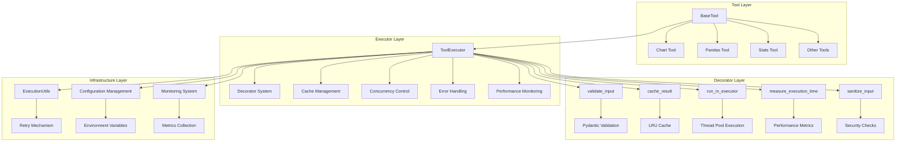
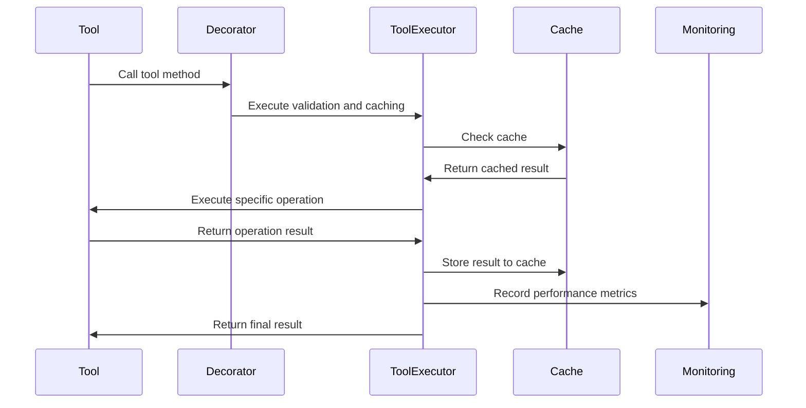
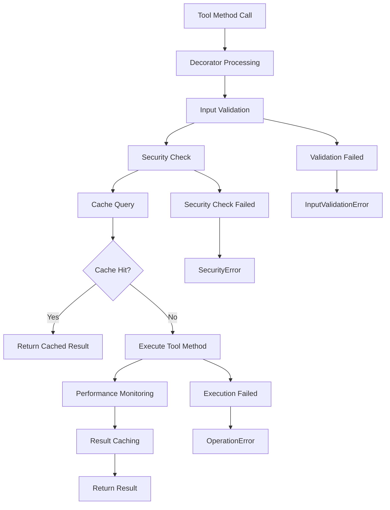
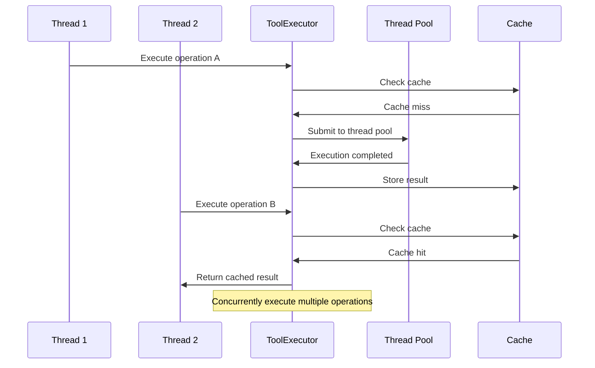
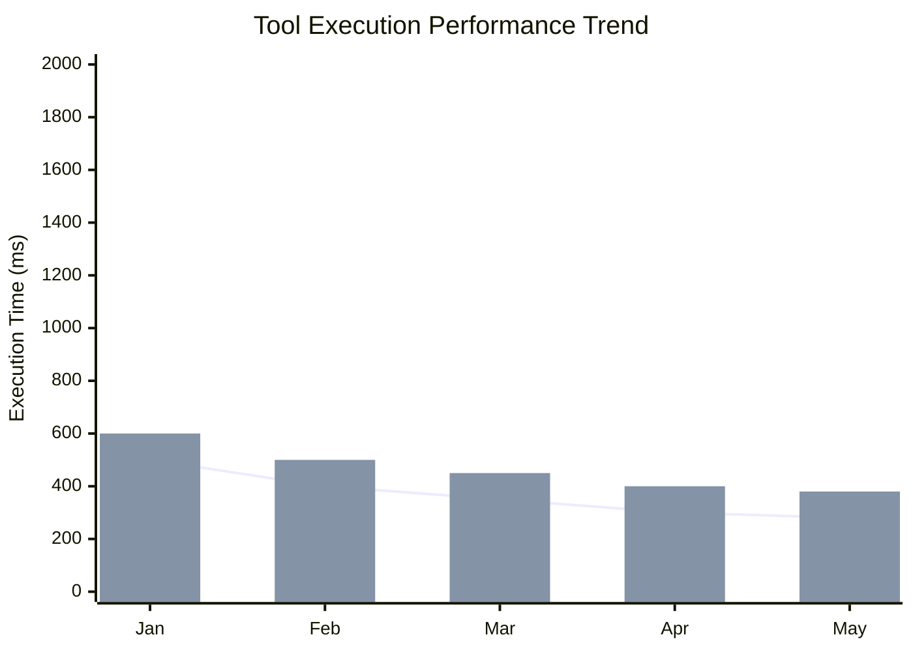

# Tool Executor Technical Documentation

## 1. Overview

**Purpose**: `ToolExecutor` is the core engine in the AIECS system responsible for executing tool operations, providing a unified tool execution framework and cross-cutting concern handling. This component solves issues in tool development such as code duplication, performance bottlenecks, security risks, and maintainability problems through decorator patterns, caching mechanisms, concurrency control, and error handling, providing reliable infrastructure for the entire tool ecosystem.

**Core Value**:
- **Unified Execution Framework**: Provides standardized tool operation execution interfaces
- **Performance Optimization**: Integrates intelligent caching and concurrency control mechanisms
- **Security Protection**: Built-in input validation and security check mechanisms
- **Observability**: Complete metrics collection and logging
- **High Availability**: Retry mechanisms and timeout control ensure system stability

## 2. Problem Background & Design Motivation

### 2.1 Business Pain Points

The following key challenges are faced in tool system development:

1. **Code Duplication Issues**: Each tool needs to implement common logic like caching, validation, and error handling
2. **Performance Bottlenecks**: Lack of unified performance optimization strategies, low tool execution efficiency
3. **Security Risks**: Lack of unified input validation and security check mechanisms
4. **Concurrency Issues**: Resource contention and deadlock risks in multi-threaded environments
5. **Poor Maintainability**: Common logic scattered across tools, difficult to maintain uniformly
6. **Missing Monitoring**: Lack of unified performance monitoring and error tracking mechanisms

### 2.2 Design Motivation

Based on the above pain points, a unified framework based on the executor pattern was designed:

- **Separation of Cross-Cutting Concerns**: Abstracts common logic into decorators and executors
- **Performance-First Design**: Integrates caching, concurrency control, and performance monitoring
- **Security-First Strategy**: Built-in multi-layer security checks and input validation
- **Observability-Oriented**: Provides complete metrics collection and logging
- **High Availability Guarantee**: Retry mechanisms and timeout control ensure system stability

## 3. Architecture Positioning & Context

### 3.1 System Architecture Diagram



### 3.2 Upstream and Downstream Dependencies

**Upstream Callers**:
- BaseTool and its subclasses
- Tool registry center
- AI agent systems
- Task executors

**Downstream Dependencies**:
- ExecutionUtils (execution utility classes)
- Pydantic (data validation)
- cachetools (cache management)
- ThreadPoolExecutor (concurrency control)
- Logging and monitoring systems

**Peer Components**:
- Configuration management system
- Security module
- Monitoring and metrics collection

### 3.3 Data Flow



## 4. Core Features & Use Cases

### 4.1 Decorator System

**Feature Description**: Implements separation of cross-cutting concerns through decorator patterns, providing input validation, caching, concurrency control, and other functionalities.

**Core Features**:
- Input validation decorator
- Result caching decorator
- Concurrent execution decorator
- Performance monitoring decorator
- Security check decorator

**Usage Scenarios**:
```python
from aiecs.tools.tool_executor import (
    validate_input, cache_result, run_in_executor,
    measure_execution_time, sanitize_input
)
from aiecs.tools.base_tool import BaseTool
from pydantic import BaseModel
import time

class DataTool(BaseTool):
    class ProcessSchema(BaseModel):
        data: str
        algorithm: str = "default"
        user_id: str
        task_id: str

    @validate_input(ProcessSchema)
    @cache_result(ttl=3600)
    @run_in_executor
    @measure_execution_time
    @sanitize_input
    def process_data(self, data: str, algorithm: str = "default", user_id: str = "", task_id: str = ""):
        """Process data and apply decorator functionality"""
        # Simulate complex data processing
        time.sleep(2)
        return f"Processed {data} with {algorithm}"

# Usage example
tool = DataTool()
result = tool.process_data(
    data="test data",
    algorithm="advanced",
    user_id="user_123",
    task_id="task_456"
)
print(f"Processing result: {result}")
```

**Real-world Application Cases**:
- **Data Processing Tools**: Automatically validate input parameters and cache results
- **API Call Tools**: Automatic retry and timeout control
- **File Processing Tools**: Automatic security checks and performance monitoring
- **AI Inference Tools**: Automatic caching and concurrency optimization

### 4.2 Intelligent Caching System

**Feature Description**: Content-hash-based intelligent caching mechanism supporting TTL and LRU strategies, significantly improving tool execution performance.

**Core Features**:
- Content-aware cache key generation
- Configurable TTL and cache size
- User and task-level cache isolation
- Automatic cache invalidation and cleanup

**Usage Scenarios**:
```python
from aiecs.tools.tool_executor import ToolExecutor, cache_result
from aiecs.tools.base_tool import BaseTool
import time

class ExpensiveTool(BaseTool):
    @cache_result(ttl=1800)  # Cache for 30 minutes
    def expensive_calculation(self, n: int, user_id: str = "", task_id: str = ""):
        """Simulate expensive calculation operation"""
        print(f"Executing expensive calculation: n={n}")
        time.sleep(3)  # Simulate time-consuming operation
        return sum(i ** 2 for i in range(n))

# Create executor
executor = ToolExecutor({
    'enable_cache': True,
    'cache_size': 1000,
    'cache_ttl': 3600
})

tool = ExpensiveTool()
tool._executor = executor

# First call, will execute and cache
start = time.time()
result1 = tool.expensive_calculation(10000, user_id="user_123", task_id="task_456")
print(f"First call duration: {time.time() - start:.2f} seconds")

# Second call, returns from cache
start = time.time()
result2 = tool.expensive_calculation(10000, user_id="user_123", task_id="task_456")
print(f"Second call duration: {time.time() - start:.2f} seconds")
print(f"Results are same: {result1 == result2}")

# Calls with different user/task won't hit cache
result3 = tool.expensive_calculation(10000, user_id="user_456", task_id="task_789")
print(f"Different user call: {result3}")
```

**Real-world Application Cases**:
- **API Call Tools**: Cache external API responses
- **File Processing Tools**: Cache file processing results
- **AI Model Tools**: Cache model inference results
- **Data Query Tools**: Cache database query results

### 4.3 Concurrency Control Mechanism

**Feature Description**: Achieves efficient concurrent processing through thread pools and asynchronous execution mechanisms, improving system throughput.

**Core Features**:
- Dynamic thread pool management
- Asynchronous operation support
- Resource lock mechanism
- Batch operation processing

**Usage Scenarios**:
```python
import asyncio
from aiecs.tools.tool_executor import ToolExecutor, run_in_executor
from aiecs.tools.base_tool import BaseTool

class ConcurrencyTool(BaseTool):
    def sync_operation(self, data: str, user_id: str = "", task_id: str = ""):
        """Synchronous operation"""
        import time
        time.sleep(1)  # Simulate time-consuming operation
        return f"Sync processed: {data}"

    async def async_operation(self, data: str, user_id: str = "", task_id: str = ""):
        """Asynchronous operation"""
        await asyncio.sleep(1)  # Simulate async operation
        return f"Async processed: {data}"

# Create executor
executor = ToolExecutor({
    'max_workers': 8,
    'io_concurrency': 16
})

tool = ConcurrencyTool()
tool._executor = executor

# Synchronous concurrent execution
async def test_concurrent_execution():
    # Batch execute synchronous operations
    operations = [
        {'op': 'sync_operation', 'kwargs': {'data': f'data_{i}', 'user_id': 'user_123', 'task_id': 'task_456'}}
        for i in range(10)
    ]
    
    results = await executor.execute_batch(tool, operations)
    print(f"Batch execution results: {len(results)} operations completed")
    
    # Mixed execution of synchronous and asynchronous operations
    mixed_operations = [
        {'op': 'sync_operation', 'kwargs': {'data': 'sync_data', 'user_id': 'user_123', 'task_id': 'task_456'}},
        {'op': 'async_operation', 'kwargs': {'data': 'async_data', 'user_id': 'user_123', 'task_id': 'task_456'}}
    ]
    
    mixed_results = await executor.execute_batch(tool, mixed_operations)
    print(f"Mixed execution results: {mixed_results}")

# Run concurrent test
asyncio.run(test_concurrent_execution())
```

**Real-world Application Cases**:
- **Batch File Processing**: Process multiple files in parallel
- **API Aggregation Tools**: Concurrently call multiple external APIs
- **Data Synchronization Tools**: Asynchronously synchronize large amounts of data
- **AI Inference Tools**: Batch process AI model inference

### 4.4 Security Protection Mechanism

**Feature Description**: Prevents injection attacks and malicious input through multi-layer security check mechanisms, ensuring system security.

**Core Features**:
- Input parameter validation
- SQL injection protection
- Script injection detection
- Path traversal protection
- Configurable security policies

**Usage Scenarios**:
```python
from aiecs.tools.tool_executor import ToolExecutor, sanitize_input, SecurityError
from aiecs.tools.base_tool import BaseTool

class SecureTool(BaseTool):
    @sanitize_input
    def process_user_input(self, query: str, user_id: str = "", task_id: str = ""):
        """Process user input with automatic security checks"""
        return f"Processed query: {query}"

# Create executor
executor = ToolExecutor({
    'enable_security_checks': True
})

tool = SecureTool()
tool._executor = executor

# Normal input
try:
    result = tool.process_user_input("Normal query", user_id="user_123", task_id="task_456")
    print(f"Normal input result: {result}")
except SecurityError as e:
    print(f"Security check failed: {e}")

# Malicious input (will be blocked)
malicious_inputs = [
    "SELECT * FROM users; DROP TABLE users;",
    "'; DROP TABLE users; --",
    "<script>alert('xss')</script>",
    "../../etc/passwd"
]

for malicious_input in malicious_inputs:
    try:
        result = tool.process_user_input(malicious_input, user_id="user_123", task_id="task_456")
        print(f"Malicious input processed: {result}")
    except SecurityError as e:
        print(f"Malicious input blocked: {e}")
```

**Real-world Application Cases**:
- **Database Tools**: Prevent SQL injection attacks
- **File Processing Tools**: Prevent path traversal attacks
- **Web Tools**: Prevent XSS and CSRF attacks
- **API Tools**: Prevent malicious parameter injection

### 4.5 Performance Monitoring and Metrics Collection

**Feature Description**: Automatically collects performance metrics for tool execution, providing detailed monitoring data and performance analysis.

**Core Features**:
- Execution time statistics
- Cache hit rate monitoring
- Error rate statistics
- Concurrent performance analysis
- Real-time metrics export

**Usage Scenarios**:
```python
from aiecs.tools.tool_executor import ToolExecutor, measure_execution_time
import time

class MonitoredTool(BaseTool):
    @measure_execution_time
    def monitored_operation(self, data: str, user_id: str = "", task_id: str = ""):
        """Monitored operation"""
        time.sleep(0.5)  # Simulate operation
        return f"Processed: {data}"

# Create executor
executor = ToolExecutor({
    'log_execution_time': True,
    'enable_cache': True
})

tool = MonitoredTool()
tool._executor = executor

# Execute multiple operations
for i in range(10):
    result = tool.monitored_operation(f"data_{i}", user_id="user_123", task_id="task_456")
    print(f"Operation {i}: {result}")

# Get performance metrics
metrics = executor.get_metrics()
print(f"Performance metrics: {metrics}")

# Output example:
# {
#     'requests': 10,
#     'failures': 0,
#     'cache_hits': 0,
#     'avg_processing_time': 0.5234
# }
```

**Real-world Application Cases**:
- **Performance Analysis**: Analyze tool execution performance bottlenecks
- **Capacity Planning**: Plan system capacity based on performance metrics
- **Fault Diagnosis**: Quickly locate issues through metrics
- **Optimization Guidance**: Guide performance optimization based on metric data

## 5. API Reference

### 5.1 ToolExecutor Class

#### Constructor
```python
def __init__(self, config: Optional[Dict[str, Any]] = None)
```

**Parameters**:
- `config` (Dict[str, Any], optional): Configuration overrides

**Exceptions**:
- `ValueError`: If configuration is invalid

#### Core Methods

##### execute
```python
def execute(self, tool_instance: Any, operation: str, **kwargs) -> Any
```

**Function**: Execute synchronous tool operation
**Parameters**:
- `tool_instance` (Any, required): Tool instance
- `operation` (str, required): Operation name
- `**kwargs`: Operation parameters

**Returns**: Operation result
**Exceptions**:
- `ToolExecutionError`: Operation execution failed
- `InputValidationError`: Invalid input parameters
- `SecurityError`: Input contains malicious content

##### execute_async
```python
async def execute_async(self, tool_instance: Any, operation: str, **kwargs) -> Any
```

**Function**: Execute asynchronous tool operation
**Parameters**: Same as `execute`
**Returns**: Operation result
**Exceptions**: Same as `execute`

##### execute_batch
```python
async def execute_batch(self, tool_instance: Any, operations: List[Dict[str, Any]]) -> List[Any]
```

**Function**: Execute multiple tool operations in parallel
**Parameters**:
- `tool_instance` (Any, required): Tool instance
- `operations` (List[Dict[str, Any]], required): List of operations, each containing 'op' and 'kwargs'

**Returns**: List of operation results
**Exceptions**:
- `ToolExecutionError`: Any operation failed
- `InputValidationError`: Invalid input parameters

##### get_metrics
```python
def get_metrics(self) -> Dict[str, Any]
```

**Function**: Get current executor metrics
**Returns**: Dictionary containing metrics such as request count, failure count, cache hit count, etc.

##### get_lock
```python
def get_lock(self, resource_id: str) -> threading.Lock
```

**Function**: Get or create lock for specific resource
**Parameters**:
- `resource_id` (str, required): Resource identifier

**Returns**: Thread lock for the resource

### 5.2 Decorator Functions

#### validate_input
```python
def validate_input(schema_class: Type[BaseModel]) -> Callable
```

**Function**: Validate input using Pydantic schema
**Parameters**:
- `schema_class` (Type[BaseModel], required): Pydantic schema class

**Returns**: Decorated function
**Exceptions**:
- `InputValidationError`: Input validation failed

#### cache_result
```python
def cache_result(ttl: Optional[int] = None) -> Callable
```

**Function**: Cache function result
**Parameters**:
- `ttl` (Optional[int], optional): Cache time-to-live (seconds)

**Returns**: Decorated function

#### run_in_executor
```python
def run_in_executor(func: Callable) -> Callable
```

**Function**: Run synchronous function in thread pool
**Parameters**:
- `func` (Callable, required): Function to execute

**Returns**: Async wrapper

#### measure_execution_time
```python
def measure_execution_time(func: Callable) -> Callable
```

**Function**: Measure and record execution time
**Parameters**:
- `func` (Callable, required): Function to measure

**Returns**: Decorated function

#### sanitize_input
```python
def sanitize_input(func: Callable) -> Callable
```

**Function**: Sanitize input parameters to enhance security
**Parameters**:
- `func` (Callable, required): Function whose input to sanitize

**Returns**: Decorated function
**Exceptions**:
- `SecurityError`: Input contains malicious content

### 5.3 Exception Classes

#### ToolExecutionError
```python
class ToolExecutionError(Exception)
```
**Function**: Base class for all tool execution errors

#### InputValidationError
```python
class InputValidationError(ToolExecutionError)
```
**Function**: Input parameter validation error

#### SecurityError
```python
class SecurityError(ToolExecutionError)
```
**Function**: Security-related error

#### OperationError
```python
class OperationError(ToolExecutionError)
```
**Function**: Operation execution error

#### TimeoutError
```python
class TimeoutError(ToolExecutionError)
```
**Function**: Operation timeout error

### 5.4 Configuration Class

#### ExecutorConfig
```python
class ExecutorConfig(BaseModel)
```

**Attributes**:
- `enable_cache` (bool): Enable result caching, default True
- `cache_size` (int): Maximum cache entries, default 100
- `cache_ttl` (int): Cache time-to-live (seconds), default 3600
- `max_workers` (int): Maximum worker threads, default 4
- `io_concurrency` (int): Maximum concurrent I/O operations, default 8
- `chunk_size` (int): Chunk size for processing large data, default 10000
- `max_file_size` (int): Maximum file size (bytes), default 1000000
- `log_level` (str): Log level, default "INFO"
- `log_execution_time` (bool): Log execution time, default True
- `enable_security_checks` (bool): Enable security checks, default True
- `retry_attempts` (int): Retry attempts, default 3
- `retry_backoff` (float): Retry backoff factor, default 1.0
- `timeout` (int): Operation timeout (seconds), default 30

## 6. Technical Implementation Details

### 6.1 Decorator Pattern Implementation

**Design Principles**:
- Use decorators to separate cross-cutting concerns
- Maintain purity of business logic
- Support decorator composition and chaining

**Implementation Mechanism**:
```python
def validate_input(schema_class: Type[BaseModel]) -> Callable:
    def decorator(func: Callable) -> Callable:
        @functools.wraps(func)
        def wrapper(self, *args, **kwargs):
            try:
                schema = schema_class(**kwargs)
                validated_kwargs = schema.dict(exclude_unset=True)
                return func(self, **validated_kwargs)
            except ValidationError as e:
                raise InputValidationError(f"Invalid input parameters: {e}")
        return wrapper
    return decorator
```

### 6.2 Cache Key Generation Strategy

**Content-Aware Key Generation**:
```python
def _get_cache_key(self, func_name: str, args: tuple, kwargs: Dict[str, Any]) -> str:
    user_id = kwargs.get("user_id", "anonymous")
    task_id = kwargs.get("task_id", "none")
    return self.execution_utils.generate_cache_key(func_name, user_id, task_id, args, kwargs)
```

**Key Generation Features**:
- Includes user ID and task ID for isolation
- Generates hash values based on parameter content
- Supports TTL and version control
- Avoids key conflicts and collisions

### 6.3 Concurrency Control Mechanism

**Thread Pool Management**:
```python
def __init__(self, config: Optional[Dict[str, Any]] = None):
    self._thread_pool = ThreadPoolExecutor(
        max_workers=max(os.cpu_count() or 4, self.config.max_workers)
    )
```

**Concurrency Strategy**:
- Dynamically adjust thread pool size
- Prefer native async for asynchronous operations
- Execute synchronous operations in thread pool
- Resource locks avoid race conditions

### 6.4 Security Protection Mechanism

**Multi-Layer Security Checks**:
```python
def sanitize_input(func: Callable) -> Callable:
    @functools.wraps(func)
    def wrapper(self, *args, **kwargs):
        if not hasattr(self, '_executor') or not self._executor.config.enable_security_checks:
            return func(self, *args, **kwargs)
        sanitized_kwargs = {}
        for k, v in kwargs.items():
            if isinstance(v, str) and re.search(r'(\bSELECT\b|\bINSERT\b|--|;|/\*)', v, re.IGNORECASE):
                raise SecurityError(f"Input parameter '{k}' contains potentially malicious content")
            sanitized_kwargs[k] = v
        return func(self, *args, **sanitized_kwargs)
    return wrapper
```

**Protection Strategy**:
- SQL injection pattern detection
- Script injection protection
- Path traversal attack protection
- Extensible security rules

### 6.5 Error Handling Mechanism

**Layered Error Handling**:
```python
def execute(self, tool_instance: Any, operation: str, **kwargs) -> Any:
    try:
        # Execution logic
        result = method(**kwargs)
        return result
    except Exception as e:
        self._metrics.record_failure()
        logger.error(f"Error executing {tool_instance.__class__.__name__}.{operation}: {str(e)}", exc_info=True)
        raise OperationError(f"Error executing {operation}: {str(e)}") from e
```

**Error Handling Strategy**:
- Record detailed error logs
- Maintain error statistics metrics
- Preserve original exception chain
- Provide meaningful error messages

### 6.6 Performance Monitoring Mechanism

**Metrics Collection**:
```python
class ExecutorMetrics:
    def __init__(self):
        self.requests: int = 0
        self.failures: int = 0
        self.cache_hits: int = 0
        self.processing_times: List[float] = []

    def record_request(self, processing_time: float):
        self.requests += 1
        self.processing_times.append(processing_time)
```

**Monitoring Features**:
- Real-time performance metrics collection
- Historical data statistical analysis
- Configurable monitoring granularity
- Support for external monitoring system integration

## 7. Configuration & Deployment

### 7.1 Environment Variable Configuration

**Basic Configuration**:
```bash
# Tool executor configuration
TOOL_EXECUTOR_ENABLE_CACHE=true
TOOL_EXECUTOR_CACHE_SIZE=1000
TOOL_EXECUTOR_CACHE_TTL=3600
TOOL_EXECUTOR_MAX_WORKERS=8
TOOL_EXECUTOR_IO_CONCURRENCY=16
TOOL_EXECUTOR_CHUNK_SIZE=10000
TOOL_EXECUTOR_MAX_FILE_SIZE=10485760
TOOL_EXECUTOR_LOG_LEVEL=INFO
TOOL_EXECUTOR_LOG_EXECUTION_TIME=true
TOOL_EXECUTOR_ENABLE_SECURITY_CHECKS=true
TOOL_EXECUTOR_RETRY_ATTEMPTS=3
TOOL_EXECUTOR_RETRY_BACKOFF=1.0
TOOL_EXECUTOR_TIMEOUT=30
```

**Advanced Configuration**:
```bash
# Performance optimization configuration
TOOL_EXECUTOR_CACHE_BACKEND=redis
TOOL_EXECUTOR_CACHE_REDIS_URL=redis://localhost:6379/0
TOOL_EXECUTOR_CACHE_PREFIX=tool_cache
TOOL_EXECUTOR_THREAD_POOL_TYPE=process
TOOL_EXECUTOR_MAX_THREADS_PER_WORKER=4

# Security configuration
TOOL_EXECUTOR_SECURITY_LEVEL=high
TOOL_EXECUTOR_ALLOWED_FILE_EXTENSIONS=.txt,.json,.csv
TOOL_EXECUTOR_MAX_INPUT_SIZE=1048576
TOOL_EXECUTOR_SANITIZATION_RULES=strict

# Monitoring configuration
ENABLE_TOOL_EXECUTOR_METRICS=true
METRICS_BACKEND=prometheus
PROMETHEUS_PORT=9090
TOOL_EXECUTOR_METRICS_INTERVAL=60
```

### 7.2 Dependency Management

**Core Dependencies**:
```python
# requirements.txt
pydantic>=2.0.0
cachetools>=5.3.0
asyncio-mqtt>=0.11.0
aiohttp>=3.8.0
```

**Optional Dependencies**:
```python
# requirements-optional.txt
redis>=4.5.0  # Redis cache backend
psutil>=5.9.0  # System resource monitoring
prometheus-client>=0.16.0  # Prometheus metrics
```

**Development Dependencies**:
```python
# requirements-dev.txt
pytest>=7.0.0
pytest-asyncio>=0.21.0
pytest-mock>=3.10.0
black>=23.0.0
mypy>=1.0.0
```

### 7.3 Deployment Configuration

**Docker Configuration**:
```dockerfile
FROM python:3.9-slim

WORKDIR /app
COPY requirements.txt .
RUN pip install -r requirements.txt

# Install optional dependencies
COPY requirements-optional.txt .
RUN pip install -r requirements-optional.txt

COPY . .
CMD ["python", "-m", "aiecs.tools.tool_executor"]
```

**Kubernetes Configuration**:
```yaml
apiVersion: apps/v1
kind: Deployment
metadata:
  name: tool-executor
spec:
  replicas: 3
  selector:
    matchLabels:
      app: tool-executor
  template:
    metadata:
      labels:
        app: tool-executor
    spec:
      containers:
      - name: tool-executor
        image: aiecs/tool-executor:latest
        env:
        - name: TOOL_EXECUTOR_MAX_WORKERS
          value: "16"
        - name: TOOL_EXECUTOR_CACHE_SIZE
          value: "5000"
        - name: TOOL_EXECUTOR_CACHE_BACKEND
          value: "redis"
        - name: TOOL_EXECUTOR_CACHE_REDIS_URL
          value: "redis://redis-service:6379/0"
        resources:
          requests:
            memory: "1Gi"
            cpu: "500m"
          limits:
            memory: "2Gi"
            cpu: "1000m"
```

### 7.4 Monitoring Configuration

**Prometheus Metrics**:
```python
from prometheus_client import Counter, Histogram, Gauge

# Define monitoring metrics
tool_executions = Counter('tool_executions_total', 'Total tool executions', ['tool_name', 'operation', 'status'])
tool_duration = Histogram('tool_duration_seconds', 'Tool execution duration', ['tool_name', 'operation'])
tool_cache_hits = Counter('tool_cache_hits_total', 'Tool cache hits', ['tool_name'])
tool_errors = Counter('tool_errors_total', 'Tool errors', ['tool_name', 'error_type'])
active_threads = Gauge('tool_executor_active_threads', 'Active thread pool threads')
```

**Health Check**:
```python
async def health_check():
    """Check tool executor health status"""
    try:
        # Check thread pool status
        thread_pool_status = executor._thread_pool._threads is not None
        
        # Check cache status
        cache_status = executor.config.enable_cache
        
        # Check metrics collection
        metrics_status = len(executor.get_metrics()) > 0
        
        return {
            "status": "healthy" if all([thread_pool_status, cache_status, metrics_status]) else "degraded",
            "thread_pool_active": thread_pool_status,
            "cache_enabled": cache_status,
            "metrics_available": metrics_status,
            "active_threads": len(executor._thread_pool._threads) if executor._thread_pool._threads else 0,
            "timestamp": time.time()
        }
    except Exception as e:
        return {
            "status": "unhealthy",
            "error": str(e),
            "timestamp": time.time()
        }
```

## 8. Maintenance & Troubleshooting

### 8.1 Monitoring Metrics

**Key Metrics**:
- Tool execution success rate
- Average execution time
- Cache hit rate
- Error rate and error types
- Thread pool usage rate

**Monitoring Dashboard**:
```python
# Grafana query examples
# Tool execution success rate
sum(rate(tool_executions_total[5m])) by (tool_name, status)

# Average execution time
histogram_quantile(0.95, rate(tool_duration_seconds_bucket[5m]))

# Cache hit rate
rate(tool_cache_hits_total[5m]) / rate(tool_executions_total[5m])

# Error rate
rate(tool_errors_total[5m]) / rate(tool_executions_total[5m])
```

### 8.2 Common Issues and Solutions

#### 8.2.1 Thread Pool Exhaustion

**Symptoms**:
- Slow task execution
- Thread pool queue backlog
- High memory usage

**Troubleshooting Steps**:
1. Check thread pool status: `executor._thread_pool._threads`
2. Monitor queue length: `executor._thread_pool._work_queue.qsize()`
3. Analyze task execution time
4. Check for deadlocks

**Solution**:
```python
# Check thread pool status
def check_thread_pool_health(executor):
    thread_pool = executor._thread_pool
    print(f"Active threads: {len(thread_pool._threads)}")
    print(f"Queue length: {thread_pool._work_queue.qsize()}")
    print(f"Max threads: {thread_pool._max_workers}")
    
    # Adjust thread pool size
    if thread_pool._work_queue.qsize() > thread_pool._max_workers * 2:
        print("Recommend increasing max worker threads")

# Optimize configuration
executor = ToolExecutor({
    'max_workers': 16,  # Increase thread count
    'io_concurrency': 32  # Increase concurrency
})
```

#### 8.2.2 Cache Performance Issues

**Symptoms**:
- Low cache hit rate
- High memory usage
- Slow cache operations

**Troubleshooting Steps**:
1. Check cache configuration
2. Analyze cache key generation
3. Monitor memory usage
4. Check TTL settings

**Solution**:
```python
# Cache performance analysis
def analyze_cache_performance(executor):
    metrics = executor.get_metrics()
    cache_hits = metrics.get('cache_hits', 0)
    total_requests = metrics.get('requests', 0)
    
    if total_requests > 0:
        hit_rate = cache_hits / total_requests
        print(f"Cache hit rate: {hit_rate:.2%}")
        
        if hit_rate < 0.3:
            print("Cache hit rate too low, recommend checking cache key generation strategy")
    
    # Optimize cache configuration
    executor = ToolExecutor({
        'enable_cache': True,
        'cache_size': 5000,  # Increase cache size
        'cache_ttl': 7200,   # Adjust TTL
    })
```

#### 8.2.3 Security Check False Positives

**Symptoms**:
- Normal input misidentified as malicious
- Security rules too strict
- Business functionality affected

**Troubleshooting Steps**:
1. Check security rule configuration
2. Analyze blocked inputs
3. Adjust security level
4. Update security rules

**Solution**:
```python
# Security rule debugging
def debug_security_rules(input_text):
    import re
    
    # Check SQL injection patterns
    sql_patterns = [
        r'\bSELECT\b',
        r'\bINSERT\b',
        r'--',
        r';',
        r'/\*'
    ]
    
    for pattern in sql_patterns:
        if re.search(pattern, input_text, re.IGNORECASE):
            print(f"Matched SQL pattern: {pattern}")
    
    # Adjust security level
    executor = ToolExecutor({
        'enable_security_checks': True,
        'security_level': 'medium',  # Lower security level
    })
```

### 8.3 Performance Optimization

**Cache Optimization**:
```python
# Optimize cache strategy
def optimize_cache_strategy(executor):
    # Analyze cache usage patterns
    metrics = executor.get_metrics()
    
    # Adjust cache size
    if metrics.get('cache_hits', 0) > metrics.get('requests', 0) * 0.8:
        executor.config.cache_size = min(executor.config.cache_size * 2, 10000)
    
    # Adjust TTL
    if metrics.get('avg_processing_time', 0) > 5.0:
        executor.config.cache_ttl = min(executor.config.cache_ttl * 2, 86400)
```

**Concurrency Optimization**:
```python
# Optimize concurrency configuration
def optimize_concurrency(executor):
    import os
    
    # Adjust based on CPU core count
    cpu_count = os.cpu_count() or 4
    optimal_workers = min(cpu_count * 2, 16)
    
    if executor.config.max_workers < optimal_workers:
        executor.config.max_workers = optimal_workers
        print(f"Adjusted max worker threads to: {optimal_workers}")
```

### 8.4 Log Analysis

**Log Configuration**:
```python
import logging

# Configure tool executor logger
executor_logger = logging.getLogger('aiecs.tools.tool_executor')
executor_logger.setLevel(logging.INFO)

# Add file handler
file_handler = logging.FileHandler('/var/log/aiecs/tool_executor.log')
file_handler.setFormatter(logging.Formatter(
    '%(asctime)s - %(name)s - %(levelname)s - %(message)s'
))
executor_logger.addHandler(file_handler)
```

**Key Log Patterns**:
```bash
# Find error logs
grep "ERROR" /var/log/aiecs/tool_executor.log | tail -100

# Analyze execution time
grep "executed in" /var/log/aiecs/tool_executor.log | awk '{print $NF}' | sort -n

# Monitor cache hits
grep "Cache hit" /var/log/aiecs/tool_executor.log | wc -l

# Analyze security events
grep "SecurityError" /var/log/aiecs/tool_executor.log
```

## 9. Visualizations

### 9.1 Executor Architecture Diagram


### 9.2 Execution Flow Diagram



### 9.3 Concurrency Control Diagram



### 9.4 Performance Monitoring Diagram



## 10. Version History

### v1.0.0 (2024-01-15)
**New Features**:
- Implemented basic tool executor architecture
- Support for synchronous and asynchronous operation execution
- Integrated basic caching mechanism
- Added simple error handling

**Technical Features**:
- Cross-cutting concern separation based on decorator pattern
- Simple thread pool concurrency control
- Basic performance metrics collection

### v1.1.0 (2024-02-01)
**New Features**:
- Added intelligent caching system
- Implemented input validation decorator
- Enhanced error handling mechanism
- Added performance monitoring functionality

**Performance Optimizations**:
- LRU cache strategy
- Thread pool optimization
- Batch operation support

### v1.2.0 (2024-03-01)
**New Features**:
- Added security check mechanism
- Implemented retry and timeout control
- Integrated ExecutionUtils
- Added detailed configuration management

**Security Enhancements**:
- SQL injection protection
- Input parameter validation
- Security rule configuration

### v1.3.0 (2024-04-01) [Planned]
**Planned Features**:
- Add distributed cache support
- Implement dynamic configuration updates
- Support plugin-based architecture
- Add machine learning optimization

**Architecture Optimizations**:
- Microservices architecture support
- Cloud-native integration
- Auto-scaling

---

## Appendix

### A. Related Documentation
- [BaseTool Documentation](./TOOLS_BASE_TOOL.md)
- [BaseTool Documentation](./TOOLS_BASE_TOOL.md)
- [Configuration Best Practices](../TOOLS_USED_INSTRUCTION/CONFIGURATION_BEST_PRACTICES.md)

### B. Example Code
- [Complete Example Project](https://github.com/aiecs/examples)
- [Performance Test Scripts](https://github.com/aiecs/performance-tests)
- [Security Test Suite](https://github.com/aiecs/security-tests)

### C. Technical Support
- Technical Documentation: https://docs.aiecs.com
- Issue Reporting: https://github.com/aiecs/issues
- Community Discussion: https://discord.gg/aiecs
