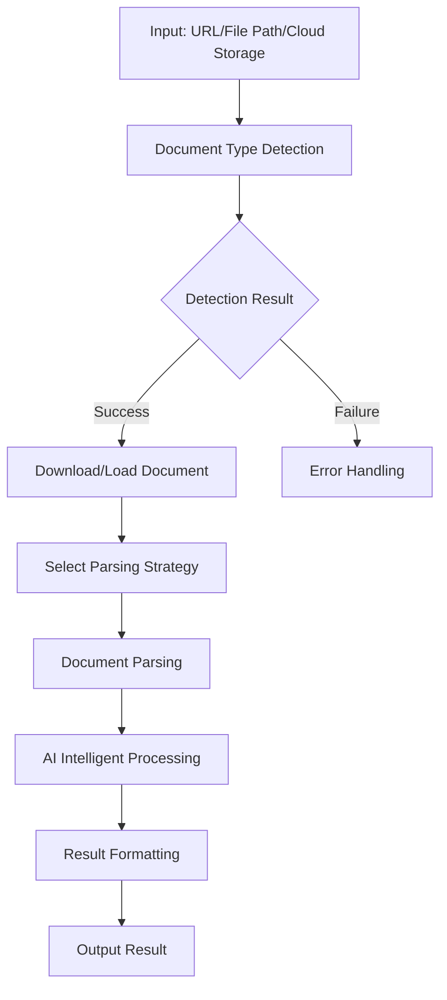

# Document Parser Tool - Modern High-Performance Document Parsing Component

## Overview

Document Parser Tool is a modern, standardized high-performance document parsing component that can parse specified documents (URLs, local files, or cloud storage) through AI instructions. The component first determines the document type, then selects an appropriate parsing strategy based on the type, and finally passes the parsing results to AI for intelligent analysis.

## 🏗️ New Directory Structure

Document processing tools have been moved to a dedicated `docs` directory for clearer structure:

```
aiecs/tools/
├── docs/                              # 📁 Document processing tools directory
│   ├── __init__.py                    # Document tools module initialization
│   ├── document_parser_tool.py        # 🔧 Core document parser tool
│   └── ai_document_orchestrator.py    # 🤖 AI intelligent orchestrator
├── task_tools/                        # 📁 Other task tools
│   ├── chart_tool.py
│   ├── scraper_tool.py
│   └── ...
└── __init__.py                        # Main tool registration
```

## Core Features

### 1. Intelligent Document Type Detection
- **Multiple Detection Mechanisms**: File extension, MIME type, content feature detection
- **High Accuracy**: Combines multiple detection methods, provides confidence scores
- **Supported Formats**: PDF, DOCX, XLSX, PPTX, TXT, HTML, RTF, CSV, JSON, XML, Markdown, images, etc.

### 2. Multi-Source Document Retrieval
- **Cloud Storage Support**: Google Cloud Storage, AWS S3, Azure Blob Storage
- **URL Download**: Supports direct download from HTTP/HTTPS links
- **Local Files**: Process documents in local file system
- **Storage ID**: Supports UUID or custom storage identifiers

### 3. Diverse Parsing Strategies
- **TEXT_ONLY**: Pure text extraction
- **STRUCTURED**: Structured content parsing
- **FULL_CONTENT**: Complete content extraction (default)
- **METADATA_ONLY**: Extract metadata only

### 4. AI Intelligent Orchestration
- **Multiple AI Provider Support**: OpenAI, Google Vertex AI, xAI
- **Intelligent Processing Modes**: Summarize, information extraction, analysis, translation, classification, Q&A
- **Batch Processing**: Supports concurrent processing of multiple documents
- **Custom Workflows**: Can create custom processing flows

### 5.1 High-Performance Architecture
- **Async Processing**: Supports asynchronous operations and concurrent processing
- **Caching Mechanism**: Intelligent caching of parsing results
- **Error Handling**: Comprehensive error handling and retry mechanisms
- **Resource Management**: Automatic cleanup of temporary files

## Architecture Design

### Component Architecture

```
Document Parsing Component (aiecs/tools/docs/)
├── DocumentParserTool           # Core parser tool
│   ├── Document type detector
│   ├── Content parser
│   ├── Metadata extractor
│   └── Output formatter
│
├── AIDocumentOrchestrator       # AI intelligent orchestrator
│   ├── AI provider management
│   ├── Processing template system
│   ├── Batch processing engine
│   └── Result post-processor
│
└── Dependent Tool Integration
    ├── ScraperTool             # URL download
    ├── OfficeTool              # Office document processing
    └── ImageTool               # Image OCR
```

### Workflow



## Usage Methods

### 1. Basic Document Parsing (New Import Path)

```python
# Use new import path
from aiecs.tools.docs.document_parser_tool import DocumentParserTool

# Initialize parser
parser = DocumentParserTool()

# Parse document (supports multiple sources)
result = parser.parse_document(
    source="https://example.com/document.pdf",  # URL
    strategy="full_content",
    output_format="json",
    extract_metadata=True
)

print(f"Document type: {result['document_type']}")
print(f"Content preview: {result['content'][:200]}...")
```

### 1.1 Cloud Storage Document Parsing

```python
# Configure cloud storage support
config = {
    "enable_cloud_storage": True,
    "gcs_bucket_name": "my-documents",
    "gcs_project_id": "my-project"
}

parser = DocumentParserTool(config)

# Support multiple cloud storage formats
cloud_sources = [
    "gs://my-bucket/documents/report.pdf",        # Google Cloud Storage
    "s3://my-bucket/files/presentation.pptx",     # AWS S3  
    "azure://my-container/data/contract.docx",    # Azure Blob
    "cloud://shared/documents/analysis.xlsx",     # Generic cloud storage
    "doc_123456789abcdef",                        # Storage ID
    "a1b2c3d4-e5f6-7890-abcd-ef1234567890"      # UUID storage ID
]

for source in cloud_sources:
    try:
        result = parser.parse_document(source=source)
        print(f"✓ Successfully parsed: {source}")
    except Exception as e:
        print(f"✗ Parsing failed: {source} - {e}")
```

### 2. Document Type Detection

```python
# Detect document type
detection_result = parser.detect_document_type(
    source="https://example.com/unknown_document",
    download_sample=True
)

print(f"Detected type: {detection_result['detected_type']}")
print(f"Confidence: {detection_result['confidence']}")
print(f"Detection methods: {detection_result['detection_methods']}")
```

### 3. AI Intelligent Analysis (New Import Path)

```python
from aiecs.tools.docs.ai_document_orchestrator import AIDocumentOrchestrator

# Initialize AI orchestrator
orchestrator = AIDocumentOrchestrator()

# AI document analysis
result = orchestrator.process_document(
    source="document.pdf",
    processing_mode="summarize",
    ai_provider="openai"
)

print(f"AI Summary: {result['ai_result']['ai_response']}")
```

### 4. Batch Processing

```python
# Batch process multiple documents
batch_result = orchestrator.batch_process_documents(
    sources=[
        "doc1.pdf",
        "https://example.com/doc2.docx",
        "gs://bucket/doc3.txt"  # Cloud storage support
    ],
    processing_mode="analyze",
    max_concurrent=3
)

print(f"Processing successful: {batch_result['successful_documents']}")
print(f"Processing failed: {batch_result['failed_documents']}")
```

### 5. Custom Processing Flow

```python
# Create custom processor
custom_analyzer = orchestrator.create_custom_processor(
    system_prompt="You are a professional legal document analyst",
    user_prompt_template="Analyze the following legal document and extract key information: {content}"
)

# Use custom processor
result = custom_analyzer("legal_document.pdf")
```

## Configuration Options

### DocumentParserTool Configuration

```python
config = {
    "max_file_size": 50 * 1024 * 1024,  # 50MB
    "timeout": 30,
    "default_encoding": "utf-8",
    "max_pages": 1000,
    # Cloud storage configuration
    "enable_cloud_storage": True,
    "gcs_bucket_name": "aiecs-documents",
    "gcs_project_id": "my-project"
}

parser = DocumentParserTool(config)
```

### AIDocumentOrchestrator Configuration

```python
config = {
    "default_ai_provider": "openai",
    "max_chunk_size": 4000,
    "max_concurrent_requests": 5,
    "default_temperature": 0.1,
    "max_tokens": 2000
}

orchestrator = AIDocumentOrchestrator(config)
```

## Supported Document Formats

| Format | Extensions | Parser | Features |
|--------|------------|--------|----------|
| PDF | .pdf | OfficeTool + Custom | Text extraction, page splitting |
| Word | .docx, .doc | OfficeTool | Paragraphs, styles, tables |
| Excel | .xlsx, .xls | OfficeTool | Worksheets, cell data |
| PowerPoint | .pptx, .ppt | OfficeTool | Slides, text, images |
| Plain Text | .txt | Built-in | Encoding detection, line splitting |
| HTML | .html, .htm | BeautifulSoup | Structured parsing, tag extraction |
| Markdown | .md, .markdown | Built-in | Title extraction, structured |
| CSV | .csv | Pandas | Table data, column analysis |
| JSON | .json | Built-in | Structured data parsing |
| XML | .xml | Built-in | Hierarchical structure parsing |
| Images | .jpg, .png, .gif | ImageTool | OCR text recognition |

## Cloud Storage Support

### Supported Cloud Storage Formats

1. **Google Cloud Storage**: `gs://bucket/path/file.pdf`
2. **AWS S3**: `s3://bucket/path/file.pdf`
3. **Azure Blob Storage**: `azure://container/path/file.pdf`
4. **Generic Cloud Storage**: `cloud://path/file.pdf`
5. **Storage ID**: `doc_123456789abcdef`
6. **UUID Identifier**: `a1b2c3d4-e5f6-7890-abcd-ef1234567890`

### Cloud Storage Configuration Examples

```python
# Google Cloud Storage
gcs_config = {
    "enable_cloud_storage": True,
    "gcs_bucket_name": "my-gcs-bucket",
    "gcs_project_id": "my-gcp-project",
    "gcs_location": "US"
}

# AWS S3 (via compatible interface)
s3_config = {
    "enable_cloud_storage": True,
    "gcs_bucket_name": "my-s3-bucket",
    "gcs_project_id": "aws-compat-project"
}

parser = DocumentParserTool(gcs_config)
```

## AI Processing Modes

### 1. Document Summarization (SUMMARIZE)
- Generate concise, informative summaries
- Highlight key points and themes
- Support multiple length settings

### 2. Information Extraction (EXTRACT_INFO)
- Extract specific information based on specified criteria
- Structured data output
- Support custom extraction rules

### 3. Content Analysis (ANALYZE)
- Deep content analysis
- Topic identification, sentiment analysis
- Structure and organization analysis

### 4. Document Translation (TRANSLATE)
- Multi-language translation support
- Preserve original format
- Context-aware translation

### 5. Document Classification (CLASSIFY)
- Automatic document classification
- Confidence scoring
- Custom classification system

### 6. Q&A System (ANSWER_QUESTIONS)
- Answer questions based on document content
- Cite relevant paragraphs
- Support complex reasoning

## Performance Optimization

### 1. Caching Strategy
- Document parsing result caching
- AI response caching
- Type detection result caching

### 2. Concurrent Processing
- Asynchronous I/O operations
- Parallel processing of multiple documents
- Resource pool management

### 3. Memory Management
- Chunk processing for large documents
- Automatic cleanup of temporary files
- Memory usage monitoring

### 4. Error Handling
- Intelligent retry mechanism
- Degradation processing strategy
- Detailed error logging

## Error Handling

### Common Error Types

1. **DocumentParserError**: Basic parsing error
2. **UnsupportedDocumentError**: Unsupported document type
3. **DownloadError**: Document download failure
4. **ParseError**: Parsing process error
5. **AIProviderError**: AI service error
6. **ProcessingError**: Processing flow error

### Error Handling Example

```python
try:
    result = parser.parse_document(source="problematic_doc.pdf")
except UnsupportedDocumentError as e:
    print(f"Unsupported document type: {e}")
except DownloadError as e:
    print(f"Download failed: {e}")
except ParseError as e:
    print(f"Parsing failed: {e}")
except Exception as e:
    print(f"Unknown error: {e}")
```

## Migration Guide

### Migrating from Old Version

If you previously used the old import path, update as follows:

```python
# Old import path (deprecated)
# from aiecs.tools.task_tools.document_parser_tool import DocumentParserTool
# from aiecs.tools.task_tools.ai_document_orchestrator import AIDocumentOrchestrator

# New import path
from aiecs.tools.docs.document_parser_tool import DocumentParserTool
from aiecs.tools.docs.ai_document_orchestrator import AIDocumentOrchestrator

# Or use lazy loading
from aiecs.tools.docs import document_parser_tool, ai_document_orchestrator
```

### Batch Update Script

```bash
# Script to batch update import paths
find . -name "*.py" -exec sed -i 's/from aiecs\.tools\.task_tools\.document_parser_tool/from aiecs.tools.docs.document_parser_tool/g' {} \;
find . -name "*.py" -exec sed -i 's/from aiecs\.tools\.task_tools\.ai_document_orchestrator/from aiecs.tools.docs.ai_document_orchestrator/g' {} \;
```

## Extension Development

### 1. Add New Document Format Support

```python
# Add new parsing method in DocumentParserTool
def _parse_new_format(self, file_path: str, strategy: ParsingStrategy):
    # Implement parsing logic for new format
    pass
```

### 2. Custom AI Processing Templates

```python
# Add new processing template
orchestrator.processing_templates["custom_mode"] = {
    "system_prompt": "Custom system prompt",
    "user_prompt_template": "Custom user prompt template: {content}"
}
```

### 3. Integrate New AI Provider

```python
# Extend AI provider support
def _call_custom_ai_provider(self, prompt: str, params: Dict):
    # Implement custom AI provider call
    pass
```

## Best Practices

### 1. Document Processing
- Detect document type first, then select processing strategy
- Use chunk processing for large documents
- Set reasonable timeout values

### 2. AI Processing
- Select appropriate AI model based on document content
- Use caching to avoid duplicate processing
- Set reasonable concurrency limits

### 3. Error Handling
- Implement comprehensive error handling logic
- Record detailed processing logs
- Provide user-friendly error messages

### 4. Performance Optimization
- Use async processing to improve concurrency performance
- Reasonably configure caching strategies
- Monitor resource usage

## Out-of-the-Box Check

Run the following code to verify if the system is ready to use out of the box:

```python
def system_readiness_check():
    """System readiness check"""
    
    print("🔍 AIECS Document Processing System Readiness Check")
    print("=" * 50)
    
    try:
        # 1. Import test
        from aiecs.tools.docs.document_parser_tool import DocumentParserTool
        from aiecs.tools.docs.ai_document_orchestrator import AIDocumentOrchestrator
        print("✓ Module import successful")
        
        # 2. Initialization test
        parser = DocumentParserTool()
        orchestrator = AIDocumentOrchestrator()
        print("✓ Tool initialization successful")
        
        # 3. Feature check
        print(f"✓ Cloud storage support: {parser.settings.enable_cloud_storage}")
        print(f"✓ AI provider: {orchestrator.settings.default_ai_provider}")
        print(f"✓ Concurrency limit: {orchestrator.settings.max_concurrent_requests}")
        
        # 4. Path check
        source_types = [
            ("Local file", "/tmp/test.txt"),
            ("HTTP URL", "https://example.com/file.pdf"),
            ("Cloud storage GCS", "gs://bucket/file.pdf"),
            ("Cloud storage S3", "s3://bucket/file.pdf"),
            ("Storage ID", "doc_123456")
        ]
        
        for name, source in source_types:
            can_handle = (
                os.path.exists(source) or
                parser._is_url(source) or
                parser._is_cloud_storage_path(source) or
                parser._is_storage_id(source)
            )
            print(f"✓ {name} support: {source}")
        
        print("\n🎉 System fully ready, ready to use out of the box!")
        return True
        
    except Exception as e:
        print(f"✗ System check failed: {e}")
        return False

# Run readiness check
if __name__ == "__main__":
    system_readiness_check()
```

## Quick Start

See the complete quick start guide: `docs/TOOLS_USED_INSTRUCTION/DOCUMENT_PARSER_QUICK_START.md`

## Example Code

- Basic usage example: `examples/document_processing_example.py`
- Cloud storage example: `examples/cloud_storage_document_example.py`

## Future Plans

1. **Enhanced Document Format Support**
   - More Office format support
   - Intelligent chart and table recognition
   - Complex layout document processing

2. **AI Capability Expansion**
   - Multimodal document understanding
   - Document structure reconstruction
   - Intelligent document generation

3. **Performance Optimization**
   - Distributed processing support
   - Streaming processing capability
   - Edge computing support

4. **Enterprise Features**
   - Permission control and security auditing
   - Large-scale batch processing
   - Integrated monitoring and alerting
