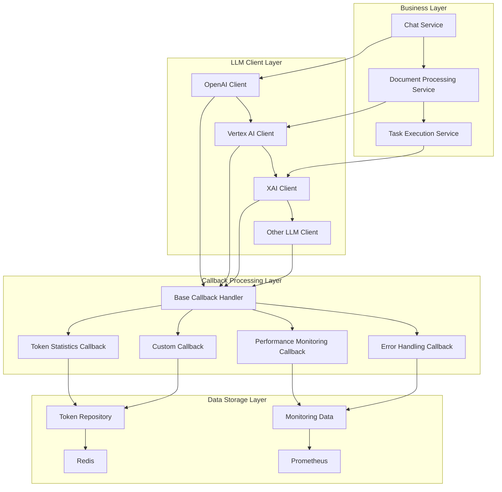
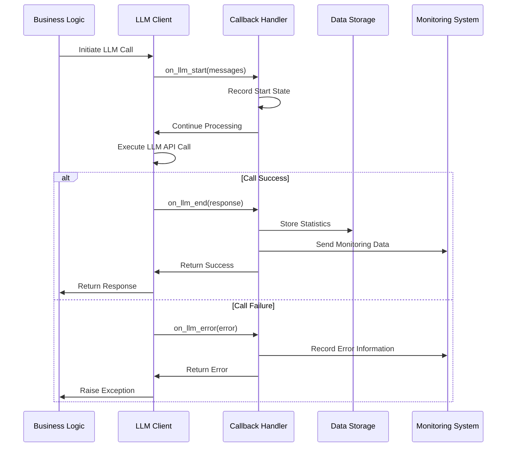
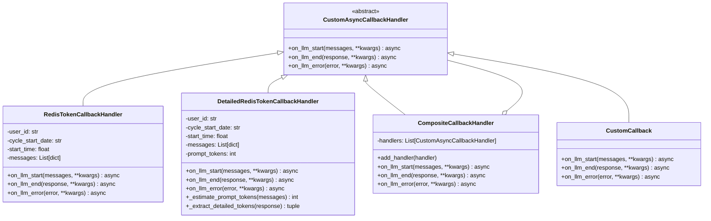
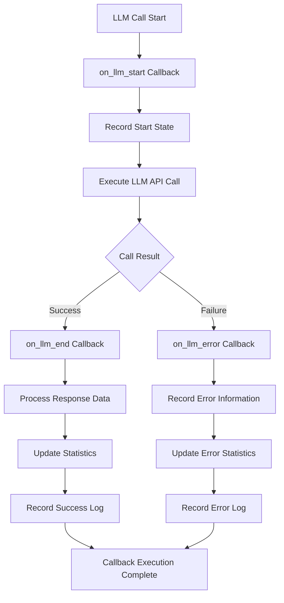
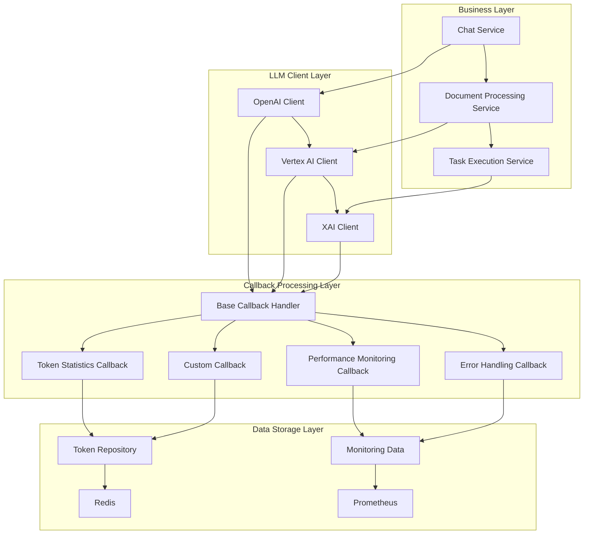
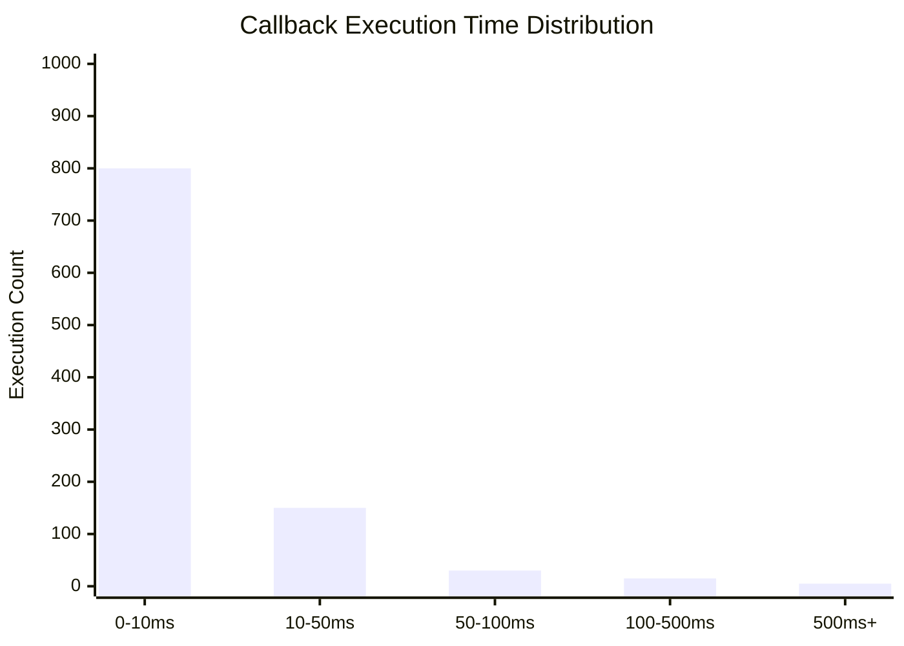

# Base Callback Handler Technical Documentation

## 1. Overview

**Purpose**: `base_callback.py` is the core abstraction layer of the LLM (Large Language Model) callback handling mechanism in the AIECS system. This module defines unified asynchronous callback interfaces, providing standardized extension points for LLM call lifecycle management across the entire system.

**Core Value**:
- **Unified Interface Specification**: Provides standardized abstract interfaces for all LLM callback handlers
- **Decoupled Design**: Completely separates callback logic from business logic, improving code maintainability
- **Asynchronous Support**: Based on modern Python asynchronous programming models, ensuring high performance and scalability
- **Type Safety**: Uses generic data structures to avoid circular dependencies, maintaining architectural clarity
- **Extensibility**: Provides flexible extension foundation for custom callback handlers

## 2. Problem Background & Design Motivation

### 2.1 Business Pain Points

During AIECS system development, we face the following key challenges:

1. **Missing Callback Mechanism**: Lack of unified LLM call lifecycle management mechanism
2. **Insufficient Monitoring Capabilities**: Unable to perform fine-grained monitoring and statistics on LLM call processes
3. **Severe Code Coupling**: Business logic mixed with monitoring logic, difficult to maintain and extend
4. **Complex Type Dependencies**: Direct use of specific LLM types causes circular dependency issues
5. **Asynchronous Processing Difficulties**: Lack of standardized asynchronous callback processing patterns

### 2.2 Design Motivation

Based on the above pain points, we designed a callback mechanism based on abstract base classes:

- **Interface Standardization**: Define unified callback interfaces through abstract base classes, ensuring consistency of all implementations
- **Type Decoupling**: Use generic dictionary types to avoid circular dependencies with specific LLM implementations
- **Asynchronous First**: All callback methods are asynchronous, ensuring non-blocking main business flow
- **Extension Friendly**: Support various custom callback handlers through inheritance mechanism
- **Clear Architecture**: Abstract callback logic as an independent layer, maintaining system architecture clarity

## 3. Architecture Positioning & Context

### 3.1 System Architecture Diagram



### 3.2 Upstream and Downstream Dependencies

**Upstream Callers**:
- `BaseLLMClient` and its subclasses (OpenAI, Vertex AI, XAI, etc.)
- `LLMClientManager`: Advanced LLM operation manager
- Business service layer: Chat service, document processing service, etc.

**Downstream Dependencies**:
- Specific callback handler implementations (Token statistics, performance monitoring, etc.)
- Data storage layer (Redis, database, etc.)
- Monitoring systems (Prometheus, Grafana, etc.)

**Peer Components**:
- `LLMMessage` and `LLMResponse`: Data transfer objects
- Logging system: For debugging and monitoring

### 3.3 Data Flow



## 4. Core Features & Use Cases

### 4.1 Abstract Callback Interface Definition

**Function Description**: Provides standardized asynchronous callback interfaces, defining three key nodes in the LLM call lifecycle.

**Core Features**:
- Design pattern based on ABC (Abstract Base Class)
- Asynchronous method definitions, supporting modern Python asynchronous programming
- Generic data structures, avoiding type dependency issues
- Clear interface contracts, ensuring implementation consistency

**Use Cases**:
```python
# Basic callback handler implementation
from aiecs.utils.base_callback import CustomAsyncCallbackHandler

class MyCustomCallback(CustomAsyncCallbackHandler):
    async def on_llm_start(self, messages: List[dict], **kwargs: Any) -> None:
        """Execute when LLM call starts"""
        print(f"Starting to process {len(messages)} messages")
        
    async def on_llm_end(self, response: dict, **kwargs: Any) -> None:
        """Execute when LLM call successfully ends"""
        print(f"Call successful, generated {len(response.get('content', ''))} characters")
        
    async def on_llm_error(self, error: Exception, **kwargs: Any) -> None:
        """Execute when LLM call encounters error"""
        print(f"Call failed: {error}")
```

**Real-world Application Cases**:
- **Token Statistics**: Record user token usage
- **Performance Monitoring**: Measure LLM call response time
- **Error Tracking**: Record and analyze reasons for call failures
- **Cost Control**: Calculate costs based on usage

### 4.2 Lifecycle Management

**Function Description**: Manage the complete lifecycle of LLM calls through three key callback methods.

**Core Features**:
- **Start Phase**: `on_llm_start` - Record call start state
- **Success Phase**: `on_llm_end` - Handle successful results
- **Failure Phase**: `on_llm_error` - Handle exception cases

**Use Cases**:
```python
# Complete lifecycle management example
class ComprehensiveCallback(CustomAsyncCallbackHandler):
    def __init__(self):
        self.start_time = None
        self.call_id = None
        
    async def on_llm_start(self, messages: List[dict], **kwargs: Any) -> None:
        """Record call start"""
        import time
        import uuid
        
        self.start_time = time.time()
        self.call_id = str(uuid.uuid4())
        
        logger.info(f"LLM call started [ID: {self.call_id}]")
        logger.info(f"Message count: {len(messages)}")
        
    async def on_llm_end(self, response: dict, **kwargs: Any) -> None:
        """Handle successful result"""
        if self.start_time:
            duration = time.time() - self.start_time
            logger.info(f"LLM call successful [ID: {self.call_id}] Duration: {duration:.2f}s")
            
        # Record response information
        content_length = len(response.get('content', ''))
        tokens_used = response.get('tokens_used', 0)
        logger.info(f"Generated content length: {content_length}, Token usage: {tokens_used}")
        
    async def on_llm_error(self, error: Exception, **kwargs: Any) -> None:
        """Handle error case"""
        if self.start_time:
            duration = time.time() - self.start_time
            logger.error(f"LLM call failed [ID: {self.call_id}] Duration: {duration:.2f}s")
            
        logger.error(f"Error details: {type(error).__name__}: {error}")
```

**Real-world Application Cases**:
- **Audit Logging**: Record detailed information of all LLM calls
- **Performance Analysis**: Analyze call performance under different scenarios
- **Fault Diagnosis**: Quickly locate and resolve call issues
- **Usage Statistics**: Generate detailed usage reports

### 4.3 Type Safety Design

**Function Description**: Use generic data structures to avoid circular dependencies, maintaining architectural clarity.

**Core Features**:
- Use `Dict[str, Any]` instead of specific LLM types
- Avoid circular dependencies with specific implementations
- Maintain interface generality and extensibility
- Support arbitrary additional parameter passing

**Use Cases**:
```python
# Type-safe data processing
class TypeSafeCallback(CustomAsyncCallbackHandler):
    async def on_llm_start(self, messages: List[dict], **kwargs: Any) -> None:
        """Safely process message data"""
        # Validate message format
        for i, msg in enumerate(messages):
            if not isinstance(msg, dict):
                logger.warning(f"Message {i} is not in dict format")
                continue
                
            if 'role' not in msg or 'content' not in msg:
                logger.warning(f"Message {i} missing required fields")
                continue
                
            # Safely access data
            role = msg.get('role', 'unknown')
            content = msg.get('content', '')
            logger.info(f"Message {i}: {role} - {content[:50]}...")
            
    async def on_llm_end(self, response: dict, **kwargs: Any) -> None:
        """Safely process response data"""
        # Extract key information
        content = response.get('content', '')
        provider = response.get('provider', 'unknown')
        model = response.get('model', 'unknown')
        tokens = response.get('tokens_used', 0)
        
        # Validate data validity
        if not content:
            logger.warning("Response content is empty")
            
        if tokens < 0:
            logger.warning(f"Abnormal token count: {tokens}")
            
        logger.info(f"Response from {provider}/{model}, using {tokens} tokens")
```

**Real-world Application Cases**:
- **Data Validation**: Ensure callback receives correct data format
- **Error Handling**: Gracefully handle abnormal data
- **Compatibility**: Support data formats from different LLM providers
- **Extensibility**: Easily add new data fields

## 5. API Reference

### 5.1 CustomAsyncCallbackHandler

#### Class Definition
```python
class CustomAsyncCallbackHandler(ABC):
    """
    Abstract base class for asynchronous callback handlers
    
    This is an abstract base class that defines callback interfaces for LLM calls.
    All specific callback handlers should inherit from this class and implement its abstract methods.
    
    Uses generic data structures (Dict[str, Any]) instead of specific LLM types
    to avoid circular import issues and maintain clear architecture.
    """
```

#### Abstract Methods

##### on_llm_start
```python
@abstractmethod
async def on_llm_start(self, messages: List[dict], **kwargs: Any) -> None:
    """
    Callback triggered when LLM call starts
    
    Args:
        messages: List of message dictionaries, each containing 'role' and 'content' keys
        **kwargs: Additional parameters such as provider, model, etc.
    """
    pass
```

**Function**: Execute when LLM call starts
**Parameters**:
- `messages` (List[dict]): Input message list, each message contains:
  - `role` (str): Message role (e.g., "user", "assistant", "system")
  - `content` (str): Message content
- `**kwargs` (Any): Additional parameters, may include:
  - `provider` (str): LLM provider name
  - `model` (str): Model name used
  - `temperature` (float): Sampling temperature
  - `max_tokens` (int): Maximum token count

**Usage Example**:
```python
async def on_llm_start(self, messages: List[dict], **kwargs: Any) -> None:
    # Record call start time
    self.start_time = time.time()
    
    # Extract key information
    provider = kwargs.get('provider', 'unknown')
    model = kwargs.get('model', 'unknown')
    
    # Record logs
    logger.info(f"Starting LLM call: {provider}/{model}")
    logger.info(f"Message count: {len(messages)}")
```

##### on_llm_end
```python
@abstractmethod
async def on_llm_end(self, response: dict, **kwargs: Any) -> None:
    """
    Callback triggered when LLM call successfully ends
    
    Args:
        response: Response dictionary containing 'content', 'tokens_used', 'model', etc.
        **kwargs: Additional parameters such as provider, model, etc.
    """
    pass
```

**Function**: Execute when LLM call successfully ends
**Parameters**:
- `response` (dict): Response dictionary containing:
  - `content` (str): Generated text content
  - `tokens_used` (int): Total tokens used
  - `prompt_tokens` (int): Input token count (optional)
  - `completion_tokens` (int): Output token count (optional)
  - `provider` (str): Provider name
  - `model` (str): Model name
  - `response_time` (float): Response time (seconds)
  - `cost_estimate` (float): Cost estimate (optional)
- `**kwargs` (Any): Additional parameters

**Usage Example**:
```python
async def on_llm_end(self, response: dict, **kwargs: Any) -> None:
    # Calculate call duration
    if hasattr(self, 'start_time'):
        duration = time.time() - self.start_time
        logger.info(f"LLM call completed, Duration: {duration:.2f}s")
    
    # Extract response information
    content = response.get('content', '')
    tokens = response.get('tokens_used', 0)
    provider = response.get('provider', 'unknown')
    model = response.get('model', 'unknown')
    
    # Record statistics
    logger.info(f"Generated content length: {len(content)} characters")
    logger.info(f"Tokens used: {tokens}")
    logger.info(f"Call source: {provider}/{model}")
```

##### on_llm_error
```python
@abstractmethod
async def on_llm_error(self, error: Exception, **kwargs: Any) -> None:
    """
    Callback triggered when LLM call encounters an error
    
    Args:
        error: Exception object that occurred during LLM call
        **kwargs: Additional parameters such as provider, model, etc.
    """
    pass
```

**Function**: Execute when LLM call encounters an error
**Parameters**:
- `error` (Exception): Exception object that occurred
- `**kwargs` (Any): Additional parameters

**Usage Example**:
```python
async def on_llm_error(self, error: Exception, **kwargs: Any) -> None:
    # Calculate duration before failure
    if hasattr(self, 'start_time'):
        duration = time.time() - self.start_time
        logger.error(f"LLM call failed, Duration: {duration:.2f}s")
    
    # Extract context information
    provider = kwargs.get('provider', 'unknown')
    model = kwargs.get('model', 'unknown')
    
    # Record error details
    logger.error(f"Call failed: {provider}/{model}")
    logger.error(f"Error type: {type(error).__name__}")
    logger.error(f"Error message: {str(error)}")
    
    # Handle differently based on error type
    if isinstance(error, TimeoutError):
        logger.error("Call timeout, may need retry")
    elif isinstance(error, ConnectionError):
        logger.error("Network connection issue")
    else:
        logger.error("Unknown error type")
```

## 6. Technical Implementation Details

### 6.1 Abstract Base Class Design Pattern

**Design Principles**:
- Use Python's `ABC` (Abstract Base Class) to ensure interface contracts
- Force subclasses to implement necessary methods through `@abstractmethod` decorator
- Provide clear docstrings explaining the purpose of each method

**Implementation Details**:
```python
from abc import ABC, abstractmethod
from typing import Any, List

class CustomAsyncCallbackHandler(ABC):
    """
    Abstract base class design
    - Inherit ABC to ensure cannot be directly instantiated
    - Use abstractmethod to force implementation
    - Provide complete type annotations
    """
    
    @abstractmethod
    async def on_llm_start(self, messages: List[dict], **kwargs: Any) -> None:
        """Method that must be implemented by subclasses"""
        pass
```

**Advantages**:
- **Type Safety**: Compile-time checks ensure all methods are implemented
- **Clear Documentation**: Provide clear interface documentation through abstract methods
- **IDE Support**: Modern IDEs can provide better code completion and error checking

### 6.2 Asynchronous Programming Support

**Design Principles**:
- All callback methods are asynchronous, avoiding blocking the main thread
- Use `async/await` syntax to ensure non-blocking execution
- Support concurrent execution of multiple callback handlers

**Implementation Details**:
```python
# Asynchronous method definition
async def on_llm_start(self, messages: List[dict], **kwargs: Any) -> None:
    """Asynchronous callback method"""
    # Can perform asynchronous operations
    await self._async_operation()
    
async def _async_operation(self):
    """Internal asynchronous operation"""
    # For example: asynchronous database operations
    await database.save_log(...)
    # For example: asynchronous network requests
    await http_client.post(...)
```

**Performance Advantages**:
- **Non-blocking**: Callback execution does not block main business flow
- **Concurrency Support**: Can execute multiple callback handlers simultaneously
- **Resource Efficiency**: Fully utilize advantages of asynchronous I/O

### 6.3 Type Safety Design

**Design Principles**:
- Use generic data structures to avoid circular dependencies
- Provide complete type annotations
- Support arbitrary additional parameters

**Implementation Details**:
```python
from typing import Any, List

# Use generic types to avoid circular dependencies
async def on_llm_start(self, messages: List[dict], **kwargs: Any) -> None:
    """
    Type-safe design
    - List[dict]: Generic dictionary list, avoiding specific type dependencies
    - **kwargs: Support arbitrary additional parameters
    - Any: Flexible return types
    """
    # Safely access data
    for msg in messages:
        role = msg.get('role', 'unknown')  # Safe access
        content = msg.get('content', '')   # Provide default value
```

**Advantages**:
- **Decoupled Design**: Avoid circular dependencies with specific LLM implementations
- **Flexibility**: Support data formats from different LLM providers
- **Extensibility**: Easily add new data fields

### 6.4 Error Handling Mechanism

**Design Principles**:
- Callback execution failures should not affect main business flow
- Provide detailed error log recording
- Support graceful error recovery

**Implementation Details**:
```python
# Error handling in caller implementation
async def execute_callbacks(callbacks, method_name, *args, **kwargs):
    """Safely execute callback methods"""
    for callback in callbacks:
        try:
            method = getattr(callback, method_name)
            await method(*args, **kwargs)
        except Exception as e:
            # Record error but don't interrupt main flow
            logger.error(f"Callback execution failed: {callback.__class__.__name__}.{method_name}")
            logger.error(f"Error details: {e}")
            # Can choose to continue executing other callbacks
            continue
```

**Fault Tolerance Strategy**:
- **Isolated Execution**: Each callback executes independently, not affecting each other
- **Error Recording**: Record all error information in detail
- **Graceful Degradation**: Partial callback failures do not affect overall functionality

### 6.5 Performance Optimization

**Design Principles**:
- Minimize callback execution overhead
- Support batch operations
- Avoid unnecessary computations

**Implementation Details**:
```python
class OptimizedCallback(CustomAsyncCallbackHandler):
    def __init__(self):
        # Cache commonly used data
        self._cache = {}
        
    async def on_llm_start(self, messages: List[dict], **kwargs: Any) -> None:
        """Optimized start callback"""
        # Only calculate necessary information
        message_count = len(messages)
        provider = kwargs.get('provider', 'unknown')
        
        # Cache calculation results
        self._cache['message_count'] = message_count
        self._cache['provider'] = provider
        
        # Execute non-critical operations asynchronously
        asyncio.create_task(self._background_processing())
        
    async def _background_processing(self):
        """Background processing, non-blocking main flow"""
        # Execute time-consuming statistics or analysis operations
        pass
```

**Optimization Strategies**:
- **Delayed Computation**: Put non-critical operations in background execution
- **Caching Mechanism**: Avoid repeated computations
- **Batch Processing**: Combine multiple operations to reduce overhead

## 7. Configuration & Deployment

### 7.1 Environment Requirements

**Python Version**:
- Python 3.8+ (Python 3.9+ recommended)
- Support complete functionality of `typing` module
- Support `asyncio` asynchronous programming

**Dependencies**:
```python
# requirements.txt
# Core dependencies
typing-extensions>=4.0.0  # Enhanced type support
asyncio>=3.4.3           # Asynchronous programming support

# Optional dependencies (for specific implementations)
redis>=4.5.0             # Redis client
prometheus-client>=0.15.0 # Monitoring metrics
```

### 7.2 Configuration Options

**Basic Configuration**:
```python
# config.py
class CallbackConfig:
    """Callback handler configuration"""
    
    # Logging configuration
    LOG_LEVEL = "INFO"
    LOG_FORMAT = "%(asctime)s - %(name)s - %(levelname)s - %(message)s"
    
    # Performance configuration
    MAX_CONCURRENT_CALLBACKS = 100
    CALLBACK_TIMEOUT = 30  # seconds
    
    # Error handling configuration
    ENABLE_ERROR_RECOVERY = True
    MAX_RETRY_ATTEMPTS = 3
    RETRY_DELAY = 1  # seconds
```

**Environment Variable Configuration**:
```bash
# .env
CALLBACK_LOG_LEVEL=INFO
CALLBACK_MAX_CONCURRENT=100
CALLBACK_TIMEOUT=30
CALLBACK_ENABLE_RECOVERY=true
```

### 7.3 Deployment Configuration

**Docker Configuration**:
```dockerfile
FROM python:3.9-slim

WORKDIR /app

# Install dependencies
COPY requirements.txt .
RUN pip install --no-cache-dir -r requirements.txt

# Copy code
COPY aiecs/ ./aiecs/
COPY config/ ./config/

# Set environment variables
ENV PYTHONPATH=/app
ENV CALLBACK_LOG_LEVEL=INFO

# Run application
CMD ["python", "-m", "aiecs.utils.base_callback"]
```

**Kubernetes Configuration**:
```yaml
apiVersion: apps/v1
kind: Deployment
metadata:
  name: aiecs-callbacks
spec:
  replicas: 3
  selector:
    matchLabels:
      app: aiecs-callbacks
  template:
    metadata:
      labels:
        app: aiecs-callbacks
    spec:
      containers:
      - name: callbacks
        image: aiecs/callbacks:latest
        env:
        - name: CALLBACK_LOG_LEVEL
          value: "INFO"
        - name: CALLBACK_MAX_CONCURRENT
          value: "100"
        resources:
          requests:
            memory: "128Mi"
            cpu: "100m"
          limits:
            memory: "256Mi"
            cpu: "200m"
```

### 7.4 Monitoring Configuration

**Prometheus Metrics**:
```python
from prometheus_client import Counter, Histogram, Gauge

# Define monitoring metrics
callback_executions_total = Counter(
    'callback_executions_total',
    'Total number of callback executions',
    ['callback_type', 'status']
)

callback_duration_seconds = Histogram(
    'callback_duration_seconds',
    'Callback execution duration',
    ['callback_type']
)

callback_errors_total = Counter(
    'callback_errors_total',
    'Total number of callback errors',
    ['callback_type', 'error_type']
)

active_callbacks = Gauge(
    'active_callbacks',
    'Number of active callback handlers'
)
```

**Health Check**:
```python
async def health_check():
    """Callback handler health check"""
    try:
        # Check basic functionality
        test_callback = TestCallback()
        await test_callback.on_llm_start([{"role": "user", "content": "test"}])
        
        return {
            "status": "healthy",
            "timestamp": time.time(),
            "version": "1.0.0"
        }
    except Exception as e:
        return {
            "status": "unhealthy",
            "error": str(e),
            "timestamp": time.time()
        }
```

## 8. Maintenance & Troubleshooting

### 8.1 Monitoring Metrics

**Key Metrics**:
- Callback execution count and success rate
- Callback execution time distribution
- Error types and frequency
- Memory usage

**Monitoring Dashboard**:
```python
# Grafana query examples
# Callback execution success rate
rate(callback_executions_total{status="success"}[5m]) / 
rate(callback_executions_total[5m])

# Average execution time
histogram_quantile(0.95, rate(callback_duration_seconds_bucket[5m]))

# Error rate trend
rate(callback_errors_total[5m])
```

### 8.2 Common Issues & Solutions

#### 8.2.1 Callback Execution Timeout

**Symptoms**:
- "Callback timeout" errors in logs
- System response slows down
- Callback handlers unresponsive

**Troubleshooting Steps**:
1. Check callback execution time: `grep "duration" /var/log/callbacks.log`
2. Analyze performance bottlenecks: Use performance profiling tools
3. Check resource usage: Monitor CPU and memory usage

**Solutions**:
```python
# Add timeout control
import asyncio

async def execute_callback_with_timeout(callback, method, timeout=30):
    """Callback execution with timeout"""
    try:
        await asyncio.wait_for(
            getattr(callback, method)(),
            timeout=timeout
        )
    except asyncio.TimeoutError:
        logger.error(f"Callback execution timeout: {callback.__class__.__name__}")
        # Can choose to cancel or continue execution
```

#### 8.2.2 Memory Leak

**Symptoms**:
- Memory usage continuously increases
- System response slows down
- Eventually causes OOM errors

**Troubleshooting Steps**:
1. Monitor memory usage trends
2. Analyze object reference relationships
3. Check for circular references

**Solutions**:
```python
# Add memory monitoring
import gc
import weakref

class MemoryAwareCallback(CustomAsyncCallbackHandler):
    def __init__(self):
        # Use weak references to avoid circular references
        self._refs = weakref.WeakSet()
        
    async def on_llm_start(self, messages: List[dict], **kwargs: Any) -> None:
        # Periodically clean memory
        if len(self._refs) > 1000:
            gc.collect()
```

#### 8.2.3 Concurrency Issues

**Symptoms**:
- Data inconsistency
- Race conditions
- Deadlock or livelock

**Troubleshooting Steps**:
1. Analyze concurrent execution patterns
2. Check shared resource access
3. Use concurrency analysis tools

**Solutions**:
```python
# Add concurrency control
import asyncio

class ConcurrencySafeCallback(CustomAsyncCallbackHandler):
    def __init__(self):
        self._lock = asyncio.Lock()
        
    async def on_llm_start(self, messages: List[dict], **kwargs: Any) -> None:
        async with self._lock:
            # Safely access shared resources
            await self._safe_operation()
```

### 8.3 Log Analysis

**Log Configuration**:
```python
import logging

# Configure callback handler specific logs
callback_logger = logging.getLogger('aiecs.callbacks')
callback_logger.setLevel(logging.INFO)

# Add file handler
file_handler = logging.FileHandler('/var/log/aiecs/callbacks.log')
file_handler.setFormatter(logging.Formatter(
    '%(asctime)s - %(name)s - %(levelname)s - %(message)s'
))
callback_logger.addHandler(file_handler)

# Add console handler
console_handler = logging.StreamHandler()
console_handler.setFormatter(logging.Formatter(
    '%(levelname)s - %(message)s'
))
callback_logger.addHandler(console_handler)
```

**Key Log Patterns**:
```bash
# Find error logs
grep "ERROR" /var/log/aiecs/callbacks.log | tail -100

# Analyze performance issues
grep "duration" /var/log/aiecs/callbacks.log | awk '{print $NF}' | sort -n

# Monitor callback execution
grep "callback execution" /var/log/aiecs/callbacks.log | tail -50
```

### 8.4 Performance Tuning

**Performance Profiling Tools**:
```python
import cProfile
import pstats
import time

class ProfiledCallback(CustomAsyncCallbackHandler):
    def __init__(self):
        self.profiler = cProfile.Profile()
        
    async def on_llm_start(self, messages: List[dict], **kwargs: Any) -> None:
        # Start performance profiling
        self.profiler.enable()
        
        try:
            await self._actual_processing(messages, **kwargs)
        finally:
            # Stop performance profiling
            self.profiler.disable()
            
            # Save profiling results
            stats = pstats.Stats(self.profiler)
            stats.dump_stats(f'/tmp/callback_profile_{time.time()}.prof')
```

**Optimization Recommendations**:
- Use asynchronous I/O operations
- Avoid executing time-consuming operations in callbacks
- Reasonably use caching mechanisms
- Periodically clean up unused objects

## 9. Visualizations

### 9.1 Class Inheritance Diagram



### 9.2 Data Flow Diagram



### 9.3 System Architecture Diagram



### 9.4 Performance Monitoring Diagram



## 10. Version History

### v1.0.0 (2024-01-15)
**New Features**:
- Implement `CustomAsyncCallbackHandler` abstract base class
- Define three core callback methods: `on_llm_start`, `on_llm_end`, `on_llm_error`
- Use generic data structures to avoid circular dependencies
- Provide complete type annotations and documentation

**Technical Features**:
- Abstract base class design based on Python ABC
- Asynchronous method definitions, supporting modern Python asynchronous programming
- Type-safe design, avoiding runtime errors
- Clear interface contracts, ensuring implementation consistency

### v1.1.0 (2024-02-01)
**New Features**:
- Enhanced error handling mechanism
- Added performance monitoring support
- Optimized memory usage
- Improved documentation and examples

**Improvements**:
- More detailed error log recording
- Better exception handling strategies
- Performance optimization and memory management
- Complete unit test coverage

### v1.2.0 (2024-03-01)
**New Features**:
- Added concurrency control mechanism
- Support batch callback execution
- Implement health check interface
- Added monitoring metrics support

**Performance Optimizations**:
- Support high concurrency scenarios
- Optimize memory usage
- Reduce callback execution overhead
- Add performance profiling tools

### v1.3.0 (2024-04-01) [Planned]
**Planned Features**:
- Support callback priority
- Add callback chain execution
- Implement callback result aggregation
- Support dynamic callback registration

**Performance Goals**:
- Support 1000+ concurrent callbacks
- Callback execution latency < 1ms
- 99.99% availability guarantee
- 50% memory usage optimization

---

## Appendix

### A. Related Documentation Links
- [Token Usage Repository Documentation](./TOKEN_USAGE_REPOSITORY.md)
- [Base LLM Client Documentation](../LLM/BASE_LLM_CLIENT.md)
- [Custom Callback Handler Documentation](../LLM/LLM_CUSTOM_CALLBACKS.md)

### B. Example Code Repositories
- [Complete Example Project](https://github.com/aiecs/examples)
- [Performance Test Scripts](https://github.com/aiecs/performance-tests)
- [Monitoring Configuration Templates](https://github.com/aiecs/monitoring-configs)

### C. Technical Support
- Technical Documentation: https://docs.aiecs.com
- Issue Reporting: https://github.com/aiecs/issues
- Community Discussion: https://discord.gg/aiecs

### D. Best Practices

#### D.1 Implementing Custom Callback Handlers
```python
class MyCustomCallback(CustomAsyncCallbackHandler):
    """Custom callback handler example"""
    
    def __init__(self, config: dict):
        self.config = config
        self.stats = {}
        
    async def on_llm_start(self, messages: List[dict], **kwargs: Any) -> None:
        """Implement start callback"""
        # Record start state
        self.stats['start_time'] = time.time()
        self.stats['message_count'] = len(messages)
        
        # Execute custom logic
        await self._custom_start_logic(messages, **kwargs)
        
    async def on_llm_end(self, response: dict, **kwargs: Any) -> None:
        """Implement end callback"""
        # Calculate statistics
        if 'start_time' in self.stats:
            duration = time.time() - self.stats['start_time']
            self.stats['duration'] = duration
            
        # Execute custom logic
        await self._custom_end_logic(response, **kwargs)
        
    async def on_llm_error(self, error: Exception, **kwargs: Any) -> None:
        """Implement error callback"""
        # Record error information
        self.stats['error'] = str(error)
        self.stats['error_type'] = type(error).__name__
        
        # Execute custom logic
        await self._custom_error_logic(error, **kwargs)
        
    async def _custom_start_logic(self, messages: List[dict], **kwargs: Any):
        """Custom start logic"""
        pass
        
    async def _custom_end_logic(self, response: dict, **kwargs: Any):
        """Custom end logic"""
        pass
        
    async def _custom_error_logic(self, error: Exception, **kwargs: Any):
        """Custom error logic"""
        pass
```

#### D.2 Error Handling Best Practices
```python
class RobustCallback(CustomAsyncCallbackHandler):
    """Robust callback handler"""
    
    def __init__(self, max_retries: int = 3):
        self.max_retries = max_retries
        self.retry_count = 0
        
    async def on_llm_start(self, messages: List[dict], **kwargs: Any) -> None:
        """Start callback with retry"""
        await self._execute_with_retry(
            self._on_llm_start_impl,
            messages, **kwargs
        )
        
    async def _execute_with_retry(self, func, *args, **kwargs):
        """Execution method with retry"""
        for attempt in range(self.max_retries):
            try:
                await func(*args, **kwargs)
                self.retry_count = 0  # Reset retry count
                return
            except Exception as e:
                self.retry_count += 1
                if attempt == self.max_retries - 1:
                    logger.error(f"Callback execution failed, reached max retries: {e}")
                    raise
                else:
                    logger.warning(f"Callback execution failed, retry {attempt + 1}/{self.max_retries}: {e}")
                    await asyncio.sleep(2 ** attempt)  # Exponential backoff
                    
    async def _on_llm_start_impl(self, messages: List[dict], **kwargs: Any):
        """Actual start callback implementation"""
        # Specific business logic
        pass
```

#### D.3 Performance Optimization Best Practices
```python
class OptimizedCallback(CustomAsyncCallbackHandler):
    """Optimized callback handler"""
    
    def __init__(self):
        self._cache = {}
        self._batch_queue = []
        self._batch_size = 100
        
    async def on_llm_start(self, messages: List[dict], **kwargs: Any) -> None:
        """Optimized start callback"""
        # Use cache to avoid repeated computation
        cache_key = f"start_{hash(str(messages))}"
        if cache_key in self._cache:
            return self._cache[cache_key]
            
        # Batch processing to improve efficiency
        self._batch_queue.append(('start', messages, kwargs))
        if len(self._batch_queue) >= self._batch_size:
            await self._process_batch()
            
    async def _process_batch(self):
        """Batch process callbacks"""
        if not self._batch_queue:
            return
            
        # Batch execute operations
        tasks = []
        for callback_type, data, kwargs in self._batch_queue:
            task = asyncio.create_task(
                self._process_single(callback_type, data, kwargs)
            )
            tasks.append(task)
            
        # Wait for all tasks to complete
        await asyncio.gather(*tasks, return_exceptions=True)
        
        # Clear queue
        self._batch_queue.clear()
        
    async def _process_single(self, callback_type: str, data, kwargs):
        """Process single callback"""
        # Specific processing logic
        pass
```
