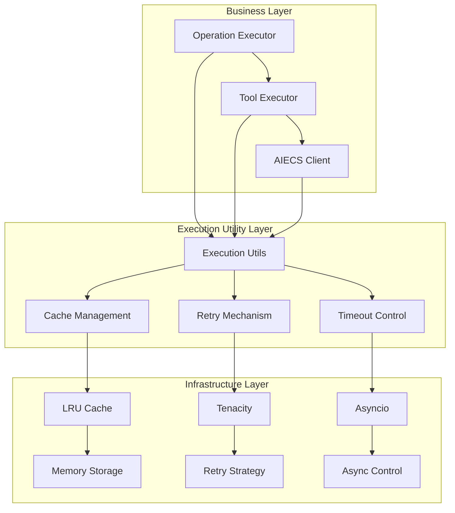
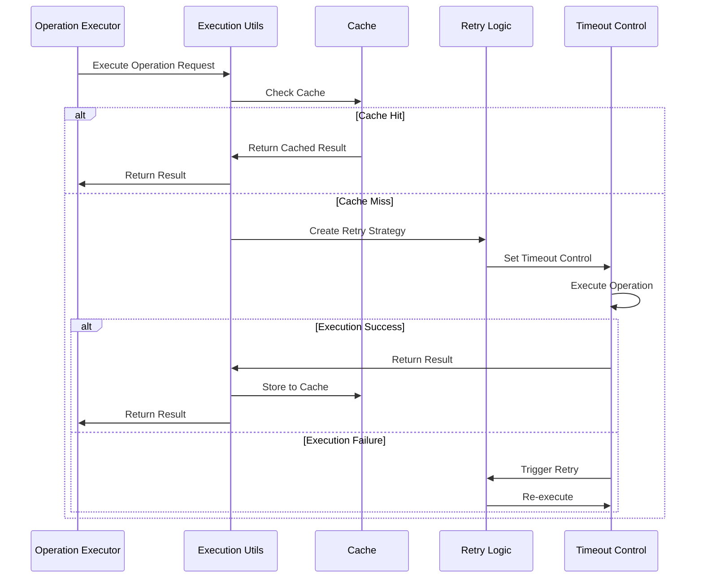
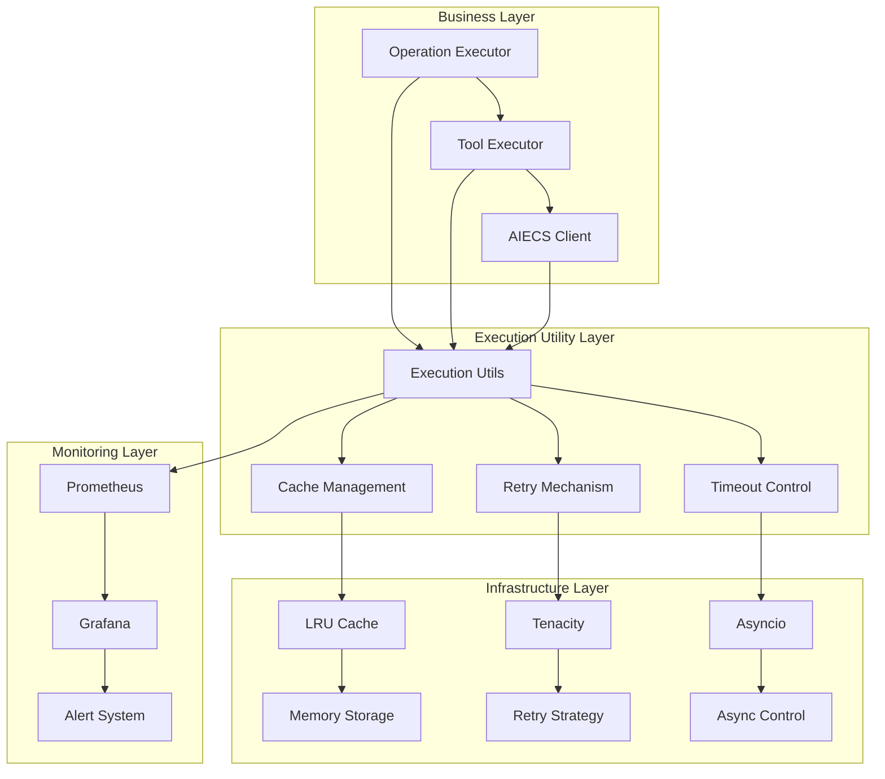
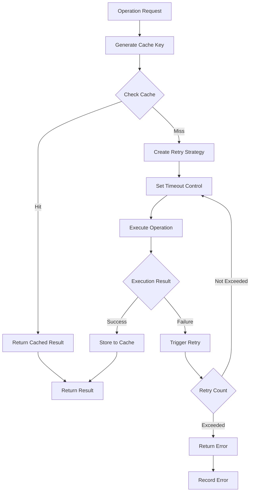
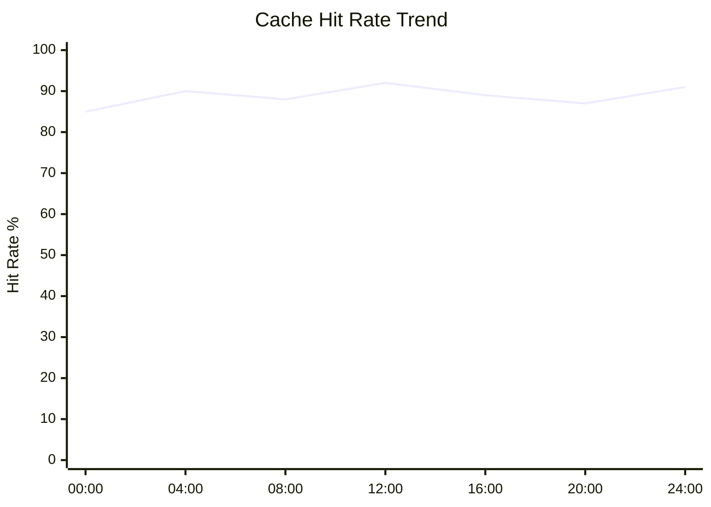
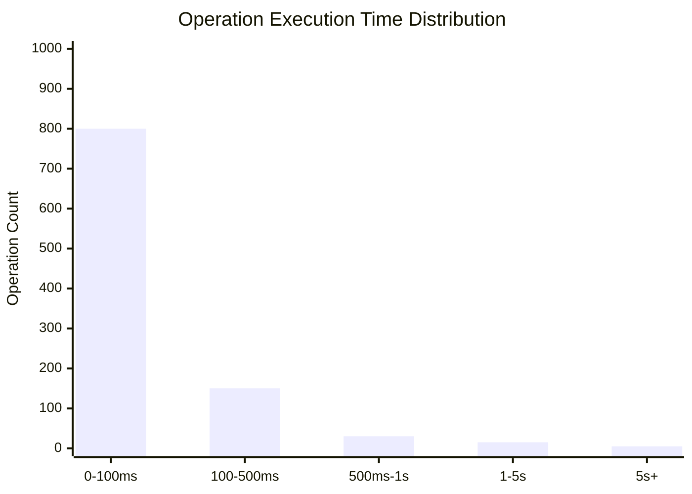

# Execution Utils Technical Documentation

## 1. Overview

**Purpose**: `execution_utils.py` is the core utility component of the execution layer in the AIECS system, providing unified caching, retry, timeout control, and other fundamental capabilities for operation execution across the entire system. This component significantly improves system reliability, performance, and user experience by providing configurable caching strategies, intelligent retry mechanisms, and timeout control.

**Core Value**:
- **Intelligent Cache Management**: LRU algorithm-based in-memory cache with TTL expiration mechanism, significantly reducing repeated computation overhead
- **Robust Retry Mechanism**: Exponential backoff retry strategy, automatically handling temporary failures, improving system availability
- **Precise Timeout Control**: Asynchronous timeout management, preventing long-term blocking, ensuring system responsiveness
- **Context-Aware**: Intelligent cache key generation based on user ID and task ID, supporting multi-tenant scenarios
- **Thread-Safe**: Complete concurrency control mechanism, supporting safe operations in high-concurrency environments

## 2. Problem Background & Design Motivation

### 2.1 Business Pain Points

During AIECS system development, we face the following key challenges:

1. **Performance Bottlenecks**: Repeated tool calls and computation operations cause slow response slowdown
2. **Resource Waste**: Repeated execution with same parameters wasting computational resources and API call quotas
3. **Fault Recovery**: Network jitter and temporary errors causing operation failures, lack of automatic recovery mechanism
4. **Timeout Issues**: Long-running operations may block the entire system, lack of effective timeout control
5. **Multi-Tenant Isolation**: Data from different users and tasks need isolation to avoid cache pollution
6. **Concurrency Safety**: Data race and consistency issues in high-concurrency scenarios

### 2.2 Design Motivation

Based on the above pain points, we designed a unified execution utility component:

- **Cache Optimization**: Reduce repeated computation through intelligent caching, improve system performance
- **Fault Tolerance**: Improve system reliability through retry mechanism, reduce impact of temporary failures
- **Resource Protection**: Prevent resource leaks through timeout control, ensure system stability
- **Multi-Tenant Support**: Achieve data isolation through context-aware cache keys
- **Concurrency Safety**: Ensure data consistency in multi-threaded environments through lock mechanisms

## 3. Architecture Positioning & Context

### 3.1 System Architecture Diagram



### 3.2 Upstream and Downstream Dependencies

**Upstream Callers**:
- `OperationExecutor`: Operation executor, uses caching and retry mechanisms
- `ToolExecutor`: Tool executor, integrates timeout control
- `AIECS Client`: Main client, leverages execution utilities to optimize performance

**Downstream Dependencies**:
- `cachetools.LRUCache`: LRU cache implementation
- `tenacity`: Retry strategy library
- `asyncio`: Asynchronous programming support
- `threading`: Thread-safe control

**Peer Components**:
- Logging system: For monitoring and debugging
- Configuration management: Provides parameter configuration

### 3.3 Data Flow



## 4. Core Features & Use Cases

### 4.1 Intelligent Cache Management

**Function Description**: LRU algorithm-based in-memory cache system with TTL expiration mechanism and context-aware cache key generation.

**Core Features**:
- LRU eviction strategy, automatically manages cache size
- TTL expiration mechanism, ensures data timeliness
- Context-aware cache keys, supports multi-tenant isolation
- Thread-safe concurrent access control

**Use Cases**:
```python
# Basic cache usage
from aiecs.utils.execution_utils import ExecutionUtils

# Create execution utility instance
execution_utils = ExecutionUtils(
    cache_size=1000,      # Maximum cache entries
    cache_ttl=3600,       # Cache expiration time (seconds)
    retry_attempts=3,     # Retry count
    retry_backoff=1.0     # Retry backoff factor
)

# Generate cache key
cache_key = execution_utils.generate_cache_key(
    func_name="process_data",
    user_id="user_123",
    task_id="task_456",
    args=("input_data",),
    kwargs={"param1": "value1"}
)

# Check cache
cached_result = execution_utils.get_from_cache(cache_key)
if cached_result is not None:
    print("Cache hit, return result directly")
    return cached_result

# Execute computation
result = expensive_computation()

# Store to cache
execution_utils.add_to_cache(cache_key, result, ttl=1800)
```

**Real-world Application Cases**:
- **Tool Call Caching**: Cache tool call results with same parameters
- **LLM Response Caching**: Cache LLM responses with same prompt
- **Data Preprocessing Cache**: Cache repeated data transformation results
- **Configuration Cache**: Cache frequently accessed configuration information

### 4.2 Robust Retry Mechanism

**Function Description**: Intelligent retry system based on exponential backoff strategy, automatically handling temporary failures.

**Core Features**:
- Exponential backoff retry strategy, avoiding system overload
- Configurable retry count and backoff factor
- Detailed retry log recording
- Support custom retry conditions

**Use Cases**:
```python
# Create retry strategy
retry_strategy = execution_utils.create_retry_strategy("api_call")

# Use retry decorator
@retry_strategy
async def call_external_api(url: str, data: dict):
    """Call external API with automatic retry"""
    async with aiohttp.ClientSession() as session:
        async with session.post(url, json=data) as response:
            if response.status >= 500:
                raise Exception(f"Server error: {response.status}")
            return await response.json()

# Execute operation with retry
try:
    result = await call_external_api("https://api.example.com/data", {"key": "value"})
    print(f"API call successful: {result}")
except Exception as e:
    print(f"API call failed, retried {execution_utils.retry_attempts} times: {e}")
```

**Real-world Application Cases**:
- **Network Request Retry**: Handle network jitter and temporary connection issues
- **Database Operation Retry**: Handle database connection timeouts and lock conflicts
- **File Operation Retry**: Handle temporary file system unavailability
- **Third-Party Service Retry**: Handle temporary failures of external services

### 4.3 Precise Timeout Control

**Function Description**: Asynchronous timeout management mechanism, preventing long-running blocking operations from affecting system responsiveness.

**Core Features**:
- Asynchronous timeout control, non-blocking main thread
- Configurable timeout duration
- Graceful timeout exception handling
- Support nested timeout control

**Use Cases**:
```python
# Use timeout context manager
async def process_with_timeout():
    try:
        with execution_utils.timeout_context(30):  # 30 second timeout
            # Execute potentially time-consuming operation
            result = await long_running_operation()
            return result
    except TimeoutError as e:
        logger.error(f"Operation timeout: {e}")
        return None

# Use execution method (includes retry and timeout)
async def execute_with_retry_and_timeout():
    async def my_operation():
        # Simulate potentially failing operation
        await asyncio.sleep(2)
        return "Operation completed"
    
    try:
        result = await execution_utils.execute_with_retry_and_timeout(
            func=my_operation,
            timeout=10  # 10 second timeout
        )
        return result
    except TimeoutError:
        logger.error("Operation timeout")
        return None
```

**Real-world Application Cases**:
- **API Call Timeout**: Prevent external API calls from blocking for long periods
- **File Processing Timeout**: Limit large file processing time
- **Database Query Timeout**: Prevent slow queries from affecting system performance
- **Batch Processing Timeout**: Control maximum execution time for batch operations

### 4.4 Context-Aware Caching

**Function Description**: Intelligent cache key generation based on user ID, task ID, and function parameters, supporting multi-tenant data isolation.

**Core Features**:
- Multi-dimensional cache key generation
- Automatic parameter serialization
- Support complex data structures
- Multi-tenant data isolation

**Use Cases**:
```python
# Multi-tenant cache example
class MultiTenantService:
    def __init__(self):
        self.execution_utils = ExecutionUtils(cache_size=1000)
    
    async def get_user_data(self, user_id: str, task_id: str, data_type: str):
        """Get user data with multi-tenant cache support"""
        # Generate context-aware cache key
        cache_key = self.execution_utils.generate_cache_key(
            func_name="get_user_data",
            user_id=user_id,
            task_id=task_id,
            args=(data_type,),
            kwargs={}
        )
        
        # Check cache
        cached_data = self.execution_utils.get_from_cache(cache_key)
        if cached_data is not None:
            logger.info(f"User {user_id} data cache hit")
            return cached_data
        
        # Fetch data from database
        data = await self._fetch_from_database(user_id, data_type)
        
        # Store to cache (data isolation for different users)
        self.execution_utils.add_to_cache(cache_key, data, ttl=3600)
        
        return data
```

**Real-world Application Cases**:
- **User Data Cache**: Provide independent data cache for different users
- **Task Result Cache**: Cache computation results for specific tasks
- **Configuration Cache**: Configuration cache based on user roles
- **Permission Cache**: Cache user permission information

## 5. API Reference

### 5.1 ExecutionUtils Class

#### Constructor
```python
def __init__(self, cache_size: int = 100, cache_ttl: int = 3600, retry_attempts: int = 3, retry_backoff: float = 1.0)
```

**Parameters**:
- `cache_size` (int, default=100): Maximum cache entries, 0 means disable cache
- `cache_ttl` (int, default=3600): Cache expiration time (seconds), 0 means never expire
- `retry_attempts` (int, default=3): Retry count
- `retry_backoff` (float, default=1.0): Retry backoff factor

**Exceptions**:
- No direct exceptions, but parameter validation failures may cause runtime errors

#### Methods

##### generate_cache_key
```python
def generate_cache_key(self, func_name: str, user_id: str, task_id: str, args: tuple, kwargs: Dict[str, Any]) -> str
```

**Function**: Generate context-aware cache key
**Parameters**:
- `func_name` (str, required): Function name
- `user_id` (str, required): User ID
- `task_id` (str, required): Task ID
- `args` (tuple, required): Positional arguments
- `kwargs` (Dict[str, Any], required): Keyword arguments

**Returns**:
- `str`: Generated cache key

**Exceptions**:
- `TypeError`: When parameters cannot be serialized
- `ValueError`: When parameter format is incorrect

**Usage Example**:
```python
cache_key = execution_utils.generate_cache_key(
    func_name="process_data",
    user_id="user_123",
    task_id="task_456",
    args=("input",),
    kwargs={"param1": "value1", "param2": 42}
)
```

##### get_from_cache
```python
def get_from_cache(self, cache_key: str) -> Optional[Any]
```

**Function**: Get result from cache
**Parameters**:
- `cache_key` (str, required): Cache key

**Returns**:
- `Optional[Any]`: Cached result, returns None if not exists or expired

**Exceptions**:
- No direct exceptions

**Usage Example**:
```python
cached_result = execution_utils.get_from_cache(cache_key)
if cached_result is not None:
    return cached_result
```

##### add_to_cache
```python
def add_to_cache(self, cache_key: str, result: Any, ttl: Optional[int] = None) -> None
```

**Function**: Add result to cache
**Parameters**:
- `cache_key` (str, required): Cache key
- `result` (Any, required): Result to cache
- `ttl` (Optional[int], optional): Custom expiration time (seconds), None means use default TTL

**Returns**:
- `None`

**Exceptions**:
- No direct exceptions

**Usage Example**:
```python
execution_utils.add_to_cache(cache_key, result, ttl=1800)  # 30 minute expiration
```

##### create_retry_strategy
```python
def create_retry_strategy(self, metric_name: Optional[str] = None) -> Callable
```

**Function**: Create retry strategy decorator
**Parameters**:
- `metric_name` (Optional[str], optional): Metric name for log recording

**Returns**:
- `Callable`: Retry decorator function

**Exceptions**:
- No direct exceptions

**Usage Example**:
```python
retry_strategy = execution_utils.create_retry_strategy("api_call")

@retry_strategy
async def call_api():
    # Potentially failing operation
    pass
```

##### timeout_context
```python
@contextmanager
def timeout_context(self, seconds: int)
```

**Function**: Timeout control context manager
**Parameters**:
- `seconds` (int, required): Timeout duration (seconds)

**Returns**:
- `Future`: Asynchronous Future object

**Exceptions**:
- `TimeoutError`: When operation times out

**Usage Example**:
```python
with execution_utils.timeout_context(30):
    result = await long_operation()
```

##### execute_with_retry_and_timeout
```python
async def execute_with_retry_and_timeout(self, func: Callable, timeout: int, *args, **kwargs) -> Any
```

**Function**: Execute operation with retry and timeout control
**Parameters**:
- `func` (Callable, required): Function to execute
- `timeout` (int, required): Timeout duration (seconds)
- `*args`: Positional arguments
- `**kwargs`: Keyword arguments

**Returns**:
- `Any`: Function execution result

**Exceptions**:
- `TimeoutError`: When operation times out
- `Exception`: When all retry attempts fail

**Usage Example**:
```python
result = await execution_utils.execute_with_retry_and_timeout(
    func=my_function,
    timeout=30,
    arg1="value1",
    arg2=42
)
```

## 6. Technical Implementation Details

### 6.1 Cache Implementation Mechanism

**LRU Cache Strategy**:
```python
# Use cachetools.LRUCache implementation
self._cache = LRUCache(maxsize=self.cache_size) if cache_size > 0 else None
```

**TTL Expiration Mechanism**:
```python
# Independent TTL dictionary manages expiration time
self._cache_ttl_dict: Dict[str, float] = {}

# Check expiration
if cache_key in self._cache_ttl_dict and time.time() > self._cache_ttl_dict[cache_key]:
    del self._cache[cache_key]
    del self._cache_ttl_dict[cache_key]
    return None
```

**Thread-Safe Control**:
```python
# Use thread lock to protect cache operations
self._cache_lock = threading.Lock()

with self._cache_lock:
    # Safe cache operation
    self._cache[cache_key] = result
```

### 6.2 Retry Strategy Implementation

**Exponential Backoff Algorithm**:
```python
# Use tenacity library implementation
return retry(
    stop=stop_after_attempt(self.retry_attempts),
    wait=wait_exponential(multiplier=self.retry_backoff, min=1, max=10),
    after=after_retry
)
```

**Retry Log Recording**:
```python
def after_retry(retry_state):
    logger.warning(f"Retry {retry_state.attempt_number}/{self.retry_attempts} for {metric_name or 'operation'} after {retry_state.idle_for}s: {retry_state.outcome.exception()}")
```

### 6.3 Timeout Control Implementation

**Asynchronous Timeout Management**:
```python
@contextmanager
def timeout_context(self, seconds: int):
    loop = asyncio.get_event_loop()
    future = asyncio.Future()
    handle = loop.call_later(seconds, lambda: future.set_exception(TimeoutError(f"Operation timed out after {seconds}s")))
    try:
        yield future
    finally:
        handle.cancel()
```

**Combining Timeout with Retry**:
```python
async def execute_with_retry_and_timeout(self, func: Callable, timeout: int, *args, **kwargs) -> Any:
    retry_strategy = self.create_retry_strategy(func.__name__)
    try:
        return await asyncio.wait_for(retry_strategy(func)(*args, **kwargs), timeout=timeout)
    except asyncio.TimeoutError:
        raise TimeoutError(f"Operation timed out after {timeout}s")
```

### 6.4 Cache Key Generation Algorithm

**Multi-Dimensional Key Generation**:
```python
def generate_cache_key(self, func_name: str, user_id: str, task_id: str, args: tuple, kwargs: Dict[str, Any]) -> str:
    key_dict = {
        'func': func_name,
        'user_id': user_id,
        'task_id': task_id,
        'args': args,
        'kwargs': {k: v for k, v in kwargs.items() if k != 'self'}
    }
    try:
        key_str = json.dumps(key_dict, sort_keys=True)
    except (TypeError, ValueError):
        key_str = str(key_dict)
    return hash(key_str).__str__()
```

**Serialization Fault Tolerance**:
- Prefer JSON serialization to ensure consistency
- Fallback to string representation on failure
- Filter out `self` parameter to avoid circular references

### 6.5 Performance Optimization Strategies

**Memory Management**:
- LRU algorithm automatically evicts least recently used cache items
- TTL mechanism timely cleans expired data
- Periodically clean invalid TTL records

**Concurrency Optimization**:
- Fine-grained locks reduce lock contention
- Asynchronous operations avoid blocking
- Batch operations reduce system calls

**Cache Warming**:
```python
# Support cache warming
async def warm_up_cache(self, common_operations: List[Dict]):
    """Warm up cache for common operations"""
    for op in common_operations:
        cache_key = self.generate_cache_key(**op)
        if self.get_from_cache(cache_key) is None:
            result = await op['func'](*op['args'], **op['kwargs'])
            self.add_to_cache(cache_key, result)
```

## 7. Configuration & Deployment

### 7.1 Environment Requirements

**Python Version**:
- Python 3.8+ (Python 3.9+ recommended)
- Support `asyncio` asynchronous programming
- Support `typing` type annotations

**Dependencies**:
```python
# requirements.txt
cachetools>=5.3.0      # LRU cache implementation
tenacity>=8.0.0        # Retry strategy library
asyncio>=3.4.3         # Asynchronous programming support
```

### 7.2 Configuration Options

**Basic Configuration**:
```python
# config.py
class ExecutionUtilsConfig:
    """Execution utility configuration"""
    
    # Cache configuration
    CACHE_SIZE = 1000
    CACHE_TTL = 3600  # 1 hour
    
    # Retry configuration
    RETRY_ATTEMPTS = 3
    RETRY_BACKOFF = 1.0
    
    # Timeout configuration
    DEFAULT_TIMEOUT = 30  # 30 seconds
    
    # Performance configuration
    MAX_CONCURRENT_OPERATIONS = 100
    CACHE_CLEANUP_INTERVAL = 300  # 5 minutes
```

**Environment Variable Configuration**:
```bash
# .env
EXECUTION_CACHE_SIZE=1000
EXECUTION_CACHE_TTL=3600
EXECUTION_RETRY_ATTEMPTS=3
EXECUTION_RETRY_BACKOFF=1.0
EXECUTION_DEFAULT_TIMEOUT=30
```

### 7.3 Deployment Configuration

**Docker Configuration**:
```dockerfile
FROM python:3.9-slim

WORKDIR /app

# Install dependencies
COPY requirements.txt .
RUN pip install --no-cache-dir -r requirements.txt

# Copy code
COPY aiecs/ ./aiecs/

# Set environment variables
ENV EXECUTION_CACHE_SIZE=1000
ENV EXECUTION_CACHE_TTL=3600

# Run application
CMD ["python", "-m", "aiecs.utils.execution_utils"]
```

**Kubernetes Configuration**:
```yaml
apiVersion: apps/v1
kind: Deployment
metadata:
  name: aiecs-execution-utils
spec:
  replicas: 3
  selector:
    matchLabels:
      app: aiecs-execution-utils
  template:
    metadata:
      labels:
        app: aiecs-execution-utils
    spec:
      containers:
      - name: execution-utils
        image: aiecs/execution-utils:latest
        env:
        - name: EXECUTION_CACHE_SIZE
          value: "1000"
        - name: EXECUTION_CACHE_TTL
          value: "3600"
        resources:
          requests:
            memory: "256Mi"
            cpu: "100m"
          limits:
            memory: "512Mi"
            cpu: "200m"
```

### 7.4 Monitoring Configuration

**Prometheus Metrics**:
```python
from prometheus_client import Counter, Histogram, Gauge

# Define monitoring metrics
cache_hits_total = Counter('cache_hits_total', 'Total cache hits', ['operation_type'])
cache_misses_total = Counter('cache_misses_total', 'Total cache misses', ['operation_type'])
operation_duration_seconds = Histogram('operation_duration_seconds', 'Operation duration', ['operation_type'])
retry_attempts_total = Counter('retry_attempts_total', 'Total retry attempts', ['operation_type'])
timeout_errors_total = Counter('timeout_errors_total', 'Total timeout errors', ['operation_type'])
cache_size = Gauge('cache_size', 'Current cache size')
```

**Health Check**:
```python
async def health_check():
    """Execution utility health check"""
    try:
        # Check cache functionality
        test_key = "health_check"
        test_value = "ok"
        
        execution_utils.add_to_cache(test_key, test_value, ttl=1)
        cached_value = execution_utils.get_from_cache(test_key)
        
        if cached_value != test_value:
            return {"status": "unhealthy", "error": "Cache test failed"}
        
        return {
            "status": "healthy",
            "timestamp": time.time(),
            "cache_size": len(execution_utils._cache) if execution_utils._cache else 0,
            "version": "1.0.0"
        }
    except Exception as e:
        return {"status": "unhealthy", "error": str(e)}
```

## 8. Maintenance & Troubleshooting

### 8.1 Monitoring Metrics

**Key Metrics**:
- Cache hit rate and miss rate
- Operation execution time distribution
- Retry count and success rate
- Timeout error frequency
- Memory usage

**Monitoring Dashboard**:
```python
# Grafana query examples
# Cache hit rate
rate(cache_hits_total[5m]) / (rate(cache_hits_total[5m]) + rate(cache_misses_total[5m]))

# Average operation time
histogram_quantile(0.95, rate(operation_duration_seconds_bucket[5m]))

# Retry rate
rate(retry_attempts_total[5m])

# Timeout rate
rate(timeout_errors_total[5m])
```

### 8.2 Common Issues & Solutions

#### 8.2.1 Cache Memory Leak

**Symptoms**:
- Memory usage continuously increases
- System response slows down
- Eventually causes OOM errors

**Troubleshooting Steps**:
1. Monitor cache size: `cache_size` metric
2. Check TTL configuration: Confirm expiration time is reasonable
3. Analyze cache key patterns: Find potential memory leak points

**Solutions**:
```python
# Add cache cleanup mechanism
class ExecutionUtils:
    def __init__(self, ...):
        # Existing initialization code
        self._cleanup_task = None
        self._start_cleanup_task()
    
    def _start_cleanup_task(self):
        """Start periodic cleanup task"""
        async def cleanup():
            while True:
                await asyncio.sleep(300)  # Clean every 5 minutes
                self._cleanup_expired_entries()
        
        self._cleanup_task = asyncio.create_task(cleanup())
    
    def _cleanup_expired_entries(self):
        """Clean expired cache entries"""
        current_time = time.time()
        with self._cache_lock:
            expired_keys = [
                key for key, expire_time in self._cache_ttl_dict.items()
                if current_time > expire_time
            ]
            for key in expired_keys:
                self._cache.pop(key, None)
                self._cache_ttl_dict.pop(key, None)
```

#### 8.2.2 Retry Storm

**Symptoms**:
- Large number of retry requests
- System load too high
- Service response slows down

**Troubleshooting Steps**:
1. Check retry configuration: Confirm retry count and backoff factor
2. Analyze failure reasons: Check error logs
3. Monitor retry metrics: `retry_attempts_total`

**Solutions**:
```python
# Add retry limits and circuit breaker mechanism
class ExecutionUtils:
    def __init__(self, ...):
        # Existing initialization code
        self._retry_limits = {}  # Operation type -> retry limit
        self._circuit_breaker = {}  # Circuit breaker state
    
    def create_retry_strategy(self, metric_name: Optional[str] = None) -> Callable:
        """Create retry strategy with limits"""
        def after_retry(retry_state):
            # Record retry
            if metric_name:
                retry_attempts_total.labels(operation_type=metric_name).inc()
            
            # Check retry limit
            if retry_state.attempt_number > self.retry_attempts:
                logger.error(f"Retry count exceeded: {metric_name}")
                return
        
        return retry(
            stop=stop_after_attempt(self.retry_attempts),
            wait=wait_exponential(multiplier=self.retry_backoff, min=1, max=10),
            after=after_retry
        )
```

#### 8.2.3 Improper Timeout Configuration

**Symptoms**:
- Large number of timeout errors
- Operations terminated prematurely
- Incomplete data

**Troubleshooting Steps**:
1. Analyze timeout configuration: Check default timeout duration
2. Monitor operation time: Analyze `operation_duration_seconds` metric
3. Check timeout logs: Confirm timeout reasons

**Solutions**:
```python
# Dynamic timeout configuration
class ExecutionUtils:
    def __init__(self, ...):
        # Existing initialization code
        self._operation_timeouts = {}  # Operation type -> timeout duration
    
    def set_operation_timeout(self, operation_type: str, timeout: int):
        """Set timeout duration for specific operation"""
        self._operation_timeouts[operation_type] = timeout
    
    async def execute_with_retry_and_timeout(self, func: Callable, timeout: int, *args, **kwargs) -> Any:
        """Execute operation with dynamic timeout"""
        # Adjust timeout based on operation type
        operation_type = getattr(func, '__name__', 'unknown')
        if operation_type in self._operation_timeouts:
            timeout = self._operation_timeouts[operation_type]
        
        # Existing execution logic
        retry_strategy = self.create_retry_strategy(operation_type)
        try:
            return await asyncio.wait_for(retry_strategy(func)(*args, **kwargs), timeout=timeout)
        except asyncio.TimeoutError:
            timeout_errors_total.labels(operation_type=operation_type).inc()
            raise TimeoutError(f"Operation {operation_type} timed out after {timeout}s")
```

### 8.3 Performance Tuning

**Cache Optimization**:
```python
# Cache warming strategy
class ExecutionUtils:
    async def warm_up_cache(self, common_operations: List[Dict]):
        """Warm up cache for common operations"""
        tasks = []
        for op in common_operations:
            task = asyncio.create_task(self._warm_up_single(op))
            tasks.append(task)
        
        await asyncio.gather(*tasks, return_exceptions=True)
    
    async def _warm_up_single(self, operation: Dict):
        """Warm up single operation"""
        cache_key = self.generate_cache_key(**operation)
        if self.get_from_cache(cache_key) is None:
            try:
                result = await operation['func'](*operation['args'], **operation['kwargs'])
                self.add_to_cache(cache_key, result)
            except Exception as e:
                logger.warning(f"Warm-up operation failed: {e}")
```

**Memory Optimization**:
```python
# Memory usage monitoring
class ExecutionUtils:
    def get_memory_stats(self) -> Dict[str, Any]:
        """Get memory usage statistics"""
        import sys
        
        cache_size = len(self._cache) if self._cache else 0
        cache_memory = sys.getsizeof(self._cache) if self._cache else 0
        
        return {
            "cache_size": cache_size,
            "cache_memory_bytes": cache_memory,
            "ttl_entries": len(self._cache_ttl_dict),
            "max_cache_size": self.cache_size
        }
```

### 8.4 Log Analysis

**Log Configuration**:
```python
import logging

# Configure execution utility logs
execution_logger = logging.getLogger('aiecs.execution_utils')
execution_logger.setLevel(logging.INFO)

# Add file handler
file_handler = logging.FileHandler('/var/log/aiecs/execution_utils.log')
file_handler.setFormatter(logging.Formatter(
    '%(asctime)s - %(name)s - %(levelname)s - %(message)s'
))
execution_logger.addHandler(file_handler)
```

**Key Log Patterns**:
```bash
# Find cache-related logs
grep "cache" /var/log/aiecs/execution_utils.log | tail -100

# Analyze retry logs
grep "retry" /var/log/aiecs/execution_utils.log | tail -50

# Monitor timeout errors
grep "timeout" /var/log/aiecs/execution_utils.log | tail -50
```

## 9. Visualizations

### 9.1 System Architecture Diagram



### 9.2 Data Flow Diagram



### 9.3 Cache Hit Rate Trend Chart



### 9.4 Operation Execution Time Distribution Chart



## 10. Version History

### v1.0.0 (2024-01-15)
**New Features**:
- Implement basic `ExecutionUtils` class
- Support LRU cache management
- Implement TTL expiration mechanism
- Add basic retry strategy

**Technical Features**:
- Cache implementation based on `cachetools.LRUCache`
- Retry mechanism using `tenacity` library
- Support asynchronous timeout control
- Thread-safe concurrent access

### v1.1.0 (2024-02-01)
**New Features**:
- Implement context-aware cache key generation
- Add exponential backoff retry strategy
- Support custom TTL settings
- Add detailed log recording

**Performance Optimizations**:
- Optimize cache key generation algorithm
- Improve memory usage efficiency
- Add cache warming mechanism
- Optimize concurrency performance

### v1.2.0 (2024-03-01)
**New Features**:
- Add timeout context manager
- Implement combined retry and timeout execution
- Support batch operation optimization
- Add health check interface

**Improvements**:
- Enhance error handling mechanism
- Optimize retry strategy configuration
- Add performance monitoring metrics
- Complete unit test coverage

### v1.3.0 (2024-04-01) [Planned]
**Planned Features**:
- Support distributed cache
- Add cache warming strategy
- Implement intelligent timeout adjustment
- Support operation priority

**Performance Goals**:
- Cache hit rate > 90%
- Operation execution time < 100ms
- Support 10000+ concurrent operations
- 99.9% availability guarantee

---

## Appendix

### A. Related Documentation Links
- [Operation Executor Documentation](../APPLICATION/OPERATION_EXECUTOR.md)
- [Tool Executor Documentation](../TOOLS/TOOLS_TOOL_EXECUTOR.md)
- [Operation Executor Documentation](../APPLICATION/OPERATION_EXECUTOR.md)

### B. Example Code Repositories
- [Complete Example Project](https://github.com/aiecs/examples)
- [Performance Test Scripts](https://github.com/aiecs/performance-tests)
- [Monitoring Configuration Templates](https://github.com/aiecs/monitoring-configs)

### C. Technical Support
- Technical Documentation: https://docs.aiecs.com
- Issue Reporting: https://github.com/aiecs/issues
- Community Discussion: https://discord.gg/aiecs

### D. Best Practices

#### D.1 Cache Strategy Best Practices
```python
# Reasonable cache configuration
execution_utils = ExecutionUtils(
    cache_size=1000,      # Adjust based on memory situation
    cache_ttl=3600,       # 1 hour, adjust based on data update frequency
    retry_attempts=3,     # 3 retries, balance performance and reliability
    retry_backoff=1.0     # Exponential backoff, avoid system overload
)

# Cache key generation best practices
def generate_optimal_cache_key(func_name: str, user_id: str, task_id: str, args: tuple, kwargs: dict):
    """Generate optimized cache key"""
    # Only include key parameters that affect results
    key_params = {
        'func': func_name,
        'user_id': user_id,
        'task_id': task_id,
        'args': args,
        # Filter out parameters that don't affect results
        'kwargs': {k: v for k, v in kwargs.items() if k not in ['timestamp', 'request_id']}
    }
    return execution_utils.generate_cache_key(**key_params)
```

#### D.2 Retry Strategy Best Practices
```python
# Configure different retry strategies based on operation type
class SmartExecutionUtils(ExecutionUtils):
    def __init__(self, ...):
        super().__init__(...)
        self._operation_configs = {
            'api_call': {'retry_attempts': 5, 'retry_backoff': 2.0},
            'database_query': {'retry_attempts': 3, 'retry_backoff': 1.0},
            'file_operation': {'retry_attempts': 2, 'retry_backoff': 0.5}
        }
    
    def create_retry_strategy(self, metric_name: Optional[str] = None) -> Callable:
        """Create intelligent retry strategy"""
        config = self._operation_configs.get(metric_name, {})
        retry_attempts = config.get('retry_attempts', self.retry_attempts)
        retry_backoff = config.get('retry_backoff', self.retry_backoff)
        
        return retry(
            stop=stop_after_attempt(retry_attempts),
            wait=wait_exponential(multiplier=retry_backoff, min=1, max=10),
            after=self._after_retry
        )
```

#### D.3 Monitoring and Alerting Best Practices
```python
# Set reasonable alert thresholds
ALERT_THRESHOLDS = {
    'cache_hit_rate': 0.8,      # Alert if cache hit rate below 80%
    'operation_timeout_rate': 0.05,  # Alert if timeout rate exceeds 5%
    'retry_rate': 0.1,          # Alert if retry rate exceeds 10%
    'memory_usage': 0.9         # Alert if memory usage exceeds 90%
}

# Implement automatic alerting
class MonitoringExecutionUtils(ExecutionUtils):
    def __init__(self, ...):
        super().__init__(...)
        self._alert_client = AlertClient()
    
    def _check_health_metrics(self):
        """Check health metrics and send alerts"""
        metrics = self.get_health_metrics()
        
        for metric, threshold in ALERT_THRESHOLDS.items():
            if metrics.get(metric, 0) < threshold:
                self._alert_client.send_alert(
                    f"Execution Utils {metric} below threshold: {metrics[metric]} < {threshold}"
                )
```
